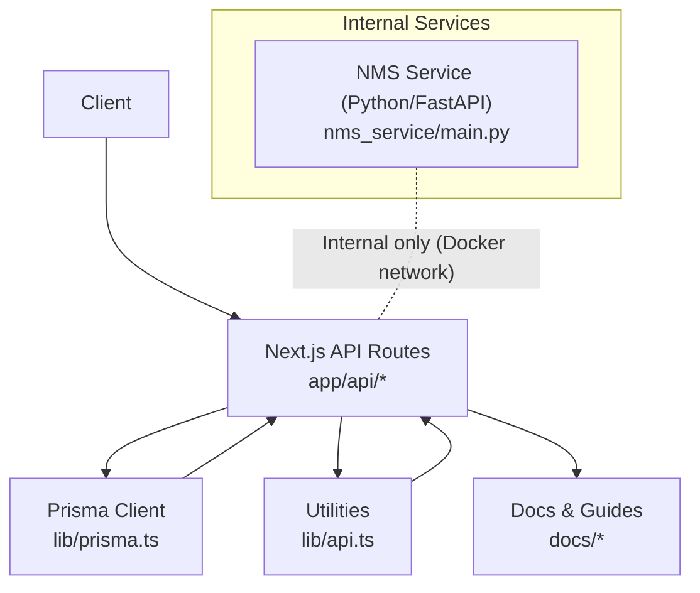
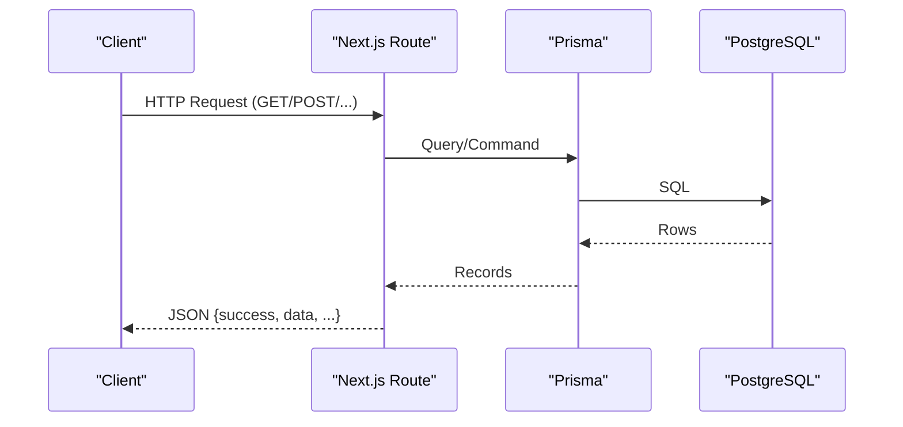
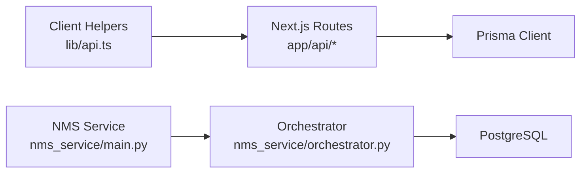

# API Endpoints & Services

<cite>
**Referenced Files in This Document**
- [README.md](file://README.md)
- [package.json](file://package.json)
- [lib/api.ts](file://lib/api.ts)
- [lib/prisma.ts](file://lib/prisma.ts)
- [lib/alarm-scheduler.ts](file://lib/alarm-scheduler.ts)
- [lib/topology/index.ts](file://lib/topology/index.ts)
- [nms_service/main.py](file://nms_service/main.py)
- [nms_service/orchestrator.py](file://nms_service/orchestrator.py)
- [app/api/organizations/route.ts](file://app/api/organizations/route.ts)
- [app/api/buildings/route.ts](file://app/api/buildings/route.ts)
- [app/api/devices/route.ts](file://app/api/devices/route.ts)
- [app/api/services/route.ts](file://app/api/services/route.ts)
- [app/api/floors/route.ts](file://app/api/floors/route.ts)
- [app/api/rooms/route.ts](file://app/api/rooms/route.ts)
- [app/api/racks/route.ts](file://app/api/racks/route.ts)
- [app/api/network-connections/route.ts](file://app/api/network-connections/route.ts)
- [app/api/topology/route.ts](file://app/api/topology/route.ts)
- [app/api/integrations/nms/route.ts](file://app/api/integrations/nms/route.ts)
- [app/api/integrations/nms/discovery/route.ts](file://app/api/integrations/nms/discovery/route.ts)
- [app/api/integrations/nms/discovery/[scanId]/route.ts](file://app/api/integrations/nms/discovery/[scanId]/route.ts)
- [app/api/integrations/nms/discovery/[scanId]/import/route.ts](file://app/api/integrations/nms/discovery/[scanId]/import/route.ts)
- [app/api/integrations/nms/devices/route.ts](file://app/api/integrations/nms/devices/route.ts)
- [app/api/integrations/nms/devices/[id]/route.ts](file://app/api/integrations/nms/devices/[id]/route.ts)
- [app/api/integrations/nms/devices/[id]/backups/route.ts](file://app/api/integrations/nms/devices/[id]/backups/route.ts)
- [app/api/integrations/nms/devices/[id]/backups/[backupId]/route.ts](file://app/api/integrations/nms/devices/[id]/backups/[backupId]/route.ts)
- [app/api/integrations/nms/devices/[id]/ports/[portName]/route.ts](file://app/api/integrations/nms/devices/[id]/ports/[portName]/route.ts)
- [app/api/integrations/nms/devices/[id]/ports/[portName]/monitored/route.ts](file://app/api/integrations/nms/devices/[id]/ports/[portName]/monitored/route.ts)
- [app/api/integrations/nms/alarms/route.ts](file://app/api/integrations/nms/alarms/route.ts)
- [app/api/integrations/nms/network-devices/route.ts](file://app/api/integrations/nms/network-devices/route.ts)
- [app/api/integrations/nms/network-devices/[id]/route.ts](file://app/api/integrations/nms/network-devices/[id]/route.ts)
- [app/api/integrations/fortianalyzer/route.ts](file://app/api/integrations/fortianalyzer/route.ts)
- [app/api/integrations/fortianalyzer/mire/route.ts](file://app/api/integrations/fortianalyzer/mire/route.ts)
- [app/api/integrations/fortigate/route.ts](file://app/api/integrations/fortigate/route.ts)
- [app/api/integrations/zabbix/route.ts](file://app/api/integrations/zabbix/route.ts)
- [app/api/integrations/vmware/route.ts](file://app/api/integrations/vmware/route.ts)
- [app/api/integrations/status/route.ts](file://app/api/integrations/status/route.ts)
- [app/api/health/route.ts](file://app/api/health/route.ts)
- [app/api/health/alarms/route.ts](file://app/api/health/alarms/route.ts)
- [app/api/security/quarantine/route.ts](file://app/api/security/quarantine/route.ts)
- [app/api/security/risky-rules/route.ts](file://app/api/security/risky-rules/route.ts)
- [app/api/users/route.ts](file://app/api/users/route.ts)
- [docs/API_TESTING_GUIDE.md](file://docs/API_TESTING_GUIDE.md)
- [docs/QUICK_START_TESTING.md](file://docs/QUICK_START_TESTING.md)
- [ALARM_PERFORMANCE_OPTIMIZATION.md](file://ALARM_PERFORMANCE_OPTIMIZATION.md)
</cite>

## Table of Contents
1. [Introduction](#introduction)
2. [Project Structure](#project-structure)
3. [Core Components](#core-components)
4. [Architecture Overview](#architecture-overview)
5. [Detailed Component Analysis](#detailed-component-analysis)
6. [Dependency Analysis](#dependency-analysis)
7. [Performance Considerations](#performance-considerations)
8. [Troubleshooting Guide](#troubleshooting-guide)
9. [Conclusion](#conclusion)
10. [Appendices](#appendices)

## Introduction
This document describes the InfraScope RESTful API surface for public and internal services. It covers:
- Public endpoints for organizations, buildings, devices, services, floors, rooms, racks, network connections, topology, integrations, health, security, and users.
- Internal service endpoints for network monitoring and discovery (NMS service).
- Request/response schemas, HTTP methods, URL patterns, authentication, error handling, status codes, and practical examples.
- API versioning, rate limiting, security considerations, testing strategies, and performance optimization tips.

## Project Structure
The API is implemented as Next.js App Router handlers under app/api. Data access uses Prisma ORM. Public API endpoints are exposed to clients; internal services (NMS) run separately and are intended for backend-to-backend communication.

**Diagram sources**
- [lib/prisma.ts:10-20](file://lib/prisma.ts#L10-L20)
- [lib/api.ts:1-57](file://lib/api.ts#L1-L57)
- [nms_service/main.py:39-43](file://nms_service/main.py#L39-L43)

**Section sources**
- [lib/prisma.ts:10-20](file://lib/prisma.ts#L10-L20)
- [lib/api.ts:1-57](file://lib/api.ts#L1-L57)
- [nms_service/main.py:39-43](file://nms_service/main.py#L39-L43)

## Core Components
- Public REST API: Implemented as Next.js App Router handlers returning JSON with standardized success/error envelopes.
- Data persistence: Prisma Client singleton configured with environment-aware logging.
- Client-side API helpers: Axios-based wrappers for GET/POST/PUT/DELETE with unified error handling.
- Internal NMS service: FastAPI service for SNMP/SSH polling, backups, discovery, and topology retrieval.

Key behaviors:
- Standardized response envelope: success flag, data payload, timestamps, and optional cached metadata.
- Error responses: structured error messages and explicit HTTP status codes.
- Caching: Select endpoints cache results for short TTLs to reduce DB load.
- Pagination: Devices and services endpoints support page/limit with bounded limits.

**Section sources**
- [app/api/organizations/route.ts:9-88](file://app/api/organizations/route.ts#L9-L88)
- [app/api/buildings/route.ts:9-79](file://app/api/buildings/route.ts#L9-L79)
- [app/api/devices/route.ts:10-94](file://app/api/devices/route.ts#L10-L94)
- [app/api/services/route.ts:4-75](file://app/api/services/route.ts#L4-L75)
- [lib/prisma.ts:10-20](file://lib/prisma.ts#L10-L20)
- [lib/api.ts:10-56](file://lib/api.ts#L10-L56)

## Architecture Overview
High-level interactions:
- Clients call Next.js API routes for public resources.
- Routes use Prisma to query the database and return JSON.
- Internal NMS service runs independently and exposes endpoints for device polling, backups, discovery, and topology.

**Diagram sources**
- [app/api/organizations/route.ts:23-64](file://app/api/organizations/route.ts#L23-L64)
- [lib/prisma.ts:10-20](file://lib/prisma.ts#L10-L20)

## Detailed Component Analysis

### Organizations
- Base URL: /api/organizations
- Methods:
  - GET: List organizations with nested buildings/floors/racks counts.
  - POST: Create organization (name, code, description).
- Response envelope: success, data, timestamp, cached (when applicable).
- Status codes: 200 OK, 201 Created, 400 Bad Request, 500 Internal Server Error.
- Authentication: Not specified in route; consult deployment configuration.
- Example curl:
  - GET: curl -s https://host/api/organizations
  - POST: curl -s -X POST https://host/api/organizations -H "Content-Type: application/json" -d '{"name":"Org","code":"O1"}'

**Section sources**
- [app/api/organizations/route.ts:9-88](file://app/api/organizations/route.ts#L9-L88)

### Buildings
- Base URL: /api/buildings
- Methods:
  - GET: List buildings with organization and floor/rack summaries.
  - POST: Create building (name, address, city, country, organizationId).
- Response envelope: success, data, timestamp, cached (when applicable).
- Status codes: 200 OK, 201 Created, 400 Bad Request, 500 Internal Server Error.
- Example curl:
  - GET: curl -s https://host/api/buildings
  - POST: curl -s -X POST https://host/api/buildings -H "Content-Type: application/json" -d '{"name":"B1","organizationId":"<id>"}'

**Section sources**
- [app/api/buildings/route.ts:9-79](file://app/api/buildings/route.ts#L9-L79)

### Devices
- Base URL: /api/devices
- Query parameters:
  - page (default 1), limit (max 200), filterType (manual/all/type), search (text), mode (full/minimal).
- Methods:
  - GET: Paginated devices; minimal mode excludes heavy joins.
  - POST: Create device with name, type, and optional attributes.
- Response envelope: success, data, total, page, limit, totalPages, timestamp.
- Status codes: 200 OK, 201 Created, 400 Bad Request, 500 Internal Server Error.
- Example curl:
  - GET: curl -s "https://host/api/devices?page=1&limit=25&mode=minimal"
  - POST: curl -s -X POST https://host/api/devices -H "Content-Type: application/json" -d '{"name":"Server1","type":"PHYSICAL_SERVER","rackId":"<id>"}'

**Section sources**
- [app/api/devices/route.ts:10-94](file://app/api/devices/route.ts#L10-L94)

### Services
- Base URL: /api/services
- Query parameters:
  - page (default 1), limit (max 500), mode (full/minimal).
- Methods:
  - GET: Paginated services; minimal mode excludes heavy joins.
  - POST: Create service (name, type, port, deviceId, optional protocol/application/criticality).
- Response envelope: success, data, total, page, limit, totalPages, timestamp.
- Status codes: 200 OK, 201 Created, 400 Bad Request, 500 Internal Server Error.
- Example curl:
  - GET: curl -s "https://host/api/services?limit=50"
  - POST: curl -s -X POST https://host/api/services -H "Content-Type: application/json" -d '{"name":"Web","type":"TCP","port":80,"deviceId":"<id>"}'

**Section sources**
- [app/api/services/route.ts:4-75](file://app/api/services/route.ts#L4-L75)

### Floors
- Base URL: /api/floors
- Methods:
  - GET: List floors with building and room/rack summaries; cached for 60s.
  - POST: Create floor (name, floorNumber, buildingId).
- Response envelope: success, data, timestamp, cached (when applicable).
- Status codes: 200 OK, 201 Created, 400 Bad Request, 500 Internal Server Error.
- Example curl:
  - GET: curl -s https://host/api/floors
  - POST: curl -s -X POST https://host/api/floors -H "Content-Type: application/json" -d '{"name":"F1","floorNumber":1,"buildingId":"<id>"}'

**Section sources**
- [app/api/floors/route.ts:9-70](file://app/api/floors/route.ts#L9-L70)

### Rooms
- Base URL: /api/rooms
- Methods:
  - GET: List rooms with floor/building and rack/device counts; cached for 60s.
  - POST: Create room (name, floorId, optional capacity/dimensions).
- Response envelope: success, data, timestamp, cached (when applicable).
- Status codes: 200 OK, 201 Created, 400 Bad Request, 500 Internal Server Error.
- Example curl:
  - GET: curl -s https://host/api/rooms
  - POST: curl -s -X POST https://host/api/rooms -H "Content-Type: application/json" -d '{"name":"R101","floorId":"<id>"}'

**Section sources**
- [app/api/rooms/route.ts:9-72](file://app/api/rooms/route.ts#L9-L72)

### Racks
- Base URL: /api/racks
- Methods:
  - GET: List racks with room/building and device summaries; cached for 30s.
  - POST: Create rack (name, roomId, optional type/maxUnits/position/coordinates/rotation/status).
- Response envelope: success, data, timestamp, cached (when applicable).
- Status codes: 200 OK, 201 Created, 400 Bad Request, 500 Internal Server Error.
- Example curl:
  - GET: curl -s https://host/api/racks
  - POST: curl -s -X POST https://host/api/racks -H "Content-Type: application/json" -d '{"name":"A-01","roomId":"<id>"}'

**Section sources**
- [app/api/racks/route.ts:9-67](file://app/api/racks/route.ts#L9-L67)

### Network Connections
- Base URL: /api/network-connections
- Methods:
  - GET: List connections with source port/device details.
  - POST: Create connection (name, type, sourcePortId/sourceInterfaceId, destPortId/destInterfaceId, status).
- Response envelope: success, data, timestamp.
- Status codes: 200 OK, 201 Created, 400 Bad Request, 500 Internal Server Error.
- Example curl:
  - GET: curl -s https://host/api/network-connections
  - POST: curl -s -X POST https://host/api/network-connections -H "Content-Type: application/json" -d '{"name":"Link1","sourcePortId":"<id>","destPortId":"<id>"}'

**Section sources**
- [app/api/network-connections/route.ts:4-34](file://app/api/network-connections/route.ts#L4-L34)

### Topology
- Base URL: /api/topology
- Query parameters:
  - organizationId (optional), action (graph|stats).
- Methods:
  - GET: action=graph returns topology graph; action=stats returns relationship statistics.
  - POST: action=correlate triggers correlation across relationships.
- Response envelope: depends on action; errors return { error } with 400/500.
- Status codes: 200 OK, 400 Bad Request, 500 Internal Server Error.
- Example curl:
  - GET graph: curl -s "https://host/api/topology?action=graph"
  - GET stats: curl -s "https://host/api/topology?action=stats"
  - POST correlate: curl -s -X POST https://host/api/topology -H "Content-Type: application/json" -d '{"action":"correlate"}'

**Section sources**
- [app/api/topology/route.ts:4-28](file://app/api/topology/route.ts#L4-L28)

### Integrations
Public integration endpoints under /api/integrations expose data and actions related to external systems.

- FortiAnalyzer
  - Base: /api/integrations/fortianalyzer
  - Methods: GET (status), POST (MITRE mapping)
  - Example curl:
    - GET: curl -s https://host/api/integrations/fortianalyzer
    - POST: curl -s -X POST https://host/api/integrations/fortianalyzer/mitre -H "Content-Type: application/json" -d '{}'

- FortiGate
  - Base: /api/integrations/fortigate
  - Methods: GET (status)
  - Example curl: curl -s https://host/api/integrations/fortigate

- Zabbix
  - Base: /api/integrations/zabbix
  - Methods: GET (status)
  - Example curl: curl -s https://host/api/integrations/zabbix

- VMware
  - Base: /api/integrations/vmware
  - Methods: GET (status)
  - Example curl: curl -s https://host/api/integrations/vmware

- NMS (Network Monitoring Service)
  - Base: /api/integrations/nms
  - Subpaths:
    - /alarms: GET
    - /backups: GET, POST
    - /devices: GET, POST
    - /devices/[id]: GET, PATCH, DELETE
    - /devices/[id]/backups: GET, POST
    - /devices/[id]/backups/[backupId]: GET, DELETE
    - /devices/[id]/ports/[portName]: GET
    - /devices/[id]/ports/[portName]/monitored: GET
    - /network-devices: GET
    - /network-devices/[id]: GET
    - /discovery: GET, POST
    - /discovery/[scanId]: GET
    - /discovery/[scanId]/results: GET
    - /discovery/[scanId]/import: POST
  - Example curl:
    - GET devices: curl -s https://host/api/integrations/nms/devices
    - POST discovery: curl -s -X POST https://host/api/integrations/nms/discovery -H "Content-Type: application/json" -d '{"cidr":"192.168.1.0/24"}'

**Section sources**
- [app/api/integrations/fortianalyzer/route.ts](file://app/api/integrations/fortianalyzer/route.ts)
- [app/api/integrations/fortianalyzer/mire/route.ts](file://app/api/integrations/fortianalyzer/mire/route.ts)
- [app/api/integrations/fortigate/route.ts](file://app/api/integrations/fortigate/route.ts)
- [app/api/integrations/zabbix/route.ts](file://app/api/integrations/zabbix/route.ts)
- [app/api/integrations/vmware/route.ts](file://app/api/integrations/vmware/route.ts)
- [app/api/integrations/nms/route.ts](file://app/api/integrations/nms/route.ts)
- [app/api/integrations/nms/discovery/route.ts](file://app/api/integrations/nms/discovery/route.ts)
- [app/api/integrations/nms/discovery/[scanId]/route.ts](file://app/api/integrations/nms/discovery/[scanId]/route.ts)
- [app/api/integrations/nms/discovery/[scanId]/import/route.ts](file://app/api/integrations/nms/discovery/[scanId]/import/route.ts)
- [app/api/integrations/nms/devices/route.ts](file://app/api/integrations/nms/devices/route.ts)
- [app/api/integrations/nms/devices/[id]/route.ts](file://app/api/integrations/nms/devices/[id]/route.ts)
- [app/api/integrations/nms/devices/[id]/backups/route.ts](file://app/api/integrations/nms/devices/[id]/backups/route.ts)
- [app/api/integrations/nms/devices/[id]/backups/[backupId]/route.ts](file://app/api/integrations/nms/devices/[id]/backups/[backupId]/route.ts)
- [app/api/integrations/nms/devices/[id]/ports/[portName]/route.ts](file://app/api/integrations/nms/devices/[id]/ports/[portName]/route.ts)
- [app/api/integrations/nms/devices/[id]/ports/[portName]/monitored/route.ts](file://app/api/integrations/nms/devices/[id]/ports/[portName]/monitored/route.ts)
- [app/api/integrations/nms/alarms/route.ts](file://app/api/integrations/nms/alarms/route.ts)
- [app/api/integrations/nms/network-devices/route.ts](file://app/api/integrations/nms/network-devices/route.ts)
- [app/api/integrations/nms/network-devices/[id]/route.ts](file://app/api/integrations/nms/network-devices/[id]/route.ts)

### Health
- Base URL: /api/health
- Methods:
  - GET: Application health endpoint.
  - GET /api/health/alarms: Alarm-related health checks.
- Example curl:
  - GET: curl -s https://host/api/health
  - GET: curl -s https://host/api/health/alarms

**Section sources**
- [app/api/health/route.ts](file://app/api/health/route.ts)
- [app/api/health/alarms/route.ts](file://app/api/health/alarms/route.ts)

### Security
- Quarantine
  - Base: /api/security/quarantine
  - Methods: GET (status)
  - Example curl: curl -s https://host/api/security/quarantine

- Risky Rules
  - Base: /api/security/risky-rules
  - Methods: GET (status)
  - Example curl: curl -s https://host/api/security/risky-rules

**Section sources**
- [app/api/security/quarantine/route.ts](file://app/api/security/quarantine/route.ts)
- [app/api/security/risky-rules/route.ts](file://app/api/security/risky-rules/route.ts)

### Users
- Base URL: /api/users
- Methods: GET (status)
- Example curl: curl -s https://host/api/users

**Section sources**
- [app/api/users/route.ts](file://app/api/users/route.ts)

### Internal Service API: NMS (Network Monitoring Service)
The NMS service is internal-only and runs on a dedicated port. It provides:
- Health: GET /health
- Devices: GET /devices, POST /devices/{nms_device_id}/poll
- Backups: POST /devices/{nms_device_id}/backup
- Metrics: GET /devices/{nms_device_id}/health, GET /devices/{nms_device_id}/interfaces
- Discovery: POST /discovery/start, GET /discovery/{scan_id}, GET /discovery/{scan_id}/results
- Topology: GET /topology

Example curl:
- GET /health: curl -s http://nms-host:8500/health
- GET /devices: curl -s http://nms-host:8500/devices
- POST /discovery/start: curl -s -X POST http://nms-host:8500/discovery/start -H "Content-Type: application/json" -d '{"cidr":"192.168.1.0/24"}'

Operational notes:
- The NMS service runs a background polling thread and uses a persistent thread pool for concurrent SNMP/SSH polling.
- Dynamic polling intervals adjust based on device outcomes.
- SSH fallback is used when SNMP fails.

**Section sources**
- [nms_service/main.py:91-98](file://nms_service/main.py#L91-L98)
- [nms_service/main.py:103-127](file://nms_service/main.py#L103-L127)
- [nms_service/main.py:131-182](file://nms_service/main.py#L131-L182)
- [nms_service/main.py:186-270](file://nms_service/main.py#L186-L270)
- [nms_service/main.py:274-296](file://nms_service/main.py#L274-L296)
- [nms_service/main.py:298-324](file://nms_service/main.py#L298-L324)
- [nms_service/main.py:328-374](file://nms_service/main.py#L328-L374)
- [nms_service/main.py:376-404](file://nms_service/main.py#L376-L404)
- [nms_service/main.py:406-442](file://nms_service/main.py#L406-L442)
- [nms_service/main.py:446-470](file://nms_service/main.py#L446-L470)
- [nms_service/orchestrator.py:35-71](file://nms_service/orchestrator.py#L35-L71)
- [nms_service/orchestrator.py:175-354](file://nms_service/orchestrator.py#L175-L354)
- [nms_service/orchestrator.py:407-434](file://nms_service/orchestrator.py#L407-L434)

## Dependency Analysis
- Public API routes depend on Prisma for data access and return standardized JSON.
- Client-side helpers wrap HTTP requests and normalize errors.
- Internal NMS service is decoupled from the public API and runs independently.

**Diagram sources**
- [lib/prisma.ts:10-20](file://lib/prisma.ts#L10-L20)
- [lib/api.ts:1-57](file://lib/api.ts#L1-L57)
- [nms_service/main.py:39-43](file://nms_service/main.py#L39-L43)
- [nms_service/orchestrator.py:35-71](file://nms_service/orchestrator.py#L35-L71)

**Section sources**
- [lib/prisma.ts:10-20](file://lib/prisma.ts#L10-L20)
- [lib/api.ts:1-57](file://lib/api.ts#L1-L57)
- [nms_service/main.py:39-43](file://nms_service/main.py#L39-L43)
- [nms_service/orchestrator.py:35-71](file://nms_service/orchestrator.py#L35-L71)

## Performance Considerations
- Caching: Several endpoints cache results for short TTLs to reduce DB load.
- Pagination: Devices and services enforce upper bounds on limit and compute total pages.
- Minimal mode: Devices and services support minimal mode to avoid heavy joins for dashboards.
- NMS polling: Concurrent polling with dynamic intervals and SSH fallback reduces timeouts and improves reliability.
- Query logging: Prisma logging disabled by default to minimize I/O overhead; enable temporarily for diagnostics.

Recommendations:
- Use minimal mode for dashboards and listing views.
- Tune pagination limits according to UI needs.
- Monitor NMS logs for poll timeouts and adjust concurrency and intervals.
- Apply client-side caching for repeated reads of static data.

**Section sources**
- [app/api/devices/route.ts:42-71](file://app/api/devices/route.ts#L42-L71)
- [app/api/services/route.ts:10-27](file://app/api/services/route.ts#L10-L27)
- [lib/prisma.ts:13-15](file://lib/prisma.ts#L13-L15)
- [nms_service/orchestrator.py:61-70](file://nms_service/orchestrator.py#L61-L70)
- [nms_service/orchestrator.py:355-406](file://nms_service/orchestrator.py#L355-L406)

## Troubleshooting Guide
Common issues and resolutions:
- Validation errors: Requests missing required fields return 400 with error message.
- Database errors: Unexpected failures return 500 with error message.
- NMS device not registered: Poll/backups return 404 when device is not registered.
- SSH backup failures: May return 502 if no output or connection errors occur.
- Discovery scan not found: Returns 404 for invalid scan_id.

Client-side helpers:
- Unified error handling wraps axios errors and returns { success: false, error }.

**Section sources**
- [app/api/organizations/route.ts:95-101](file://app/api/organizations/route.ts#L95-L101)
- [app/api/buildings/route.ts:86-92](file://app/api/buildings/route.ts#L86-L92)
- [app/api/devices/route.ts:104-110](file://app/api/devices/route.ts#L104-L110)
- [app/api/services/route.ts:85-91](file://app/api/services/route.ts#L85-L91)
- [nms_service/main.py:134-136](file://nms_service/main.py#L134-L136)
- [nms_service/main.py:193-197](file://nms_service/main.py#L193-L197)
- [nms_service/main.py:209-212](file://nms_service/main.py#L209-L212)
- [nms_service/main.py:389-390](file://nms_service/main.py#L389-L390)
- [lib/api.ts:14-19](file://lib/api.ts#L14-L19)
- [lib/api.ts:26-31](file://lib/api.ts#L26-L31)
- [lib/api.ts:39-44](file://lib/api.ts#L39-L44)
- [lib/api.ts:51-56](file://lib/api.ts#L51-L56)

## Conclusion
InfraScope provides a comprehensive REST API for infrastructure modeling and monitoring, with public endpoints for organizations, buildings, devices, services, and topology, plus robust integration endpoints for Fortinet, Zabbix, VMware, and the internal NMS service. Responses follow a consistent envelope, with caching, pagination, and error handling designed for production use. The NMS service offers scalable SNMP/SSH polling, discovery, and topology retrieval for network monitoring.

## Appendices

### API Versioning
- No explicit version path/version header is present in the public API routes.
- The NMS service declares a version in its FastAPI metadata.

**Section sources**
- [nms_service/main.py:40-42](file://nms_service/main.py#L40-L42)

### Rate Limiting
- No built-in rate limiting is evident in the public API routes.
- Consider implementing application-level or gateway-based rate limiting for production deployments.

### Security Considerations
- Authentication: Not enforced in public API routes; ensure deployment enforces auth at the ingress or middleware level.
- Internal service: NMS service is intended for internal Docker network exposure only.
- HTTPS: Enforce TLS termination at the edge proxy/load balancer.

### Testing Strategies
- Use the included testing guides for quick start and API testing.
- Example scenarios:
  - List organizations and buildings.
  - Create devices and services, then paginate and filter.
  - Trigger NMS discovery scans and poll results.
  - Retrieve health and interface metrics for devices.

**Section sources**
- [docs/API_TESTING_GUIDE.md](file://docs/API_TESTING_GUIDE.md)
- [docs/QUICK_START_TESTING.md](file://docs/QUICK_START_TESTING.md)

### Client Implementation Guidelines
- Use the client helpers to centralize HTTP calls and error handling.
- Respect pagination and limits; prefer minimal mode for dashboards.
- Cache responses for frequently accessed static lists.

**Section sources**
- [lib/api.ts:1-57](file://lib/api.ts#L1-L57)

### Performance Optimization Tips
- Enable Prisma query logging only during diagnostics.
- Adjust NMS concurrency and intervals based on device counts and network conditions.
- Use minimal mode for listing endpoints to reduce payload sizes.

**Section sources**
- [lib/prisma.ts:13-15](file://lib/prisma.ts#L13-L15)
- [nms_service/orchestrator.py:61-70](file://nms_service/orchestrator.py#L61-L70)
- [nms_service/orchestrator.py:355-406](file://nms_service/orchestrator.py#L355-L406)
- [ALARM_PERFORMANCE_OPTIMIZATION.md](file://ALARM_PERFORMANCE_OPTIMIZATION.md)