# Alarm Management API

<cite>
**Referenced Files in This Document**
- [app/api/alarms/route.ts](file://app/api/alarms/route.ts)
- [app/api/alarms/definitions/route.ts](file://app/api/alarms/definitions/route.ts)
- [app/api/alarms/suppression/route.ts](file://app/api/alarms/suppression/route.ts)
- [app/api/alarms/whitelist/route.ts](file://app/api/alarms/whitelist/route.ts)
- [app/api/alarms/notification/route.ts](file://app/api/alarms/notification/route.ts)
- [app/api/alarms/check/route.ts](file://app/api/alarms/check/route.ts)
- [app/api/alarms/check-vmware/route.ts](file://app/api/alarms/check-vmware/route.ts)
- [app/api/alarms/cleanup/route.ts](file://app/api/alarms/cleanup/route.ts)
- [app/api/alarms/cmdb-status/route.ts](file://app/api/alarms/cmdb-status/route.ts)
- [app/api/alarms/monitor/route.ts](file://app/api/alarms/monitor/route.ts)
- [app/api/alarms/scheduler/route.ts](file://app/api/alarms/scheduler/route.ts)
- [lib/alarm-scheduler.ts](file://lib/alarm-scheduler.ts)
- [lib/notifications/email.ts](file://lib/notifications/email.ts)
</cite>

## Table of Contents
1. [Introduction](#introduction)
2. [Project Structure](#project-structure)
3. [Core Components](#core-components)
4. [Architecture Overview](#architecture-overview)
5. [Detailed Component Analysis](#detailed-component-analysis)
6. [Dependency Analysis](#dependency-analysis)
7. [Performance Considerations](#performance-considerations)
8. [Troubleshooting Guide](#troubleshooting-guide)
9. [Conclusion](#conclusion)
10. [Appendices](#appendices)

## Introduction
This document provides comprehensive API documentation for InfraScope’s alarm management and monitoring subsystem. It covers alarm definition lifecycle, suppression and whitelisting controls, real-time and scheduled alarm checking, CMDB and VMware integration diagnostics, notification configuration and delivery, cleanup and maintenance routines, and scheduler management. It also includes practical examples for configuring alarm rules, suppression patterns, and notification routing, along with guidance on performance optimization, filtering, and reporting.

## Project Structure
The alarm management surface is organized under a dedicated API namespace with modular routes grouped by function:
- Alarm listing and acknowledgment
- Definitions CRUD and seeding
- Suppression management
- Whitelist management
- Notification configuration and test
- Real-time and VMware-specific checks
- Cleanup and statistics
- CMDB status diagnostics
- Monitoring and scheduler management

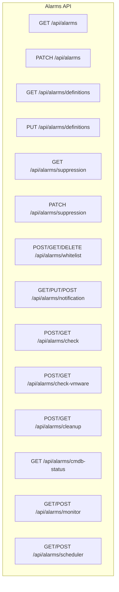

**Diagram sources**
- [app/api/alarms/route.ts:1-104](file://app/api/alarms/route.ts#L1-L104)
- [app/api/alarms/definitions/route.ts:1-67](file://app/api/alarms/definitions/route.ts#L1-L67)
- [app/api/alarms/suppression/route.ts:1-70](file://app/api/alarms/suppression/route.ts#L1-L70)
- [app/api/alarms/whitelist/route.ts:1-147](file://app/api/alarms/whitelist/route.ts#L1-L147)
- [app/api/alarms/notification/route.ts:1-106](file://app/api/alarms/notification/route.ts#L1-L106)
- [app/api/alarms/check/route.ts:1-34](file://app/api/alarms/check/route.ts#L1-L34)
- [app/api/alarms/check-vmware/route.ts:1-118](file://app/api/alarms/check-vmware/route.ts#L1-L118)
- [app/api/alarms/cleanup/route.ts:1-192](file://app/api/alarms/cleanup/route.ts#L1-L192)
- [app/api/alarms/cmdb-status/route.ts:1-77](file://app/api/alarms/cmdb-status/route.ts#L1-L77)
- [app/api/alarms/monitor/route.ts:1-71](file://app/api/alarms/monitor/route.ts#L1-L71)
- [app/api/alarms/scheduler/route.ts:1-52](file://app/api/alarms/scheduler/route.ts#L1-L52)

**Section sources**
- [app/api/alarms/route.ts:1-104](file://app/api/alarms/route.ts#L1-L104)
- [app/api/alarms/definitions/route.ts:1-67](file://app/api/alarms/definitions/route.ts#L1-L67)
- [app/api/alarms/suppression/route.ts:1-70](file://app/api/alarms/suppression/route.ts#L1-L70)
- [app/api/alarms/whitelist/route.ts:1-147](file://app/api/alarms/whitelist/route.ts#L1-L147)
- [app/api/alarms/notification/route.ts:1-106](file://app/api/alarms/notification/route.ts#L1-L106)
- [app/api/alarms/check/route.ts:1-34](file://app/api/alarms/check/route.ts#L1-L34)
- [app/api/alarms/check-vmware/route.ts:1-118](file://app/api/alarms/check-vmware/route.ts#L1-L118)
- [app/api/alarms/cleanup/route.ts:1-192](file://app/api/alarms/cleanup/route.ts#L1-L192)
- [app/api/alarms/cmdb-status/route.ts:1-77](file://app/api/alarms/cmdb-status/route.ts#L1-L77)
- [app/api/alarms/monitor/route.ts:1-71](file://app/api/alarms/monitor/route.ts#L1-L71)
- [app/api/alarms/scheduler/route.ts:1-52](file://app/api/alarms/scheduler/route.ts#L1-L52)

## Core Components
- Alarm listing and stats: Retrieve paginated alarm events with filters and severity counts.
- Acknowledgment: Bulk acknowledge alarm events with optional actor metadata.
- Definitions: List and update alarm definitions, including enabling/disabling, thresholds, and detection logic.
- Suppression: Query suppression engine stats and enable/disable suppression rules dynamically.
- Whitelist: Manage whitelist entries to suppress false positives by field/value pairs.
- Notifications: Configure email settings, mask secrets, and send test emails.
- Checks: Trigger manual or scheduled alarm evaluations; VMware-focused evaluation.
- Cleanup: Delete old acknowledged alarms with dry-run support and statistics.
- Diagnostics: Inspect CMDB snapshot status for FortiGate integration.
- Monitor/Scheduler: Control real-time monitoring intervals and manage the periodic alarm scheduler.

**Section sources**
- [app/api/alarms/route.ts:9-71](file://app/api/alarms/route.ts#L9-L71)
- [app/api/alarms/route.ts:73-103](file://app/api/alarms/route.ts#L73-L103)
- [app/api/alarms/definitions/route.ts:10-26](file://app/api/alarms/definitions/route.ts#L10-L26)
- [app/api/alarms/definitions/route.ts:28-66](file://app/api/alarms/definitions/route.ts#L28-L66)
- [app/api/alarms/suppression/route.ts:7-26](file://app/api/alarms/suppression/route.ts#L7-L26)
- [app/api/alarms/suppression/route.ts:32-69](file://app/api/alarms/suppression/route.ts#L32-L69)
- [app/api/alarms/whitelist/route.ts:8-75](file://app/api/alarms/whitelist/route.ts#L8-L75)
- [app/api/alarms/whitelist/route.ts:81-116](file://app/api/alarms/whitelist/route.ts#L81-L116)
- [app/api/alarms/whitelist/route.ts:122-146](file://app/api/alarms/whitelist/route.ts#L122-L146)
- [app/api/alarms/notification/route.ts:11-49](file://app/api/alarms/notification/route.ts#L11-L49)
- [app/api/alarms/notification/route.ts:51-95](file://app/api/alarms/notification/route.ts#L51-L95)
- [app/api/alarms/notification/route.ts:97-105](file://app/api/alarms/notification/route.ts#L97-L105)
- [app/api/alarms/check/route.ts:18-33](file://app/api/alarms/check/route.ts#L18-L33)
- [app/api/alarms/check-vmware/route.ts:99-117](file://app/api/alarms/check-vmware/route.ts#L99-L117)
- [app/api/alarms/cleanup/route.ts:13-113](file://app/api/alarms/cleanup/route.ts#L13-L113)
- [app/api/alarms/cleanup/route.ts:118-191](file://app/api/alarms/cleanup/route.ts#L118-L191)
- [app/api/alarms/cmdb-status/route.ts:10-76](file://app/api/alarms/cmdb-status/route.ts#L10-L76)
- [app/api/alarms/monitor/route.ts:9-24](file://app/api/alarms/monitor/route.ts#L9-L24)
- [app/api/alarms/monitor/route.ts:27-69](file://app/api/alarms/monitor/route.ts#L27-L69)
- [app/api/alarms/scheduler/route.ts:14-23](file://app/api/alarms/scheduler/route.ts#L14-L23)
- [app/api/alarms/scheduler/route.ts:26-50](file://app/api/alarms/scheduler/route.ts#L26-L50)

## Architecture Overview
The alarm system integrates HTTP endpoints with internal runners and engines:
- HTTP handlers validate requests, call internal services, and return structured JSON responses.
- The scheduler invokes the alarm runner at fixed intervals, ensuring reliability by avoiding HTTP timeouts.
- Detection engines and integrations (e.g., FortiAnalyzer, VMware) evaluate logs and produce triggers.
- Notifications are delivered immediately with rate limiting and DLQ retry support.

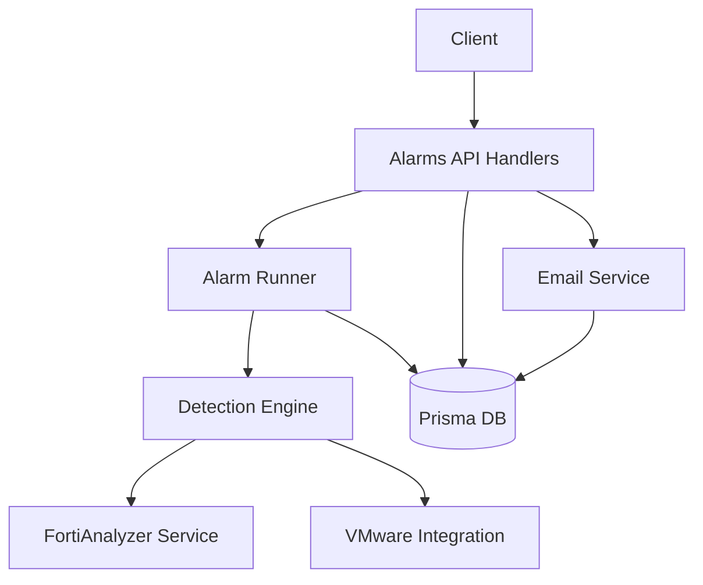

**Diagram sources**
- [lib/alarm-scheduler.ts:1-136](file://lib/alarm-scheduler.ts#L1-L136)
- [app/api/alarms/check/route.ts:1-34](file://app/api/alarms/check/route.ts#L1-L34)
- [app/api/alarms/check-vmware/route.ts:1-118](file://app/api/alarms/check-vmware/route.ts#L1-L118)
- [lib/notifications/email.ts:1-565](file://lib/notifications/email.ts#L1-L565)

## Detailed Component Analysis

### Alarm Listing and Acknowledgment
- Endpoint: GET /api/alarms
  - Filters: severity, acknowledged, category.
  - Pagination: limit, offset.
  - Includes alarm definition metadata and computes severity counts for open alarms.
- Endpoint: PATCH /api/alarms
  - Bulk acknowledge alarm events with optional actor and timestamp updates.

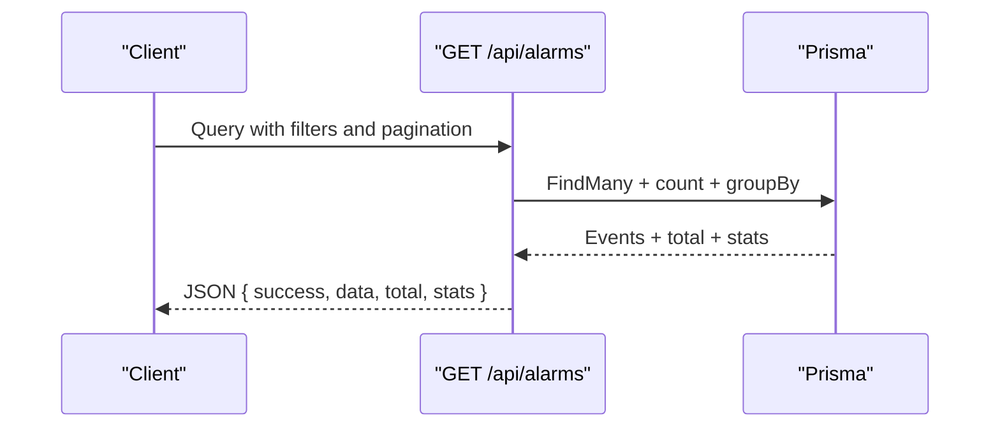

**Diagram sources**
- [app/api/alarms/route.ts:9-71](file://app/api/alarms/route.ts#L9-L71)

**Section sources**
- [app/api/alarms/route.ts:9-71](file://app/api/alarms/route.ts#L9-L71)
- [app/api/alarms/route.ts:73-103](file://app/api/alarms/route.ts#L73-L103)

### Alarm Definitions
- Endpoint: GET /api/alarms/definitions
  - Lists all definitions with counts of associated events, ordered by category/severity/code.
- Endpoint: PUT /api/alarms/definitions
  - Updates fields: enabled, cooldownMinutes, notifyEmail, detectionLogic.
  - Supports seeding definitions via action=seed.

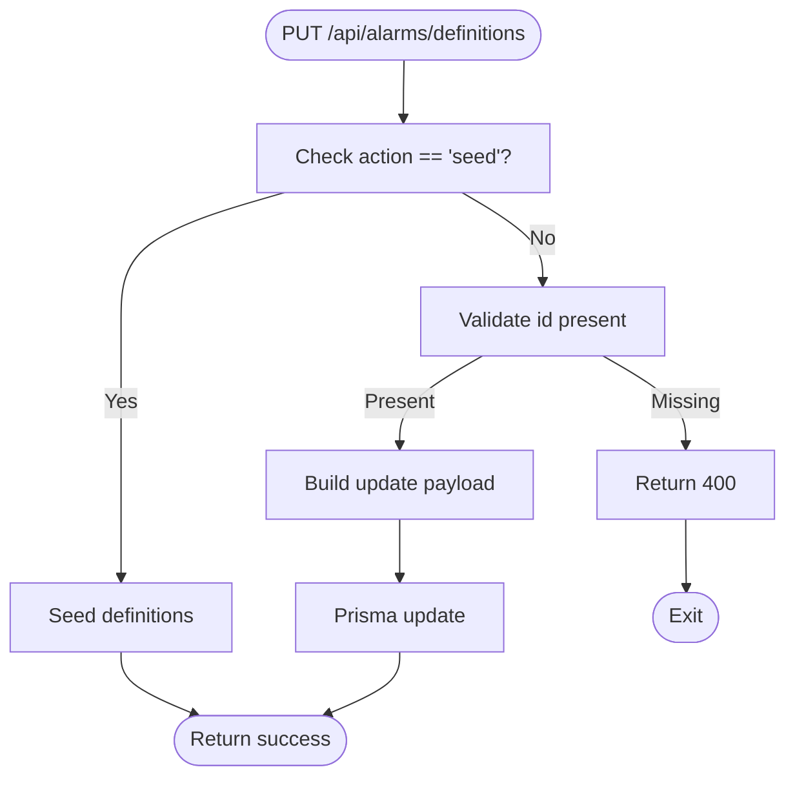

**Diagram sources**
- [app/api/alarms/definitions/route.ts:28-66](file://app/api/alarms/definitions/route.ts#L28-L66)

**Section sources**
- [app/api/alarms/definitions/route.ts:10-26](file://app/api/alarms/definitions/route.ts#L10-L26)
- [app/api/alarms/definitions/route.ts:28-66](file://app/api/alarms/definitions/route.ts#L28-L66)

### Suppression Management
- Endpoint: GET /api/alarms/suppression
  - Returns suppression engine stats if initialized.
- Endpoint: PATCH /api/alarms/suppression
  - Enables/disables a suppression rule by ruleId; returns updated stats or 404 if not found.

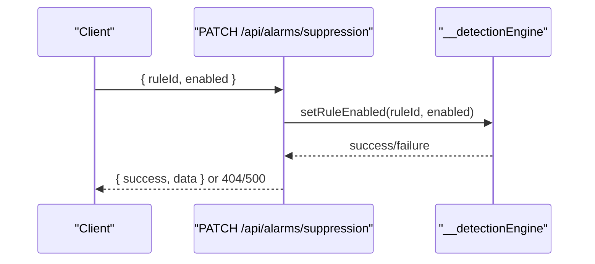

**Diagram sources**
- [app/api/alarms/suppression/route.ts:32-69](file://app/api/alarms/suppression/route.ts#L32-L69)

**Section sources**
- [app/api/alarms/suppression/route.ts:7-26](file://app/api/alarms/suppression/route.ts#L7-L26)
- [app/api/alarms/suppression/route.ts:32-69](file://app/api/alarms/suppression/route.ts#L32-L69)

### Whitelist Management
- Endpoint: POST /api/alarms/whitelist
  - Adds or updates a whitelist entry keyed by alarmCode + field + value; supports expiration and reason.
- Endpoint: GET /api/alarms/whitelist
  - Lists active whitelist entries; optional alarmCode filter and includeDisabled flag.
- Endpoint: DELETE /api/alarms/whitelist
  - Removes a whitelist entry by id.

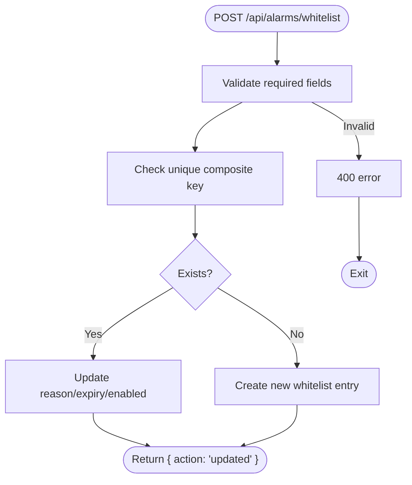

**Diagram sources**
- [app/api/alarms/whitelist/route.ts:8-75](file://app/api/alarms/whitelist/route.ts#L8-L75)

**Section sources**
- [app/api/alarms/whitelist/route.ts:8-75](file://app/api/alarms/whitelist/route.ts#L8-L75)
- [app/api/alarms/whitelist/route.ts:81-116](file://app/api/alarms/whitelist/route.ts#L81-L116)
- [app/api/alarms/whitelist/route.ts:122-146](file://app/api/alarms/whitelist/route.ts#L122-L146)

### Notification Configuration and Delivery
- Endpoint: GET /api/alarms/notification
  - Retrieves current email configuration; masks password; returns defaults if DB unavailable.
- Endpoint: PUT /api/alarms/notification
  - Upserts email configuration; preserves existing password if not provided; supports toggling enabled.
- Endpoint: POST /api/alarms/notification
  - Sends a test email using current or default configuration.

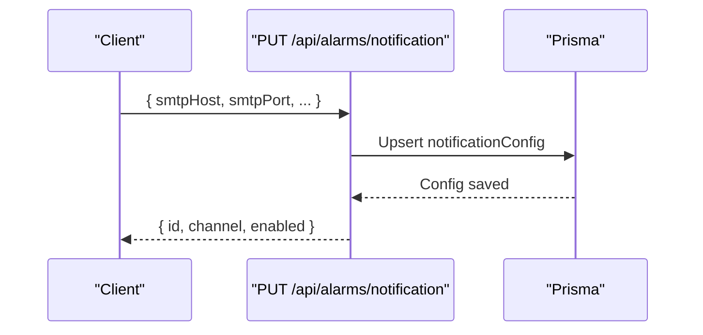

**Diagram sources**
- [app/api/alarms/notification/route.ts:51-95](file://app/api/alarms/notification/route.ts#L51-L95)

**Section sources**
- [app/api/alarms/notification/route.ts:11-49](file://app/api/alarms/notification/route.ts#L11-L49)
- [app/api/alarms/notification/route.ts:51-95](file://app/api/alarms/notification/route.ts#L51-L95)
- [app/api/alarms/notification/route.ts:97-105](file://app/api/alarms/notification/route.ts#L97-L105)
- [lib/notifications/email.ts:86-98](file://lib/notifications/email.ts#L86-L98)
- [lib/notifications/email.ts:103-132](file://lib/notifications/email.ts#L103-L132)
- [lib/notifications/email.ts:405-481](file://lib/notifications/email.ts#L405-L481)

### Real-Time and Scheduled Checks
- Endpoint: POST/GET /api/alarms/check
  - Triggers immediate alarm evaluation; GET is cron-friendly; thin wrapper around the in-process runner.
- Endpoint: POST/GET /api/alarms/check-vmware
  - Evaluates only VMware-related alarms using the detection engine and FortiAnalyzer configuration.

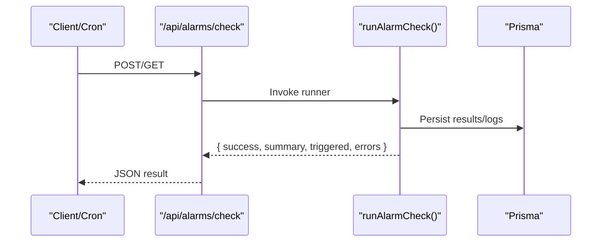

**Diagram sources**
- [app/api/alarms/check/route.ts:18-33](file://app/api/alarms/check/route.ts#L18-L33)

**Section sources**
- [app/api/alarms/check/route.ts:1-34](file://app/api/alarms/check/route.ts#L1-L34)
- [app/api/alarms/check-vmware/route.ts:1-118](file://app/api/alarms/check-vmware/route.ts#L1-L118)

### Cleanup and Maintenance
- Endpoint: POST /api/alarms/cleanup
  - Deletes old alarm events; supports hoursOld or daysOld; acknowledgedOnly; dryRun preview.
  - Handles foreign-key constraints by removing related DLQ entries first.
- Endpoint: GET /api/alarms/cleanup/stats
  - Computes statistics: total, old, old acknowledged/unacknowledged, severity breakdown, storage estimate.

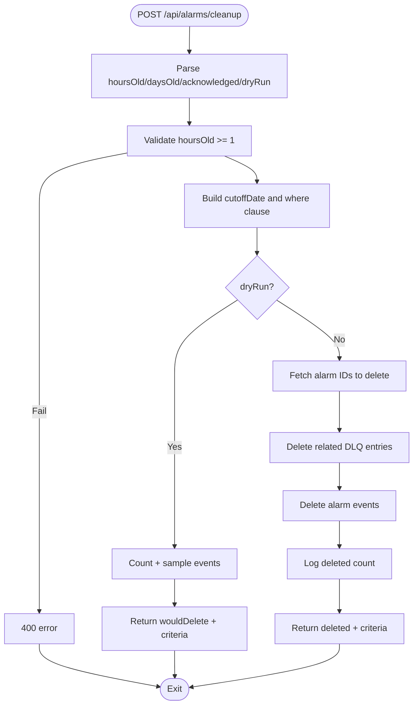

**Diagram sources**
- [app/api/alarms/cleanup/route.ts:13-113](file://app/api/alarms/cleanup/route.ts#L13-L113)

**Section sources**
- [app/api/alarms/cleanup/route.ts:13-113](file://app/api/alarms/cleanup/route.ts#L13-L113)
- [app/api/alarms/cleanup/route.ts:118-191](file://app/api/alarms/cleanup/route.ts#L118-L191)

### CMDB Status Monitoring
- Endpoint: GET /api/alarms/cmdb-status
  - Reports CMDB snapshot availability and counts for FortiGate endpoints; requires detection engine initialization.

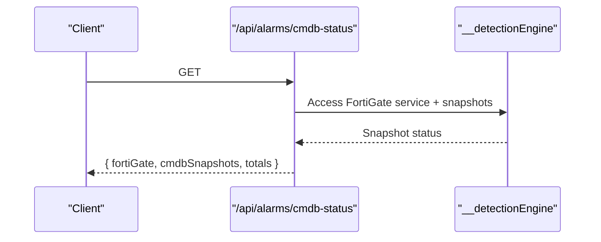

**Diagram sources**
- [app/api/alarms/cmdb-status/route.ts:10-76](file://app/api/alarms/cmdb-status/route.ts#L10-L76)

**Section sources**
- [app/api/alarms/cmdb-status/route.ts:10-76](file://app/api/alarms/cmdb-status/route.ts#L10-L76)

### Monitoring and Scheduler Management
- Endpoint: GET/POST /api/alarms/monitor
  - Start/stop monitoring or force a check; returns monitor status.
- Endpoint: GET/POST /api/alarms/scheduler
  - Start/stop the periodic alarm scheduler; returns status.

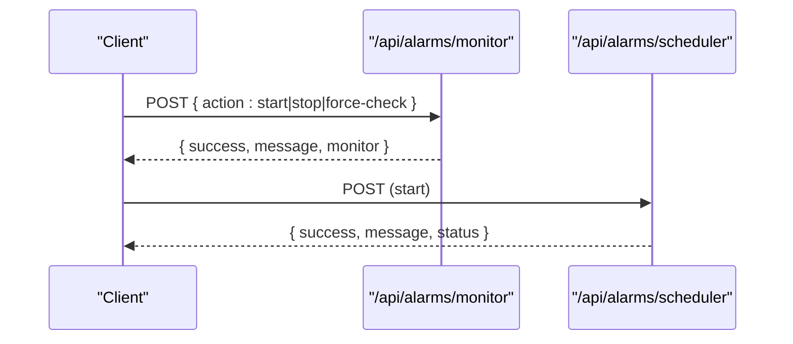

**Diagram sources**
- [app/api/alarms/monitor/route.ts:27-69](file://app/api/alarms/monitor/route.ts#L27-L69)
- [app/api/alarms/scheduler/route.ts:26-50](file://app/api/alarms/scheduler/route.ts#L26-L50)

**Section sources**
- [app/api/alarms/monitor/route.ts:9-24](file://app/api/alarms/monitor/route.ts#L9-L24)
- [app/api/alarms/monitor/route.ts:27-69](file://app/api/alarms/monitor/route.ts#L27-L69)
- [app/api/alarms/scheduler/route.ts:14-23](file://app/api/alarms/scheduler/route.ts#L14-L23)
- [app/api/alarms/scheduler/route.ts:26-50](file://app/api/alarms/scheduler/route.ts#L26-L50)
- [lib/alarm-scheduler.ts:26-113](file://lib/alarm-scheduler.ts#L26-L113)

## Dependency Analysis
- HTTP handlers depend on Prisma for persistence and on internal services for detection and notifications.
- The scheduler depends on the alarm runner and writes system heartbeat metrics for health monitoring.
- Email delivery depends on SMTP configuration stored in DB and uses connection pooling and rate limiting.

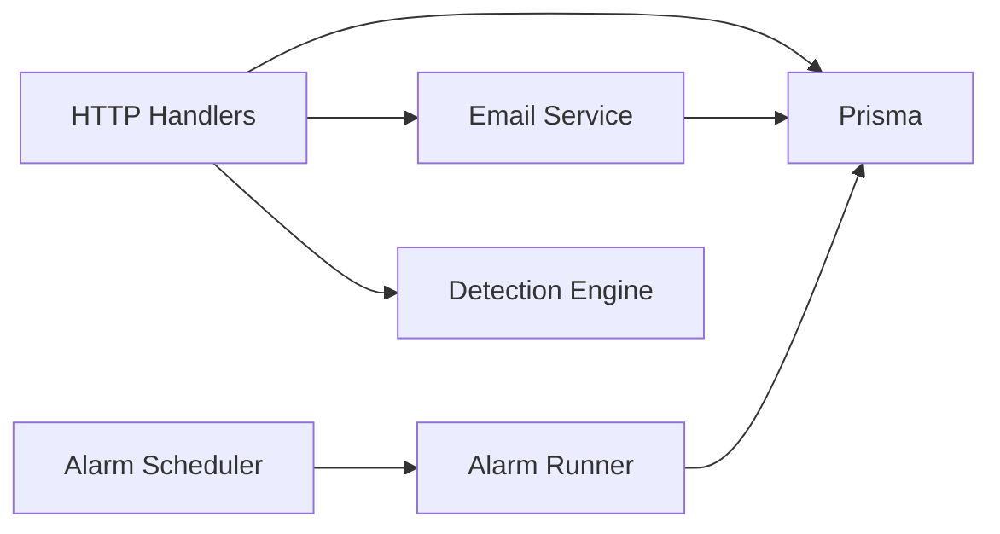

**Diagram sources**
- [lib/alarm-scheduler.ts:1-136](file://lib/alarm-scheduler.ts#L1-L136)
- [lib/notifications/email.ts:1-565](file://lib/notifications/email.ts#L1-L565)

**Section sources**
- [lib/alarm-scheduler.ts:1-136](file://lib/alarm-scheduler.ts#L1-L136)
- [lib/notifications/email.ts:1-565](file://lib/notifications/email.ts#L1-L565)

## Performance Considerations
- Filtering and pagination: Use severity, acknowledged, category filters and limit/offset to reduce payload sizes.
- Acknowledgment batching: Use bulk PATCH to minimize round-trips.
- Cleanup planning: Prefer dryRun to estimate impact; schedule during low traffic windows.
- Email throughput: Respect hourly limits and alarm cooldowns to avoid throttling and duplicate alerts.
- Scheduler reliability: The in-process runner avoids HTTP timeouts and ensures proper cleanup of stale locks.

[No sources needed since this section provides general guidance]

## Troubleshooting Guide
- Detection engine not initialized:
  - Symptom: 503 responses from suppression and CMDB status endpoints.
  - Resolution: Initialize the engine via the health endpoint before calling these routes.
- Missing required fields:
  - Symptoms: 400 responses on whitelist POST and suppression PATCH.
  - Resolution: Ensure ruleId and enabled are provided for suppression; alarmCode, field, value, createdBy for whitelist.
- Email delivery failures:
  - Symptoms: False returns from sendAlarmEmail or DLQ entries.
  - Resolution: Verify SMTP credentials and connectivity; use test endpoint; inspect DLQ for retryable errors.
- Stale scheduler locks:
  - Symptoms: Extended blackouts or inconsistent scheduler status.
  - Resolution: The scheduler proactively cleans stale locks; ensure the process restarts cleanly.

**Section sources**
- [app/api/alarms/suppression/route.ts:9-15](file://app/api/alarms/suppression/route.ts#L9-L15)
- [app/api/alarms/cmdb-status/route.ts:15-21](file://app/api/alarms/cmdb-status/route.ts#L15-L21)
- [app/api/alarms/whitelist/route.ts:14-18](file://app/api/alarms/whitelist/route.ts#L14-L18)
- [app/api/alarms/suppression/route.ts:37-42](file://app/api/alarms/suppression/route.ts#L37-L42)
- [lib/notifications/email.ts:445-481](file://lib/notifications/email.ts#L445-L481)
- [lib/alarm-scheduler.ts:40-63](file://lib/alarm-scheduler.ts#L40-L63)

## Conclusion
InfraScope’s alarm management API provides a robust, modular toolkit for defining, suppressing, validating, notifying, and maintaining alarms. Its design emphasizes reliability (in-process scheduling), configurability (dynamic definitions and suppression), and observability (diagnostics and statistics). By following the documented endpoints and operational guidance, teams can implement effective alarm workflows across heterogeneous infrastructures.

[No sources needed since this section summarizes without analyzing specific files]

## Appendices

### API Reference Summary
- Alarm listing and stats: GET /api/alarms
- Bulk acknowledgment: PATCH /api/alarms
- Definitions listing and update: GET/PUT /api/alarms/definitions
- Suppression stats and toggle: GET/PATCH /api/alarms/suppression
- Whitelist CRUD: POST/GET/DELETE /api/alarms/whitelist
- Notification config and test: GET/PUT/POST /api/alarms/notification
- Real-time check: POST/GET /api/alarms/check
- VMware-only check: POST/GET /api/alarms/check-vmware
- Cleanup and stats: POST/GET /api/alarms/cleanup
- CMDB status: GET /api/alarms/cmdb-status
- Monitor control: GET/POST /api/alarms/monitor
- Scheduler control: GET/POST /api/alarms/scheduler

[No sources needed since this section lists endpoints without analyzing specific files]

### Example Workflows
- Configure alarm rule:
  - Use PUT /api/alarms/definitions to set enabled, cooldownMinutes, notifyEmail, and detectionLogic.
- Suppress recurring noise:
  - Use PATCH /api/alarms/suppression to disable a suppression rule by ruleId.
- Whitelist a false positive:
  - Use POST /api/alarms/whitelist with alarmCode, field, value, reason, createdBy; optionally set expiresAt.
- Validate configuration:
  - Use GET /api/alarms/notification to review masked config; POST /api/alarms/notification to send a test email.
- Run targeted check:
  - Use POST /api/alarms/check-vmware for VMware-only evaluation; use POST /api/alarms/check for full evaluation.
- Maintain historical data:
  - Use POST /api/alarms/cleanup with hoursOld or daysOld; enable dryRun to preview deletions.

[No sources needed since this section provides conceptual examples]