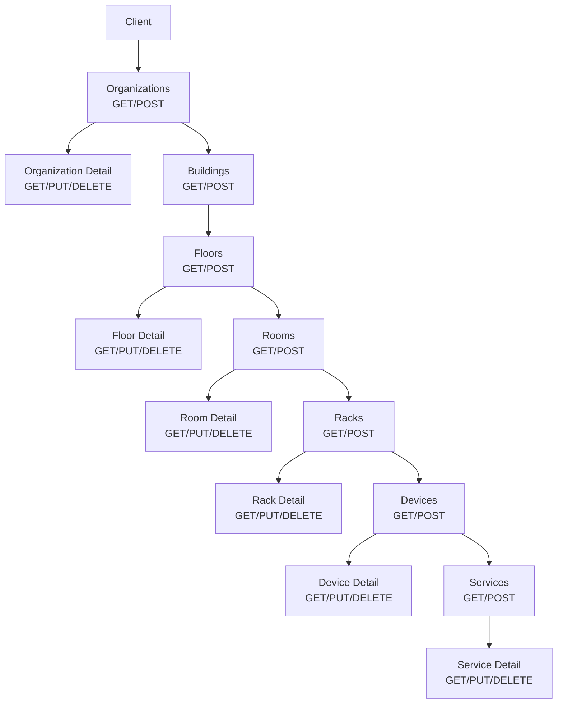
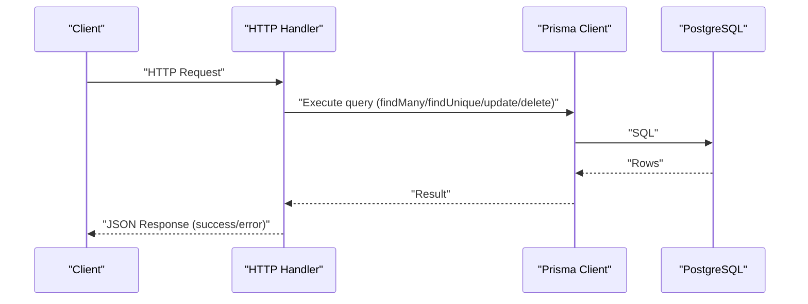
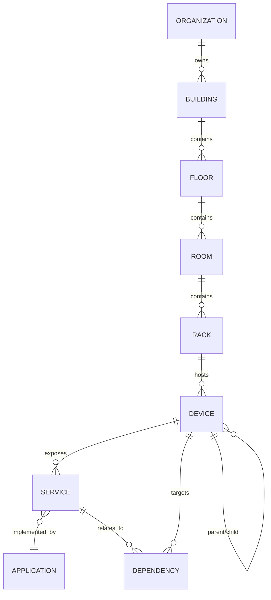

# Core API Endpoints

<cite>
**Referenced Files in This Document**
- [app/api/organizations/route.ts](file://app/api/organizations/route.ts)
- [app/api/organizations/[id]/route.ts](file://app/api/organizations/[id]/route.ts)
- [app/api/buildings/route.ts](file://app/api/buildings/route.ts)
- [app/api/floors/route.ts](file://app/api/floors/route.ts)
- [app/api/floors/[id]/route.ts](file://app/api/floors/[id]/route.ts)
- [app/api/rooms/route.ts](file://app/api/rooms/route.ts)
- [app/api/rooms/[id]/route.ts](file://app/api/rooms/[id]/route.ts)
- [app/api/racks/route.ts](file://app/api/racks/route.ts)
- [app/api/racks/[id]/route.ts](file://app/api/racks/[id]/route.ts)
- [app/api/devices/route.ts](file://app/api/devices/route.ts)
- [app/api/devices/[id]/route.ts](file://app/api/devices/[id]/route.ts)
- [app/api/services/route.ts](file://app/api/services/route.ts)
- [app/api/services/[id]/route.ts](file://app/api/services/[id]/route.ts)
- [lib/prisma.ts](file://lib/prisma.ts)
- [prisma/schema.prisma](file://prisma/schema.prisma)
- [docs/API_ORGANIZATIONS.md](file://docs/API_ORGANIZATIONS.md)
- [docs/API_BUILDINGS.md](file://docs/API_BUILDINGS.md)
- [docs/API_FLOORS.md](file://docs/API_FLOORS.md)
</cite>

## Table of Contents
1. [Introduction](#introduction)
2. [Project Structure](#project-structure)
3. [Core Components](#core-components)
4. [Architecture Overview](#architecture-overview)
5. [Detailed Component Analysis](#detailed-component-analysis)
6. [Dependency Analysis](#dependency-analysis)
7. [Performance Considerations](#performance-considerations)
8. [Troubleshooting Guide](#troubleshooting-guide)
9. [Conclusion](#conclusion)
10. [Appendices](#appendices)

## Introduction
This document provides comprehensive API documentation for InfraScope’s core resource management endpoints covering organizations, buildings, floors, rooms, racks, devices, and services. It explains HTTP methods, URL patterns, request/response schemas, validation rules, pagination, filtering, error handling, and operational constraints. It also covers caching, performance characteristics, and best practices for efficient consumption.

## Project Structure
InfraScope exposes REST-like endpoints under the Next.js App Router at app/api/<resource>. Each resource typically provides:
- Collection endpoint (e.g., GET /api/organizations, POST /api/buildings)
- Detail endpoint (e.g., GET /api/organizations/[id], PUT /api/organizations/[id], DELETE /api/organizations/[id])

The backend uses Prisma as the ORM, configured as a singleton to minimize overhead and enable safe reuse across requests.

**Diagram sources**
- [app/api/organizations/route.ts:1-125](file://app/api/organizations/route.ts#L1-L125)
- [app/api/organizations/[id]/route.ts](file://app/api/organizations/[id]/route.ts#L1-L68)
- [app/api/buildings/route.ts:1-118](file://app/api/buildings/route.ts#L1-L118)
- [app/api/floors/route.ts:1-107](file://app/api/floors/route.ts#L1-L107)
- [app/api/floors/[id]/route.ts](file://app/api/floors/[id]/route.ts#L1-L318)
- [app/api/rooms/route.ts:1-113](file://app/api/rooms/route.ts#L1-L113)
- [app/api/rooms/[id]/route.ts](file://app/api/rooms/[id]/route.ts#L1-L361)
- [app/api/racks/route.ts:1-122](file://app/api/racks/route.ts#L1-L122)
- [app/api/racks/[id]/route.ts](file://app/api/racks/[id]/route.ts#L1-L428)
- [app/api/devices/route.ts:1-142](file://app/api/devices/route.ts#L1-L142)
- [app/api/devices/[id]/route.ts](file://app/api/devices/[id]/route.ts#L1-L521)
- [app/api/services/route.ts:1-122](file://app/api/services/route.ts#L1-L122)
- [app/api/services/[id]/route.ts](file://app/api/services/[id]/route.ts#L1-L452)

**Section sources**
- [lib/prisma.ts:1-21](file://lib/prisma.ts#L1-L21)
- [prisma/schema.prisma:1-800](file://prisma/schema.prisma#L1-L800)

## Core Components
- Organizations: Top-level tenant container with buildings.
- Buildings: Physical locations linked to organizations.
- Floors: Levels within buildings.
- Rooms: Spaces within floors.
- Racks: Equipment enclosures within rooms.
- Devices: Physical/virtual assets within racks or rooms.
- Services: Logical services bound to devices.

Each component supports:
- Listing with pagination and filtering
- Creation with validation
- Retrieval with nested relations
- Updates with strict validation and referential checks
- Deletion guarded by cascade constraints

**Section sources**
- [prisma/schema.prisma:10-133](file://prisma/schema.prisma#L10-L133)
- [app/api/organizations/route.ts:1-125](file://app/api/organizations/route.ts#L1-L125)
- [app/api/buildings/route.ts:1-118](file://app/api/buildings/route.ts#L1-L118)
- [app/api/floors/route.ts:1-107](file://app/api/floors/route.ts#L1-L107)
- [app/api/rooms/route.ts:1-113](file://app/api/rooms/route.ts#L1-L113)
- [app/api/racks/route.ts:1-122](file://app/api/racks/route.ts#L1-L122)
- [app/api/devices/route.ts:1-142](file://app/api/devices/route.ts#L1-L142)
- [app/api/services/route.ts:1-122](file://app/api/services/route.ts#L1-L122)

## Architecture Overview
The API follows a layered architecture:
- HTTP handlers in app/api/* translate HTTP requests to domain actions
- Prisma client performs database operations with optimized queries and includes
- Caching is applied at the handler level for frequently accessed collections
- Error responses are standardized with success flags and timestamps

**Diagram sources**
- [lib/prisma.ts:1-21](file://lib/prisma.ts#L1-L21)
- [app/api/organizations/route.ts:1-125](file://app/api/organizations/route.ts#L1-L125)
- [app/api/devices/route.ts:1-142](file://app/api/devices/route.ts#L1-L142)

## Detailed Component Analysis

### Organizations
- Base URL: /api/organizations
- Methods:
  - GET: List organizations with optional caching
  - POST: Create organization
- Detail URL: /api/organizations/[id]
- Methods:
  - GET: Retrieve organization with nested buildings
  - PUT: Update organization
  - DELETE: Delete organization (fails if buildings exist)

Validation and constraints:
- name and code are required on creation
- name and code must be unique
- Deletion fails with 409 if buildings exist

Pagination and filtering:
- Not applicable for collection listing (no query params)

Response shape:
- success flag, data payload, timestamp, optional cached flag for GET

Common errors:
- 400: Missing required fields
- 404: Not found
- 409: Duplicate or constraint violation
- 500: Internal error

Example curl:
- Create: curl -X POST http://localhost:3000/api/organizations -H "Content-Type: application/json" -d '{...}'
- List: curl http://localhost:3000/api/organizations
- Update: curl -X PUT http://localhost:3000/api/organizations/:id -H "Content-Type: application/json" -d '{...}'
- Delete: curl -X DELETE http://localhost:3000/api/organizations/:id

**Section sources**
- [app/api/organizations/route.ts:1-125](file://app/api/organizations/route.ts#L1-L125)
- [app/api/organizations/[id]/route.ts](file://app/api/organizations/[id]/route.ts#L1-L68)
- [prisma/schema.prisma:10-25](file://prisma/schema.prisma#L10-L25)

### Buildings
- Base URL: /api/buildings
- Methods:
  - GET: List buildings with pagination and filters
  - POST: Create building
- Detail URL: /api/buildings/[id]
- Methods:
  - GET: Retrieve building with organization and floors
  - PUT: Update building
  - DELETE: Delete building (fails if floors exist)

Filters:
- organizationId, city, country, search (case-insensitive substring)

Validation:
- name, address, city, country, organizationId required
- Unique name per organization
- Coordinate bounds validated

Response shape:
- success flag, data payload, pagination metadata, timestamp

Errors:
- 400: Missing fields or invalid coordinates
- 404: Not found
- 409: Duplicate or constraint violation
- 500: Internal error

Example curl:
- List: curl "http://localhost:3000/api/buildings?organizationId=:id&page=1&limit=20"
- Create: curl -X POST http://localhost:3000/api/buildings -H "Content-Type: application/json" -d '{...}'
- Update: curl -X PUT http://localhost:3000/api/buildings/:id -H "Content-Type: application/json" -d '{...}'
- Delete: curl -X DELETE http://localhost:3000/api/buildings/:id

**Section sources**
- [app/api/buildings/route.ts:1-118](file://app/api/buildings/route.ts#L1-L118)
- [prisma/schema.prisma:56-76](file://prisma/schema.prisma#L56-L76)

### Floors
- Base URL: /api/floors
- Methods:
  - GET: List floors with buildingId required, pagination, and search
  - POST: Create floor
- Detail URL: /api/floors/[id]
- Methods:
  - GET: Retrieve floor with building and rooms
  - PUT: Update floor (prevents duplicate floorNumber per building)
  - DELETE: Delete floor (fails if rooms exist)

Validation:
- name, floorNumber, buildingId required
- floorNumber range: -100 to 1000
- Unique (buildingId, floorNumber)

Response shape:
- success flag, data payload, pagination metadata, timestamp

Errors:
- 400: Missing buildingId or invalid floorNumber
- 404: Not found
- 409: Duplicate floorNumber or rooms exist
- 500: Internal error

Example curl:
- List: curl "http://localhost:3000/api/floors?buildingId=:id&search=server&page=1&limit=10"
- Create: curl -X POST http://localhost:3000/api/floors -H "Content-Type: application/json" -d '{...}'
- Update: curl -X PUT http://localhost:3000/api/floors/:id -H "Content-Type: application/json" -d '{...}'
- Delete: curl -X DELETE http://localhost:3000/api/floors/:id

**Section sources**
- [app/api/floors/route.ts:1-107](file://app/api/floors/route.ts#L1-L107)
- [app/api/floors/[id]/route.ts](file://app/api/floors/[id]/route.ts#L1-L318)
- [prisma/schema.prisma:78-91](file://prisma/schema.prisma#L78-L91)

### Rooms
- Base URL: /api/rooms
- Methods:
  - GET: List rooms with pagination and ordering
  - POST: Create room
- Detail URL: /api/rooms/[id]
- Methods:
  - GET: Retrieve room with floor and racks
  - PUT: Update room (prevents duplicate name per floor)
  - DELETE: Delete room (fails if racks exist)

Validation:
- name, floorId required
- Dimensions width/depth/height validated when provided
- Unique (floorId, name)

Response shape:
- success flag, data payload, pagination metadata, timestamp

Errors:
- 400: Missing fields or invalid dimensions
- 404: Not found
- 409: Duplicate name or racks exist
- 500: Internal error

Example curl:
- List: curl "http://localhost:3000/api/rooms?page=1&limit=20"
- Create: curl -X POST http://localhost:3000/api/rooms -H "Content-Type: application/json" -d '{...}'
- Update: curl -X PUT http://localhost:3000/api/rooms/:id -H "Content-Type: application/json" -d '{...}'
- Delete: curl -X DELETE http://localhost:3000/api/rooms/:id

**Section sources**
- [app/api/rooms/route.ts:1-113](file://app/api/rooms/route.ts#L1-L113)
- [app/api/rooms/[id]/route.ts](file://app/api/rooms/[id]/route.ts#L1-L361)
- [prisma/schema.prisma:93-110](file://prisma/schema.prisma#L93-L110)

### Racks
- Base URL: /api/racks
- Methods:
  - GET: List racks with pagination and ordering
  - POST: Create rack
- Detail URL: /api/racks/[id]
- Methods:
  - GET: Retrieve rack with room, devices, and unit assignments
  - PUT: Update rack (validates type/status, maxUnits limits, uniqueness)
  - DELETE: Delete rack (fails if devices or units exist)

Validation:
- name, roomId required
- type from allowed set, maxUnits bounded, operationalStatus from allowed set
- Unique (roomId, name)
- Reducing maxUnits enforced to not exceed current device positions

Response shape:
- success flag, data payload, pagination metadata, timestamp

Errors:
- 400: Missing fields or invalid values
- 404: Not found
- 409: Duplicate name or devices/units exist
- 500: Internal error

Example curl:
- List: curl "http://localhost:3000/api/racks?page=1&limit=20"
- Create: curl -X POST http://localhost:3000/api/racks -H "Content-Type: application/json" -d '{...}'
- Update: curl -X PUT http://localhost:3000/api/racks/:id -H "Content-Type: application/json" -d '{...}'
- Delete: curl -X DELETE http://localhost:3000/api/racks/:id

**Section sources**
- [app/api/racks/route.ts:1-122](file://app/api/racks/route.ts#L1-L122)
- [app/api/racks/[id]/route.ts](file://app/api/racks/[id]/route.ts#L1-L428)
- [prisma/schema.prisma:112-133](file://prisma/schema.prisma#L112-L133)

### Devices
- Base URL: /api/devices
- Methods:
  - GET: List devices with pagination, filtering, and mode selection
  - POST: Create device
- Detail URL: /api/devices/[id]
- Methods:
  - GET: Retrieve device with rack hierarchy, interfaces, services
  - PUT: Update device (validates types, statuses, criticalities, rack/unit placement)
  - DELETE: Delete device (fails if child devices or services exist)

Filtering and modes:
- filterType: manual|all|specific type
- search: name, serialNumber, vendor, model (case-insensitive)
- mode: minimal|full (minimal avoids heavy joins)

Validation:
- name, type required on creation
- rackUnitPosition constrained by rack maxUnits
- parentDeviceId must form valid hierarchical relationships

Response shape:
- success flag, data, total, page, limit, totalPages, timestamp

Errors:
- 400: Missing fields or invalid values
- 404: Not found
- 409: Child devices/services exist
- 500: Internal error

Example curl:
- List: curl "http://localhost:3000/api/devices?page=1&limit=25&filterType=manual&search=server"
- Create: curl -X POST http://localhost:3000/api/devices -H "Content-Type: application/json" -d '{...}'
- Update: curl -X PUT http://localhost:3000/api/devices/:id -H "Content-Type: application/json" -d '{...}'
- Delete: curl -X DELETE http://localhost:3000/api/devices/:id

**Section sources**
- [app/api/devices/route.ts:1-142](file://app/api/devices/route.ts#L1-L142)
- [app/api/devices/[id]/route.ts](file://app/api/devices/[id]/route.ts#L1-L521)
- [prisma/schema.prisma:151-228](file://prisma/schema.prisma#L151-L228)

### Services
- Base URL: /api/services
- Methods:
  - GET: List services with pagination and mode selection
  - POST: Create service
- Detail URL: /api/services/[id]
- Methods:
  - GET: Retrieve service with device, application, dependencies
  - PUT: Update service (prevents duplicate port/protocol per device)
  - DELETE: Delete service (fails if dependencies exist)

Validation:
- name, type, port, deviceId required on creation
- port range 1–65535, protocol from allowed set
- Unique (deviceId, port, protocol)

Response shape:
- success flag, data, total, page, limit, totalPages, timestamp

Errors:
- 400: Missing fields or invalid values
- 404: Not found
- 409: Duplicate port/protocol or dependencies exist
- 500: Internal error

Example curl:
- List: curl "http://localhost:3000/api/services?page=1&limit=50&mode=full"
- Create: curl -X POST http://localhost:3000/api/services -H "Content-Type: application/json" -d '{...}'
- Update: curl -X PUT http://localhost:3000/api/services/:id -H "Content-Type: application/json" -d '{...}'
- Delete: curl -X DELETE http://localhost:3000/api/services/:id

**Section sources**
- [app/api/services/route.ts:1-122](file://app/api/services/route.ts#L1-L122)
- [app/api/services/[id]/route.ts](file://app/api/services/[id]/route.ts#L1-L452)
- [prisma/schema.prisma:344-368](file://prisma/schema.prisma#L344-L368)

## Dependency Analysis
Entity relationships and cascading behavior are defined in the Prisma schema. Key points:
- Organization → Buildings
- Building → Floors
- Floor → Rooms
- Room → Racks
- Rack → Devices
- Device → Services
- Device ↔ Device (parent/child)
- Service → Device, Application
- Dependency → Service, Device

**Diagram sources**
- [prisma/schema.prisma:10-228](file://prisma/schema.prisma#L10-L228)

**Section sources**
- [prisma/schema.prisma:10-228](file://prisma/schema.prisma#L10-L228)

## Performance Considerations
- Caching:
  - Organizations and Buildings: in-memory cache TTL of 60 seconds
  - Floors: in-memory cache TTL of 60 seconds
  - Racks: in-memory cache TTL of 30 seconds
- Pagination:
  - Devices: page defaults to 1, limit defaults to 25, capped at 200
  - Services: page defaults to 1, limit defaults to 50, capped at 500
- Selective includes:
  - Minimal mode avoids heavy joins for dashboards
- Query optimization:
  - Selective field projection and targeted includes reduce payload sizes
- Logging:
  - Prisma logs disabled by default to reduce I/O overhead

Best practices:
- Prefer minimal mode for listing endpoints when full nesting is unnecessary
- Use filters (e.g., buildingId, floorId) to narrow result sets
- Batch operations should leverage pagination and limit to avoid timeouts
- Respect cache TTLs to reduce database load

**Section sources**
- [app/api/organizations/route.ts:4-8](file://app/api/organizations/route.ts#L4-L8)
- [app/api/buildings/route.ts:4-8](file://app/api/buildings/route.ts#L4-L8)
- [app/api/floors/route.ts:4-8](file://app/api/floors/route.ts#L4-L8)
- [app/api/racks/route.ts:4-8](file://app/api/racks/route.ts#L4-L8)
- [app/api/devices/route.ts:13-17](file://app/api/devices/route.ts#L13-L17)
- [app/api/services/route.ts:7-12](file://app/api/services/route.ts#L7-L12)
- [lib/prisma.ts:12-16](file://lib/prisma.ts#L12-L16)

## Troubleshooting Guide
Common issues and resolutions:
- 400 Bad Request:
  - Missing required fields or invalid types/values
  - Coordinates out of range
  - Invalid port numbers or protocols
- 404 Not Found:
  - Entity not present (organization/building/floor/room/rack/device/service)
- 409 Conflict:
  - Duplicate name/number within scope
  - Attempting to delete entities with children/dependencies
  - Duplicate port/protocol per device
- 500 Internal Error:
  - Unexpected server-side failures; inspect server logs

Operational tips:
- Validate inputs against documented constraints before sending requests
- Use minimal mode for listing to reduce payload and latency
- Apply appropriate filters to limit result sets
- Monitor cache behavior and adjust TTLs if needed

**Section sources**
- [app/api/floors/[id]/route.ts](file://app/api/floors/[id]/route.ts#L176-L195)
- [app/api/rooms/[id]/route.ts](file://app/api/rooms/[id]/route.ts#L214-L233)
- [app/api/racks/[id]/route.ts](file://app/api/racks/[id]/route.ts#L274-L290)
- [app/api/devices/[id]/route.ts](file://app/api/devices/[id]/route.ts#L281-L309)
- [app/api/services/[id]/route.ts](file://app/api/services/[id]/route.ts#L282-L307)

## Conclusion
InfraScope’s core API provides robust, validated, and performant endpoints for managing infrastructure resources. By leveraging pagination, selective includes, caching, and strict validation, clients can efficiently operate at scale while maintaining referential integrity and predictable error handling.

## Appendices

### Authentication and Security
- Authentication and authorization mechanisms are not implemented in the analyzed routes. Access control should be enforced at the application layer or reverse proxy before reaching these endpoints.

### Rate Limiting and API Versioning
- No explicit rate limiting or API versioning is implemented in the analyzed code. Consider adding middleware for rate limiting and versioning headers or URL segments for future-proofing.

### Error Response Schema
All endpoints return a consistent envelope:
- success: boolean
- data: object|array|null
- error: string|null
- timestamp: ISO date-time
- cached: boolean (for cached endpoints)

**Section sources**
- [app/api/organizations/route.ts:70-87](file://app/api/organizations/route.ts#L70-L87)
- [app/api/buildings/route.ts:65-78](file://app/api/buildings/route.ts#L65-L78)
- [app/api/floors/route.ts:56-69](file://app/api/floors/route.ts#L56-L69)
- [app/api/rooms/route.ts:58-71](file://app/api/rooms/route.ts#L58-L71)
- [app/api/racks/route.ts:53-66](file://app/api/racks/route.ts#L53-L66)
- [app/api/devices/route.ts:73-93](file://app/api/devices/route.ts#L73-L93)
- [app/api/services/route.ts:58-74](file://app/api/services/route.ts#L58-L74)