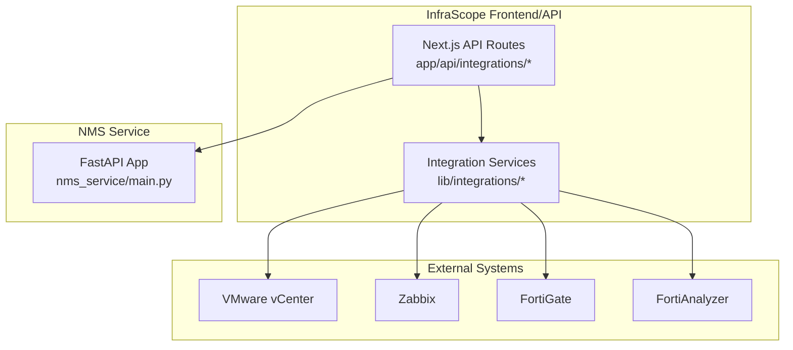
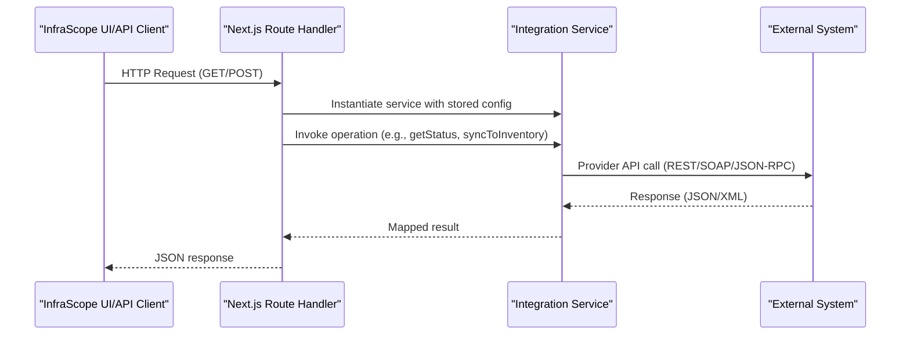
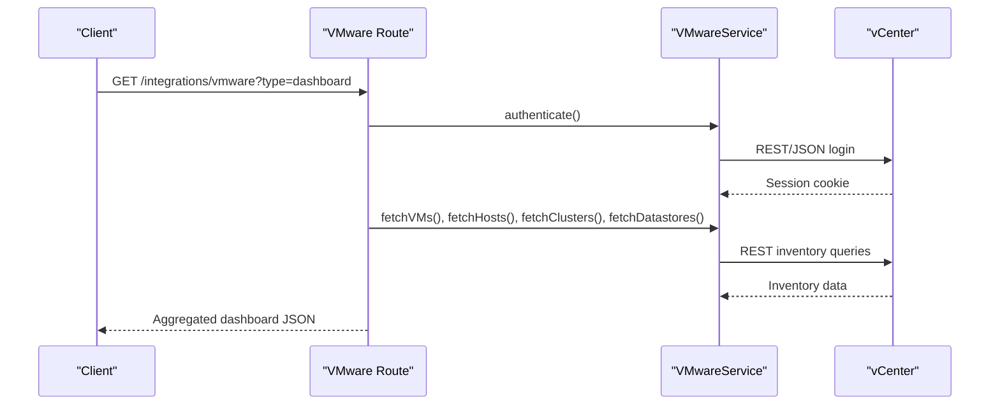
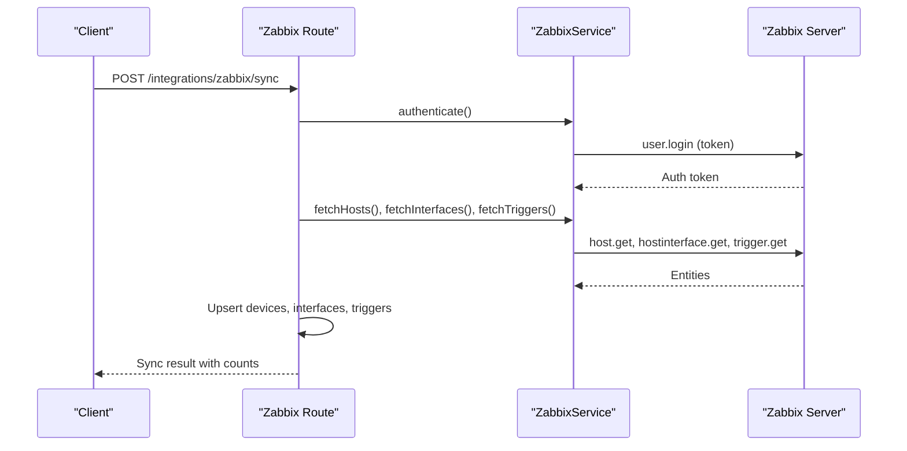
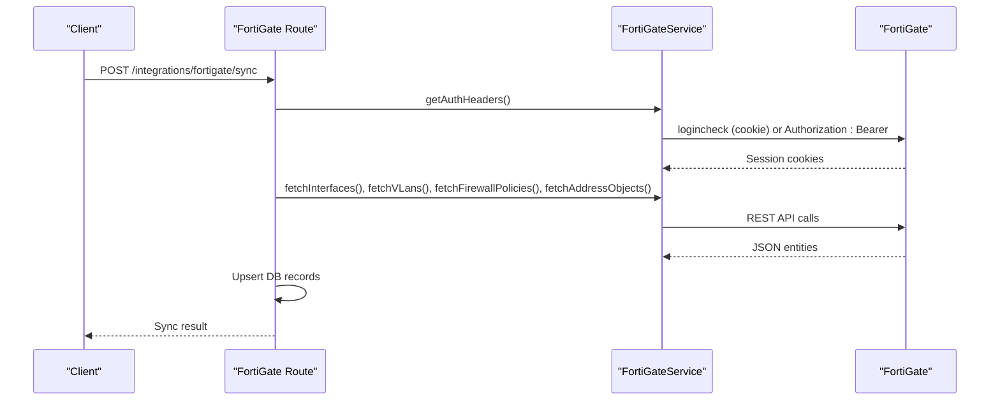
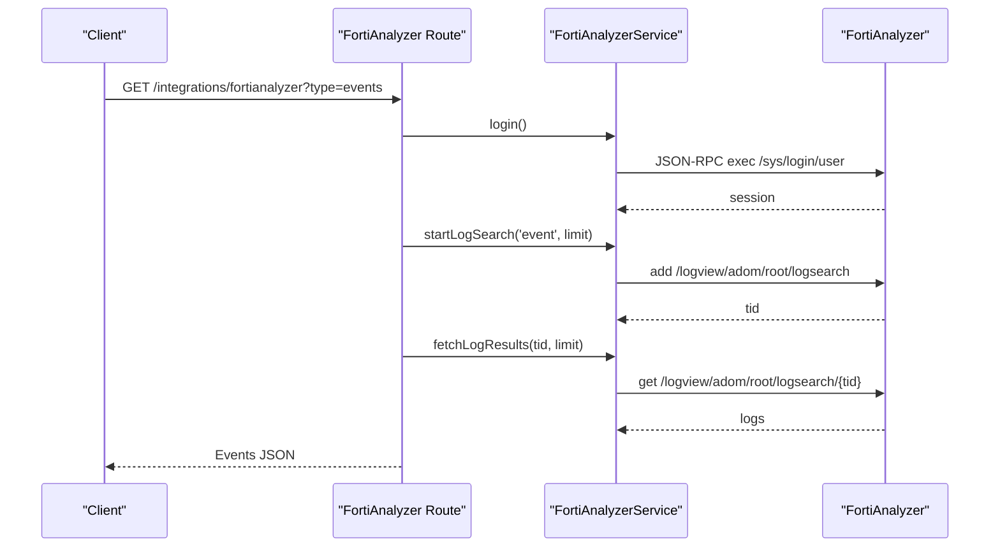
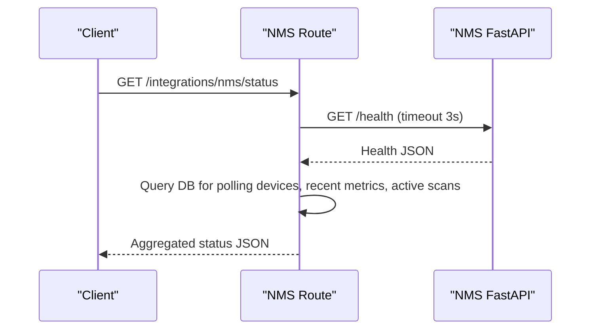
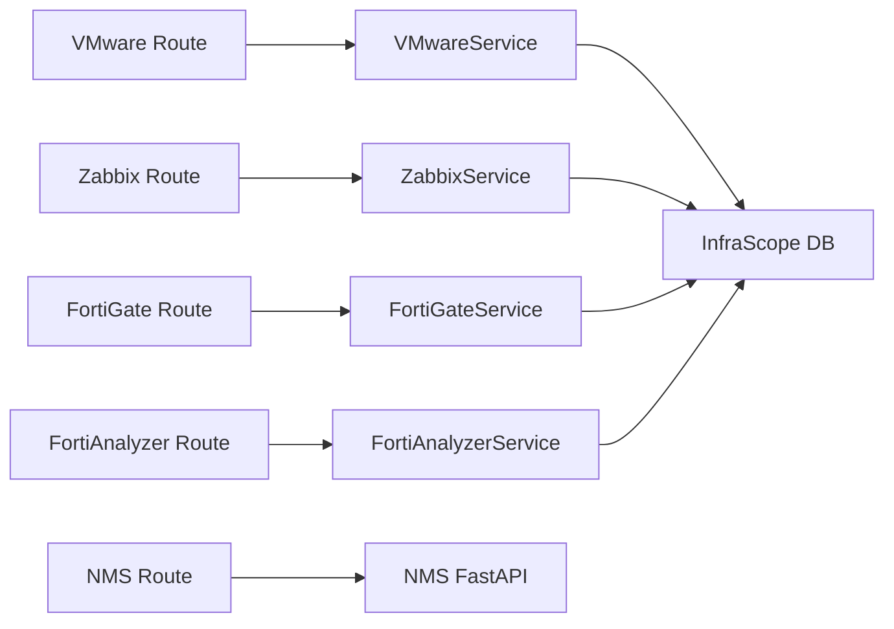

# Integration APIs

<cite>
**Referenced Files in This Document**
- [route.ts](file://app/api/integrations/vmware/route.ts)
- [route.ts](file://app/api/integrations/zabbix/route.ts)
- [route.ts](file://app/api/integrations/fortigate/route.ts)
- [route.ts](file://app/api/integrations/fortianalyzer/route.ts)
- [route.ts](file://app/api/integrations/nms/route.ts)
- [vmware.ts](file://lib/integrations/vmware.ts)
- [zabbix.ts](file://lib/integrations/zabbix.ts)
- [fortigate.ts](file://lib/integrations/fortigate.ts)
- [fortianalyzer.ts](file://lib/integrations/fortianalyzer.ts)
- [index.ts](file://lib/integrations/index.ts)
- [main.py](file://nms_service/main.py)
- [orchestrator.py](file://nms_service/orchestrator.py)
- [discovery_worker.py](file://nms_service/discovery_worker.py)
</cite>

## Table of Contents
1. [Introduction](#introduction)
2. [Project Structure](#project-structure)
3. [Core Components](#core-components)
4. [Architecture Overview](#architecture-overview)
5. [Detailed Component Analysis](#detailed-component-analysis)
6. [Dependency Analysis](#dependency-analysis)
7. [Performance Considerations](#performance-considerations)
8. [Troubleshooting Guide](#troubleshooting-guide)
9. [Conclusion](#conclusion)

## Introduction
This document describes the multi-system integration APIs used by InfraScope to connect with VMware vCenter, Zabbix, Fortinet FortiOS devices (FortiGate and FortiAnalyzer), and the internal NMS service for network device discovery, SNMP polling, and network scanning. It covers endpoint definitions, request/response semantics, authentication and security, caching and performance strategies, and operational guidance for health monitoring and synchronization.

## Project Structure
The integration surface is organized around Next.js API routes under app/api/integrations/<system>, each delegating to a dedicated service class in lib/integrations. The NMS service is a separate FastAPI application (nms_service) that runs internally and exposes endpoints consumed by InfraScope’s API routes.

**Diagram sources**
- [route.ts:1-800](file://app/api/integrations/vmware/route.ts#L1-L800)
- [route.ts:1-203](file://app/api/integrations/zabbix/route.ts#L1-L203)
- [route.ts:1-559](file://app/api/integrations/fortigate/route.ts#L1-L559)
- [route.ts:1-392](file://app/api/integrations/fortianalyzer/route.ts#L1-L392)
- [route.ts:1-53](file://app/api/integrations/nms/route.ts#L1-L53)
- [vmware.ts:1-800](file://lib/integrations/vmware.ts#L1-L800)
- [zabbix.ts:1-438](file://lib/integrations/zabbix.ts#L1-L438)
- [fortigate.ts:1-800](file://lib/integrations/fortigate.ts#L1-L800)
- [fortianalyzer.ts:1-800](file://lib/integrations/fortianalyzer.ts#L1-L800)
- [main.py:1-483](file://nms_service/main.py#L1-L483)

**Section sources**
- [route.ts:1-800](file://app/api/integrations/vmware/route.ts#L1-L800)
- [route.ts:1-203](file://app/api/integrations/zabbix/route.ts#L1-L203)
- [route.ts:1-559](file://app/api/integrations/fortigate/route.ts#L1-L559)
- [route.ts:1-392](file://app/api/integrations/fortianalyzer/route.ts#L1-L392)
- [route.ts:1-53](file://app/api/integrations/nms/route.ts#L1-L53)
- [vmware.ts:1-800](file://lib/integrations/vmware.ts#L1-L800)
- [zabbix.ts:1-438](file://lib/integrations/zabbix.ts#L1-L438)
- [fortigate.ts:1-800](file://lib/integrations/fortigate.ts#L1-L800)
- [fortianalyzer.ts:1-800](file://lib/integrations/fortianalyzer.ts#L1-L800)
- [main.py:1-483](file://nms_service/main.py#L1-L483)

## Core Components
- VMware vCenter integration: Provides inventory retrieval (VMs, hosts, clusters, datastores), snapshot management, capacity analytics, and event testing.
- Zabbix integration: Provides connection status checks, test connectivity, and bidirectional synchronization to InfraScope inventory.
- FortiGate integration: Provides connection status, sync to inventory, and CMDB enrichment for policies and address objects.
- FortiAnalyzer integration: Provides login, status, ADOM enumeration, event and traffic log retrieval, FortiView dashboards, and configuration revision fallback.
- NMS service integration: Exposes internal endpoints for device polling, discovery scans, and topology, queried by InfraScope’s API.

**Section sources**
- [route.ts:1-800](file://app/api/integrations/vmware/route.ts#L1-L800)
- [route.ts:1-203](file://app/api/integrations/zabbix/route.ts#L1-L203)
- [route.ts:1-559](file://app/api/integrations/fortigate/route.ts#L1-L559)
- [route.ts:1-392](file://app/api/integrations/fortianalyzer/route.ts#L1-L392)
- [route.ts:1-53](file://app/api/integrations/nms/route.ts#L1-L53)

## Architecture Overview
The integration architecture separates concerns:
- API routes validate inputs, manage configuration, and orchestrate service calls.
- Service classes encapsulate provider-specific protocols (REST/SOAP/JSON-RPC) and data mapping.
- The NMS service runs independently, performing SNMP/SSH polling and discovery, exposing metrics and topology to InfraScope.

**Diagram sources**
- [route.ts:187-800](file://app/api/integrations/vmware/route.ts#L187-L800)
- [route.ts:58-202](file://app/api/integrations/zabbix/route.ts#L58-L202)
- [route.ts:364-558](file://app/api/integrations/fortigate/route.ts#L364-L558)
- [route.ts:30-108](file://app/api/integrations/fortianalyzer/route.ts#L30-L108)
- [vmware.ts:694-743](file://lib/integrations/vmware.ts#L694-L743)
- [zabbix.ts:129-147](file://lib/integrations/zabbix.ts#L129-L147)
- [fortigate.ts:288-334](file://lib/integrations/fortigate.ts#L288-L334)
- [fortianalyzer.ts:280-433](file://lib/integrations/fortianalyzer.ts#L280-L433)

## Detailed Component Analysis

### VMware vCenter Integration API
Endpoints:
- GET /api/integrations/vmware?type=status
- GET /api/integrations/vmware?type=dashboard
- GET /api/integrations/vmware?type=summary
- GET /api/integrations/vmware?type=vms
- GET /api/integrations/vmware?type=hosts
- GET /api/integrations/vmware?type=clusters
- GET /api/integrations/vmware?type=datastores
- GET /api/integrations/vmware?type=snapshots&vmId=<id>
- GET /api/integrations/vmware?type=config
- GET /api/integrations/vmware?type=capacity-trends&days=<n>
- GET /api/integrations/vmware?type=growth-forecast
- GET /api/integrations/vmware?type=test-events-api
- GET /api/integrations/vmware?type=test-soap-events&minutes=<n>
- POST /api/integrations/vmware/test
- POST /api/integrations/vmware/sync
- POST /api/integrations/vmware { action: 'vm-power', vmId, operation }
- POST /api/integrations/vmware { action: 'snapshot-create|delete|revert' }

Behavior highlights:
- Authentication via REST and SOAP paths with automatic session refresh.
- In-memory cache with stale-while-revalidate for dashboard and inventory endpoints.
- Capacity analytics and forecasting helpers compute trends and growth projections.
- Event testing endpoints query SOAP history collectors and lifecycle/snapshot events.

**Diagram sources**
- [route.ts:187-440](file://app/api/integrations/vmware/route.ts#L187-L440)
- [vmware.ts:694-743](file://lib/integrations/vmware.ts#L694-L743)
- [vmware.ts:748-756](file://lib/integrations/vmware.ts#L748-L756)

**Section sources**
- [route.ts:1-800](file://app/api/integrations/vmware/route.ts#L1-L800)
- [vmware.ts:154-800](file://lib/integrations/vmware.ts#L154-L800)

### Zabbix Integration API
Endpoints:
- GET /api/integrations/zabbix/status
- POST /api/integrations/zabbix/test
- POST /api/integrations/zabbix/sync
- POST /api/integrations/zabbix { action: 'save-config', config }

Behavior highlights:
- Token-based authentication against Zabbix API.
- Bidirectional sync: pulls hosts/interfaces/triggers and maps to InfraScope device model.
- Sync logs recorded in integration sync log table with processed counts and status.

**Diagram sources**
- [route.ts:58-155](file://app/api/integrations/zabbix/route.ts#L58-L155)
- [zabbix.ts:129-147](file://lib/integrations/zabbix.ts#L129-L147)
- [zabbix.ts:255-416](file://lib/integrations/zabbix.ts#L255-L416)

**Section sources**
- [route.ts:1-203](file://app/api/integrations/zabbix/route.ts#L1-L203)
- [zabbix.ts:88-438](file://lib/integrations/zabbix.ts#L88-L438)

### FortiGate Integration API
Endpoints:
- GET /api/integrations/fortigate/status
- GET /api/integrations/fortigate?type=sync-status
- GET /api/integrations/fortigate?type=cmdb-policies
- GET /api/integrations/fortigate?type=cmdb-addresses
- GET /api/integrations/fortigate?vpn=ssl|ssl-summary|ipsec|config|interfaces|vip
- GET /api/integrations/fortigate?type=config
- POST /api/integrations/fortigate/test
- POST /api/integrations/fortigate/sync
- POST /api/integrations/fortigate { action: 'save-config', config }

Behavior highlights:
- Dual auth: cookie-based session for REST or Bearer token.
- Session lifecycle management with logout-before-relogin to prevent session pile-up.
- Cache layer for dashboard-heavy endpoints to absorb cold-start latency.
- Sync supports interfaces, VLANs, policies, addresses, and CMDB enrichment.

**Diagram sources**
- [route.ts:364-494](file://app/api/integrations/fortigate/route.ts#L364-L494)
- [fortigate.ts:288-334](file://lib/integrations/fortigate.ts#L288-L334)
- [fortigate.ts:608-779](file://lib/integrations/fortigate.ts#L608-L779)

**Section sources**
- [route.ts:1-559](file://app/api/integrations/fortigate/route.ts#L1-L559)
- [fortigate.ts:171-800](file://lib/integrations/fortigate.ts#L171-L800)

### FortiAnalyzer Integration API
Endpoints:
- GET /api/integrations/fortianalyzer?type=status
- GET /api/integrations/fortianalyzer?type=adoms
- GET /api/integrations/fortianalyzer?type=events
- GET /api/integrations/fortianalyzer?type=config-revisions
- GET /api/integrations/fortianalyzer?type=traffic
- GET /api/integrations/fortianalyzer?type=ips-critical&limit=<n>
- GET /api/integrations/fortianalyzer?type=log-search&logtype=&filter=&limit=
- GET /api/integrations/fortianalyzer?type=fortiview&view=&limit=&sort=&range=
- GET /api/integrations/fortianalyzer?type=fortiview-batch&views=&limit=&sort=&range=
- POST /api/integrations/fortianalyzer { action: 'test', config }
- POST /api/integrations/fortianalyzer { action: 'save-config', config }

Behavior highlights:
- JSON-RPC over HTTPS with session management and global state for concurrency.
- Built-in exponential backoff and account lock detection to prevent lockouts.
- In-memory cache for heavy queries (e.g., IPS critical events, FortiView).
- Fallback to NMS EventCache when FortiAnalyzer returns empty.

**Diagram sources**
- [route.ts:110-391](file://app/api/integrations/fortianalyzer/route.ts#L110-L391)
- [fortianalyzer.ts:280-433](file://lib/integrations/fortianalyzer.ts#L280-L433)
- [fortianalyzer.ts:621-766](file://lib/integrations/fortianalyzer.ts#L621-L766)

**Section sources**
- [route.ts:1-392](file://app/api/integrations/fortianalyzer/route.ts#L1-L392)
- [fortianalyzer.ts:146-800](file://lib/integrations/fortianalyzer.ts#L146-L800)

### NMS Service Integration API
Endpoint:
- GET /api/integrations/nms/status

Behavior highlights:
- Probes the internal NMS FastAPI service health and aggregates metrics:
  - NMS service status and polling activity
  - Count of polling-enabled devices
  - Recent health metrics volume
  - Active discovery scans

**Diagram sources**
- [route.ts:8-52](file://app/api/integrations/nms/route.ts#L8-L52)
- [main.py:91-98](file://nms_service/main.py#L91-L98)

**Section sources**
- [route.ts:1-53](file://app/api/integrations/nms/route.ts#L1-L53)
- [main.py:1-483](file://nms_service/main.py#L1-L483)

## Dependency Analysis
- API routes depend on service classes for provider-specific logic.
- Services depend on provider APIs and write to InfraScope’s database via Prisma.
- NMS service runs independently and is queried by InfraScope’s API routes.
- Integration configuration is persisted in InfraScope’s database and retrieved by routes/services.

**Diagram sources**
- [route.ts:187-282](file://app/api/integrations/vmware/route.ts#L187-L282)
- [route.ts:58-155](file://app/api/integrations/zabbix/route.ts#L58-L155)
- [route.ts:364-494](file://app/api/integrations/fortigate/route.ts#L364-L494)
- [route.ts:110-391](file://app/api/integrations/fortianalyzer/route.ts#L110-L391)
- [route.ts:8-52](file://app/api/integrations/nms/route.ts#L8-L52)
- [vmware.ts:154-162](file://lib/integrations/vmware.ts#L154-L162)
- [zabbix.ts:88-94](file://lib/integrations/zabbix.ts#L88-L94)
- [fortigate.ts:171-189](file://lib/integrations/fortigate.ts#L171-L189)
- [fortianalyzer.ts:146-161](file://lib/integrations/fortianalyzer.ts#L146-L161)

**Section sources**
- [index.ts:11-48](file://lib/integrations/index.ts#L11-L48)

## Performance Considerations
- Caching:
  - VMware: in-process cache with stale-while-revalidate for dashboard and inventory endpoints to reduce cold-start latency.
  - FortiGate: similar cache with background revalidation to absorb upstream latency.
  - FortiAnalyzer: in-memory cache for heavy queries (e.g., IPS critical, FortiView) with TTL.
- Concurrency:
  - FortiAnalyzer login uses a global mutex and queue to serialize concurrent login attempts across instances.
  - NMS orchestrator uses a thread pool executor to poll devices concurrently while respecting per-device intervals.
- Retries and backoff:
  - FortiAnalyzer employs retry with exponential backoff and detects account lock conditions.
- Timeouts:
  - NMS route queries the NMS service with a bounded timeout to avoid blocking.
- Rate limiting:
  - No explicit rate-limiting headers are emitted by the routes/services; rely on provider limits and backoff strategies.

[No sources needed since this section provides general guidance]

## Troubleshooting Guide
Common issues and resolutions:
- Authentication failures:
  - Verify stored credentials and tokens in integration configuration.
  - For FortiGate, ensure session cookies are valid; the service logs out and re-authenticates automatically.
  - For FortiAnalyzer, review backoff windows and potential account lock conditions.
- Session expiration:
  - VMware and FortiGate services auto-refresh sessions on 401; ensure network connectivity and certificate handling.
  - FortiAnalyzer invalidates sessions on error codes and clears global state to force re-login.
- Slow responses:
  - Use cached endpoints where available (e.g., VMware dashboard summary, FortiGate cached VPN stats).
  - Reduce query scope (e.g., limit FortiView range or IPS critical results).
- NMS polling gaps:
  - Check NMS service health and registered devices; ensure poller thread is alive and devices are marked polling-enabled.

**Section sources**
- [vmware.ts:694-743](file://lib/integrations/vmware.ts#L694-L743)
- [fortigate.ts:288-334](file://lib/integrations/fortigate.ts#L288-L334)
- [fortianalyzer.ts:195-205](file://lib/integrations/fortianalyzer.ts#L195-L205)
- [route.ts:8-52](file://app/api/integrations/nms/route.ts#L8-L52)

## Conclusion
InfraScope’s integration APIs provide robust, provider-aware connectors to VMware, Zabbix, Fortinet devices, and an internal NMS service. They emphasize resilient authentication, intelligent caching, and operational observability to support reliable inventory synchronization and monitoring workflows.