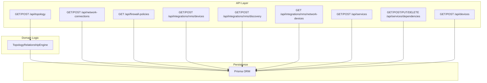
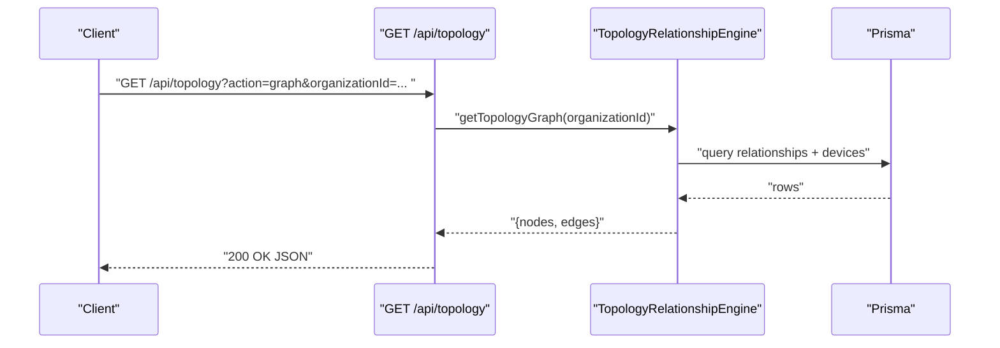
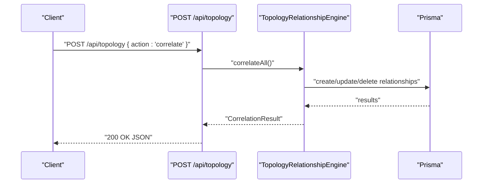
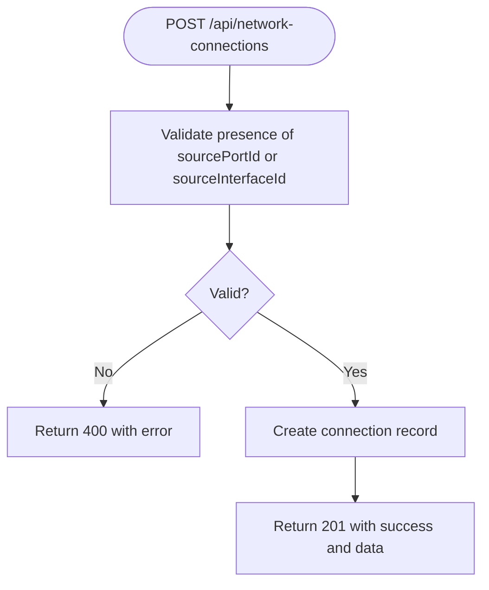
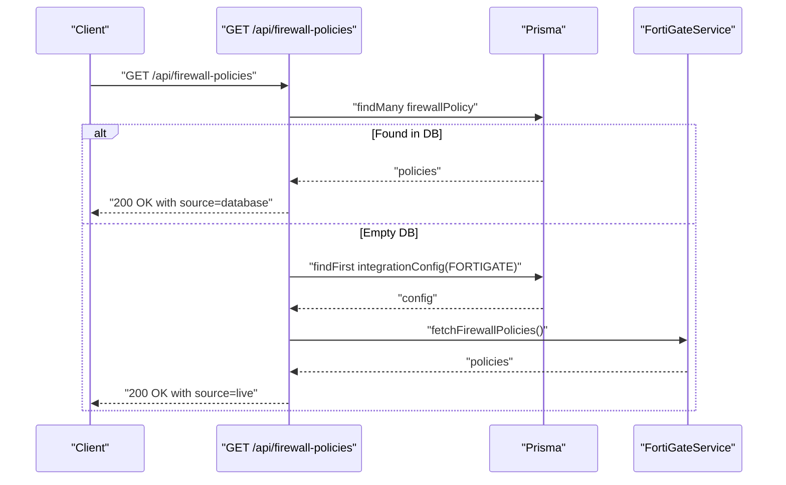
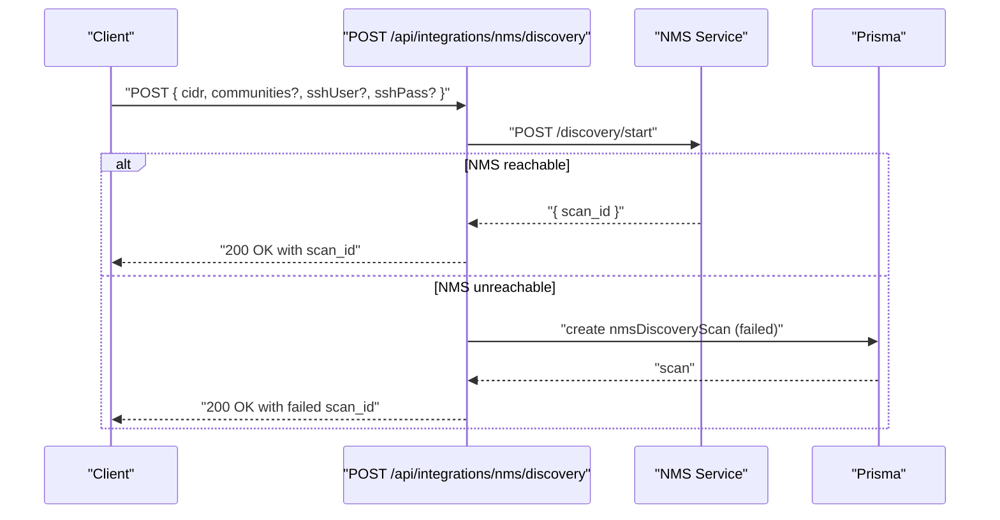
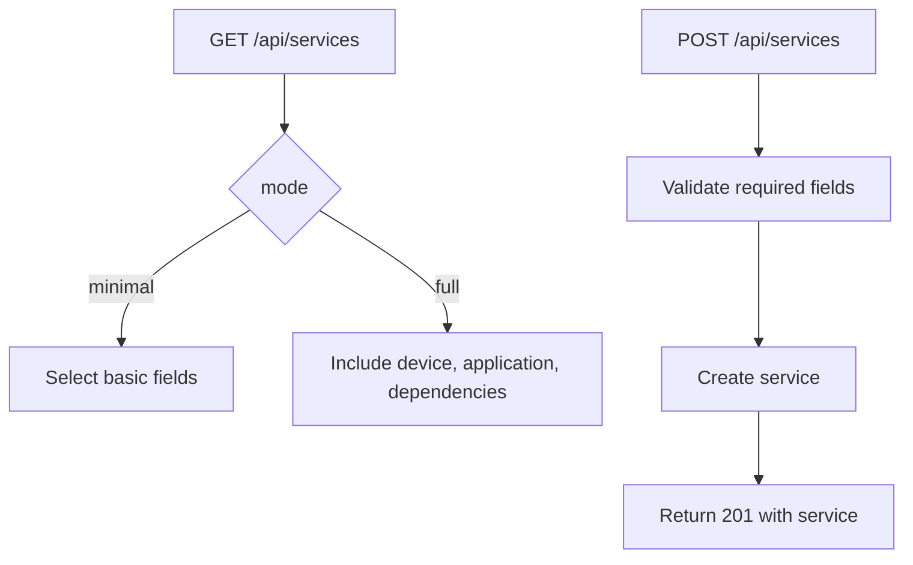
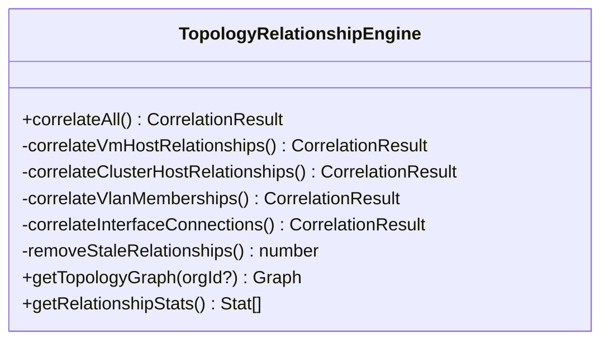

# Network Management API

<cite>
**Referenced Files in This Document**
- [app/api/topology/route.ts](file://app/api/topology/route.ts)
- [lib/topology/relationship-engine.ts](file://lib/topology/relationship-engine.ts)
- [app/api/network-connections/route.ts](file://app/api/network-connections/route.ts)
- [app/api/firewall-policies/route.ts](file://app/api/firewall-policies/route.ts)
- [app/api/integrations/nms/devices/route.ts](file://app/api/integrations/nms/devices/route.ts)
- [app/api/integrations/nms/discovery/route.ts](file://app/api/integrations/nms/discovery/route.ts)
- [app/api/integrations/nms/network-devices/route.ts](file://app/api/integrations/nms/network-devices/route.ts)
- [app/api/services/dependencies/route.ts](file://app/api/services/dependencies/route.ts)
- [app/api/services/route.ts](file://app/api/services/route.ts)
- [app/api/devices/route.ts](file://app/api/devices/route.ts)
</cite>

## Table of Contents
1. [Introduction](#introduction)
2. [Project Structure](#project-structure)
3. [Core Components](#core-components)
4. [Architecture Overview](#architecture-overview)
5. [Detailed Component Analysis](#detailed-component-analysis)
6. [Dependency Analysis](#dependency-analysis)
7. [Performance Considerations](#performance-considerations)
8. [Troubleshooting Guide](#troubleshooting-guide)
9. [Conclusion](#conclusion)

## Introduction
This document provides comprehensive API documentation for InfraScope’s network management capabilities. It covers:
- Network topology visualization and relationship correlation
- Firewall policy management and retrieval
- Network connection mapping and creation
- Network device discovery and SNMP polling integration
- Service dependency mapping and impact analysis
- Real-time status and health metrics exposure
- Security-related policy validation and access control considerations
- Troubleshooting and diagnostics endpoints

The APIs documented here are implemented under the Next.js App Router in the app/api directory and leverage Prisma ORM for persistence and a dedicated TopologyRelationshipEngine for graph computation.

## Project Structure
The network management APIs are organized by domain:
- Topology: app/api/topology/route.ts
- Network Connections: app/api/network-connections/route.ts
- Firewall Policies: app/api/firewall-policies/route.ts
- Integrations (NMS): app/api/integrations/nms/*
- Services and Dependencies: app/api/services/*
- Devices: app/api/devices/route.ts

**Diagram sources**
- [app/api/topology/route.ts:1-51](file://app/api/topology/route.ts#L1-L51)
- [lib/topology/relationship-engine.ts:39-83](file://lib/topology/relationship-engine.ts#L39-L83)
- [app/api/network-connections/route.ts:1-78](file://app/api/network-connections/route.ts#L1-L78)
- [app/api/firewall-policies/route.ts:1-112](file://app/api/firewall-policies/route.ts#L1-L112)
- [app/api/integrations/nms/devices/route.ts:1-117](file://app/api/integrations/nms/devices/route.ts#L1-L117)
- [app/api/integrations/nms/discovery/route.ts:1-83](file://app/api/integrations/nms/discovery/route.ts#L1-L83)
- [app/api/integrations/nms/network-devices/route.ts:1-69](file://app/api/integrations/nms/network-devices/route.ts#L1-L69)
- [app/api/services/route.ts:1-122](file://app/api/services/route.ts#L1-L122)
- [app/api/services/dependencies/route.ts:1-228](file://app/api/services/dependencies/route.ts#L1-L228)
- [app/api/devices/route.ts:1-142](file://app/api/devices/route.ts#L1-L142)

**Section sources**
- [app/api/topology/route.ts:1-51](file://app/api/topology/route.ts#L1-L51)
- [lib/topology/relationship-engine.ts:39-83](file://lib/topology/relationship-engine.ts#L39-L83)
- [app/api/network-connections/route.ts:1-78](file://app/api/network-connections/route.ts#L1-L78)
- [app/api/firewall-policies/route.ts:1-112](file://app/api/firewall-policies/route.ts#L1-L112)
- [app/api/integrations/nms/devices/route.ts:1-117](file://app/api/integrations/nms/devices/route.ts#L1-L117)
- [app/api/integrations/nms/discovery/route.ts:1-83](file://app/api/integrations/nms/discovery/route.ts#L1-L83)
- [app/api/integrations/nms/network-devices/route.ts:1-69](file://app/api/integrations/nms/network-devices/route.ts#L1-L69)
- [app/api/services/route.ts:1-122](file://app/api/services/route.ts#L1-L122)
- [app/api/services/dependencies/route.ts:1-228](file://app/api/services/dependencies/route.ts#L1-L228)
- [app/api/devices/route.ts:1-142](file://app/api/devices/route.ts#L1-L142)

## Core Components
- Topology API: Returns topology graph and statistics; triggers correlation of relationships.
- Network Connections API: Lists and creates network connections between interfaces and switch ports.
- Firewall Policies API: Retrieves firewall policies from database or live FortiGate integration.
- NMS Integration APIs: Manage SNMP-enabled devices, start discovery scans, and expose health metrics.
- Services and Dependencies APIs: CRUD for services and dependency mapping for impact analysis.
- Devices API: CRUD for manually managed network devices.

**Section sources**
- [app/api/topology/route.ts:4-28](file://app/api/topology/route.ts#L4-L28)
- [app/api/network-connections/route.ts:4-34](file://app/api/network-connections/route.ts#L4-L34)
- [app/api/firewall-policies/route.ts:5-34](file://app/api/firewall-policies/route.ts#L5-L34)
- [app/api/integrations/nms/devices/route.ts:12-60](file://app/api/integrations/nms/devices/route.ts#L12-L60)
- [app/api/integrations/nms/discovery/route.ts:12-35](file://app/api/integrations/nms/discovery/route.ts#L12-L35)
- [app/api/services/dependencies/route.ts:4-81](file://app/api/services/dependencies/route.ts#L4-L81)
- [app/api/devices/route.ts:10-94](file://app/api/devices/route.ts#L10-L94)

## Architecture Overview
The network management APIs follow a layered pattern:
- HTTP handlers in app/api/* translate requests to domain actions
- Domain logic (e.g., TopologyRelationshipEngine) encapsulates topology computations
- Prisma ORM persists and retrieves data from the database
- NMS integration APIs proxy to an internal NMS service for discovery and polling

**Diagram sources**
- [app/api/topology/route.ts:4-28](file://app/api/topology/route.ts#L4-L28)
- [lib/topology/relationship-engine.ts:390-474](file://lib/topology/relationship-engine.ts#L390-L474)

## Detailed Component Analysis

### Topology API
- Purpose: Visualize network topology and compute relationship statistics.
- Endpoints:
  - GET /api/topology?action=graph&organizationId={id}: Returns nodes and edges for a graph view.
  - GET /api/topology?action=stats: Returns counts per relationship type.
  - POST /api/topology?action=correlate: Triggers automatic correlation of relationships across VM/host, VLAN membership, and interface connections.

- Request parameters:
  - organizationId: Optional UUID to scope the topology.
  - action: One of graph, stats, correlate.

- Response schemas:
  - Graph response: { nodes: TopologyNode[], edges: TopologyEdge[] }
  - Stats response: { relationshipType: string, _count: number }[]
  - Correlation response: { relationshipsCreated: number, relationshipsUpdated: number, relationshipsDeleted: number, errors: string[] }

- Example usage:
  - Retrieve topology for an organization: GET /api/topology?action=graph&organizationId=...
  - Trigger correlation: POST /api/topology?action=correlate

**Diagram sources**
- [app/api/topology/route.ts:30-50](file://app/api/topology/route.ts#L30-L50)
- [lib/topology/relationship-engine.ts:46-83](file://lib/topology/relationship-engine.ts#L46-L83)

**Section sources**
- [app/api/topology/route.ts:4-28](file://app/api/topology/route.ts#L4-L28)
- [app/api/topology/route.ts:30-50](file://app/api/topology/route.ts#L30-L50)
- [lib/topology/relationship-engine.ts:20-37](file://lib/topology/relationship-engine.ts#L20-L37)
- [lib/topology/relationship-engine.ts:390-474](file://lib/topology/relationship-engine.ts#L390-L474)
- [lib/topology/relationship-engine.ts:502-513](file://lib/topology/relationship-engine.ts#L502-L513)

### Network Connections API
- Purpose: Discover and manage physical and logical network connections between devices, interfaces, and switch ports.
- Endpoints:
  - GET /api/network-connections: Lists all connections with related device/interface data.
  - POST /api/network-connections: Creates a new connection with optional name, type, and status.

- Request body (POST):
  - name: Optional string
  - type: Optional enum-like string (defaults to ETHERNET)
  - sourcePortId: Optional string (switch port)
  - sourceInterfaceId: Optional string (device interface)
  - destPortId: Optional string (switch port)
  - destInterfaceId: Optional string (device interface)
  - status: Optional enum-like string (defaults to DOWN)

- Response schemas:
  - GET: { success: boolean, data: Connection[], timestamp: date }
  - POST: { success: boolean, data: Connection, timestamp: date }

- Example usage:
  - List connections: GET /api/network-connections
  - Create a connection: POST /api/network-connections with required identifiers

**Diagram sources**
- [app/api/network-connections/route.ts:36-77](file://app/api/network-connections/route.ts#L36-L77)

**Section sources**
- [app/api/network-connections/route.ts:4-34](file://app/api/network-connections/route.ts#L4-L34)
- [app/api/network-connections/route.ts:36-77](file://app/api/network-connections/route.ts#L36-L77)

### Firewall Policies API
- Purpose: Retrieve firewall policies from the database or live FortiGate integration.
- Endpoint:
  - GET /api/firewall-policies: Returns policies with hit counts and device metadata.

- Behavior:
  - If database has policies, returns them ordered by hit count descending.
  - If database is empty, authenticates against FortiGate using stored integration config and fetches policies.
  - Serializes numeric hit counts to strings for compatibility.

- Response schemas:
  - Success: { success: boolean, data: Policy[], count: number, source: 'database' | 'live' }
  - Failure: { success: boolean, error: string, data: [], count: 0 }

- Example usage:
  - Fetch policies: GET /api/firewall-policies

**Diagram sources**
- [app/api/firewall-policies/route.ts:5-34](file://app/api/firewall-policies/route.ts#L5-L34)
- [app/api/firewall-policies/route.ts:36-103](file://app/api/firewall-policies/route.ts#L36-L103)

**Section sources**
- [app/api/firewall-policies/route.ts:5-34](file://app/api/firewall-policies/route.ts#L5-L34)
- [app/api/firewall-policies/route.ts:36-103](file://app/api/firewall-policies/route.ts#L36-L103)

### NMS Integration APIs
- Devices endpoint:
  - GET /api/integrations/nms/devices?enabled=true: Lists devices with SNMP polling configured and optional filtering by enabledOnly.
  - POST /api/integrations/nms/devices: Enables SNMP polling on a device by assigning nmsDeviceId and SNMP settings.

- Discovery endpoint:
  - GET /api/integrations/nms/discovery?limit=20: Lists recent discovery scans.
  - POST /api/integrations/nms/discovery: Starts a discovery scan; proxies to NMS service or falls back to creating a record.

- Network devices endpoint:
  - GET /api/integrations/nms/network-devices?vendor=...&status=...: Returns a dashboard-friendly list of monitored devices with connection status derived from last polled time.

- Request/response schemas:
  - Devices GET: { devices: DeviceWithHealth[], total: number }
  - Devices POST: { device: AssignedDevice }
  - Discovery GET: { scans: Scan[], total: number }
  - Discovery POST: { scan_id: string, status: string, cidr: string, message: string }
  - Network devices GET: { data: DeviceStatus[], total: number }

- Example usage:
  - Enable polling: POST /api/integrations/nms/devices with deviceId, managementIp, snmpCommunity
  - Start discovery: POST /api/integrations/nms/discovery with cidr, communities, ssh credentials
  - List monitored devices: GET /api/integrations/nms/network-devices

**Diagram sources**
- [app/api/integrations/nms/discovery/route.ts:37-82](file://app/api/integrations/nms/discovery/route.ts#L37-L82)

**Section sources**
- [app/api/integrations/nms/devices/route.ts:12-60](file://app/api/integrations/nms/devices/route.ts#L12-L60)
- [app/api/integrations/nms/devices/route.ts:62-116](file://app/api/integrations/nms/devices/route.ts#L62-L116)
- [app/api/integrations/nms/discovery/route.ts:12-35](file://app/api/integrations/nms/discovery/route.ts#L12-L35)
- [app/api/integrations/nms/discovery/route.ts:37-82](file://app/api/integrations/nms/discovery/route.ts#L37-L82)
- [app/api/integrations/nms/network-devices/route.ts:15-60](file://app/api/integrations/nms/network-devices/route.ts#L15-L60)

### Services and Dependencies APIs
- Services endpoint:
  - GET /api/services?page=1&limit=50&mode=full|minimal: Paginates services with optional minimal or full inclusion.
  - POST /api/services: Creates a service with required fields.

- Dependencies endpoint:
  - GET /api/services/dependencies?serviceId=...: Lists dependencies for a specific service or all dependencies.
  - POST /api/services/dependencies: Creates a dependency between a service and a device.
  - PUT /api/services/dependencies: Updates a dependency’s type, criticality, or description.
  - DELETE /api/services/dependencies?id=...: Removes a dependency.

- Request/response schemas:
  - Services GET: { success: boolean, data: Service[], total: number, page: number, limit: number, totalPages: number, timestamp: date }
  - Services POST: { success: boolean, data: Service, timestamp: date }
  - Dependencies GET: { success: boolean, dependencies: Dependency[], count: number }
  - Dependencies POST: { success: boolean, dependency: Dependency }
  - Dependencies PUT: { success: boolean, dependency: Dependency }
  - Dependencies DELETE: { success: boolean, message: string }

- Example usage:
  - Create a service: POST /api/services with name, type, port, deviceId
  - Add a dependency: POST /api/services/dependencies with sourceServiceId, targetDeviceId
  - Update dependency: PUT /api/services/dependencies with id and fields to change

**Diagram sources**
- [app/api/services/route.ts:4-75](file://app/api/services/route.ts#L4-L75)
- [app/api/services/route.ts:77-121](file://app/api/services/route.ts#L77-L121)

**Section sources**
- [app/api/services/route.ts:4-75](file://app/api/services/route.ts#L4-L75)
- [app/api/services/route.ts:77-121](file://app/api/services/route.ts#L77-L121)
- [app/api/services/dependencies/route.ts:4-81](file://app/api/services/dependencies/route.ts#L4-L81)
- [app/api/services/dependencies/route.ts:83-148](file://app/api/services/dependencies/route.ts#L83-L148)
- [app/api/services/dependencies/route.ts:150-227](file://app/api/services/dependencies/route.ts#L150-L227)

### Devices API
- Purpose: Manage manually added network devices (servers, switches, routers, etc.).
- Endpoints:
  - GET /api/devices?page=1&limit=25&filterType=manual|all|type&search=&mode=full|minimal: Paginates and filters devices.
  - POST /api/devices: Creates a device with required fields.

- Request/response schemas:
  - GET: { success: boolean, data: Device[], total: number, page: number, limit: number, totalPages: number, timestamp: date }
  - POST: { success: boolean, data: Device, timestamp: date }

- Example usage:
  - List devices: GET /api/devices with pagination and filters
  - Create a device: POST /api/devices with name, type, and optional attributes

**Section sources**
- [app/api/devices/route.ts:10-94](file://app/api/devices/route.ts#L10-L94)
- [app/api/devices/route.ts:96-141](file://app/api/devices/route.ts#L96-L141)

## Dependency Analysis
The TopologyRelationshipEngine coordinates relationship correlation across multiple domains:
- Virtual-to-host and cluster-to-host relationships (VMware)
- VLAN membership relationships
- Interface neighbor relationships (CDP/LLDP)
- Stale relationship cleanup

**Diagram sources**
- [lib/topology/relationship-engine.ts:39-83](file://lib/topology/relationship-engine.ts#L39-L83)
- [lib/topology/relationship-engine.ts:46-83](file://lib/topology/relationship-engine.ts#L46-L83)

**Section sources**
- [lib/topology/relationship-engine.ts:46-83](file://lib/topology/relationship-engine.ts#L46-L83)
- [lib/topology/relationship-engine.ts:390-474](file://lib/topology/relationship-engine.ts#L390-L474)

## Performance Considerations
- Topology graph queries use raw SQL joins to minimize ORM overhead; consider indexing device and relationship tables for large datasets.
- Correlation routines iterate over collections; batch operations and early exits reduce unnecessary work.
- Discovery scans are asynchronous; the API records progress and allows fallback when the NMS service is unavailable.
- Pagination is enforced across listing endpoints to avoid large payloads.

[No sources needed since this section provides general guidance]

## Troubleshooting Guide
Common issues and resolutions:
- Topology API returns empty graph:
  - Verify organizationId is correct and devices exist.
  - Trigger correlation via POST /api/topology?action=correlate.
- Firewall policies not returned:
  - Ensure FortiGate integration is configured and enabled.
  - Check credentials and access token validity.
- NMS discovery fails:
  - Confirm NMS service availability and network connectivity.
  - Use GET /api/integrations/nms/discovery to inspect recent scan statuses.
- Network connections creation fails:
  - Ensure either sourcePortId or sourceInterfaceId is provided.
  - Validate destination identifiers if applicable.

**Section sources**
- [app/api/topology/route.ts:21-27](file://app/api/topology/route.ts#L21-L27)
- [app/api/firewall-policies/route.ts:42-48](file://app/api/firewall-policies/route.ts#L42-L48)
- [app/api/integrations/nms/discovery/route.ts:63-70](file://app/api/integrations/nms/discovery/route.ts#L63-L70)
- [app/api/network-connections/route.ts:44-50](file://app/api/network-connections/route.ts#L44-L50)

## Conclusion
InfraScope’s network management APIs provide a robust foundation for topology visualization, connection mapping, policy retrieval, device lifecycle management, and integration with external systems like FortiGate and the NMS service. By leveraging Prisma for persistence and a dedicated topology engine for graph computation, the platform supports real-time insights and operational workflows. Extending these APIs with additional security validations, richer diagnostics, and automated remediation can further enhance network observability and control.

[No sources needed since this section summarizes without analyzing specific files]