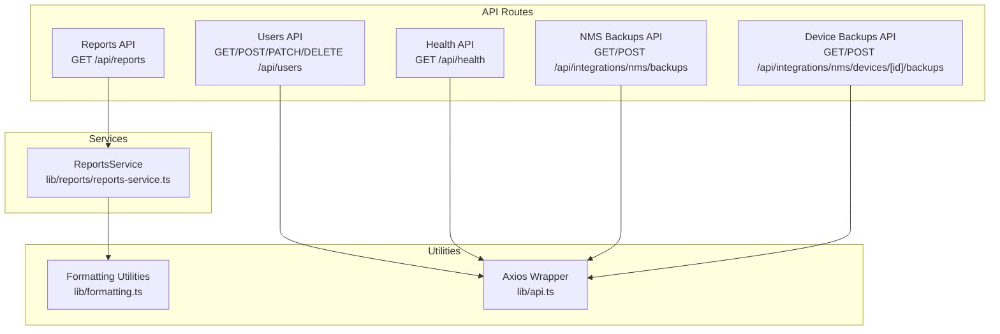
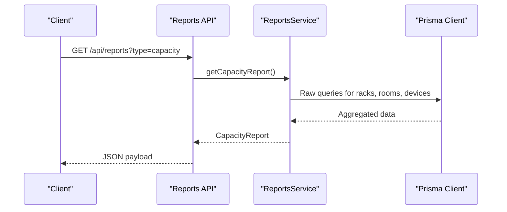
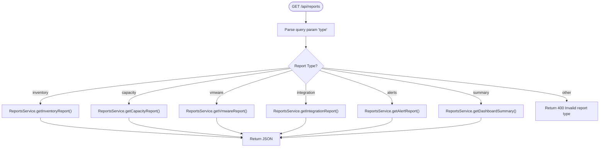
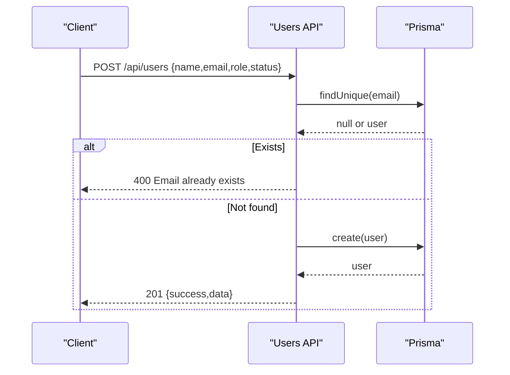
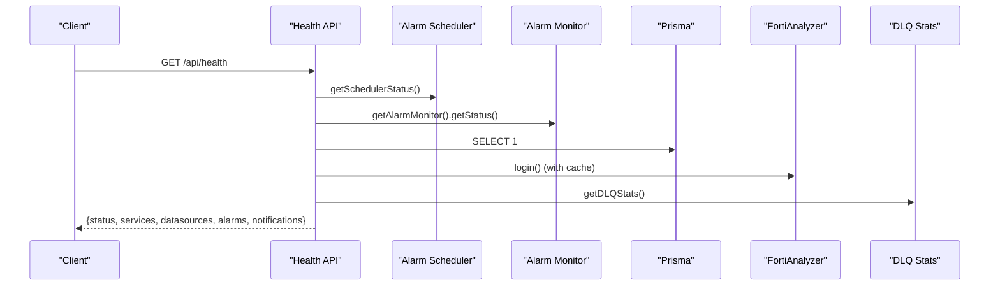
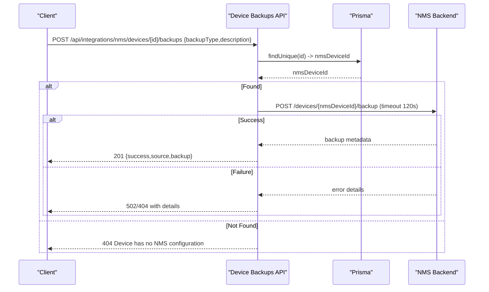
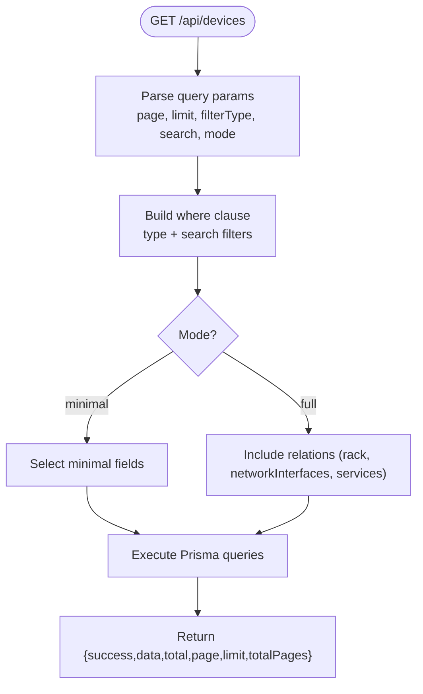
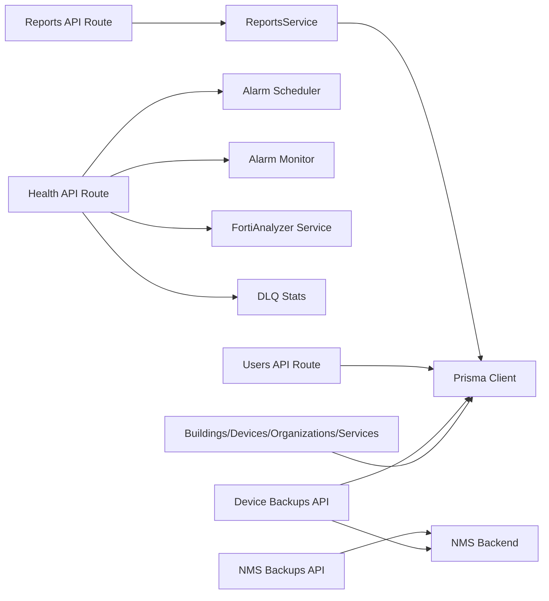

# Utility Services API

<cite>
**Referenced Files in This Document**
- [app/api/reports/route.ts](file://app/api/reports/route.ts)
- [lib/reports/reports-service.ts](file://lib/reports/reports-service.ts)
- [lib/reports/index.ts](file://lib/reports/index.ts)
- [app/api/users/route.ts](file://app/api/users/route.ts)
- [app/api/health/route.ts](file://app/api/health/route.ts)
- [app/api/integrations/nms/backups/route.ts](file://app/api/integrations/nms/backups/route.ts)
- [app/api/integrations/nms/devices/[id]/backups/route.ts](file://app/api/integrations/nms/devices/[id]/backups/route.ts)
- [lib/formatting.ts](file://lib/formatting.ts)
- [lib/api.ts](file://lib/api.ts)
- [app/api/buildings/route.ts](file://app/api/buildings/route.ts)
- [app/api/devices/route.ts](file://app/api/devices/route.ts)
- [app/api/organizations/route.ts](file://app/api/organizations/route.ts)
- [app/api/services/route.ts](file://app/api/services/route.ts)
</cite>

## Table of Contents
1. [Introduction](#introduction)
2. [Project Structure](#project-structure)
3. [Core Components](#core-components)
4. [Architecture Overview](#architecture-overview)
5. [Detailed Component Analysis](#detailed-component-analysis)
6. [Dependency Analysis](#dependency-analysis)
7. [Performance Considerations](#performance-considerations)
8. [Troubleshooting Guide](#troubleshooting-guide)
9. [Conclusion](#conclusion)
10. [Appendices](#appendices)

## Introduction
This document describes the Utility Services API for InfraScope, focusing on administrative and utility endpoints that support reporting, user management, health monitoring, backup and recovery, configuration management, and utility functions for data formatting. It consolidates the backend API routes and their underlying services to help operators and developers integrate with InfraScope programmatically.

## Project Structure
The Utility Services API is primarily implemented as Next.js App Router API routes under app/api/. Supporting services and utilities reside in lib/.

**Diagram sources**
- [app/api/reports/route.ts:1-45](file://app/api/reports/route.ts#L1-L45)
- [lib/reports/reports-service.ts:65-426](file://lib/reports/reports-service.ts#L65-L426)
- [app/api/users/route.ts:1-161](file://app/api/users/route.ts#L1-L161)
- [app/api/health/route.ts:1-255](file://app/api/health/route.ts#L1-L255)
- [app/api/integrations/nms/backups/route.ts:1-50](file://app/api/integrations/nms/backups/route.ts#L1-L50)
- [app/api/integrations/nms/devices/[id]/backups/route.ts](file://app/api/integrations/nms/devices/[id]/backups/route.ts#L1-L129)
- [lib/formatting.ts:1-176](file://lib/formatting.ts#L1-L176)
- [lib/api.ts:1-57](file://lib/api.ts#L1-L57)

**Section sources**
- [app/api/reports/route.ts:1-45](file://app/api/reports/route.ts#L1-L45)
- [lib/reports/reports-service.ts:65-426](file://lib/reports/reports-service.ts#L65-L426)
- [app/api/users/route.ts:1-161](file://app/api/users/route.ts#L1-L161)
- [app/api/health/route.ts:1-255](file://app/api/health/route.ts#L1-L255)
- [app/api/integrations/nms/backups/route.ts:1-50](file://app/api/integrations/nms/backups/route.ts#L1-L50)
- [app/api/integrations/nms/devices/[id]/backups/route.ts](file://app/api/integrations/nms/devices/[id]/backups/route.ts#L1-L129)
- [lib/formatting.ts:1-176](file://lib/formatting.ts#L1-L176)
- [lib/api.ts:1-57](file://lib/api.ts#L1-L57)

## Core Components
- Reporting APIs: Generate capacity, inventory, VMware, integration, and alert summaries via a single endpoint with type-specific report generation.
- User Management APIs: Retrieve users with stats, create users, update user attributes, and delete users.
- Health Check APIs: Comprehensive system health with service status, datasource health, alarm stats, and notification DLQ metrics.
- Backup and Recovery APIs: Proxy NMS backups listing and creation, and device-specific backup orchestration.
- Configuration Management APIs: Administrative endpoints for buildings, devices, organizations, services, and related entities.
- Utility Functions: Formatting helpers for device names, statuses, criticality, vendor logos, dates, ports, sizes, and percentages.

**Section sources**
- [app/api/reports/route.ts:4-44](file://app/api/reports/route.ts#L4-L44)
- [lib/reports/reports-service.ts:65-426](file://lib/reports/reports-service.ts#L65-L426)
- [app/api/users/route.ts:4-161](file://app/api/users/route.ts#L4-L161)
- [app/api/health/route.ts:204-254](file://app/api/health/route.ts#L204-L254)
- [app/api/integrations/nms/backups/route.ts:9-49](file://app/api/integrations/nms/backups/route.ts#L9-L49)
- [app/api/integrations/nms/devices/[id]/backups/route.ts](file://app/api/integrations/nms/devices/[id]/backups/route.ts#L16-L123)
- [lib/formatting.ts:8-176](file://lib/formatting.ts#L8-L176)

## Architecture Overview
The API routes act as thin controllers delegating to service classes and utilities. The ReportsService encapsulates report generation logic and uses Prisma for database queries. Health API coordinates alarm services and integrates with external systems (e.g., FortiAnalyzer) and internal DLQ metrics. Backup APIs proxy to the NMS backend with timeouts and error handling.

**Diagram sources**
- [app/api/reports/route.ts:4-44](file://app/api/reports/route.ts#L4-L44)
- [lib/reports/reports-service.ts:147-225](file://lib/reports/reports-service.ts#L147-L225)

**Section sources**
- [app/api/reports/route.ts:4-44](file://app/api/reports/route.ts#L4-L44)
- [lib/reports/reports-service.ts:65-426](file://lib/reports/reports-service.ts#L65-L426)

## Detailed Component Analysis

### Reporting APIs
- Endpoint: GET /api/reports
- Query parameters:
  - type: inventory | capacity | vmware | integration | alerts | summary
- Behavior:
  - Selects report type and delegates to ReportsService methods.
  - Returns structured report data or error on invalid type.
- Supported report types:
  - InventoryReport: device counts by type/vendor/status/criticality, recent additions, top vendors.
  - CapacityReport: rack utilization, power/cooling estimates, room-wise stats.
  - VmwareReport: cluster/host/vm/datastore counts, host utilization averages, datastore utilization.
  - IntegrationReport: counts and last sync timestamps for Zabbix, VMware, Fortigate.
  - AlertReport: counts by severity, recent alerts, top alerting devices.
  - Dashboard summary: combined report fields plus generation timestamp.

**Diagram sources**
- [app/api/reports/route.ts:4-44](file://app/api/reports/route.ts#L4-L44)
- [lib/reports/reports-service.ts:75-422](file://lib/reports/reports-service.ts#L75-L422)

**Section sources**
- [app/api/reports/route.ts:4-44](file://app/api/reports/route.ts#L4-L44)
- [lib/reports/reports-service.ts:65-426](file://lib/reports/reports-service.ts#L65-L426)
- [lib/reports/index.ts:1-9](file://lib/reports/index.ts#L1-L9)

### User Management APIs
- GET /api/users
  - Retrieves users ordered by creation time, formats role/status to lowercase, computes stats (total, active, inactive, admins), and returns success flag.
- POST /api/users
  - Creates a new user with validation for unique email, defaults role/status if missing, and returns created user data.
- PATCH /api/users
  - Updates user fields (name, email, role, status) with optional updates and returns updated user data.
- DELETE /api/users?id={id}
  - Deletes a user by ID and returns success flag.

**Diagram sources**
- [app/api/users/route.ts:57-100](file://app/api/users/route.ts#L57-L100)

**Section sources**
- [app/api/users/route.ts:4-161](file://app/api/users/route.ts#L4-L161)

### Health Check APIs
- GET /api/health
- Features:
  - Ensures alarm scheduler and monitor are running (auto-restarts if stopped).
  - Checks database connectivity.
  - Checks FortiAnalyzer health with caching to avoid repeated login failures.
  - Checks VMware health if configured.
  - Gathers alarm statistics (definitions, recent events/errors).
  - Gathers Dead Letter Queue (DLQ) notification stats.
  - Determines overall status (healthy/degraded/unhealthy) and returns appropriate HTTP status.

**Diagram sources**
- [app/api/health/route.ts:204-254](file://app/api/health/route.ts#L204-L254)

**Section sources**
- [app/api/health/route.ts:1-255](file://app/api/health/route.ts#L1-L255)

### Backup and Recovery APIs
- NMS Backups (proxy):
  - GET /api/integrations/nms/backups
    - Proxies to NMS backend with query params (device_id, backup_type, search) and enforces timeouts.
  - POST /api/integrations/nms/backups
    - Proxies to NMS backend to create a backup with a 90-second timeout.
- Device Backups:
  - GET /api/integrations/nms/devices/[id]/backups
    - Lists device backups stored in InfraScope DB by mapping InfraScope device to NMS device ID.
  - POST /api/integrations/nms/devices/[id]/backups
    - Triggers a backup via NMS agent with SSH; returns success with source and backup metadata or detailed errors.

**Diagram sources**
- [app/api/integrations/nms/devices/[id]/backups/route.ts](file://app/api/integrations/nms/devices/[id]/backups/route.ts#L55-L123)

**Section sources**
- [app/api/integrations/nms/backups/route.ts:9-49](file://app/api/integrations/nms/backups/route.ts#L9-L49)
- [app/api/integrations/nms/devices/[id]/backups/route.ts](file://app/api/integrations/nms/devices/[id]/backups/route.ts#L16-L123)

### Configuration Management APIs
These endpoints support administrative operations for infrastructure entities. They include caching and optimized queries to reduce load.

- Buildings
  - GET /api/buildings: Returns buildings with floors and racks; caches results for 60 seconds.
  - POST /api/buildings: Creates a building with required fields.
- Devices
  - GET /api/devices: Paginated device listing with filtering by type and search; supports minimal/full modes.
  - POST /api/devices: Creates a device with required fields.
- Organizations
  - GET /api/organizations: Returns organizations with nested buildings/floors/racks; caches results for 60 seconds.
  - POST /api/organizations: Creates an organization with required fields.
- Services
  - GET /api/services: Paginated services with minimal/full modes; supports device and dependency relations.
  - POST /api/services: Creates a service with required fields.

**Diagram sources**
- [app/api/devices/route.ts:10-94](file://app/api/devices/route.ts#L10-L94)

**Section sources**
- [app/api/buildings/route.ts:9-118](file://app/api/buildings/route.ts#L9-L118)
- [app/api/devices/route.ts:10-142](file://app/api/devices/route.ts#L10-L142)
- [app/api/organizations/route.ts:9-125](file://app/api/organizations/route.ts#L9-L125)
- [app/api/services/route.ts:4-122](file://app/api/services/route.ts#L4-L122)

### Utility Functions
Formatting utilities provide consistent presentation across the UI and API responses.

- Device and status formatting: uppercase device names, status badges, criticality labels/colors.
- Vendor logos: vendor-aware logo selection for display.
- Network formatting: IP/MAC formatting, port labels, byte sizes, percentages.
- Date/time formatting: friendly date and datetime formatting.

**Section sources**
- [lib/formatting.ts:8-176](file://lib/formatting.ts#L8-L176)

## Dependency Analysis
- Reports API depends on ReportsService, which uses Prisma for raw SQL queries and aggregates data.
- Health API depends on alarm schedulers, FortiAnalyzer service, and DLQ stats; it also performs parallel checks for robustness.
- Backup APIs depend on NMS backend URLs and enforce timeouts; device backups require mapping InfraScope device IDs to NMS device IDs.
- User Management API depends on Prisma user model and local formatting helpers.
- Configuration endpoints depend on Prisma models for buildings, devices, organizations, and services.

**Diagram sources**
- [app/api/reports/route.ts:1-45](file://app/api/reports/route.ts#L1-L45)
- [lib/reports/reports-service.ts:65-426](file://lib/reports/reports-service.ts#L65-L426)
- [app/api/health/route.ts:1-255](file://app/api/health/route.ts#L1-L255)
- [app/api/integrations/nms/backups/route.ts:1-50](file://app/api/integrations/nms/backups/route.ts#L1-L50)
- [app/api/integrations/nms/devices/[id]/backups/route.ts](file://app/api/integrations/nms/devices/[id]/backups/route.ts#L1-L129)
- [app/api/users/route.ts:1-161](file://app/api/users/route.ts#L1-L161)
- [app/api/buildings/route.ts:1-118](file://app/api/buildings/route.ts#L1-L118)
- [app/api/devices/route.ts:1-142](file://app/api/devices/route.ts#L1-L142)
- [app/api/organizations/route.ts:1-125](file://app/api/organizations/route.ts#L1-L125)
- [app/api/services/route.ts:1-122](file://app/api/services/route.ts#L1-L122)

**Section sources**
- [app/api/reports/route.ts:1-45](file://app/api/reports/route.ts#L1-L45)
- [lib/reports/reports-service.ts:65-426](file://lib/reports/reports-service.ts#L65-L426)
- [app/api/health/route.ts:1-255](file://app/api/health/route.ts#L1-L255)
- [app/api/integrations/nms/backups/route.ts:1-50](file://app/api/integrations/nms/backups/route.ts#L1-L50)
- [app/api/integrations/nms/devices/[id]/backups/route.ts](file://app/api/integrations/nms/devices/[id]/backups/route.ts#L1-L129)
- [app/api/users/route.ts:1-161](file://app/api/users/route.ts#L1-L161)
- [app/api/buildings/route.ts:1-118](file://app/api/buildings/route.ts#L1-L118)
- [app/api/devices/route.ts:1-142](file://app/api/devices/route.ts#L1-L142)
- [app/api/organizations/route.ts:1-125](file://app/api/organizations/route.ts#L1-L125)
- [app/api/services/route.ts:1-122](file://app/api/services/route.ts#L1-L122)

## Performance Considerations
- Caching: Buildings and Organizations endpoints cache results for 60 seconds to reduce DB load.
- Minimal vs Full modes: Devices and Services endpoints support minimal mode to avoid heavy joins for dashboards.
- Parallel checks: Health API runs datasource checks concurrently to minimize latency.
- Timeouts: Backup APIs enforce strict timeouts to prevent hanging requests.
- Pagination: Devices and Services endpoints cap page size and compute total pages for efficient client rendering.

[No sources needed since this section provides general guidance]

## Troubleshooting Guide
- Reports API returns 400 for invalid report type; ensure type matches supported values.
- Users API returns 400 on duplicate email during creation; verify uniqueness.
- Health API may return degraded/unhealthy when alarm services are down or when datasource checks fail; check scheduler/monitor status and external integrations.
- Backup APIs return 503 when NMS backend is unreachable; confirm NMS agent is running and reachable.
- Device Backups require a valid NMS device mapping; ensure the device has an associated nmsDeviceId.

**Section sources**
- [app/api/reports/route.ts:32-34](file://app/api/reports/route.ts#L32-L34)
- [app/api/users/route.ts:67-72](file://app/api/users/route.ts#L67-L72)
- [app/api/health/route.ts:218-226](file://app/api/health/route.ts#L218-L226)
- [app/api/integrations/nms/backups/route.ts:24-26](file://app/api/integrations/nms/backups/route.ts#L24-L26)
- [app/api/integrations/nms/devices/[id]/backups/route.ts](file://app/api/integrations/nms/devices/[id]/backups/route.ts#L23-L25)

## Conclusion
InfraScope’s Utility Services API provides a cohesive set of endpoints for reporting, user administration, health monitoring, backup orchestration, and configuration management. The design emphasizes modularity (routes → services → utilities), caching, and resilience (timeouts, parallel checks, auto-restarts), enabling reliable operations across diverse infrastructures.

[No sources needed since this section summarizes without analyzing specific files]

## Appendices

### API Reference Summary

- Reporting
  - GET /api/reports?type=inventory|capacity|vmware|integration|alerts|summary
- User Management
  - GET /api/users
  - POST /api/users
  - PATCH /api/users
  - DELETE /api/users?id={id}
- Health Monitoring
  - GET /api/health
- Backup and Recovery
  - GET /api/integrations/nms/backups
  - POST /api/integrations/nms/backups
  - GET /api/integrations/nms/devices/[id]/backups
  - POST /api/integrations/nms/devices/[id]/backups
- Configuration Management
  - GET /api/buildings
  - POST /api/buildings
  - GET /api/devices?page=&limit=&filterType=&search=&mode=
  - POST /api/devices
  - GET /api/organizations
  - POST /api/organizations
  - GET /api/services?page=&limit=&mode=
  - POST /api/services

**Section sources**
- [app/api/reports/route.ts:4-44](file://app/api/reports/route.ts#L4-L44)
- [app/api/users/route.ts:4-161](file://app/api/users/route.ts#L4-L161)
- [app/api/health/route.ts:204-254](file://app/api/health/route.ts#L204-L254)
- [app/api/integrations/nms/backups/route.ts:9-49](file://app/api/integrations/nms/backups/route.ts#L9-L49)
- [app/api/integrations/nms/devices/[id]/backups/route.ts](file://app/api/integrations/nms/devices/[id]/backups/route.ts#L16-L123)
- [app/api/buildings/route.ts:9-118](file://app/api/buildings/route.ts#L9-L118)
- [app/api/devices/route.ts:10-142](file://app/api/devices/route.ts#L10-L142)
- [app/api/organizations/route.ts:9-125](file://app/api/organizations/route.ts#L9-L125)
- [app/api/services/route.ts:4-122](file://app/api/services/route.ts#L4-L122)