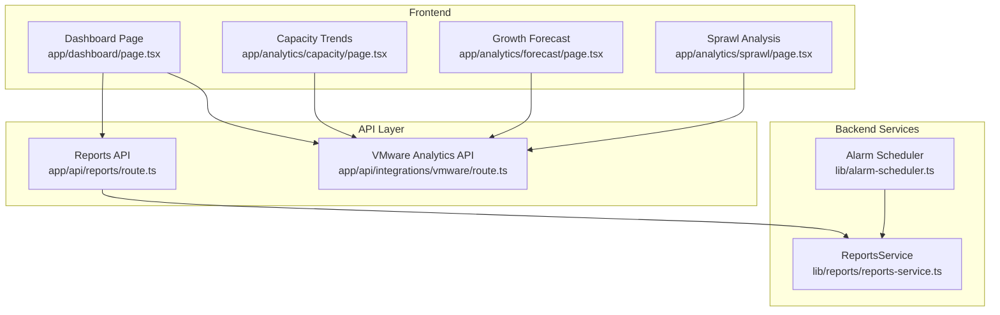
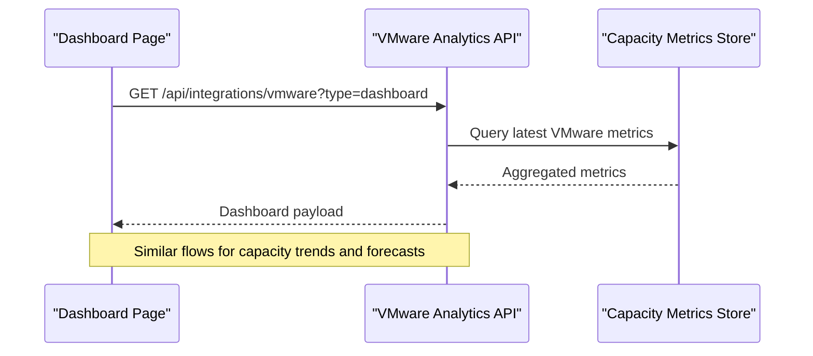
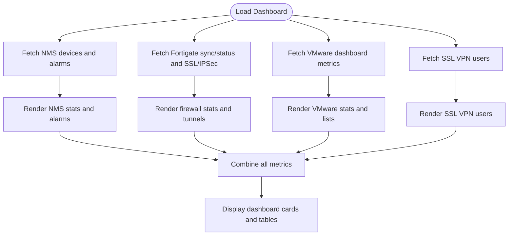
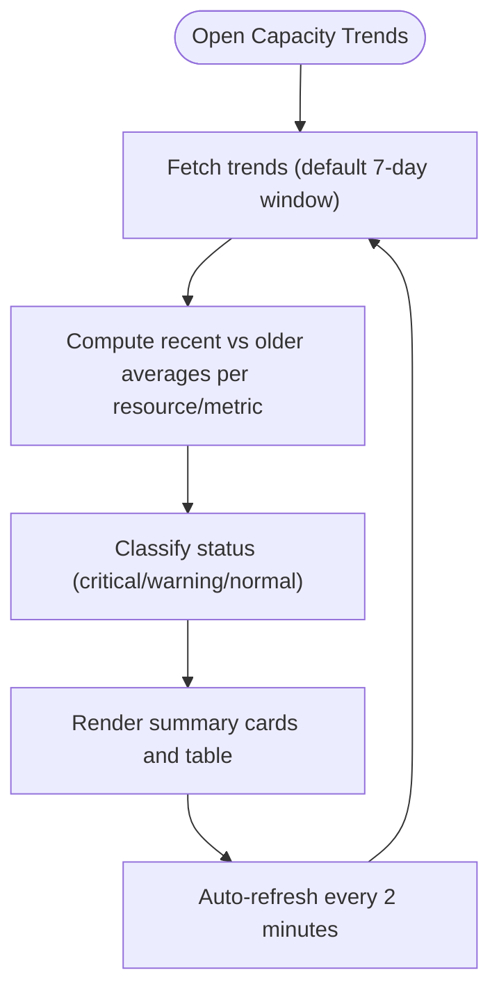
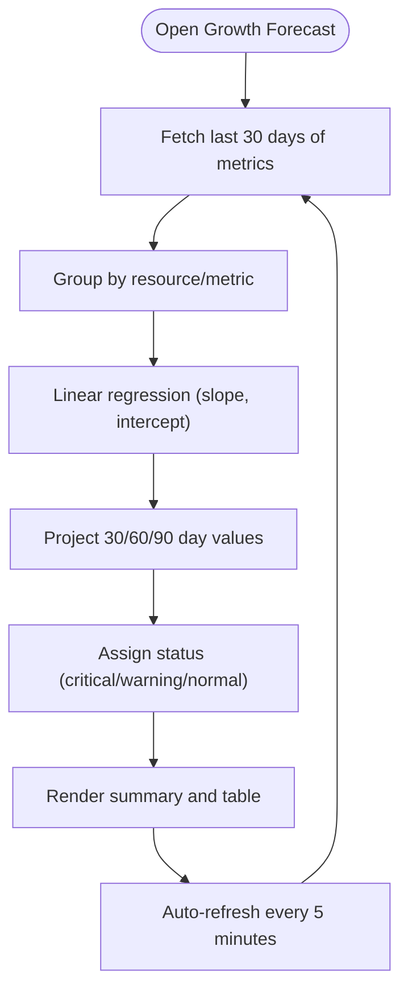
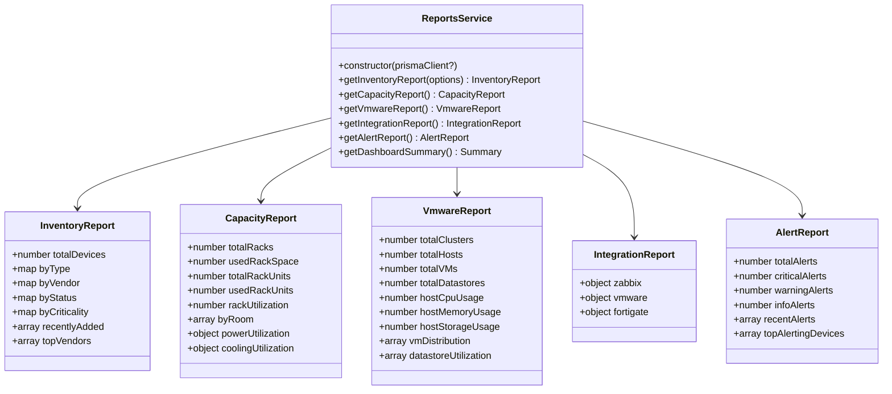
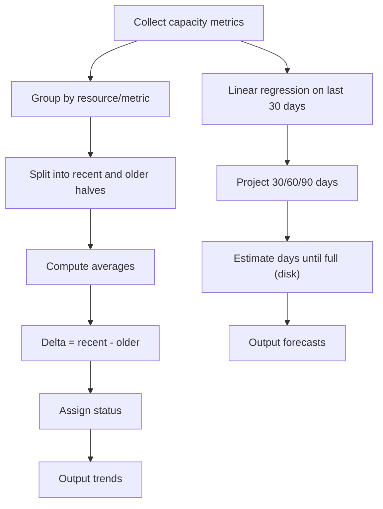
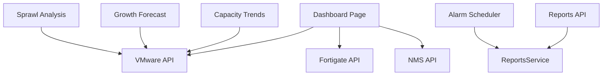

# Analytics & Reporting

<cite>
**Referenced Files in This Document**
- [app/dashboard/page.tsx](file://app/dashboard/page.tsx)
- [app/analytics/capacity/page.tsx](file://app/analytics/capacity/page.tsx)
- [app/analytics/forecast/page.tsx](file://app/analytics/forecast/page.tsx)
- [app/analytics/sprawl/page.tsx](file://app/analytics/sprawl/page.tsx)
- [lib/reports/reports-service.ts](file://lib/reports/reports-service.ts)
- [app/api/reports/route.ts](file://app/api/reports/route.ts)
- [app/api/integrations/vmware/route.ts](file://app/api/integrations/vmware/route.ts)
- [lib/alarm-scheduler.ts](file://lib/alarm-scheduler.ts)
</cite>

## Table of Contents
1. [Introduction](#introduction)
2. [Project Structure](#project-structure)
3. [Core Components](#core-components)
4. [Architecture Overview](#architecture-overview)
5. [Detailed Component Analysis](#detailed-component-analysis)
6. [Dependency Analysis](#dependency-analysis)
7. [Performance Considerations](#performance-considerations)
8. [Troubleshooting Guide](#troubleshooting-guide)
9. [Conclusion](#conclusion)

## Introduction
This document explains the analytics and reporting capabilities of the platform with a focus on:
- Dashboard architecture and key metrics overview
- Capacity planning and forecasting
- Trend analysis and actionable insights
- Reporting engine, scheduling, and export
- Visualization components and interactive dashboards
- Performance monitoring, capacity utilization tracking, and predictive analytics
- Practical examples for report creation, dashboard customization, and analytics workflows
- Data aggregation strategies and real-time analytics processing

## Project Structure
The analytics and reporting surface is organized around:
- A central dashboard page that aggregates live metrics from multiple integrations
- Dedicated analytics pages for capacity trends, growth forecasting, and sprawl analysis
- A reporting engine that generates structured reports from the data layer
- API endpoints that serve analytics data and drive periodic tasks



**Diagram sources**
- [app/dashboard/page.tsx:101-731](file://app/dashboard/page.tsx#L101-L731)
- [app/analytics/capacity/page.tsx:28-58](file://app/analytics/capacity/page.tsx#L28-L58)
- [app/analytics/forecast/page.tsx:31-60](file://app/analytics/forecast/page.tsx#L31-L60)
- [app/analytics/sprawl/page.tsx:38-68](file://app/analytics/sprawl/page.tsx#L38-L68)
- [app/api/reports/route.ts:4-44](file://app/api/reports/route.ts#L4-L44)
- [app/api/integrations/vmware/route.ts:26-96](file://app/api/integrations/vmware/route.ts#L26-L96)
- [lib/reports/reports-service.ts:65-423](file://lib/reports/reports-service.ts#L65-L423)
- [lib/alarm-scheduler.ts:26-113](file://lib/alarm-scheduler.ts#L26-L113)

**Section sources**
- [app/dashboard/page.tsx:101-731](file://app/dashboard/page.tsx#L101-L731)
- [app/analytics/capacity/page.tsx:28-58](file://app/analytics/capacity/page.tsx#L28-L58)
- [app/analytics/forecast/page.tsx:31-60](file://app/analytics/forecast/page.tsx#L31-L60)
- [app/analytics/sprawl/page.tsx:38-68](file://app/analytics/sprawl/page.tsx#L38-L68)
- [app/api/reports/route.ts:4-44](file://app/api/reports/route.ts#L4-L44)
- [app/api/integrations/vmware/route.ts:26-96](file://app/api/integrations/vmware/route.ts#L26-L96)
- [lib/reports/reports-service.ts:65-423](file://lib/reports/reports-service.ts#L65-L423)
- [lib/alarm-scheduler.ts:26-113](file://lib/alarm-scheduler.ts#L26-L113)

## Core Components
- Dashboard overview: Live cards for VMware VMs/hosts/storage, firewall policies/addresses, IPSec tunnels, SSL VPN sessions, NMS device status, and active SNMP alarms. Includes recent activity and health indicators.
- Capacity trends: Periodic collection and comparison of CPU/memory/disk usage across VMware resources, with status badges and trend icons.
- Growth forecasting: Linear regression-based projections for upcoming capacity thresholds and “days until full” estimates.
- Sprawl analysis: Scoring and recommendations for virtual machines with excessive snapshots or orphaned state.
- Reporting engine: Structured reports for inventory, capacity, VMware, integrations, and alerts; served via a single API endpoint supporting multiple report types.
- Scheduling and exports: Automated refresh intervals for analytics pages; CSV export capability for sprawl results.

**Section sources**
- [app/dashboard/page.tsx:29-731](file://app/dashboard/page.tsx#L29-L731)
- [app/analytics/capacity/page.tsx:17-90](file://app/analytics/capacity/page.tsx#L17-L90)
- [app/analytics/forecast/page.tsx:17-80](file://app/analytics/forecast/page.tsx#L17-L80)
- [app/analytics/sprawl/page.tsx:26-114](file://app/analytics/sprawl/page.tsx#L26-L114)
- [lib/reports/reports-service.ts:6-52](file://lib/reports/reports-service.ts#L6-L52)
- [app/api/reports/route.ts:4-44](file://app/api/reports/route.ts#L4-L44)

## Architecture Overview
The analytics stack integrates frontend dashboards with backend services and APIs:
- Frontend pages fetch data from dedicated API routes.
- VMware analytics endpoints compute trends and forecasts from stored capacity metrics.
- The reporting engine aggregates data from the database and exposes it via a unified reports API.
- A scheduler periodically evaluates and updates alarm-related state, ensuring continuous monitoring.



**Diagram sources**
- [app/dashboard/page.tsx:163-197](file://app/dashboard/page.tsx#L163-L197)
- [app/api/integrations/vmware/route.ts:26-96](file://app/api/integrations/vmware/route.ts#L26-L96)

## Detailed Component Analysis

### Dashboard Architecture and Key Metrics Overview
The dashboard page consolidates:
- VMware stats: VMs, hosts, storage utilization, and VM run rate
- Firewall stats: policy/address counts, SSL VPN sessions, IPSec tunnel status
- NMS stats: device counts, offline devices, critical alarms, and reachability
- Real-time lists: ESXi hosts, old snapshots, quarantined IPs, datastores by usage, IPSec tunnels, and SSL VPN users
- Health indicators: color-coded badges and progress bars for quick at-a-glance assessment



**Diagram sources**
- [app/dashboard/page.tsx:127-222](file://app/dashboard/page.tsx#L127-L222)
- [app/dashboard/page.tsx:244-731](file://app/dashboard/page.tsx#L244-L731)

**Section sources**
- [app/dashboard/page.tsx:101-731](file://app/dashboard/page.tsx#L101-L731)

### Capacity Planning and Trend Analysis
The capacity trends page:
- Periodically fetches trends for CPU, memory, and disk across VMware resources
- Computes recent vs. older averages to derive percent change
- Flags critical/warning/normal statuses based on thresholds
- Provides a summary of averages and counts for quick triage



**Diagram sources**
- [app/analytics/capacity/page.tsx:34-58](file://app/analytics/capacity/page.tsx#L34-L58)
- [app/analytics/capacity/page.tsx:118-257](file://app/analytics/capacity/page.tsx#L118-L257)

**Section sources**
- [app/analytics/capacity/page.tsx:28-90](file://app/analytics/capacity/page.tsx#L28-L90)
- [app/analytics/capacity/page.tsx:118-257](file://app/analytics/capacity/page.tsx#L118-L257)

### Growth Forecasting and Predictive Analytics
The growth forecast page:
- Uses linear regression on recent capacity metrics to project future utilization
- Highlights critical and warning forecasts for upcoming periods
- Estimates “days until full” for disk resources
- Includes a concise explanation of the calculation methodology



**Diagram sources**
- [app/analytics/forecast/page.tsx:36-60](file://app/analytics/forecast/page.tsx#L36-L60)
- [app/analytics/forecast/page.tsx:109-263](file://app/analytics/forecast/page.tsx#L109-L263)

**Section sources**
- [app/analytics/forecast/page.tsx:31-80](file://app/analytics/forecast/page.tsx#L31-L80)
- [app/analytics/forecast/page.tsx:109-263](file://app/analytics/forecast/page.tsx#L109-L263)

### Sprawl Analysis and Recommendations
The sprawl page:
- Identifies VMs with high snapshot counts and long-aging snapshots
- Assigns a risk score and reasons, plus recommendations
- Supports CSV export for further analysis
- Auto-refreshes every minute

```mermaid
flowchart TD
StartS(["Open Sprawl Analysis"]) --> FetchS["Fetch sprawl data"]
FetchS --> Filter["Filter by VM/host name"]
Filter --> Score["Compute risk score and reasons"]
Score --> Export["Export CSV (optional)"]
Export --> RenderS["Render summary and table"]
RenderS --> AutoRefreshS["Auto-refresh every 1 minute"]
AutoRefreshS --> FetchS
```

**Diagram sources**
- [app/analytics/sprawl/page.tsx:44-68](file://app/analytics/sprawl/page.tsx#L44-L68)
- [app/analytics/sprawl/page.tsx:141-287](file://app/analytics/sprawl/page.tsx#L141-L287)

**Section sources**
- [app/analytics/sprawl/page.tsx:38-114](file://app/analytics/sprawl/page.tsx#L38-L114)
- [app/analytics/sprawl/page.tsx:141-287](file://app/analytics/sprawl/page.tsx#L141-L287)

### Reporting Engine and Scheduling
The reporting engine:
- Exposes a unified API endpoint to generate inventory, capacity, VMware, integration, and alert reports
- Implements a ReportsService with aggregation queries against the database
- Supports a dashboard summary combining multiple report categories



**Diagram sources**
- [lib/reports/reports-service.ts:6-52](file://lib/reports/reports-service.ts#L6-L52)
- [lib/reports/reports-service.ts:65-423](file://lib/reports/reports-service.ts#L65-L423)

**Section sources**
- [app/api/reports/route.ts:4-44](file://app/api/reports/route.ts#L4-L44)
- [lib/reports/reports-service.ts:65-423](file://lib/reports/reports-service.ts#L65-L423)

### Data Aggregation Strategies and Real-Time Analytics
- Trend analysis groups capacity metrics by resource and metric type, splitting data into recent and older halves to compute delta percentages.
- Forecasting applies linear regression on at least three data points to estimate future utilization and “days until full.”
- Dashboard components use concurrent fetches and loading states to present responsive views while aggregating data from multiple integrations.



**Diagram sources**
- [app/api/integrations/vmware/route.ts:26-96](file://app/api/integrations/vmware/route.ts#L26-L96)

**Section sources**
- [app/analytics/capacity/page.tsx:34-58](file://app/analytics/capacity/page.tsx#L34-L58)
- [app/analytics/forecast/page.tsx:36-60](file://app/analytics/forecast/page.tsx#L36-L60)
- [app/dashboard/page.tsx:127-222](file://app/dashboard/page.tsx#L127-L222)

### Practical Examples and Workflows
- Creating a capacity trend report:
  - Navigate to the Capacity Trends page
  - Select a time window (1/7/30 days)
  - Trigger manual metric collection if needed
  - Review summary cards and the trends table; use auto-refresh to stay current
- Building a growth forecast:
  - Open the Growth Forecast page
  - Review critical and warning forecasts
  - Use “days until full” to prioritize capacity actions
- Generating a sprawl report:
  - Open the Sprawl Analysis page
  - Apply filters by VM or host name
  - Export to CSV for stakeholder review
- Customizing the dashboard:
  - Use the refresh controls on each tile
  - Click links to drill into related views (e.g., VMs, hosts, datastores)
- Monitoring performance:
  - Observe progress bars and status badges on the dashboard
  - Use the NMS connectivity indicator to track integration health

[No sources needed since this section provides practical guidance without analyzing specific files]

## Dependency Analysis
- Dashboard depends on multiple API endpoints for VMware, firewall, SSL VPN, and NMS data.
- Capacity and forecast pages depend on the VMware analytics endpoint that computes trends and forecasts from stored metrics.
- The reporting engine depends on the database and exposes a single API for report retrieval.
- The alarm scheduler ensures continuous monitoring and writes a heartbeat for health tracking.



**Diagram sources**
- [app/dashboard/page.tsx:163-197](file://app/dashboard/page.tsx#L163-L197)
- [app/analytics/capacity/page.tsx:34-58](file://app/analytics/capacity/page.tsx#L34-L58)
- [app/analytics/forecast/page.tsx:36-60](file://app/analytics/forecast/page.tsx#L36-L60)
- [app/analytics/sprawl/page.tsx:44-68](file://app/analytics/sprawl/page.tsx#L44-L68)
- [app/api/reports/route.ts:4-44](file://app/api/reports/route.ts#L4-L44)
- [lib/reports/reports-service.ts:65-423](file://lib/reports/reports-service.ts#L65-L423)
- [lib/alarm-scheduler.ts:26-113](file://lib/alarm-scheduler.ts#L26-L113)

**Section sources**
- [app/dashboard/page.tsx:101-731](file://app/dashboard/page.tsx#L101-L731)
- [app/analytics/capacity/page.tsx:28-58](file://app/analytics/capacity/page.tsx#L28-L58)
- [app/analytics/forecast/page.tsx:31-60](file://app/analytics/forecast/page.tsx#L31-L60)
- [app/analytics/sprawl/page.tsx:38-68](file://app/analytics/sprawl/page.tsx#L38-L68)
- [app/api/reports/route.ts:4-44](file://app/api/reports/route.ts#L4-L44)
- [lib/reports/reports-service.ts:65-423](file://lib/reports/reports-service.ts#L65-L423)
- [lib/alarm-scheduler.ts:26-113](file://lib/alarm-scheduler.ts#L26-L113)

## Performance Considerations
- Use appropriate time windows for trend and forecast computations to balance responsiveness and accuracy.
- Leverage auto-refresh intervals judiciously to avoid overwhelming the backend.
- Prefer grouped queries and efficient aggregation in the reporting service to minimize database load.
- Cache frequently accessed dashboard tiles where safe to reduce latency.

[No sources needed since this section provides general guidance]

## Troubleshooting Guide
- If dashboard tiles show loading or stale data:
  - Use the refresh buttons on each tile to reload.
  - Verify integration connectivity (e.g., NMS reachability badge).
- If capacity trends or forecasts fail to load:
  - Check the error messages and retry after initiating metric collection.
  - Ensure sufficient data points exist for forecasting (at least three).
- If reports fail to render:
  - Confirm the reports API endpoint is reachable and returns valid data.
  - Review server logs for detailed error messages.

**Section sources**
- [app/analytics/capacity/page.tsx:99-116](file://app/analytics/capacity/page.tsx#L99-L116)
- [app/analytics/forecast/page.tsx:90-107](file://app/analytics/forecast/page.tsx#L90-L107)
- [app/analytics/sprawl/page.tsx:122-139](file://app/analytics/sprawl/page.tsx#L122-L139)
- [app/api/reports/route.ts:36-43](file://app/api/reports/route.ts#L36-L43)

## Conclusion
The platform delivers a comprehensive analytics and reporting solution with:
- A centralized dashboard for real-time visibility
- Capacity planning tools with trend analysis and forecasting
- Sprawl detection and remediation recommendations
- A robust reporting engine and scheduling system
- Practical workflows for creating reports, customizing dashboards, and tracking performance