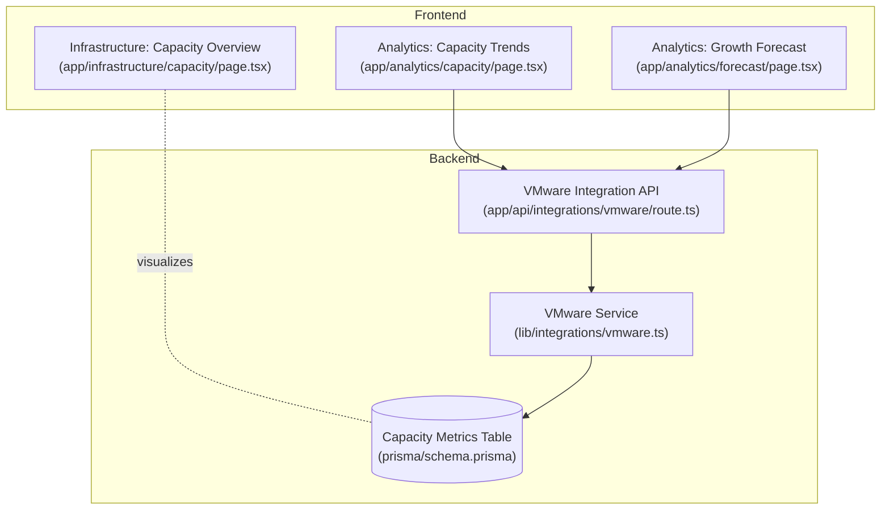
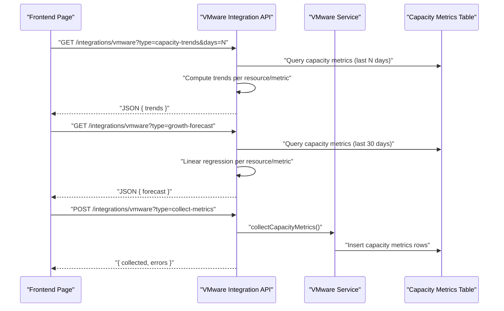
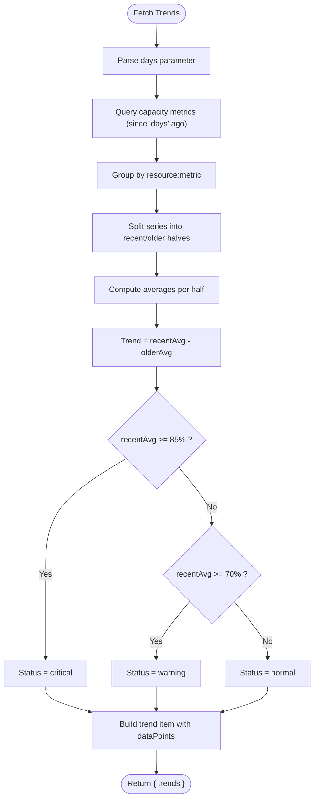
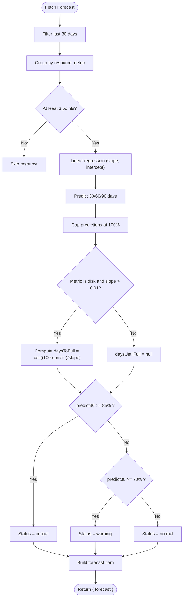
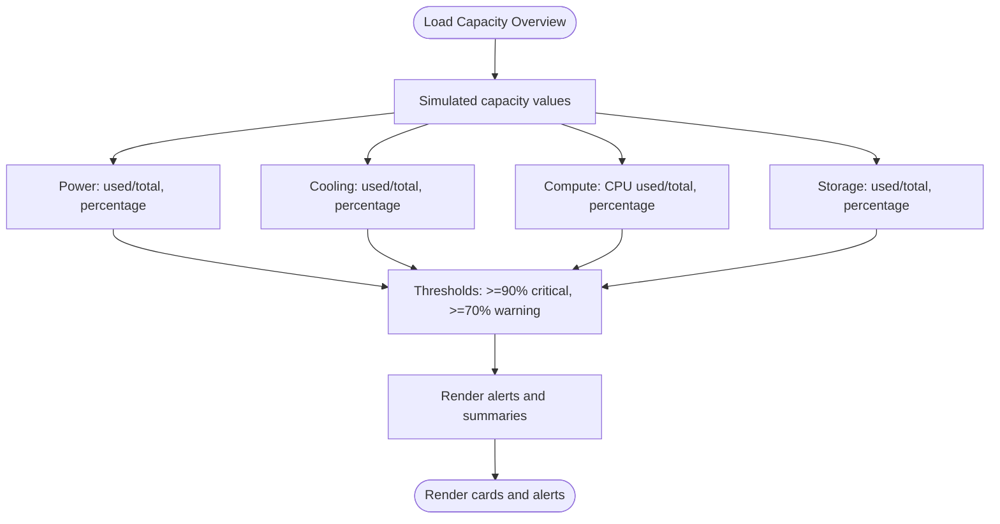
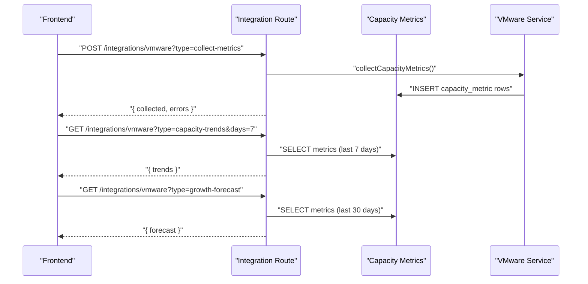
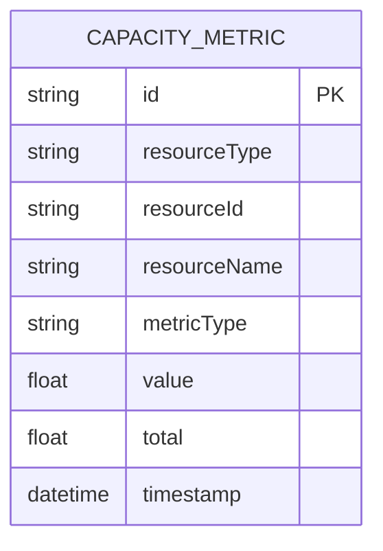
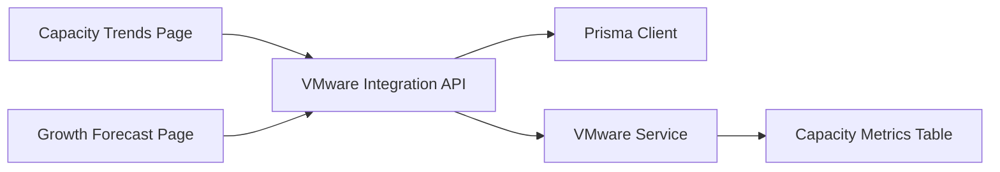

# Capacity Planning

<cite>
**Referenced Files in This Document**
- [app/analytics/capacity/page.tsx](file://app/analytics/capacity/page.tsx)
- [app/analytics/forecast/page.tsx](file://app/analytics/forecast/page.tsx)
- [app/infrastructure/capacity/page.tsx](file://app/infrastructure/capacity/page.tsx)
- [app/api/integrations/vmware/route.ts](file://app/api/integrations/vmware/route.ts)
- [lib/integrations/vmware.ts](file://lib/integrations/vmware.ts)
- [prisma/schema.prisma](file://prisma/schema.prisma)
</cite>

## Table of Contents
1. [Introduction](#introduction)
2. [Project Structure](#project-structure)
3. [Core Components](#core-components)
4. [Architecture Overview](#architecture-overview)
5. [Detailed Component Analysis](#detailed-component-analysis)
6. [Dependency Analysis](#dependency-analysis)
7. [Performance Considerations](#performance-considerations)
8. [Troubleshooting Guide](#troubleshooting-guide)
9. [Conclusion](#conclusion)
10. [Appendices](#appendices)

## Introduction
This document explains the capacity planning analytics and forecasting capabilities implemented in the project. It covers:
- Resource utilization tracking and trend analysis
- Rack and server resource allocation monitoring
- Infrastructure expansion planning indicators
- Forecasting models for predicting future capacity needs
- Capacity utilization metrics, saturation thresholds, and planning workflows
- Practical scenarios, optimization strategies, and alert configurations
- Visualization components and reporting surfaces

## Project Structure
The capacity planning surface is composed of three primary front-end pages and a backend integration API:
- Analytics: Capacity trends and growth forecasting
- Infrastructure: Power/cooling/compute/storage capacity overview
- Backend: VMware integration API for collecting and computing capacity metrics

**Diagram sources**
- [app/analytics/capacity/page.tsx:1-258](file://app/analytics/capacity/page.tsx#L1-L258)
- [app/analytics/forecast/page.tsx:1-264](file://app/analytics/forecast/page.tsx#L1-L264)
- [app/infrastructure/capacity/page.tsx:1-273](file://app/infrastructure/capacity/page.tsx#L1-L273)
- [app/api/integrations/vmware/route.ts:1-800](file://app/api/integrations/vmware/route.ts#L1-L800)
- [lib/integrations/vmware.ts:1-800](file://lib/integrations/vmware.ts#L1-L800)
- [prisma/schema.prisma:714-727](file://prisma/schema.prisma#L714-L727)

**Section sources**
- [app/analytics/capacity/page.tsx:1-258](file://app/analytics/capacity/page.tsx#L1-L258)
- [app/analytics/forecast/page.tsx:1-264](file://app/analytics/forecast/page.tsx#L1-L264)
- [app/infrastructure/capacity/page.tsx:1-273](file://app/infrastructure/capacity/page.tsx#L1-L273)
- [app/api/integrations/vmware/route.ts:1-800](file://app/api/integrations/vmware/route.ts#L1-L800)
- [lib/integrations/vmware.ts:1-800](file://lib/integrations/vmware.ts#L1-L800)
- [prisma/schema.prisma:714-727](file://prisma/schema.prisma#L714-L727)

## Core Components
- Capacity Trends (analytics): Real-time and historical trend computation across CPU, memory, and disk metrics for clusters, hosts, and datastores. Provides day-over-day comparisons and status badges.
- Growth Forecast (analytics): Linear regression-based projections for upcoming capacity usage, including 30/60/90-day predictions and “days until full” estimates for disk resources.
- Infrastructure Capacity Overview: High-level power, cooling, compute, and storage capacity dashboards with saturation thresholds and actionable alerts.
- Backend VMware Integration: Collects capacity metrics from VMware, persists them to the database, and exposes endpoints for trends and forecasts.

**Section sources**
- [app/analytics/capacity/page.tsx:17-98](file://app/analytics/capacity/page.tsx#L17-L98)
- [app/analytics/forecast/page.tsx:17-89](file://app/analytics/forecast/page.tsx#L17-L89)
- [app/infrastructure/capacity/page.tsx:10-50](file://app/infrastructure/capacity/page.tsx#L10-L50)
- [app/api/integrations/vmware/route.ts:21-71](file://app/api/integrations/vmware/route.ts#L21-L71)
- [app/api/integrations/vmware/route.ts:73-151](file://app/api/integrations/vmware/route.ts#L73-L151)
- [lib/integrations/vmware.ts:2393-2427](file://lib/integrations/vmware.ts#L2393-L2427)
- [prisma/schema.prisma:714-727](file://prisma/schema.prisma#L714-L727)

## Architecture Overview
The system follows a layered pattern:
- Frontend pages consume the VMware integration API to render capacity analytics and forecasts.
- The API aggregates time-series data from the database and applies analytics logic.
- The VMware service collects metrics from vCenter and writes them into the Capacity Metrics table.

**Diagram sources**
- [app/analytics/capacity/page.tsx:34-52](file://app/analytics/capacity/page.tsx#L34-L52)
- [app/analytics/forecast/page.tsx:36-54](file://app/analytics/forecast/page.tsx#L36-L54)
- [app/api/integrations/vmware/route.ts:726-730](file://app/api/integrations/vmware/route.ts#L726-L730)
- [app/api/integrations/vmware/route.ts:732-743](file://app/api/integrations/vmware/route.ts#L732-L743)
- [app/api/integrations/vmware/route.ts:21-71](file://app/api/integrations/vmware/route.ts#L21-L71)
- [app/api/integrations/vmware/route.ts:73-151](file://app/api/integrations/vmware/route.ts#L73-L151)
- [lib/integrations/vmware.ts:2393-2427](file://lib/integrations/vmware.ts#L2393-L2427)
- [prisma/schema.prisma:714-727](file://prisma/schema.prisma#L714-L727)

## Detailed Component Analysis

### Capacity Trends (Analytics)
Purpose:
- Track recent utilization trends across CPU, memory, and disk.
- Compare recent vs. older periods to detect upward/downward shifts.
- Surface critical/warning/normal statuses and supporting data points.

Key behaviors:
- Period selection: 1/7/30 days.
- Data aggregation: Groups metrics by resource and metric type; splits series into recent and older halves; computes difference as trend percent.
- Status thresholds: Critical at ≥85%, Warning at ≥70% average recent value.
- UI: Summary cards for averages, table with icons, trend arrows, and status badges.

**Diagram sources**
- [app/api/integrations/vmware/route.ts:21-71](file://app/api/integrations/vmware/route.ts#L21-L71)
- [app/analytics/capacity/page.tsx:34-98](file://app/analytics/capacity/page.tsx#L34-L98)

**Section sources**
- [app/analytics/capacity/page.tsx:17-98](file://app/analytics/capacity/page.tsx#L17-L98)
- [app/api/integrations/vmware/route.ts:21-71](file://app/api/integrations/vmware/route.ts#L21-L71)

### Growth Forecast (Analytics)
Purpose:
- Predict future capacity usage using linear regression on recent history.
- Provide 30/60/90-day projections and “days until full” for disk resources.

Key behaviors:
- Time window: Last 30 days minimum.
- Aggregation: Groups metrics by resource and metric; requires at least 3 data points.
- Model: Linear regression y = a·x + b; slope indicates growth rate; intercept gives baseline.
- Projections: Predictions capped at 100%.
- Disk-only “days until full”: Derived from (100 − current)/slope when positive and reasonable.
- Status: Critical at predicted 30-day value ≥85%; Warning at ≥70%.

**Diagram sources**
- [app/api/integrations/vmware/route.ts:73-151](file://app/api/integrations/vmware/route.ts#L73-L151)
- [app/analytics/forecast/page.tsx:36-89](file://app/analytics/forecast/page.tsx#L36-L89)

**Section sources**
- [app/analytics/forecast/page.tsx:17-89](file://app/analytics/forecast/page.tsx#L17-L89)
- [app/api/integrations/vmware/route.ts:73-151](file://app/api/integrations/vmware/route.ts#L73-L151)

### Infrastructure Capacity Overview
Purpose:
- Present high-level capacity across power, cooling, compute, and storage.
- Provide saturation thresholds and contextual alerts.

Highlights:
- Power/Cooling: Percentage used, remaining capacity, and status badges.
- Compute: CPU usage percentage and “high load” indicator.
- Storage: Used capacity, remaining space, and “fill level” percentage.
- Alerts: Highlights concerning saturation or growth trends.

**Diagram sources**
- [app/infrastructure/capacity/page.tsx:10-50](file://app/infrastructure/capacity/page.tsx#L10-L50)
- [app/infrastructure/capacity/page.tsx:72-270](file://app/infrastructure/capacity/page.tsx#L72-L270)

**Section sources**
- [app/infrastructure/capacity/page.tsx:10-50](file://app/infrastructure/capacity/page.tsx#L10-L50)
- [app/infrastructure/capacity/page.tsx:72-270](file://app/infrastructure/capacity/page.tsx#L72-L270)

### Backend: VMware Integration API
Responsibilities:
- Expose endpoints for:
  - Collecting capacity metrics from VMware
  - Computing capacity trends
  - Computing growth forecasts
- Manage caching for dashboard-like endpoints and lightweight summaries.

Key logic:
- Trend computation: Uses database-stored time series to compare recent vs. older periods.
- Forecast computation: Applies linear regression on recent data.
- Metric collection: Invokes VMware service to gather datastore usage and persist to Capacity Metrics table.

**Diagram sources**
- [app/api/integrations/vmware/route.ts:726-743](file://app/api/integrations/vmware/route.ts#L726-L743)
- [app/api/integrations/vmware/route.ts:21-71](file://app/api/integrations/vmware/route.ts#L21-L71)
- [app/api/integrations/vmware/route.ts:73-151](file://app/api/integrations/vmware/route.ts#L73-L151)
- [lib/integrations/vmware.ts:2393-2427](file://lib/integrations/vmware.ts#L2393-L2427)

**Section sources**
- [app/api/integrations/vmware/route.ts:21-71](file://app/api/integrations/vmware/route.ts#L21-L71)
- [app/api/integrations/vmware/route.ts:73-151](file://app/api/integrations/vmware/route.ts#L73-L151)
- [app/api/integrations/vmware/route.ts:726-743](file://app/api/integrations/vmware/route.ts#L726-L743)
- [lib/integrations/vmware.ts:2393-2427](file://lib/integrations/vmware.ts#L2393-L2427)

### Data Model: Capacity Metrics
The Capacity Metrics table stores time-stamped utilization values for VMware resources.

Fields:
- resourceType: cluster | host | datastore
- resourceId: external identifier (e.g., vCenter moref) or internal ID
- resourceName: human-readable name
- metricType: cpu | memory | disk
- value: usage percentage or absolute value
- total: optional total capacity for absolute conversions
- timestamp: when the measurement was taken

**Diagram sources**
- [prisma/schema.prisma:714-727](file://prisma/schema.prisma#L714-L727)

**Section sources**
- [prisma/schema.prisma:714-727](file://prisma/schema.prisma#L714-L727)

## Dependency Analysis
- Frontend pages depend on the VMware integration API for live data.
- The API depends on:
  - Prisma client to query Capacity Metrics
  - VMware Service to collect metrics from vCenter
- VMware Service writes metrics into the Capacity Metrics table.

**Diagram sources**
- [app/analytics/capacity/page.tsx:34-52](file://app/analytics/capacity/page.tsx#L34-L52)
- [app/analytics/forecast/page.tsx:36-54](file://app/analytics/forecast/page.tsx#L36-L54)
- [app/api/integrations/vmware/route.ts:21-71](file://app/api/integrations/vmware/route.ts#L21-L71)
- [app/api/integrations/vmware/route.ts:73-151](file://app/api/integrations/vmware/route.ts#L73-L151)
- [lib/integrations/vmware.ts:2393-2427](file://lib/integrations/vmware.ts#L2393-L2427)
- [prisma/schema.prisma:714-727](file://prisma/schema.prisma#L714-L727)

**Section sources**
- [app/analytics/capacity/page.tsx:34-52](file://app/analytics/capacity/page.tsx#L34-L52)
- [app/analytics/forecast/page.tsx:36-54](file://app/analytics/forecast/page.tsx#L36-L54)
- [app/api/integrations/vmware/route.ts:21-71](file://app/api/integrations/vmware/route.ts#L21-L71)
- [app/api/integrations/vmware/route.ts:73-151](file://app/api/integrations/vmware/route.ts#L73-L151)
- [lib/integrations/vmware.ts:2393-2427](file://lib/integrations/vmware.ts#L2393-L2427)
- [prisma/schema.prisma:714-727](file://prisma/schema.prisma#L714-L727)

## Performance Considerations
- Trend computation: Splits series into two equal parts; minimal overhead for moderate data volumes.
- Forecast computation: Linear regression runs per grouped series; keep grouping efficient and limit per-resource data points to recent windows.
- Caching: The API implements a global in-memory cache with TTL and stale-while-revalidate behavior for frequently accessed endpoints.
- Database indexing: Composite index on (resourceType, resourceId, metricType, timestamp) supports fast slicing and sorting for analytics.

Recommendations:
- Increase retention period gradually; cap historical windows to reduce compute cost.
- Batch metric collection to avoid frequent API calls.
- Monitor database query plans for large time windows.

[No sources needed since this section provides general guidance]

## Troubleshooting Guide
Common issues and resolutions:
- No data returned:
  - Verify metric collection endpoint executed and recent entries exist in Capacity Metrics.
  - Check VMware integration configuration and authentication.
- Trend/forecast returns empty:
  - Ensure sufficient data points (≥2 for trends, ≥3 for forecasts).
  - Confirm the selected time window captures enough samples.
- Authentication failures:
  - Re-test vCenter connection and credentials via the integration status endpoint.
- UI shows stale data:
  - Use the refresh controls on the pages; the API serves cached responses with background revalidation.

**Section sources**
- [app/analytics/capacity/page.tsx:99-116](file://app/analytics/capacity/page.tsx#L99-L116)
- [app/analytics/forecast/page.tsx:90-107](file://app/analytics/forecast/page.tsx#L90-L107)
- [app/api/integrations/vmware/route.ts:276-288](file://app/api/integrations/vmware/route.ts#L276-L288)

## Conclusion
The system provides a robust foundation for capacity planning:
- Real-time and historical trend analysis
- Forward-looking forecasts with saturation thresholds
- High-level infrastructure capacity dashboards
- Efficient backend collection and analytics

Extending the solution involves adding more granular resource types, refining thresholds, and integrating additional telemetry sources.

[No sources needed since this section summarizes without analyzing specific files]

## Appendices

### Capacity Utilization Metrics and Saturation Thresholds
- CPU/Memory/Disk usage percentages per resource (cluster/host/datastore)
- Thresholds:
  - Critical: ≥85% average recent value for trends; ≥85% predicted at 30 days for forecasts
  - Warning: ≥70% average recent value for trends; ≥70% predicted at 30 days for forecasts
- Disk-only:
  - Days until full computed from slope when positive and reasonable

**Section sources**
- [app/api/integrations/vmware/route.ts:53-53](file://app/api/integrations/vmware/route.ts#L53-L53)
- [app/api/integrations/vmware/route.ts:129-129](file://app/api/integrations/vmware/route.ts#L129-L129)

### Practical Scenarios and Workflows
- Scenario: Disk nearing capacity
  - Forecast shows days until full; trigger capacity alert and expansion planning
- Scenario: CPU growth trend
  - Trend analysis detects upward shift; forecast projects 60–90-day usage; initiate compute expansion planning
- Scenario: Cooling saturation
  - Infrastructure overview highlights high cooling usage; schedule maintenance or mitigation

[No sources needed since this section provides general guidance]

### Resource Optimization Strategies
- Right-size virtual machines based on CPU/memory trends
- Consolidate underutilized hosts; provision additional nodes before reaching thresholds
- Rotate snapshots and manage disk growth to delay “days until full”

[No sources needed since this section provides general guidance]

### Capacity Alert Configurations
- Threshold-based alerts for trends and forecasts
- Disk “days until full” alerts with escalation thresholds
- Infrastructure overview alerts for power/cooling compute/storage saturation

[No sources needed since this section provides general guidance]

### Visualization Components and Reports
- Trend table with icons, trend arrows, and status badges
- Forecast table with 30/60/90-day projections and growth rate
- Infrastructure cards for power, cooling, compute, and storage with saturation indicators
- Summary cards for averages and alert counts

**Section sources**
- [app/analytics/capacity/page.tsx:147-188](file://app/analytics/capacity/page.tsx#L147-L188)
- [app/analytics/forecast/page.tsx:123-164](file://app/analytics/forecast/page.tsx#L123-L164)
- [app/infrastructure/capacity/page.tsx:72-270](file://app/infrastructure/capacity/page.tsx#L72-L270)