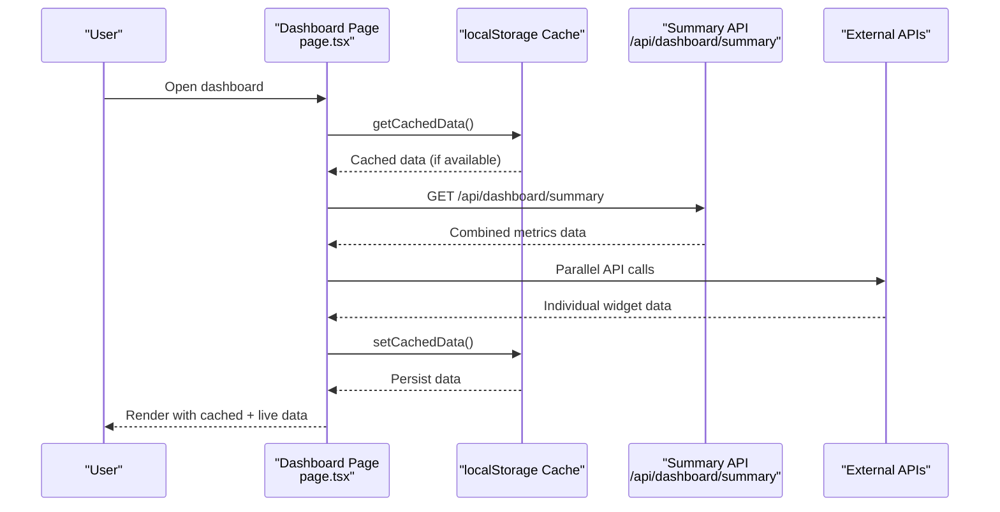
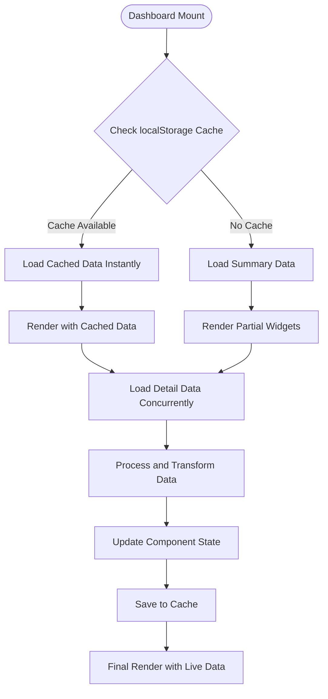
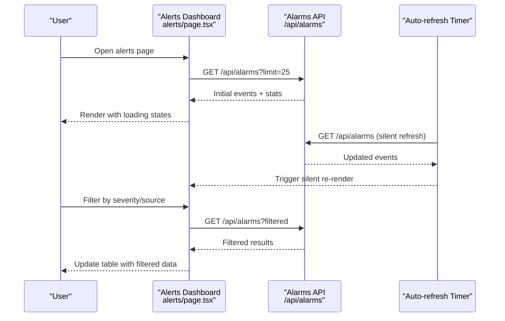
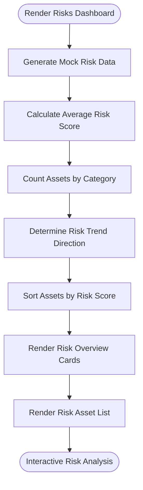
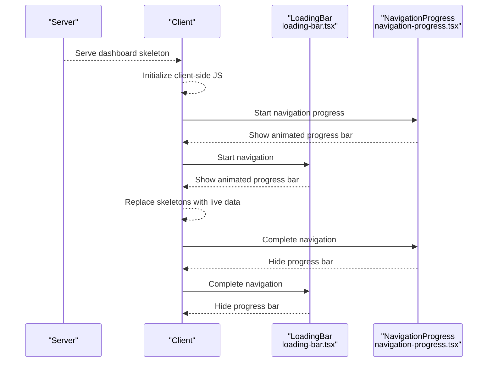
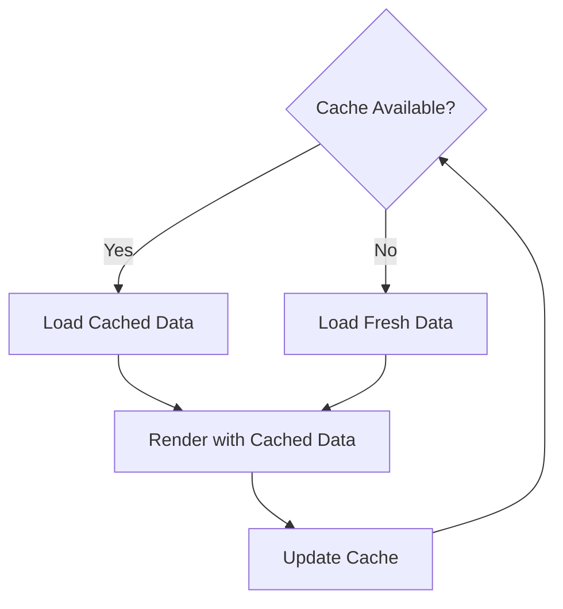
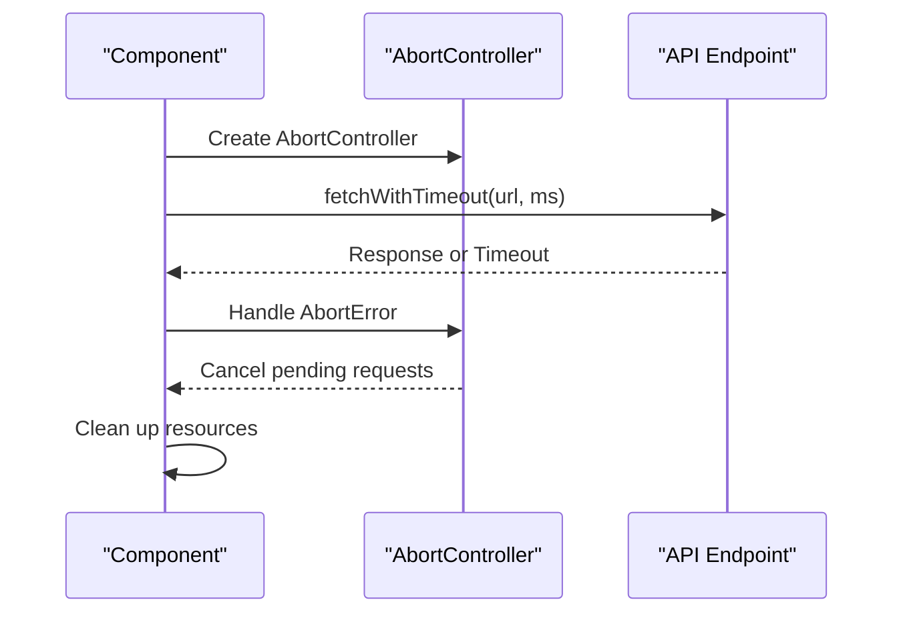
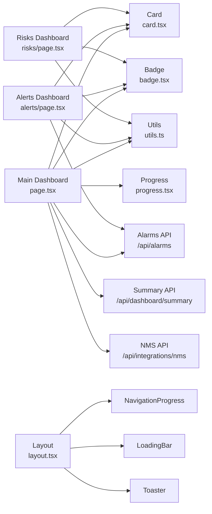

# Dashboard Components

<cite>
**Referenced Files in This Document**
- [app/dashboard/page.tsx](file://app/dashboard/page.tsx)
- [app/dashboard/alerts/page.tsx](file://app/dashboard/alerts/page.tsx)
- [app/dashboard/risks/page.tsx](file://app/dashboard/risks/page.tsx)
- [app/dashboard/loading.tsx](file://app/dashboard/loading.tsx)
- [app/dashboard/alerts/loading.tsx](file://app/dashboard/alerts/loading.tsx)
- [app/layout.tsx](file://app/layout.tsx)
- [components/layout/Header.tsx](file://components/layout/Header.tsx)
- [components/layout/Sidebar.tsx](file://components/layout/Sidebar.tsx)
- [components/ui/card.tsx](file://components/ui/card.tsx)
- [components/ui/progress.tsx](file://components/ui/progress.tsx)
- [components/ui/badge.tsx](file://components/ui/badge.tsx)
- [components/ui/loading-bar.tsx](file://components/ui/loading-bar.tsx)
- [components/ui/navigation-progress.tsx](file://components/ui/navigation-progress.tsx)
- [app/api/alarms/route.ts](file://app/api/alarms/route.ts)
- [app/api/integrations/nms/route.ts](file://app/api/integrations/nms/route.ts)
- [app/api/dashboard/summary/route.ts](file://app/api/dashboard/summary/route.ts)
- [lib/utils.ts](file://lib/utils.ts)
</cite>

## Update Summary
**Changes Made**
- Updated to reflect new sophisticated client-side dashboard implementation with multi-phase data loading
- Added comprehensive caching mechanisms using localStorage with TTL expiration
- Enhanced API integration patterns with AbortController-based request cancellation
- Implemented progressive loading system replacing previous server-side approach
- Added comprehensive error handling and timeout management
- Updated architecture diagrams to show new client-side data flow patterns

## Table of Contents
1. [Introduction](#introduction)
2. [Project Structure](#project-structure)
3. [Core Components](#core-components)
4. [Architecture Overview](#architecture-overview)
5. [Detailed Component Analysis](#detailed-component-analysis)
6. [Multi-Phase Data Loading System](#multi-phase-data-loading-system)
7. [Caching and Performance Optimization](#caching-and-performance-optimization)
8. [Enhanced API Integration Patterns](#enhanced-api-integration-patterns)
9. [Dependency Analysis](#dependency-analysis)
10. [Performance Considerations](#performance-considerations)
11. [Troubleshooting Guide](#troubleshooting-guide)
12. [Conclusion](#conclusion)
13. [Appendices](#appendices)

## Introduction
This document describes the sophisticated dashboard components system in the Infrascope project. The system has evolved from a simple server-side rendering approach to a complex client-side implementation featuring multi-phase data loading, intelligent caching, and enhanced API integration patterns. It covers the main dashboard page architecture with key metrics overview, recent activity feeds, and health indicators; the alerts dashboard for real-time security incidents and notification feeds; and the risks dashboard for security risk assessments and vulnerability analysis. The new implementation provides seamless user experience through progressive loading, localStorage caching, and comprehensive error handling.

## Project Structure
The dashboard system is organized around three primary pages under the dashboard namespace, each backed by dedicated API routes and shared UI primitives. The layout integrates advanced navigation progress indicators and comprehensive loading states.

```mermaid
graph TB
subgraph "Layout System"
LAYOUT["RootLayout<br/>app/layout.tsx"]
NAVPROG["NavigationProgress<br/>components/ui/navigation-progress.tsx"]
LOADINGBAR["LoadingBar<br/>components/ui/loading-bar.tsx"]
END
subgraph "Dashboard Pages"
MAIN_DASH["Main Dashboard<br/>app/dashboard/page.tsx"]
ALERTS_DASH["Alerts Dashboard<br/>app/dashboard/alerts/page.tsx"]
RISKS_DASH["Risks Dashboard<br/>app/dashboard/risks/page.tsx"]
MAIN_LOADING["Dashboard Skeleton<br/>app/dashboard/loading.tsx"]
ALERTS_LOADING["Alerts Skeleton<br/>app/dashboard/alerts/loading.tsx"]
END
subgraph "UI Primitives"
CARD["Card<br/>components/ui/card.tsx"]
PROGRESS["Progress<br/>components/ui/progress.tsx"]
BADGE["Badge<br/>components/ui/badge.tsx"]
UTILS["Utility Functions<br/>lib/utils.ts"]
END
subgraph "API Routes"
SUMMARY_ROUTE["Dashboard Summary API<br/>app/api/dashboard/summary/route.ts"]
ALARMS_ROUTE["Alarms API<br/>app/api/alarms/route.ts"]
NMS_ROUTE["NMS Status API<br/>app/api/integrations/nms/route.ts"]
END
LAYOUT --> NAVPROG
LAYOUT --> LOADINDBAR
LAYOUT --> MAIN_DASH
LAYOUT --> ALERTS_DASH
LAYOUT --> RISKS_DASH
MAIN_DASH --> CARD
MAIN_DASH --> PROGRESS
MAIN_DASH --> BADGE
MAIN_DASH --> UTILS
ALERTS_DASH --> CARD
ALERTS_DASH --> BADGE
ALERTS_DASH --> UTILS
RISKS_DASH --> CARD
RISKS_DASH --> BADGE
RISKS_DASH --> UTILS
MAIN_DASH --> SUMMARY_ROUTE
MAIN_DASH --> ALARMS_ROUTE
MAIN_DASH --> NMS_ROUTE
ALERTS_DASH --> ALARMS_ROUTE
```

**Diagram sources**
- [app/layout.tsx:20-53](file://app/layout.tsx#L20-L53)
- [components/ui/navigation-progress.tsx:13-88](file://components/ui/navigation-progress.tsx#L13-L88)
- [components/ui/loading-bar.tsx:11-71](file://components/ui/loading-bar.tsx#L11-L71)
- [app/dashboard/page.tsx:115-911](file://app/dashboard/page.tsx#L115-L911)
- [app/dashboard/alerts/page.tsx:314-2238](file://app/dashboard/alerts/page.tsx#L314-L2238)
- [app/dashboard/risks/page.tsx:20-239](file://app/dashboard/risks/page.tsx#L20-L239)
- [app/dashboard/loading.tsx:3-113](file://app/dashboard/loading.tsx#L3-L113)
- [app/dashboard/alerts/loading.tsx:3-51](file://app/dashboard/alerts/loading.tsx#L3-L51)
- [components/ui/card.tsx:5-79](file://components/ui/card.tsx#L5-L79)
- [components/ui/progress.tsx:6-26](file://components/ui/progress.tsx#L6-L26)
- [components/ui/badge.tsx:6-40](file://components/ui/badge.tsx#L6-L40)
- [app/api/dashboard/summary/route.ts:186-209](file://app/api/dashboard/summary/route.ts#L186-L209)
- [app/api/alarms/route.ts:11-142](file://app/api/alarms/route.ts#L11-L142)
- [app/api/integrations/nms/route.ts:8-53](file://app/api/integrations/nms/route.ts#L8-L53)

**Section sources**
- [app/layout.tsx:20-53](file://app/layout.tsx#L20-L53)
- [components/ui/navigation-progress.tsx:13-88](file://components/ui/navigation-progress.tsx#L13-L88)
- [components/ui/loading-bar.tsx:11-71](file://components/ui/loading-bar.tsx#L11-L71)

## Core Components
- **Main Dashboard Page**: Implements sophisticated multi-phase data loading with localStorage caching, AbortController-based request cancellation, and progressive rendering
- **Alerts Dashboard**: Features real-time polling with background refresh, comprehensive enrichment capabilities, and advanced filtering
- **Risks Dashboard**: Provides static risk assessment data with dynamic calculations and trend analysis
- **Shared UI Primitives**: Card, Progress, Badge components with utility functions for class merging
- **Advanced Loading States**: Dual-layer skeleton system with server-side skeleton and client-side navigation progress indicators

**Updated** The main dashboard now implements a sophisticated client-side data loading strategy with multi-phase initialization, caching, and comprehensive error handling.

**Section sources**
- [app/dashboard/page.tsx:115-911](file://app/dashboard/page.tsx#L115-L911)
- [app/dashboard/alerts/page.tsx:314-2238](file://app/dashboard/alerts/page.tsx#L314-L2238)
- [app/dashboard/risks/page.tsx:20-239](file://app/dashboard/risks/page.tsx#L20-L239)
- [components/ui/card.tsx:5-79](file://components/ui/card.tsx#L5-L79)
- [components/ui/progress.tsx:6-26](file://components/ui/progress.tsx#L6-L26)
- [components/ui/badge.tsx:6-40](file://components/ui/badge.tsx#L6-L40)
- [app/dashboard/loading.tsx:3-113](file://app/dashboard/loading.tsx#L3-L113)
- [app/dashboard/alerts/loading.tsx:3-51](file://app/dashboard/alerts/loading.tsx#L3-L51)

## Architecture Overview
The dashboard system follows a sophisticated client-rendered architecture with multi-phase data loading, intelligent caching, and progressive rendering. The main dashboard coordinates multiple data sources through a summary endpoint and individual API calls, while the alerts dashboard implements real-time polling with comprehensive enrichment capabilities.



**Updated** The architecture now features a dual-layer caching system with localStorage TTL expiration and comprehensive error handling.

**Diagram sources**
- [app/dashboard/page.tsx:141-162](file://app/dashboard/page.tsx#L141-L162)
- [app/dashboard/page.tsx:189-225](file://app/dashboard/page.tsx#L189-L225)
- [app/api/dashboard/summary/route.ts:186-209](file://app/api/dashboard/summary/route.ts#L186-L209)

## Detailed Component Analysis

### Main Dashboard Page
The main dashboard implements a sophisticated multi-phase data loading system:

**Phase 1: Instant Summary Loading**
- Loads combined metrics from `/api/dashboard/summary` in 100-200ms
- Populates VMware and FortiGate summary data immediately
- Sets initial loading states for all widgets

**Phase 2: Progressive Detail Loading**
- Concurrent loading of VMware, FortiGate, NMS, and SSL VPN data
- Individual widget loading with independent error handling
- Incremental updates for firewall data (sync status, policies, addresses)

**Advanced Features:**
- AbortController-based request cancellation on component unmount
- Comprehensive timeout management with AbortSignal propagation
- Intelligent caching with 60-second TTL expiration
- Graceful degradation when external services are unavailable



**Diagram sources**
- [app/dashboard/page.tsx:189-225](file://app/dashboard/page.tsx#L189-L225)
- [app/dashboard/page.tsx:284-387](file://app/dashboard/page.tsx#L284-L387)

**Section sources**
- [app/dashboard/page.tsx:115-911](file://app/dashboard/page.tsx#L115-L911)

### Alerts Dashboard
The alerts dashboard provides comprehensive real-time monitoring with advanced features:

**Real-time Polling System**
- Automatic background refresh every 2 minutes
- Silent refresh without disrupting user experience
- Manual refresh capability with visual feedback

**Advanced Enrichment Capabilities**
- Policy change enrichment for firewall configuration changes
- Address object enrichment for security policy modifications
- Port details enrichment for network connectivity issues
- Device port monitoring for infrastructure problems

**Comprehensive Filtering and Management**
- Severity-based statistics with color-coded badges
- Multi-source filtering (firewall, switch, VMware)
- Advanced search capabilities with server-side filtering
- Bulk actions for acknowledgment and cleanup operations



**Diagram sources**
- [app/dashboard/alerts/page.tsx:484-488](file://app/dashboard/alerts/page.tsx#L484-L488)
- [app/dashboard/alerts/page.tsx:371-403](file://app/dashboard/alerts/page.tsx#L371-L403)

**Section sources**
- [app/dashboard/alerts/page.tsx:314-2238](file://app/dashboard/alerts/page.tsx#L314-L2238)

### Risks Dashboard
The risks dashboard demonstrates static risk assessment with dynamic calculations:

**Risk Calculation Engine**
- Average risk score computation across all assets
- Category-based risk distribution analysis
- Trend analysis with visual indicators
- Critical risk threshold detection

**Asset Risk Visualization**
- Color-coded risk scores with appropriate visual indicators
- Category-based asset classification
- Issue-based risk factor analysis
- Timestamp-based risk recency tracking



**Diagram sources**
- [app/dashboard/risks/page.tsx:20-239](file://app/dashboard/risks/page.tsx#L20-L239)

**Section sources**
- [app/dashboard/risks/page.tsx:20-239](file://app/dashboard/risks/page.tsx#L20-L239)

### Widget Architecture, Metric Cards, and KPI Displays
The dashboard maintains a consistent widget architecture with enhanced data visualization:

**Metric Card Implementation**
- Responsive grid layout with 1-6 columns based on screen size
- Conditional styling for critical thresholds and warnings
- Progress bars for utilization and capacity metrics
- Interactive links to detailed views

**KPI Calculation and Formatting**
- Dynamic percentage calculations for storage and VM utilization
- Threshold-based conditional styling for critical metrics
- Human-readable formatting for durations and byte values
- Real-time metric updates with smooth transitions

**Section sources**
- [components/ui/card.tsx:5-79](file://components/ui/card.tsx#L5-L79)
- [components/ui/progress.tsx:6-26](file://components/ui/progress.tsx#L6-L26)
- [components/ui/badge.tsx:6-40](file://components/ui/badge.tsx#L6-L40)
- [lib/utils.ts:4-6](file://lib/utils.ts#L4-L6)

### Dashboard Loading States, Skeleton Components, and Progressive Loading Patterns
The dashboard implements a sophisticated dual-layer loading system:

**Server-side Skeleton Rendering**
- Instant skeleton rendering during navigation
- Pre-rendered placeholders for all dashboard sections
- Animated loading states for improved perceived performance
- Complete skeleton coverage for main dashboard and alerts

**Client-side Navigation Progress**
- Smooth progress bar during page transitions
- Gradient animation with pulse effect
- Automatic completion on navigation finish
- Non-intrusive positioning at page top

**Per-widget Loading States**
- Skeleton components for individual metric cards
- Progress indicators for complex data structures
- Graceful degradation when data is unavailable
- Suspense boundary support for React.lazy loading



**Diagram sources**
- [app/dashboard/loading.tsx:3-113](file://app/dashboard/loading.tsx#L3-L113)
- [app/dashboard/alerts/loading.tsx:3-51](file://app/dashboard/alerts/loading.tsx#L3-L51)
- [components/ui/loading-bar.tsx:11-71](file://components/ui/loading-bar.tsx#L11-L71)
- [components/ui/navigation-progress.tsx:13-88](file://components/ui/navigation-progress.tsx#L13-L88)

**Section sources**
- [app/dashboard/loading.tsx:3-113](file://app/dashboard/loading.tsx#L3-L113)
- [app/dashboard/alerts/loading.tsx:3-51](file://app/dashboard/alerts/loading.tsx#L3-L51)
- [components/ui/loading-bar.tsx:11-71](file://components/ui/loading-bar.tsx#L11-L71)
- [components/ui/navigation-progress.tsx:13-88](file://components/ui/navigation-progress.tsx#L13-L88)

## Multi-Phase Data Loading System
The new dashboard implementation features a sophisticated multi-phase data loading architecture designed for optimal user experience and performance.

### Phase 1: Immediate Response (100-200ms)
The system immediately loads combined metrics from the summary endpoint, providing instant visual feedback while background processes continue.

### Phase 2: Concurrent Detail Loading
Multiple external API calls execute simultaneously, each responsible for specific widget data. This approach maximizes throughput while maintaining individual error isolation.

### Phase 3: Progressive Enhancement
Widgets render with cached data immediately, then update with live data as it becomes available, creating a seamless user experience.

```mermaid
gantt
title Multi-Phase Data Loading
dateFormat X
axisFormat %s
section Phase 1: Immediate Response
Summary Load :0, 0.2
section Phase 2: Concurrent Loading
VMware Load :0.2, 0.8
Firewall Load :0.2, 1.2
NMS Load :0.2, 1.5
SSL Users Load :0.2, 1.8
section Phase 3: Progressive Enhancement
Cache Update :0.2, 0.2
Live Data :0.8, 0.8
```



**Section sources**
- [app/dashboard/page.tsx:189-225](file://app/dashboard/page.tsx#L189-L225)
- [app/dashboard/page.tsx:284-387](file://app/dashboard/page.tsx#L284-L387)

## Caching and Performance Optimization
The dashboard implements a comprehensive caching strategy using localStorage with intelligent TTL management and automatic cache invalidation.

### Cache Implementation Details
- **Cache Key**: `dashboard_data_cache` with timestamp
- **TTL**: 60-second expiration period
- **Cache Storage**: JSON-serialized data with timestamp
- **Automatic Cleanup**: Expired cache entries are automatically removed

### Cache Loading Strategy
The system prioritizes user experience by immediately loading cached data while background processes refresh the cache with fresh data.

### Performance Benefits
- **Reduced API Calls**: Cached data eliminates redundant network requests
- **Improved Responsiveness**: Instant widget rendering with cached data
- **Graceful Degradation**: Cached data serves as fallback when external services are unavailable
- **Bandwidth Conservation**: Minimizes network traffic for returning users



**Diagram sources**
- [app/dashboard/page.tsx:141-162](file://app/dashboard/page.tsx#L141-L162)
- [app/dashboard/page.tsx:213-225](file://app/dashboard/page.tsx#L213-L225)

**Section sources**
- [app/dashboard/page.tsx:141-162](file://app/dashboard/page.tsx#L141-L162)
- [app/dashboard/page.tsx:213-225](file://app/dashboard/page.tsx#L213-L225)

## Enhanced API Integration Patterns
The dashboard implements sophisticated API integration patterns with comprehensive error handling, timeout management, and request cancellation.

### AbortController-Based Request Management
Each component maintains a shared AbortController instance that is automatically cancelled when the component unmounts, preventing memory leaks and stale data processing.

### Timeout Management System
The `fetchWithTimeout` function provides comprehensive timeout handling with automatic request cancellation and error propagation.

### Error Handling Strategy
- **AbortError Handling**: Component unmounts gracefully without throwing errors
- **Network Error Recovery**: External service failures don't crash the dashboard
- **Graceful Degradation**: Missing data is handled with fallback states
- **User Feedback**: Errors are logged but don't interrupt user experience

### API Endpoint Optimization
The `/api/dashboard/summary` endpoint consolidates multiple data sources into a single request, reducing network overhead from 10+ parallel fetches to a single optimized request.



**Diagram sources**
- [app/dashboard/page.tsx:164-185](file://app/dashboard/page.tsx#L164-L185)
- [app/api/dashboard/summary/route.ts:186-209](file://app/api/dashboard/summary/route.ts#L186-L209)

**Section sources**
- [app/dashboard/page.tsx:164-185](file://app/dashboard/page.tsx#L164-L185)
- [app/api/dashboard/summary/route.ts:186-209](file://app/api/dashboard/summary/route.ts#L186-L209)

## Dependency Analysis
The dashboard system maintains clean separation of concerns with specialized components handling different aspects of the dashboard functionality.



**Diagram sources**
- [app/dashboard/page.tsx:115-911](file://app/dashboard/page.tsx#L115-L911)
- [app/dashboard/alerts/page.tsx:314-2238](file://app/dashboard/alerts/page.tsx#L314-L2238)
- [app/dashboard/risks/page.tsx:20-239](file://app/dashboard/risks/page.tsx#L20-L239)
- [components/ui/card.tsx:5-79](file://components/ui/card.tsx#L5-L79)
- [components/ui/progress.tsx:6-26](file://components/ui/progress.tsx#L6-L26)
- [components/ui/badge.tsx:6-40](file://components/ui/badge.tsx#L6-L40)
- [lib/utils.ts:4-6](file://lib/utils.ts#L4-L6)
- [app/api/dashboard/summary/route.ts:186-209](file://app/api/dashboard/summary/route.ts#L186-L209)
- [app/api/alarms/route.ts:11-142](file://app/api/alarms/route.ts#L11-L142)
- [app/api/integrations/nms/route.ts:8-53](file://app/api/integrations/nms/route.ts#L8-L53)
- [app/layout.tsx:20-53](file://app/layout.tsx#L20-L53)

**Section sources**
- [app/dashboard/page.tsx:115-911](file://app/dashboard/page.tsx#L115-L911)
- [app/dashboard/alerts/page.tsx:314-2238](file://app/dashboard/alerts/page.tsx#L314-L2238)
- [app/dashboard/risks/page.tsx:20-239](file://app/dashboard/risks/page.tsx#L20-L239)

## Performance Considerations
The new implementation significantly improves performance through several optimization strategies:

### Network Optimization
- **Summary Endpoint**: Consolidates 10+ API calls into a single optimized request
- **Concurrent Loading**: Multiple external APIs load simultaneously
- **Request Cancellation**: AbortController prevents wasted network resources
- **Timeout Management**: Prevents hanging requests from blocking UI

### Memory Management
- **Automatic Cleanup**: Component unmounts cancel pending requests
- **Cache Management**: Automatic TTL expiration prevents memory bloat
- **Resource Cleanup**: Proper cleanup of event listeners and intervals

### User Experience Optimization
- **Progressive Loading**: Immediate visual feedback with incremental improvements
- **Graceful Degradation**: System continues functioning with partial data
- **Smooth Transitions**: Animated loading states improve perceived performance
- **Intelligent Caching**: Returning users get instant data access

## Troubleshooting Guide
The enhanced dashboard system includes comprehensive error handling and debugging capabilities:

### Common Issues and Solutions
- **Dashboard Loading Delays**: Check network connectivity to external services and verify API endpoints are reachable
- **Widget Data Not Updating**: Verify browser console for timeout errors and ensure AbortController is functioning properly
- **Cache Corruption**: Clear localStorage cache entries and restart the application
- **Memory Leaks**: Check for proper component unmounting and AbortController cleanup

### Debugging Tools
- **Console Logging**: Extensive logging for network requests, timeouts, and cache operations
- **Network Monitoring**: Real-time monitoring of API request performance and failure rates
- **Cache Inspection**: Direct inspection of localStorage cache contents and TTL values
- **Component Lifecycle**: Monitoring of component mount/unmount cycles and cleanup operations

### Performance Monitoring
- **Request Timing**: Track API response times and identify slow endpoints
- **Cache Hit Rates**: Monitor cache effectiveness and optimize TTL values
- **Memory Usage**: Track memory consumption and identify potential leaks
- **User Experience Metrics**: Monitor perceived performance and user satisfaction

**Section sources**
- [app/dashboard/page.tsx:227-282](file://app/dashboard/page.tsx#L227-L282)
- [app/dashboard/alerts/page.tsx:484-488](file://app/dashboard/alerts/page.tsx#L484-L488)

## Conclusion
The sophisticated dashboard components system represents a significant evolution from simple server-side rendering to a complex client-side implementation featuring multi-phase data loading, intelligent caching, and comprehensive error handling. The new architecture delivers exceptional user experience through progressive loading, localStorage caching with TTL expiration, and AbortController-based request management. The system maintains excellent performance characteristics while providing robust error handling and graceful degradation capabilities. The enhanced API integration patterns and comprehensive loading states ensure reliable operation even under adverse network conditions.

## Appendices
- **Customization Examples**:
  - Add new metric cards by extending the summary endpoint and implementing appropriate fetch functions
  - Configure caching TTL values by modifying the CACHE_TTL constant in the main dashboard
  - Extend error handling by adding new exception types to the isAborted function
  - Implement new loading states by adding new skeleton components and Suspense boundaries

- **Best Practices**:
  - Keep widget logic modular and reusable with proper error boundaries
  - Use consistent color and icon semantics for severity and status indicators
  - Apply AbortController patterns consistently across all data-fetching components
  - Monitor cache hit rates and optimize TTL values based on data volatility
  - Implement comprehensive logging for debugging and performance monitoring

- **Performance Tuning**:
  - Adjust cache TTL values based on data freshness requirements
  - Optimize API endpoint responses to reduce latency
  - Monitor memory usage and implement cleanup strategies for long-running sessions
  - Analyze user interaction patterns to optimize loading priorities