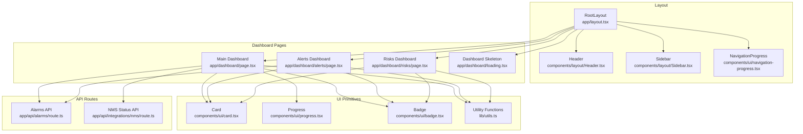
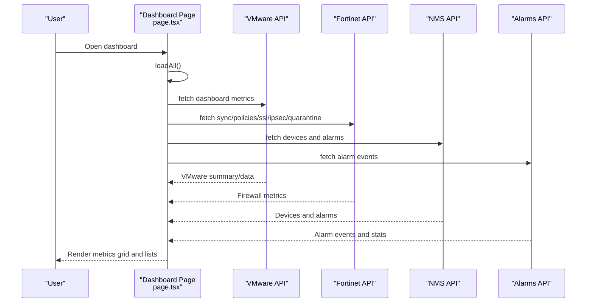
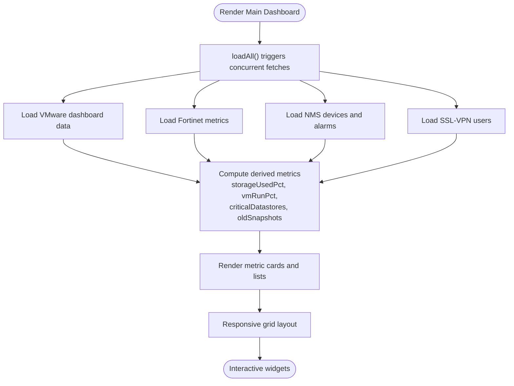
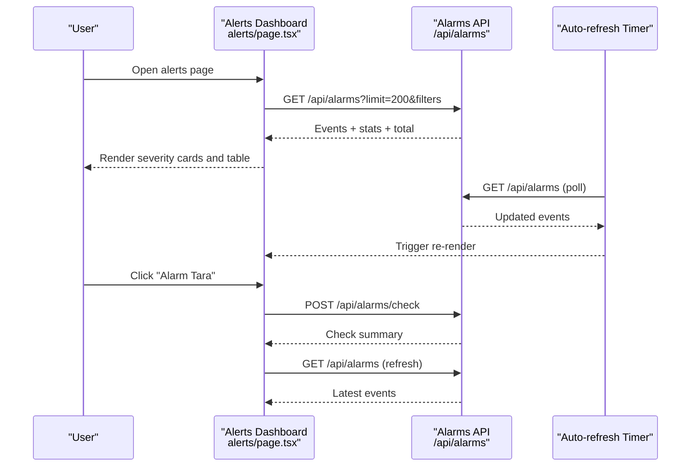
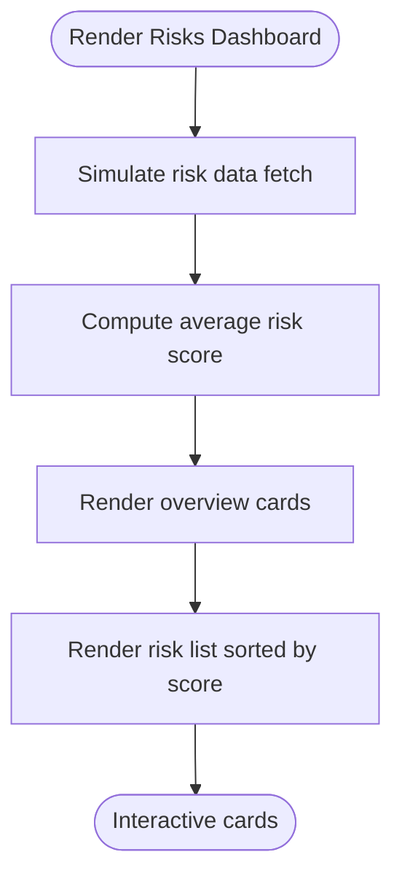
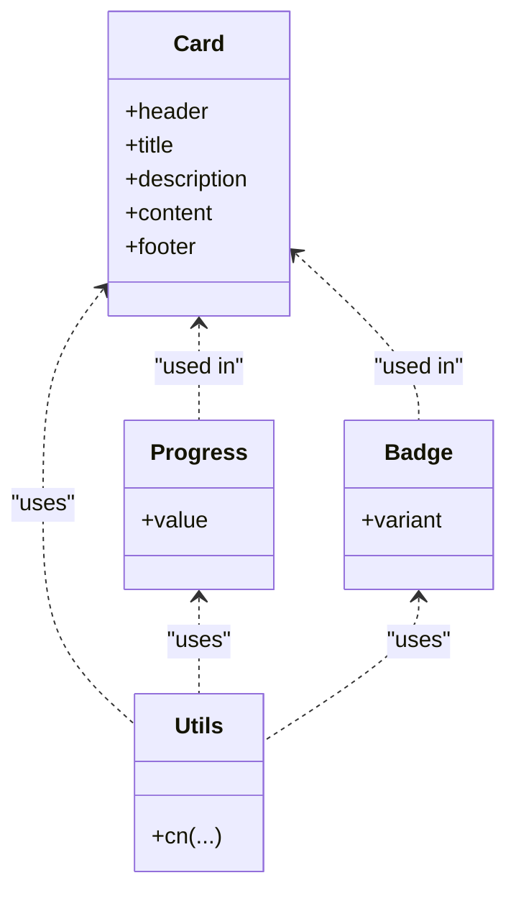
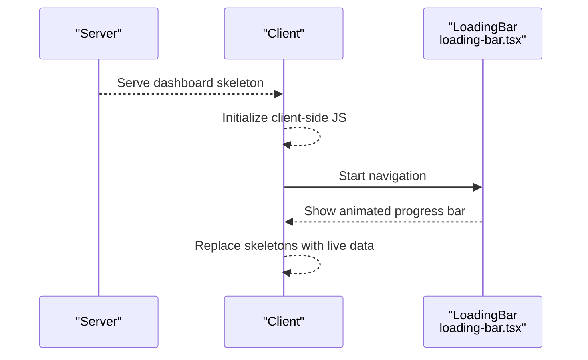
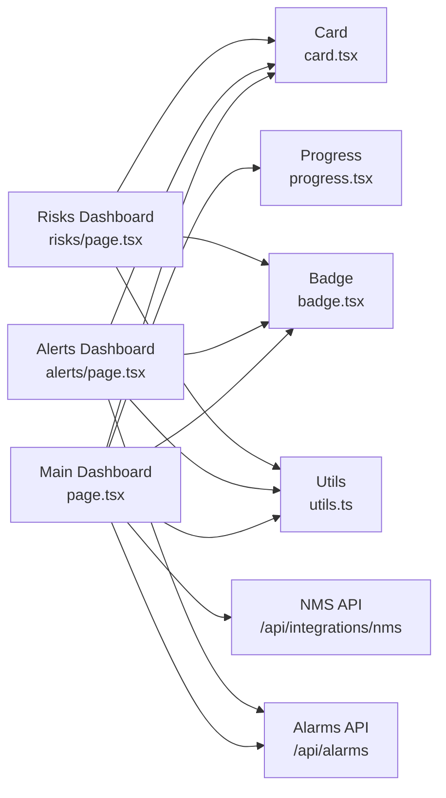

# Dashboard Components

<cite>
**Referenced Files in This Document**
- [app/dashboard/page.tsx](file://app/dashboard/page.tsx)
- [app/dashboard/alerts/page.tsx](file://app/dashboard/alerts/page.tsx)
- [app/dashboard/risks/page.tsx](file://app/dashboard/risks/page.tsx)
- [app/dashboard/loading.tsx](file://app/dashboard/loading.tsx)
- [app/layout.tsx](file://app/layout.tsx)
- [components/layout/Header.tsx](file://components/layout/Header.tsx)
- [components/layout/Sidebar.tsx](file://components/layout/Sidebar.tsx)
- [components/ui/card.tsx](file://components/ui/card.tsx)
- [components/ui/progress.tsx](file://components/ui/progress.tsx)
- [components/ui/badge.tsx](file://components/ui/badge.tsx)
- [components/ui/loading-bar.tsx](file://components/ui/loading-bar.tsx)
- [app/api/alarms/route.ts](file://app/api/alarms/route.ts)
- [app/api/integrations/nms/route.ts](file://app/api/integrations/nms/route.ts)
- [lib/utils.ts](file://lib/utils.ts)
</cite>

## Table of Contents
1. [Introduction](#introduction)
2. [Project Structure](#project-structure)
3. [Core Components](#core-components)
4. [Architecture Overview](#architecture-overview)
5. [Detailed Component Analysis](#detailed-component-analysis)
6. [Dependency Analysis](#dependency-analysis)
7. [Performance Considerations](#performance-considerations)
8. [Troubleshooting Guide](#troubleshooting-guide)
9. [Conclusion](#conclusion)
10. [Appendices](#appendices)

## Introduction
This document describes the dashboard components system in the Infrascope project. It covers the main dashboard page architecture with key metrics overview, recent activity feeds, and health indicators; the alerts dashboard for real-time security incidents and notification feeds; and the risks dashboard for security risk assessments and vulnerability analysis. It also documents dashboard loading states, skeleton components, and progressive loading patterns; the widget architecture, metric cards, and KPI displays; practical examples of dashboard customization, widget configuration, and real-time data updates; and responsive design patterns and mobile dashboard optimization.

## Project Structure
The dashboard system is organized around three primary pages under the dashboard namespace, each backed by dedicated API routes and shared UI primitives. The layout integrates a global navigation progress indicator and a sidebar for cross-page navigation.

**Diagram sources**
- [app/layout.tsx:20-56](file://app/layout.tsx#L20-L56)
- [components/layout/Header.tsx:18-79](file://components/layout/Header.tsx#L18-L79)
- [components/layout/Sidebar.tsx:56-408](file://components/layout/Sidebar.tsx#L56-L408)
- [app/dashboard/page.tsx:101-731](file://app/dashboard/page.tsx#L101-L731)
- [app/dashboard/alerts/page.tsx:162-800](file://app/dashboard/alerts/page.tsx#L162-L800)
- [app/dashboard/risks/page.tsx:20-239](file://app/dashboard/risks/page.tsx#L20-L239)
- [app/dashboard/loading.tsx:3-112](file://app/dashboard/loading.tsx#L3-L112)
- [components/ui/card.tsx:5-79](file://components/ui/card.tsx#L5-L79)
- [components/ui/progress.tsx:6-26](file://components/ui/progress.tsx#L6-L26)
- [components/ui/badge.tsx:6-40](file://components/ui/badge.tsx#L6-L40)
- [app/api/alarms/route.ts:9-103](file://app/api/alarms/route.ts#L9-L103)
- [app/api/integrations/nms/route.ts:8-52](file://app/api/integrations/nms/route.ts#L8-L52)

**Section sources**
- [app/layout.tsx:20-56](file://app/layout.tsx#L20-L56)
- [components/layout/Header.tsx:18-79](file://components/layout/Header.tsx#L18-L79)
- [components/layout/Sidebar.tsx:56-408](file://components/layout/Sidebar.tsx#L56-L408)

## Core Components
- Main Dashboard page aggregates VMware and Fortinet metrics, NMS device and alarm status, and presents them in a responsive grid of metric cards and lists.
- Alerts Dashboard displays real-time security incidents with filtering, pagination, acknowledgment, and enrichment features.
- Risks Dashboard shows risk scores and categories for assets with a summary overview and a ranked list.
- Shared UI primitives include Card, Progress, and Badge components, plus utility functions for class merging.
- Loading states include a server-side skeleton for instant feedback and a client-side navigation progress indicator.

**Section sources**
- [app/dashboard/page.tsx:101-731](file://app/dashboard/page.tsx#L101-L731)
- [app/dashboard/alerts/page.tsx:162-800](file://app/dashboard/alerts/page.tsx#L162-L800)
- [app/dashboard/risks/page.tsx:20-239](file://app/dashboard/risks/page.tsx#L20-L239)
- [components/ui/card.tsx:5-79](file://components/ui/card.tsx#L5-L79)
- [components/ui/progress.tsx:6-26](file://components/ui/progress.tsx#L6-L26)
- [components/ui/badge.tsx:6-40](file://components/ui/badge.tsx#L6-L40)
- [app/dashboard/loading.tsx:3-112](file://app/dashboard/loading.tsx#L3-L112)
- [components/ui/loading-bar.tsx:11-70](file://components/ui/loading-bar.tsx#L11-L70)

## Architecture Overview
The dashboard system follows a client-rendered page model with concurrent data fetching and progressive rendering. The main dashboard coordinates multiple data sources (VMware, Fortinet, NMS) and exposes links to deeper views. The alerts dashboard polls for updates and supports manual refresh and background checks. The risks dashboard provides a static example of risk scoring and categorization.

**Diagram sources**
- [app/dashboard/page.tsx:127-210](file://app/dashboard/page.tsx#L127-L210)
- [app/api/alarms/route.ts:9-71](file://app/api/alarms/route.ts#L9-L71)
- [app/api/integrations/nms/route.ts:8-52](file://app/api/integrations/nms/route.ts#L8-L52)

## Detailed Component Analysis

### Main Dashboard Page
The main dashboard composes:
- Metric cards for VMware VMs, hosts, storage utilization, Fortinet policies/addresses, IPSec tunnels, and SSL-VPN sessions.
- Lists for ESXi hosts, old snapshots, quarantine counts, datastore usage, IPSec tunnels, and SSL-VPN users.
- NMS device stats and active alarms with connectivity status.
- A compact resource summary grid.

Key behaviors:
- Concurrent data loading with Promise.allSettled to avoid blocking unrelated widgets.
- Conditional styling for critical thresholds (e.g., storage used percent, down IPSec tunnels).
- Responsive grid layouts using Tailwind classes for 1–6 columns depending on screen size.
- Localized formatting helpers for durations and bytes.

**Diagram sources**
- [app/dashboard/page.tsx:127-222](file://app/dashboard/page.tsx#L127-L222)
- [app/dashboard/page.tsx:244-731](file://app/dashboard/page.tsx#L244-L731)

**Section sources**
- [app/dashboard/page.tsx:101-731](file://app/dashboard/page.tsx#L101-L731)

### Alerts Dashboard
The alerts dashboard provides:
- Severity-based statistics cards with icons and colors.
- Filters for source type (firewall, switch, VMware) and severity/unacknowledged state.
- A paginated table of alarm events with timestamps, sources, categories, severity, IPs, devices, acknowledgment status, and notifications.
- Real-time updates via periodic polling and background checks.
- Enrichment panels for policy changes, address objects, port details, and device ports.
- Actions to acknowledge single or all alarms, whitelist/discard alarms, and bulk cleanup.

**Diagram sources**
- [app/dashboard/alerts/page.tsx:215-310](file://app/dashboard/alerts/page.tsx#L215-L310)
- [app/api/alarms/route.ts:9-71](file://app/api/alarms/route.ts#L9-L71)

**Section sources**
- [app/dashboard/alerts/page.tsx:162-800](file://app/dashboard/alerts/page.tsx#L162-L800)
- [app/api/alarms/route.ts:9-103](file://app/api/alarms/route.ts#L9-L103)

### Risks Dashboard
The risks dashboard demonstrates:
- Average risk score calculation across assets.
- Counts for critical risk assets and category breakdowns.
- A trend indicator based on average score.
- A ranked list of assets with risk scores, categories, types, issues, and last updated dates.

**Diagram sources**
- [app/dashboard/risks/page.tsx:20-239](file://app/dashboard/risks/page.tsx#L20-L239)

**Section sources**
- [app/dashboard/risks/page.tsx:20-239](file://app/dashboard/risks/page.tsx#L20-L239)

### Widget Architecture, Metric Cards, and KPI Displays
- Metric cards are built with the shared Card component and styled with Tailwind utilities. They include icons, labels, values, and optional progress bars.
- KPIs are computed from raw data (e.g., percentages, counts) and conditionally formatted for readability.
- Badges are used for status and severity with consistent variants (success, destructive, secondary).
- Progress bars visualize utilization and capacity metrics.

**Diagram sources**
- [components/ui/card.tsx:5-79](file://components/ui/card.tsx#L5-L79)
- [components/ui/progress.tsx:6-26](file://components/ui/progress.tsx#L6-L26)
- [components/ui/badge.tsx:6-40](file://components/ui/badge.tsx#L6-L40)
- [lib/utils.ts:4-6](file://lib/utils.ts#L4-L6)

**Section sources**
- [components/ui/card.tsx:5-79](file://components/ui/card.tsx#L5-L79)
- [components/ui/progress.tsx:6-26](file://components/ui/progress.tsx#L6-L26)
- [components/ui/badge.tsx:6-40](file://components/ui/badge.tsx#L6-L40)
- [lib/utils.ts:4-6](file://lib/utils.ts#L4-L6)

### Dashboard Loading States, Skeleton Components, and Progressive Loading Patterns
- Server-side skeleton: The dashboard loading component renders a static skeleton with animated placeholders to minimize perceived loading time while JavaScript initializes.
- Client-side navigation progress: A global loading bar simulates progress during page transitions.
- Per-widget loading: Widgets render minimal placeholders (e.g., dots, progress bars) while asynchronous data loads.

**Diagram sources**
- [app/dashboard/loading.tsx:3-112](file://app/dashboard/loading.tsx#L3-L112)
- [components/ui/loading-bar.tsx:11-70](file://components/ui/loading-bar.tsx#L11-L70)

**Section sources**
- [app/dashboard/loading.tsx:3-112](file://app/dashboard/loading.tsx#L3-L112)
- [components/ui/loading-bar.tsx:11-70](file://components/ui/loading-bar.tsx#L11-L70)

### Practical Examples: Customization, Widget Configuration, and Real-Time Updates
- Customization examples:
  - Adjust grid column counts by modifying responsive Tailwind classes on container elements.
  - Swap icons and colors by updating severity/category configurations and mapping functions.
  - Add new widgets by introducing new fetch functions and rendering blocks similar to existing ones.
- Widget configuration:
  - Use Badge variants to reflect statuses (e.g., success, destructive).
  - Use Progress components for capacity and utilization metrics.
  - Use Card headers and descriptions to contextualize KPIs.
- Real-time updates:
  - Alerts dashboard uses periodic polling and background checks to keep data fresh.
  - Main dashboard supports manual refresh and leverages concurrent loading for resilience.

**Section sources**
- [app/dashboard/alerts/page.tsx:289-310](file://app/dashboard/alerts/page.tsx#L289-L310)
- [app/dashboard/page.tsx:127-136](file://app/dashboard/page.tsx#L127-L136)

### Responsive Design Patterns and Mobile Dashboard Optimization
- Responsive grids: The main dashboard uses grid classes that adapt from 1 to 6 columns based on viewport size.
- Compact summaries: The resource summary grid condenses multiple KPIs into a single row on smaller screens.
- Collapsible sidebar: The sidebar collapses to icons-only mode on narrow screens, preserving navigation access.
- Typography scaling: Text sizes adjust across breakpoints to maintain readability.

**Section sources**
- [app/dashboard/page.tsx:259-349](file://app/dashboard/page.tsx#L259-L349)
- [components/layout/Sidebar.tsx:216-255](file://components/layout/Sidebar.tsx#L216-L255)

## Dependency Analysis
The dashboard pages depend on shared UI primitives and API routes. The main dashboard coordinates multiple external systems, while the alerts dashboard focuses on alarm ingestion and enrichment.

**Diagram sources**
- [app/dashboard/page.tsx:101-731](file://app/dashboard/page.tsx#L101-L731)
- [app/dashboard/alerts/page.tsx:162-800](file://app/dashboard/alerts/page.tsx#L162-L800)
- [app/dashboard/risks/page.tsx:20-239](file://app/dashboard/risks/page.tsx#L20-L239)
- [components/ui/card.tsx:5-79](file://components/ui/card.tsx#L5-L79)
- [components/ui/progress.tsx:6-26](file://components/ui/progress.tsx#L6-L26)
- [components/ui/badge.tsx:6-40](file://components/ui/badge.tsx#L6-L40)
- [lib/utils.ts:4-6](file://lib/utils.ts#L4-L6)
- [app/api/alarms/route.ts:9-103](file://app/api/alarms/route.ts#L9-L103)
- [app/api/integrations/nms/route.ts:8-52](file://app/api/integrations/nms/route.ts#L8-L52)

**Section sources**
- [app/dashboard/page.tsx:101-731](file://app/dashboard/page.tsx#L101-L731)
- [app/dashboard/alerts/page.tsx:162-800](file://app/dashboard/alerts/page.tsx#L162-L800)
- [app/dashboard/risks/page.tsx:20-239](file://app/dashboard/risks/page.tsx#L20-L239)

## Performance Considerations
- Concurrent data fetching reduces total load time by overlapping independent requests.
- Minimal server-side skeleton ensures immediate visual feedback.
- Client-side navigation progress improves perceived performance during route transitions.
- Avoid heavy computations in render paths; precompute metrics and memoize where appropriate.
- Use pagination and limits for large datasets (e.g., alarms API limit parameter).

## Troubleshooting Guide
- If widgets fail to load, verify network connectivity to external systems and confirm API endpoints are reachable.
- For alerts not refreshing, check browser console for errors and ensure periodic timers are active.
- For NMS-related issues, confirm the NMS service availability and that polling devices exist in the database.
- For alarm acknowledgments, ensure the backend responds successfully and the UI reflects updated states.

**Section sources**
- [app/dashboard/alerts/page.tsx:289-310](file://app/dashboard/alerts/page.tsx#L289-L310)
- [app/api/integrations/nms/route.ts:8-52](file://app/api/integrations/nms/route.ts#L8-L52)

## Conclusion
The dashboard components system combines responsive layouts, shared UI primitives, and robust data-loading strategies to deliver a performant and user-friendly monitoring experience. The main dashboard consolidates key metrics, the alerts dashboard enables real-time incident management, and the risks dashboard provides risk insights. Progressive loading and skeleton components enhance perceived performance, while responsive design ensures usability across devices.

## Appendices
- Example widget additions:
  - Add a new metric card by defining a new fetch function and integrating it into the main dashboard’s concurrent loader.
  - Extend filters in the alerts dashboard by adding new filter keys and mapping functions.
- Best practices:
  - Keep widget logic modular and reusable.
  - Use consistent color and icon semantics for severity and status.
  - Apply Tailwind responsive utilities to ensure optimal presentation on all devices.