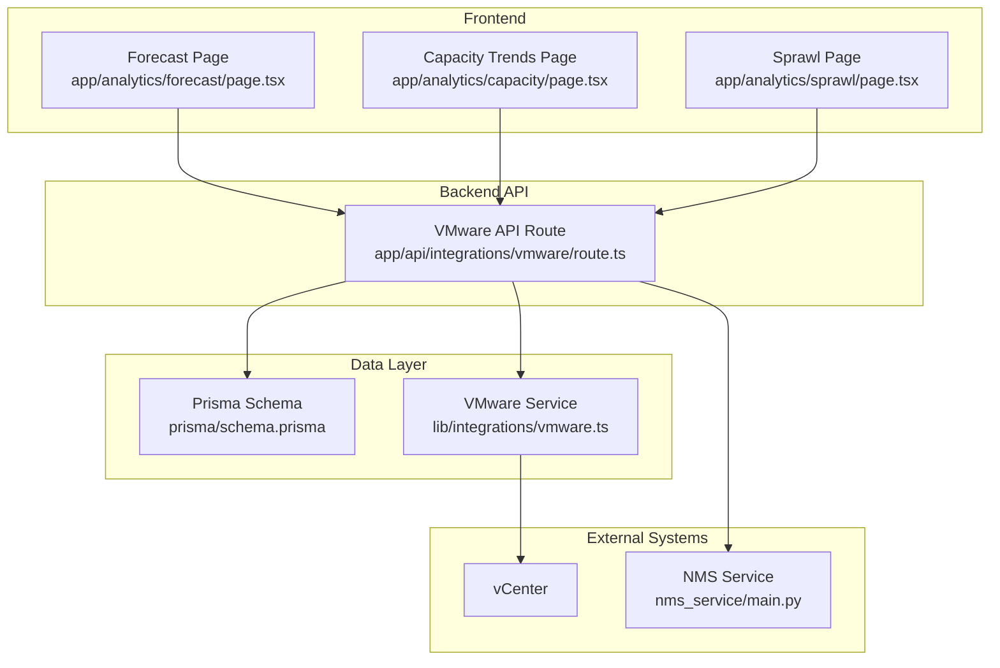
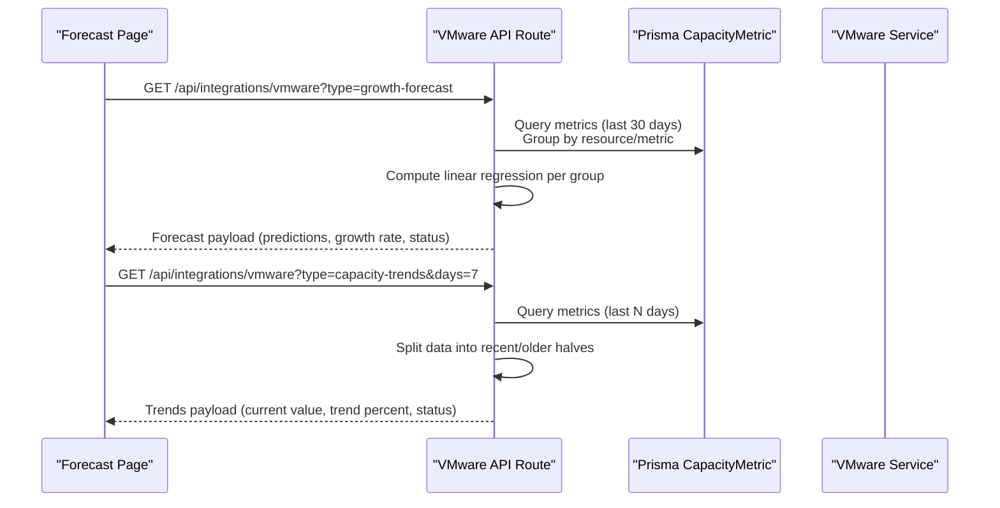
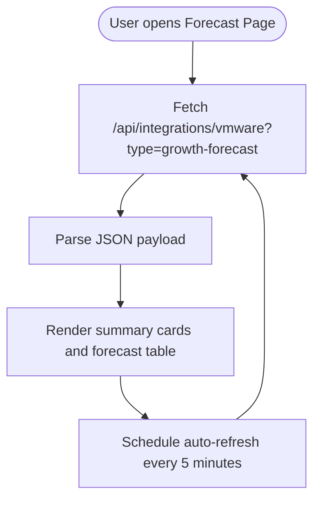
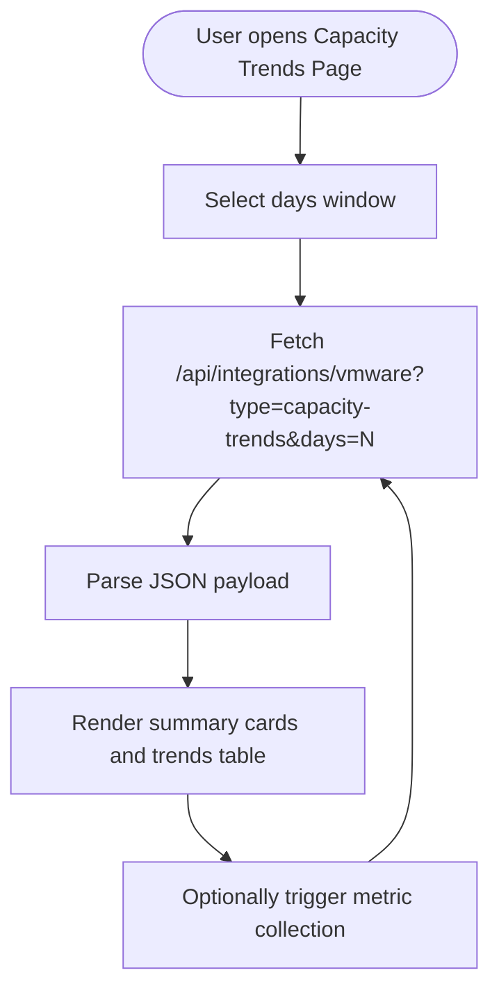
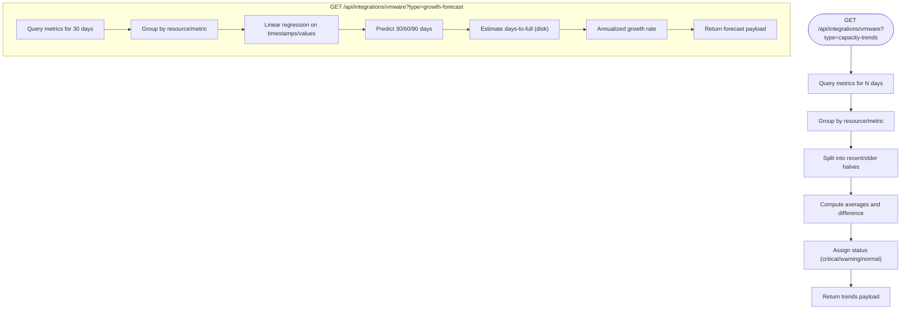
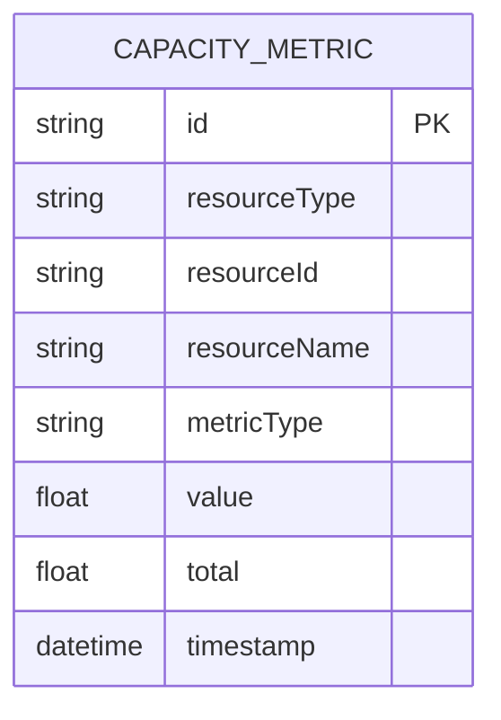
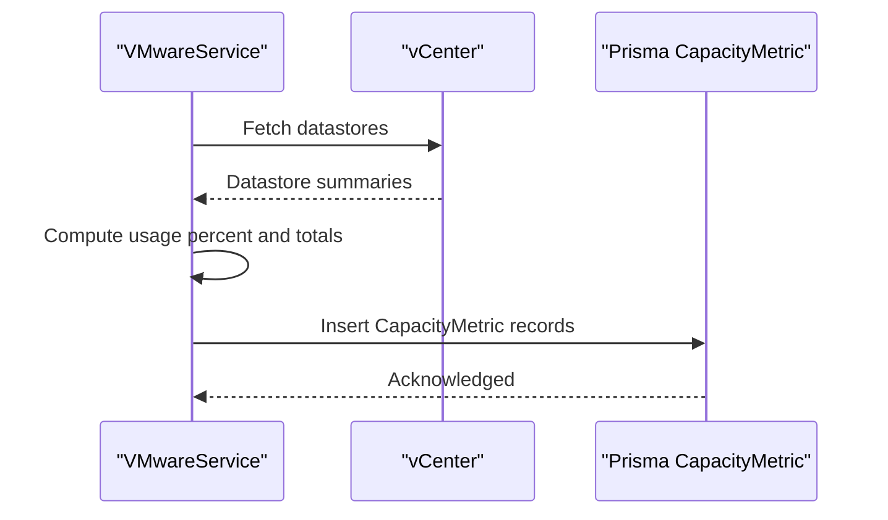
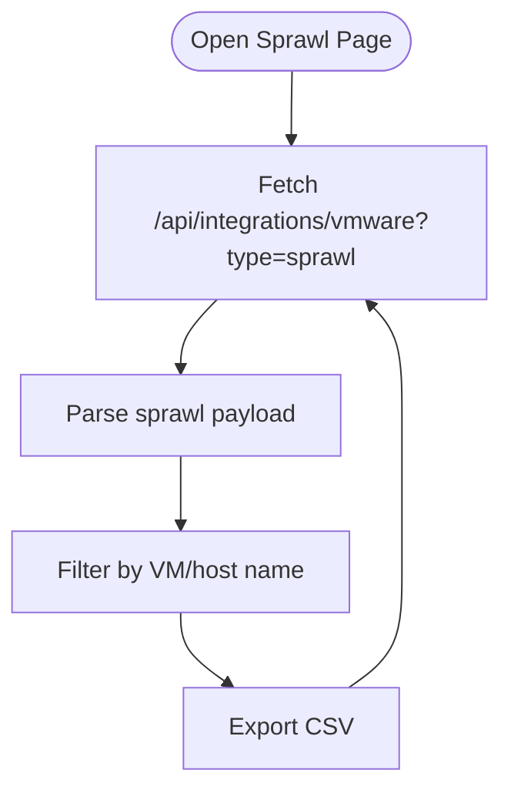
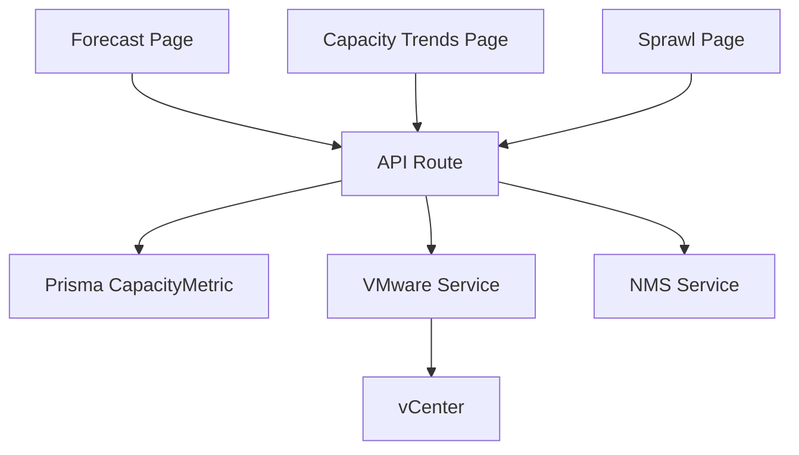

# Forecasting & Trends

<cite>
**Referenced Files in This Document**
- [page.tsx](file://app/analytics/forecast/page.tsx)
- [route.ts](file://app/api/integrations/vmware/route.ts)
- [schema.prisma](file://prisma/schema.prisma)
- [vmware.ts](file://lib/integrations/vmware.ts)
- [page.tsx](file://app/analytics/capacity/page.tsx)
- [page.tsx](file://app/analytics/sprawl/page.tsx)
- [main.py](file://nms_service/main.py)
</cite>

## Table of Contents
1. [Introduction](#introduction)
2. [Project Structure](#project-structure)
3. [Core Components](#core-components)
4. [Architecture Overview](#architecture-overview)
5. [Detailed Component Analysis](#detailed-component-analysis)
6. [Dependency Analysis](#dependency-analysis)
7. [Performance Considerations](#performance-considerations)
8. [Troubleshooting Guide](#troubleshooting-guide)
9. [Conclusion](#conclusion)

## Introduction
This document explains the forecasting and trend analysis capabilities implemented in the project. It covers predictive analytics for infrastructure growth, resource demand forecasting, and capacity planning predictions. It also documents trend analysis algorithms, historical data processing, pattern recognition, visualization components, time-series analysis, and seasonal pattern detection. Practical examples, configuration guidance, preprocessing requirements, and performance optimization strategies for large datasets are included.

## Project Structure
The forecasting and trend features are implemented as:
- Frontend pages under app/analytics that render interactive dashboards and tables.
- Backend API routes under app/api/integrations/vmware that compute trends and forecasts.
- Data persistence via Prisma models for capacity metrics.
- Data collection via the VMware integration service that writes metrics to the database.
- Supporting analytics pages for sprawl and capacity trends.

**Diagram sources**
- [page.tsx:1-264](file://app/analytics/forecast/page.tsx#L1-L264)
- [page.tsx:1-258](file://app/analytics/capacity/page.tsx#L1-L258)
- [page.tsx:1-288](file://app/analytics/sprawl/page.tsx#L1-L288)
- [route.ts:1-800](file://app/api/integrations/vmware/route.ts#L1-L800)
- [schema.prisma:714-727](file://prisma/schema.prisma#L714-L727)
- [vmware.ts:2393-2430](file://lib/integrations/vmware.ts#L2393-L2430)
- [main.py:1-483](file://nms_service/main.py#L1-L483)

**Section sources**
- [page.tsx:1-264](file://app/analytics/forecast/page.tsx#L1-L264)
- [page.tsx:1-258](file://app/analytics/capacity/page.tsx#L1-L258)
- [page.tsx:1-288](file://app/analytics/sprawl/page.tsx#L1-L288)
- [route.ts:1-800](file://app/api/integrations/vmware/route.ts#L1-L800)
- [schema.prisma:714-727](file://prisma/schema.prisma#L714-L727)
- [vmware.ts:2393-2430](file://lib/integrations/vmware.ts#L2393-L2430)
- [main.py:1-483](file://nms_service/main.py#L1-L483)

## Core Components
- Forecasting Page: Renders a table of predicted growth for CPU, memory, and disk across infrastructure resources using linear regression on recent time-series data.
- Capacity Trends Page: Computes and displays recent usage trends and statuses for the same metrics, enabling capacity planning.
- Sprawl Analysis Page: Identifies orphaned, unused, or mismanaged VMs to reduce sprawl risk.
- API Route: Implements trend computation and growth forecasting, grouping metrics by resource and metric type, and applying linear regression.
- Data Model: Stores capacity metrics with indexed composite keys for efficient queries.
- Data Collection: The VMware integration service collects datastore usage and persists metrics to the database.

**Section sources**
- [page.tsx:17-29](file://app/analytics/forecast/page.tsx#L17-L29)
- [page.tsx:17-26](file://app/analytics/capacity/page.tsx#L17-L26)
- [route.ts:21-71](file://app/api/integrations/vmware/route.ts#L21-L71)
- [route.ts:73-151](file://app/api/integrations/vmware/route.ts#L73-L151)
- [schema.prisma:714-727](file://prisma/schema.prisma#L714-L727)
- [vmware.ts:2393-2430](file://lib/integrations/vmware.ts#L2393-L2430)

## Architecture Overview
The forecasting and trend pipeline follows a clear separation of concerns:
- Frontend pages fetch data from backend endpoints.
- Backend endpoints query the database for recent capacity metrics, group them by resource/metric, and compute statistics.
- For forecasting, linear regression is applied to recent data points to project future usage.
- For trends, the endpoint compares recent versus older periods to derive percent change and status.

**Diagram sources**
- [page.tsx:36-54](file://app/analytics/forecast/page.tsx#L36-L54)
- [page.tsx:34-52](file://app/analytics/capacity/page.tsx#L34-L52)
- [route.ts:21-71](file://app/api/integrations/vmware/route.ts#L21-L71)
- [route.ts:73-151](file://app/api/integrations/vmware/route.ts#L73-L151)

## Detailed Component Analysis

### Forecasting Page
- Purpose: Display forward-looking projections for CPU, memory, and disk usage across infrastructure resources.
- Data source: Calls the backend growth-forecast endpoint.
- Behavior:
  - Automatically refreshes every 5 minutes.
  - Shows summary cards for critical/warning counts and nearest disk-full projection.
  - Renders a table with current usage, 30/60/90-day predictions, growth rate, days-until-full (for disk), and status.
  - Provides a “how it is calculated” explanation card.

**Diagram sources**
- [page.tsx:31-60](file://app/analytics/forecast/page.tsx#L31-L60)

**Section sources**
- [page.tsx:31-264](file://app/analytics/forecast/page.tsx#L31-L264)

### Capacity Trends Page
- Purpose: Show recent usage trends and statuses to inform capacity planning.
- Data source: Calls the backend capacity-trends endpoint with a configurable days window.
- Behavior:
  - Allows selecting days window (1/7/30).
  - Provides a “Collect Metrics” action to trigger collection.
  - Displays average CPU/memory/disk usage and summary counts.
  - Renders a table with current value, trend percent, status, and data point count.

**Diagram sources**
- [page.tsx:28-58](file://app/analytics/capacity/page.tsx#L28-L58)

**Section sources**
- [page.tsx:28-258](file://app/analytics/capacity/page.tsx#L28-L258)

### API Route: Trend Computation and Growth Forecast
- Trend computation:
  - Groups metrics by resourceType/resourceId/metricType.
  - Splits data into recent and older halves and computes average difference to derive trend percent.
  - Assigns status thresholds for critical/warning/normal.
- Growth forecast:
  - Uses linear regression on recent 30 days of data.
  - Projects 30/60/90 days ahead and computes annualized growth rate.
  - For disk metrics, estimates days-to-100% if growth is positive and within limits.
  - Sorts results by severity (critical → warning → normal).

**Diagram sources**
- [route.ts:21-71](file://app/api/integrations/vmware/route.ts#L21-L71)
- [route.ts:73-151](file://app/api/integrations/vmware/route.ts#L73-L151)

**Section sources**
- [route.ts:21-71](file://app/api/integrations/vmware/route.ts#L21-L71)
- [route.ts:73-151](file://app/api/integrations/vmware/route.ts#L73-L151)

### Data Model: Capacity Metrics
- The CapacityMetric model stores time-series capacity data with:
  - resourceType, resourceId, resourceName, metricType.
  - value (usage percentage or absolute value).
  - optional total (capacity).
  - timestamp.
- Composite index supports efficient queries by resource/metric/timestamp.

**Diagram sources**
- [schema.prisma:714-727](file://prisma/schema.prisma#L714-L727)

**Section sources**
- [schema.prisma:714-727](file://prisma/schema.prisma#L714-L727)

### Data Collection: VMware Service
- The VMware integration service collects datastore usage and persists metrics to the database.
- It computes used space as capacity − freeSpace and converts to a usage percentage.
- Metrics are saved with resource identifiers and timestamps.

**Diagram sources**
- [vmware.ts:2393-2430](file://lib/integrations/vmware.ts#L2393-L2430)

**Section sources**
- [vmware.ts:2393-2430](file://lib/integrations/vmware.ts#L2393-L2430)

### Sprawl Analysis Page
- Purpose: Detect VM sprawl by computing a score based on factors like snapshot count, oldest snapshot age, and power state duration.
- Features: Filtering, scoring badges, export to CSV, and periodic refresh.

**Diagram sources**
- [page.tsx:38-68](file://app/analytics/sprawl/page.tsx#L38-L68)

**Section sources**
- [page.tsx:38-288](file://app/analytics/sprawl/page.tsx#L38-L288)

## Dependency Analysis
- Frontend pages depend on backend endpoints for data.
- Backend endpoints depend on Prisma for querying capacity metrics.
- Data collection depends on the VMware integration service to populate the database.
- The NMS service provides an internal HTTP API for network device metrics and discovery, complementing infrastructure insights.

**Diagram sources**
- [page.tsx:36-54](file://app/analytics/forecast/page.tsx#L36-L54)
- [page.tsx:34-52](file://app/analytics/capacity/page.tsx#L34-L52)
- [page.tsx:44-62](file://app/analytics/sprawl/page.tsx#L44-L62)
- [route.ts:187-794](file://app/api/integrations/vmware/route.ts#L187-L794)
- [schema.prisma:714-727](file://prisma/schema.prisma#L714-L727)
- [vmware.ts:2393-2430](file://lib/integrations/vmware.ts#L2393-L2430)
- [main.py:1-483](file://nms_service/main.py#L1-L483)

**Section sources**
- [route.ts:187-794](file://app/api/integrations/vmware/route.ts#L187-L794)
- [main.py:1-483](file://nms_service/main.py#L1-L483)

## Performance Considerations
- Data volume and freshness:
  - Forecasting uses a fixed 30-day window; trends support configurable windows (1/7/30 days).
  - Use the days parameter to balance responsiveness and stability.
- Indexing:
  - The CapacityMetric model includes a composite index on resourceType/resourceId/metricType/timestamp to optimize queries.
- Caching:
  - The API route implements a simple in-process cache with TTL and stale-while-revalidate behavior for selected endpoints to reduce latency and load.
- Background warming:
  - The API route pre-warms related caches (e.g., hosts, clusters, datastores) after initial requests to improve subsequent navigations.
- Linear regression cost:
  - For each resource/metric group, the endpoint computes sums and applies the linear regression formula; keep groups bounded by recent data to maintain O(n) per group.
- Recommendations:
  - Increase polling frequency for critical resources to improve forecast granularity.
  - Monitor cache hit rates and adjust TTLs based on workload.
  - For very large environments, consider partitioning by organization or region in future iterations.

[No sources needed since this section provides general guidance]

## Troubleshooting Guide
- No data returned:
  - Ensure metrics are being collected. Use the “Collect Metrics” action on the capacity trends page to trigger collection.
  - Verify the VMware integration is configured and connected.
- Insufficient data points:
  - Forecasts require at least three data points; trends require at least two.
  - Extend the days window or wait for more frequent collection.
- Errors from backend:
  - Check the API route’s error handling and logs for authentication failures or query errors.
- Cache-related delays:
  - The API serves stale data for up to a 30-minute window; wait for background revalidation or force a bypass via the internal header used by the route.

**Section sources**
- [page.tsx:60-64](file://app/analytics/capacity/page.tsx#L60-L64)
- [route.ts:225-274](file://app/api/integrations/vmware/route.ts#L225-L274)
- [route.ts:795-800](file://app/api/integrations/vmware/route.ts#L795-L800)

## Conclusion
The project provides robust forecasting and trend analysis for infrastructure capacity across CPU, memory, and disk. Linear regression projects short-term growth, while trend analysis compares recent versus historical usage to flag potential issues. The modular architecture separates frontend dashboards, backend computations, and data collection, enabling scalability and maintainability. By tuning collection cadence, leveraging caching, and using the provided endpoints effectively, teams can plan capacity confidently and act on actionable insights.