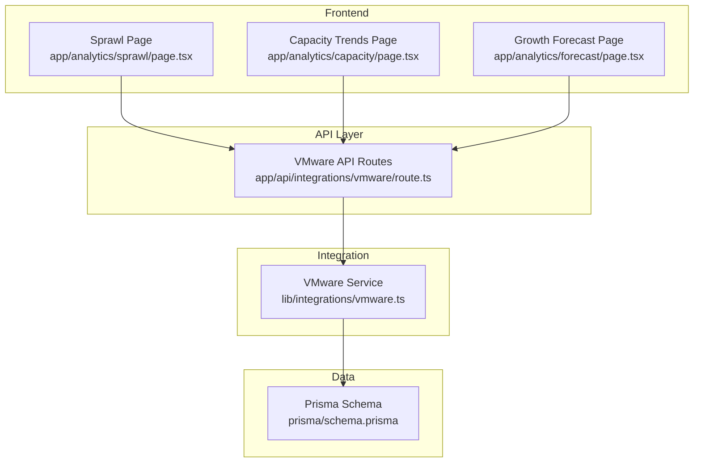
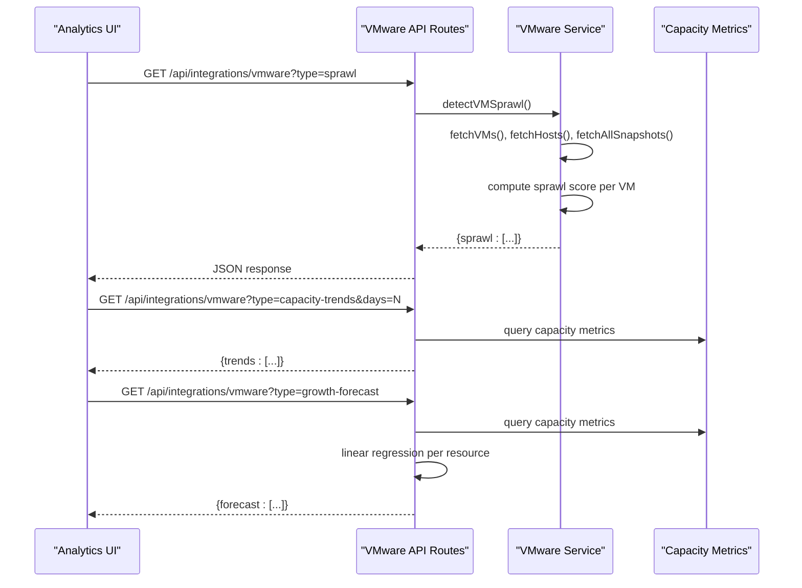
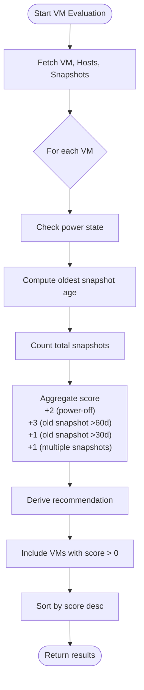
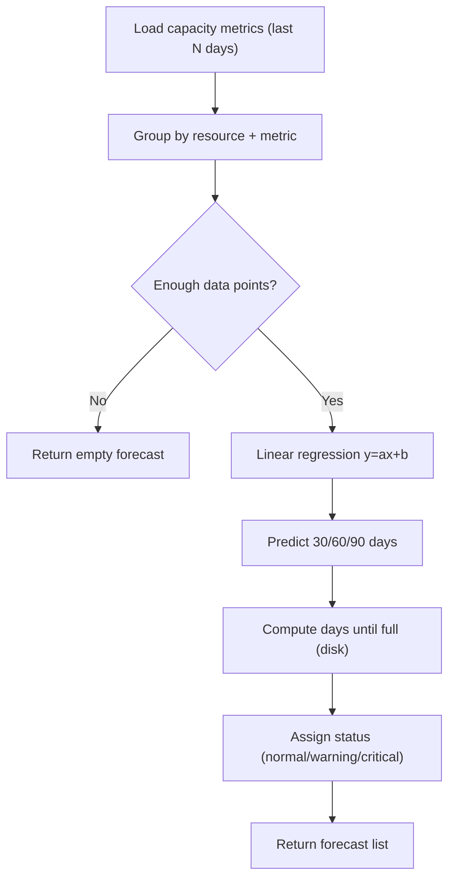
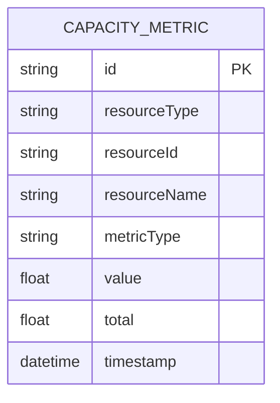
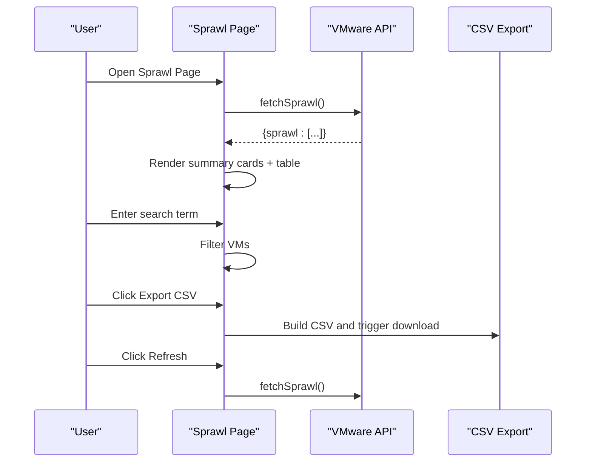
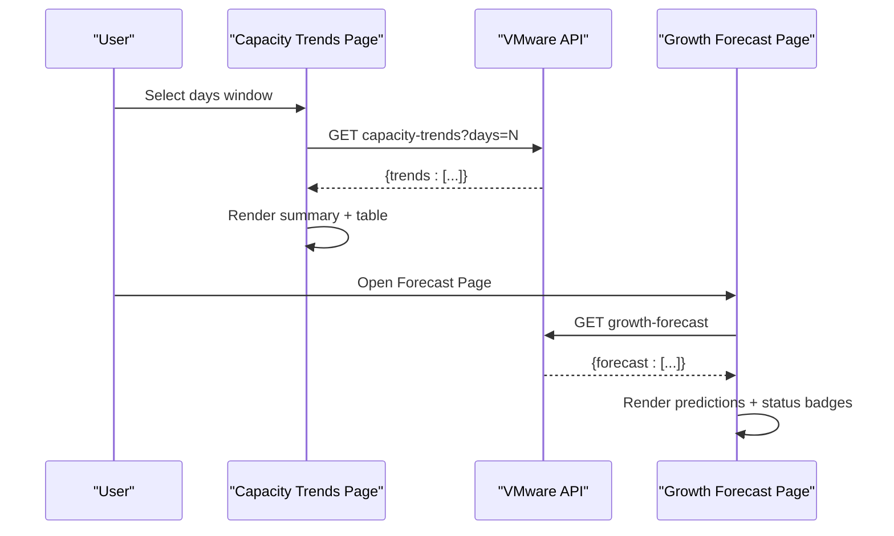
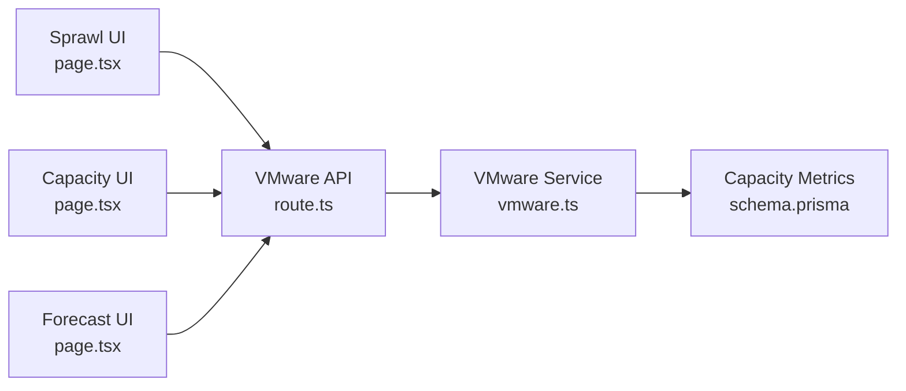

# Sprawl Analysis

<cite>
**Referenced Files in This Document**
- [page.tsx](file://app/analytics/sprawl/page.tsx)
- [route.ts](file://app/api/integrations/vmware/route.ts)
- [vmware.ts](file://lib/integrations/vmware.ts)
- [schema.prisma](file://prisma/schema.prisma)
- [page.tsx](file://app/analytics/capacity/page.tsx)
- [page.tsx](file://app/analytics/forecast/page.tsx)
</cite>

## Table of Contents
1. [Introduction](#introduction)
2. [Project Structure](#project-structure)
3. [Core Components](#core-components)
4. [Architecture Overview](#architecture-overview)
5. [Detailed Component Analysis](#detailed-component-analysis)
6. [Dependency Analysis](#dependency-analysis)
7. [Performance Considerations](#performance-considerations)
8. [Troubleshooting Guide](#troubleshooting-guide)
9. [Conclusion](#conclusion)
10. [Appendices](#appendices)

## Introduction
This document provides comprehensive coverage of sprawl analysis and infrastructure growth tracking within the platform. It explains sprawl detection algorithms for virtual machines, identifies unmanaged assets, and tracks infrastructure expansion patterns. It documents sprawl metrics, growth rate calculations, geographic distribution analysis, prevention strategies, asset consolidation recommendations, cost optimization opportunities, visualization components, heat maps, and spatial analysis tools. Practical workflows, growth pattern identification, and infrastructure rationalization strategies are included, along with reporting capabilities, trend analysis, and strategic planning recommendations.

## Project Structure
The sprawl analysis capability is implemented as a dedicated analytics page that integrates with the VMware integration API. The API routes orchestrate data retrieval from VMware vCenter, compute sprawl scores, and expose growth forecasting and capacity trend analysis. Historical capacity metrics are persisted to the database for trend computation.

**Diagram sources**
- [page.tsx:1-288](file://app/analytics/sprawl/page.tsx#L1-L288)
- [page.tsx:1-258](file://app/analytics/capacity/page.tsx#L1-L258)
- [page.tsx:1-264](file://app/analytics/forecast/page.tsx#L1-L264)
- [route.ts:1-800](file://app/api/integrations/vmware/route.ts#L1-L800)
- [vmware.ts:2230-2429](file://lib/integrations/vmware.ts#L2230-L2429)
- [schema.prisma:714-727](file://prisma/schema.prisma#L714-L727)

**Section sources**
- [page.tsx:1-288](file://app/analytics/sprawl/page.tsx#L1-L288)
- [route.ts:1-800](file://app/api/integrations/vmware/route.ts#L1-L800)
- [vmware.ts:2230-2429](file://lib/integrations/vmware.ts#L2230-L2429)
- [schema.prisma:714-727](file://prisma/schema.prisma#L714-L727)

## Core Components
- Sprawl Detection Engine: Computes a composite score per VM based on power state, snapshot age, and snapshot volume.
- VMware Integration API: Orchestrates data fetching, caching, and exposes endpoints for sprawl, capacity trends, and growth forecasts.
- Analytics Pages: Present sprawl findings, capacity trends, and growth projections with filtering, exporting, and periodic refresh.
- Persistent Metrics Store: Captures historical capacity metrics enabling trend and forecast computations.

Key implementation references:
- Sprawl detection algorithm and scoring: [vmware.ts:2232-2335](file://lib/integrations/vmware.ts#L2232-L2335)
- API endpoints for sprawl and metrics: [route.ts:720-743](file://app/api/integrations/vmware/route.ts#L720-L743)
- Capacity metrics persistence: [vmware.ts:2341-2427](file://lib/integrations/vmware.ts#L2341-L2427)
- Sprawl UI and CSV export: [page.tsx:93-114](file://app/analytics/sprawl/page.tsx#L93-L114)
- Capacity trends UI: [page.tsx:1-258](file://app/analytics/capacity/page.tsx#L1-L258)
- Growth forecast UI: [page.tsx:1-264](file://app/analytics/forecast/page.tsx#L1-L264)

**Section sources**
- [vmware.ts:2232-2335](file://lib/integrations/vmware.ts#L2232-L2335)
- [route.ts:720-743](file://app/api/integrations/vmware/route.ts#L720-L743)
- [vmware.ts:2341-2427](file://lib/integrations/vmware.ts#L2341-L2427)
- [page.tsx:93-114](file://app/analytics/sprawl/page.tsx#L93-L114)
- [page.tsx:1-258](file://app/analytics/capacity/page.tsx#L1-L258)
- [page.tsx:1-264](file://app/analytics/forecast/page.tsx#L1-L264)

## Architecture Overview
The sprawl analysis pipeline connects the frontend analytics pages to the VMware integration API, which retrieves data from vCenter, computes metrics, persists capacity data, and returns aggregated results for visualization.

**Diagram sources**
- [page.tsx:44-62](file://app/analytics/sprawl/page.tsx#L44-L62)
- [route.ts:720-743](file://app/api/integrations/vmware/route.ts#L720-L743)
- [vmware.ts:2232-2335](file://lib/integrations/vmware.ts#L2232-L2335)
- [page.tsx:34-52](file://app/analytics/capacity/page.tsx#L34-L52)
- [page.tsx:36-54](file://app/analytics/forecast/page.tsx#L36-L54)

## Detailed Component Analysis

### Sprawl Detection Algorithm
The algorithm evaluates each VM against a set of criteria to produce a composite sprawl score and actionable recommendations:
- Powered-off state: Adds points for extended downtime.
- Snapshot age: Penalizes very old snapshots and moderate staleness.
- Snapshot volume: Flags VMs with excessive snapshots.

**Diagram sources**
- [vmware.ts:2236-2335](file://lib/integrations/vmware.ts#L2236-L2335)

**Section sources**
- [vmware.ts:2232-2335](file://lib/integrations/vmware.ts#L2232-L2335)

### Growth Rate Calculations and Forecasting
Historical capacity metrics are stored and used to compute:
- Recent vs. older averages for trend detection.
- Linear regression coefficients for growth rates.
- Projections for 30/60/90 days.
- Days until disk capacity reaches 100% for disk metrics.

**Diagram sources**
- [route.ts:74-151](file://app/api/integrations/vmware/route.ts#L74-L151)
- [vmware.ts:2341-2427](file://lib/integrations/vmware.ts#L2341-L2427)

**Section sources**
- [route.ts:21-151](file://app/api/integrations/vmware/route.ts#L21-L151)
- [vmware.ts:2341-2427](file://lib/integrations/vmware.ts#L2341-L2427)

### Data Model for Capacity Metrics
Capacity metrics are persisted to enable trend and forecast analysis.

**Diagram sources**
- [schema.prisma:714-727](file://prisma/schema.prisma#L714-L727)

**Section sources**
- [schema.prisma:714-727](file://prisma/schema.prisma#L714-L727)

### Sprawl Visualization and Reporting
The sprawl page presents:
- Summary cards for critical, medium, low, and total snapshots.
- Search/filtering by VM name or host.
- Export to CSV for downstream analysis.
- Periodic refresh and error handling.

**Diagram sources**
- [page.tsx:44-114](file://app/analytics/sprawl/page.tsx#L44-L114)

**Section sources**
- [page.tsx:1-288](file://app/analytics/sprawl/page.tsx#L1-L288)

### Capacity Trends and Growth Forecast UI
- Capacity Trends: Selectable time windows, average utilization per metric type, and status badges.
- Growth Forecast: Predictions for 30/60/90 days, growth rate per month, and nearest disk-full projection.

**Diagram sources**
- [page.tsx:34-58](file://app/analytics/capacity/page.tsx#L34-L58)
- [page.tsx:36-60](file://app/analytics/forecast/page.tsx#L36-L60)

**Section sources**
- [page.tsx:1-258](file://app/analytics/capacity/page.tsx#L1-L258)
- [page.tsx:1-264](file://app/analytics/forecast/page.tsx#L1-L264)

## Dependency Analysis
- Frontend analytics pages depend on the VMware API routes for data.
- The VMware API routes depend on the VMware service for vCenter integration and on the database for capacity metrics persistence.
- The sprawl detection algorithm depends on VM, host, and snapshot data retrieval.

**Diagram sources**
- [page.tsx:1-288](file://app/analytics/sprawl/page.tsx#L1-L288)
- [page.tsx:1-258](file://app/analytics/capacity/page.tsx#L1-L258)
- [page.tsx:1-264](file://app/analytics/forecast/page.tsx#L1-L264)
- [route.ts:1-800](file://app/api/integrations/vmware/route.ts#L1-L800)
- [vmware.ts:2230-2429](file://lib/integrations/vmware.ts#L2230-L2429)
- [schema.prisma:714-727](file://prisma/schema.prisma#L714-L727)

**Section sources**
- [page.tsx:1-288](file://app/analytics/sprawl/page.tsx#L1-L288)
- [page.tsx:1-258](file://app/analytics/capacity/page.tsx#L1-L258)
- [page.tsx:1-264](file://app/analytics/forecast/page.tsx#L1-L264)
- [route.ts:1-800](file://app/api/integrations/vmware/route.ts#L1-L800)
- [vmware.ts:2230-2429](file://lib/integrations/vmware.ts#L2230-L2429)
- [schema.prisma:714-727](file://prisma/schema.prisma#L714-L727)

## Performance Considerations
- Caching: The VMware API implements a cache layer with fresh/stale windows and background revalidation to reduce latency and load on vCenter.
- Parallel data fetching: The sprawl detection and API routes use concurrent requests to minimize latency.
- Trend computation: Aggregation over recent vs. older periods reduces sensitivity to outliers.
- Forecast stability: Linear regression requires a minimum number of data points; otherwise, forecasts are withheld.

[No sources needed since this section provides general guidance]

## Troubleshooting Guide
Common issues and resolutions:
- VMware integration not configured: Verify integration configuration exists and credentials are valid.
- Authentication failures: Check vCenter credentials and connectivity.
- Empty or stale data: Confirm metrics collection is scheduled and recent data points exist.
- UI errors: Use the retry button on the UI; inspect browser console for network errors.

Operational references:
- Configuration and status endpoints: [route.ts:195-223](file://app/api/integrations/vmware/route.ts#L195-L223)
- Connection status check: [route.ts:698-718](file://app/api/integrations/vmware/route.ts#L698-L718)
- Metrics collection trigger: [route.ts:726-730](file://app/api/integrations/vmware/route.ts#L726-L730)
- Capacity metrics persistence: [vmware.ts:2341-2427](file://lib/integrations/vmware.ts#L2341-L2427)

**Section sources**
- [route.ts:195-223](file://app/api/integrations/vmware/route.ts#L195-L223)
- [route.ts:698-718](file://app/api/integrations/vmware/route.ts#L698-L718)
- [route.ts:726-730](file://app/api/integrations/vmware/route.ts#L726-L730)
- [vmware.ts:2341-2427](file://lib/integrations/vmware.ts#L2341-L2427)

## Conclusion
The platform provides a robust sprawl analysis solution that detects unmanaged and underutilized assets, quantifies growth trends, and forecasts future capacity needs. The modular architecture ensures scalability, while persistent metrics enable trend and forecast analysis. The UI components deliver actionable insights with export capabilities and automated refresh, supporting informed infrastructure rationalization and cost optimization decisions.

[No sources needed since this section summarizes without analyzing specific files]

## Appendices

### Practical Workflows
- Sprawl identification workflow:
  - Navigate to the Sprawl page.
  - Review summary cards and VM table.
  - Export CSV for deeper analysis.
  - Apply recommendations to consolidate or decommission assets.
- Growth pattern identification:
  - Use Capacity Trends to compare recent vs. older utilization.
  - Use Growth Forecast to project 30/60/90-day usage and identify critical resources.
- Infrastructure rationalization:
  - Target VMs with high sprawl scores and old snapshots.
  - Consolidate onto fewer hosts or decommission assets.
  - Right-size clusters and datastores based on forecast projections.

[No sources needed since this section provides general guidance]