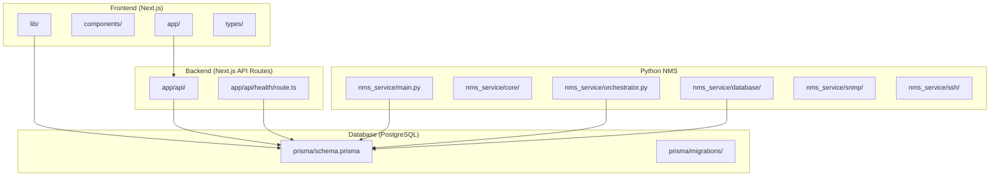
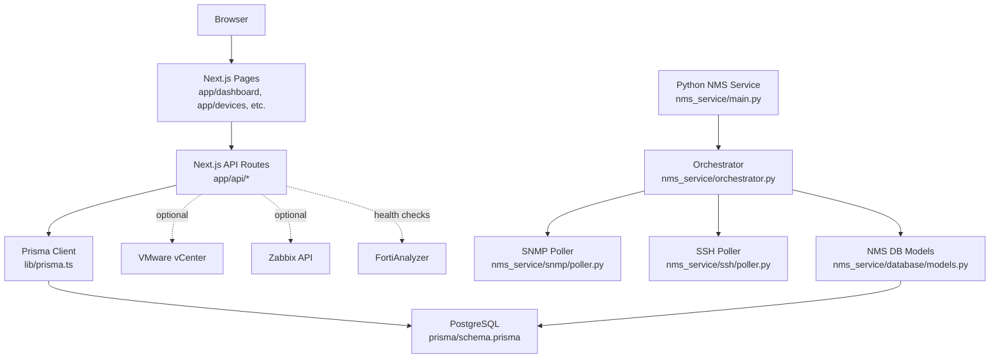
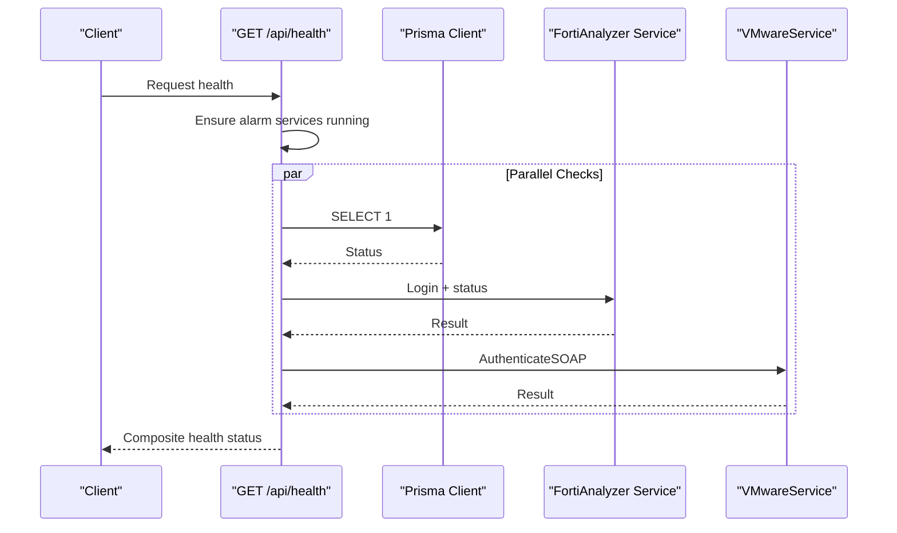
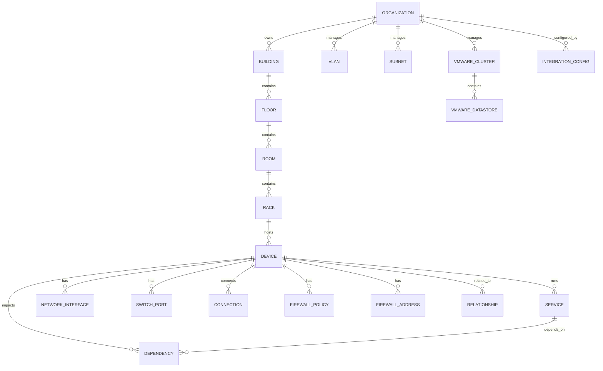
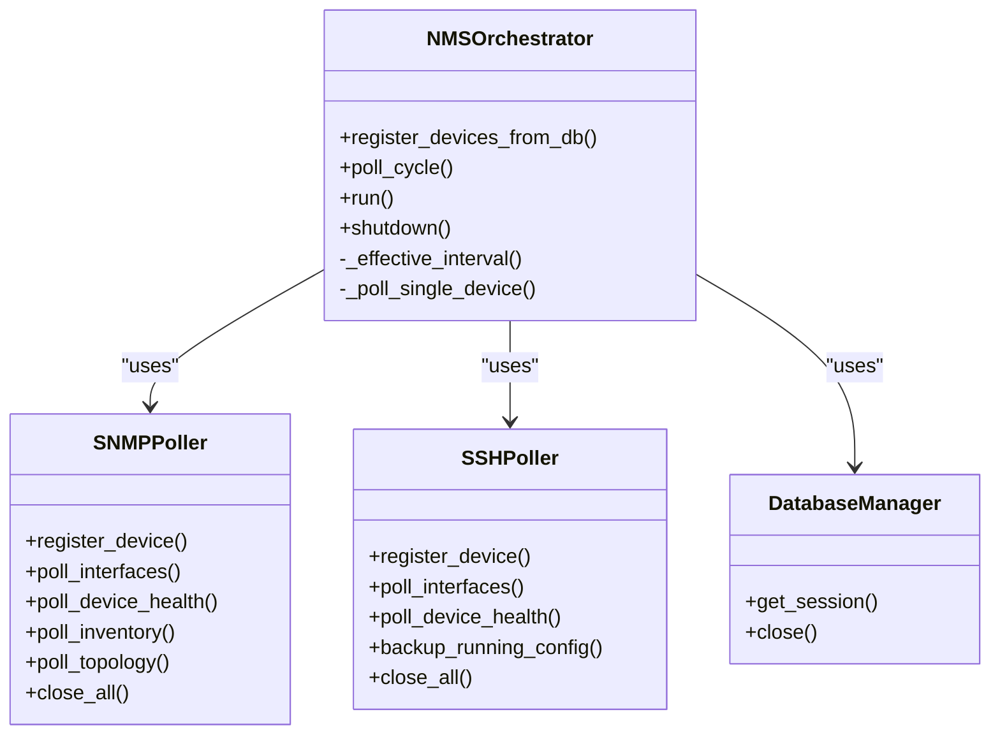
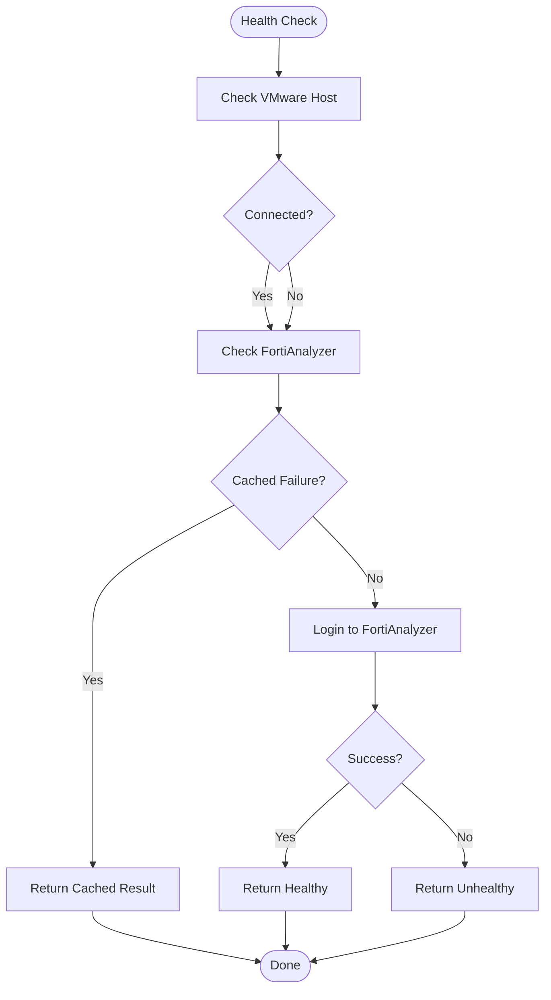
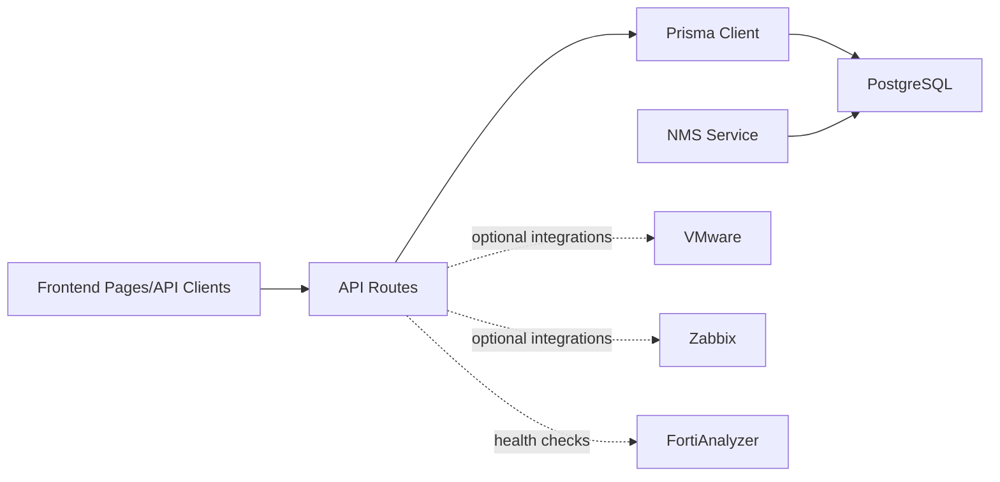
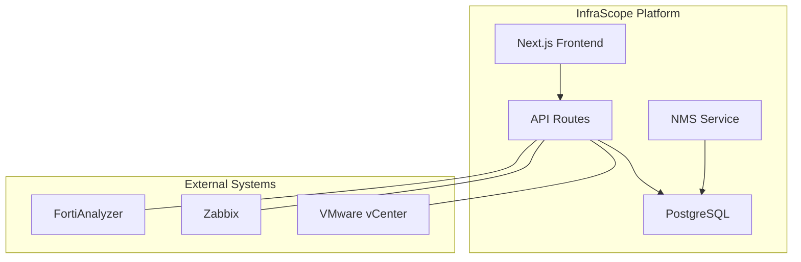

# Architecture & Design

<cite>
**Referenced Files in This Document**
- [README.md](file://README.md)
- [ARCHITECTURE.md](file://ARCHITECTURE.md)
- [package.json](file://package.json)
- [next.config.js](file://next.config.js)
- [tsconfig.json](file://tsconfig.json)
- [lib/prisma.ts](file://lib/prisma.ts)
- [prisma/schema.prisma](file://prisma/schema.prisma)
- [app/api/health/route.ts](file://app/api/health/route.ts)
- [lib/api.ts](file://lib/api.ts)
- [types/index.ts](file://types/index.ts)
- [nms_service/main.py](file://nms_service/main.py)
- [nms_service/core/config.py](file://nms_service/core/config.py)
- [nms_service/database/models.py](file://nms_service/database/models.py)
- [nms_service/orchestrator.py](file://nms_service/orchestrator.py)
- [nms_service/snmp/poller.py](file://nms_service/snmp/poller.py)
- [nms_service/ssh/poller.py](file://nms_service/ssh/poller.py)
</cite>

## Table of Contents
1. [Introduction](#introduction)
2. [Project Structure](#project-structure)
3. [Core Components](#core-components)
4. [Architecture Overview](#architecture-overview)
5. [Detailed Component Analysis](#detailed-component-analysis)
6. [Dependency Analysis](#dependency-analysis)
7. [Performance Considerations](#performance-considerations)
8. [Troubleshooting Guide](#troubleshooting-guide)
9. [Conclusion](#conclusion)
10. [Appendices](#appendices)

## Introduction
InfraScope is an enterprise-grade infrastructure management platform centered on a Next.js frontend, a Node.js runtime for API routes, a PostgreSQL database, and a Python-based Network Management Service (NMS). The system follows a clean architecture with clear separation between presentation, business logic, and data layers. It integrates with external systems such as VMware, Zabbix, and Fortinet through dedicated endpoints and shared database tables. The platform emphasizes TypeScript strict mode, SOLID principles, and a modular component structure to ensure maintainability, scalability, and extensibility.

## Project Structure
The repository organizes code into distinct areas:
- Frontend (Next.js App Router): Pages, API routes, shared components, and utilities
- Backend (Next.js API Routes): REST endpoints under app/api/*
- Database (PostgreSQL): Prisma schema and migrations
- Python NMS: Internal service for SNMP/SSH polling, discovery, and metrics persistence
- Shared Types and Utilities: Centralized type definitions and API client utilities

**Diagram sources**
- [README.md:106-164](file://README.md#L106-L164)
- [ARCHITECTURE.md:28-103](file://ARCHITECTURE.md#L28-L103)
- [prisma/schema.prisma:1-25](file://prisma/schema.prisma#L1-L25)
- [nms_service/main.py:1-50](file://nms_service/main.py#L1-L50)

**Section sources**
- [README.md:106-164](file://README.md#L106-L164)
- [ARCHITECTURE.md:28-103](file://ARCHITECTURE.md#L28-L103)

## Core Components
- Next.js Frontend: Pages and components organized by feature, styled with Tailwind CSS, and powered by TypeScript strict mode.
- Next.js API Routes: REST endpoints under app/api/* that orchestrate business logic and interact with the database via Prisma.
- Prisma ORM: Database client and schema management, generating type-safe clients and migrations.
- PostgreSQL Database: Central data store with relational tables and JSONB fields for extensibility.
- Python NMS Service: Concurrent SNMP/SSH polling, discovery, and metrics persistence integrated with the shared database.
- Shared Types and Utilities: Centralized TypeScript types and API client utilities for consistent data contracts.

**Section sources**
- [README.md:108-126](file://README.md#L108-L126)
- [ARCHITECTURE.md:7-27](file://ARCHITECTURE.md#L7-L27)
- [lib/prisma.ts:1-21](file://lib/prisma.ts#L1-L21)
- [prisma/schema.prisma:10-228](file://prisma/schema.prisma#L10-L228)
- [nms_service/main.py:1-50](file://nms_service/main.py#L1-L50)
- [lib/api.ts:1-57](file://lib/api.ts#L1-L57)
- [types/index.ts:1-312](file://types/index.ts#L1-L312)

## Architecture Overview
InfraScope implements a clean architecture with three layers:
- Presentation Layer: Next.js pages and API routes handle user interactions and HTTP requests.
- Business Logic Layer: API route handlers coordinate domain operations, validation, and integration calls.
- Data Layer: Prisma ORM abstracts database operations and enforces type safety.

External integrations are achieved through:
- VMware: SOAP authentication checks and optional module polling via environment configuration.
- Zabbix: Device identifiers mapped to Zabbix host IDs for correlation.
- Fortinet: FortiAnalyzer connectivity checks with login health caching to avoid repeated failures.

**Diagram sources**
- [app/api/health/route.ts:1-255](file://app/api/health/route.ts#L1-L255)
- [lib/prisma.ts:1-21](file://lib/prisma.ts#L1-L21)
- [prisma/schema.prisma:151-228](file://prisma/schema.prisma#L151-L228)
- [nms_service/main.py:1-120](file://nms_service/main.py#L1-L120)
- [nms_service/orchestrator.py:1-120](file://nms_service/orchestrator.py#L1-L120)
- [nms_service/snmp/poller.py:1-120](file://nms_service/snmp/poller.py#L1-L120)
- [nms_service/ssh/poller.py:1-120](file://nms_service/ssh/poller.py#L1-L120)

## Detailed Component Analysis

### Next.js API Routes and Health Endpoint
The health endpoint consolidates service and datasource health checks, auto-starting alarm services if needed and returning a composite status. It queries the database, checks FortiAnalyzer connectivity with backoff logic, and validates VMware authentication when configured.

**Diagram sources**
- [app/api/health/route.ts:204-254](file://app/api/health/route.ts#L204-L254)

**Section sources**
- [app/api/health/route.ts:14-255](file://app/api/health/route.ts#L14-L255)

### Prisma ORM and Database Schema
Prisma provides a type-safe client and manages schema migrations. The schema defines core entities (organizations, buildings, devices, services, dependencies) and extended enterprise features (VLANs, subnets, firewall policies, VMware clusters/datastores, relationships, integration configs). JSONB fields enable extensibility for metadata and logs.

**Diagram sources**
- [prisma/schema.prisma:10-800](file://prisma/schema.prisma#L10-L800)

**Section sources**
- [lib/prisma.ts:1-21](file://lib/prisma.ts#L1-L21)
- [prisma/schema.prisma:10-800](file://prisma/schema.prisma#L10-L800)

### Python NMS Service: Orchestrator, Pollers, and Models
The NMS service runs as a background process, registering devices from the shared database and performing concurrent SNMP and SSH polling. It persists metrics and topology data directly into nms_* tables and exposes internal HTTP endpoints for triggering on-demand operations and discovery scans.

**Diagram sources**
- [nms_service/orchestrator.py:35-461](file://nms_service/orchestrator.py#L35-L461)
- [nms_service/snmp/poller.py:63-592](file://nms_service/snmp/poller.py#L63-L592)
- [nms_service/ssh/poller.py:221-625](file://nms_service/ssh/poller.py#L221-L625)
- [nms_service/database/models.py:196-227](file://nms_service/database/models.py#L196-L227)

**Section sources**
- [nms_service/main.py:1-483](file://nms_service/main.py#L1-L483)
- [nms_service/core/config.py:71-172](file://nms_service/core/config.py#L71-L172)
- [nms_service/database/models.py:1-227](file://nms_service/database/models.py#L1-L227)
- [nms_service/orchestrator.py:1-461](file://nms_service/orchestrator.py#L1-L461)
- [nms_service/snmp/poller.py:1-592](file://nms_service/snmp/poller.py#L1-L592)
- [nms_service/ssh/poller.py:1-625](file://nms_service/ssh/poller.py#L1-L625)

### Integration Patterns with VMware, Zabbix, and Fortinet
- VMware: The health endpoint conditionally authenticates via SOAP when configured, enabling verification of vCenter connectivity.
- Zabbix: Device records include a zabbixHostId field for correlating with Zabbix host identifiers.
- Fortinet: The health endpoint performs login attempts against FortiAnalyzer with intelligent caching to avoid continuous failures when accounts are blocked.

**Diagram sources**
- [app/api/health/route.ts:68-117](file://app/api/health/route.ts#L68-L117)

**Section sources**
- [app/api/health/route.ts:122-144](file://app/api/health/route.ts#L122-L144)
- [prisma/schema.prisma:175-187](file://prisma/schema.prisma#L175-L187)

## Dependency Analysis
The system exhibits low coupling between layers and clear boundaries:
- Frontend depends on API routes and shared types.
- API routes depend on Prisma for data access.
- NMS service depends on shared database models and configuration.
- Integrations are optional and isolated behind environment checks.

**Diagram sources**
- [lib/prisma.ts:1-21](file://lib/prisma.ts#L1-L21)
- [prisma/schema.prisma:10-228](file://prisma/schema.prisma#L10-L228)
- [nms_service/database/models.py:196-227](file://nms_service/database/models.py#L196-L227)
- [app/api/health/route.ts:122-144](file://app/api/health/route.ts#L122-L144)

**Section sources**
- [lib/api.ts:1-57](file://lib/api.ts#L1-L57)
- [types/index.ts:1-312](file://types/index.ts#L1-L312)

## Performance Considerations
- Database: Use indexes on frequently queried fields, implement pagination, lazy loading for related entities, and cache commonly accessed data.
- Frontend: Enable code splitting, dynamic imports, optimized images, and virtual scrolling for large lists.
- API: Apply rate limiting, caching headers, compression, and request validation.
- NMS: Employ thread pools for concurrent polling, per-device interval throttling, and jitter to avoid thundering herds; persist metrics directly to minimize round-trips.

[No sources needed since this section provides general guidance]

## Troubleshooting Guide
- Database connectivity: Ensure DATABASE_URL is correctly configured and the database is reachable.
- Prisma client generation: Regenerate the client if types are missing or mismatched.
- Port conflicts: Adjust the development port if 3000 is in use.
- TypeScript errors: Run type checks and rebuild the project to resolve type mismatches.
- NMS service: Verify environment variables for SNMP/SSH configuration and ensure the orchestrator is running.

**Section sources**
- [README.md:357-393](file://README.md#L357-L393)
- [nms_service/core/config.py:71-172](file://nms_service/core/config.py#L71-L172)

## Conclusion
InfraScope’s architecture cleanly separates presentation, business logic, and data layers while integrating external systems through robust endpoints and a shared database. The use of TypeScript strict mode, SOLID principles, and modular components ensures maintainability and scalability. The Python NMS service complements the platform with concurrent SNMP/SSH polling and discovery capabilities, backed by a flexible PostgreSQL schema with JSONB for extensibility.

[No sources needed since this section summarizes without analyzing specific files]

## Appendices

### System Context Diagram
This diagram shows the relationships between components and external systems.

**Diagram sources**
- [README.md:106-164](file://README.md#L106-L164)
- [prisma/schema.prisma:10-228](file://prisma/schema.prisma#L10-L228)
- [nms_service/main.py:1-120](file://nms_service/main.py#L1-L120)
- [app/api/health/route.ts:122-144](file://app/api/health/route.ts#L122-L144)

### Infrastructure Requirements and Deployment Topology
- Technology stack: Next.js 14, Node.js runtime, PostgreSQL, Python NMS service.
- Environment configuration: DATABASE_URL, API base URLs, and integration credentials.
- Deployment topology: The NMS service operates internally and persists data into the shared PostgreSQL database. API routes expose endpoints for frontend consumption and optional integrations.

**Section sources**
- [README.md:66-95](file://README.md#L66-L95)
- [README.md:330-356](file://README.md#L330-L356)
- [nms_service/core/config.py:79-110](file://nms_service/core/config.py#L79-L110)