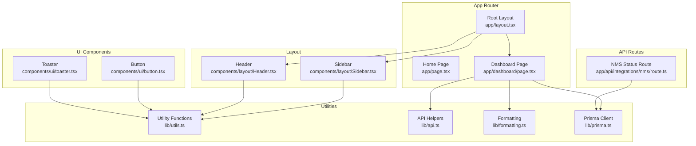
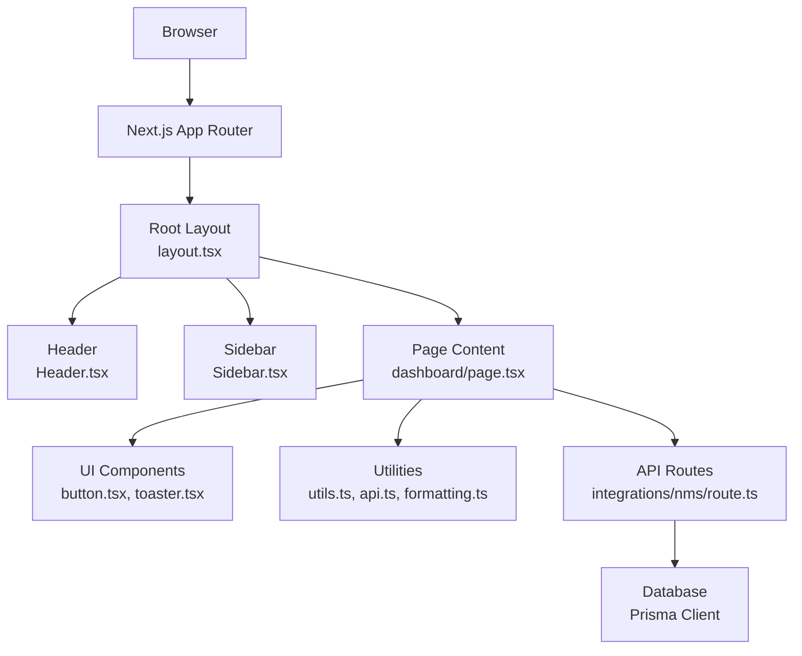
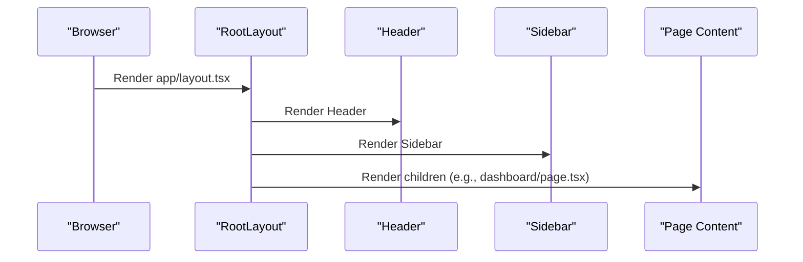
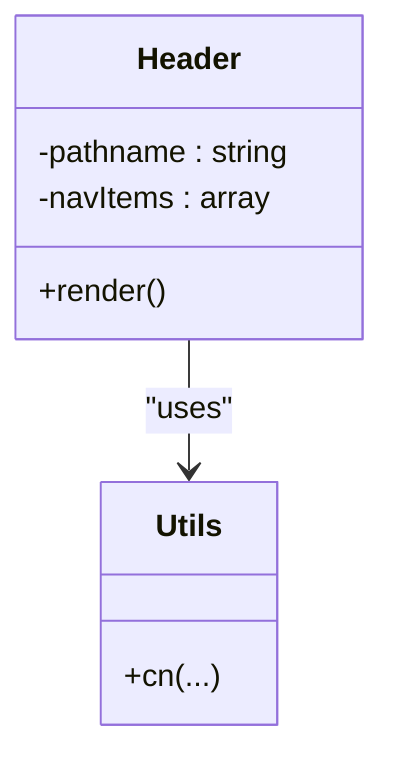
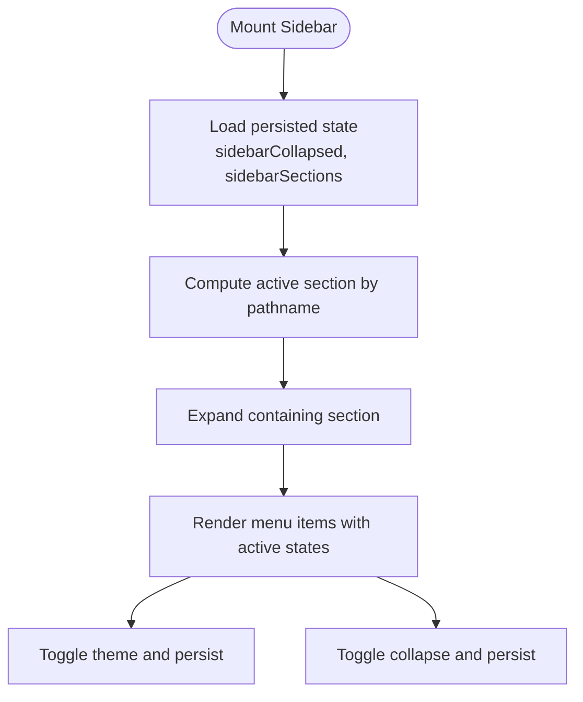
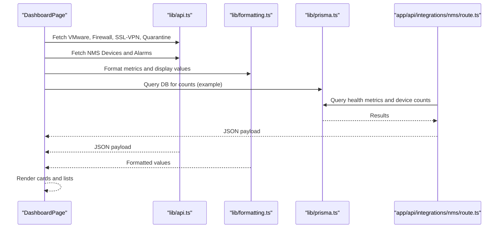
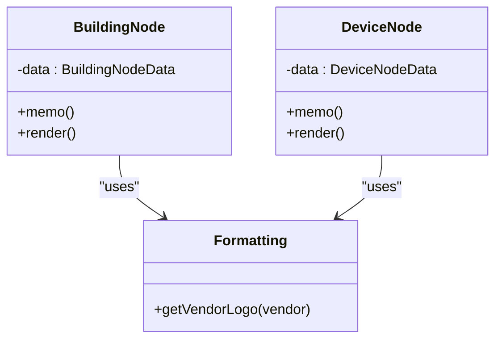
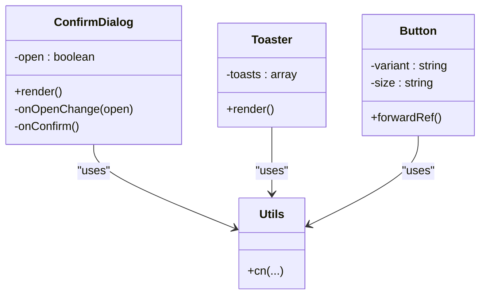
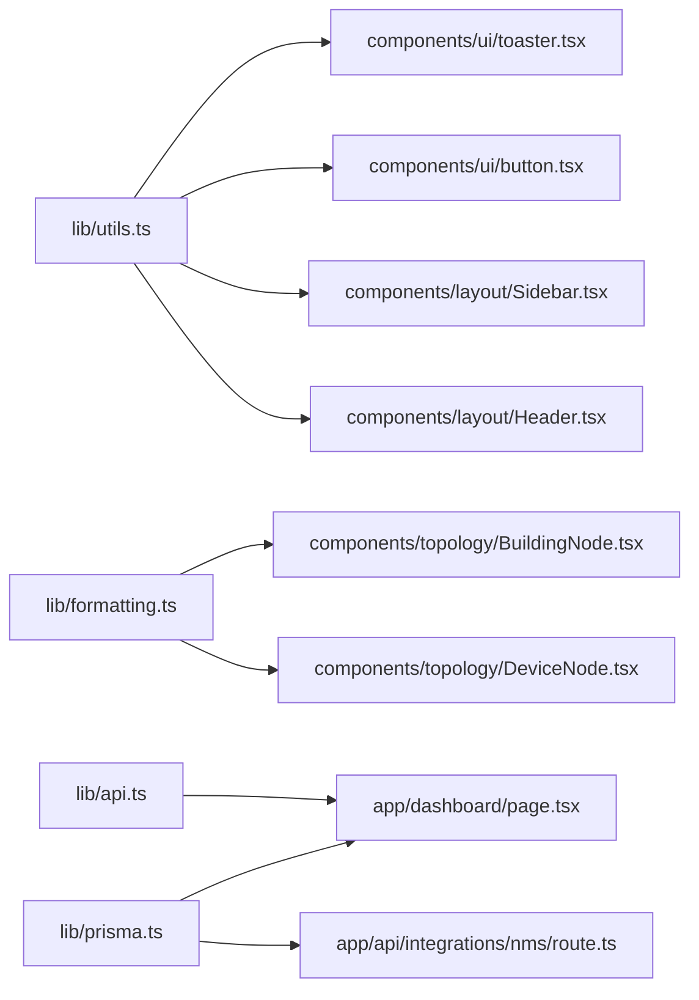

# Component Relationships

<cite>
**Referenced Files in This Document**
- [app/layout.tsx](file://app/layout.tsx)
- [app/page.tsx](file://app/page.tsx)
- [components/layout/Header.tsx](file://components/layout/Header.tsx)
- [components/layout/Sidebar.tsx](file://components/layout/Sidebar.tsx)
- [components/ui/button.tsx](file://components/ui/button.tsx)
- [components/ui/toaster.tsx](file://components/ui/toaster.tsx)
- [lib/utils.ts](file://lib/utils.ts)
- [lib/api.ts](file://lib/api.ts)
- [lib/formatting.ts](file://lib/formatting.ts)
- [lib/prisma.ts](file://lib/prisma.ts)
- [app/dashboard/page.tsx](file://app/dashboard/page.tsx)
- [components/topology/BuildingNode.tsx](file://components/topology/BuildingNode.tsx)
- [components/topology/DeviceNode.tsx](file://components/topology/DeviceNode.tsx)
- [components/shared/ConfirmDialog.tsx](file://components/shared/ConfirmDialog.tsx)
- [app/api/integrations/nms/route.ts](file://app/api/integrations/nms/route.ts)
</cite>

## Table of Contents
1. [Introduction](#introduction)
2. [Project Structure](#project-structure)
3. [Core Components](#core-components)
4. [Architecture Overview](#architecture-overview)
5. [Detailed Component Analysis](#detailed-component-analysis)
6. [Dependency Analysis](#dependency-analysis)
7. [Performance Considerations](#performance-considerations)
8. [Troubleshooting Guide](#troubleshooting-guide)
9. [Conclusion](#conclusion)

## Introduction
This document explains how the InfraScope frontend composes pages, API routes, React components, and shared utilities into a cohesive system. It focuses on:
- How the root layout coordinates header, sidebar, and content areas
- Component composition patterns and state management integration
- Data flow between pages and backend services via API routes
- Communication patterns between frontend and backend services
- Reusability and extension mechanisms for components and utilities

## Project Structure
The application follows a Next.js App Router structure with:
- Pages under app/<route>/page.tsx
- API routes under app/api/<endpoint>/route.ts
- Shared UI components under components/ui/*
- Layout components under components/layout/*
- Topology-specific nodes under components/topology/*
- Shared dialogs under components/shared/*
- Utilities under lib/*

**Diagram sources**
- [app/layout.tsx:20-56](file://app/layout.tsx#L20-L56)
- [app/page.tsx:6-14](file://app/page.tsx#L6-L14)
- [app/dashboard/page.tsx:101-731](file://app/dashboard/page.tsx#L101-L731)
- [components/layout/Header.tsx:18-79](file://components/layout/Header.tsx#L18-L79)
- [components/layout/Sidebar.tsx:56-408](file://components/layout/Sidebar.tsx#L56-L408)
- [components/ui/button.tsx:42-56](file://components/ui/button.tsx#L42-L56)
- [components/ui/toaster.tsx:13-35](file://components/ui/toaster.tsx#L13-L35)
- [lib/utils.ts:4-6](file://lib/utils.ts#L4-L6)
- [lib/api.ts:1-57](file://lib/api.ts#L1-L57)
- [lib/formatting.ts:1-176](file://lib/formatting.ts#L1-L176)
- [lib/prisma.ts:10-20](file://lib/prisma.ts#L10-L20)
- [app/api/integrations/nms/route.ts:8-52](file://app/api/integrations/nms/route.ts#L8-L52)

**Section sources**
- [app/layout.tsx:20-56](file://app/layout.tsx#L20-L56)
- [app/page.tsx:6-14](file://app/page.tsx#L6-L14)
- [components/layout/Header.tsx:18-79](file://components/layout/Header.tsx#L18-L79)
- [components/layout/Sidebar.tsx:56-408](file://components/layout/Sidebar.tsx#L56-L408)
- [components/ui/button.tsx:42-56](file://components/ui/button.tsx#L42-L56)
- [components/ui/toaster.tsx:13-35](file://components/ui/toaster.tsx#L13-L35)
- [lib/utils.ts:4-6](file://lib/utils.ts#L4-L6)
- [lib/api.ts:1-57](file://lib/api.ts#L1-L57)
- [lib/formatting.ts:1-176](file://lib/formatting.ts#L1-L176)
- [lib/prisma.ts:10-20](file://lib/prisma.ts#L10-L20)
- [app/dashboard/page.tsx:101-731](file://app/dashboard/page.tsx#L101-L731)
- [app/api/integrations/nms/route.ts:8-52](file://app/api/integrations/nms/route.ts#L8-L52)

## Core Components
- Root layout establishes the shell with a fixed header and collapsible sidebar, delegating content rendering to routed pages.
- Dashboard page orchestrates multiple data sources, aggregates metrics, and renders domain-specific cards and lists.
- Utility modules provide shared formatting, class merging, API helpers, and Prisma client initialization.

Key relationships:
- Root layout composes Header and Sidebar and passes page content via children.
- Dashboard page consumes API helpers and formatting utilities to render structured views.
- Sidebar and Header rely on shared utility functions for conditional styling and responsive behavior.

**Section sources**
- [app/layout.tsx:20-56](file://app/layout.tsx#L20-L56)
- [components/layout/Header.tsx:18-79](file://components/layout/Header.tsx#L18-L79)
- [components/layout/Sidebar.tsx:56-408](file://components/layout/Sidebar.tsx#L56-L408)
- [app/dashboard/page.tsx:101-731](file://app/dashboard/page.tsx#L101-L731)
- [lib/utils.ts:4-6](file://lib/utils.ts#L4-L6)
- [lib/formatting.ts:1-176](file://lib/formatting.ts#L1-L176)
- [lib/api.ts:1-57](file://lib/api.ts#L1-L57)

## Architecture Overview
The frontend uses a layered approach:
- Presentation layer: pages and UI components
- Composition layer: layout components and shared dialogs
- Data access layer: API routes and Prisma client
- Utilities layer: formatting, class merging, and HTTP helpers

**Diagram sources**
- [app/layout.tsx:20-56](file://app/layout.tsx#L20-L56)
- [components/layout/Header.tsx:18-79](file://components/layout/Header.tsx#L18-L79)
- [components/layout/Sidebar.tsx:56-408](file://components/layout/Sidebar.tsx#L56-L408)
- [app/dashboard/page.tsx:101-731](file://app/dashboard/page.tsx#L101-L731)
- [components/ui/button.tsx:42-56](file://components/ui/button.tsx#L42-L56)
- [components/ui/toaster.tsx:13-35](file://components/ui/toaster.tsx#L13-L35)
- [lib/utils.ts:4-6](file://lib/utils.ts#L4-L6)
- [lib/api.ts:1-57](file://lib/api.ts#L1-L57)
- [lib/formatting.ts:1-176](file://lib/formatting.ts#L1-L176)
- [app/api/integrations/nms/route.ts:8-52](file://app/api/integrations/nms/route.ts#L8-L52)
- [lib/prisma.ts:10-20](file://lib/prisma.ts#L10-L20)

## Detailed Component Analysis

### Root Layout Coordination
The root layout defines the global shell:
- Hydration-safe theme handling
- Fixed header and collapsible sidebar
- Main content area that receives page children

**Diagram sources**
- [app/layout.tsx:20-56](file://app/layout.tsx#L20-L56)
- [components/layout/Header.tsx:18-79](file://components/layout/Header.tsx#L18-L79)
- [components/layout/Sidebar.tsx:56-408](file://components/layout/Sidebar.tsx#L56-L408)
- [app/dashboard/page.tsx:101-731](file://app/dashboard/page.tsx#L101-L731)

**Section sources**
- [app/layout.tsx:20-56](file://app/layout.tsx#L20-L56)

### Header Component
- Uses routing hooks to compute active navigation items
- Renders a responsive navigation bar with active state styling
- Integrates with shared utility functions for conditional classes

**Diagram sources**
- [components/layout/Header.tsx:18-79](file://components/layout/Header.tsx#L18-L79)
- [lib/utils.ts:4-6](file://lib/utils.ts#L4-L6)

**Section sources**
- [components/layout/Header.tsx:18-79](file://components/layout/Header.tsx#L18-L79)
- [lib/utils.ts:4-6](file://lib/utils.ts#L4-L6)

### Sidebar Component
- Manages theme switching and persistence
- Tracks active section and expands it automatically when navigating
- Supports collapsible mode with persistent state
- Provides nested navigation for parent-child routes

**Diagram sources**
- [components/layout/Sidebar.tsx:56-408](file://components/layout/Sidebar.tsx#L56-L408)

**Section sources**
- [components/layout/Sidebar.tsx:56-408](file://components/layout/Sidebar.tsx#L56-L408)

### Dashboard Page Composition
- Aggregates data from multiple API endpoints concurrently
- Computes derived metrics and formats data for visualization
- Renders domain-specific cards and lists with loading states

**Diagram sources**
- [app/dashboard/page.tsx:101-731](file://app/dashboard/page.tsx#L101-L731)
- [lib/api.ts:1-57](file://lib/api.ts#L1-L57)
- [lib/formatting.ts:1-176](file://lib/formatting.ts#L1-L176)
- [lib/prisma.ts:10-20](file://lib/prisma.ts#L10-L20)
- [app/api/integrations/nms/route.ts:8-52](file://app/api/integrations/nms/route.ts#L8-L52)

**Section sources**
- [app/dashboard/page.tsx:101-731](file://app/dashboard/page.tsx#L101-L731)
- [lib/api.ts:1-57](file://lib/api.ts#L1-L57)
- [lib/formatting.ts:1-176](file://lib/formatting.ts#L1-L176)
- [lib/prisma.ts:10-20](file://lib/prisma.ts#L10-L20)
- [app/api/integrations/nms/route.ts:8-52](file://app/api/integrations/nms/route.ts#L8-L52)

### Topology Nodes
- BuildingNode and DeviceNode encapsulate rendering and interactivity for topology visualization
- Both components expose typed props and use memoization for performance
- DeviceNode integrates vendor logos via formatting utilities

**Diagram sources**
- [components/topology/BuildingNode.tsx:24-175](file://components/topology/BuildingNode.tsx#L24-L175)
- [components/topology/DeviceNode.tsx:22-111](file://components/topology/DeviceNode.tsx#L22-L111)
- [lib/formatting.ts:64-89](file://lib/formatting.ts#L64-L89)

**Section sources**
- [components/topology/BuildingNode.tsx:24-175](file://components/topology/BuildingNode.tsx#L24-L175)
- [components/topology/DeviceNode.tsx:22-111](file://components/topology/DeviceNode.tsx#L22-L111)
- [lib/formatting.ts:64-89](file://lib/formatting.ts#L64-L89)

### Shared Dialogs and UI Utilities
- ConfirmDialog provides a reusable confirmation pattern with configurable actions and variants
- Toaster renders toast notifications using a shared hook
- Button component leverages variant and size configurations for consistent styling

**Diagram sources**
- [components/shared/ConfirmDialog.tsx:26-57](file://components/shared/ConfirmDialog.tsx#L26-L57)
- [components/ui/toaster.tsx:13-35](file://components/ui/toaster.tsx#L13-L35)
- [components/ui/button.tsx:42-56](file://components/ui/button.tsx#L42-L56)
- [lib/utils.ts:4-6](file://lib/utils.ts#L4-L6)

**Section sources**
- [components/shared/ConfirmDialog.tsx:26-57](file://components/shared/ConfirmDialog.tsx#L26-L57)
- [components/ui/toaster.tsx:13-35](file://components/ui/toaster.tsx#L13-L35)
- [components/ui/button.tsx:42-56](file://components/ui/button.tsx#L42-L56)
- [lib/utils.ts:4-6](file://lib/utils.ts#L4-L6)

## Dependency Analysis
- Root layout depends on Header and Sidebar, which in turn depend on shared utilities for styling and routing.
- Pages consume API helpers and formatting utilities to present domain data.
- API routes depend on Prisma for database queries and environment variables for external service URLs.
- Topology nodes depend on formatting utilities for vendor logos.

**Diagram sources**
- [lib/utils.ts:4-6](file://lib/utils.ts#L4-L6)
- [components/layout/Header.tsx:18-79](file://components/layout/Header.tsx#L18-L79)
- [components/layout/Sidebar.tsx:56-408](file://components/layout/Sidebar.tsx#L56-L408)
- [components/ui/button.tsx:42-56](file://components/ui/button.tsx#L42-L56)
- [components/ui/toaster.tsx:13-35](file://components/ui/toaster.tsx#L13-L35)
- [lib/api.ts:1-57](file://lib/api.ts#L1-L57)
- [lib/formatting.ts:64-89](file://lib/formatting.ts#L64-L89)
- [components/topology/DeviceNode.tsx:22-111](file://components/topology/DeviceNode.tsx#L22-L111)
- [components/topology/BuildingNode.tsx:24-175](file://components/topology/BuildingNode.tsx#L24-L175)
- [lib/prisma.ts:10-20](file://lib/prisma.ts#L10-L20)
- [app/dashboard/page.tsx:101-731](file://app/dashboard/page.tsx#L101-L731)
- [app/api/integrations/nms/route.ts:8-52](file://app/api/integrations/nms/route.ts#L8-L52)

**Section sources**
- [lib/utils.ts:4-6](file://lib/utils.ts#L4-L6)
- [lib/api.ts:1-57](file://lib/api.ts#L1-L57)
- [lib/formatting.ts:64-89](file://lib/formatting.ts#L64-L89)
- [lib/prisma.ts:10-20](file://lib/prisma.ts#L10-L20)
- [components/layout/Header.tsx:18-79](file://components/layout/Header.tsx#L18-L79)
- [components/layout/Sidebar.tsx:56-408](file://components/layout/Sidebar.tsx#L56-L408)
- [components/ui/button.tsx:42-56](file://components/ui/button.tsx#L42-L56)
- [components/ui/toaster.tsx:13-35](file://components/ui/toaster.tsx#L13-L35)
- [components/topology/DeviceNode.tsx:22-111](file://components/topology/DeviceNode.tsx#L22-L111)
- [components/topology/BuildingNode.tsx:24-175](file://components/topology/BuildingNode.tsx#L24-L175)
- [app/dashboard/page.tsx:101-731](file://app/dashboard/page.tsx#L101-L731)
- [app/api/integrations/nms/route.ts:8-52](file://app/api/integrations/nms/route.ts#L8-L52)

## Performance Considerations
- Memoized node components reduce unnecessary re-renders in topology views.
- Concurrent data fetching in pages minimizes perceived latency.
- Utility functions consolidate styling and formatting logic to avoid duplication and improve maintainability.
- Prisma client is initialized once globally to prevent redundant connections.

[No sources needed since this section provides general guidance]

## Troubleshooting Guide
- API failures: API helpers wrap requests and return standardized error payloads; inspect returned error fields to diagnose issues.
- Database connectivity: Prisma client logs errors; verify environment variables and connection strings.
- External service reachability: API routes attempt to query external services with timeouts; handle fallbacks gracefully in pages.
- Theme and persistence: Sidebar persists theme and collapse state; clear browser storage if UI state becomes inconsistent.

**Section sources**
- [lib/api.ts:1-57](file://lib/api.ts#L1-L57)
- [lib/prisma.ts:10-20](file://lib/prisma.ts#L10-L20)
- [components/layout/Sidebar.tsx:56-408](file://components/layout/Sidebar.tsx#L56-L408)
- [app/api/integrations/nms/route.ts:8-52](file://app/api/integrations/nms/route.ts#L8-L52)

## Conclusion
InfraScope’s frontend architecture cleanly separates concerns across layout, presentation, data access, and utilities. The root layout coordinates header and sidebar while delegating content to pages. Pages orchestrate data retrieval and formatting, while API routes and Prisma provide backend integration. Shared utilities ensure consistent styling and behavior across components. This structure supports reusability, scalability, and maintainability.