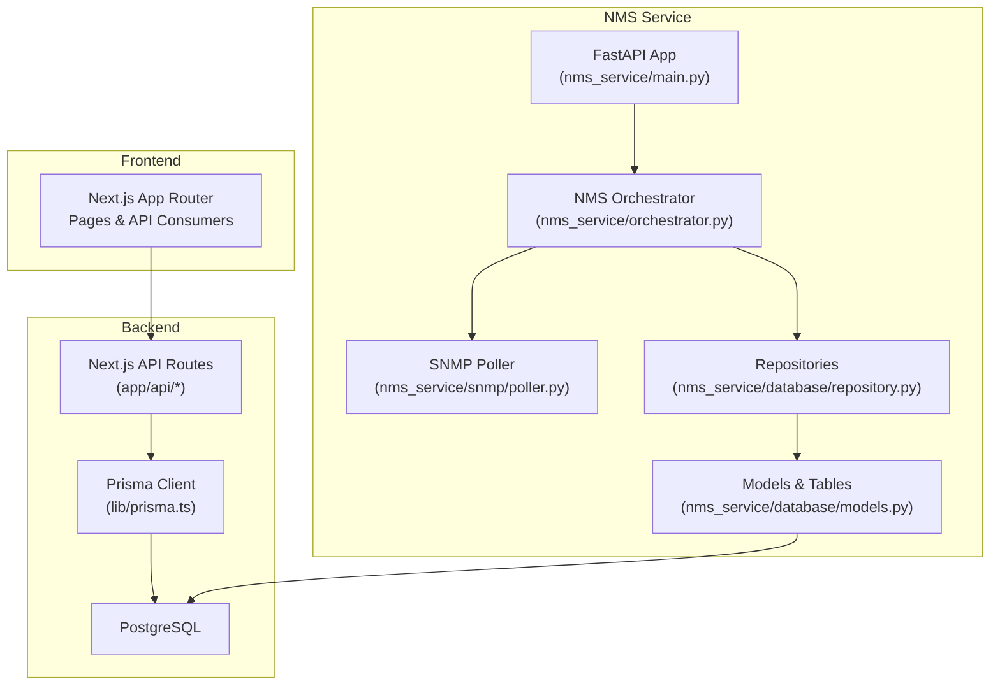
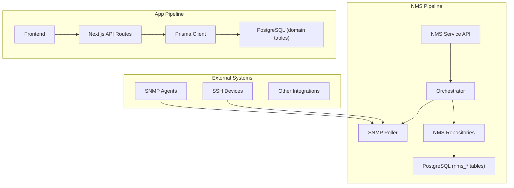
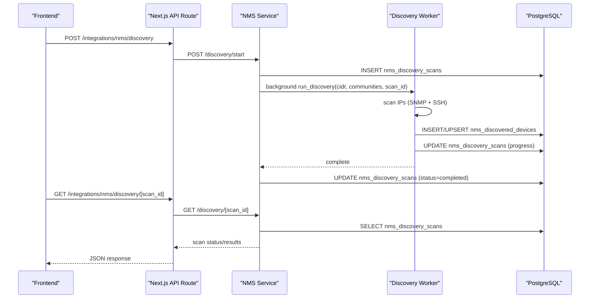
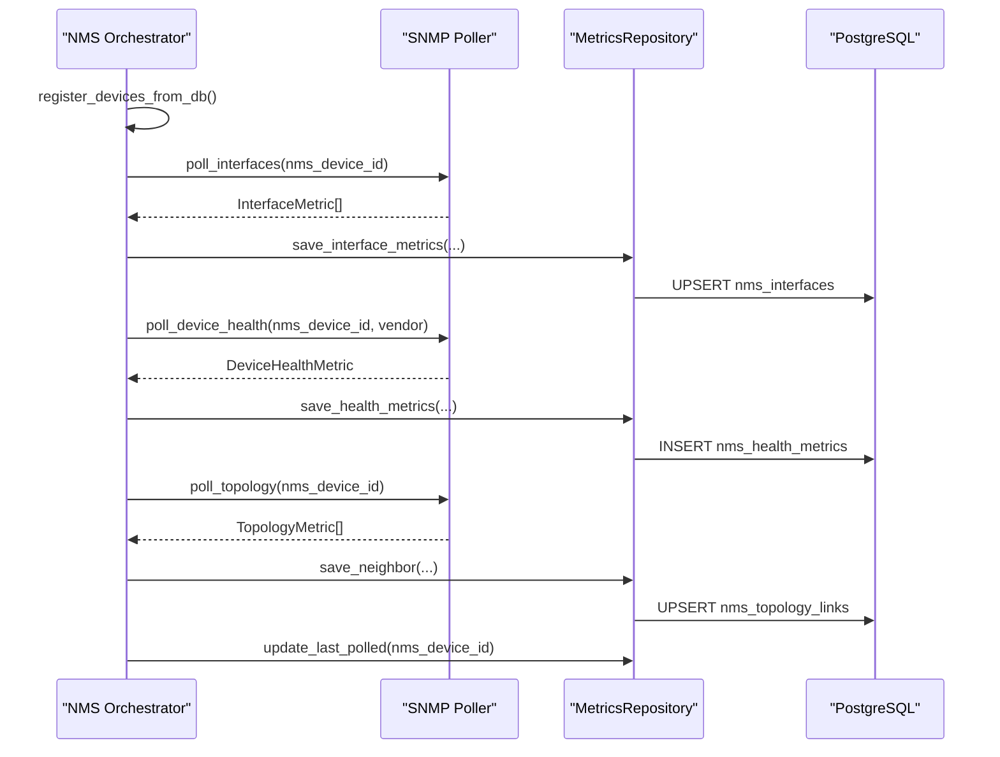
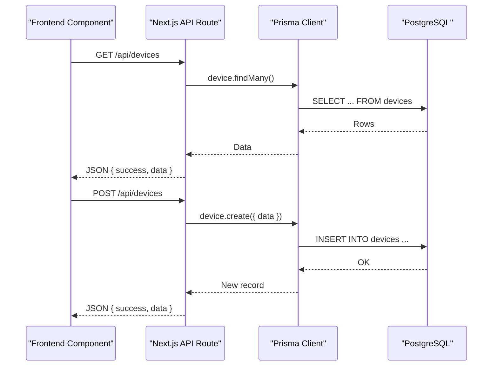
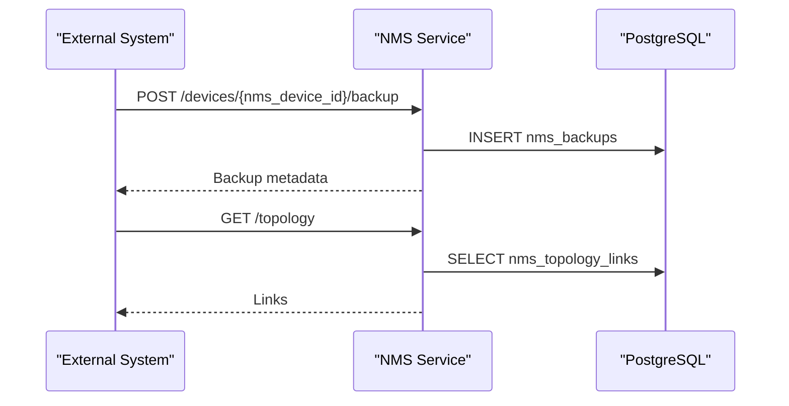
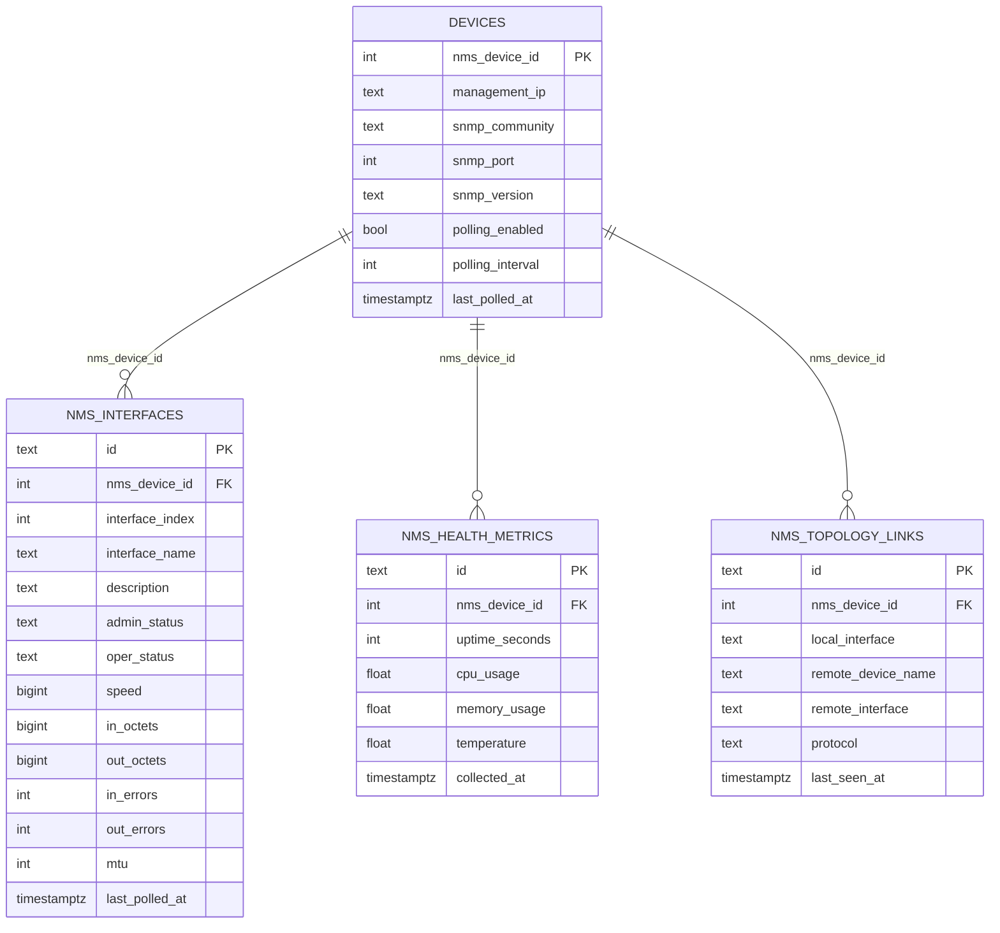

# Data Flow Architecture

<cite>
**Referenced Files in This Document**
- [README.md](file://README.md)
- [main.py](file://nms_service/main.py)
- [orchestrator.py](file://nms_service/orchestrator.py)
- [discovery_worker.py](file://nms_service/discovery_worker.py)
- [poller.py](file://nms_service/snmp/poller.py)
- [models.py](file://nms_service/database/models.py)
- [repository.py](file://nms_service/database/repository.py)
- [prisma.ts](file://lib/prisma.ts)
- [api.ts](file://lib/api.ts)
- [20260331134657_add_nms_integration/migration.sql](file://prisma/migrations/20260331134657_add_nms_integration/migration.sql)
- [20260413062959_add_nms_migration_tables/migration.sql](file://prisma/migrations/20260413062959_add_nms_migration_tables/migration.sql)
- [migrate_nms_db.sql](file://scripts/migrate_nms_db.sql)
</cite>

## Table of Contents
1. [Introduction](#introduction)
2. [Project Structure](#project-structure)
3. [Core Components](#core-components)
4. [Architecture Overview](#architecture-overview)
5. [Detailed Component Analysis](#detailed-component-analysis)
6. [Dependency Analysis](#dependency-analysis)
7. [Performance Considerations](#performance-considerations)
8. [Troubleshooting Guide](#troubleshooting-guide)
9. [Conclusion](#conclusion)

## Introduction
This document explains how data flows through the InfraScope system across three primary pathways:
- Device discovery: SNMP → NMS Service → Database → Frontend
- User interactions: Frontend → API Routes → Prisma → PostgreSQL
- Integration sync: External Systems → Integration Adapters → Database

It documents transformation stages, caching strategies, and real-time update mechanisms, and provides sequence diagrams for typical workflows and error handling patterns.

## Project Structure
The InfraScope stack comprises:
- Frontend (Next.js App Router) consuming a REST-like API
- Backend API routes delegating to Prisma for database operations
- NMS Service (Python/FastAPI) performing SNMP/SSH polling and discovery, writing directly to the same PostgreSQL database
- Shared PostgreSQL database with Prisma-managed schema and NMS-specific tables

**Diagram sources**
- [main.py:39-51](file://nms_service/main.py#L39-L51)
- [orchestrator.py:35-71](file://nms_service/orchestrator.py#L35-L71)
- [poller.py:63-76](file://nms_service/snmp/poller.py#L63-L76)
- [repository.py:28-63](file://nms_service/database/repository.py#L28-L63)
- [models.py:196-227](file://nms_service/database/models.py#L196-L227)
- [prisma.ts:10-20](file://lib/prisma.ts#L10-L20)

**Section sources**
- [README.md:114-172](file://README.md#L114-L172)

## Core Components
- NMS Service (internal-only HTTP API) exposes endpoints for:
  - Device polling (on-demand and periodic)
  - Discovery scans (start, progress, results)
  - Metrics retrieval (health, interfaces)
  - Topology retrieval
  - Backups (SSH-based)
- Orchestrator coordinates concurrent polling, dynamic intervals, and writes to nms_* tables
- Repositories encapsulate persistence for NMS tables and device metadata
- Frontend communicates with backend via API routes and a shared Prisma client
- Database schema includes both InfraScope domain tables and NMS integration tables

**Section sources**
- [main.py:91-470](file://nms_service/main.py#L91-L470)
- [orchestrator.py:35-461](file://nms_service/orchestrator.py#L35-L461)
- [repository.py:28-251](file://nms_service/database/repository.py#L28-L251)
- [prisma.ts:10-20](file://lib/prisma.ts#L10-L20)

## Architecture Overview
The system integrates two data pipelines:
- Internal NMS pipeline: SNMP/SSH → NMS Service → PostgreSQL (nms_* tables)
- Application pipeline: Frontend → Next.js API Routes → Prisma → PostgreSQL (domain tables)

**Diagram sources**
- [main.py:103-182](file://nms_service/main.py#L103-L182)
- [orchestrator.py:407-431](file://nms_service/orchestrator.py#L407-L431)
- [poller.py:132-224](file://nms_service/snmp/poller.py#L132-L224)
- [repository.py:65-200](file://nms_service/database/repository.py#L65-L200)
- [prisma.ts:10-20](file://lib/prisma.ts#L10-L20)

## Detailed Component Analysis

### Device Discovery Path (SNMP → NMS Service → Database → Frontend)
This pathway discovers devices in a CIDR range, stores results, and surfaces them to the frontend.

**Diagram sources**
- [main.py:328-404](file://nms_service/main.py#L328-L404)
- [discovery_worker.py:128-243](file://nms_service/discovery_worker.py#L128-L243)
- [20260331134657_add_nms_integration/migration.sql:251-281](file://prisma/migrations/20260331134657_add_nms_integration/migration.sql#L251-L281)

**Section sources**
- [main.py:328-404](file://nms_service/main.py#L328-L404)
- [discovery_worker.py:128-243](file://nms_service/discovery_worker.py#L128-L243)

### Periodic Polling Path (SNMP → NMS Service → Database)
The orchestrator periodically polls devices, saving interface states, health metrics, and topology links.

**Diagram sources**
- [orchestrator.py:98-150](file://nms_service/orchestrator.py#L98-L150)
- [poller.py:132-224](file://nms_service/snmp/poller.py#L132-L224)
- [repository.py:65-200](file://nms_service/database/repository.py#L65-L200)
- [models.py:68-144](file://nms_service/database/models.py#L68-L144)

**Section sources**
- [orchestrator.py:175-354](file://nms_service/orchestrator.py#L175-L354)
- [poller.py:63-592](file://nms_service/snmp/poller.py#L63-L592)
- [repository.py:65-200](file://nms_service/database/repository.py#L65-L200)

### Frontend Interaction Path (Frontend → API Routes → Prisma → PostgreSQL)
Frontend components call Next.js API routes that use Prisma to query or mutate domain data.

**Diagram sources**
- [api.ts:10-32](file://lib/api.ts#L10-L32)
- [prisma.ts:10-20](file://lib/prisma.ts#L10-L20)

**Section sources**
- [api.ts:10-32](file://lib/api.ts#L10-L32)
- [prisma.ts:10-20](file://lib/prisma.ts#L10-L20)

### Integration Sync Path (External Systems → Integration Adapters → Database)
External systems write to NMS tables via the NMS Service API or direct database integration. The NMS Service exposes endpoints for backups and topology retrieval, while the application reads from domain tables.

**Diagram sources**
- [main.py:186-270](file://nms_service/main.py#L186-L270)
- [main.py:446-470](file://nms_service/main.py#L446-L470)
- [20260413062959_add_nms_migration_tables/migration.sql:35-48](file://prisma/migrations/20260413062959_add_nms_migration_tables/migration.sql#L35-L48)

**Section sources**
- [main.py:186-270](file://nms_service/main.py#L186-L270)
- [main.py:446-470](file://nms_service/main.py#L446-L470)

### Data Transformation Stages
- SNMP parsing: OID walks and vendor-specific parsing produce normalized metrics (interfaces, health, inventory, topology)
- Upserts: Interface and topology records are upserted on composite keys to avoid duplication
- Time-series: Health metrics are appended as new rows; interface state is upserted with operational timestamps
- Vendor inference: Device vendor is inferred from device name or system description for OID selection

**Section sources**
- [poller.py:132-592](file://nms_service/snmp/poller.py#L132-L592)
- [repository.py:85-157](file://nms_service/database/repository.py#L85-L157)
- [repository.py:208-247](file://nms_service/database/repository.py#L208-L247)

### Caching Strategies
- Operational state tracking: Interface up/down transitions are tracked to distinguish transient vs. persistent outages
- Dynamic polling intervals: Intervals adapt based on last outcome (SNMP OK, SSH fallback, unstable)
- Jitter offsets: Deterministic per-device jitter spreads load across polling cycles
- Last polled timestamps: Used to enforce per-device throttling

**Section sources**
- [repository.py:116-131](file://nms_service/database/repository.py#L116-L131)
- [orchestrator.py:75-97](file://nms_service/orchestrator.py#L75-L97)
- [orchestrator.py:53-58](file://nms_service/orchestrator.py#L53-L58)

### Real-Time Update Mechanisms
- Frontend polling: Components call API routes to refresh data
- NMS Service health: Exposes a health endpoint indicating poller liveness and registered devices
- Discovery progress: Clients poll scan status and results endpoints until completion

**Section sources**
- [main.py:91-99](file://nms_service/main.py#L91-L99)
- [main.py:376-404](file://nms_service/main.py#L376-L404)

## Dependency Analysis
The NMS Service and application share the same PostgreSQL database. The NMS pipeline writes to nms_* tables, while the application writes to InfraScope domain tables. The NMS integer device ID serves as the bridge key between devices and nms_* tables.

**Diagram sources**
- [20260331134657_add_nms_integration/migration.sql:200-248](file://prisma/migrations/20260331134657_add_nms_integration/migration.sql#L200-L248)
- [models.py:43-144](file://nms_service/database/models.py#L43-L144)

**Section sources**
- [20260331134657_add_nms_integration/migration.sql:388-404](file://prisma/migrations/20260331134657_add_nms_integration/migration.sql#L388-L404)
- [models.py:43-144](file://nms_service/database/models.py#L43-L144)

## Performance Considerations
- Concurrency: The orchestrator uses a thread pool executor to poll devices concurrently while preventing duplicate polls for the same device
- Throttling: Per-device intervals and jitter reduce load spikes
- Upserts: Composite-key upserts minimize duplicate inserts and maintain consistency
- Indexing: Strategic indexes on foreign keys and time-series columns optimize reads/writes
- Query logging: Prisma client disables query logs by default to reduce I/O overhead

**Section sources**
- [orchestrator.py:355-406](file://nms_service/orchestrator.py#L355-L406)
- [repository.py:85-157](file://nms_service/database/repository.py#L85-L157)
- [prisma.ts:12-16](file://lib/prisma.ts#L12-L16)

## Troubleshooting Guide
Common issues and diagnostics:
- Database connectivity: Verify connection string and Prisma client initialization
- Polling failures: Check NMS Service health endpoint for poller status and registered devices
- Discovery timeouts: Discovery batches use timeouts; inspect scan progress and error messages
- SSH fallback: If SNMP fails, the orchestrator attempts SSH-based polling; verify SSH credentials and device reachability
- Upsert anomalies: Interface and topology upserts rely on composite keys; ensure nms_device_id alignment

**Section sources**
- [README.md:365-400](file://README.md#L365-L400)
- [main.py:91-99](file://nms_service/main.py#L91-L99)
- [discovery_worker.py:174-180](file://nms_service/discovery_worker.py#L174-L180)
- [repository.py:85-157](file://nms_service/database/repository.py#L85-L157)

## Conclusion
InfraScope’s data flow integrates an internal NMS pipeline with a shared PostgreSQL database and a separate application pipeline. The NMS Service performs SNMP/SSH polling and discovery, persisting normalized metrics and topology to nms_* tables. The application uses Prisma to manage domain entities. The system employs upserts, adaptive intervals, and strategic indexing to maintain performance and consistency, while the frontend consumes both pipelines via API routes.