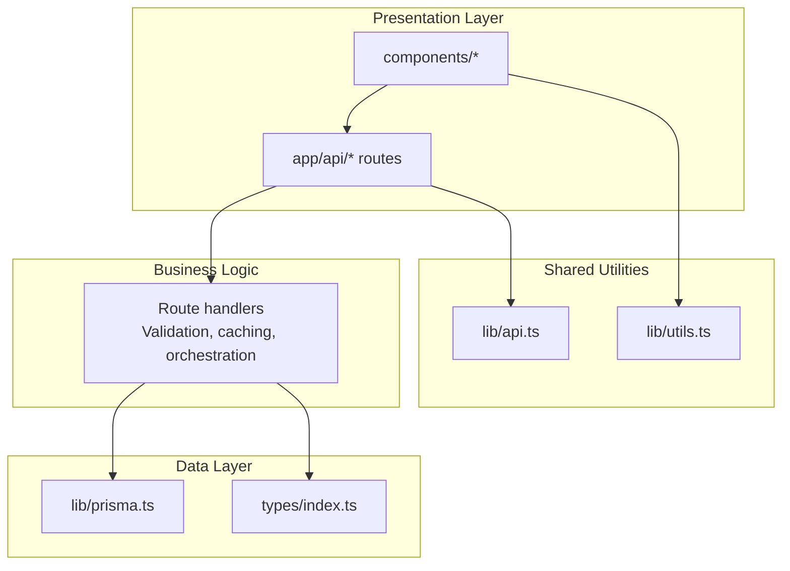
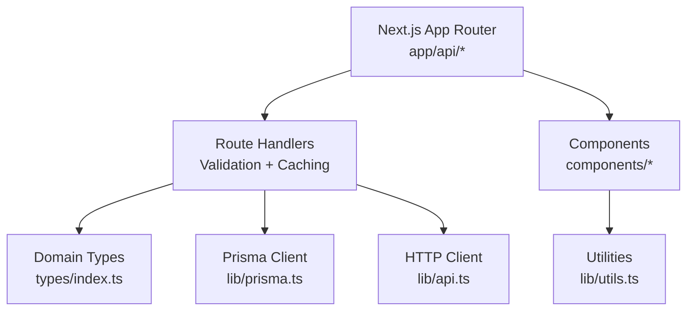
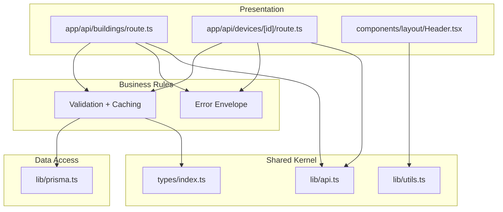
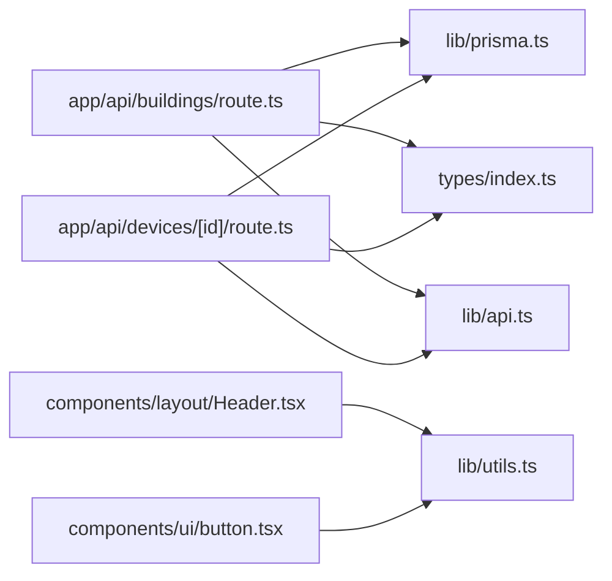

# Design Principles & Patterns

<cite>
**Referenced Files in This Document**
- [README.md](file://README.md)
- [CONSTITUTION.md](file://docs/00-product/CONSTITUTION.md)
- [docs README.md](file://docs/README.md)
- [tsconfig.json](file://tsconfig.json)
- [package.json](file://package.json)
- [next.config.js](file://next.config.js)
- [lib/prisma.ts](file://lib/prisma.ts)
- [lib/api.ts](file://lib/api.ts)
- [types/index.ts](file://types/index.ts)
- [app/api/buildings/route.ts](file://app/api/buildings/route.ts)
- [app/api/devices/[id]/route.ts](file://app/api/devices/[id]/route.ts)
- [components/layout/Header.tsx](file://components/layout/Header.tsx)
- [components/ui/button.tsx](file://components/ui/button.tsx)
- [lib/utils.ts](file://lib/utils.ts)
</cite>

## Table of Contents
1. [Introduction](#introduction)
2. [Project Structure](#project-structure)
3. [Core Components](#core-components)
4. [Architecture Overview](#architecture-overview)
5. [Detailed Component Analysis](#detailed-component-analysis)
6. [Dependency Analysis](#dependency-analysis)
7. [Performance Considerations](#performance-considerations)
8. [Troubleshooting Guide](#troubleshooting-guide)
9. [Conclusion](#conclusion)
10. [Appendices](#appendices)

## Introduction
This document explains the design principles and architectural patterns implemented in the codebase. It covers:
- SOLID principles: Single Responsibility, Open/Closed, Liskov Substitution, Interface Segregation, and Dependency Inversion
- Clean Architecture: separation of presentation, business logic, and data layers
- TypeScript strict mode usage and type safety
- DRY (Don’t Repeat Yourself) adherence
- Domain-driven design patterns reflected in type definitions and bounded contexts
- Code quality standards, naming conventions, and component organization
- Testability and maintainability patterns

## Project Structure
The project follows a modern Next.js App Router structure with clear separation of concerns:
- Presentation layer: app/ pages and API routes, components/
- Business logic: centralized in API route handlers and shared utilities
- Data layer: Prisma client in lib/prisma.ts, types in types/index.ts
- Shared utilities: lib/api.ts, lib/utils.ts
- Documentation anchors: docs/00-product/CONSTITUTION.md and docs/README.md

**Diagram sources**
- [app/api/buildings/route.ts:1-118](file://app/api/buildings/route.ts#L1-L118)
- [app/api/devices/[id]/route.ts](file://app/api/devices/[id]/route.ts#L1-L521)
- [lib/prisma.ts:1-21](file://lib/prisma.ts#L1-L21)
- [lib/api.ts:1-57](file://lib/api.ts#L1-L57)
- [lib/utils.ts:1-7](file://lib/utils.ts#L1-L7)
- [types/index.ts:1-312](file://types/index.ts#L1-L312)

**Section sources**
- [README.md:135-172](file://README.md#L135-L172)
- [docs/README.md:12-21](file://docs/README.md#L12-L21)

## Core Components
- TypeScript strict mode: enforced via tsconfig.json compiler options
- Centralized Prisma client singleton: ensures single connection and controlled logging
- Unified API client: standardized HTTP requests and error handling
- Strongly typed domain models: centralized in types/index.ts
- UI primitives with consistent variants: components/ui/button.tsx
- Shared utility functions: lib/utils.ts for class merging

Key implementation anchors:
- Strict mode and path aliases in tsconfig.json
- Singleton Prisma client in lib/prisma.ts
- API response envelope in lib/api.ts
- Domain types in types/index.ts
- UI button variants in components/ui/button.tsx
- Utility class merging in lib/utils.ts

**Section sources**
- [tsconfig.json:1-74](file://tsconfig.json#L1-L74)
- [lib/prisma.ts:1-21](file://lib/prisma.ts#L1-L21)
- [lib/api.ts:1-57](file://lib/api.ts#L1-L57)
- [types/index.ts:1-312](file://types/index.ts#L1-L312)
- [components/ui/button.tsx:1-57](file://components/ui/button.tsx#L1-L57)
- [lib/utils.ts:1-7](file://lib/utils.ts#L1-L7)

## Architecture Overview
Clean Architecture layers and boundaries:
- Presentation: Next.js app/ API routes and components/
- Business Rules: route handlers orchestrate validation, caching, and Prisma operations
- Data Access: lib/prisma.ts encapsulates database client and logging policy
- Shared Kernel: lib/api.ts, lib/utils.ts, types/index.ts

**Diagram sources**
- [app/api/buildings/route.ts:1-118](file://app/api/buildings/route.ts#L1-L118)
- [app/api/devices/[id]/route.ts](file://app/api/devices/[id]/route.ts#L1-L521)
- [lib/prisma.ts:1-21](file://lib/prisma.ts#L1-L21)
- [lib/api.ts:1-57](file://lib/api.ts#L1-L57)
- [types/index.ts:1-312](file://types/index.ts#L1-L312)
- [lib/utils.ts:1-7](file://lib/utils.ts#L1-L7)

**Section sources**
- [README.md:114-172](file://README.md#L114-L172)
- [docs/README.md:31-42](file://docs/README.md#L31-L42)

## Detailed Component Analysis

### SOLID Principles Implementation

#### Single Responsibility Principle (SRP)
- Route handlers encapsulate a single responsibility per endpoint (e.g., buildings listing and creation, device retrieval/update/deletion).
- Validation and error handling are co-located with the handler logic.
- Prisma client is a single source of truth for database operations.

Evidence:
- Buildings GET/POST handlers manage a single resource with focused logic and caching.
- Device endpoints validate inputs, enforce referential integrity, and return consistent envelopes.

**Section sources**
- [app/api/buildings/route.ts:9-79](file://app/api/buildings/route.ts#L9-L79)
- [app/api/devices/[id]/route.ts](file://app/api/devices/[id]/route.ts#L29-L141)
- [app/api/devices/[id]/route.ts](file://app/api/devices/[id]/route.ts#L146-L427)
- [app/api/devices/[id]/route.ts](file://app/api/devices/[id]/route.ts#L432-L520)
- [lib/prisma.ts:1-21](file://lib/prisma.ts#L1-L21)

#### Open/Closed Principle (OCP)
- Route handlers are open for extension (adding new endpoints) but closed for modification of existing behavior.
- Prisma client and API client abstractions isolate external dependencies behind stable interfaces.

Patterns:
- New endpoints can be added under app/api/ without changing existing handlers.
- Prisma client is configured centrally; changes to logging or connection policy are localized.

**Section sources**
- [app/api/buildings/route.ts:1-118](file://app/api/buildings/route.ts#L1-L118)
- [lib/prisma.ts:10-20](file://lib/prisma.ts#L10-L20)
- [lib/api.ts:1-57](file://lib/api.ts#L1-L57)

#### Liskov Substitution Principle (LSP)
- UI components accept props via consistent interfaces (e.g., ButtonProps) enabling substitution of variants and sizes without breaking consumers.
- Domain types define contracts for data exchange; consumers can rely on documented shapes.

Evidence:
- Button component exposes a variant/size contract via cva and props.
- Domain types define consistent shapes for entities and responses.

**Section sources**
- [components/ui/button.tsx:36-56](file://components/ui/button.tsx#L36-L56)
- [types/index.ts:299-311](file://types/index.ts#L299-L311)

#### Interface Segregation Principle (ISP)
- UI primitives expose small, cohesive interfaces (e.g., ButtonProps) allowing consumers to depend only on what they need.
- API client exports focused functions (GET/POST/PUT/DELETE) enabling selective usage.

Evidence:
- Button component defines a minimal set of props and variants.
- API client exposes separate functions for each HTTP verb.

**Section sources**
- [components/ui/button.tsx:36-56](file://components/ui/button.tsx#L36-L56)
- [lib/api.ts:10-56](file://lib/api.ts#L10-L56)

#### Dependency Inversion Principle (DIP)
- Route handlers depend on abstractions (Prisma client, API client) rather than concrete implementations.
- Centralized configuration (tsconfig.json) enforces strictness and path aliases, decoupling modules.

Evidence:
- Handlers import prisma from '@/lib/prisma' and use a unified client.
- UI components import utilities from '@/lib/utils' and variants from '@/components/ui'.

**Section sources**
- [app/api/buildings/route.ts:1-2](file://app/api/buildings/route.ts#L1-L2)
- [app/api/devices/[id]/route.ts](file://app/api/devices/[id]/route.ts#L8-L9)
- [lib/prisma.ts:1-21](file://lib/prisma.ts#L1-L21)
- [lib/api.ts:1-8](file://lib/api.ts#L1-L8)
- [lib/utils.ts:1-7](file://lib/utils.ts#L1-L7)

### Clean Architecture Implementation
- Presentation: app/api/* routes serve as HTTP endpoints; components/ provide UI.
- Business Rules: route handlers implement validation, caching, and orchestration.
- Data Access: lib/prisma.ts encapsulates Prisma client and logging policy.
- Shared Kernel: lib/api.ts, lib/utils.ts, types/index.ts.

**Diagram sources**
- [app/api/buildings/route.ts:1-118](file://app/api/buildings/route.ts#L1-L118)
- [app/api/devices/[id]/route.ts](file://app/api/devices/[id]/route.ts#L1-L521)
- [lib/prisma.ts:1-21](file://lib/prisma.ts#L1-L21)
- [types/index.ts:1-312](file://types/index.ts#L1-L312)
- [lib/api.ts:1-57](file://lib/api.ts#L1-L57)
- [lib/utils.ts:1-7](file://lib/utils.ts#L1-L7)
- [components/layout/Header.tsx:1-80](file://components/layout/Header.tsx#L1-L80)

**Section sources**
- [README.md:114-172](file://README.md#L114-L172)
- [docs/README.md:31-42](file://docs/README.md#L31-L42)

### TypeScript Strict Mode Usage
- Strict mode enabled with strictNullChecks, noImplicitAny, strictFunctionTypes, and other strict flags.
- Path aliases simplify imports and improve cohesion.
- Type-safe domain models centralize entity contracts.

**Section sources**
- [tsconfig.json:18-26](file://tsconfig.json#L18-L26)
- [tsconfig.json:29-51](file://tsconfig.json#L29-L51)
- [types/index.ts:1-312](file://types/index.ts#L1-L312)

### DRY Principle Adherence
- Centralized Prisma client prevents duplication of client instantiation.
- Unified API client provides consistent HTTP behavior and error handling.
- Shared utilities consolidate cross-cutting concerns like class merging.
- Domain types avoid duplication of entity shapes across modules.

**Section sources**
- [lib/prisma.ts:1-21](file://lib/prisma.ts#L1-L21)
- [lib/api.ts:1-57](file://lib/api.ts#L1-L57)
- [lib/utils.ts:1-7](file://lib/utils.ts#L1-L7)
- [types/index.ts:1-312](file://types/index.ts#L1-L312)

### Domain-Driven Design Patterns
- Rich domain models in types/index.ts define entities, enumerations, and response envelopes.
- Bounded contexts implied by docs/00-product/CONSTITUTION.md (alarms, integrations, topology, inventory, audit, security).
- API response envelope ensures consistent shape across endpoints.

**Section sources**
- [types/index.ts:1-312](file://types/index.ts#L1-L312)
- [docs/00-product/CONSTITUTION.md:68-79](file://docs/00-product/CONSTITUTION.md#L68-L79)
- [docs/README.md:31-53](file://docs/README.md#L31-L53)

### Code Quality Standards and Naming Conventions
- File naming: kebab-case for pages (e.g., app/api/buildings/route.ts), PascalCase for components (e.g., components/ui/Button.tsx).
- Module naming: feature-based organization under app/ and components/.
- Constants and enums: exported types for device types, statuses, and criticalities.
- Naming consistency: route.ts for endpoints, components/ui/* for primitives.

**Section sources**
- [app/api/buildings/route.ts:1-118](file://app/api/buildings/route.ts#L1-L118)
- [app/api/devices/[id]/route.ts](file://app/api/devices/[id]/route.ts#L1-L521)
- [components/ui/button.tsx:1-57](file://components/ui/button.tsx#L1-L57)
- [types/index.ts:98-108](file://types/index.ts#L98-L108)

### Component Organization Principles
- UI primitives under components/ui with variant-driven design.
- Layout components under components/layout.
- Shared utilities under lib/.

**Section sources**
- [components/ui/button.tsx:1-57](file://components/ui/button.tsx#L1-L57)
- [components/layout/Header.tsx:1-80](file://components/layout/Header.tsx#L1-L80)
- [lib/utils.ts:1-7](file://lib/utils.ts#L1-L7)

### Testability Considerations
- Route handlers are synchronous functions suitable for unit testing with mocked dependencies.
- Centralized Prisma client enables easy mocking for tests.
- API client functions can be stubbed for isolated testing.
- Strong types reduce runtime errors and improve test reliability.

**Section sources**
- [app/api/buildings/route.ts:1-118](file://app/api/buildings/route.ts#L1-L118)
- [app/api/devices/[id]/route.ts](file://app/api/devices/[id]/route.ts#L1-L521)
- [lib/prisma.ts:1-21](file://lib/prisma.ts#L1-L21)
- [lib/api.ts:1-57](file://lib/api.ts#L1-L57)

### Maintainability Patterns
- Centralized configuration via tsconfig.json and next.config.js.
- Consistent API response envelope improves consumer ergonomics.
- Bounded context documentation anchors guide future changes.

**Section sources**
- [tsconfig.json:1-74](file://tsconfig.json#L1-L74)
- [next.config.js:1-62](file://next.config.js#L1-L62)
- [docs/README.md:31-53](file://docs/README.md#L31-L53)

## Dependency Analysis
- Route handlers depend on lib/prisma.ts for persistence and types/index.ts for domain contracts.
- UI components depend on lib/utils.ts for class merging and components/ui/* for primitives.
- API routes depend on lib/api.ts for internal HTTP calls.

**Diagram sources**
- [app/api/buildings/route.ts:1-2](file://app/api/buildings/route.ts#L1-L2)
- [app/api/devices/[id]/route.ts](file://app/api/devices/[id]/route.ts#L8-L9)
- [lib/prisma.ts:1-21](file://lib/prisma.ts#L1-L21)
- [types/index.ts:1-312](file://types/index.ts#L1-L312)
- [lib/api.ts:1-57](file://lib/api.ts#L1-L57)
- [components/layout/Header.tsx:16-16](file://components/layout/Header.tsx#L16-L16)
- [components/ui/button.tsx:5-5](file://components/ui/button.tsx#L5-L5)

**Section sources**
- [app/api/buildings/route.ts:1-118](file://app/api/buildings/route.ts#L1-L118)
- [app/api/devices/[id]/route.ts](file://app/api/devices/[id]/route.ts#L1-L521)
- [lib/prisma.ts:1-21](file://lib/prisma.ts#L1-L21)
- [lib/api.ts:1-57](file://lib/api.ts#L1-L57)
- [lib/utils.ts:1-7](file://lib/utils.ts#L1-L7)
- [types/index.ts:1-312](file://types/index.ts#L1-L312)

## Performance Considerations
- Caching strategy: in-memory cache with TTL in buildings endpoint reduces database load.
- Selective includes: optimized queries avoid unnecessary nested relations.
- Static asset caching: aggressive cache headers for images and selected API routes.
- Bundle optimization: Turbosnap, SWC minification, and package import optimization.

**Section sources**
- [app/api/buildings/route.ts:4-7](file://app/api/buildings/route.ts#L4-L7)
- [app/api/buildings/route.ts:22-59](file://app/api/buildings/route.ts#L22-L59)
- [next.config.js:19-47](file://next.config.js#L19-L47)

## Troubleshooting Guide
- Type errors: run type-check script and review strict mode violations.
- API failures: inspect unified error envelope returned by lib/api.ts.
- Database connectivity: verify Prisma client initialization and environment variables.
- Route-specific issues: check validation and error responses in route handlers.

**Section sources**
- [package.json:10-10](file://package.json#L10-L10)
- [lib/api.ts:14-31](file://lib/api.ts#L14-L31)
- [lib/prisma.ts:10-20](file://lib/prisma.ts#L10-L20)
- [app/api/buildings/route.ts:71-78](file://app/api/buildings/route.ts#L71-L78)
- [app/api/devices/[id]/route.ts](file://app/api/devices/[id]/route.ts#L130-L140)

## Conclusion
The codebase demonstrates strong adherence to SOLID principles, Clean Architecture boundaries, and TypeScript strictness. Centralized abstractions (Prisma client, API client, utilities, and domain types) enable maintainability and testability while enforcing consistent patterns across the presentation, business, and data layers.

## Appendices

### API Response Envelope Pattern
All endpoints return a consistent envelope ensuring uniform consumption across clients.

**Section sources**
- [README.md:288-307](file://README.md#L288-L307)
- [app/api/buildings/route.ts:65-70](file://app/api/buildings/route.ts#L65-L70)
- [app/api/devices/[id]/route.ts](file://app/api/devices/[id]/route.ts#L122-L129)