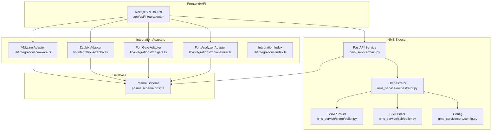
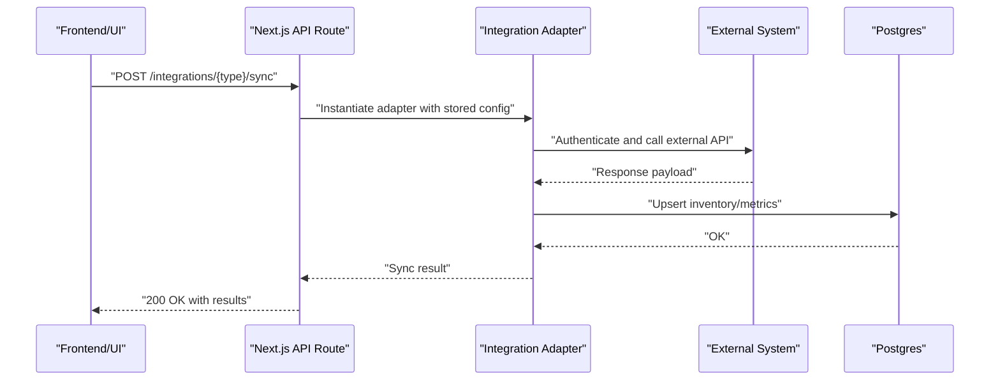
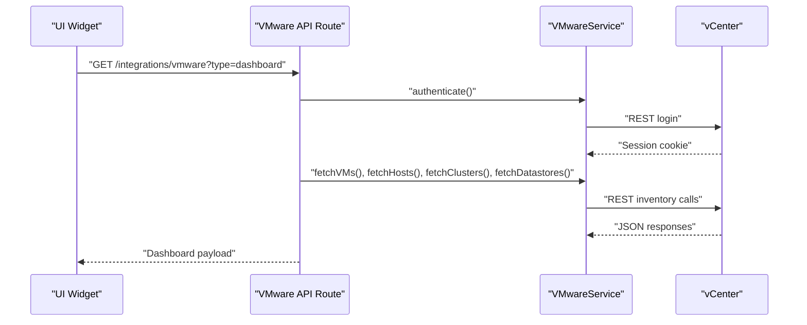
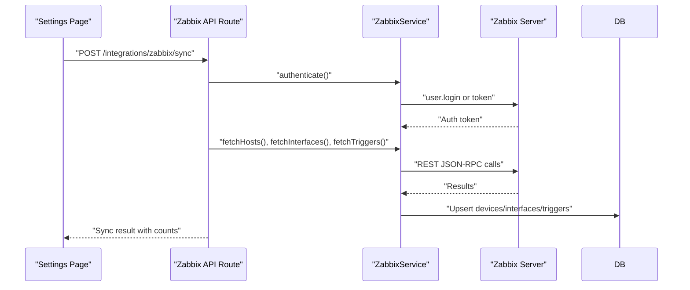
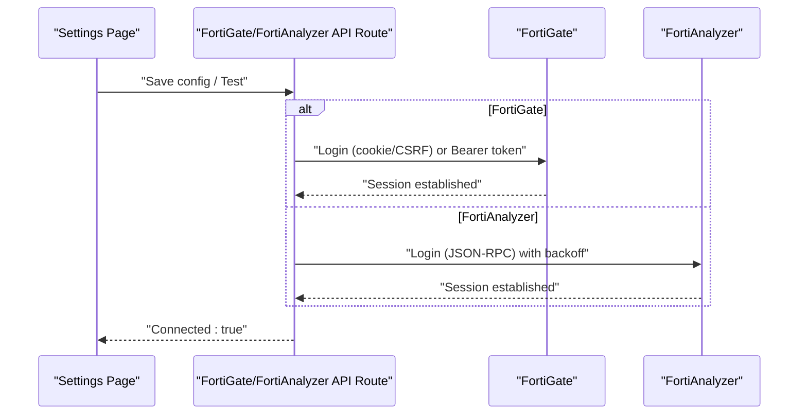
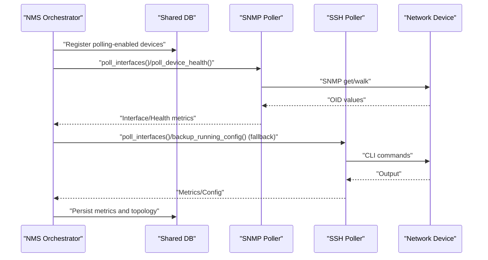
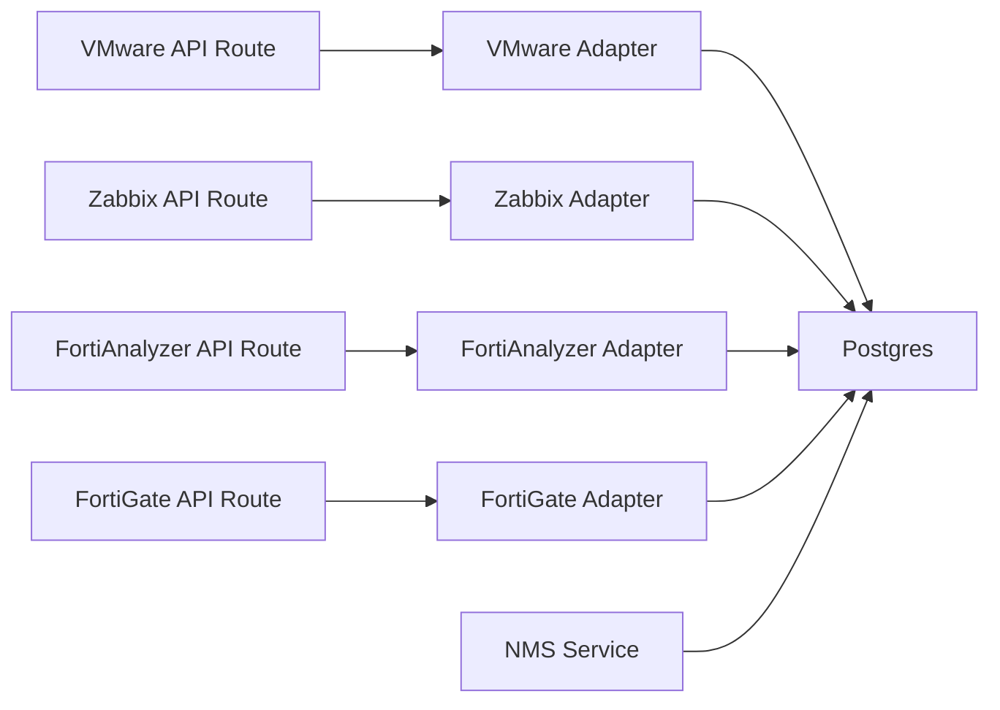

# Integration Patterns

<cite>
**Referenced Files in This Document**
- [route.ts](file://app/api/integrations/vmware/route.ts)
- [route.ts](file://app/api/integrations/zabbix/route.ts)
- [route.ts](file://app/api/integrations/nms/route.ts)
- [route.ts](file://app/api/integrations/status/route.ts)
- [index.ts](file://lib/integrations/index.ts)
- [vmware.ts](file://lib/integrations/vmware.ts)
- [zabbix.ts](file://lib/integrations/zabbix.ts)
- [fortigate.ts](file://lib/integrations/fortigate.ts)
- [fortianalyzer.ts](file://lib/integrations/fortianalyzer.ts)
- [fa-circuit-breaker.ts](file://lib/integrations/fa-circuit-breaker.ts)
- [main.py](file://nms_service/main.py)
- [orchestrator.py](file://nms_service/orchestrator.py)
- [config.py](file://nms_service/core/config.py)
- [poller.py](file://nms_service/snmp/poller.py)
- [poller.py](file://nms_service/ssh/poller.py)
- [schema.prisma](file://prisma/schema.prisma)
</cite>

## Table of Contents
1. [Introduction](#introduction)
2. [Project Structure](#project-structure)
3. [Core Components](#core-components)
4. [Architecture Overview](#architecture-overview)
5. [Detailed Component Analysis](#detailed-component-analysis)
6. [Dependency Analysis](#dependency-analysis)
7. [Performance Considerations](#performance-considerations)
8. [Troubleshooting Guide](#troubleshooting-guide)
9. [Conclusion](#conclusion)

## Introduction
This document describes integration patterns and external system connectivity in the platform. It covers the plugin architecture for VMware vCenter, Zabbix monitoring, Fortinet firewalls (FortiGate and FortiAnalyzer), and device discovery services. It explains integration adapter patterns, real-time synchronization mechanisms, authentication and authorization strategies, rate limiting and resilience approaches, and monitoring integration health. The goal is to help developers implement, configure, and troubleshoot integrations effectively.

## Project Structure
The integration surface is organized around:
- API routes that expose integration endpoints and orchestrate sync operations
- Integration adapters that encapsulate external API clients and mapping logic
- An NMS (Network Monitoring Service) sidecar that performs SNMP/SSH polling and discovery
- A shared Postgres database schema that stores integration configurations, sync logs, and synchronized inventory

**Diagram sources**
- [route.ts](file://app/api/integrations/vmware/route.ts)
- [vmware.ts](file://lib/integrations/vmware.ts)
- [zabbix.ts](file://lib/integrations/zabbix.ts)
- [fortigate.ts](file://lib/integrations/fortigate.ts)
- [fortianalyzer.ts](file://lib/integrations/fortianalyzer.ts)
- [main.py](file://nms_service/main.py)
- [orchestrator.py](file://nms_service/orchestrator.py)
- [poller.py](file://nms_service/snmp/poller.py)
- [poller.py](file://nms_service/ssh/poller.py)
- [config.py](file://nms_service/core/config.py)
- [schema.prisma](file://prisma/schema.prisma)

**Section sources**
- [route.ts](file://app/api/integrations/vmware/route.ts)
- [route.ts](file://app/api/integrations/zabbix/route.ts)
- [route.ts](file://app/api/integrations/nms/route.ts)
- [route.ts](file://app/api/integrations/status/route.ts)
- [index.ts](file://lib/integrations/index.ts)
- [vmware.ts](file://lib/integrations/vmware.ts)
- [zabbix.ts](file://lib/integrations/zabbix.ts)
- [fortigate.ts](file://lib/integrations/fortigate.ts)
- [fortianalyzer.ts](file://lib/integrations/fortianalyzer.ts)
- [fa-circuit-breaker.ts](file://lib/integrations/fa-circuit-breaker.ts)
- [main.py](file://nms_service/main.py)
- [orchestrator.py](file://nms_service/orchestrator.py)
- [config.py](file://nms_service/core/config.py)
- [poller.py](file://nms_service/snmp/poller.py)
- [poller.py](file://nms_service/ssh/poller.py)
- [schema.prisma](file://prisma/schema.prisma)

## Core Components
- Integration adapters encapsulate external API clients and mapping logic:
  - VMware vCenter adapter supports authentication, inventory retrieval, event querying, and capacity forecasting
  - Zabbix adapter supports authentication, host/interface/trigger sync, and status reporting
  - FortiGate adapter supports REST API-based inventory sync and status retrieval
  - FortiAnalyzer adapter supports session management, device enumeration, and log search with retry/backoff
- API routes orchestrate integration operations, manage configuration, and expose health/status
- NMS sidecar performs continuous SNMP/SSH polling, discovery scanning, and topology collection against shared database
- Database schema defines integration configuration, sync logs, and synchronized inventory entities

**Section sources**
- [index.ts](file://lib/integrations/index.ts)
- [vmware.ts](file://lib/integrations/vmware.ts)
- [zabbix.ts](file://lib/integrations/zabbix.ts)
- [fortigate.ts](file://lib/integrations/fortigate.ts)
- [fortianalyzer.ts](file://lib/integrations/fortianalyzer.ts)
- [route.ts](file://app/api/integrations/vmware/route.ts)
- [route.ts](file://app/api/integrations/zabbix/route.ts)
- [route.ts](file://app/api/integrations/nms/route.ts)
- [route.ts](file://app/api/integrations/status/route.ts)
- [main.py](file://nms_service/main.py)
- [schema.prisma](file://prisma/schema.prisma)

## Architecture Overview
The integration architecture combines:
- HTTP-based adapters for cloud and monitoring systems (VMware, Zabbix)
- REST/JSON-RPC adapters for Fortinet systems (FortiGate, FortiAnalyzer)
- An internal NMS sidecar that polls devices via SNMP and SSH and writes metrics to the shared database
- Frontend/API routes that coordinate syncs, validate configurations, and surface health

**Diagram sources**
- [route.ts](file://app/api/integrations/vmware/route.ts)
- [route.ts](file://app/api/integrations/zabbix/route.ts)
- [vmware.ts](file://lib/integrations/vmware.ts)
- [zabbix.ts](file://lib/integrations/zabbix.ts)
- [schema.prisma](file://prisma/schema.prisma)

## Detailed Component Analysis

### VMware vCenter Integration
- Authentication and API selection:
  - REST API for modern vCenter versions and SOAP for event APIs
  - Automatic session refresh on 401 Unauthorized
- Inventory and event capabilities:
  - Datacenter, cluster, host, VM, datastore discovery
  - Snapshot listing and lifecycle events
  - Capacity forecasting and trend analysis
- Caching strategy:
  - In-process cache with stale-while-revalidate semantics for dashboard and inventory endpoints
- API routes:
  - GET endpoints for inventory and dashboard summaries
  - POST endpoints for sync, test, and power/snapshot operations
  - Event testing endpoints for SOAP and REST event APIs

**Diagram sources**
- [route.ts](file://app/api/integrations/vmware/route.ts)
- [vmware.ts](file://lib/integrations/vmware.ts)

**Section sources**
- [route.ts](file://app/api/integrations/vmware/route.ts)
- [vmware.ts](file://lib/integrations/vmware.ts)

### Zabbix Integration
- Authentication and sync:
  - Token-based authentication and user.login fallback
  - Host, interface, and trigger synchronization with mapping to inventory
- API routes:
  - GET status endpoint
  - POST sync endpoint with organization scoping and sync logging
  - POST save-config endpoint for ephemeral tests

**Diagram sources**
- [route.ts](file://app/api/integrations/zabbix/route.ts)
- [zabbix.ts](file://lib/integrations/zabbix.ts)
- [schema.prisma](file://prisma/schema.prisma)

**Section sources**
- [route.ts](file://app/api/integrations/zabbix/route.ts)
- [zabbix.ts](file://lib/integrations/zabbix.ts)
- [schema.prisma](file://prisma/schema.prisma)

### Fortinet Integrations (FortiGate and FortiAnalyzer)
- FortiGate:
  - REST API with cookie and CSRF token handling
  - Interface/VLAN/policy/address sync with inventory mapping
- FortiAnalyzer:
  - JSON-RPC session management with global state and backoff
  - Device enumeration, log search with retry/backoff, and circuit breaker protection

**Diagram sources**
- [route.ts](file://app/api/integrations/vmware/route.ts)
- [fortigate.ts](file://lib/integrations/fortigate.ts)
- [fortianalyzer.ts](file://lib/integrations/fortianalyzer.ts)
- [fa-circuit-breaker.ts](file://lib/integrations/fa-circuit-breaker.ts)

**Section sources**
- [fortigate.ts](file://lib/integrations/fortigate.ts)
- [fortianalyzer.ts](file://lib/integrations/fortianalyzer.ts)
- [fa-circuit-breaker.ts](file://lib/integrations/fa-circuit-breaker.ts)

### NMS Sidecar (SNMP/SSH Polling and Discovery)
- Orchestrator:
  - Registers polling-enabled devices from the shared database
  - Concurrent polling via thread pool with per-device throttling and dynamic intervals
  - SNMP and SSH fallback with vendor-specific OIDs and commands
- Discovery worker:
  - Async CIDR scanning with parallel threads and batched persistence
- FastAPI service:
  - Internal endpoints for device lists, on-demand polls, backups, metrics, and discovery status

**Diagram sources**
- [orchestrator.py](file://nms_service/orchestrator.py)
- [poller.py](file://nms_service/snmp/poller.py)
- [poller.py](file://nms_service/ssh/poller.py)
- [main.py](file://nms_service/main.py)
- [config.py](file://nms_service/core/config.py)

**Section sources**
- [orchestrator.py](file://nms_service/orchestrator.py)
- [poller.py](file://nms_service/snmp/poller.py)
- [poller.py](file://nms_service/ssh/poller.py)
- [main.py](file://nms_service/main.py)
- [config.py](file://nms_service/core/config.py)

### Integration Adapter Patterns
- Configuration-driven adapters:
  - Each adapter reads encrypted credentials from the shared database and applies module toggles
- Authentication abstractions:
  - REST with Basic/Bearer tokens, cookie/CSRF for FortiGate, JSON-RPC with session caching for FortiAnalyzer
- Mapping and upsert logic:
  - Map external identifiers to internal models and upsert records to maintain consistency
- Health and status:
  - Dedicated status endpoints report connectivity and version information

**Section sources**
- [index.ts](file://lib/integrations/index.ts)
- [vmware.ts](file://lib/integrations/vmware.ts)
- [zabbix.ts](file://lib/integrations/zabbix.ts)
- [fortigate.ts](file://lib/integrations/fortigate.ts)
- [fortianalyzer.ts](file://lib/integrations/fortianalyzer.ts)

### Real-Time Synchronization Mechanisms
- VMware:
  - REST-based inventory retrieval with caching and background warming
  - Event APIs for lifecycle and snapshot events
- Zabbix:
  - Periodic sync with selective modules (hosts, interfaces, triggers)
- NMS:
  - Continuous polling loop with dynamic intervals and per-device jitter
  - On-demand polling and backups via FastAPI endpoints

**Section sources**
- [route.ts](file://app/api/integrations/vmware/route.ts)
- [route.ts](file://app/api/integrations/zabbix/route.ts)
- [main.py](file://nms_service/main.py)
- [orchestrator.py](file://nms_service/orchestrator.py)

### Authentication and Authorization Patterns
- VMware:
  - REST Basic and legacy REST session endpoints
  - SOAP session cookie for event APIs
- Zabbix:
  - JSON-RPC user.login or Bearer token
- FortiGate:
  - Cookie/CSRF session for REST API
  - Bearer token fallback
- FortiAnalyzer:
  - JSON-RPC login with session caching and backoff
  - Circuit breaker to prevent cascading failures

**Section sources**
- [vmware.ts](file://lib/integrations/vmware.ts)
- [zabbix.ts](file://lib/integrations/zabbix.ts)
- [fortigate.ts](file://lib/integrations/fortigate.ts)
- [fortianalyzer.ts](file://lib/integrations/fortianalyzer.ts)
- [fa-circuit-breaker.ts](file://lib/integrations/fa-circuit-breaker.ts)

### Rate Limiting and Resilience Strategies
- FortiAnalyzer:
  - Retry with exponential backoff and jitter for transient failures
  - Circuit breaker to temporarily block requests when failures exceed threshold
- NMS:
  - Per-device dynamic polling intervals and jitter to avoid thundering herds
  - Concurrency limits for SNMP and SSH sessions
- VMware:
  - Session auto-refresh on 401 Unauthorized
  - Caching with stale-while-revalidate to reduce load

**Section sources**
- [fa-circuit-breaker.ts](file://lib/integrations/fa-circuit-breaker.ts)
- [fortianalyzer.ts](file://lib/integrations/fortianalyzer.ts)
- [orchestrator.py](file://nms_service/orchestrator.py)
- [poller.py](file://nms_service/snmp/poller.py)
- [poller.py](file://nms_service/ssh/poller.py)
- [vmware.ts](file://lib/integrations/vmware.ts)

### Error Recovery Procedures
- FortiAnalyzer:
  - Invalidate session on specific error codes and apply backoff
  - Circuit breaker transitions to OPEN/HALF_OPEN states
- NMS:
  - SNMP/SSH fallback when primary method fails
  - Graceful shutdown releasing sessions and database connections
- General:
  - Sync logs capture errors and counts for auditability

**Section sources**
- [fortianalyzer.ts](file://lib/integrations/fortianalyzer.ts)
- [fa-circuit-breaker.ts](file://lib/integrations/fa-circuit-breaker.ts)
- [orchestrator.py](file://nms_service/orchestrator.py)
- [schema.prisma](file://prisma/schema.prisma)

### Examples of Integration Implementation
- VMware:
  - Route: [route.ts](file://app/api/integrations/vmware/route.ts)
  - Adapter: [vmware.ts](file://lib/integrations/vmware.ts)
- Zabbix:
  - Route: [route.ts](file://app/api/integrations/zabbix/route.ts)
  - Adapter: [zabbix.ts](file://lib/integrations/zabbix.ts)
- FortiGate:
  - Adapter: [fortigate.ts](file://lib/integrations/fortigate.ts)
- FortiAnalyzer:
  - Adapter: [fortianalyzer.ts](file://lib/integrations/fortianalyzer.ts)
  - Circuit breaker: [fa-circuit-breaker.ts](file://lib/integrations/fa-circuit-breaker.ts)
- NMS:
  - Service: [main.py](file://nms_service/main.py)
  - Orchestrator: [orchestrator.py](file://nms_service/orchestrator.py)
  - SNMP Poller: [poller.py](file://nms_service/snmp/poller.py)
  - SSH Poller: [poller.py](file://nms_service/ssh/poller.py)
  - Config: [config.py](file://nms_service/core/config.py)

**Section sources**
- [route.ts](file://app/api/integrations/vmware/route.ts)
- [route.ts](file://app/api/integrations/zabbix/route.ts)
- [vmware.ts](file://lib/integrations/vmware.ts)
- [zabbix.ts](file://lib/integrations/zabbix.ts)
- [fortigate.ts](file://lib/integrations/fortigate.ts)
- [fortianalyzer.ts](file://lib/integrations/fortianalyzer.ts)
- [fa-circuit-breaker.ts](file://lib/integrations/fa-circuit-breaker.ts)
- [main.py](file://nms_service/main.py)
- [orchestrator.py](file://nms_service/orchestrator.py)
- [poller.py](file://nms_service/snmp/poller.py)
- [poller.py](file://nms_service/ssh/poller.py)
- [config.py](file://nms_service/core/config.py)

### Configuration Management
- Stored in the shared database under IntegrationConfig
- Fields include type, name, enabled flag, encrypted config, sync interval, and last sync metadata
- API routes support saving, testing, and triggering syncs

**Section sources**
- [schema.prisma](file://prisma/schema.prisma)
- [route.ts](file://app/api/integrations/zabbix/route.ts)
- [route.ts](file://app/api/integrations/vmware/route.ts)

### Monitoring Integration Health
- Integration status dashboard aggregates connectivity, last sync, and health scores
- NMS status endpoint surfaces service health, polling device counts, and recent metrics
- Sync logs track success, partial, and failure outcomes

**Section sources**
- [route.ts](file://app/api/integrations/status/route.ts)
- [route.ts](file://app/api/integrations/nms/route.ts)
- [schema.prisma](file://prisma/schema.prisma)

## Dependency Analysis
The integration layer exhibits clear separation of concerns:
- API routes depend on integration adapters and the shared database
- Adapters encapsulate external system specifics and mapping logic
- NMS sidecar operates independently and writes to the shared database
- Shared Prisma schema defines cross-cutting entities for inventory and logs

**Diagram sources**
- [route.ts](file://app/api/integrations/vmware/route.ts)
- [route.ts](file://app/api/integrations/zabbix/route.ts)
- [vmware.ts](file://lib/integrations/vmware.ts)
- [zabbix.ts](file://lib/integrations/zabbix.ts)
- [fortigate.ts](file://lib/integrations/fortigate.ts)
- [fortianalyzer.ts](file://lib/integrations/fortianalyzer.ts)
- [main.py](file://nms_service/main.py)
- [schema.prisma](file://prisma/schema.prisma)

**Section sources**
- [route.ts](file://app/api/integrations/vmware/route.ts)
- [route.ts](file://app/api/integrations/zabbix/route.ts)
- [vmware.ts](file://lib/integrations/vmware.ts)
- [zabbix.ts](file://lib/integrations/zabbix.ts)
- [fortigate.ts](file://lib/integrations/fortigate.ts)
- [fortianalyzer.ts](file://lib/integrations/fortianalyzer.ts)
- [main.py](file://nms_service/main.py)
- [schema.prisma](file://prisma/schema.prisma)

## Performance Considerations
- Caching:
  - VMware routes implement in-process cache with stale-while-revalidate to reduce latency and external load
- Concurrency:
  - NMS orchestrator uses a thread pool and per-device jitter to balance throughput and device responsiveness
- Backoff and retries:
  - FortiAnalyzer uses exponential backoff and jitter to avoid overwhelming the system and to recover gracefully
- Polling intervals:
  - Dynamic intervals based on device status to optimize resource usage

[No sources needed since this section provides general guidance]

## Troubleshooting Guide
- Authentication failures:
  - Verify credentials and token validity in IntegrationConfig
  - Check adapter-specific auth flows (REST, cookie/CSRF, JSON-RPC)
- Session expiration:
  - FortiGate: ensure session cookie and CSRF token are refreshed
  - FortiAnalyzer: review circuit breaker state and backoff windows
- External connectivity:
  - VMware: confirm vCenter endpoints and certificate thumbprints
  - Zabbix: validate API URL and authentication method
- NMS polling:
  - Confirm device registration, SNMP/SSH credentials, and concurrency limits
  - Review sync logs for detailed error messages

**Section sources**
- [schema.prisma](file://prisma/schema.prisma)
- [fa-circuit-breaker.ts](file://lib/integrations/fa-circuit-breaker.ts)
- [fortianalyzer.ts](file://lib/integrations/fortianalyzer.ts)
- [fortigate.ts](file://lib/integrations/fortigate.ts)
- [vmware.ts](file://lib/integrations/vmware.ts)
- [zabbix.ts](file://lib/integrations/zabbix.ts)
- [orchestrator.py](file://nms_service/orchestrator.py)

## Conclusion
The platform implements robust integration patterns with dedicated adapters for VMware, Zabbix, Fortinet systems, and an NMS sidecar for device discovery and telemetry. The design emphasizes resilient authentication, configurable sync, health monitoring, and efficient resource usage through caching, concurrency controls, and backoff strategies. The shared database schema enables consistent inventory and auditability across integrations.