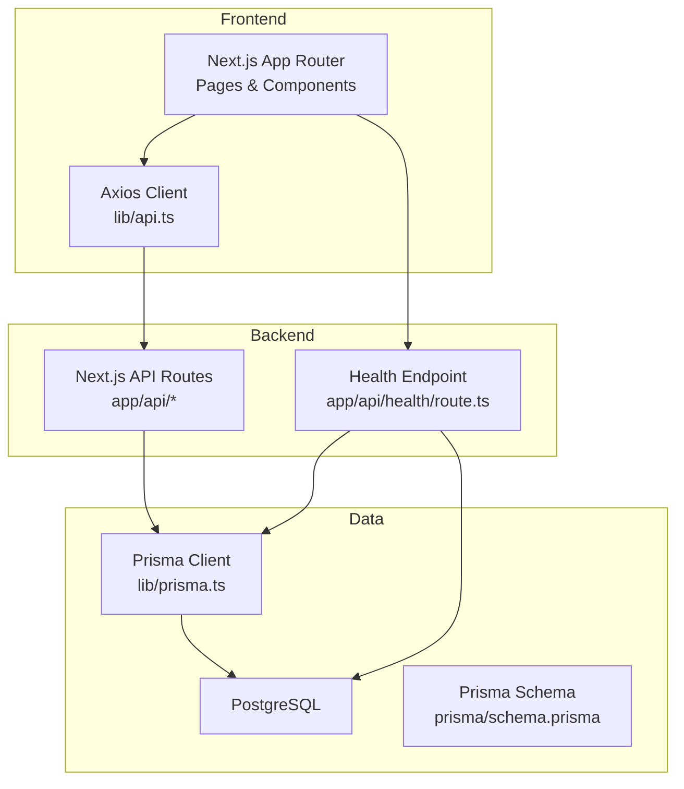
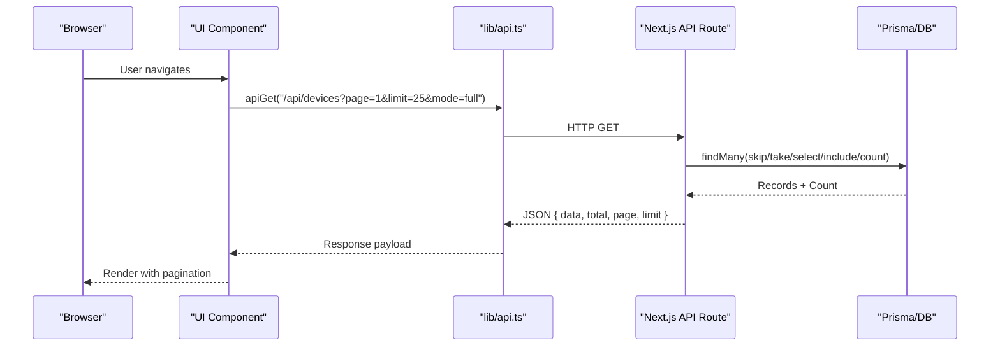
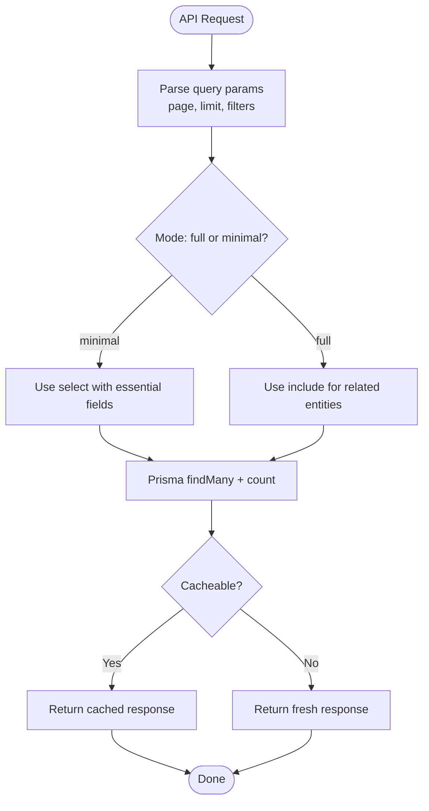
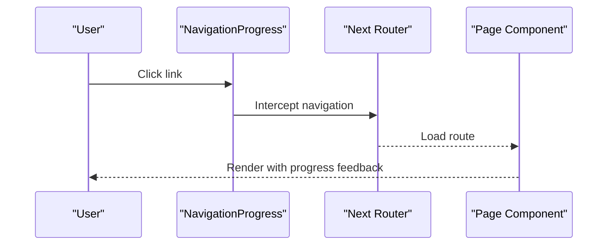
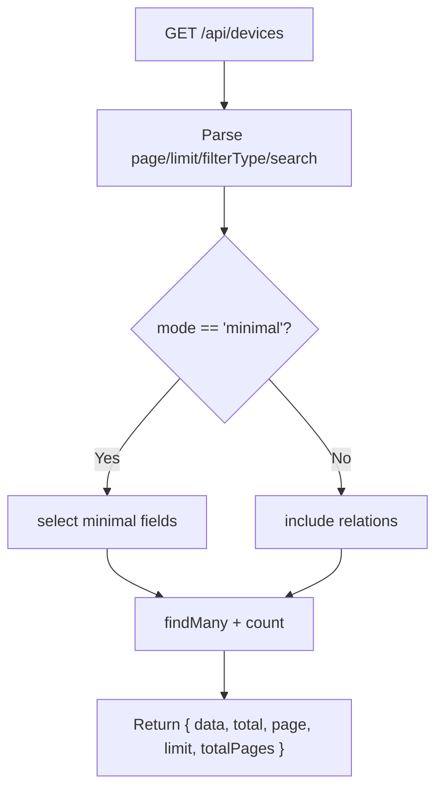
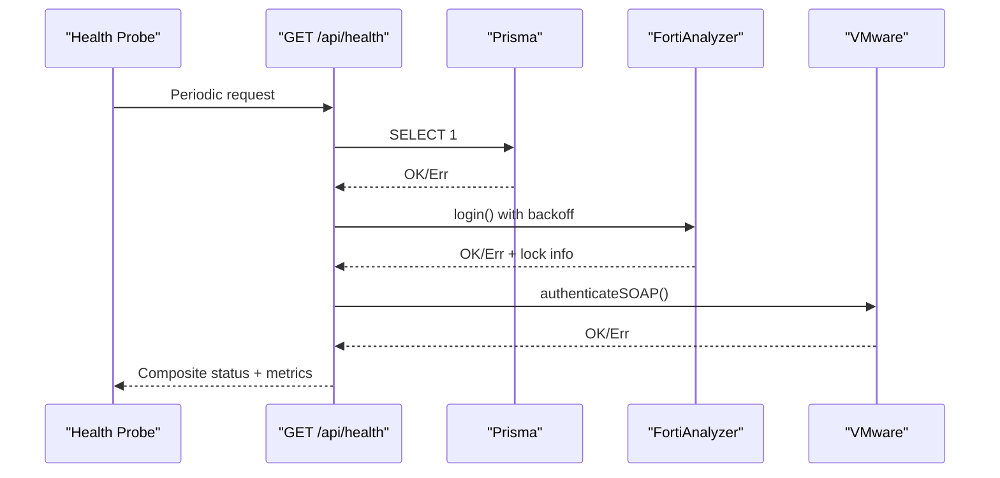
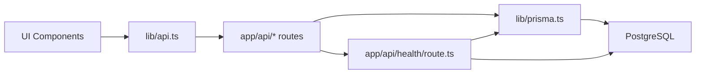

# Performance & Scalability

<cite>
**Referenced Files in This Document**
- [README.md](file://README.md)
- [next.config.js](file://next.config.js)
- [package.json](file://package.json)
- [lib/prisma.ts](file://lib/prisma.ts)
- [prisma/schema.prisma](file://prisma/schema.prisma)
- [lib/api.ts](file://lib/api.ts)
- [app/api/buildings/route.ts](file://app/api/buildings/route.ts)
- [app/api/devices/route.ts](file://app/api/devices/route.ts)
- [app/api/services/route.ts](file://app/api/services/route.ts)
- [app/api/health/route.ts](file://app/api/health/route.ts)
- [docs/20-modules/alarms/ALARM_PERFORMANCE_OPTIMIZATION.md](file://docs/20-modules/alarms/ALARM_PERFORMANCE_OPTIMIZATION.md)
- [components/ui/navigation-progress.tsx](file://components/ui/navigation-progress.tsx)
- [components/ui/loading-bar.tsx](file://components/ui/loading-bar.tsx)
</cite>

## Table of Contents
1. [Introduction](#introduction)
2. [Project Structure](#project-structure)
3. [Core Components](#core-components)
4. [Architecture Overview](#architecture-overview)
5. [Detailed Component Analysis](#detailed-component-analysis)
6. [Dependency Analysis](#dependency-analysis)
7. [Performance Considerations](#performance-considerations)
8. [Troubleshooting Guide](#troubleshooting-guide)
9. [Conclusion](#conclusion)
10. [Appendices](#appendices)

## Introduction
This document focuses on performance and scalability patterns in the InfraScope architecture. It synthesizes existing optimizations and documents recommended strategies for databases, frontend rendering, API performance, monitoring, and enterprise-scale deployment. The guidance is grounded in the repository’s current implementation and documented improvements.

## Project Structure
InfraScope is a Next.js 14 application with:
- Frontend built with React, TypeScript, and Tailwind CSS
- Backend implemented as Next.js API routes
- PostgreSQL with Prisma ORM
- Optional integrations with FortiAnalyzer, VMware, and NMS

**Diagram sources**
- [next.config.js:1-62](file://next.config.js#L1-L62)
- [lib/api.ts:1-57](file://lib/api.ts#L1-L57)
- [lib/prisma.ts:1-21](file://lib/prisma.ts#L1-L21)
- [prisma/schema.prisma:1-800](file://prisma/schema.prisma#L1-L800)
- [app/api/buildings/route.ts:1-118](file://app/api/buildings/route.ts#L1-L118)
- [app/api/devices/route.ts:1-142](file://app/api/devices/route.ts#L1-L142)
- [app/api/services/route.ts:1-122](file://app/api/services/route.ts#L1-L122)
- [app/api/health/route.ts:1-255](file://app/api/health/route.ts#L1-L255)

**Section sources**
- [README.md:114-172](file://README.md#L114-L172)
- [next.config.js:1-62](file://next.config.js#L1-L62)
- [lib/prisma.ts:1-21](file://lib/prisma.ts#L1-L21)
- [prisma/schema.prisma:1-800](file://prisma/schema.prisma#L1-L800)

## Core Components
- Prisma singleton for efficient database client lifecycle and controlled logging
- Next.js API routes implementing optimized queries, pagination, and selective field retrieval
- Frontend HTTP client with unified error handling
- Built-in health endpoint with datasource checks and auto-restart logic
- Client-side navigation progress indicators for perceived performance

**Section sources**
- [lib/prisma.ts:1-21](file://lib/prisma.ts#L1-L21)
- [app/api/buildings/route.ts:1-118](file://app/api/buildings/route.ts#L1-L118)
- [app/api/devices/route.ts:1-142](file://app/api/devices/route.ts#L1-L142)
- [app/api/services/route.ts:1-122](file://app/api/services/route.ts#L1-L122)
- [lib/api.ts:1-57](file://lib/api.ts#L1-L57)
- [app/api/health/route.ts:1-255](file://app/api/health/route.ts#L1-L255)
- [components/ui/navigation-progress.tsx:1-87](file://components/ui/navigation-progress.tsx#L1-L87)
- [components/ui/loading-bar.tsx:1-52](file://components/ui/loading-bar.tsx#L1-L52)

## Architecture Overview
The runtime architecture emphasizes:
- Minimal round-trips via selective includes/selects and parallel counts
- Controlled caching at the API layer and HTTP cache headers
- Compression and static asset caching via Next.js configuration
- Health-aware orchestration and graceful degradation

**Diagram sources**
- [lib/api.ts:1-57](file://lib/api.ts#L1-L57)
- [app/api/devices/route.ts:1-142](file://app/api/devices/route.ts#L1-L142)
- [lib/prisma.ts:1-21](file://lib/prisma.ts#L1-L21)

## Detailed Component Analysis

### Database Optimization Strategies
- Singleton Prisma client reduces overhead and controls query logging
- Selective field retrieval and conditional includes minimize payload sizes
- Indexes defined in the schema accelerate lookups on frequently queried fields
- Parallel count and data queries reduce latency for paginated endpoints

**Diagram sources**
- [app/api/devices/route.ts:10-94](file://app/api/devices/route.ts#L10-L94)
- [app/api/services/route.ts:4-75](file://app/api/services/route.ts#L4-L75)
- [app/api/buildings/route.ts:9-79](file://app/api/buildings/route.ts#L9-L79)
- [lib/prisma.ts:10-20](file://lib/prisma.ts#L10-L20)

**Section sources**
- [lib/prisma.ts:1-21](file://lib/prisma.ts#L1-L21)
- [prisma/schema.prisma:39-42](file://prisma/schema.prisma#L39-L42)
- [prisma/schema.prisma:221-227](file://prisma/schema.prisma#L221-L227)
- [prisma/schema.prisma:248-251](file://prisma/schema.prisma#L248-L251)
- [prisma/schema.prisma:389-402](file://prisma/schema.prisma#L389-L402)
- [app/api/devices/route.ts:66-71](file://app/api/devices/route.ts#L66-L71)
- [app/api/services/route.ts:51-56](file://app/api/services/route.ts#L51-L56)

### Frontend Performance Optimizations
- Navigation progress indicators improve perceived responsiveness
- Next.js configuration enables compression, static caching headers, and optimized imports
- Client-side HTTP client centralizes error handling and response shaping

**Diagram sources**
- [components/ui/navigation-progress.tsx:13-87](file://components/ui/navigation-progress.tsx#L13-L87)
- [next.config.js:19-47](file://next.config.js#L19-L47)
- [lib/api.ts:1-57](file://lib/api.ts#L1-L57)

**Section sources**
- [components/ui/navigation-progress.tsx:1-87](file://components/ui/navigation-progress.tsx#L1-L87)
- [components/ui/loading-bar.tsx:1-52](file://components/ui/loading-bar.tsx#L1-L52)
- [next.config.js:19-62](file://next.config.js#L19-L62)
- [lib/api.ts:1-57](file://lib/api.ts#L1-L57)

### API Performance Patterns
- Pagination with validated limits and computed totals
- Conditional includes/selects to avoid heavy joins on dashboards
- HTTP caching headers for static-like endpoints
- Compression enabled globally

**Diagram sources**
- [app/api/devices/route.ts:10-94](file://app/api/devices/route.ts#L10-L94)
- [app/api/services/route.ts:4-75](file://app/api/services/route.ts#L4-L75)
- [next.config.js:19-47](file://next.config.js#L19-L47)

**Section sources**
- [app/api/devices/route.ts:10-94](file://app/api/devices/route.ts#L10-L94)
- [app/api/services/route.ts:4-75](file://app/api/services/route.ts#L4-L75)
- [app/api/buildings/route.ts:4-79](file://app/api/buildings/route.ts#L4-L79)
- [next.config.js:6, 19-47:6-6](file://next.config.js#L6-L6)
- [next.config.js:19-47](file://next.config.js#L19-L47)

### Monitoring and Health
- Health endpoint aggregates database, FortiAnalyzer, and VMware connectivity with auto-restart logic
- FortiAnalyzer health caches negative results to avoid login storms during throttling
- Alarm performance improvements demonstrate measurable throughput and reduced timeouts

**Diagram sources**
- [app/api/health/route.ts:204-255](file://app/api/health/route.ts#L204-L255)
- [docs/20-modules/alarms/ALARM_PERFORMANCE_OPTIMIZATION.md:114-128](file://docs/20-modules/alarms/ALARM_PERFORMANCE_OPTIMIZATION.md#L114-L128)

**Section sources**
- [app/api/health/route.ts:14-117](file://app/api/health/route.ts#L14-L117)
- [app/api/health/route.ts:204-255](file://app/api/health/route.ts#L204-L255)
- [docs/20-modules/alarms/ALARM_PERFORMANCE_OPTIMIZATION.md:1-379](file://docs/20-modules/alarms/ALARM_PERFORMANCE_OPTIMIZATION.md#L1-L379)

## Dependency Analysis
- Frontend depends on Next.js runtime and Axios for HTTP requests
- API routes depend on Prisma for data access and environment variables for integrations
- Health endpoint coordinates multiple subsystems and restarts services if needed

**Diagram sources**
- [lib/api.ts:1-57](file://lib/api.ts#L1-L57)
- [app/api/buildings/route.ts:1-118](file://app/api/buildings/route.ts#L1-L118)
- [app/api/devices/route.ts:1-142](file://app/api/devices/route.ts#L1-L142)
- [app/api/services/route.ts:1-122](file://app/api/services/route.ts#L1-L122)
- [lib/prisma.ts:1-21](file://lib/prisma.ts#L1-L21)
- [app/api/health/route.ts:1-255](file://app/api/health/route.ts#L1-L255)

**Section sources**
- [lib/api.ts:1-57](file://lib/api.ts#L1-L57)
- [lib/prisma.ts:1-21](file://lib/prisma.ts#L1-L21)
- [app/api/health/route.ts:1-255](file://app/api/health/route.ts#L1-L255)

## Performance Considerations

### Database Optimization Strategies
- Indexing
  - Use schema-defined indexes for frequent filters and foreign keys to accelerate joins and lookups.
  - Examples include user email/status, device rack/parent/zabbix/vmware identifiers, and audit timestamps.

- Pagination
  - Validate and cap page size to prevent oversized payloads.
  - Compute total counts in parallel with data retrieval to avoid extra round-trips.

- Lazy Loading and Selective Fetching
  - Offer “minimal” mode for dashboards to avoid heavy includes.
  - Use “full” mode for detail views requiring relations.

- Query Logging Control
  - Keep Prisma query logging disabled in production to reduce I/O overhead.

**Section sources**
- [prisma/schema.prisma:39-42](file://prisma/schema.prisma#L39-L42)
- [prisma/schema.prisma:221-227](file://prisma/schema.prisma#L221-L227)
- [prisma/schema.prisma:248-251](file://prisma/schema.prisma#L248-L251)
- [prisma/schema.prisma:389-402](file://prisma/schema.prisma#L389-L402)
- [app/api/devices/route.ts:10-94](file://app/api/devices/route.ts#L10-L94)
- [app/api/services/route.ts:4-75](file://app/api/services/route.ts#L4-L75)
- [lib/prisma.ts:10-20](file://lib/prisma.ts#L10-L20)

### Frontend Performance Optimizations
- Code Splitting and Dynamic Imports
  - Next.js automatically code splits routes; leverage it by organizing features under app router segments.

- Virtual Scrolling and Large Lists
  - For large datasets, implement virtualized lists to render only visible items.

- Image Optimization
  - Serve optimized images via Next.js Image and appropriate cache headers.

- Navigation Feedback
  - Use navigation progress bars to communicate loading state and perceived responsiveness.

**Section sources**
- [next.config.js:19-47](file://next.config.js#L19-L47)
- [components/ui/navigation-progress.tsx:1-87](file://components/ui/navigation-progress.tsx#L1-L87)
- [components/ui/loading-bar.tsx:1-52](file://components/ui/loading-bar.tsx#L1-L52)

### API Performance Patterns
- Rate Limiting
  - Implement per-endpoint quotas and backoff strategies to protect upstream systems (e.g., FortiAnalyzer login throttling).

- Caching Headers
  - Use HTTP cache-control headers for read-heavy endpoints to reduce origin load.

- Response Compression
  - Enable gzip/brotli compression globally for smaller payloads.

- Request Validation
  - Validate and sanitize query parameters and body payloads to avoid expensive or invalid queries.

**Section sources**
- [app/api/health/route.ts:62-117](file://app/api/health/route.ts#L62-L117)
- [next.config.js:6, 19-47:6-6](file://next.config.js#L6-L6)
- [next.config.js:19-47](file://next.config.js#L19-L47)

### Monitoring and Metrics Collection
- Health Endpoint
  - Aggregate datasource health, service status, and alarm statistics.
  - Auto-restart services if they stop unexpectedly.

- Alarm Performance Metrics
  - Track check durations, throughput, and timeout rates to validate optimization impact.

**Section sources**
- [app/api/health/route.ts:204-255](file://app/api/health/route.ts#L204-L255)
- [docs/20-modules/alarms/ALARM_PERFORMANCE_OPTIMIZATION.md:139-166](file://docs/20-modules/alarms/ALARM_PERFORMANCE_OPTIMIZATION.md#L139-L166)

### Load Balancing and Horizontal Scaling
- Stateless API Routes
  - Keep backend stateless to enable easy horizontal scaling behind a load balancer.

- Health Checks
  - Use the health endpoint for readiness/liveness probes.

- Caching Layers
  - Introduce CDN and reverse proxy caching for static assets and read-heavy endpoints.

- Database Scaling
  - Use read replicas for reporting-heavy queries and maintain primary for writes.

[No sources needed since this section provides general guidance]

## Troubleshooting Guide
- Database Connectivity
  - Verify Prisma client initialization and environment variables.
  - Use the health endpoint to confirm database reachability.

- API Latency
  - Check pagination parameters and mode selection.
  - Inspect cache headers and compression settings.

- FortiAnalyzer Throttling
  - Observe cached health results and backoff behavior to avoid login storms.

**Section sources**
- [lib/prisma.ts:10-20](file://lib/prisma.ts#L10-L20)
- [app/api/health/route.ts:62-117](file://app/api/health/route.ts#L62-L117)
- [next.config.js:19-47](file://next.config.js#L19-L47)

## Conclusion
InfraScope’s architecture incorporates several proven performance practices: selective data fetching, pagination, caching headers, compression, and health-aware orchestration. The alarm system optimization demonstrates measurable gains through batching, parallelization, and reduced timeouts. For enterprise deployments, complement these with CDN caching, read replicas, and robust monitoring to sustain growth.

[No sources needed since this section summarizes without analyzing specific files]

## Appendices

### Appendix A: Example API Response Format
- All endpoints return a consistent envelope with success, data, and timestamp fields.

**Section sources**
- [README.md:288-308](file://README.md#L288-L308)