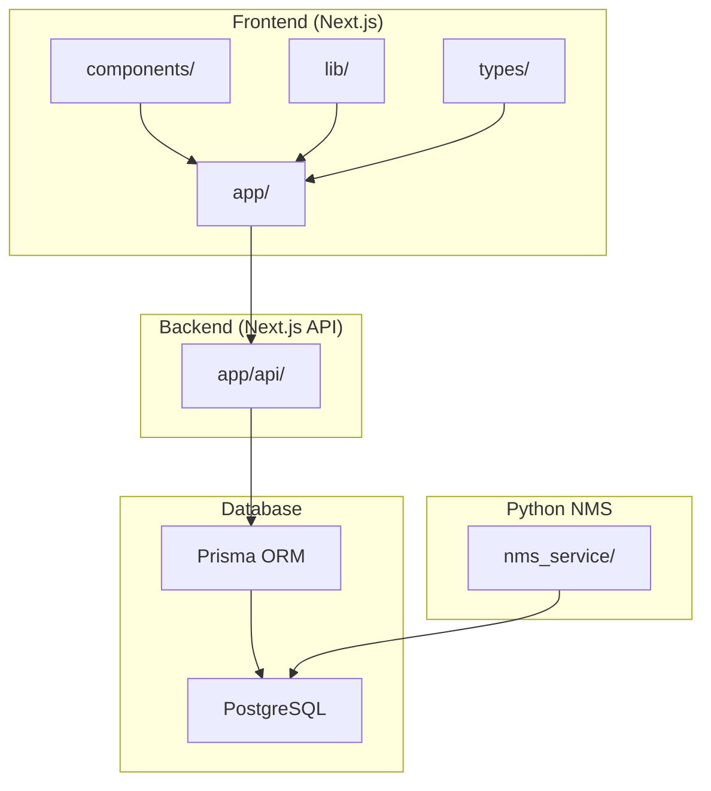
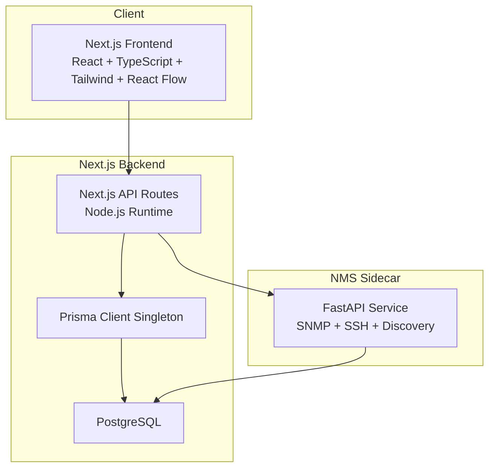
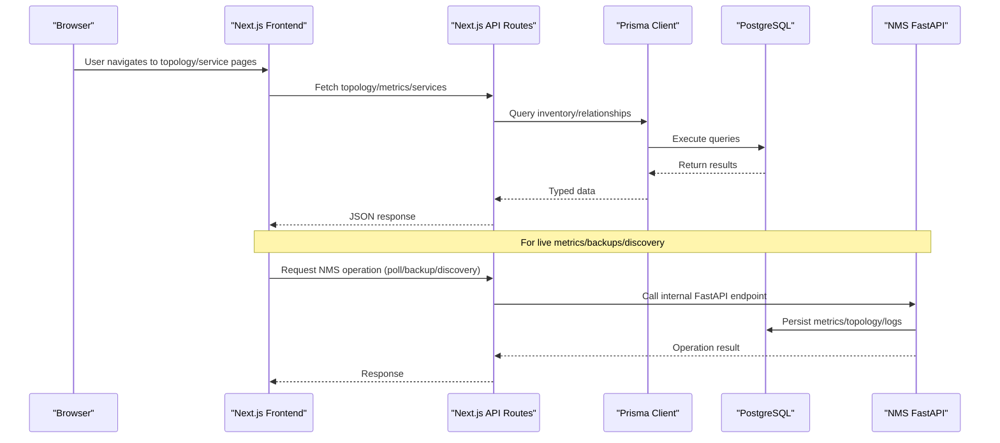
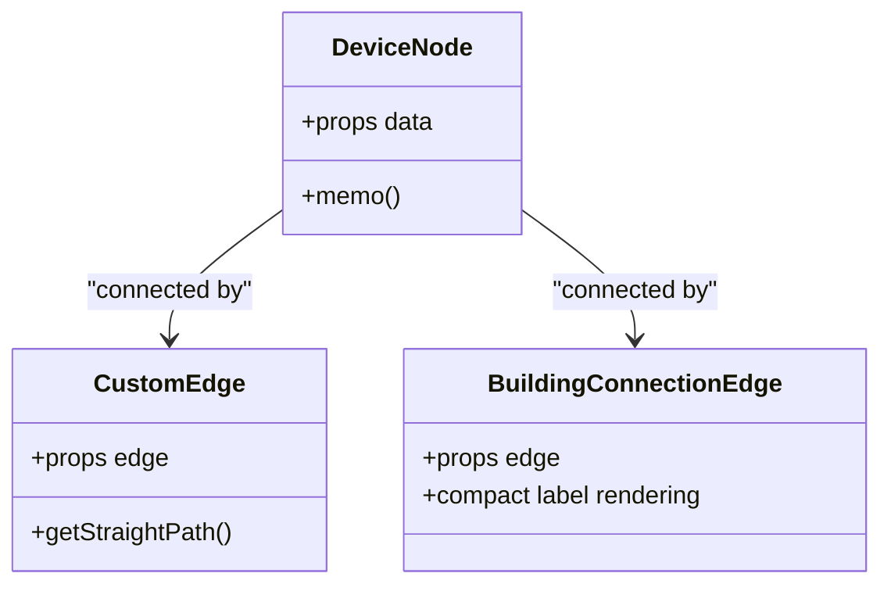
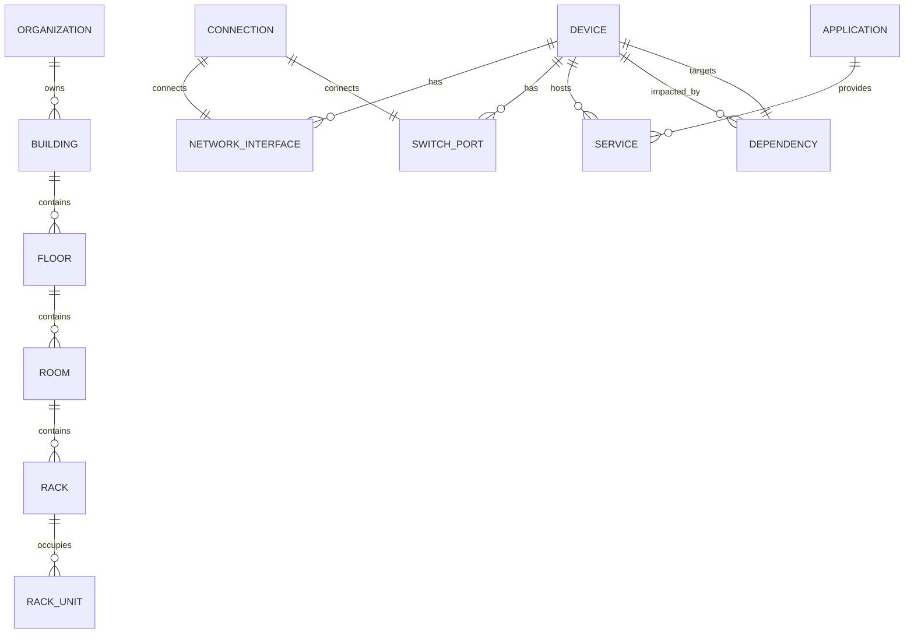
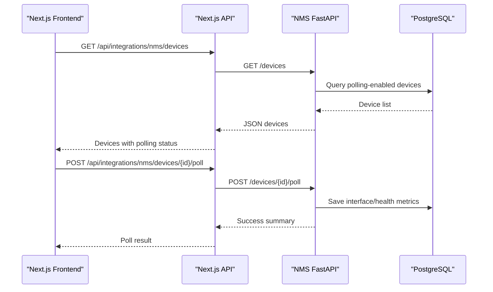
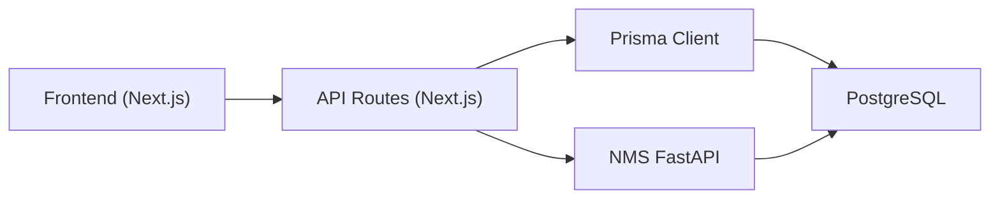

# System Overview

<cite>
**Referenced Files in This Document**
- [README.md](file://README.md)
- [ARCHITECTURE.md](file://ARCHITECTURE.md)
- [package.json](file://package.json)
- [docker-compose.yml](file://docker-compose.yml)
- [docker-compose.prod.yml](file://docker-compose.prod.yml)
- [Dockerfile](file://Dockerfile)
- [nms_service/Dockerfile](file://nms_service/Dockerfile)
- [nms_service/main.py](file://nms_service/main.py)
- [nms_service/core/config.py](file://nms_service/core/config.py)
- [lib/prisma.ts](file://lib/prisma.ts)
- [prisma/schema.prisma](file://prisma/schema.prisma)
- [types/index.ts](file://types/index.ts)
- [app/layout.tsx](file://app/layout.tsx)
- [components/topology/DeviceNode.tsx](file://components/topology/DeviceNode.tsx)
- [components/topology/CustomEdge.tsx](file://components/topology/CustomEdge.tsx)
</cite>

## Table of Contents
1. [Introduction](#introduction)
2. [Project Structure](#project-structure)
3. [Core Components](#core-components)
4. [Architecture Overview](#architecture-overview)
5. [Detailed Component Analysis](#detailed-component-analysis)
6. [Dependency Analysis](#dependency-analysis)
7. [Performance Considerations](#performance-considerations)
8. [Troubleshooting Guide](#troubleshooting-guide)
9. [Conclusion](#conclusion)

## Introduction
InfraScope is an enterprise-grade infrastructure management platform designed to centralize visibility and control over physical infrastructure, device inventory, network topology, service tracking, and service dependency relationships. It enables organizations to manage hierarchical locations (Organization → Building → Floor → Room → Rack → Unit), maintain accurate device and service inventories, visualize network topology, and perform impact analysis across dependencies.

Key capabilities include:
- Physical infrastructure inventory and capacity planning
- Network topology visualization and switch port/VLAN management
- Device lifecycle and status tracking
- Service and application tracking with port/protocol mapping
- Dependency modeling and impact analysis
- Audit trails and health snapshots

Technology stack highlights:
- Frontend: Next.js 14 with React, TypeScript, Tailwind CSS, React Flow for topology, Zustand for state, Axios for HTTP
- Backend: Next.js API routes with Node.js runtime
- Database: PostgreSQL with Prisma ORM and JSONB for extensible metadata
- Python-based Network Management Service (NMS): FastAPI sidecar for SNMP polling, SSH-based backups, and network discovery

## Project Structure
The repository follows a modern Next.js App Router structure with clear separation of concerns:
- app/: Next.js pages and API routes organized by feature
- components/: Shared UI components (layout, topology, forms)
- lib/: Utilities (Prisma client singleton, API helpers, formatting)
- prisma/: Database schema, migrations, and seed data
- types/: Centralized TypeScript definitions
- nms_service/: Python-based NMS with FastAPI endpoints
- docker/: Containerization assets and scripts
- docs/: Project documentation and guides

**Diagram sources**
- [docker-compose.yml:5-153](file://docker-compose.yml#L5-L153)
- [nms_service/main.py:1-483](file://nms_service/main.py#L1-L483)
- [lib/prisma.ts:1-21](file://lib/prisma.ts#L1-L21)
- [prisma/schema.prisma:1-800](file://prisma/schema.prisma#L1-L800)

**Section sources**
- [README.md:106-164](file://README.md#L106-L164)
- [ARCHITECTURE.md:28-103](file://ARCHITECTURE.md#L28-L103)

## Core Components
- Next.js Frontend (React + TypeScript)
  - Root layout and global styling
  - Feature pages for dashboard, devices, locations, services, network, and integrations
  - Shared components for topology visualization and UI primitives
- Next.js API Routes (Node.js runtime)
  - REST endpoints under app/api/ for organizations, buildings, devices, services, network, dependencies, and integrations
  - Health checks and standardized response/error formats
- Prisma ORM and PostgreSQL
  - Strongly typed models for organizational hierarchy, devices, network interfaces/ports/connections, services, dependencies, and audit logs
  - JSONB fields for extensible metadata and enums for type safety
- Python Network Management Service (NMS)
  - FastAPI endpoints for device polling, backups, discovery scans, and topology retrieval
  - Background polling thread and orchestrator for SNMP/SSH operations
  - Writes metrics and topology data into the shared PostgreSQL database

**Section sources**
- [app/layout.tsx:1-57](file://app/layout.tsx#L1-L57)
- [types/index.ts:1-312](file://types/index.ts#L1-L312)
- [nms_service/main.py:1-483](file://nms_service/main.py#L1-L483)
- [lib/prisma.ts:1-21](file://lib/prisma.ts#L1-L21)
- [prisma/schema.prisma:10-800](file://prisma/schema.prisma#L10-L800)

## Architecture Overview
InfraScope combines a React-based frontend, a Node.js backend (Next.js API routes), a PostgreSQL database, and a Python-based NMS service. The NMS operates as an internal sidecar, exposing FastAPI endpoints consumed by the Next.js application for SNMP polling, SSH backups, discovery scans, and topology retrieval.

**Diagram sources**
- [docker-compose.yml:31-115](file://docker-compose.yml#L31-L115)
- [nms_service/main.py:39-51](file://nms_service/main.py#L39-L51)
- [lib/prisma.ts:10-20](file://lib/prisma.ts#L10-L20)
- [prisma/schema.prisma:1-800](file://prisma/schema.prisma#L1-L800)

## Detailed Component Analysis

### System Context and Data Flow
The system integrates four primary components:
- Next.js Frontend: Renders dashboards, topology, and management views
- Next.js API: Provides REST endpoints and delegates to Prisma for persistence
- PostgreSQL: Stores all enterprise data (inventory, topology, services, dependencies, audit logs)
- Python NMS: Polls devices, discovers networks, and persists metrics/topology

**Diagram sources**
- [nms_service/main.py:103-182](file://nms_service/main.py#L103-L182)
- [lib/prisma.ts:10-20](file://lib/prisma.ts#L10-L20)
- [prisma/schema.prisma:151-228](file://prisma/schema.prisma#L151-L228)

### Technology Stack Overview
- Frontend: Next.js 14, React, TypeScript, Tailwind CSS, React Flow, Zustand, Axios
- Backend: Next.js API Routes, Node.js runtime
- Database: PostgreSQL with Prisma ORM and JSONB for extensible metadata
- Python Services: FastAPI, SQLAlchemy, SNMP/SSH clients, background threads

**Section sources**
- [README.md:108-126](file://README.md#L108-L126)
- [package.json:16-70](file://package.json#L16-L70)

### Topology Visualization Components
The frontend uses React Flow to render network topology with custom nodes and edges:
- DeviceNode: Renders device cards with status, vendor, role, and connection counts
- CustomEdge/BuildingConnectionEdge: Visualizes physical and logical connections with distinct styles

**Diagram sources**
- [components/topology/DeviceNode.tsx:22-112](file://components/topology/DeviceNode.tsx#L22-L112)
- [components/topology/CustomEdge.tsx:6-156](file://components/topology/CustomEdge.tsx#L6-L156)

**Section sources**
- [components/topology/DeviceNode.tsx:1-112](file://components/topology/DeviceNode.tsx#L1-L112)
- [components/topology/CustomEdge.tsx:1-156](file://components/topology/CustomEdge.tsx#L1-L156)

### Database Model Overview
The Prisma schema defines core entities and relationships:
- Hierarchical locations: Organization → Building → Floor → Room → Rack → RackUnit
- Devices: Physical/virtual with parent-child relationships, metadata, and NMS integration fields
- Network: Interfaces, switch ports, connections, and building connections
- Services/Applications: Service-to-device mapping and dependency relationships
- Audit and health: Audit logs and device health snapshots

**Diagram sources**
- [prisma/schema.prisma:10-800](file://prisma/schema.prisma#L10-L800)

**Section sources**
- [prisma/schema.prisma:10-800](file://prisma/schema.prisma#L10-L800)
- [types/index.ts:10-312](file://types/index.ts#L10-L312)

### Python NMS Service
The NMS FastAPI service provides:
- Device listing and on-demand polling
- SSH-based configuration backups
- Network discovery scans with progress tracking
- Health and interface metrics retrieval
- Topology links aggregation

**Diagram sources**
- [nms_service/main.py:103-182](file://nms_service/main.py#L103-L182)
- [nms_service/core/config.py:71-172](file://nms_service/core/config.py#L71-L172)

**Section sources**
- [nms_service/main.py:1-483](file://nms_service/main.py#L1-L483)
- [nms_service/core/config.py:1-172](file://nms_service/core/config.py#L1-L172)

## Dependency Analysis
- Frontend-to-Backend: The Next.js frontend consumes API routes under app/api/, which use the Prisma client singleton for database operations
- Backend-to-Database: Prisma manages schema, migrations, and type-safe queries against PostgreSQL
- Backend-to-NMS: Next.js API routes call internal NMS endpoints for device operations and discovery
- NMS-to-Database: The NMS writes metrics, topology, and discovery results into the same PostgreSQL instance

**Diagram sources**
- [lib/prisma.ts:10-20](file://lib/prisma.ts#L10-L20)
- [docker-compose.yml:49-115](file://docker-compose.yml#L49-L115)
- [nms_service/main.py:39-51](file://nms_service/main.py#L39-L51)

**Section sources**
- [docker-compose.yml:49-115](file://docker-compose.yml#L49-L115)
- [lib/prisma.ts:1-21](file://lib/prisma.ts#L1-L21)

## Performance Considerations
- Database
  - Use indexes on frequently queried fields (organizationId, device relations, timestamps)
  - Implement pagination for large datasets and lazy loading for related entities
  - Cache commonly accessed data and leverage JSONB for flexible metadata
- Frontend
  - Code splitting and dynamic imports for large components
  - Virtualized lists for extensive inventories
  - Optimized images and minimal re-renders
- API
  - Rate limiting, caching headers, compression, and request validation
  - Background tasks for long-running discovery operations

**Section sources**
- [ARCHITECTURE.md:254-273](file://ARCHITECTURE.md#L254-L273)

## Troubleshooting Guide
- PostgreSQL connectivity
  - Verify DATABASE_URL and database credentials
  - Use psql to connect and confirm database existence
- Prisma client generation
  - Regenerate client if missing or after schema changes
  - Reinstall dependencies if issues persist
- Port conflicts
  - Adjust port bindings in development or production compose files
- TypeScript errors
  - Run type checks and rebuild as needed

**Section sources**
- [README.md:357-392](file://README.md#L357-L392)

## Conclusion
InfraScope delivers a scalable, type-safe, and extensible infrastructure management platform. Its layered architecture—React frontend, Next.js API routes, PostgreSQL with Prisma, and a Python-based NMS—enables robust physical infrastructure inventory, network topology visualization, device management, and service dependency tracking. The modular design, strong typing, and clear separation of concerns support enterprise-grade maintainability and growth.