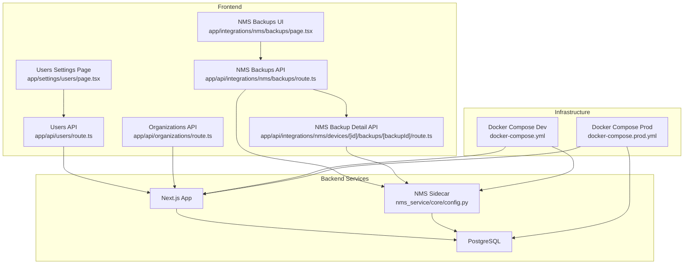
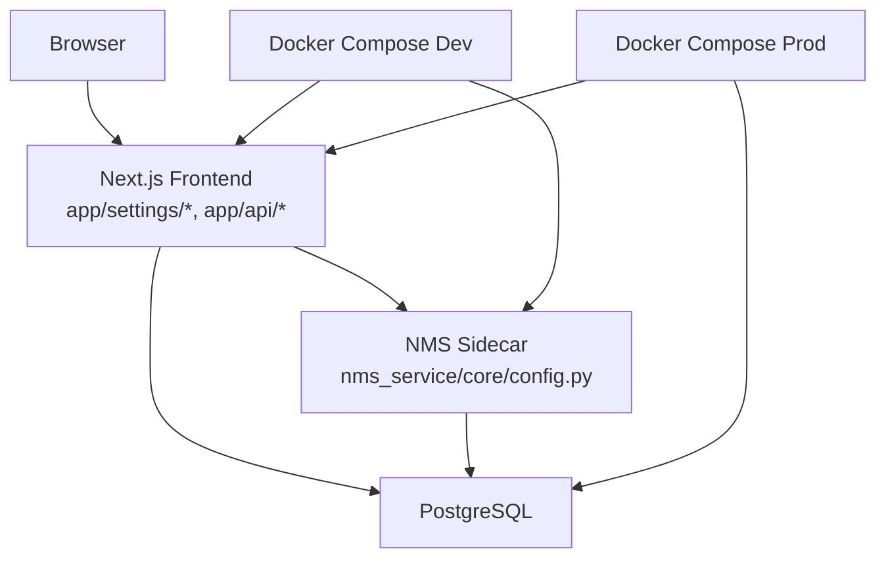
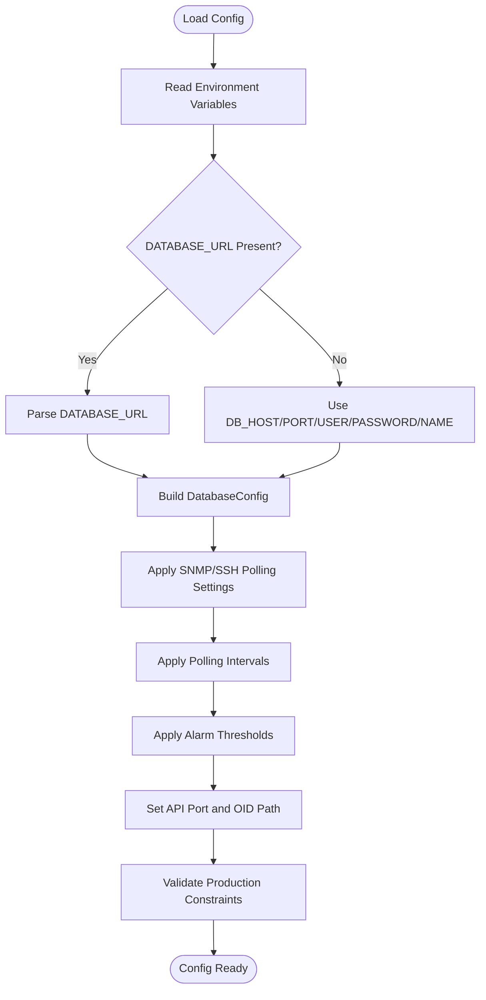
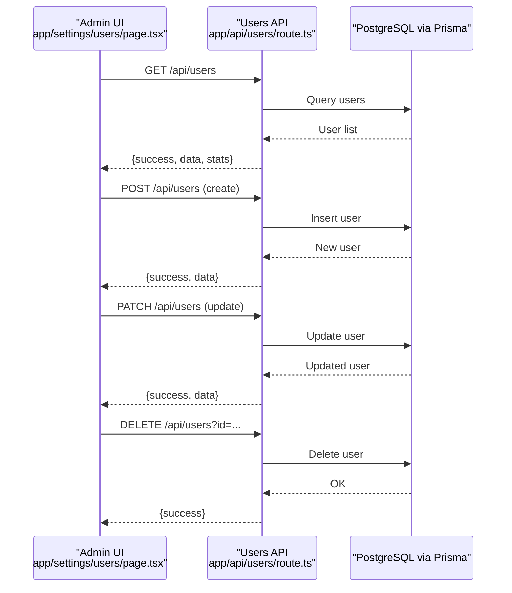
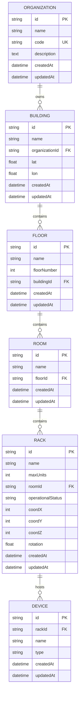
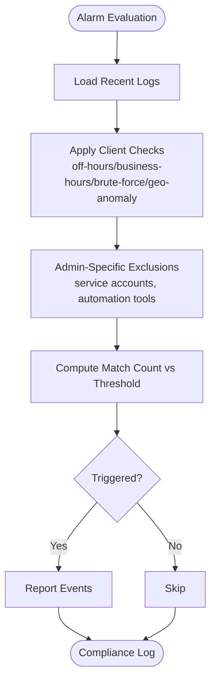
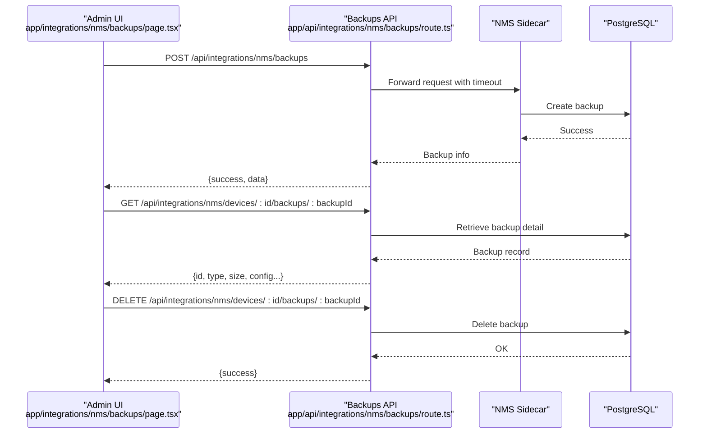
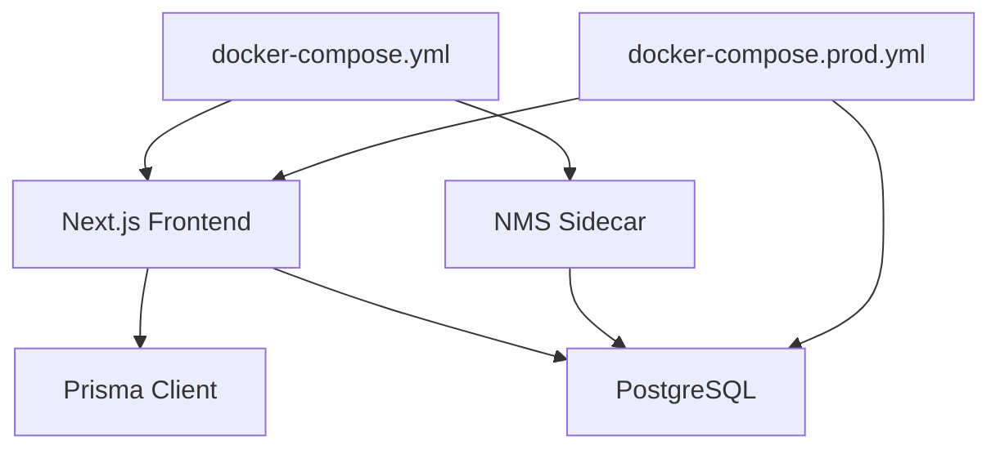

# Configuration & Administration

<cite>
**Referenced Files in This Document**
- [config.py](file://nms_service/core/config.py)
- [route.ts](file://app/api/users/route.ts)
- [page.tsx](file://app/settings/users/page.tsx)
- [route.ts](file://app/api/organizations/route.ts)
- [prisma.ts](file://lib/prisma.ts)
- [package.json](file://package.json)
- [next.config.js](file://next.config.js)
- [docker-compose.yml](file://docker-compose.yml)
- [docker-compose.prod.yml](file://docker-compose.prod.yml)
- [postgres-backup.sh](file://docker/postgres-backup.sh)
- [route.ts](file://app/api/integrations/nms/backups/route.ts)
- [page.tsx](file://app/integrations/nms/backups/page.tsx)
- [route.ts](file://app/api/integrations/nms/devices/[id]/backups/[backupId]/route.ts)
- [detection-engine.ts](file://lib/alarms/detection-engine.ts)
</cite>

## Table of Contents
1. [Introduction](#introduction)
2. [Project Structure](#project-structure)
3. [Core Components](#core-components)
4. [Architecture Overview](#architecture-overview)
5. [Detailed Component Analysis](#detailed-component-analysis)
6. [Dependency Analysis](#dependency-analysis)
7. [Performance Considerations](#performance-considerations)
8. [Troubleshooting Guide](#troubleshooting-guide)
9. [Conclusion](#conclusion)
10. [Appendices](#appendices)

## Introduction
This document focuses on configuration and administration for system settings, user management, and organizational administration. It explains how application configuration is managed, how environment variables are handled, and how performance tuning options are exposed. It documents user administration with role-based access control and lifecycle operations, outlines organizational settings and multi-entity support, and covers audit logging, change tracking, and compliance reporting capabilities. Finally, it provides system maintenance procedures, backup strategies, and disaster recovery planning, along with practical examples and security considerations for administrative operations.

## Project Structure
The configuration and administration surface spans:
- Frontend Next.js pages under app/settings and app/api routes
- Backend configuration for the NMS sidecar service
- Database connectivity via Prisma
- Container orchestration with Docker Compose for development and production
- Operational integrations for network device configuration backups

**Diagram sources**
- [page.tsx:1-345](file://app/settings/users/page.tsx#L1-345)
- [route.ts:1-161](file://app/api/users/route.ts#L1-161)
- [route.ts:1-125](file://app/api/organizations/route.ts#L1-125)
- [page.tsx:52-158](file://app/integrations/nms/backups/page.tsx#L52-158)
- [route.ts:29-49](file://app/api/integrations/nms/backups/route.ts#L29-49)
- [route.ts:1-51](file://app/api/integrations/nms/devices/[id]/backups/[backupId]/route.ts#L1-51)
- [config.py:1-172](file://nms_service/core/config.py#L1-172)
- [docker-compose.yml:1-153](file://docker-compose.yml#L1-153)
- [docker-compose.prod.yml:1-135](file://docker-compose.prod.yml#L1-135)

**Section sources**
- [page.tsx:1-345](file://app/settings/users/page.tsx#L1-345)
- [route.ts:1-161](file://app/api/users/route.ts#L1-161)
- [route.ts:1-125](file://app/api/organizations/route.ts#L1-125)
- [page.tsx:52-158](file://app/integrations/nms/backups/page.tsx#L52-158)
- [route.ts:29-49](file://app/api/integrations/nms/backups/route.ts#L29-49)
- [route.ts:1-51](file://app/api/integrations/nms/devices/[id]/backups/[backupId]/route.ts#L1-51)
- [config.py:1-172](file://nms_service/core/config.py#L1-172)
- [docker-compose.yml:1-153](file://docker-compose.yml#L1-153)
- [docker-compose.prod.yml:1-135](file://docker-compose.prod.yml#L1-135)

## Core Components
- Application configuration management:
  - Environment-driven configuration for the NMS sidecar service, including database connectivity, SNMP/SSH polling, alarm thresholds, and API port.
  - Frontend Next.js configuration via environment variables and caching headers.
- User administration:
  - User listing, creation, updates, and deletion via API endpoints.
  - Role-based access control with admin/editor/viewer roles and active/inactive status.
- Organizational administration:
  - Organization CRUD with hierarchical relationships to buildings and floors.
  - Caching strategy to reduce database load for organization listings.
- Multi-entity support:
  - Organizations → Buildings → Floors → Rooms → Racks → Devices.
- Audit logging and change tracking:
  - Alarm detection engine applies client-side filters and exclusions for administrative actions and automation tools.
- Maintenance and backups:
  - Network device configuration backups orchestrated through the NMS integration.
  - Production-grade backup script and containerized Postgres backup scheduling.

**Section sources**
- [config.py:71-172](file://nms_service/core/config.py#L71-172)
- [route.ts:4-161](file://app/api/users/route.ts#L4-161)
- [page.tsx:24-163](file://app/settings/users/page.tsx#L24-163)
- [route.ts:9-88](file://app/api/organizations/route.ts#L9-88)
- [detection-engine.ts:1012-1254](file://lib/alarms/detection-engine.ts#L1012-1254)
- [route.ts:29-49](file://app/api/integrations/nms/backups/route.ts#L29-49)
- [page.tsx:52-158](file://app/integrations/nms/backups/page.tsx#L52-158)
- [route.ts:1-51](file://app/api/integrations/nms/devices/[id]/backups/[backupId]/route.ts#L1-51)

## Architecture Overview
The system integrates a Next.js frontend with a Python-based NMS sidecar that polls network devices and writes metrics and configuration backups into a shared PostgreSQL database. Configuration is driven by environment variables and Docker Compose, while the frontend consumes APIs for user and organization administration and for NMS backup operations.

**Diagram sources**
- [config.py:71-172](file://nms_service/core/config.py#L71-172)
- [route.ts:1-161](file://app/api/users/route.ts#L1-161)
- [route.ts:1-125](file://app/api/organizations/route.ts#L1-125)
- [docker-compose.yml:31-115](file://docker-compose.yml#L31-115)
- [docker-compose.prod.yml:36-75](file://docker-compose.prod.yml#L36-75)

## Detailed Component Analysis

### Application Configuration Management
- Environment variable handling:
  - NMS service reads DATABASE_URL or individual DB_* variables, sets log level, polling intervals, alarm thresholds, and API port from environment.
  - Frontend Next.js uses environment variables for database URL, API base URLs, and runtime behavior.
- Performance tuning options:
  - Polling intervals for interfaces, CPU/memory, inventory, and topology.
  - SNMP/SSH timeouts and concurrency limits.
  - Prisma query logging toggle via environment variable.
  - Next.js aggressive caching headers for selected API routes.
- Validation:
  - NMS configuration validates production database password presence.

**Diagram sources**
- [config.py:74-156](file://nms_service/core/config.py#L74-156)
- [prisma.ts:12-16](file://lib/prisma.ts#L12-16)
- [next.config.js:19-47](file://next.config.js#L19-47)

**Section sources**
- [config.py:71-172](file://nms_service/core/config.py#L71-172)
- [prisma.ts:12-16](file://lib/prisma.ts#L12-16)
- [next.config.js:19-47](file://next.config.js#L19-47)
- [docker-compose.yml:37-50](file://docker-compose.yml#L37-50)
- [docker-compose.prod.yml:45-57](file://docker-compose.prod.yml#L45-57)

### User Administration (RBAC and Lifecycle)
- Roles and permissions:
  - Roles: admin, editor, viewer.
  - Status: active, inactive.
- Lifecycle operations:
  - List users with statistics.
  - Create user (unique email enforcement).
  - Update user (name, email, role, status).
  - Delete user.
- Frontend UX:
  - Edit and delete dialogs with confirmation.
  - Role badges and status indicators.
  - Refresh and create actions.

**Diagram sources**
- [page.tsx:48-150](file://app/settings/users/page.tsx#L48-150)
- [route.ts:4-161](file://app/api/users/route.ts#L4-161)
- [prisma.ts:10-21](file://lib/prisma.ts#L10-21)

**Section sources**
- [route.ts:4-161](file://app/api/users/route.ts#L4-161)
- [page.tsx:24-163](file://app/settings/users/page.tsx#L24-163)
- [prisma.ts:10-21](file://lib/prisma.ts#L10-21)

### Organizational Settings and Multi-Entity Support
- Organization CRUD:
  - Create with name and code (required).
  - List with caching and nested counts for buildings/floors/racks.
  - Delete guarded by referential integrity (no buildings).
- Multi-entity hierarchy:
  - Organizations → Buildings → Floors → Rooms → Racks → Devices.

**Diagram sources**
- [route.ts:22-64](file://app/api/organizations/route.ts#L22-64)

**Section sources**
- [route.ts:9-88](file://app/api/organizations/route.ts#L9-88)

### Audit Logging, Change Tracking, and Compliance Reporting
- Administrative change tracking:
  - Alarm detection engine applies client-side filters and exclusions for administrative actions and automation tools.
  - Exclusions target service accounts, automation tools, and known benign events to reduce noise and improve compliance visibility.
- Compliance considerations:
  - Filtering off-hours activity, brute force attempts, and geo-anomaly patterns.
  - Excluding automation-generated changes for administrative configuration.

**Diagram sources**
- [detection-engine.ts:1223-1254](file://lib/alarms/detection-engine.ts#L1223-1254)
- [detection-engine.ts:1012-1030](file://lib/alarms/detection-engine.ts#L1012-1030)

**Section sources**
- [detection-engine.ts:1012-1254](file://lib/alarms/detection-engine.ts#L1012-1254)

### System Maintenance Procedures, Backup Strategies, and Disaster Recovery
- Network device configuration backups:
  - UI triggers backup creation and displays backup records.
  - API forwards requests to the NMS sidecar with timeouts and error handling.
  - Backup detail retrieval and deletion supported.
- Production backup script:
  - Containerized Postgres backup script mounted into the production database container.
- Disaster recovery:
  - Persistent volumes for Postgres data.
  - Health checks and restart policies for services.
  - Optional reverse proxy and strict production settings.

**Diagram sources**
- [page.tsx:120-158](file://app/integrations/nms/backups/page.tsx#L120-158)
- [route.ts:29-49](file://app/api/integrations/nms/backups/route.ts#L29-49)
- [route.ts:10-51](file://app/api/integrations/nms/devices/[id]/backups/[backupId]/route.ts#L10-51)

**Section sources**
- [page.tsx:52-158](file://app/integrations/nms/backups/page.tsx#L52-158)
- [route.ts:29-49](file://app/api/integrations/nms/backups/route.ts#L29-49)
- [route.ts:1-51](file://app/api/integrations/nms/devices/[id]/backups/[backupId]/route.ts#L1-51)
- [postgres-backup.sh](file://docker/postgres-backup.sh)

## Dependency Analysis
- Frontend depends on:
  - Next.js runtime and environment variables for API endpoints and database connectivity.
  - Prisma client for database operations.
- Backend services:
  - NMS sidecar depends on environment variables for database connectivity, SNMP/SSH, polling, and alarm thresholds.
  - Shared PostgreSQL instance for both Next.js and NMS.
- Orchestration:
  - Docker Compose defines environment variables, ports, volumes, and health checks for development and production.

**Diagram sources**
- [prisma.ts:10-21](file://lib/prisma.ts#L10-21)
- [config.py:79-109](file://nms_service/core/config.py#L79-109)
- [docker-compose.yml:37-115](file://docker-compose.yml#L37-115)
- [docker-compose.prod.yml:45-75](file://docker-compose.prod.yml#L45-75)

**Section sources**
- [prisma.ts:10-21](file://lib/prisma.ts#L10-21)
- [config.py:79-109](file://nms_service/core/config.py#L79-109)
- [docker-compose.yml:37-115](file://docker-compose.yml#L37-115)
- [docker-compose.prod.yml:45-75](file://docker-compose.prod.yml#L45-75)

## Performance Considerations
- Database pooling and logging:
  - Prisma client configured to disable query logging by default to reduce I/O overhead; can be enabled temporarily for diagnostics.
- Caching:
  - Organization listing caches results for 60 seconds to reduce database load.
  - Next.js applies aggressive caching headers for selected API routes.
- Polling and concurrency:
  - NMS service exposes tunable polling intervals and concurrency limits for SNMP/SSH operations.
- Container resource controls:
  - Production Docker Compose sets security options and read-only filesystems for improved stability and security.

**Section sources**
- [prisma.ts:12-16](file://lib/prisma.ts#L12-16)
- [route.ts:4-20](file://app/api/organizations/route.ts#L4-20)
- [next.config.js:19-47](file://next.config.js#L19-47)
- [config.py:112-140](file://nms_service/core/config.py#L112-140)
- [docker-compose.prod.yml:69-75](file://docker-compose.prod.yml#L69-75)

## Troubleshooting Guide
- Database connectivity:
  - Verify DATABASE_URL or individual DB_* variables are set consistently across Next.js and NMS services.
  - Ensure PostgreSQL is healthy and reachable from containers.
- API failures:
  - Check NMS backend availability and timeouts when triggering backups.
  - Inspect Prisma query logging setting if diagnosing performance issues.
- Production hardening:
  - Confirm production environment variables are present and secure.
  - Review health checks and restart policies for services.

**Section sources**
- [config.py:79-109](file://nms_service/core/config.py#L79-109)
- [route.ts:33-49](file://app/api/integrations/nms/backups/route.ts#L33-49)
- [prisma.ts:12-16](file://lib/prisma.ts#L12-16)
- [docker-compose.yml:23-28](file://docker-compose.yml#L23-28)
- [docker-compose.prod.yml:25-30](file://docker-compose.prod.yml#L25-30)

## Conclusion
This configuration and administration guide outlined how environment-driven settings power the system, how user and organizational administration operate with RBAC and lifecycle controls, and how audit logging and change tracking support compliance. It also described maintenance and backup strategies, disaster recovery planning, and practical examples for configuration changes, user onboarding, and administrative workflows, with security considerations for production deployments.

## Appendices

### Practical Examples

- Configure NMS polling and thresholds:
  - Set environment variables for SNMP/SSH timeouts, polling intervals, and alarm thresholds in the NMS service.
  - Validate production constraints for database password presence.
  - Reference: [config.py:112-147](file://nms_service/core/config.py#L112-147)

- Onboard a new user:
  - Use the Users page to create a user with a unique email and assign role/status.
  - Update user details or deactivate users as needed.
  - Reference: [page.tsx:85-115](file://app/settings/users/page.tsx#L85-115), [route.ts:57-100](file://app/api/users/route.ts#L57-100)

- Manage organizations and entities:
  - Create organizations, then buildings, floors, rooms, and racks in order.
  - Use organization listing with caching for efficient navigation.
  - Reference: [route.ts:9-88](file://app/api/organizations/route.ts#L9-88)

- Trigger and manage device configuration backups:
  - From the NMS Backups UI, select a device and create a backup.
  - Download or delete backup records as needed.
  - Reference: [page.tsx:120-158](file://app/integrations/nms/backups/page.tsx#L120-158), [route.ts:29-49](file://app/api/integrations/nms/backups/route.ts#L29-49), [route.ts:10-51](file://app/api/integrations/nms/devices/[id]/backups/[backupId]/route.ts#L10-51)

### Security Considerations for Administrative Operations
- Enforce strong production secrets and environment variables.
- Limit exposure of internal services and enable health checks and restart policies.
- Apply strict production settings and optional reverse proxy for TLS termination.
- Monitor administrative changes with filtering and exclusion rules to maintain audit quality.
- Reference: [docker-compose.prod.yml:45-75](file://docker-compose.prod.yml#L45-75), [detection-engine.ts:1012-1030](file://lib/alarms/detection-engine.ts#L1012-1030)