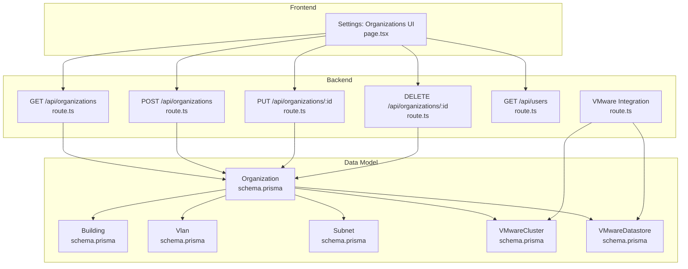
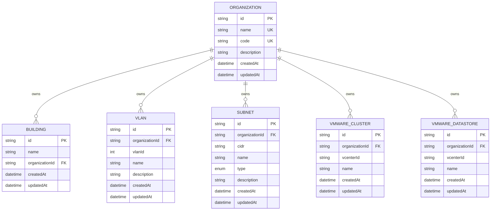
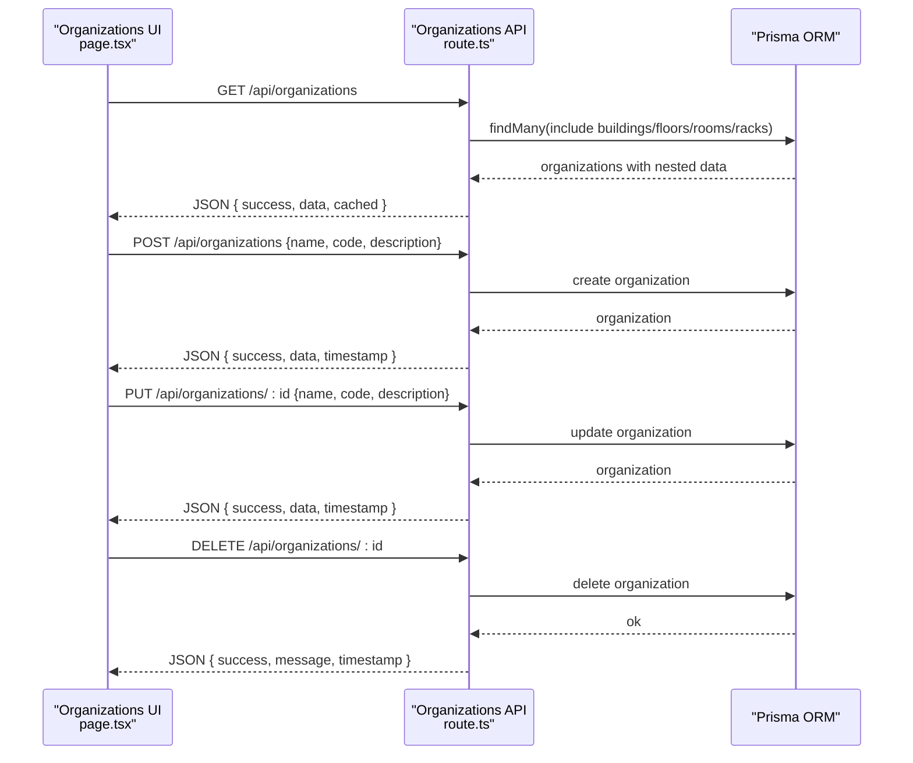
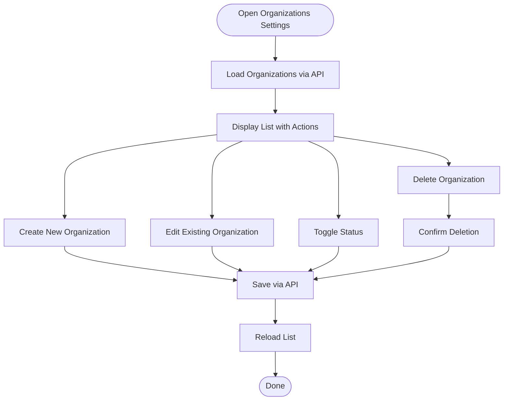
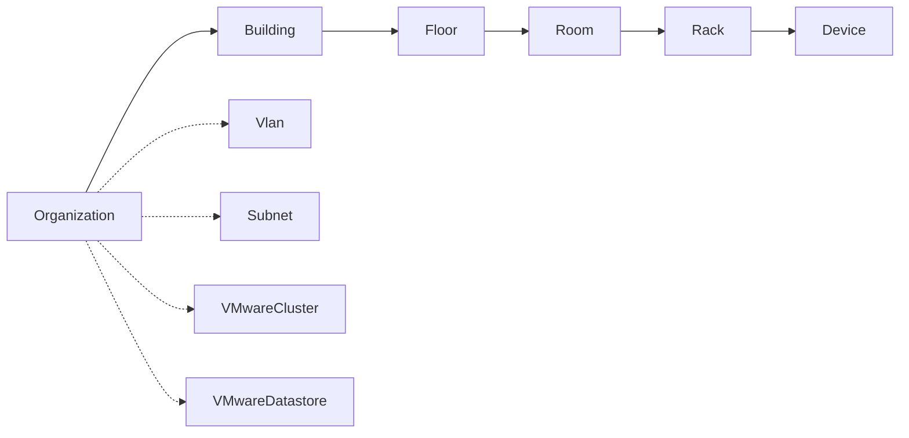
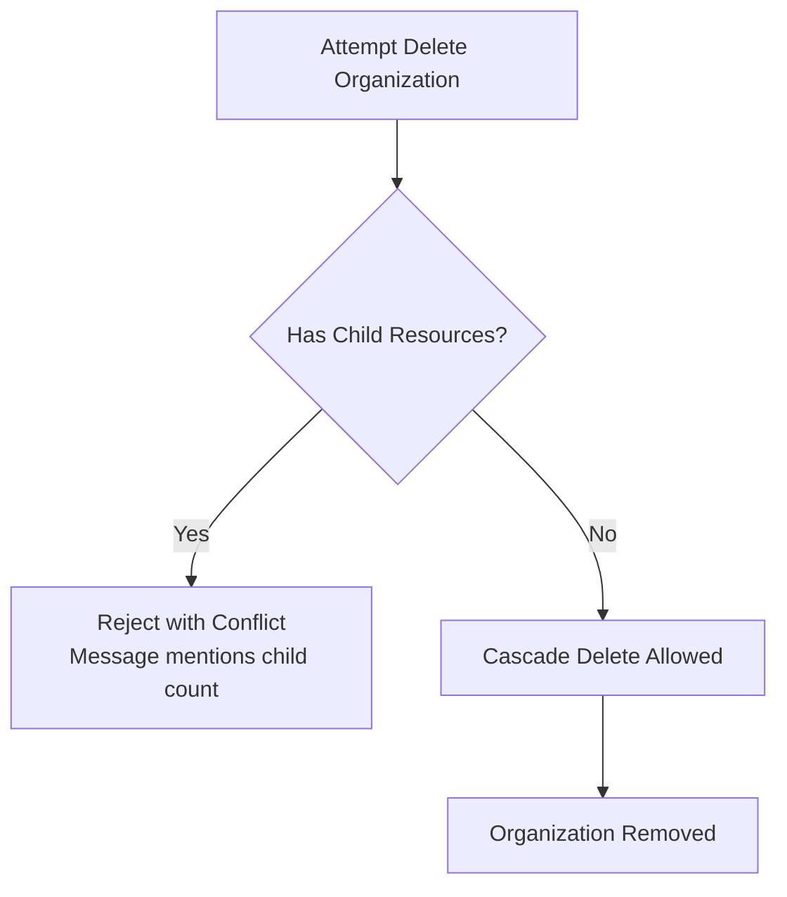
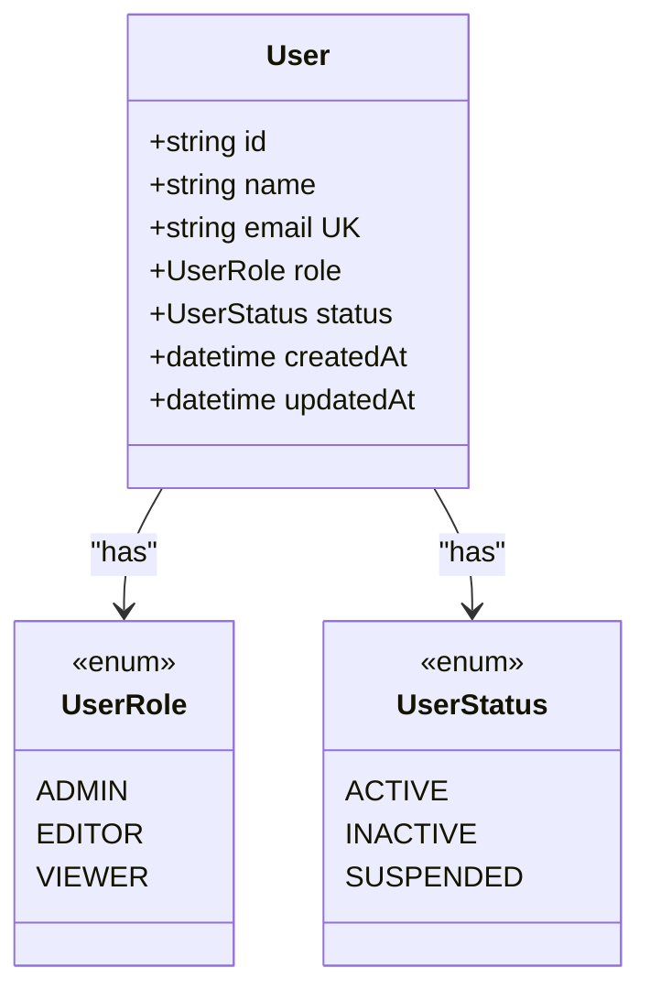
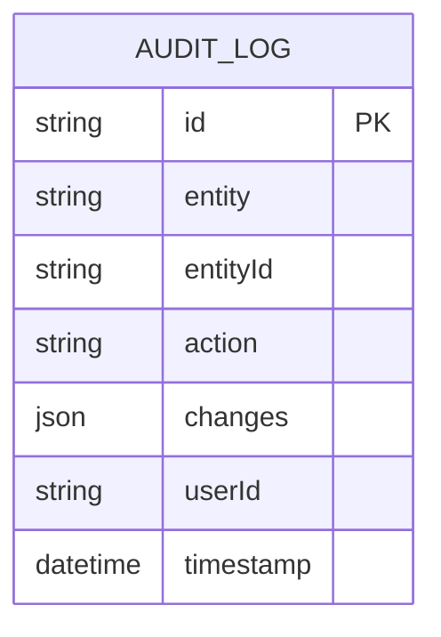
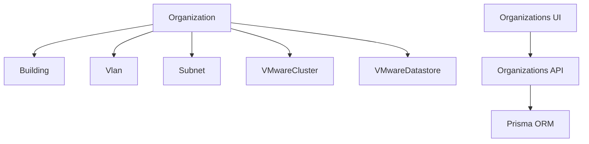

# Organizational Administration

<cite>
**Referenced Files in This Document**
- [route.ts](file://app/api/organizations/route.ts)
- [route.ts](file://app/api/organizations/[id]/route.ts)
- [page.tsx](file://app/settings/organizations/page.tsx)
- [schema.prisma](file://prisma/schema.prisma)
- [BUILDINGS_API_SUMMARY.md](file://docs/20-modules/inventory/BUILDINGS_API_SUMMARY.md)
- [API_ORGANIZATIONS.md](file://docs/20-modules/inventory/API_ORGANIZATIONS.md)
- [ORGANIZATIONS_API_SUMMARY.md](file://docs/20-modules/inventory/ORGANIZATIONS_API_SUMMARY.md)
- [route.ts](file://app/api/users/route.ts)
- [route.ts](file://app/api/integrations/vmware/route.ts)
- [api.ts](file://lib/api.ts)
</cite>

## Table of Contents
1. [Introduction](#introduction)
2. [Project Structure](#project-structure)
3. [Core Components](#core-components)
4. [Architecture Overview](#architecture-overview)
5. [Detailed Component Analysis](#detailed-component-analysis)
6. [Dependency Analysis](#dependency-analysis)
7. [Performance Considerations](#performance-considerations)
8. [Troubleshooting Guide](#troubleshooting-guide)
9. [Conclusion](#conclusion)
10. [Appendices](#appendices)

## Introduction
This document explains the organizational administration features in InfraScope with a focus on multi-tenancy, organization hierarchy, tenant isolation, and administrative workflows. It covers how organizations are modeled, created, modified, and deleted; how branding and service configurations are represented; how roles and permissions are scoped; and how reporting and auditing are supported. Practical examples illustrate onboarding and administrative tasks.

## Project Structure
Organizational administration spans the frontend settings UI, backend API routes, and the Prisma data model. The organization entity is central to the inventory hierarchy and integrates with buildings, VLANs, subnets, and VMware resources.

**Diagram sources**
- [route.ts:9-88](file://app/api/organizations/route.ts#L9-L88)
- [route.ts:4-67](file://app/api/organizations/[id]/route.ts#L4-L67)
- [page.tsx:32-414](file://app/settings/organizations/page.tsx#L32-L414)
- [schema.prisma:10-25](file://prisma/schema.prisma#L10-L25)
- [route.ts:4-41](file://app/api/users/route.ts#L4-L41)
- [route.ts:26-96](file://app/api/integrations/vmware/route.ts#L26-L96)

**Section sources**
- [route.ts:1-125](file://app/api/organizations/route.ts#L1-L125)
- [route.ts:1-68](file://app/api/organizations/[id]/route.ts#L1-L68)
- [page.tsx:1-414](file://app/settings/organizations/page.tsx#L1-L414)
- [schema.prisma:10-25](file://prisma/schema.prisma#L10-L25)

## Core Components
- Organization entity: top-level tenant container with unique name and code, plus optional description and timestamps.
- Inventory hierarchy: organizations own buildings; buildings own floors; floors own rooms; rooms own racks; racks hold devices.
- Enterprise extensions: VLANs and subnets scoped per organization; VMware clusters and datastores scoped per organization.
- Administrative UI: list, search, create, update, and delete organizations; toggle status; view details.
- User management: roles and statuses for users; used to scope administrative actions.
- Integration hooks: VMware integration demonstrates organization-scoped resource synchronization.

**Section sources**
- [schema.prisma:10-25](file://prisma/schema.prisma#L10-L25)
- [BUILDINGS_API_SUMMARY.md:202-235](file://docs/20-modules/inventory/BUILDINGS_API_SUMMARY.md#L202-L235)
- [page.tsx:32-414](file://app/settings/organizations/page.tsx#L32-L414)
- [route.ts:4-41](file://app/api/users/route.ts#L4-L41)
- [route.ts:26-96](file://app/api/integrations/vmware/route.ts#L26-L96)

## Architecture Overview
InfraScope implements a strict multi-tenant architecture centered on the Organization entity. Tenant isolation is enforced by:
- Unique constraints on organization name and code.
- Foreign-key relationships ensuring child resources (buildings, VLANs, subnets, VMware resources) belong to a single organization.
- Deletion safeguards preventing orphaned or inconsistent states.

**Diagram sources**
- [schema.prisma:10-25](file://prisma/schema.prisma#L10-L25)
- [schema.prisma:57-76](file://prisma/schema.prisma#L57-L76)
- [schema.prisma:590-626](file://prisma/schema.prisma#L590-L626)
- [schema.prisma:628-667](file://prisma/schema.prisma#L628-L667)
- [schema.prisma:669-712](file://prisma/schema.prisma#L669-L712)

## Detailed Component Analysis

### Organization Management API
The organization API supports listing, creating, updating, and deleting organizations. It includes caching for listing and enforces required fields for creation.

**Diagram sources**
- [route.ts:9-88](file://app/api/organizations/route.ts#L9-L88)
- [route.ts:4-67](file://app/api/organizations/[id]/route.ts#L4-L67)
- [page.tsx:56-190](file://app/settings/organizations/page.tsx#L56-L190)

**Section sources**
- [route.ts:1-125](file://app/api/organizations/route.ts#L1-L125)
- [route.ts:1-68](file://app/api/organizations/[id]/route.ts#L1-L68)
- [API_ORGANIZATIONS.md:14-364](file://docs/20-modules/inventory/API_ORGANIZATIONS.md#L14-L364)
- [ORGANIZATIONS_API_SUMMARY.md:66-134](file://docs/20-modules/inventory/ORGANIZATIONS_API_SUMMARY.md#L66-L134)

### Organization Settings and Branding
The settings UI exposes editable fields for organization details and status toggling. While the current backend models include optional contact email and address fields, the UI currently focuses on name, description, status, and code. These fields align with branding and administrative contact needs.

**Diagram sources**
- [page.tsx:32-414](file://app/settings/organizations/page.tsx#L32-L414)
- [api.ts:10-56](file://lib/api.ts#L10-L56)

**Section sources**
- [page.tsx:32-414](file://app/settings/organizations/page.tsx#L32-L414)
- [api.ts:1-57](file://lib/api.ts#L1-L57)

### Organization Hierarchy Management
Organizations own buildings; buildings own floors; floors own rooms; rooms own racks; racks hold devices. This hierarchy ensures tenant isolation at each level.

**Diagram sources**
- [BUILDINGS_API_SUMMARY.md:202-235](file://docs/20-modules/inventory/BUILDINGS_API_SUMMARY.md#L202-L235)
- [schema.prisma:10-25](file://prisma/schema.prisma#L10-L25)
- [schema.prisma:57-76](file://prisma/schema.prisma#L57-L76)
- [schema.prisma:590-626](file://prisma/schema.prisma#L590-L626)
- [schema.prisma:628-667](file://prisma/schema.prisma#L628-L667)
- [schema.prisma:669-712](file://prisma/schema.prisma#L669-L712)

**Section sources**
- [BUILDINGS_API_SUMMARY.md:202-235](file://docs/20-modules/inventory/BUILDINGS_API_SUMMARY.md#L202-L235)
- [schema.prisma:10-25](file://prisma/schema.prisma#L10-L25)

### Tenant Isolation Mechanisms
Tenant isolation is enforced by:
- Unique constraints on organization name and code.
- Foreign keys linking child entities to a single organization.
- Deletion safeguards preventing removal of organizations with child resources.

**Diagram sources**
- [API_ORGANIZATIONS.md:254-294](file://docs/20-modules/inventory/API_ORGANIZATIONS.md#L254-L294)

**Section sources**
- [API_ORGANIZATIONS.md:254-294](file://docs/20-modules/inventory/API_ORGANIZATIONS.md#L254-L294)

### Organizational Role Assignments and Permission Scoping
User roles and statuses are defined and exposed via the users API. Administrative workflows can leverage these roles to scope access to organization-related operations.

**Diagram sources**
- [schema.prisma:27-54](file://prisma/schema.prisma#L27-L54)
- [route.ts:4-41](file://app/api/users/route.ts#L4-L41)

**Section sources**
- [schema.prisma:27-54](file://prisma/schema.prisma#L27-L54)
- [route.ts:4-41](file://app/api/users/route.ts#L4-L41)

### Organizational Reporting and Audit Logging
- Audit logging: a dedicated audit log model captures entity changes with user context and timestamps.
- Reporting: enterprise extensions include capacity metrics and VMware metrics that can be aggregated per organization for reporting.

**Diagram sources**
- [schema.prisma:389-402](file://prisma/schema.prisma#L389-L402)

**Section sources**
- [schema.prisma:389-402](file://prisma/schema.prisma#L389-L402)

### Practical Examples

#### Example: Organization Setup
- Create an organization with a unique name and code.
- Optionally set description, contact email, and address via the UI.
- Verify organization appears in the list and can be edited or deleted safely.

**Section sources**
- [API_ORGANIZATIONS.md:75-110](file://docs/20-modules/inventory/API_ORGANIZATIONS.md#L75-L110)
- [page.tsx:90-160](file://app/settings/organizations/page.tsx#L90-L160)

#### Example: Tenant Onboarding
- Ensure the organization exists before creating buildings.
- Use the buildings API to add locations; relationships cascade to floors, rooms, and racks.

**Section sources**
- [BUILDINGS_API_SUMMARY.md:202-235](file://docs/20-modules/inventory/BUILDINGS_API_SUMMARY.md#L202-L235)

#### Example: Administrative Workflows
- Toggle organization status to activate or deactivate tenants.
- Use the users API to manage administrators and editors scoped to organization contexts.

**Section sources**
- [page.tsx:176-190](file://app/settings/organizations/page.tsx#L176-L190)
- [route.ts:4-41](file://app/api/users/route.ts#L4-L41)

## Dependency Analysis
Organizations are central to inventory and enterprise extensions. The following diagram highlights key dependencies.

**Diagram sources**
- [schema.prisma:10-25](file://prisma/schema.prisma#L10-L25)
- [schema.prisma:57-76](file://prisma/schema.prisma#L57-L76)
- [schema.prisma:590-626](file://prisma/schema.prisma#L590-L626)
- [schema.prisma:628-667](file://prisma/schema.prisma#L628-L667)
- [schema.prisma:669-712](file://prisma/schema.prisma#L669-L712)
- [page.tsx:32-414](file://app/settings/organizations/page.tsx#L32-L414)
- [route.ts:9-88](file://app/api/organizations/route.ts#L9-L88)

**Section sources**
- [schema.prisma:10-25](file://prisma/schema.prisma#L10-L25)
- [page.tsx:32-414](file://app/settings/organizations/page.tsx#L32-L414)
- [route.ts:1-125](file://app/api/organizations/route.ts#L1-L125)

## Performance Considerations
- Listing organizations uses a cache TTL to reduce database load.
- Nested queries include only required fields to minimize payload size.
- Pagination and search are supported in the organizations API documentation.

**Section sources**
- [route.ts:4-8](file://app/api/organizations/route.ts#L4-L8)
- [API_ORGANIZATIONS.md:14-71](file://docs/20-modules/inventory/API_ORGANIZATIONS.md#L14-L71)
- [ORGANIZATIONS_API_SUMMARY.md:80-84](file://docs/20-modules/inventory/ORGANIZATIONS_API_SUMMARY.md#L80-L84)

## Troubleshooting Guide
Common issues and resolutions:
- Duplicate organization name or code: creation fails with a conflict error; choose unique identifiers.
- Attempted deletion of organization with child resources: deletion blocked; remove child resources first.
- Invalid input validation: missing required fields cause a bad request error.
- API failures: the UI surfaces generic errors; inspect browser network tab and server logs.

**Section sources**
- [API_ORGANIZATIONS.md:254-307](file://docs/20-modules/inventory/API_ORGANIZATIONS.md#L254-L307)
- [route.ts:95-101](file://app/api/organizations/route.ts#L95-L101)
- [page.tsx:119-160](file://app/settings/organizations/page.tsx#L119-L160)

## Conclusion
InfraScope’s organizational administration provides a robust, multi-tenant foundation. Organizations serve as the tenant boundary, with strict isolation enforced by unique constraints and foreign keys. The settings UI and API enable efficient onboarding, maintenance, and lifecycle management. Enterprise extensions like VLANs, subnets, and VMware resources are naturally scoped to organizations, supporting comprehensive reporting and auditability.

## Appendices

### API Definitions: Organizations
- Base URL: http://localhost:3000/api/organizations
- Endpoints:
  - GET /api/organizations
  - POST /api/organizations
  - PUT /api/organizations/:id
  - DELETE /api/organizations/:id

**Section sources**
- [API_ORGANIZATIONS.md:5-364](file://docs/20-modules/inventory/API_ORGANIZATIONS.md#L5-L364)