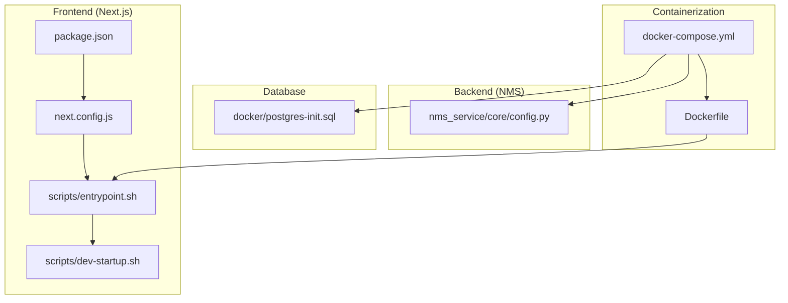
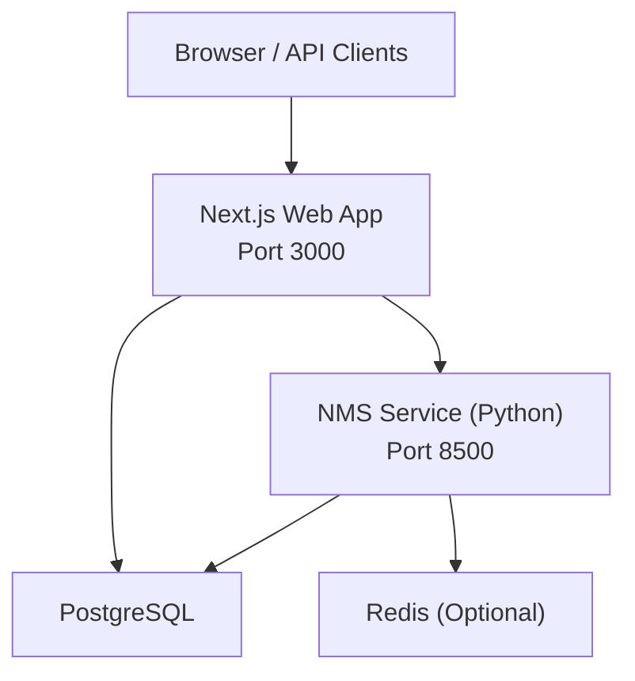
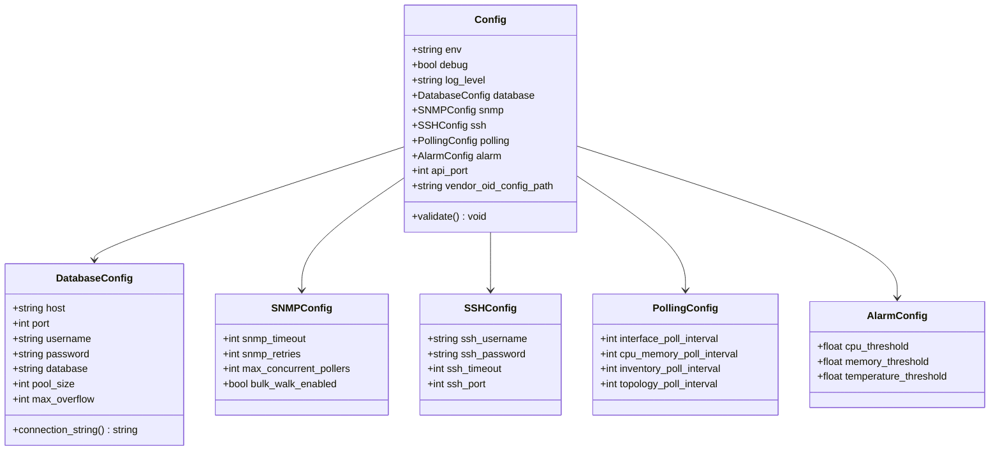
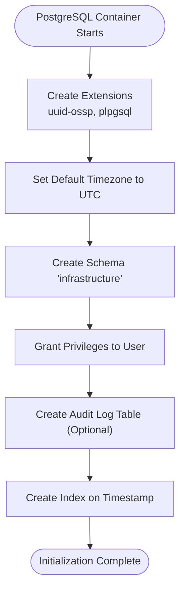
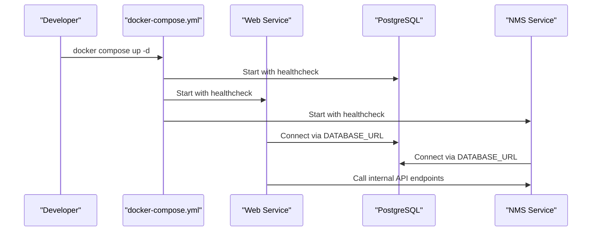
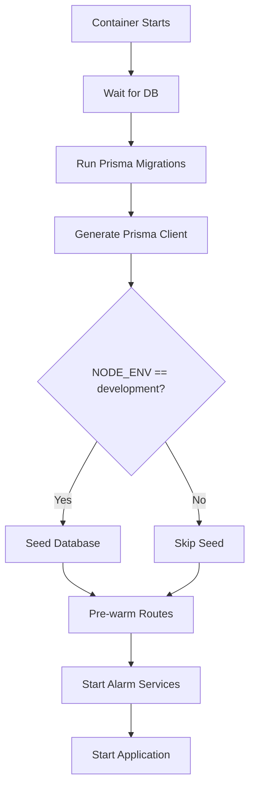
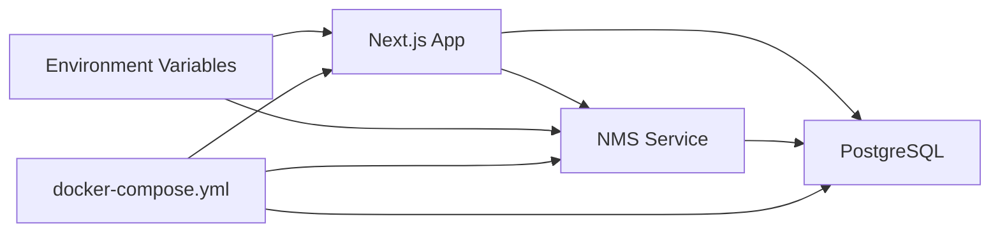

# System Configuration

<cite>
**Referenced Files in This Document**
- [package.json](file://package.json)
- [next.config.js](file://next.config.js)
- [Dockerfile](file://Dockerfile)
- [docker-compose.yml](file://docker-compose.yml)
- [nms_service/core/config.py](file://nms_service/core/config.py)
- [lib/prisma.ts](file://lib/prisma.ts)
- [scripts/entrypoint.sh](file://scripts/entrypoint.sh)
- [scripts/dev-startup.sh](file://scripts/dev-startup.sh)
- [docker/postgres-init.sql](file://docker/postgres-init.sql)
</cite>

## Table of Contents
1. [Introduction](#introduction)
2. [Project Structure](#project-structure)
3. [Core Components](#core-components)
4. [Architecture Overview](#architecture-overview)
5. [Detailed Component Analysis](#detailed-component-analysis)
6. [Dependency Analysis](#dependency-analysis)
7. [Performance Considerations](#performance-considerations)
8. [Troubleshooting Guide](#troubleshooting-guide)
9. [Conclusion](#conclusion)
10. [Appendices](#appendices)

## Introduction
This document explains how InfraScope manages system configuration across environments. It covers application configuration options, environment variable handling, runtime settings, key management for integrations, alert configuration and notification preferences, performance tuning parameters, cache configurations, resource limits, backup and restore procedures for configuration data, and strategies to maintain configuration consistency across environments.

## Project Structure
InfraScope’s configuration spans:
- Frontend (Next.js): build-time and runtime configuration, caching, and asset delivery
- Backend services: NMS Python service configuration and database connectivity
- Database initialization and schema setup
- Container orchestration and environment provisioning

**Diagram sources**
- [package.json:1-71](file://package.json#L1-L71)
- [next.config.js:1-62](file://next.config.js#L1-L62)
- [scripts/entrypoint.sh:1-88](file://scripts/entrypoint.sh#L1-L88)
- [scripts/dev-startup.sh:1-58](file://scripts/dev-startup.sh#L1-L58)
- [nms_service/core/config.py:1-172](file://nms_service/core/config.py#L1-L172)
- [docker/postgres-init.sql:1-38](file://docker/postgres-init.sql#L1-L38)
- [Dockerfile:1-115](file://Dockerfile#L1-L115)
- [docker-compose.yml:1-153](file://docker-compose.yml#L1-L153)

**Section sources**
- [package.json:1-71](file://package.json#L1-L71)
- [next.config.js:1-62](file://next.config.js#L1-L62)
- [Dockerfile:1-115](file://Dockerfile#L1-L115)
- [docker-compose.yml:1-153](file://docker-compose.yml#L1-L153)
- [nms_service/core/config.py:1-172](file://nms_service/core/config.py#L1-L172)
- [docker/postgres-init.sql:1-38](file://docker/postgres-init.sql#L1-L38)
- [scripts/entrypoint.sh:1-88](file://scripts/entrypoint.sh#L1-L88)
- [scripts/dev-startup.sh:1-58](file://scripts/dev-startup.sh#L1-L58)

## Core Components
- Next.js configuration and caching policy
- Environment-driven configuration for NMS service
- Database initialization and schema setup
- Container orchestration and environment provisioning
- Prisma client configuration and logging controls
- Startup scripts for migrations, seeding, and pre-warming

Key configuration areas:
- Application configuration options and environment variables
- Runtime settings for alarms, polling, and thresholds
- Notification and alerting preferences
- Performance tuning parameters and cache configurations
- Resource limits and container health checks
- Backup and restore procedures for configuration data
- Maintaining configuration consistency across environments

**Section sources**
- [next.config.js:1-62](file://next.config.js#L1-L62)
- [nms_service/core/config.py:71-172](file://nms_service/core/config.py#L71-L172)
- [lib/prisma.ts:1-21](file://lib/prisma.ts#L1-L21)
- [docker/postgres-init.sql:1-38](file://docker/postgres-init.sql#L1-L38)
- [docker-compose.yml:1-153](file://docker-compose.yml#L1-L153)
- [Dockerfile:1-115](file://Dockerfile#L1-L115)
- [scripts/entrypoint.sh:1-88](file://scripts/entrypoint.sh#L1-L88)
- [scripts/dev-startup.sh:1-58](file://scripts/dev-startup.sh#L1-L58)

## Architecture Overview
The system relies on environment variables to configure both frontend and backend services. The NMS service reads configuration from environment variables and writes metrics and state into the shared PostgreSQL database. The frontend uses Prisma to connect to the database and applies caching headers for performance. Docker Compose orchestrates services with health checks and persistent volumes.

**Diagram sources**
- [docker-compose.yml:31-115](file://docker-compose.yml#L31-L115)
- [nms_service/core/config.py:71-172](file://nms_service/core/config.py#L71-L172)
- [lib/prisma.ts:10-21](file://lib/prisma.ts#L10-L21)

## Detailed Component Analysis

### Next.js Application Configuration
- Build and runtime behavior controlled via next.config.js
- Caching headers configured for static assets and selected API routes
- Transpilation and optimization settings for performance
- Scripts to build, start, and develop the application

Environment variables commonly used:
- NODE_ENV, PORT, HOSTNAME
- DATABASE_URL (shared with backend)
- NEXTAUTH_URL, NEXTAUTH_SECRET
- NEXT_PUBLIC_API_URL, INTERNAL_API_URL
- PRISMA_LOG_QUERIES (controls Prisma query logging)

Operational behavior:
- Health checks and pre-warming of routes during startup
- Automatic Prisma client generation and migrations at startup

**Section sources**
- [next.config.js:1-62](file://next.config.js#L1-L62)
- [package.json:5-14](file://package.json#L5-L14)
- [scripts/entrypoint.sh:22-41](file://scripts/entrypoint.sh#L22-L41)
- [lib/prisma.ts:10-21](file://lib/prisma.ts#L10-L21)

### NMS Service Configuration
The NMS service centralizes configuration via environment variables and a typed configuration class. It supports:
- Database connectivity via DATABASE_URL or individual DB_* variables
- SNMP and SSH polling configuration
- Polling intervals for interfaces, CPU/memory, inventory, and topology
- Alarm thresholds for CPU, memory, and temperature
- Vendor OID configuration path
- Logging level and debug flags

Validation ensures production safety (e.g., requiring a database password).

**Diagram sources**
- [nms_service/core/config.py:12-172](file://nms_service/core/config.py#L12-L172)

**Section sources**
- [nms_service/core/config.py:71-172](file://nms_service/core/config.py#L71-L172)

### Database Initialization and Schema Setup
PostgreSQL initialization sets up required extensions, default timezone, schema, and optional audit logging. It also creates indexes for performance.

**Diagram sources**
- [docker/postgres-init.sql:6-31](file://docker/postgres-init.sql#L6-L31)

**Section sources**
- [docker/postgres-init.sql:1-38](file://docker/postgres-init.sql#L1-L38)

### Container Orchestration and Environment Provisioning
Docker Compose defines:
- Services: web (Next.js), db (PostgreSQL), nms (NMS)
- Environment variables for each service
- Health checks and restart policies
- Persistent volumes for database and logs
- Port mappings and network configuration

**Diagram sources**
- [docker-compose.yml:5-115](file://docker-compose.yml#L5-L115)

**Section sources**
- [docker-compose.yml:1-153](file://docker-compose.yml#L1-153)

### Prisma Client Configuration
Prisma client is initialized as a singleton with configurable logging. Query logging can be enabled via an environment variable for diagnostics.

**Section sources**
- [lib/prisma.ts:1-21](file://lib/prisma.ts#L1-L21)

### Startup Scripts and Runtime Behavior
- entrypoint.sh: waits for DB readiness, runs Prisma migrations and client generation, seeds in development, pre-warms routes, and starts alarm services
- dev-startup.sh: similar behavior for development mode

**Diagram sources**
- [scripts/entrypoint.sh:11-88](file://scripts/entrypoint.sh#L11-L88)
- [scripts/dev-startup.sh:12-58](file://scripts/dev-startup.sh#L12-L58)

**Section sources**
- [scripts/entrypoint.sh:1-88](file://scripts/entrypoint.sh#L1-L88)
- [scripts/dev-startup.sh:1-58](file://scripts/dev-startup.sh#L1-L58)

## Dependency Analysis
- Frontend depends on backend services for data and internal API calls
- NMS depends on shared PostgreSQL for persistence
- Both services depend on environment variables for configuration
- Docker Compose coordinates service dependencies and health checks

**Diagram sources**
- [docker-compose.yml:5-115](file://docker-compose.yml#L5-L115)
- [nms_service/core/config.py:74-110](file://nms_service/core/config.py#L74-L110)
- [lib/prisma.ts:10-21](file://lib/prisma.ts#L10-L21)

**Section sources**
- [docker-compose.yml:1-153](file://docker-compose.yml#L1-L153)
- [nms_service/core/config.py:71-172](file://nms_service/core/config.py#L71-L172)
- [lib/prisma.ts:1-21](file://lib/prisma.ts#L1-L21)

## Performance Considerations
- Caching headers for static assets and selected API endpoints reduce latency and bandwidth
- Route pre-warming at startup improves first-load performance
- Prisma query logging disabled by default to minimize I/O overhead
- Polling intervals and jitter help avoid thundering herds and balance load
- Container health checks and restart policies improve reliability

Recommendations:
- Tune polling intervals based on device count and network conditions
- Enable Prisma query logging temporarily for diagnostics only
- Adjust cache-control headers for API endpoints as needed
- Monitor NMS log level and thresholds in production

**Section sources**
- [next.config.js:19-58](file://next.config.js#L19-L58)
- [scripts/entrypoint.sh:66-78](file://scripts/entrypoint.sh#L66-L78)
- [lib/prisma.ts:13-15](file://lib/prisma.ts#L13-L15)
- [nms_service/core/config.py:126-147](file://nms_service/core/config.py#L126-L147)

## Troubleshooting Guide
Common configuration issues and resolutions:
- Database connectivity failures
  - Verify DATABASE_URL or individual DB_* variables
  - Ensure PostgreSQL is healthy and reachable
- Prisma migration errors
  - Check migration status and run manual migrations if needed
  - Regenerate Prisma client after schema changes
- Alarm services not starting
  - Confirm server health endpoint responds
  - Check alarm scheduler and monitor endpoints
- Development startup delays
  - Increase timeouts or adjust pre-warming steps
- NMS thresholds and polling misconfiguration
  - Review environment variables for thresholds and intervals
  - Validate SNMP/SSH credentials and timeouts

**Section sources**
- [nms_service/core/config.py:79-110](file://nms_service/core/config.py#L79-L110)
- [scripts/entrypoint.sh:11-26](file://scripts/entrypoint.sh#L11-L26)
- [scripts/entrypoint.sh:51-84](file://scripts/entrypoint.sh#L51-L84)
- [scripts/dev-startup.sh:14-28](file://scripts/dev-startup.sh#L14-L28)

## Conclusion
InfraScope’s configuration model leverages environment variables and declarative orchestration to deliver a consistent, scalable platform. By centralizing configuration in environment variables, using health checks and migrations at startup, and applying performance-aware caching and polling strategies, the system achieves reliability and maintainability across environments.

## Appendices

### Environment Variables Reference

- Next.js application
  - NODE_ENV, PORT, HOSTNAME
  - DATABASE_URL
  - NEXTAUTH_URL, NEXTAUTH_SECRET
  - NEXT_PUBLIC_API_URL, INTERNAL_API_URL
  - PRISMA_LOG_QUERIES

- NMS service
  - NMS_ENV, NMS_DEBUG, NMS_LOG_LEVEL
  - DATABASE_URL or DB_HOST, DB_PORT, DB_USER, DB_PASSWORD, DB_NAME, DB_POOL_SIZE
  - SNMP_TIMEOUT, SNMP_RETRIES, MAX_CONCURRENT_POLLERS
  - SSH_USERNAME, SSH_PASSWORD, SSH_TIMEOUT, SSH_PORT, SSH_MAX_CONCURRENT
  - POLL_JITTER_MAX
  - POLL_INTERVAL_SNMP_OK, POLL_INTERVAL_SSH_ONLY, POLL_INTERVAL_UNSTABLE
  - INTERFACE_POLL_INTERVAL, CPU_MEMORY_POLL_INTERVAL, INVENTORY_POLL_INTERVAL, TOPOLOGY_POLL_INTERVAL
  - CPU_THRESHOLD, MEMORY_THRESHOLD, TEMPERATURE_THRESHOLD
  - NMS_API_PORT
  - VENDOR_OID_CONFIG_PATH

- Container orchestration
  - DB_USER, DB_PASSWORD, DB_NAME
  - NEXTAUTH_SECRET
  - NMS_BACKEND_URL

**Section sources**
- [next.config.js:37-48](file://next.config.js#L37-L48)
- [nms_service/core/config.py:74-156](file://nms_service/core/config.py#L74-L156)
- [docker-compose.yml:10-50](file://docker-compose.yml#L10-L50)

### Backup and Restore Procedures for Configuration Data
- Database backup
  - Use standard PostgreSQL backup utilities to back up the database volume or logical dump
  - Preserve schema and data for audit logs and configuration tables
- Restore
  - Restore into a new or existing database and ensure environment variables point to the restored database
  - Re-run migrations and regenerate Prisma client if schema changed
- Configuration consistency
  - Store environment variables in a secure secret manager
  - Use identical environment files across environments (development, staging, production)
  - Validate configuration via health checks and basic API tests

**Section sources**
- [docker/postgres-init.sql:6-31](file://docker/postgres-init.sql#L6-L31)
- [scripts/entrypoint.sh:22-30](file://scripts/entrypoint.sh#L22-L30)
- [Dockerfile:90-95](file://Dockerfile#L90-L95)