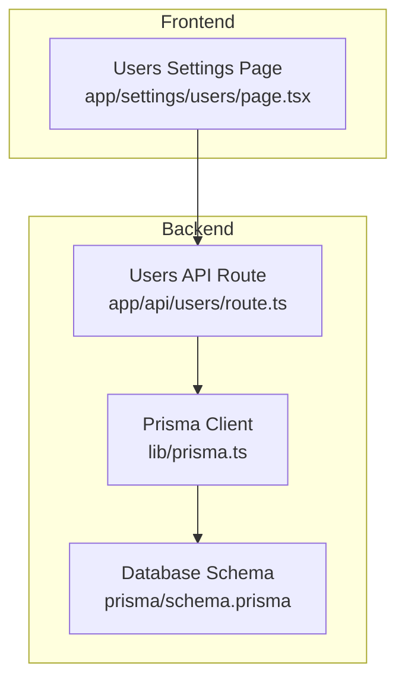
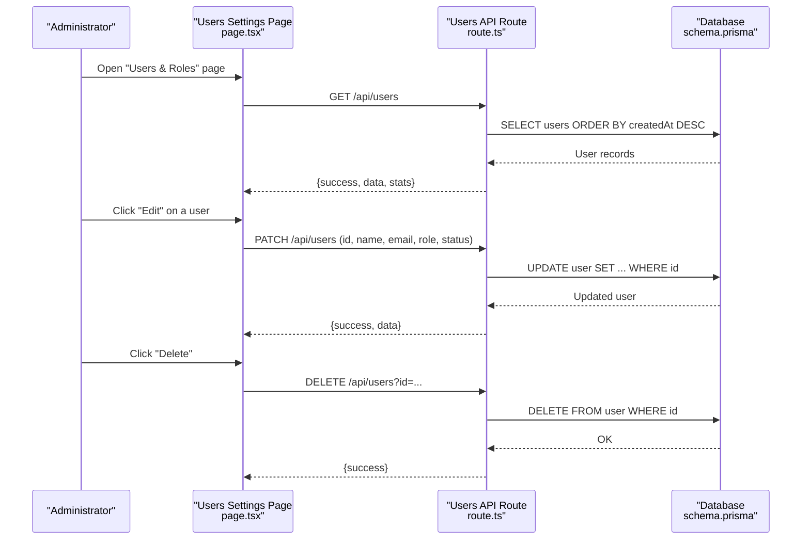
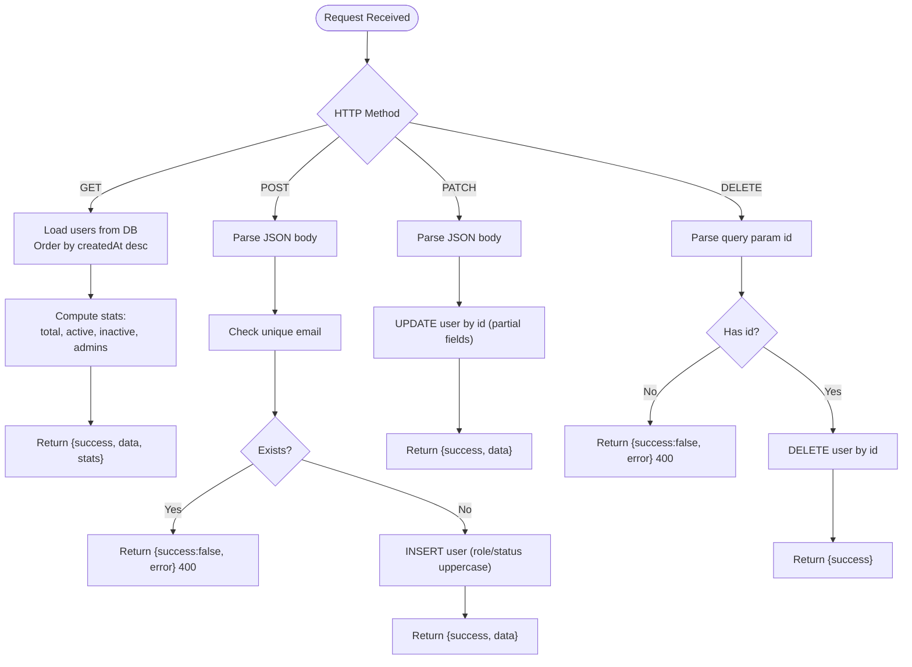
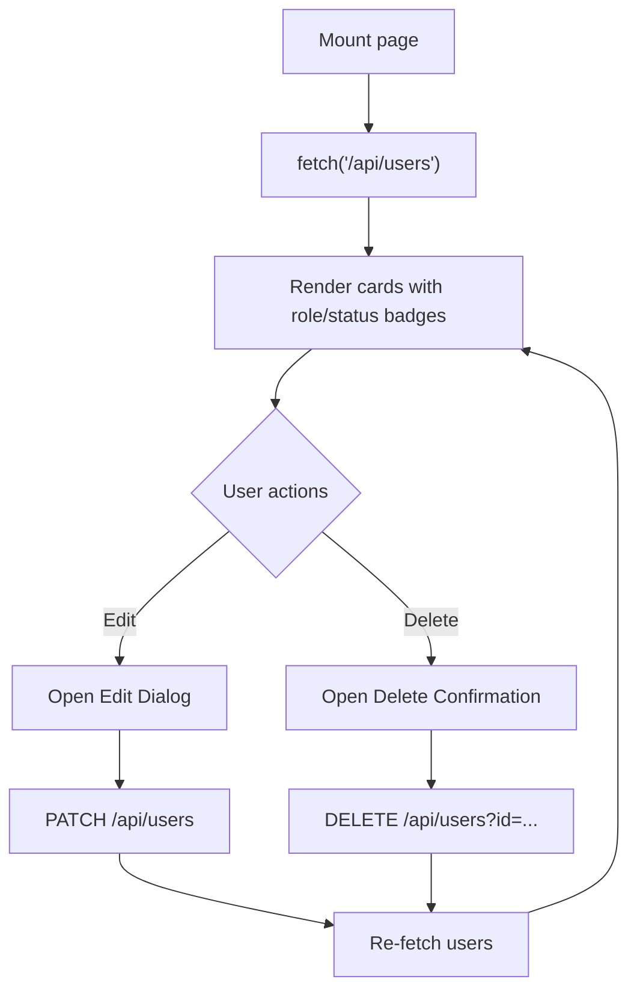
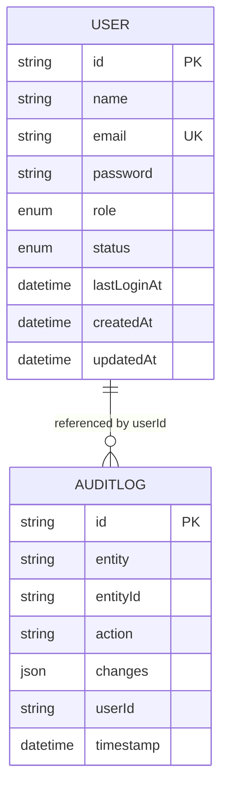
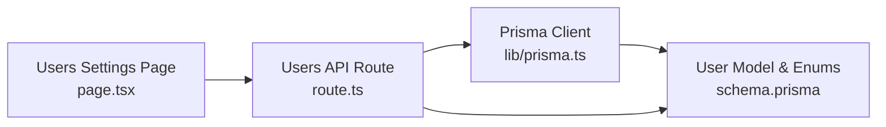

# User Management

<cite>
**Referenced Files in This Document**
- [app/api/users/route.ts](file://app/api/users/route.ts)
- [app/settings/users/page.tsx](file://app/settings/users/page.tsx)
- [lib/prisma.ts](file://lib/prisma.ts)
- [prisma/schema.prisma](file://prisma/schema.prisma)
- [lib/alarms/queries/auth-events.ts](file://lib/alarms/queries/auth-events.ts)
</cite>

## Table of Contents
1. [Introduction](#introduction)
2. [Project Structure](#project-structure)
3. [Core Components](#core-components)
4. [Architecture Overview](#architecture-overview)
5. [Detailed Component Analysis](#detailed-component-analysis)
6. [Dependency Analysis](#dependency-analysis)
7. [Performance Considerations](#performance-considerations)
8. [Troubleshooting Guide](#troubleshooting-guide)
9. [Conclusion](#conclusion)
10. [Appendices](#appendices)

## Introduction
This document describes the user management functionality in InfraScope. It covers user registration, authentication readiness, account lifecycle management, role-based access control (RBAC), permission assignment, profile management, password policies, session handling, onboarding workflows, bulk operations, deactivation procedures, audit trails, compliance reporting, and data protection measures. The goal is to provide both administrators and developers a clear understanding of how user data is modeled, how user operations are exposed, and how security and compliance are supported.

## Project Structure
User management spans the backend API routes, the frontend settings page, and the database schema. The backend uses a Next.js API route to expose CRUD operations for users. The frontend provides a settings page to list, edit, and delete users. The database schema defines the User model, roles, statuses, and audit logging capabilities.

**Diagram sources**
- [app/settings/users/page.tsx:1-345](file://app/settings/users/page.tsx#L1-L345)
- [app/api/users/route.ts:1-161](file://app/api/users/route.ts#L1-L161)
- [lib/prisma.ts:1-21](file://lib/prisma.ts#L1-L21)
- [prisma/schema.prisma:27-54](file://prisma/schema.prisma#L27-L54)

**Section sources**
- [app/settings/users/page.tsx:1-345](file://app/settings/users/page.tsx#L1-L345)
- [app/api/users/route.ts:1-161](file://app/api/users/route.ts#L1-L161)
- [lib/prisma.ts:1-21](file://lib/prisma.ts#L1-L21)
- [prisma/schema.prisma:27-54](file://prisma/schema.prisma#L27-L54)

## Core Components
- User model and enums: The database schema defines the User model with role and status enums, along with indexes and timestamps.
- API endpoints: The users API route exposes GET (list), POST (create), PATCH (update), and DELETE (remove) operations.
- Frontend settings page: Renders user list, edit dialog, and delete confirmation; integrates with the users API.
- Prisma client: Provides a singleton client used by the API route to interact with the database.

Key implementation highlights:
- Role and status normalization: Roles and statuses are uppercased on creation/update; displayed in lowercase for UI consistency.
- Email uniqueness: Creation enforces unique email constraint at the API level.
- Stats aggregation: The GET endpoint computes user statistics (total, active, inactive, admin count).
- Time formatting: Last login is presented as a human-friendly relative time.

**Section sources**
- [prisma/schema.prisma:27-54](file://prisma/schema.prisma#L27-L54)
- [app/api/users/route.ts:4-41](file://app/api/users/route.ts#L4-L41)
- [app/api/users/route.ts:57-100](file://app/api/users/route.ts#L57-L100)
- [app/api/users/route.ts:102-134](file://app/api/users/route.ts#L102-L134)
- [app/api/users/route.ts:136-161](file://app/api/users/route.ts#L136-L161)
- [app/settings/users/page.tsx:24-31](file://app/settings/users/page.tsx#L24-L31)

## Architecture Overview
The user management flow connects the frontend UI to the backend API and database through Prisma.

**Diagram sources**
- [app/settings/users/page.tsx:48-65](file://app/settings/users/page.tsx#L48-L65)
- [app/settings/users/page.tsx:85-115](file://app/settings/users/page.tsx#L85-L115)
- [app/settings/users/page.tsx:117-140](file://app/settings/users/page.tsx#L117-L140)
- [app/api/users/route.ts:4-41](file://app/api/users/route.ts#L4-L41)
- [app/api/users/route.ts:102-134](file://app/api/users/route.ts#L102-L134)
- [app/api/users/route.ts:136-161](file://app/api/users/route.ts#L136-L161)
- [prisma/schema.prisma:27-42](file://prisma/schema.prisma#L27-L42)

## Detailed Component Analysis

### Backend API: Users Route
Responsibilities:
- List users with computed stats.
- Create users with email uniqueness enforcement.
- Update users (partial updates supported).
- Delete users by ID.

Behavioral notes:
- Role and status are normalized to uppercase before persistence.
- Email must be unique; attempting to create a duplicate returns an error.
- Deletion requires an ID query parameter.

**Diagram sources**
- [app/api/users/route.ts:4-41](file://app/api/users/route.ts#L4-L41)
- [app/api/users/route.ts:57-100](file://app/api/users/route.ts#L57-L100)
- [app/api/users/route.ts:102-134](file://app/api/users/route.ts#L102-L134)
- [app/api/users/route.ts:136-161](file://app/api/users/route.ts#L136-L161)

**Section sources**
- [app/api/users/route.ts:4-41](file://app/api/users/route.ts#L4-L41)
- [app/api/users/route.ts:57-100](file://app/api/users/route.ts#L57-L100)
- [app/api/users/route.ts:102-134](file://app/api/users/route.ts#L102-L134)
- [app/api/users/route.ts:136-161](file://app/api/users/route.ts#L136-L161)

### Frontend: Users Settings Page
Responsibilities:
- Fetch and render the user list with role badges and status indicators.
- Provide an edit dialog to update name, email, role, and status.
- Provide a delete confirmation dialog.
- Display last login time in a friendly relative format.

Key UI behaviors:
- Uses a refresh button to reload users.
- Edit dialog supports selecting role and status from dropdowns.
- Delete dialog warns about irreversible action.

**Diagram sources**
- [app/settings/users/page.tsx:48-65](file://app/settings/users/page.tsx#L48-L65)
- [app/settings/users/page.tsx:67-83](file://app/settings/users/page.tsx#L67-L83)
- [app/settings/users/page.tsx:85-115](file://app/settings/users/page.tsx#L85-L115)
- [app/settings/users/page.tsx:117-140](file://app/settings/users/page.tsx#L117-L140)

**Section sources**
- [app/settings/users/page.tsx:33-345](file://app/settings/users/page.tsx#L33-L345)

### Database Model: User, Roles, and Statuses
The User model defines identity, role, status, and timestamps. Enums provide controlled values for roles and statuses. Indexes optimize lookups.

**Diagram sources**
- [prisma/schema.prisma:27-54](file://prisma/schema.prisma#L27-L54)
- [prisma/schema.prisma:389-402](file://prisma/schema.prisma#L389-L402)

**Section sources**
- [prisma/schema.prisma:27-54](file://prisma/schema.prisma#L27-L54)
- [prisma/schema.prisma:389-402](file://prisma/schema.prisma#L389-L402)

### RBAC Implementation and Permission Assignment
- Roles: ADMIN, EDITOR, VIEWER are defined as an enum.
- Statuses: ACTIVE, INACTIVE, SUSPENDED are defined as an enum.
- Permissions: The current implementation does not define separate permission matrices. Access control relies on role values. Administrators can manage users; editors and viewers have read-only or limited capabilities depending on higher-level routing and middleware.

Recommendations:
- Define granular permissions per resource/action and enforce them at the API boundary.
- Enforce RBAC checks in middleware or route handlers before invoking business logic.

**Section sources**
- [prisma/schema.prisma:44-54](file://prisma/schema.prisma#L44-L54)
- [app/api/users/route.ts:74-81](file://app/api/users/route.ts#L74-L81)
- [app/api/users/route.ts:107-115](file://app/api/users/route.ts#L107-L115)

### Password Policies and Authentication
- Password storage: The User model includes a password field; however, the users API route does not implement authentication flows (login/logout) or password policy enforcement.
- Authentication readiness: There is no login endpoint, session management, or password hashing/validation in the users API.
- Security implications: Without explicit authentication endpoints and password policies, the system cannot enforce secure password requirements or protect sessions.

Recommendations:
- Implement a dedicated authentication module with login/logout endpoints, password hashing, and session management.
- Enforce password policies (length, complexity, expiry) and multi-factor authentication where applicable.
- Store only hashed passwords and avoid exposing cleartext credentials.

**Section sources**
- [prisma/schema.prisma:32](file://prisma/schema.prisma#L32)
- [app/api/users/route.ts:57-100](file://app/api/users/route.ts#L57-L100)

### Session Handling
- No session endpoints or session store are present in the users API.
- The User model includes a last login timestamp; however, the API does not populate it upon authentication.
- Recommendations:
  - Implement login/logout endpoints that establish and terminate sessions.
  - Track lastLoginAt during successful authentication.
  - Enforce session timeouts and secure cookie policies.

**Section sources**
- [prisma/schema.prisma:35](file://prisma/schema.prisma#L35)
- [app/api/users/route.ts:43-55](file://app/api/users/route.ts#L43-L55)

### User Profile Management
- Name and email are editable via the PATCH endpoint.
- Role and status are editable via the PATCH endpoint.
- The frontend renders role badges and status badges for quick visibility.

Recommendations:
- Expand profile fields (department, title, phone) and make them editable.
- Add profile picture upload and avatar management.
- Implement profile visibility controls (public/private).

**Section sources**
- [app/api/users/route.ts:102-134](file://app/api/users/route.ts#L102-L134)
- [app/settings/users/page.tsx:152-163](file://app/settings/users/page.tsx#L152-L163)

### Account Lifecycle Management
- Create: POST with name, email, optional role/status defaults to viewer/active.
- Update: PATCH supports partial updates for name, email, role, status.
- Delete: DELETE removes a user by ID.
- Stats: GET aggregates totals and counts by role/status.

Recommendations:
- Add soft deletion and restore workflows.
- Implement user archival and GDPR-compliant deletion.
- Add lifecycle transitions (provisioning, activation, suspension, deactivation).

**Section sources**
- [app/api/users/route.ts:57-100](file://app/api/users/route.ts#L57-L100)
- [app/api/users/route.ts:102-134](file://app/api/users/route.ts#L102-L134)
- [app/api/users/route.ts:136-161](file://app/api/users/route.ts#L136-L161)
- [app/api/users/route.ts:21-27](file://app/api/users/route.ts#L21-L27)

### User Onboarding Workflows
- Manual onboarding: Administrators create users with appropriate roles and statuses.
- Bulk onboarding: The current API does not expose bulk user creation; implement batch endpoints for importing users from CSV or JSON.

Recommendations:
- Provide a bulk import endpoint with validation and error reporting.
- Support provisioning templates and auto-assignment of roles based on attributes.

**Section sources**
- [app/api/users/route.ts:57-100](file://app/api/users/route.ts#L57-L100)

### User Deactivation Procedures
- Deactivate by setting status to INACTIVE or SUSPENDED.
- Soft deactivation: Keep records for audit/compliance; hard deletion: DELETE endpoint.

Recommendations:
- Enforce cascading effects (disable access, revoke tokens, invalidate sessions).
- Log deactivation events in the audit trail.

**Section sources**
- [prisma/schema.prisma:50-54](file://prisma/schema.prisma#L50-L54)
- [app/api/users/route.ts:107-115](file://app/api/users/route.ts#L107-L115)
- [app/api/users/route.ts:136-161](file://app/api/users/route.ts#L136-L161)

### Audit Trails and Compliance Reporting
- AuditLog model captures entity changes with userId, action, and timestamp.
- Use audit logs to track user creation, updates, and deletions for compliance.

Recommendations:
- Enforce mandatory audit logging for all user lifecycle events.
- Provide audit report exports and searchable dashboards.

**Section sources**
- [prisma/schema.prisma:389-402](file://prisma/schema.prisma#L389-L402)

### Security Policies and Monitoring
- Authentication event queries exist for detecting failed/admin logins and off-hours activity.
- These queries demonstrate how security events are captured and evaluated.

Recommendations:
- Integrate user lifecycle events into the alarm engine.
- Enforce account lockout policies and monitor suspicious activity.

**Section sources**
- [lib/alarms/queries/auth-events.ts:21-67](file://lib/alarms/queries/auth-events.ts#L21-L67)
- [lib/alarms/queries/auth-events.ts:82-104](file://lib/alarms/queries/auth-events.ts#L82-L104)

## Dependency Analysis
The users API route depends on Prisma for database operations. The frontend depends on the users API. The database schema defines the User model and related audit logging.

**Diagram sources**
- [app/settings/users/page.tsx:48-65](file://app/settings/users/page.tsx#L48-L65)
- [app/api/users/route.ts:1-2](file://app/api/users/route.ts#L1-L2)
- [lib/prisma.ts:10-20](file://lib/prisma.ts#L10-L20)
- [prisma/schema.prisma:27-54](file://prisma/schema.prisma#L27-L54)

**Section sources**
- [app/api/users/route.ts:1-2](file://app/api/users/route.ts#L1-L2)
- [lib/prisma.ts:10-20](file://lib/prisma.ts#L10-L20)
- [prisma/schema.prisma:27-54](file://prisma/schema.prisma#L27-L54)

## Performance Considerations
- Database indexing: The User model includes indexes on email and status, aiding lookups and filtering.
- Query efficiency: The GET endpoint orders by createdAt; consider pagination for large datasets.
- Prisma logging: Query logging is configurable; disable in production to reduce overhead.

Recommendations:
- Add pagination and filtering to the GET endpoint.
- Monitor slow queries and add composite indexes if needed.
- Cache frequently accessed user lists with appropriate invalidation.

**Section sources**
- [prisma/schema.prisma:39-41](file://prisma/schema.prisma#L39-L41)
- [lib/prisma.ts:13-16](file://lib/prisma.ts#L13-L16)

## Troubleshooting Guide
Common issues and resolutions:
- Duplicate email on creation: The API returns an error; ensure unique emails are used.
  - Section sources
    - [app/api/users/route.ts:62-72](file://app/api/users/route.ts#L62-L72)
- Missing user ID on delete: The API requires an id query parameter; include it in the request.
  - Section sources
    - [app/api/users/route.ts:138-146](file://app/api/users/route.ts#L138-L146)
- Role/status normalization: Values are uppercased before persistence; ensure UI sends correct values.
  - Section sources
    - [app/api/users/route.ts:78-79](file://app/api/users/route.ts#L78-L79)
    - [app/api/users/route.ts:112-113](file://app/api/users/route.ts#L112-L113)
- Stats mismatch: Verify that role/status values in the database match expected values.
  - Section sources
    - [app/api/users/route.ts:22-27](file://app/api/users/route.ts#L22-L27)

## Conclusion
InfraScope’s user management currently provides a solid foundation: a User model with roles and statuses, a users API for CRUD operations, and a settings page for administration. To achieve enterprise-grade user lifecycle management, RBAC enforcement, secure authentication, session handling, bulk operations, and comprehensive audit trails, the system should integrate dedicated authentication endpoints, password policies, session management, and expanded audit/logging capabilities.

## Appendices

### Practical Administration Tasks
- Create a new user:
  - Use POST /api/users with name, email, optional role/status.
  - Section sources
    - [app/api/users/route.ts:57-100](file://app/api/users/route.ts#L57-L100)
- Update a user’s role or status:
  - Use PATCH /api/users with id and desired fields.
  - Section sources
    - [app/api/users/route.ts:102-134](file://app/api/users/route.ts#L102-L134)
- Deactivate a user:
  - PATCH to set status to INACTIVE/SUSPENDED or DELETE by id.
  - Section sources
    - [app/api/users/route.ts:107-115](file://app/api/users/route.ts#L107-L115)
    - [app/api/users/route.ts:136-161](file://app/api/users/route.ts#L136-L161)
- View user statistics:
  - GET /api/users returns total, active, inactive, admin counts.
  - Section sources
    - [app/api/users/route.ts:21-27](file://app/api/users/route.ts#L21-L27)

### Permission Troubleshooting
- Symptom: Unexpected access denied.
  - Cause: Role insufficient for requested operation.
  - Resolution: Assign ADMIN or appropriate role; implement RBAC checks.
  - Section sources
    - [prisma/schema.prisma:44-54](file://prisma/schema.prisma#L44-L54)

### Security Best Practices
- Enforce strong password policies and hashing.
- Implement session timeouts and secure cookie flags.
- Monitor failed login attempts and off-hours access.
- Maintain audit logs for all user lifecycle events.
- Section sources
  - [lib/alarms/queries/auth-events.ts:21-67](file://lib/alarms/queries/auth-events.ts#L21-L67)
  - [prisma/schema.prisma:389-402](file://prisma/schema.prisma#L389-L402)