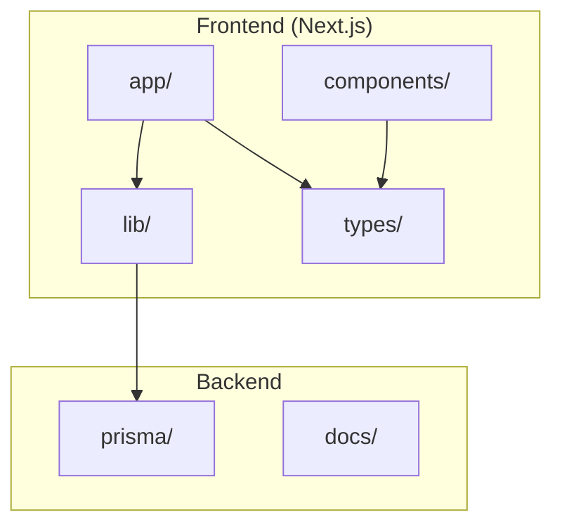
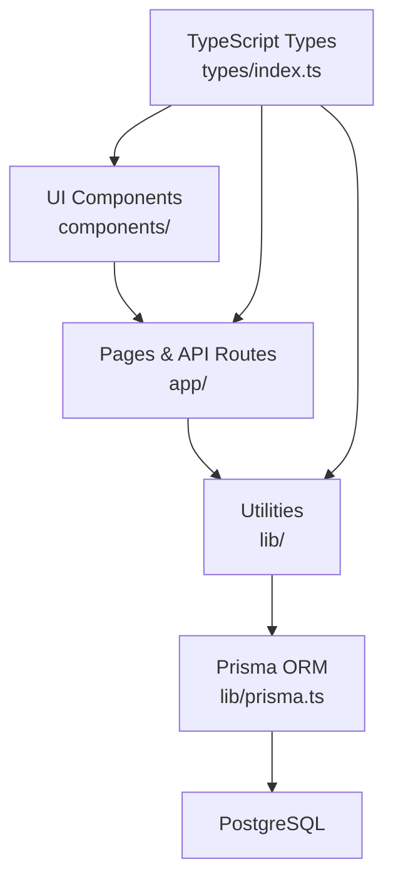
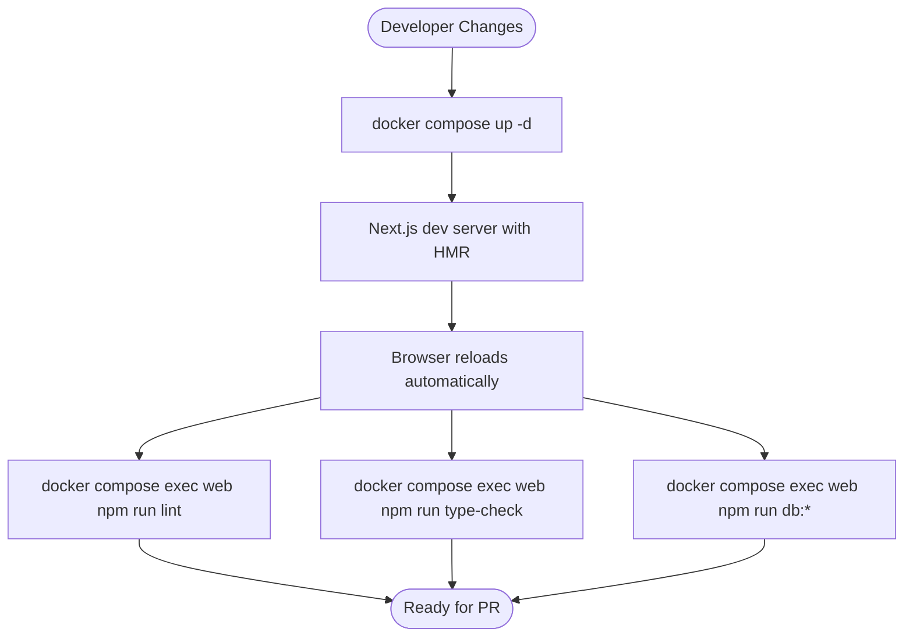
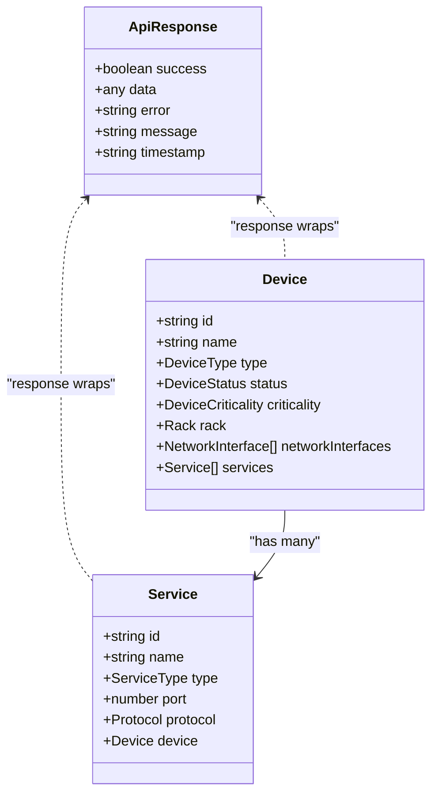
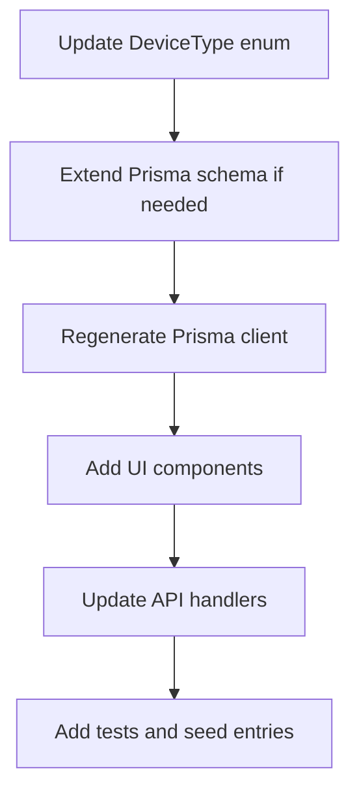
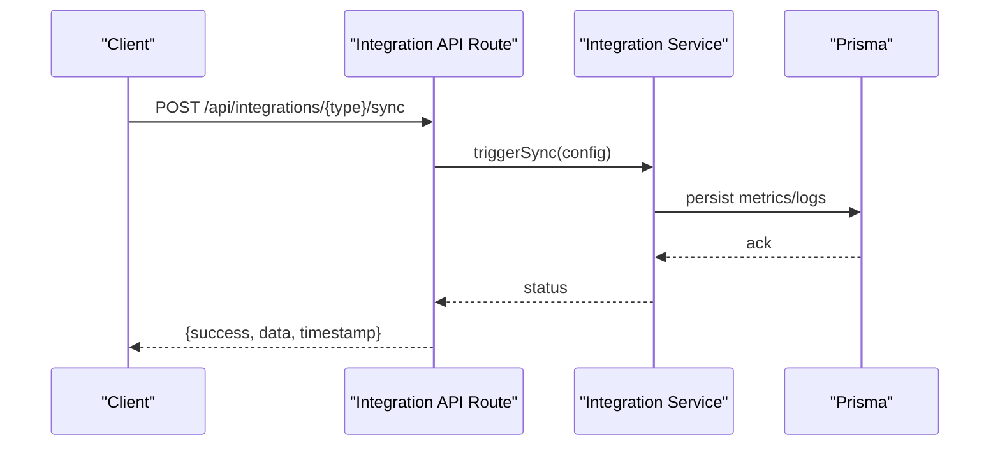
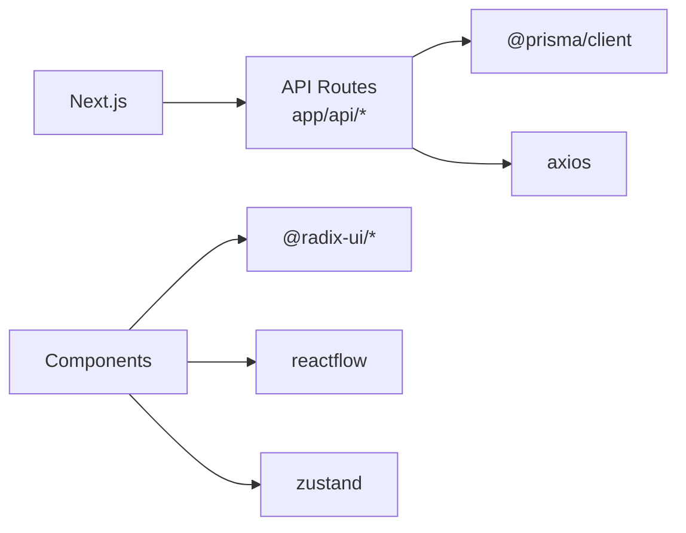

# Contributing & Extensions

<cite>
**Referenced Files in This Document**
- [README.md](file://README.md)
- [ARCHITECTURE.md](file://ARCHITECTURE.md)
- [DEV_WORKFLOW.md](file://DEV_WORKFLOW.md)
- [package.json](file://package.json)
- [tsconfig.json](file://tsconfig.json)
- [.eslintrc.json](file://.eslintrc.json)
- [types/index.ts](file://types/index.ts)
- [lib/api.ts](file://lib/api.ts)
- [lib/prisma.ts](file://lib/prisma.ts)
- [lib/integrations/index.ts](file://lib/integrations/index.ts)
- [app/api/devices/route.ts](file://app/api/devices/route.ts)
- [app/api/buildings/route.ts](file://app/api/buildings/route.ts)
- [app/api/services/route.ts](file://app/api/services/route.ts)
</cite>

## Table of Contents
1. [Introduction](#introduction)
2. [Project Structure](#project-structure)
3. [Core Components](#core-components)
4. [Architecture Overview](#architecture-overview)
5. [Detailed Component Analysis](#detailed-component-analysis)
6. [Dependency Analysis](#dependency-analysis)
7. [Performance Considerations](#performance-considerations)
8. [Troubleshooting Guide](#troubleshooting-guide)
9. [Conclusion](#conclusion)
10. [Appendices](#appendices)

## Introduction
This document consolidates contribution guidelines, development workflow, code standards, and extension development practices for the project. It explains how to contribute features and fixes, how code is reviewed, and how to extend the platform with new device types, integrations, and plugins. It also documents the type system, interface design, component extension patterns, testing and quality assurance expectations, and continuous integration practices.

## Project Structure
The project follows a modern full-stack architecture with a Next.js frontend, TypeScript strict mode, and a PostgreSQL backend powered by Prisma. The repository is organized into:
- app/: Next.js App Router pages and API routes
- components/: shared UI components
- lib/: utilities (API client, Prisma singleton)
- types/: centralized TypeScript definitions
- prisma/: schema and migrations
- docs/: operational and API documentation
- scripts/: helper scripts for setup and diagnostics
- docker/: containerization assets

**Diagram sources**
- [README.md:127-164](file://README.md#L127-L164)
- [ARCHITECTURE.md:28-103](file://ARCHITECTURE.md#L28-L103)

**Section sources**
- [README.md:127-164](file://README.md#L127-L164)
- [ARCHITECTURE.md:28-103](file://ARCHITECTURE.md#L28-L103)

## Core Components
- Type System: Centralized in types/index.ts with enums and interfaces for devices, services, networks, and API responses.
- API Layer: Next.js API routes under app/api/ implement CRUD and specialized queries with consistent response envelopes.
- Utilities: lib/api.ts provides a unified HTTP client; lib/prisma.ts exposes a singleton Prisma client.
- Integrations: lib/integrations/index.ts aggregates integration services (Zabbix, VMware, Fortinet) and exports shared types.

Key standards:
- Strict TypeScript mode enabled globally
- Consistent API response envelope with success, data/error, and timestamp
- Centralized configuration via environment variables and tsconfig.json

**Section sources**
- [types/index.ts:1-312](file://types/index.ts#L1-L312)
- [lib/api.ts:1-57](file://lib/api.ts#L1-L57)
- [lib/prisma.ts:1-21](file://lib/prisma.ts#L1-L21)
- [lib/integrations/index.ts:1-48](file://lib/integrations/index.ts#L1-L48)
- [tsconfig.json:18-26](file://tsconfig.json#L18-L26)
- [README.md:280-299](file://README.md#L280-L299)

## Architecture Overview
The system adheres to SOLID principles and clean architecture:
- Separation of concerns across layers (presentation, domain, data)
- Functional components with hooks and Tailwind CSS
- Strong typing and centralized enums for domain concepts
- Extensibility via JSONB fields and modular API routes

**Diagram sources**
- [ARCHITECTURE.md:208-228](file://ARCHITECTURE.md#L208-L228)
- [README.md:106-126](file://README.md#L106-L126)
- [lib/prisma.ts:1-21](file://lib/prisma.ts#L1-L21)
- [types/index.ts:1-312](file://types/index.ts#L1-L312)

**Section sources**
- [ARCHITECTURE.md:208-228](file://ARCHITECTURE.md#L208-L228)
- [README.md:106-126](file://README.md#L106-L126)

## Detailed Component Analysis

### Contribution Process and Code Review
- Follow TypeScript strict mode and functional components with hooks
- Use Tailwind CSS for styling and keep components focused and reusable
- Document complex logic and follow naming conventions
- Test locally before committing; run lint and type checks
- Keep pull requests scoped and add clear descriptions referencing issues

Review checklist:
- Code compiles and passes type checks
- Lint free and adheres to style guide
- Tests included where applicable
- API responses remain consistent
- No breaking changes to public types or routes

**Section sources**
- [ARCHITECTURE.md:354-363](file://ARCHITECTURE.md#L354-L363)
- [README.md:398-401](file://README.md#L398-L401)
- [package.json:9-14](file://package.json#L9-L14)
- [tsconfig.json:18-26](file://tsconfig.json#L18-L26)
- [.eslintrc.json:1-7](file://.eslintrc.json#L1-L7)

### Development Workflow
- Use Docker Compose for hot-reload development with volume mounting
- Start services with docker compose up -d and inspect logs with docker compose logs -f web
- Run lint and type checks inside the container for consistency
- Use npm scripts for database operations (push, migrate, studio, seed)

**Diagram sources**
- [DEV_WORKFLOW.md:14-32](file://DEV_WORKFLOW.md#L14-L32)
- [DEV_WORKFLOW.md:82-99](file://DEV_WORKFLOW.md#L82-L99)

**Section sources**
- [DEV_WORKFLOW.md:1-106](file://DEV_WORKFLOW.md#L1-L106)
- [package.json:5-14](file://package.json#L5-L14)

### Code Standards
- TypeScript strict mode enabled globally
- Full type safety across frontend and shared utilities
- Consistent API response envelope
- Centralized enums for domain concepts (DeviceType, ServiceType, etc.)
- ESLint with Next.js recommended rules for TypeScript

**Diagram sources**
- [types/index.ts:299-312](file://types/index.ts#L299-L312)
- [types/index.ts:110-136](file://types/index.ts#L110-L136)
- [types/index.ts:254-272](file://types/index.ts#L254-L272)

**Section sources**
- [tsconfig.json:18-26](file://tsconfig.json#L18-L26)
- [types/index.ts:1-312](file://types/index.ts#L1-L312)
- [.eslintrc.json:1-7](file://.eslintrc.json#L1-L7)

### Extension Development

#### Adding a New Device Type
- Extend DeviceType enum in types/index.ts
- If new fields are required, update the Prisma schema and regenerate the client
- Create device-type-specific components if needed
- Update API validation and handlers to accept new fields
- Add tests and update seed data if appropriate

**Diagram sources**
- [ARCHITECTURE.md:231-236](file://ARCHITECTURE.md#L231-L236)
- [types/index.ts:98-102](file://types/index.ts#L98-L102)

**Section sources**
- [ARCHITECTURE.md:231-236](file://ARCHITECTURE.md#L231-L236)
- [types/index.ts:98-102](file://types/index.ts#L98-L102)

#### Adding a New Service Type
- Add a new ServiceType enum value in types/index.ts
- Create service-specific UI components
- Update API endpoints to handle new service properties
- Ensure dependency and impact analysis remain consistent

**Section sources**
- [ARCHITECTURE.md:237-241](file://ARCHITECTURE.md#L237-L241)
- [types/index.ts:234-237](file://types/index.ts#L234-L237)

#### Integration Development
- Integrate with external systems via lib/integrations/*
- Expose integration endpoints under app/api/integrations/*
- Use a central IntegrationConfig and IntegrationStatus model
- Implement health checks, sync triggers, and test endpoints
- Respect caching and rate-limiting where applicable

**Diagram sources**
- [lib/integrations/index.ts:1-48](file://lib/integrations/index.ts#L1-L48)
- [app/api/integrations/vmware/route.ts:1-29](file://app/api/integrations/vmware/route.ts#L1-L29)

**Section sources**
- [lib/integrations/index.ts:1-48](file://lib/integrations/index.ts#L1-L48)
- [app/api/integrations/vmware/route.ts:1-29](file://app/api/integrations/vmware/route.ts#L1-L29)

#### Plugin Architecture
- Use re-export patterns in lib/integrations/index.ts to expose services and types
- Define IntegrationType union and IntegrationConfig for runtime configuration
- Keep integration logic isolated behind typed interfaces
- Provide health and status endpoints per integration

**Section sources**
- [lib/integrations/index.ts:28-48](file://lib/integrations/index.ts#L28-L48)

### Testing Requirements and Quality Assurance
- Run lint and type checks before submitting changes
- Ensure API routes return consistent response envelopes
- Validate database operations with Prisma Studio and migrations
- Use minimal/full modes in API endpoints to avoid unnecessary joins during testing

Recommended QA steps:
- npm run lint
- npm run type-check
- npm run db:studio to inspect schema and data
- Test API endpoints with curl or Postman using documented response formats

**Section sources**
- [package.json:9-14](file://package.json#L9-L14)
- [README.md:280-299](file://README.md#L280-L299)
- [app/api/devices/route.ts:42-71](file://app/api/devices/route.ts#L42-L71)
- [app/api/services/route.ts:10-27](file://app/api/services/route.ts#L10-L27)

### Continuous Integration Practices
- Enforce lint and type checks in CI pipelines
- Run database migrations and seed during CI setup
- Cache dependencies and build artifacts to speed up pipelines
- Use containerized jobs for reproducible builds

[No sources needed since this section provides general guidance]

## Dependency Analysis
The frontend depends on:
- Next.js App Router for routing and API routes
- Radix UI primitives for accessible UI
- Prisma client for database operations
- Axios for HTTP requests
- React Flow for topology visualization
- Zustand for state management

**Diagram sources**
- [package.json:16-56](file://package.json#L16-L56)
- [lib/api.ts:1-57](file://lib/api.ts#L1-L57)
- [lib/prisma.ts:6-20](file://lib/prisma.ts#L6-L20)

**Section sources**
- [package.json:16-56](file://package.json#L16-L56)

## Performance Considerations
- Use minimal/full modes in API endpoints to reduce payload sizes and joins
- Implement caching for frequently accessed data (e.g., buildings)
- Use pagination and limit query sizes
- Lazy load large components and leverage dynamic imports
- Monitor database queries and add indexes as needed

**Section sources**
- [app/api/devices/route.ts:42-71](file://app/api/devices/route.ts#L42-L71)
- [app/api/buildings/route.ts:4-79](file://app/api/buildings/route.ts#L4-L79)
- [ARCHITECTURE.md:254-273](file://ARCHITECTURE.md#L254-L273)

## Troubleshooting Guide
- TypeScript errors: run npm run type-check and clear .next cache if needed
- Prisma client issues: regenerate with npx prisma generate or reinstall dependencies
- Database connectivity: verify DATABASE_URL and use docker compose exec to connect to the database
- Hot reload not working: confirm docker compose ps and logs; hard refresh the browser

**Section sources**
- [DEV_WORKFLOW.md:54-106](file://DEV_WORKFLOW.md#L54-L106)
- [README.md:384-392](file://README.md#L384-L392)

## Conclusion
By following the established development workflow, code standards, and extension patterns, contributors can reliably add features, integrate new systems, and maintain high-quality code. Adhering to TypeScript strict mode, SOLID principles, and clean architecture ensures scalability and long-term maintainability.

## Appendices

### Practical Examples

- Feature Development Example: Adding a new device type
  - Update types/index.ts with a new DeviceType
  - Extend Prisma schema and regenerate client
  - Create UI components and update API handlers
  - Add tests and seed entries

- Bug Fix Example: Improving API response consistency
  - Ensure all endpoints return the standardized envelope
  - Add error handling and timestamp fields
  - Validate with automated checks

- Contribution Workflow Example
  - Fork and branch from main
  - Implement changes with tests and lint/type checks
  - Open a PR with a clear description and references to issues

**Section sources**
- [ARCHITECTURE.md:231-236](file://ARCHITECTURE.md#L231-L236)
- [README.md:280-299](file://README.md#L280-L299)
- [package.json:9-14](file://package.json#L9-L14)