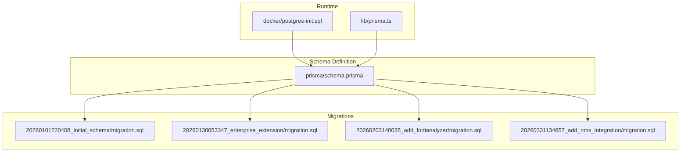
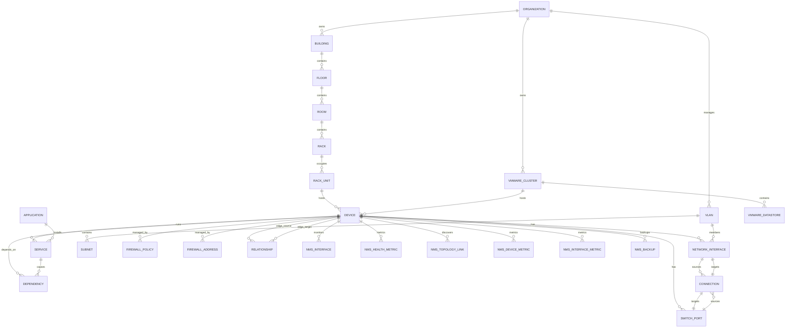
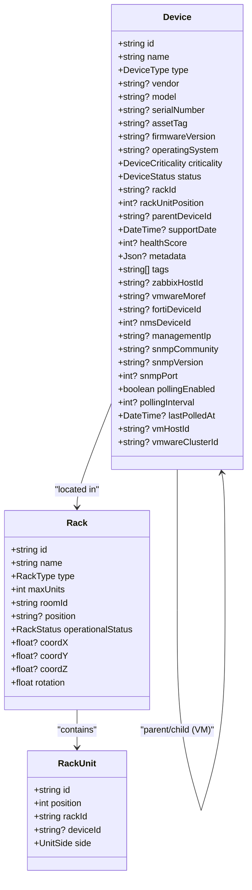
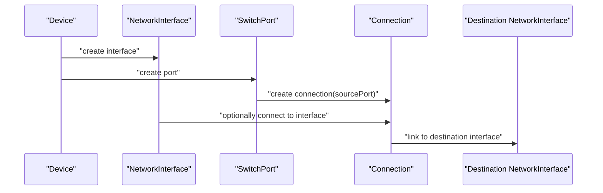
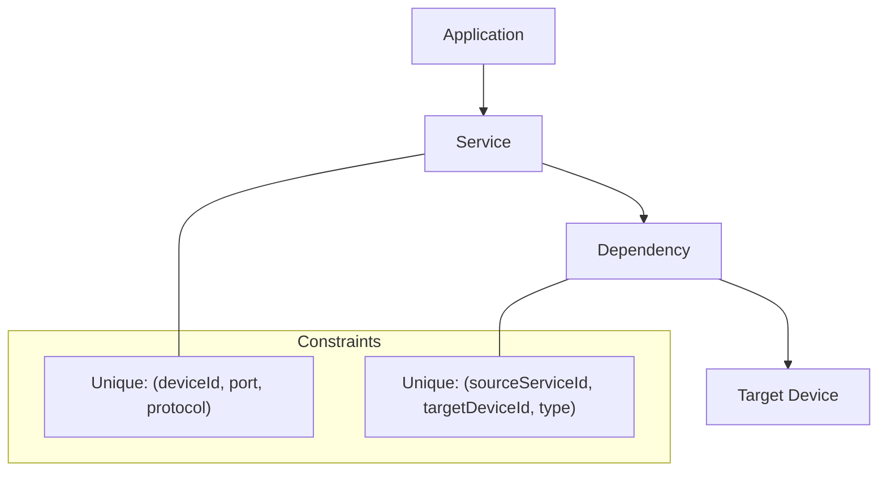
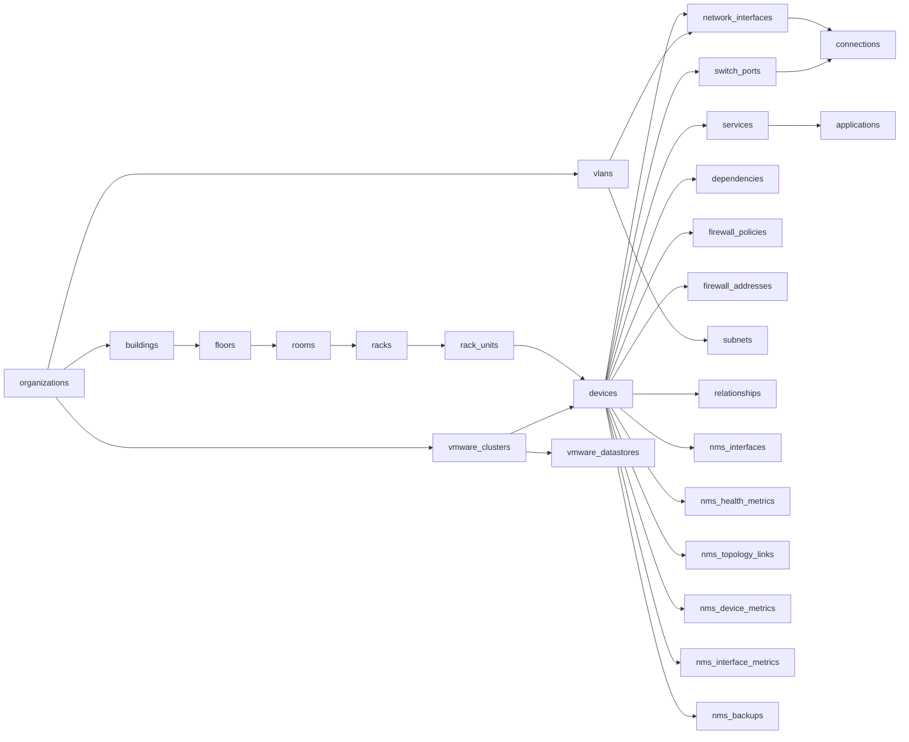

# Database Schema & Models

<cite>
**Referenced Files in This Document**
- [schema.prisma](file://prisma/schema.prisma)
- [initial_schema migration.sql](file://prisma/migrations/20260101220408_initial_schema/migration.sql)
- [enterprise_extension migration.sql](file://prisma/migrations/20260130053347_enterprise_extension/migration.sql)
- [add_fortianalyzer migration.sql](file://prisma/migrations/20260203140035_add_fortianalyzer/migration.sql)
- [add_nms_integration migration.sql](file://prisma/migrations/20260331134657_add_nms_integration/migration.sql)
- [postgres-init.sql](file://docker/postgres-init.sql)
- [prisma.ts](file://lib/prisma.ts)
- [migrate_nms_db.sql](file://scripts/migrate_nms_db.sql)
- [detection-engine.ts](file://lib/alarms/detection-engine.ts)
</cite>

## Table of Contents
1. [Introduction](#introduction)
2. [Project Structure](#project-structure)
3. [Core Components](#core-components)
4. [Architecture Overview](#architecture-overview)
5. [Detailed Component Analysis](#detailed-component-analysis)
6. [Dependency Analysis](#dependency-analysis)
7. [Performance Considerations](#performance-considerations)
8. [Troubleshooting Guide](#troubleshooting-guide)
9. [Conclusion](#conclusion)
10. [Appendices](#appendices)

## Introduction
This document provides comprehensive data model documentation for the InfraScope database schema. It details entity relationships across the hierarchical location structure (Organizations, Buildings, Floors, Rooms, Racks, and Units), Device entities with parent-child relationships for VMs and JSONB metadata, Network Interface, Switch Port, and Connection entities for network topology management, Application and Service entities with port/protocol tracking and dependency relationships, audit logs, health snapshots, and enterprise extension tables. It also documents primary/foreign keys, indexes, constraints, data validation rules, business logic enforcement, data lifecycle and retention considerations, migration strategies, and performance characteristics.

## Project Structure
InfraScope uses Prisma for schema definition and migrations. The schema is defined in a single Prisma schema file and applied through SQL migrations. The database initialization script sets up required Postgres extensions and schema permissions. A dedicated Prisma client singleton ensures consistent database access across the application.

**Diagram sources**
- [schema.prisma](file://prisma/schema.prisma)
- [initial_schema migration.sql](file://prisma/migrations/20260101220408_initial_schema/migration.sql)
- [enterprise_extension migration.sql](file://prisma/migrations/20260130053347_enterprise_extension/migration.sql)
- [add_fortianalyzer migration.sql](file://prisma/migrations/20260203140035_add_fortianalyzer/migration.sql)
- [add_nms_integration migration.sql](file://prisma/migrations/20260331134657_add_nms_integration/migration.sql)
- [postgres-init.sql](file://docker/postgres-init.sql)
- [prisma.ts](file://lib/prisma.ts)

**Section sources**
- [schema.prisma](file://prisma/schema.prisma)
- [prisma.ts](file://lib/prisma.ts)
- [postgres-init.sql](file://docker/postgres-init.sql)

## Core Components
This section outlines the primary entities and their relationships, focusing on the hierarchical location structure, device hierarchy, networking, applications/services, and enterprise extensions.

- Hierarchical Location Structure
  - Organization: Top-level tenant container with unique constraints on name and code.
  - Building: Belongs to an Organization; unique per organization by name.
  - Floor: Belongs to a Building; unique per building by floor number.
  - Room: Belongs to a Floor; unique per floor by name; supports optional dimensions.
  - Rack: Belongs to a Room; unique per room by name; supports coordinates and rotation.
  - RackUnit: Occupies a position in a Rack with side FRONT/REAR; optional device assignment.

- Device Model
  - Device: Physical or virtual device with type, vendor/model, serial/asset tags, firmware, OS, criticality, status, and optional metadata JSONB.
  - Parent-Child: Devices can have a parentDeviceId forming a VM-to-host hierarchy.
  - Location: Optional rackId and rackUnitPosition linking to Rack and RackUnit.
  - Integrations: Fields for Zabbix host ID, VMware MOREF, Fortinet device ID, and NMS integration (nms_device_id, management IP, SNMP settings).
  - Relationships: Many-to-many-like via Relationship edges and Service dependencies.

- Networking
  - NetworkInterface: Interfaces on a Device with IPv4/IPv6/MAC, type, status, optional VLAN association.
  - SwitchPort: Ports on switch-type Devices with VLAN membership, speed/duplex, status, and optional connection to an Interface.
  - Connection: Logical connections between SwitchPort and optional source/target Interface.

- Applications and Services
  - Application: Installed software with vendor/version/install path/license.
  - Service: Running service on a Device with type, display name, description, status, port, protocol, criticality, optional metadata JSONB, and optional Application linkage.

- Dependencies
  - Dependency: Links a Service to a target Device with a typed relationship and criticality.

- Enterprise Extensions
  - VLAN/Subnet: Network segmentation with optional gateway/VRF.
  - Firewall Policies/Addresses: FortiGate policy and address objects.
  - VMware Clusters/Datastores: vSphere resource containers.
  - Relationships: Typed edges between devices (contains, connects, virtual runs on, VLAN member, etc.).
  - Capacity Metrics: Time-series for CPU/memory/disk usage.
  - VM Snapshots: Snapshot records for VMs.

- Observability and Alarms
  - AuditLog: Immutable audit trail with JSONB changes.
  - DeviceHealthSnapshot: Historical device status and metrics.
  - Alarm Definitions/Events/Check Logs/Cached Events/Notification DLQ/Whitelist: Alarm management system.

- NMS Integration Tables
  - NmsInterface/NmsHealthMetric/NmsTopologyLink/NmsDiscoveryScan/NmsDiscoveredDevice/NmsDeviceMetric/NmsInterfaceMetric/NmsBackup: SNMP-based integration tables.

**Section sources**
- [schema.prisma](file://prisma/schema.prisma)
- [enterprise_extension migration.sql](file://prisma/migrations/20260130053347_enterprise_extension/migration.sql)
- [add_nms_integration migration.sql](file://prisma/migrations/20260331134657_add_nms_integration/migration.sql)

## Architecture Overview
The database architecture centers on a normalized relational schema with JSONB fields for flexible metadata and time-series tables for observability. Prisma manages schema evolution through migrations, while the application uses a singleton Prisma client for consistent access.

**Diagram sources**
- [schema.prisma](file://prisma/schema.prisma)
- [enterprise_extension migration.sql](file://prisma/migrations/20260130053347_enterprise_extension/migration.sql)
- [add_nms_integration migration.sql](file://prisma/migrations/20260331134657_add_nms_integration/migration.sql)

## Detailed Component Analysis

### Hierarchical Location Entities
- Organization
  - Primary keys: id
  - Unique constraints: name, code
  - Relationships: buildings[], vlans[], subnets[], vmwareClusters[], vmwareDatastores[]
- Building
  - Primary key: id
  - Unique constraint: (organizationId, name)
  - Foreign key: organizationId -> organizations.id (Cascade)
  - Relationships: floors[]
- Floor
  - Primary key: id
  - Unique constraint: (buildingId, floorNumber)
  - Foreign key: buildingId -> buildings.id (Cascade)
  - Relationships: rooms[]
- Room
  - Primary key: id
  - Unique constraint: (floorId, name)
  - Foreign key: floorId -> floors.id (Cascade)
  - Relationships: racks[]
- Rack
  - Primary key: id
  - Unique constraint: (roomId, name)
  - Foreign key: roomId -> rooms.id (Cascade)
  - Relationships: units[], devices[]
- RackUnit
  - Primary key: id
  - Unique constraint: (rackId, position, side)
  - Foreign keys: rackId -> racks.id (Cascade), deviceId -> devices.id (Set Null)
  - Relationships: device?, rack

**Section sources**
- [schema.prisma](file://prisma/schema.prisma)
- [initial_schema migration.sql](file://prisma/migrations/20260101220408_initial_schema/migration.sql)

### Device Model and VM Hierarchy
- Device
  - Primary key: id
  - Indexes: rackId, parentDeviceId, zabbixHostId, vmwareMoref, vmwareClusterId, nmsDeviceId
  - Optional foreign keys: rackId -> racks.id (Set Null), parentDeviceId -> devices.id (Set Null)
  - JSONB: metadata
  - Integration fields: zabbixHostId, vmwareMoref, fortiDeviceId, nms_device_id, management_ip, snmp_* fields
  - Relationships: networkInterfaces[], switchPorts[], services[], dependencies[], vmwareCluster?, firewallPolicies[], firewallAddresses[], sourceRelationships[], targetRelationships[], nmsInterfaces[], nmsHealthMetrics[], nmsTopologyLinks[], nmsDeviceMetrics[], nmsInterfaceMetrics[], nmsBackups[]
- VM Parent-Child
  - VMs are Devices with optional vmHostId linking to a parent Device (hypervisor/host)
  - Optional vmwareClusterId links to VMwareCluster

**Diagram sources**
- [schema.prisma](file://prisma/schema.prisma)

**Section sources**
- [schema.prisma](file://prisma/schema.prisma)

### Network Topology Entities
- NetworkInterface
  - Primary key: id
  - Unique constraint: (deviceId, name)
  - Foreign key: deviceId -> devices.id (Cascade)
  - Optional foreign key: vlanId -> vlans.id (Set Null)
  - Relationships: connections[], switchPorts[]
- SwitchPort
  - Primary key: id
  - Unique constraint: (switchDeviceId, name)
  - Foreign keys: switchDeviceId -> devices.id (Cascade), connectedToId -> network_interfaces.id (Set Null)
  - Relationships: connections[]
- Connection
  - Primary key: id
  - Foreign keys: sourcePortId -> switch_ports.id (Cascade), sourceInterfaceId -> network_interfaces.id (Cascade)
  - Optional foreign key: destPortId -> switch_ports.id (Set Null), destInterfaceId -> network_interfaces.id (Set Null)
  - Relationships: sourceInterface, sourcePort

**Diagram sources**
- [schema.prisma](file://prisma/schema.prisma)

**Section sources**
- [schema.prisma](file://prisma/schema.prisma)

### Applications, Services, and Dependencies
- Application
  - Primary key: id
  - Unique constraint: (name, version)
  - Relationships: services[]
- Service
  - Primary key: id
  - Unique constraint: (deviceId, port, protocol)
  - Foreign keys: deviceId -> devices.id (Cascade), applicationId -> applications.id (Set Null)
  - Indexes: deviceId, applicationId
  - JSONB: metadata
  - Relationships: dependencies[]
- Dependency
  - Primary key: id
  - Unique constraint: (sourceServiceId, targetDeviceId, type)
  - Foreign keys: sourceServiceId -> services.id (Cascade), targetDeviceId -> devices.id (Cascade)
  - Indexes: sourceServiceId, targetDeviceId

**Diagram sources**
- [schema.prisma](file://prisma/schema.prisma)

**Section sources**
- [schema.prisma](file://prisma/schema.prisma)

### Enterprise Extensions: VLANs, Subnets, Firewall, VMware, Relationships
- VLAN
  - Primary key: id
  - Unique constraint: (organizationId, vlanId)
  - Foreign key: organizationId -> organizations.id (Cascade)
  - Relationships: subnets[], interfaces[]
- Subnet
  - Primary key: id
  - Unique constraint: (organizationId, cidr)
  - Foreign keys: organizationId -> organizations.id (Cascade), vlanId -> vlans.id (Set Null)
- FirewallPolicy
  - Primary key: id
  - Unique constraint: (deviceId, policyId)
  - Foreign key: deviceId -> devices.id (Cascade)
  - JSONB: srcAddresses, dstAddresses, services, metadata
  - Indexes: deviceId
- FirewallAddress
  - Primary key: id
  - Foreign key: deviceId -> devices.id (Cascade)
  - Indexes: deviceId
- VMwareCluster
  - Primary key: id
  - Indexes: organizationId
  - Relationships: hosts[], datastores[]
- VMwareDatastore
  - Primary key: id
  - Indexes: organizationId, clusterId
  - Foreign keys: organizationId -> organizations.id (Cascade), clusterId -> vmware_clusters.id (Set Null)
- Relationship
  - Primary key: id
  - Indexes: sourceDeviceId, targetDeviceId, relationshipType
  - JSONB: properties
  - Enum: relationshipType includes CONTAINS, CONNECTS_TO, VIRTUAL_RUNS_ON, CLUSTER_CONTAINS, VLAN_MEMBER, FIREWALL_POLICY, SERVICE_DEPENDENCY, HA_PAIR, UPLINK, SPANNING_TREE

**Section sources**
- [schema.prisma](file://prisma/schema.prisma)
- [enterprise_extension migration.sql](file://prisma/migrations/20260130053347_enterprise_extension/migration.sql)

### Observability and Alarms
- AuditLog
  - Primary key: id
  - Indexes: entityId, timestamp
  - JSONB: changes
- DeviceHealthSnapshot
  - Primary key: id
  - Indexes: (deviceId, timestamp)
- Alarm Management Tables
  - AlarmDefinition, AlarmEvent, AlarmCheckLog, CachedEvent, NotificationConfig, SystemConfig, NotificationDLQ, AlarmWhitelist
  - JSONB fields for flexible payloads
  - Indexes optimized for time-series and lookup performance

**Section sources**
- [schema.prisma](file://prisma/schema.prisma)
- [add_nms_integration migration.sql](file://prisma/migrations/20260331134657_add_nms_integration/migration.sql)

### NMS Integration Tables
- NmsInterface
  - Primary key: id
  - Unique constraint: (nmsDeviceId, interfaceIndex)
  - Indexes: nmsDeviceId, admin_status, oper_status
- NmsHealthMetric
  - Primary key: id
  - Indexes: nmsDeviceId, collectedAt
- NmsTopologyLink
  - Primary key: id
  - Unique constraint: (nmsDeviceId, localInterface, remoteDeviceName)
  - Indexes: nmsDeviceId
- NmsDiscoveryScan
  - Primary key: id
  - Indexes: status, createdAt
- NmsDiscoveredDevice
  - Primary key: id
  - Unique constraint: (scanId, ipAddress)
  - Indexes: scanId, ipAddress
- NmsDeviceMetric
  - Primary key: id
  - Indexes: nmsDeviceId, metricType, collectedAt
- NmsInterfaceMetric
  - Primary key: id
  - Indexes: nmsDeviceId, interfaceIndex, collectedAt
- NmsBackup
  - Primary key: id
  - Indexes: nmsDeviceId, createdAt

**Section sources**
- [schema.prisma](file://prisma/schema.prisma)
- [add_nms_integration migration.sql](file://prisma/migrations/20260331134657_add_nms_integration/migration.sql)

## Dependency Analysis
This section maps direct and indirect dependencies among entities, highlighting foreign keys and indexes that enforce referential integrity and enable efficient queries.

**Diagram sources**
- [schema.prisma](file://prisma/schema.prisma)
- [initial_schema migration.sql](file://prisma/migrations/20260101220408_initial_schema/migration.sql)
- [enterprise_extension migration.sql](file://prisma/migrations/20260130053347_enterprise_extension/migration.sql)
- [add_nms_integration migration.sql](file://prisma/migrations/20260331134657_add_nms_integration/migration.sql)

**Section sources**
- [schema.prisma](file://prisma/schema.prisma)
- [initial_schema migration.sql](file://prisma/migrations/20260101220408_initial_schema/migration.sql)
- [enterprise_extension migration.sql](file://prisma/migrations/20260130053347_enterprise_extension/migration.sql)
- [add_nms_integration migration.sql](file://prisma/migrations/20260331134657_add_nms_integration/migration.sql)

## Performance Considerations
- Indexes
  - Devices: rackId, parentDeviceId, zabbixHostId, vmwareMoref, vmwareClusterId, nmsDeviceId
  - NetworkInterfaces: deviceId, (deviceId, name)
  - SwitchPorts: switchDeviceId, (switchDeviceId, name)
  - Connections: sourcePortId, sourceInterfaceId
  - Services: deviceId, applicationId, (deviceId, port, protocol)
  - Dependencies: sourceServiceId, targetDeviceId
  - AuditLogs: entityId, timestamp
  - DeviceHealthSnapshots: (deviceId, timestamp)
  - Enterprise: vlans (organizationId, vlanId), subnets (organizationId, cidr), firewall_policies/deviceId, vmware_clusters/organizationId, vmware_datastores (organizationId, clusterId), vm_snapshots(vmId)
  - Relationships: sourceDeviceId, targetDeviceId, relationshipType
  - NMS: nms_interfaces (nmsDeviceId, interfaceIndex), nms_health_metrics (nmsDeviceId, collectedAt), nms_topology_links (nmsDeviceId), nms_device_metrics (nmsDeviceId, metricType, collectedAt), nms_interface_metrics (nmsDeviceId, interfaceIndex, collectedAt), nms_backups (nmsDeviceId)
  - Alarms: alarm_events (alarmId, createdAt, severity), cached_events (logtype, eventTime), notification_dlq (status, nextRetry), alarm_whitelist (alarmCode, enabled)
- JSONB Usage
  - metadata fields on Device, Service, AuditLog, FirewallPolicy, FirewallAddress, AlarmDefinition, AlarmEvent, CachedEvent, NotificationDLQ, AlarmWhitelist enable flexible schema evolution without altering core tables.
- Time-Series Optimization
  - Indexed composite keys on timestamps (e.g., device_health_snapshots, nms_health_metrics, nms_device_metrics, cached_events) support efficient range queries.
- Prisma Client
  - Singleton client configured to minimize logging overhead; adjust PRISMA_LOG_QUERIES for diagnostics.

**Section sources**
- [schema.prisma](file://prisma/schema.prisma)
- [initial_schema migration.sql](file://prisma/migrations/20260101220408_initial_schema/migration.sql)
- [enterprise_extension migration.sql](file://prisma/migrations/20260130053347_enterprise_extension/migration.sql)
- [add_nms_integration migration.sql](file://prisma/migrations/20260331134657_add_nms_integration/migration.sql)
- [prisma.ts](file://lib/prisma.ts)

## Troubleshooting Guide
- Audit Trail
  - Use AuditLog to track entity changes; index on entityId and timestamp enables efficient lookups.
- Health Snapshots
  - DeviceHealthSnapshot provides historical status and metrics; composite index aids time-range queries.
- Alarm Suppression and Whitelist
  - The alarm detection engine checks whitelist entries and suppression rules; ensure integration configs are present and enabled.
- NMS Migration
  - The migration script inserts NMS switches into devices with unique nms_device_id; verify uniqueness and conflict resolution.
- Prisma Client
  - Ensure the singleton client is initialized and logging is disabled unless needed for diagnostics.

**Section sources**
- [schema.prisma](file://prisma/schema.prisma)
- [detection-engine.ts](file://lib/alarms/detection-engine.ts)
- [migrate_nms_db.sql](file://scripts/migrate_nms_db.sql)
- [prisma.ts](file://lib/prisma.ts)

## Conclusion
InfraScope’s database schema combines a robust hierarchical location model, flexible Device metadata, comprehensive network topology management, and enterprise-grade observability and alarm systems. Prisma-driven migrations maintain schema integrity, while JSONB fields and time-series tables accommodate evolving requirements. Carefully designed indexes and constraints ensure performance and data consistency across the platform.

## Appendices

### Data Lifecycle and Retention Policies
- Time-series tables (DeviceHealthSnapshot, NmsHealthMetric, NmsDeviceMetric, NmsInterfaceMetric, CachedEvent) should implement retention policies to manage growth. Recommended strategies:
  - Partitioning by time (monthly/quarterly) for CachedEvent and NMS metrics.
  - Archival jobs to move older data to cold storage.
  - Automated cleanup tasks to remove records older than 90–180 days based on compliance requirements.
- Audit logs and alarm events can be retained per regulatory needs; consider compression and archival after initial review periods.

### Migration Strategies
- Incremental Migrations
  - Use Prisma migrations to evolve the schema safely; each migration defines enums, tables, indexes, and foreign keys.
- Data Migration
  - Use SQL scripts (e.g., migrate_nms_db.sql) to seed or transform data during environment setup.
- Rollback Planning
  - Keep previous migration artifacts; revert cautiously with careful index and constraint handling.

### Sample Data Structures (Conceptual)
- Device
  - id, name, type, vendor, model, serialNumber, assetTag, firmwareVersion, operatingSystem, criticality, status, rackId, rackUnitPosition, parentDeviceId, supportDate, healthScore, metadata, tags, zabbixHostId, vmwareMoref, fortiDeviceId, nms_device_id, management_ip, snmp_community, snmp_version, snmp_port, polling_enabled, polling_interval, lastPolledAt, vmHostId, vmwareClusterId
- Service
  - id, name, type, displayName, description, status, port, protocol, deviceId, applicationId, criticality, metadata
- NetworkInterface
  - id, name, type, ipv4, ipv6, macAddress, deviceId, status, vlanId
- SwitchPort
  - id, name, portType, vlanId, nativeVlan, allowedVlans, status, speed, duplex, switchDeviceId, connectedToId
- Connection
  - id, name, type, sourcePortId, sourceInterfaceId, destPortId, destInterfaceId, status
- VLAN/Subnet
  - id, organizationId, vlanId/cidr, name, subnet/gateway/vrf/description
- FirewallPolicy/Address
  - id, deviceId, policyId/name/type/value, srcAddresses/dstAddresses/services, metadata
- Relationship
  - id, sourceDeviceId, targetDeviceId, relationshipType, properties, source, confidence
- NMS Tables
  - NmsInterface, NmsHealthMetric, NmsTopologyLink, NmsDiscoveryScan, NmsDiscoveredDevice, NmsDeviceMetric, NmsInterfaceMetric, NmsBackup

[No sources needed since this section provides conceptual summaries]