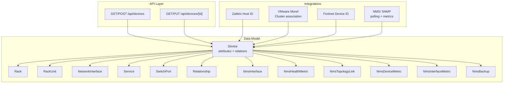
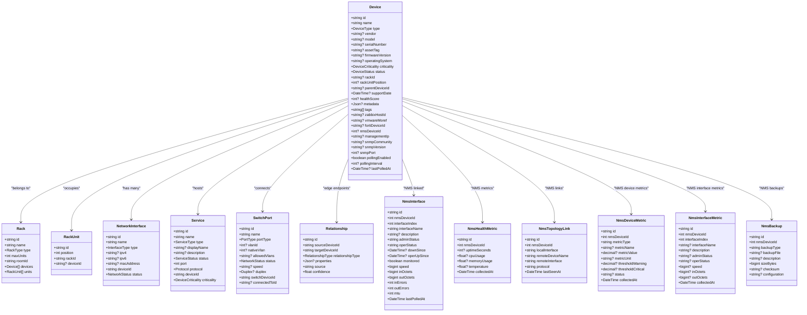
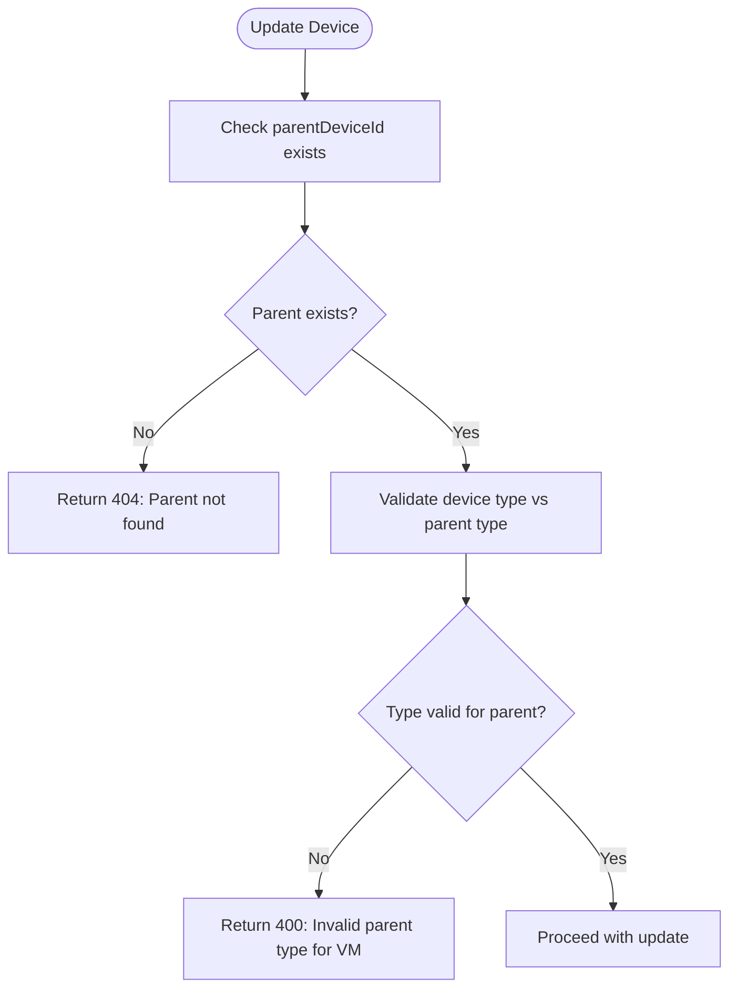
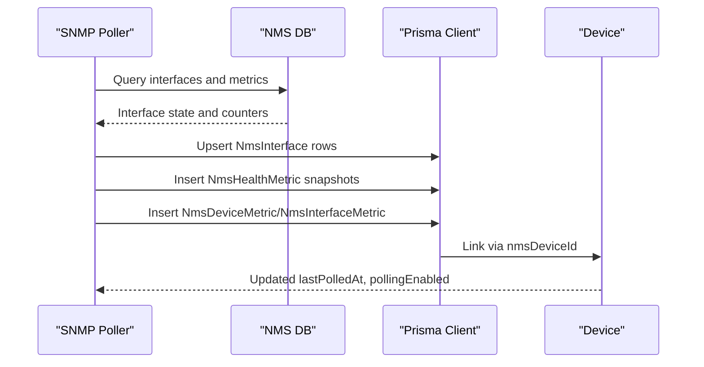
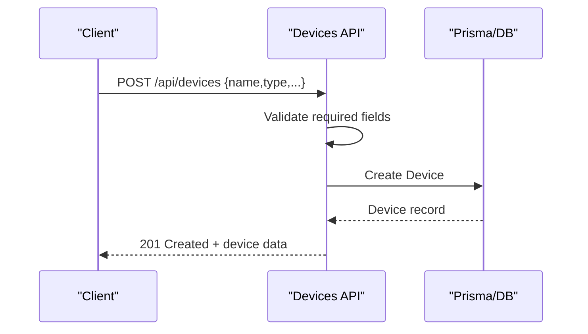
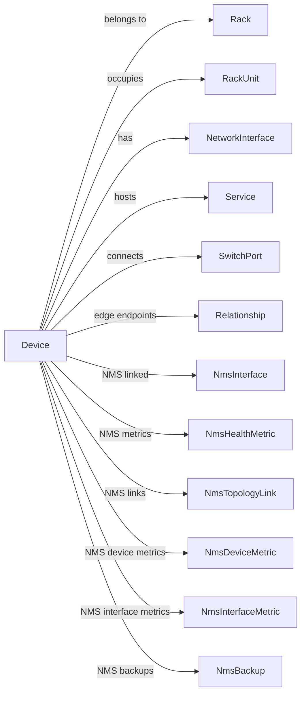

# Device Management

<cite>
**Referenced Files in This Document**
- [schema.prisma](file://prisma/schema.prisma)
- [route.ts](file://app/api/devices/route.ts)
- [route.ts](file://app/api/devices/[id]/route.ts)
- [index.ts](file://types/index.ts)
- [relationship-engine.ts](file://lib/topology/relationship-engine.ts)
- [vmware.ts](file://lib/integrations/vmware.ts)
- [poller.py](file://nms_service/snmp/poller.py)
- [models.py](file://nms_service/database/models.py)
- [migration.sql](file://prisma/migrations/20260203140035_add_fortianalyzer/migration.sql)
- [migration.sql](file://prisma/migrations/20260101220408_initial_schema/migration.sql)
- [reports-service.ts](file://lib/reports/reports-service.ts)
- [detection-engine.ts](file://lib/alarms/detection-engine.ts)
</cite>

## Table of Contents
1. [Introduction](#introduction)
2. [Project Structure](#project-structure)
3. [Core Components](#core-components)
4. [Architecture Overview](#architecture-overview)
5. [Detailed Component Analysis](#detailed-component-analysis)
6. [Dependency Analysis](#dependency-analysis)
7. [Performance Considerations](#performance-considerations)
8. [Troubleshooting Guide](#troubleshooting-guide)
9. [Conclusion](#conclusion)
10. [Appendices](#appendices)

## Introduction
This document provides comprehensive data model documentation for the Device entity and its extensive relationships. It covers device attributes (including type enumerations, vendor/model/serial, criticality, and status), parent-child device relationships for virtual machine hierarchies and VMware clusters, integration fields for external systems (Zabbix host IDs, VMware Moref, Fortinet device IDs), NMS/SNMP integration fields (management IPs, SNMP community strings, polling configurations, and health metrics), and flexible metadata storage. It also documents relationships to network interfaces, services, switch ports, and rack assignments, along with device status tracking, health scoring, and support date management. Finally, it includes practical examples of device creation workflows, relationship establishment, and integration synchronization patterns.

## Project Structure
The Device model is defined centrally in the Prisma schema and surfaced through API routes, typed interfaces, and integration services. The following diagram shows the high-level structure relevant to Device management.

**Diagram sources**
- [schema.prisma](file://prisma/schema.prisma)
- [route.ts](file://app/api/devices/route.ts)
- [route.ts](file://app/api/devices/[id]/route.ts)

**Section sources**
- [schema.prisma](file://prisma/schema.prisma)
- [route.ts](file://app/api/devices/route.ts)
- [route.ts](file://app/api/devices/[id]/route.ts)

## Core Components
This section documents the Device entity and its core attributes, enumerations, and relationships.

- Device identity and identification
  - id: unique identifier
  - name: device name
  - type: DeviceType enumeration (PHYSICAL_SERVER, VIRTUAL_HOST, VIRTUAL_MACHINE, FIREWALL, SWITCH, ROUTER, COMPUTER, LAPTOP, STORAGE, PDU, PATCH_PANEL, OTHER, PRINTER, CAMERA, VLAN, VMWARE_CLUSTER, VMWARE_DATASTORE)
  - vendor, model, serialNumber, assetTag, firmwareVersion, operatingSystem
  - criticality: DeviceCriticality (CRITICAL, HIGH, MEDIUM, LOW, INFORMATIONAL)
  - status: DeviceStatus (ACTIVE, INACTIVE, MAINTENANCE, DECOMMISSIONED, UNKNOWN)
  - supportDate: DateTime for warranty/support expiry
  - healthScore: Integer score for device health
  - metadata: JSON for flexible attributes
  - tags: String array for categorization

- Location and placement
  - rackId: optional foreign key to Rack
  - rackUnitPosition: optional U-position within a rack
  - rack: relation to Rack
  - rackUnits: relation to RackUnit

- Parent-child hierarchy
  - parentDeviceId: optional foreign key to Device (self-referencing)
  - parentDevice: relation to parent Device
  - childDevices: relation to child Devices (virtual machine hierarchy)

- VMware integration
  - vmHostId: identifies the ESXi host for VMs
  - vmwareClusterId: optional foreign key to VMwareCluster
  - vmwareCluster: relation to VMwareCluster
  - vmwareMoref: external VMware Managed Object Reference

- External system integration
  - zabbixHostId: Zabbix host identifier
  - fortiDeviceId: Fortinet device identifier

- NMS/ SNMP integration
  - nmsDeviceId: integer unique identifier for NMS polling linkage
  - managementIp: primary management IP for SNMP polling
  - snmpCommunity, snmpVersion, snmpPort
  - pollingEnabled, pollingInterval, lastPolledAt

- Relationships
  - networkInterfaces: list of NetworkInterface entries
  - services: list of Service entries
  - switchPorts: list of SwitchPort entries
  - sourceRelationships/targetRelationships: Relationship edges
  - dependencies: Dependency links to services/devices

- NMS-specific relations
  - nmsInterfaces, nmsHealthMetrics, nmsTopologyLinks, nmsDeviceMetrics, nmsInterfaceMetrics, nmsBackups

- Enumerations
  - DeviceType, DeviceCriticality, DeviceStatus, InterfaceType, NetworkStatus, PortType, Duplex, ConnectionType, RelationshipType, IntegrationType, AlertSeverity, TaskType, AlarmSeverity2

**Section sources**
- [schema.prisma](file://prisma/schema.prisma)
- [index.ts](file://types/index.ts)

## Architecture Overview
The Device model integrates with multiple subsystems:
- API layer for CRUD operations and device queries
- Integrations for Zabbix, VMware, Fortinet, and NMS/ SNMP
- Topology engine for deriving relationships from metadata and network telemetry
- Reports and alarm systems leveraging device attributes and NMS metrics

**Diagram sources**
- [schema.prisma](file://prisma/schema.prisma)

**Section sources**
- [schema.prisma](file://prisma/schema.prisma)

## Detailed Component Analysis

### Device Attributes and Enumerations
- DeviceType includes physical and virtual categories, plus specialized types such as VLAN, VMWARE_CLUSTER, and VMWARE_DATASTORE.
- DeviceCriticality supports risk-based prioritization.
- DeviceStatus tracks lifecycle states.
- The initial DeviceType set included core physical and virtual types; subsequent migrations extended DeviceType and IntegrationType to include VLAN, VMWARE_CLUSTER, VMWARE_DATASTORE, and FortiAnalyzer.

**Section sources**
- [schema.prisma](file://prisma/schema.prisma)
- [migration.sql](file://prisma/migrations/20260203140035_add_fortianalyzer/migration.sql)
- [migration.sql](file://prisma/migrations/20260101220408_initial_schema/migration.sql)

### Parent-Child Device Relationships (VM Hierarchies and Clusters)
- Self-referencing parentDeviceId enables hierarchical modeling:
  - VIRTUAL_MACHINE must have a parent of type VIRTUAL_HOST or PHYSICAL_SERVER.
  - The API enforces this constraint during updates.
- VMware integration:
  - vmHostId links VMs to ESXi hosts.
  - vmwareClusterId associates hosts/VMs with VMware clusters.
  - Integration services populate vmwareMoref and cluster associations.

**Diagram sources**
- [route.ts](file://app/api/devices/[id]/route.ts)

**Section sources**
- [route.ts](file://app/api/devices/[id]/route.ts)
- [vmware.ts](file://lib/integrations/vmware.ts)

### Integration Fields for External Systems
- Zabbix: zabbixHostId links to Zabbix host identifiers.
- VMware: vmwareMoref stores external managed object references; vmHostId and vmwareClusterId connect VMs to hosts and clusters.
- Fortinet: fortiDeviceId identifies Fortinet devices for policy/address synchronization.

**Section sources**
- [schema.prisma](file://prisma/schema.prisma)
- [vmware.ts](file://lib/integrations/vmware.ts)

### NMS/ SNMP Integration Fields and Metrics
- NMS linkage:
  - nmsDeviceId: integer unique identifier used to join NMS tables to Device.
  - managementIp, snmpCommunity, snmpVersion, snmpPort define polling parameters.
  - pollingEnabled, pollingInterval, lastPolledAt control and track polling.
- NMS tables:
  - NmsInterface: current interface state and counters.
  - NmsHealthMetric: CPU/memory/temperature/uptime snapshots.
  - NmsTopologyLink: discovered LLDP/CDP links.
  - NmsDeviceMetric and NmsInterfaceMetric: time-series metrics.
  - NmsBackup: configuration backups.

**Diagram sources**
- [poller.py](file://nms_service/snmp/poller.py)
- [models.py](file://nms_service/database/models.py)
- [schema.prisma](file://prisma/schema.prisma)

**Section sources**
- [schema.prisma](file://prisma/schema.prisma)
- [poller.py](file://nms_service/snmp/poller.py)
- [models.py](file://nms_service/database/models.py)

### Relationships to Network Interfaces, Services, Switch Ports, and Racks
- NetworkInterface: per-device interfaces with IPv4/IPv6/MAC, VLAN association, and status.
- Service: applications/services running on devices with port/protocol and criticality.
- SwitchPort: switch-side ports with VLAN tagging, duplex/speed, and connectivity.
- Rack/RackUnit: physical placement within racks, including unit positions and sides.

**Section sources**
- [schema.prisma](file://prisma/schema.prisma)

### Topology Relationships and Discovery
- Relationship model captures edges between devices with types such as CONTAINS, CONNECTS_TO, VIRTUAL_RUNS_ON, CLUSTER_CONTAINS, VLAN_MEMBER, FIREWALL_POLICY, SERVICE_DEPENDENCY, HA_PAIR, UPLINK, SPANNING_TREE.
- The topology engine extracts neighbor information from metadata (e.g., CDP/LLDP) and constructs graphs for visualization and impact analysis.

**Section sources**
- [schema.prisma](file://prisma/schema.prisma)
- [relationship-engine.ts](file://lib/topology/relationship-engine.ts)

### Device Metadata JSON Field
- metadata: JSON field enables storing flexible attributes without schema changes, commonly used for integration-specific or custom properties.

**Section sources**
- [schema.prisma](file://prisma/schema.prisma)

### Status Tracking, Health Scoring, and Support Date Management
- DeviceStatus and DeviceCriticality support operational and risk tracking.
- healthScore provides a numeric health indicator.
- supportDate manages warranty/expiry tracking; scripts demonstrate updating support dates.

**Section sources**
- [schema.prisma](file://prisma/schema.prisma)
- [reports-service.ts](file://lib/reports/reports-service.ts)
- [scripts/add-support-dates.js](file://scripts/add-support-dates.js)

### Examples: Device Creation Workflows, Relationship Establishment, and Integration Synchronization Patterns
- Device creation:
  - API accepts name and type; optional fields include vendor, model, serialNumber, assetTag, criticality, status, rackId, rackUnitPosition, supportDate.
  - Validation ensures required fields are present; successful creation returns 201 with device data.
- Relationship establishment:
  - Updating a VIRTUAL_MACHINE requires a valid VIRTUAL_HOST or PHYSICAL_SERVER parent; otherwise, the API returns an error.
- Integration synchronization:
  - VMware integration maps VM summary to Device fields, sets vmwareMoref, vmHostId, vmwareClusterId, and healthScore.
  - NMS polling populates NmsInterface, NmsHealthMetric, and related metrics; lastPolledAt and pollingEnabled reflect current state.

**Diagram sources**
- [route.ts](file://app/api/devices/route.ts)

**Section sources**
- [route.ts](file://app/api/devices/route.ts)
- [route.ts](file://app/api/devices/[id]/route.ts)
- [vmware.ts](file://lib/integrations/vmware.ts)

## Dependency Analysis
Device relationships form a directed graph with multiple edge types and cross-cutting integrations.

**Diagram sources**
- [schema.prisma](file://prisma/schema.prisma)

**Section sources**
- [schema.prisma](file://prisma/schema.prisma)

## Performance Considerations
- Indexes on frequently queried fields (e.g., rackId, parentDeviceId, zabbixHostId, vmwareMoref, vmwareClusterId, nmsDeviceId) improve lookup performance.
- Minimizing deep joins in listing endpoints (e.g., minimal mode) reduces query complexity for dashboards.
- NMS polling intervals and batched upserts help manage write amplification for metrics.

[No sources needed since this section provides general guidance]

## Troubleshooting Guide
- Device creation errors:
  - Missing name/type leads to 400 errors.
- Relationship errors:
  - Attempting to set a VIRTUAL_MACHINE parent to an invalid type results in 400 errors.
- NMS connectivity:
  - Unreachable devices trigger alarm detection logic using lastPolledAt and last metric timestamps.
- Integration status:
  - Integration status pages show health scores and statuses for Zabbix, VMware, and Fortinet.

**Section sources**
- [route.ts](file://app/api/devices/route.ts)
- [route.ts](file://app/api/devices/[id]/route.ts)
- [detection-engine.ts](file://lib/alarms/detection-engine.ts)
- [app/integrations/status/page.tsx](file://app/integrations/status/page.tsx)

## Conclusion
The Device entity serves as the central abstraction for physical and virtual infrastructure, integrating tightly with rack placement, network interfaces/services, switch ports, and topology relationships. Its rich attribute set, flexible metadata, and robust integration fields enable comprehensive lifecycle and operational management across Zabbix, VMware, Fortinet, and NMS/ SNMP ecosystems. The documented workflows and constraints ensure data integrity, particularly for VM hierarchies and NMS-linked metrics.

## Appendices

### DeviceType Enumeration Expansion
- Initial set: PHYSICAL_SERVER, VIRTUAL_HOST, VIRTUAL_MACHINE, FIREWALL, SWITCH, ROUTER, COMPUTER, LAPTOP, STORAGE, PDU, PATCH_PANEL, OTHER.
- Extended set: VLAN, VMWARE_CLUSTER, VMWARE_DATASTORE.
- IntegrationType extended to include FORTIANALYZER.

**Section sources**
- [migration.sql](file://prisma/migrations/20260203140035_add_fortianalyzer/migration.sql)
- [migration.sql](file://prisma/migrations/20260101220408_initial_schema/migration.sql)