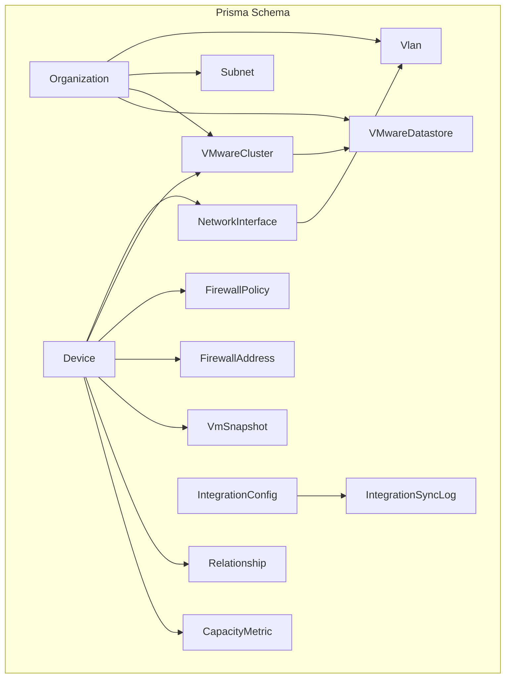
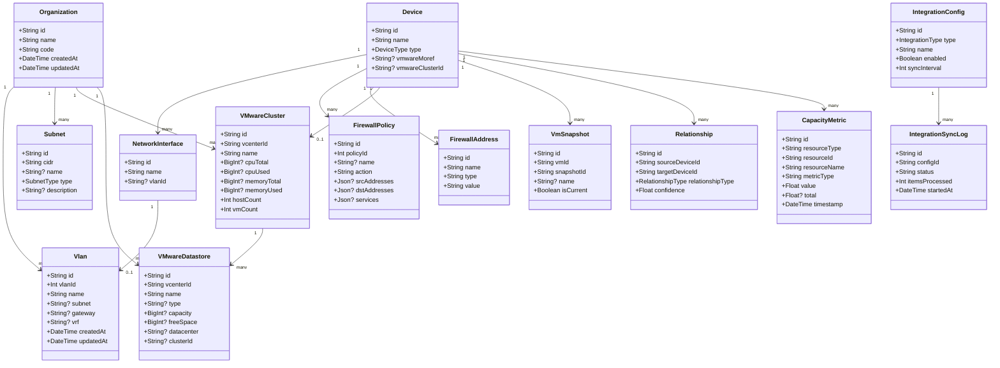
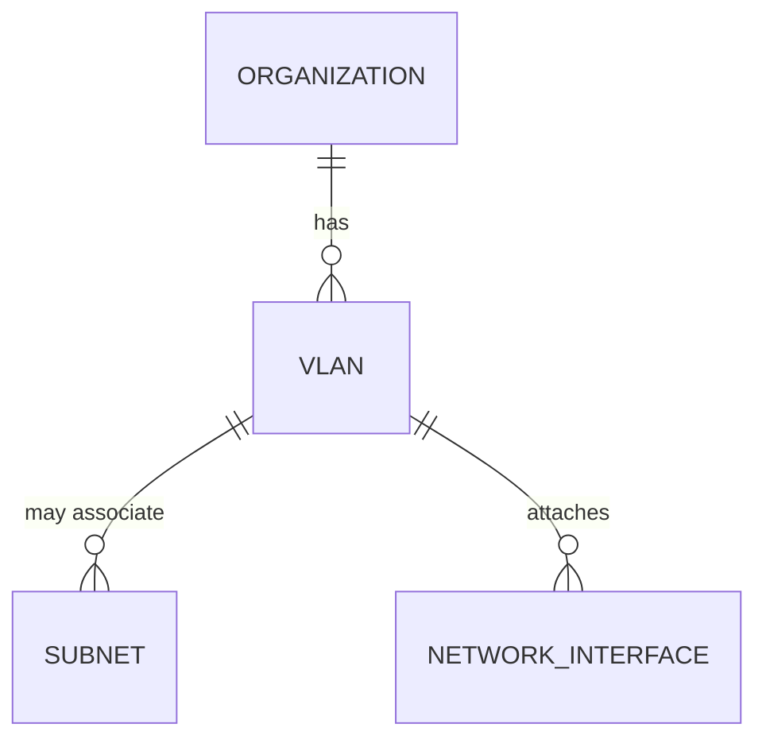
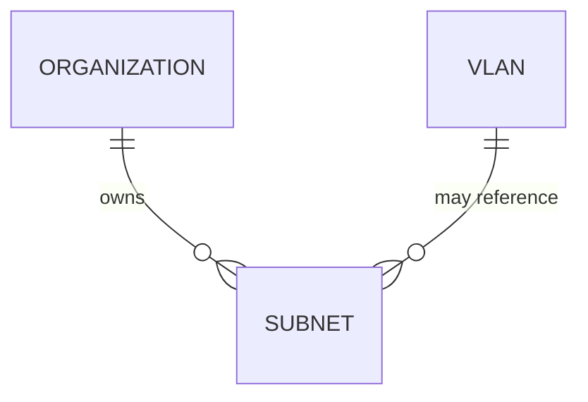
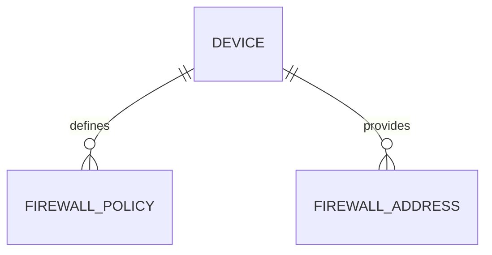
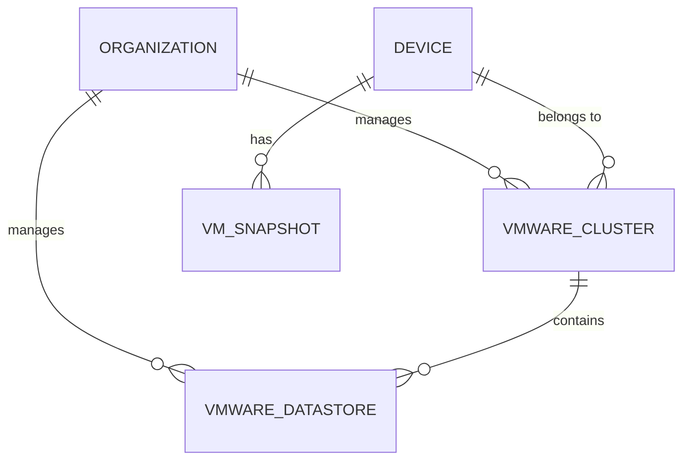
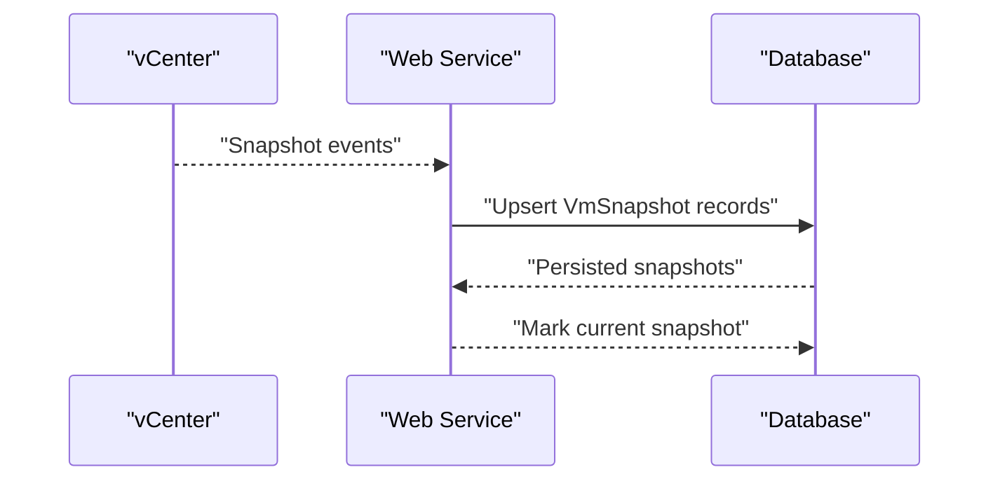
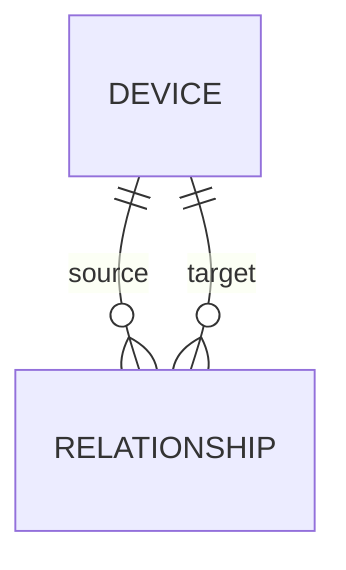
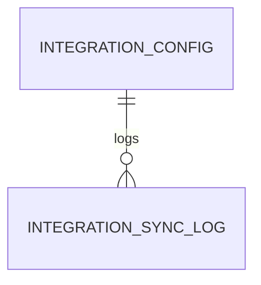
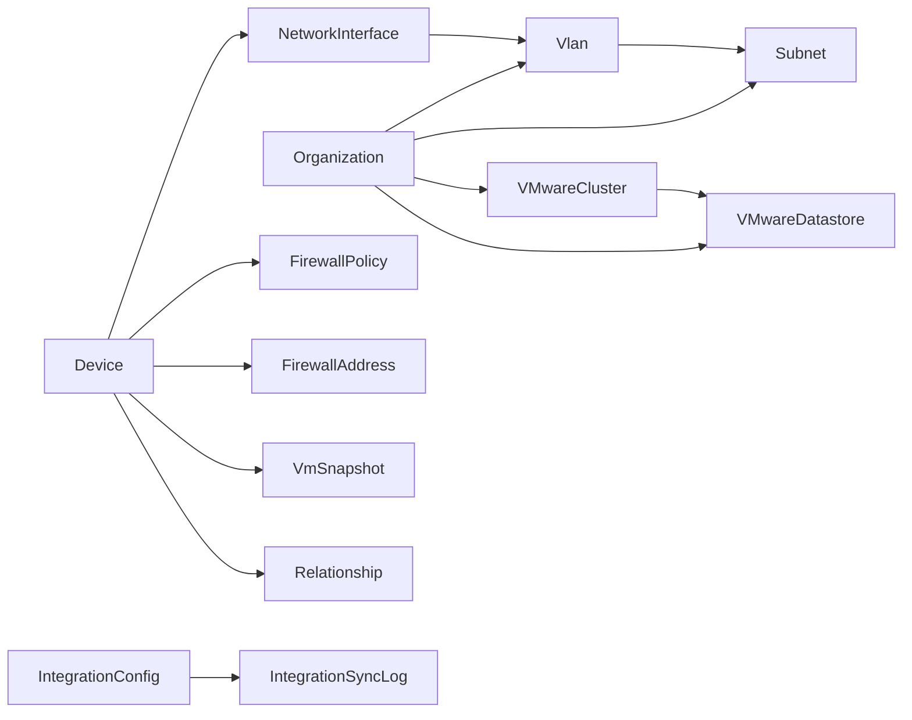

# Enterprise Features

<cite>
**Referenced Files in This Document**
- [schema.prisma](file://prisma/schema.prisma)
- [migration.sql](file://prisma/migrations/20260130053347_enterprise_extension/migration.sql)
- [vmware.md](file://docs/20-modules/integrations/vmware.md)
- [vmware.ts](file://lib/integrations/vmware.ts)
</cite>

## Table of Contents
1. [Introduction](#introduction)
2. [Project Structure](#project-structure)
3. [Core Components](#core-components)
4. [Architecture Overview](#architecture-overview)
5. [Detailed Component Analysis](#detailed-component-analysis)
6. [Dependency Analysis](#dependency-analysis)
7. [Performance Considerations](#performance-considerations)
8. [Troubleshooting Guide](#troubleshooting-guide)
9. [Conclusion](#conclusion)
10. [Appendices](#appendices)

## Introduction
This document provides comprehensive data model documentation for enterprise-level extensions in the platform. It covers VLAN management, VMware integration, firewall policies, capacity monitoring, virtual machine snapshot management, and integration configuration/logging. It also outlines relationships among these models, integration workflows, and practical guidance for capacity planning and security auditing.

## Project Structure
Enterprise features are defined in the Prisma schema and implemented across backend services and UI pages. The schema defines core models and enums for VLANs, subnets, firewall integration, VMware clusters/datastores, capacity metrics, VM snapshots, relationships, and integration configurations. The VMware integration module implements dual-API synchronization against vCenter and integrates with the alarm system.

**Diagram sources**
- [schema.prisma:11-25](file://prisma/schema.prisma#L11-L25)
- [schema.prisma:591-608](file://prisma/schema.prisma#L591-L608)
- [schema.prisma:611-626](file://prisma/schema.prisma#L611-L626)
- [schema.prisma:629-667](file://prisma/schema.prisma#L629-L667)
- [schema.prisma:669-712](file://prisma/schema.prisma#L669-L712)
- [schema.prisma:715-727](file://prisma/schema.prisma#L715-L727)
- [schema.prisma:729-742](file://prisma/schema.prisma#L729-L742)
- [schema.prisma:745-762](file://prisma/schema.prisma#L745-L762)
- [schema.prisma:765-801](file://prisma/schema.prisma#L765-L801)

**Section sources**
- [schema.prisma:11-25](file://prisma/schema.prisma#L11-L25)
- [schema.prisma:591-608](file://prisma/schema.prisma#L591-L608)
- [schema.prisma:611-626](file://prisma/schema.prisma#L611-L626)
- [schema.prisma:629-667](file://prisma/schema.prisma#L629-L667)
- [schema.prisma:669-712](file://prisma/schema.prisma#L669-L712)
- [schema.prisma:715-727](file://prisma/schema.prisma#L715-L727)
- [schema.prisma:729-742](file://prisma/schema.prisma#L729-L742)
- [schema.prisma:745-762](file://prisma/schema.prisma#L745-L762)
- [schema.prisma:765-801](file://prisma/schema.prisma#L765-L801)

## Core Components
- Vlan: Represents Layer 2 broadcast domains with optional CIDR subnet association, gateway, and VRF support. Each VLAN belongs to an organization and can be attached to network interfaces and subnets.
- Subnet: Defines IP address spaces using CIDR notation, with typed categories (management, production, development, DMZ, guest, reserved) and optional VLAN linkage.
- FirewallPolicy and FirewallAddress: Fortinet integration models capturing policy rules and address objects linked to a FortiGate device.
- VMwareCluster and VMwareDatastore: vCenter-backed models for compute clusters and storage resources, including capacity and host/datastore counts.
- CapacityMetric: Time-series metrics for CPU, memory, and disk utilization across VMware resources.
- VmSnapshot: Snapshot records for virtual machines, including current snapshot flags and sizing.
- Relationship: Edge relationships between devices (contains, connects_to, virtual_runs_on, cluster_contains, vlan_member, firewall_policy, service_dependency, HA_pair, uplink, spanning_tree).
- IntegrationConfig and IntegrationSyncLog: Centralized configuration and logs for external system integrations (Zabbix, VMware vCenter, Fortinet, SNMP, cloud providers, API).

**Section sources**
- [schema.prisma:591-608](file://prisma/schema.prisma#L591-L608)
- [schema.prisma:611-626](file://prisma/schema.prisma#L611-L626)
- [schema.prisma:629-667](file://prisma/schema.prisma#L629-L667)
- [schema.prisma:669-712](file://prisma/schema.prisma#L669-L712)
- [schema.prisma:715-727](file://prisma/schema.prisma#L715-L727)
- [schema.prisma:729-742](file://prisma/schema.prisma#L729-L742)
- [schema.prisma:745-762](file://prisma/schema.prisma#L745-L762)
- [schema.prisma:765-801](file://prisma/schema.prisma#L765-L801)

## Architecture Overview
The enterprise data model centers around organizations and their infrastructure assets. VLANs and subnets define network topology and IP allocation. Firewall models integrate with Fortinet devices. VMware models connect to vCenter for compute and storage visibility. Capacity metrics enable time-series monitoring. Snapshots track VM lifecycle. Relationships capture topology and dependencies. Integration configuration and logs manage external system connectivity.

**Diagram sources**
- [schema.prisma:11-25](file://prisma/schema.prisma#L11-L25)
- [schema.prisma:591-608](file://prisma/schema.prisma#L591-L608)
- [schema.prisma:611-626](file://prisma/schema.prisma#L611-L626)
- [schema.prisma:152-228](file://prisma/schema.prisma#L152-L228)
- [schema.prisma:231-251](file://prisma/schema.prisma#L231-L251)
- [schema.prisma:629-667](file://prisma/schema.prisma#L629-L667)
- [schema.prisma:669-712](file://prisma/schema.prisma#L669-L712)
- [schema.prisma:694-712](file://prisma/schema.prisma#L694-L712)
- [schema.prisma:715-727](file://prisma/schema.prisma#L715-L727)
- [schema.prisma:729-742](file://prisma/schema.prisma#L729-L742)
- [schema.prisma:745-762](file://prisma/schema.prisma#L745-L762)
- [schema.prisma:765-801](file://prisma/schema.prisma#L765-L801)

## Detailed Component Analysis

### VLAN Management
- Purpose: Define Layer 2 broadcast domains with optional subnet association, gateway, and VRF support.
- Key attributes:
  - VLAN identifier, name, description
  - Optional CIDR subnet, gateway, VRF
  - Organization-scoped uniqueness on (organizationId, vlanId)
- Relationships:
  - Associated with NetworkInterface and Subnet
  - Belongs to Organization

**Diagram sources**
- [schema.prisma:591-608](file://prisma/schema.prisma#L591-L608)
- [schema.prisma:611-626](file://prisma/schema.prisma#L611-L626)
- [schema.prisma:231-251](file://prisma/schema.prisma#L231-L251)

**Section sources**
- [schema.prisma:591-608](file://prisma/schema.prisma#L591-L608)
- [schema.prisma:611-626](file://prisma/schema.prisma#L611-L626)

### Subnet Models
- Purpose: Allocate IP address spaces using CIDR notation with typed categories.
- Key attributes:
  - CIDR, name, type (management, production, development, DMZ, guest, reserved), description
  - Optional VLAN linkage
  - Organization-scoped uniqueness on (organizationId, cidr)
- Relationships:
  - Links to Vlan via optional foreign key

**Diagram sources**
- [schema.prisma:611-626](file://prisma/schema.prisma#L611-L626)
- [schema.prisma:591-608](file://prisma/schema.prisma#L591-L608)

**Section sources**
- [schema.prisma:611-626](file://prisma/schema.prisma#L611-L626)

### Firewall Policies and Addresses (Fortinet Integration)
- FirewallPolicy:
  - Device-scoped policies with unique (deviceId, policyId)
  - Fields for action, interfaces, source/destination addresses, services, schedule, hit counters
- FirewallAddress:
  - Address objects (IP, FQDN, geoip, group) associated with a device
- Relationships:
  - Both models belong to Device

**Diagram sources**
- [schema.prisma:629-667](file://prisma/schema.prisma#L629-L667)
- [schema.prisma:152-228](file://prisma/schema.prisma#L152-L228)

**Section sources**
- [schema.prisma:629-667](file://prisma/schema.prisma#L629-L667)

### VMware Integration (Clusters, Datastores, Snapshots)
- VMwareCluster:
  - vCenter-scoped cluster with CPU/memory totals/usage, host and VM counts, status
  - Organization-scoped
- VMwareDatastore:
  - Storage resource with capacity/free space, type, datacenter, and optional cluster linkage
- VmSnapshot:
  - Snapshot records for VMs with current flag and size
- Relationships:
  - Device can reference a VMwareCluster (host-to-cluster)
  - Cluster has many datastores
  - Device has many snapshots

**Diagram sources**
- [schema.prisma:669-712](file://prisma/schema.prisma#L669-L712)
- [schema.prisma:694-712](file://prisma/schema.prisma#L694-L712)
- [schema.prisma:729-742](file://prisma/schema.prisma#L729-L742)
- [schema.prisma:152-228](file://prisma/schema.prisma#L152-L228)

**Section sources**
- [schema.prisma:669-712](file://prisma/schema.prisma#L669-L712)
- [schema.prisma:694-712](file://prisma/schema.prisma#L694-L712)
- [schema.prisma:729-742](file://prisma/schema.prisma#L729-L742)
- [vmware.md:1-133](file://docs/20-modules/integrations/vmware.md#L1-L133)
- [vmware.ts:1-800](file://lib/integrations/vmware.ts#L1-L800)

### Capacity Monitoring (Time-Series Metrics)
- CapacityMetric:
  - Tracks resourceType (cluster/host/datastore), resourceId/resourceName
  - metricType (cpu, memory, disk)
  - value and optional total
  - timestamped entries for trend analysis
- Usage:
  - Supports dashboards and capacity planning queries

**Diagram sources**
- [schema.prisma:715-727](file://prisma/schema.prisma#L715-L727)

**Section sources**
- [schema.prisma:715-727](file://prisma/schema.prisma#L715-L727)

### Virtual Machine Snapshots
- VmSnapshot:
  - Links VMs (Device) to snapshot identifiers
  - Tracks name, description, size, creation time, and current flag
- Use cases:
  - Backup verification, rollback readiness, drift analysis

**Diagram sources**
- [schema.prisma:729-742](file://prisma/schema.prisma#L729-L742)
- [vmware.md:74-81](file://docs/20-modules/integrations/vmware.md#L74-L81)

**Section sources**
- [schema.prisma:729-742](file://prisma/schema.prisma#L729-L742)
- [vmware.md:74-81](file://docs/20-modules/integrations/vmware.md#L74-L81)

### Relationships (Topology and Dependencies)
- Relationship:
  - Edges between devices with typed relationships and confidence
  - Properties JSON supports carrying auxiliary data (e.g., VLAN IDs, policy IDs)
- Types include containment, physical connections, virtual runs-on, cluster membership, VLAN membership, firewall policy edges, service dependencies, HA pairs, uplinks, and spanning tree blocking

**Diagram sources**
- [schema.prisma:745-762](file://prisma/schema.prisma#L745-L762)
- [schema.prisma:896-907](file://prisma/schema.prisma#L896-L907)

**Section sources**
- [schema.prisma:745-762](file://prisma/schema.prisma#L745-L762)
- [schema.prisma:896-907](file://prisma/schema.prisma#L896-L907)

### Integration Configuration and Sync Logs
- IntegrationConfig:
  - Stores integration type, name, description, encrypted config, enabled flag, sync interval, and timestamps
  - Unique constraint on (type, name)
- IntegrationSyncLog:
  - Records sync outcomes, item counts, messages, and timing per IntegrationConfig
- Use cases:
  - Centralized management of external system credentials and schedules
  - Auditing and troubleshooting sync issues

**Diagram sources**
- [schema.prisma:765-801](file://prisma/schema.prisma#L765-L801)

**Section sources**
- [schema.prisma:765-801](file://prisma/schema.prisma#L765-L801)

## Dependency Analysis
- Foreign keys enforce referential integrity across models:
  - Vlan.organizationId -> Organization.id
  - Subnet.organizationId -> Organization.id; Subnet.vlanId -> Vlan.id
  - Device.vmwareClusterId -> VMwareCluster.id
  - NetworkInterface.vlanId -> Vlan.id
  - FirewallPolicy.deviceId -> Device.id; FirewallAddress.deviceId -> Device.id
  - VMwareDatastore.clusterId -> VMwareCluster.id
  - VmSnapshot.vmId -> Device.id
  - Relationship.sourceDeviceId/targetDeviceId -> Device.id
  - IntegrationSyncLog.configId -> IntegrationConfig.id
  - TaskLog.taskId -> ScheduledTask.id

**Diagram sources**
- [migration.sql:346-387](file://prisma/migrations/20260130053347_enterprise_extension/migration.sql#L346-L387)

**Section sources**
- [migration.sql:346-387](file://prisma/migrations/20260130053347_enterprise_extension/migration.sql#L346-L387)

## Performance Considerations
- Indexes on frequently queried fields (e.g., device IDs, timestamps, organization IDs) improve lookup performance for relationships, firewall policies, and capacity metrics.
- Time-series partitioning strategies can be considered for CapacityMetric to manage long histories efficiently.
- Caching strategies (e.g., snapshot cache TTL) reduce repeated API calls in integrations like VMware.

[No sources needed since this section provides general guidance]

## Troubleshooting Guide
- VMware Integration
  - Authentication failures: Verify vCenter credentials and certificate handling; ensure session cookies are refreshed.
  - SOAP session expiration: Re-bootstrap via SDK login when sessions expire.
  - Event synchronization: Confirm EventHistoryCollector availability and filter logic; events are parsed from SOAP responses.
- Firewall Integration
  - Policy conflicts: Validate unique policy IDs per device; review source/destination addresses and services arrays.
- Capacity Monitoring
  - Missing metrics: Confirm collection intervals and resource tagging; check timestamp indexing.
- Integration Logs
  - Review IntegrationSyncLog for detailed error messages and item counts to diagnose sync issues.

**Section sources**
- [vmware.md:119-127](file://docs/20-modules/integrations/vmware.md#L119-L127)
- [vmware.ts:168-215](file://lib/integrations/vmware.ts#L168-L215)
- [vmware.ts:220-267](file://lib/integrations/vmware.ts#L220-L267)
- [schema.prisma:765-801](file://prisma/schema.prisma#L765-L801)

## Conclusion
The enterprise feature set builds a robust foundation for network and virtualization visibility, policy enforcement, and operational observability. The data models emphasize strong referential integrity, extensibility, and auditability. Integrations with VMware and Fortinet are first-class citizens, enabling real-time insights and automated workflows.

[No sources needed since this section summarizes without analyzing specific files]

## Appendices

### Enterprise Feature Configuration Examples
- VLAN/Subnet
  - Create VLAN with optional subnet/gateway/VRF; assign to network interfaces and subnets.
- Firewall Policies
  - Define policies per FortiGate device with unique IDs; populate address and service arrays.
- VMware
  - Configure vCenter credentials and sync intervals; validate REST/SOAP connectivity and event history.
- Capacity Planning Queries
  - Aggregate CapacityMetric by resourceType/resourceId and metricType over time windows to identify growth trends and saturation points.
- Security and Audit
  - Enable audit logging for sensitive changes; maintain encrypted integration configs; apply whitelists for known automation events.

[No sources needed since this section provides general guidance]