# Enterprise Features

<cite>
**Referenced Files in This Document**
- [schema.prisma](file://prisma/schema.prisma)
- [migration.sql](file://prisma/migrations/20260130053347_enterprise_extension/migration.sql)
- [vmware.md](file://docs/20-modules/integrations/vmware.md)
- [vmware.ts](file://lib/integrations/vmware.ts)
- [index.ts](file://lib/license/index.ts)
- [client.ts](file://lib/license/client.ts)
- [features.ts](file://lib/license/features.ts)
- [jwt.ts](file://lib/license/jwt.ts)
- [machine-id.ts](file://lib/license/machine-id.ts)
- [middleware.ts](file://lib/license/middleware.ts)
- [activate/route.ts](file://app/api/license/activate/route.ts)
- [validate/route.ts](file://app/api/license/validate/route.ts)
- [heartbeat/route.ts](file://app/api/license/heartbeat/route.ts)
- [status/route.ts](file://app/api/license/status/route.ts)
- [page.tsx](file://app/settings/license/page.tsx)
- [install-guide.html](file://deploy/install-guide.html)
</cite>

## Update Summary
**Changes Made**
- Added comprehensive enterprise licensing system documentation covering license activation, validation, heartbeat, and status checking
- Documented JWT token management for secure license validation
- Added machine identification system for on-premise deployments
- Included feature gating mechanisms across TRIAL, STANDARD, and ENTERPRISE tiers
- Added license management APIs and administrative interfaces
- Integrated licensing with existing enterprise features (VMware, firewall, integrations)

## Table of Contents
1. [Introduction](#introduction)
2. [Project Structure](#project-structure)
3. [Core Components](#core-components)
4. [Architecture Overview](#architecture-overview)
5. [Detailed Component Analysis](#detailed-component-analysis)
6. [Enterprise Licensing System](#enterprise-licensing-system)
7. [License Management APIs](#license-management-apis)
8. [Feature Gating and Access Control](#feature-gating-and-access-control)
9. [Dependency Analysis](#dependency-analysis)
10. [Performance Considerations](#performance-considerations)
11. [Troubleshooting Guide](#troubleshooting-guide)
12. [Conclusion](#conclusion)
13. [Appendices](#appendices)

## Introduction
This document provides comprehensive data model documentation for enterprise-level extensions in the platform, including the new enterprise licensing system for on-premise deployments. The licensing system encompasses license activation, validation, heartbeat monitoring, status checking, JWT token management, machine identification, and feature gating across TRIAL, STANDARD, and ENTERPRISE tiers. It covers VLAN management, VMware integration, firewall policies, capacity monitoring, virtual machine snapshot management, and integration configuration/logging.

## Project Structure
Enterprise features are defined in the Prisma schema and implemented across backend services, UI pages, and licensing infrastructure. The schema defines core models for licensing (Customer, License, LicenseActivation, LicenseHeartbeat), alongside existing enterprise models for VLANs, subnets, firewall integration, VMware clusters/datastores, capacity metrics, VM snapshots, relationships, and integration configurations. The licensing system integrates with the VMware integration module and other enterprise features.

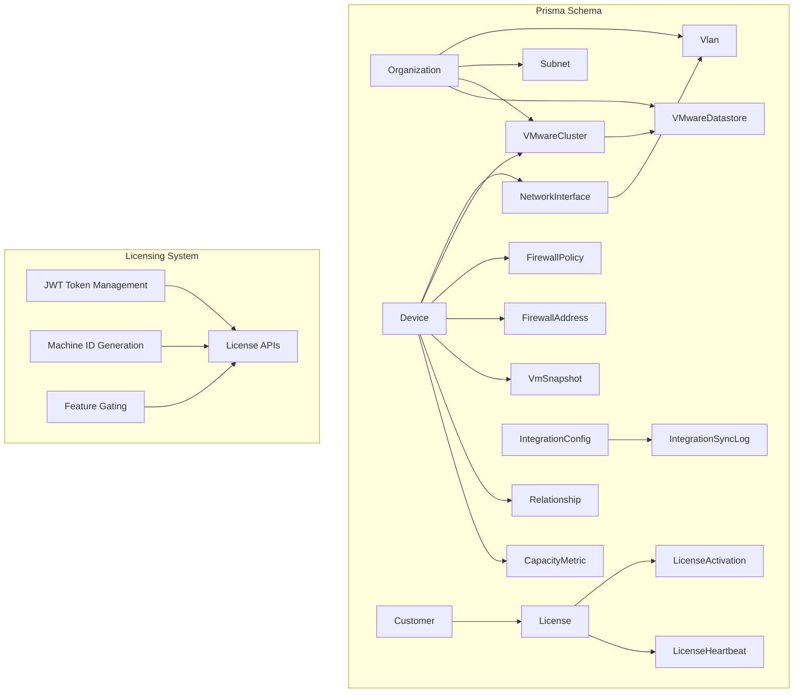
```mermaid
graph TB
subgraph "Prisma Schema"
ORG["Organization"]
DEV["Device"]
NI["NetworkInterface"]
VLAN["Vlan"]
SUB["Subnet"]
FPOL["FirewallPolicy"]
FADDR["FirewallAddress"]
CLU["VMwareCluster"]
DS["VMwareDatastore"]
CM["CapacityMetric"]
SNAP["VmSnapshot"]
REL["Relationship"]
ICONF["IntegrationConfig"]
ISLOG["IntegrationSyncLog"]
CUST["Customer"]
LIC["License"]
LACT["LicenseActivation"]
LHB["LicenseHeartbeat"]
end
subgraph "Licensing System"
JWT["JWT Token Management"]
MID["Machine ID Generation"]
FS["Feature Gating"]
API["License APIs"]
end
ORG --> VLAN
ORG --> SUB
ORG --> CLU
ORG --> DS
DEV --> NI
NI --> VLAN
DEV --> CLU
DEV --> FPOL
DEV --> FADDR
CLU --> DS
DEV --> SNAP
DEV --> REL
DEV --> CM
ICONF --> ISLOG
CUST --> LIC
LIC --> LACT
LIC --> LHB
JWT --> API
MID --> API
FS --> API
```

**Diagram sources**
- [schema.prisma:11-25](file://prisma/schema.prisma#L11-L25)
- [schema.prisma:591-608](file://prisma/schema.prisma#L591-L608)
- [schema.prisma:611-626](file://prisma/schema.prisma#L611-L626)
- [schema.prisma:629-667](file://prisma/schema.prisma#L629-L667)
- [schema.prisma:669-712](file://prisma/schema.prisma#L669-L712)
- [schema.prisma:715-727](file://prisma/schema.prisma#L715-L727)
- [schema.prisma:729-742](file://prisma/schema.prisma#L729-L742)
- [schema.prisma:745-762](file://prisma/schema.prisma#L745-L762)
- [schema.prisma:765-801](file://prisma/schema.prisma#L765-L801)
- [schema.prisma:1382-1487](file://prisma/schema.prisma#L1382-L1487)

**Section sources**
- [schema.prisma:11-25](file://prisma/schema.prisma#L11-L25)
- [schema.prisma:591-608](file://prisma/schema.prisma#L591-L608)
- [schema.prisma:611-626](file://prisma/schema.prisma#L611-L626)
- [schema.prisma:629-667](file://prisma/schema.prisma#L629-L667)
- [schema.prisma:669-712](file://prisma/schema.prisma#L669-L712)
- [schema.prisma:715-727](file://prisma/schema.prisma#L715-L727)
- [schema.prisma:729-742](file://prisma/schema.prisma#L729-L742)
- [schema.prisma:745-762](file://prisma/schema.prisma#L745-L762)
- [schema.prisma:765-801](file://prisma/schema.prisma#L765-L801)
- [schema.prisma:1382-1487](file://prisma/schema.prisma#L1382-L1487)

## Core Components
- Vlan: Represents Layer 2 broadcast domains with optional CIDR subnet association, gateway, and VRF support. Each VLAN belongs to an organization and can be attached to network interfaces and subnets.
- Subnet: Defines IP address spaces using CIDR notation, with typed categories (management, production, development, DMZ, guest, reserved) and optional VLAN linkage.
- FirewallPolicy and FirewallAddress: Fortinet integration models capturing policy rules and address objects linked to a FortiGate device.
- VMwareCluster and VMwareDatastore: vCenter-backed models for compute clusters and storage resources, including capacity and host/datastore counts.
- CapacityMetric: Time-series metrics for CPU, memory, and disk utilization across VMware resources.
- VmSnapshot: Snapshot records for virtual machines, including current snapshot flags and sizing.
- Relationship: Edge relationships between devices (contains, connects_to, virtual_runs_on, cluster_contains, vlan_member, firewall_policy, service_dependency, HA_pair, uplink, spanning_tree).
- IntegrationConfig and IntegrationSyncLog: Centralized configuration and logs for external system integrations (Zabbix, VMware vCenter, Fortinet, SNMP, cloud providers, API).
- **License Management**: Complete licensing infrastructure including Customer, License, LicenseActivation, and LicenseHeartbeat models with tier-based access control.
- **JWT Token System**: Secure token-based validation for license state verification and feature gating.
- **Machine Identification**: Stable hardware fingerprinting for on-premise deployment tracking and license activation binding.

**Section sources**
- [schema.prisma:591-608](file://prisma/schema.prisma#L591-L608)
- [schema.prisma:611-626](file://prisma/schema.prisma#L611-L626)
- [schema.prisma:629-667](file://prisma/schema.prisma#L629-L667)
- [schema.prisma:669-712](file://prisma/schema.prisma#L669-L712)
- [schema.prisma:715-727](file://prisma/schema.prisma#L715-L727)
- [schema.prisma:729-742](file://prisma/schema.prisma#L729-L742)
- [schema.prisma:745-762](file://prisma/schema.prisma#L745-L762)
- [schema.prisma:765-801](file://prisma/schema.prisma#L765-L801)
- [schema.prisma:1382-1487](file://prisma/schema.prisma#L1382-L1487)

## Architecture Overview
The enterprise data model centers around organizations and their infrastructure assets, now enhanced with comprehensive licensing capabilities. VLANs and subnets define network topology and IP allocation. Firewall models integrate with Fortinet devices. VMware models connect to vCenter for compute and storage visibility. Capacity metrics enable time-series monitoring. Snapshots track VM lifecycle. Relationships capture topology and dependencies. Integration configuration and logs manage external system connectivity. The licensing system provides tier-based access control, machine identification, JWT token validation, and administrative oversight.

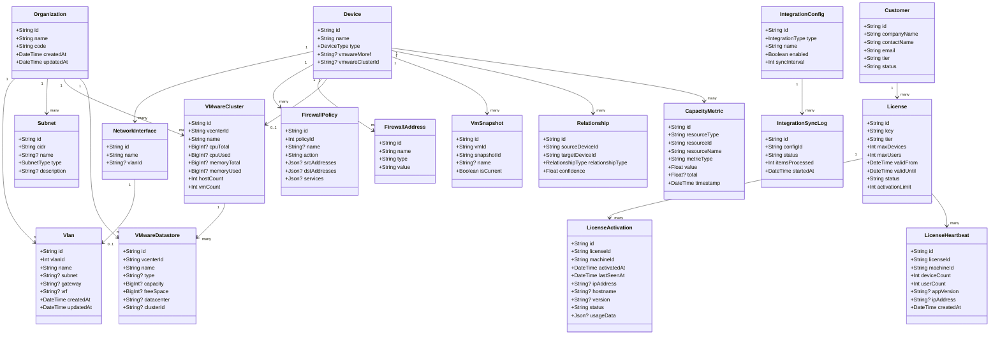
```mermaid
classDiagram
class Organization {
+String id
+String name
+String code
+DateTime createdAt
+DateTime updatedAt
}
class Vlan {
+String id
+Int vlanId
+String name
+String? subnet
+String? gateway
+String? vrf
+DateTime createdAt
+DateTime updatedAt
}
class Subnet {
+String id
+String cidr
+String? name
+SubnetType type
+String? description
}
class Device {
+String id
+String name
+DeviceType type
+String? vmwareMoref
+String? vmwareClusterId
}
class NetworkInterface {
+String id
+String name
+String? vlanId
}
class FirewallPolicy {
+String id
+Int policyId
+String? name
+String action
+Json? srcAddresses
+Json? dstAddresses
+Json? services
}
class FirewallAddress {
+String id
+String name
+String type
+String value
}
class VMwareCluster {
+String id
+String vcenterId
+String name
+BigInt? cpuTotal
+BigInt? cpuUsed
+BigInt? memoryTotal
+BigInt? memoryUsed
+Int hostCount
+Int vmCount
}
class VMwareDatastore {
+String id
+String vcenterId
+String name
+String? type
+BigInt? capacity
+BigInt? freeSpace
+String? datacenter
+String? clusterId
}
class CapacityMetric {
+String id
+String resourceType
+String resourceId
+String resourceName
+String metricType
+Float value
+Float? total
+DateTime timestamp
}
class VmSnapshot {
+String id
+String vmId
+String snapshotId
+String? name
+Boolean isCurrent
}
class Relationship {
+String id
+String sourceDeviceId
+String targetDeviceId
+RelationshipType relationshipType
+Float confidence
}
class IntegrationConfig {
+String id
+IntegrationType type
+String name
+Boolean enabled
+Int syncInterval
}
class IntegrationSyncLog {
+String id
+String configId
+String status
+Int itemsProcessed
+DateTime startedAt
}
class Customer {
+String id
+String companyName
+String contactName
+String email
+String tier
+String status
}
class License {
+String id
+String key
+String tier
+Int maxDevices
+Int maxUsers
+DateTime validFrom
+DateTime validUntil
+String status
+Int activationLimit
}
class LicenseActivation {
+String id
+String licenseId
+String machineId
+DateTime activatedAt
+DateTime lastSeenAt
+String? ipAddress
+String? hostname
+String? version
+String status
+Json? usageData
}
class LicenseHeartbeat {
+String id
+String licenseId
+String machineId
+Int deviceCount
+Int userCount
+String? appVersion
+String? ipAddress
+DateTime createdAt
}
Organization "1" --> "many" Vlan
Organization "1" --> "many" Subnet
Organization "1" --> "many" VMwareCluster
Organization "1" --> "many" VMwareDatastore
Device "1" --> "many" NetworkInterface
NetworkInterface "1" --> "0..1" Vlan
Device "1" --> "many" FirewallPolicy
Device "1" --> "many" FirewallAddress
Device "1" --> "0..1" VMwareCluster
VMwareCluster "1" --> "many" VMwareDatastore
Device "1" --> "many" VmSnapshot
Device "1" --> "many" Relationship
Device "1" --> "many" CapacityMetric
IntegrationConfig "1" --> "many" IntegrationSyncLog
Customer "1" --> "many" License
License "1" --> "many" LicenseActivation
License "1" --> "many" LicenseHeartbeat
```

**Diagram sources**
- [schema.prisma:11-25](file://prisma/schema.prisma#L11-L25)
- [schema.prisma:591-608](file://prisma/schema.prisma#L591-L608)
- [schema.prisma:611-626](file://prisma/schema.prisma#L611-L626)
- [schema.prisma:152-228](file://prisma/schema.prisma#L152-L228)
- [schema.prisma:231-251](file://prisma/schema.prisma#L231-L251)
- [schema.prisma:629-667](file://prisma/schema.prisma#L629-L667)
- [schema.prisma:669-712](file://prisma/schema.prisma#L669-L712)
- [schema.prisma:694-712](file://prisma/schema.prisma#L694-L712)
- [schema.prisma:715-727](file://prisma/schema.prisma#L715-L727)
- [schema.prisma:729-742](file://prisma/schema.prisma#L729-L742)
- [schema.prisma:745-762](file://prisma/schema.prisma#L745-L762)
- [schema.prisma:765-801](file://prisma/schema.prisma#L765-L801)
- [schema.prisma:1382-1487](file://prisma/schema.prisma#L1382-L1487)

## Detailed Component Analysis

### VLAN Management
- Purpose: Define Layer 2 broadcast domains with optional subnet association, gateway, and VRF support.
- Key attributes:
  - VLAN identifier, name, description
  - Optional CIDR subnet, gateway, VRF
  - Organization-scoped uniqueness on (organizationId, vlanId)
- Relationships:
  - Associated with NetworkInterface and Subnet
  - Belongs to Organization

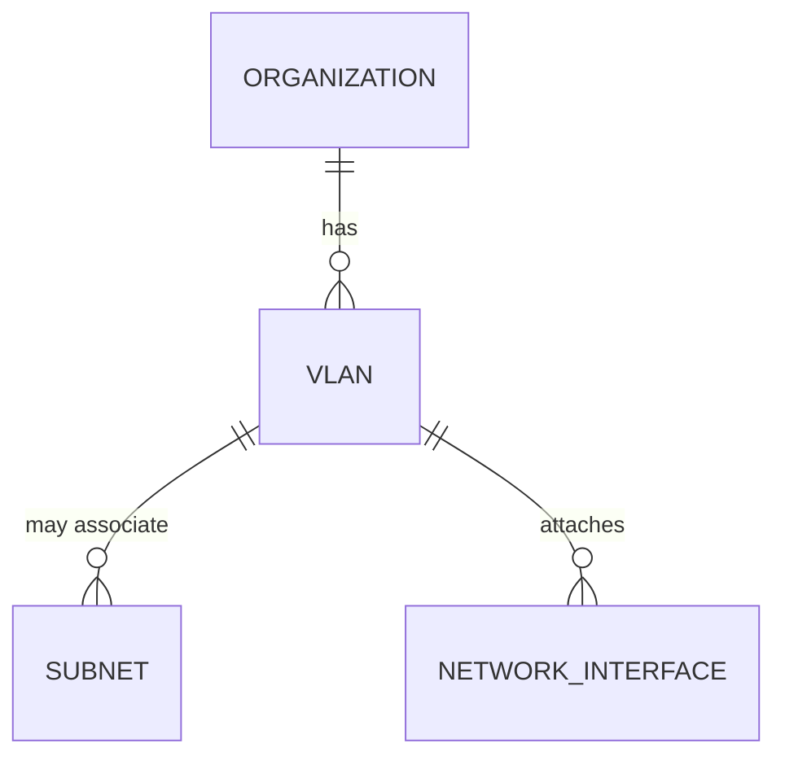
```mermaid
erDiagram
ORGANIZATION ||--o{ VLAN : "has"
VLAN ||--o{ SUBNET : "may associate"
VLAN ||--o{ NETWORK_INTERFACE : "attaches"
```

**Diagram sources**
- [schema.prisma:591-608](file://prisma/schema.prisma#L591-L608)
- [schema.prisma:611-626](file://prisma/schema.prisma#L611-L626)
- [schema.prisma:231-251](file://prisma/schema.prisma#L231-L251)

**Section sources**
- [schema.prisma:591-608](file://prisma/schema.prisma#L591-L608)
- [schema.prisma:611-626](file://prisma/schema.prisma#L611-L626)

### Subnet Models
- Purpose: Allocate IP address spaces using CIDR notation with typed categories.
- Key attributes:
  - CIDR, name, type (management, production, development, DMZ, guest, reserved), description
  - Optional VLAN linkage
  - Organization-scoped uniqueness on (organizationId, cidr)
- Relationships:
  - Links to Vlan via optional foreign key

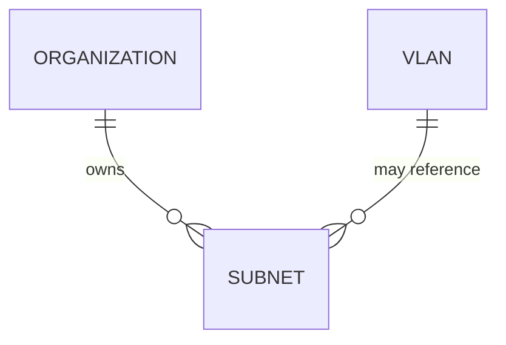
```mermaid
erDiagram
ORGANIZATION ||--o{ SUBNET : "owns"
VLAN ||--o{ SUBNET : "may reference"
```

**Diagram sources**
- [schema.prisma:611-626](file://prisma/schema.prisma#L611-L626)
- [schema.prisma:591-608](file://prisma/schema.prisma#L591-L608)

**Section sources**
- [schema.prisma:611-626](file://prisma/schema.prisma#L611-L626)

### Firewall Policies and Addresses (Fortinet Integration)
- FirewallPolicy:
  - Device-scoped policies with unique (deviceId, policyId)
  - Fields for action, interfaces, source/destination addresses, services, schedule, hit counters
- FirewallAddress:
  - Address objects (IP, FQDN, geoip, group) associated with a device
- Relationships:
  - Both models belong to Device

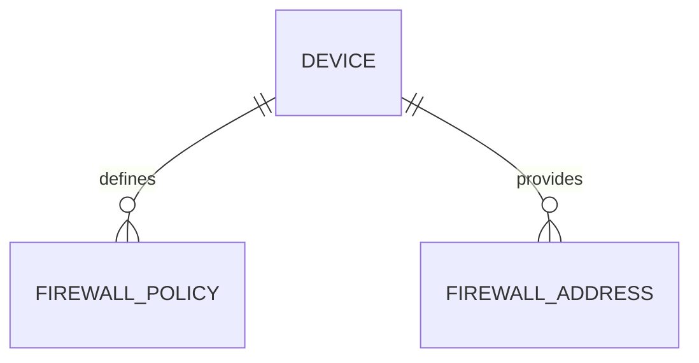
```mermaid
erDiagram
DEVICE ||--o{ FIREWALL_POLICY : "defines"
DEVICE ||--o{ FIREWALL_ADDRESS : "provides"
```

**Diagram sources**
- [schema.prisma:629-667](file://prisma/schema.prisma#L629-L667)
- [schema.prisma:152-228](file://prisma/schema.prisma#L152-L228)

**Section sources**
- [schema.prisma:629-667](file://prisma/schema.prisma#L629-L667)

### VMware Integration (Clusters, Datastores, Snapshots)
- VMwareCluster:
  - vCenter-scoped cluster with CPU/memory totals/usage, host and VM counts, status
  - Organization-scoped
- VMwareDatastore:
  - Storage resource with capacity/free space, type, datacenter, and optional cluster linkage
- VmSnapshot:
  - Snapshot records for VMs with current flag and size
- Relationships:
  - Device can reference a VMwareCluster (host-to-cluster)
  - Cluster has many datastores
  - Device has many snapshots

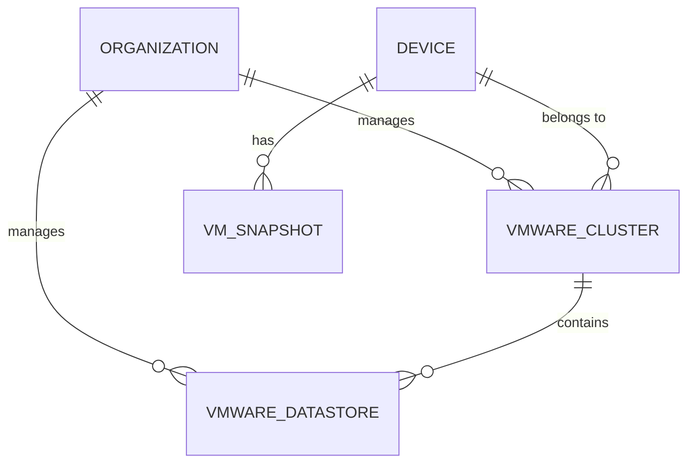
```mermaid
erDiagram
ORGANIZATION ||--o{ VMWARE_CLUSTER : "manages"
ORGANIZATION ||--o{ VMWARE_DATASTORE : "manages"
VMWARE_CLUSTER ||--o{ VMWARE_DATASTORE : "contains"
DEVICE ||--o{ VM_SNAPSHOT : "has"
DEVICE ||--o{ VMWARE_CLUSTER : "belongs to"
```

**Diagram sources**
- [schema.prisma:669-712](file://prisma/schema.prisma#L669-L712)
- [schema.prisma:694-712](file://prisma/schema.prisma#L694-L712)
- [schema.prisma:729-742](file://prisma/schema.prisma#L729-L742)
- [schema.prisma:152-228](file://prisma/schema.prisma#L152-L228)

**Section sources**
- [schema.prisma:669-712](file://prisma/schema.prisma#L669-L712)
- [schema.prisma:694-712](file://prisma/schema.prisma#L694-L712)
- [schema.prisma:729-742](file://prisma/schema.prisma#L729-L742)
- [vmware.md:1-133](file://docs/20-modules/integrations/vmware.md#L1-L133)
- [vmware.ts:1-800](file://lib/integrations/vmware.ts#L1-L800)

### Capacity Monitoring (Time-Series Metrics)
- CapacityMetric:
  - Tracks resourceType (cluster/host/datastore), resourceId/resourceName
  - metricType (cpu, memory, disk)
  - value and optional total
  - timestamped entries for trend analysis
- Usage:
  - Supports dashboards and capacity planning queries

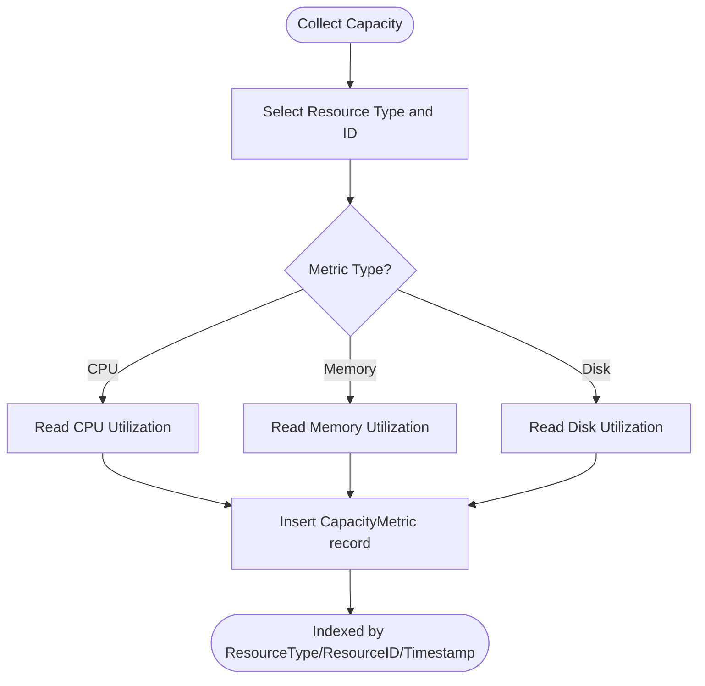
```mermaid
flowchart TD
Start(["Collect Capacity"]) --> SelectRes["Select Resource Type and ID"]
SelectRes --> MetricType{"Metric Type?"}
MetricType --> |CPU| ReadCPU["Read CPU Utilization"]
MetricType --> |Memory| ReadMem["Read Memory Utilization"]
MetricType --> |Disk| ReadDisk["Read Disk Utilization"]
ReadCPU --> Store["Insert CapacityMetric record"]
ReadMem --> Store
ReadDisk --> Store
Store --> End(["Indexed by ResourceType/ResourceID/Timestamp"])
```

**Diagram sources**
- [schema.prisma:715-727](file://prisma/schema.prisma#L715-L727)

**Section sources**
- [schema.prisma:715-727](file://prisma/schema.prisma#L715-L727)

### Virtual Machine Snapshots
- VmSnapshot:
  - Links VMs (Device) to snapshot identifiers
  - Tracks name, description, size, creation time, and current flag
- Use cases:
  - Backup verification, rollback readiness, drift analysis

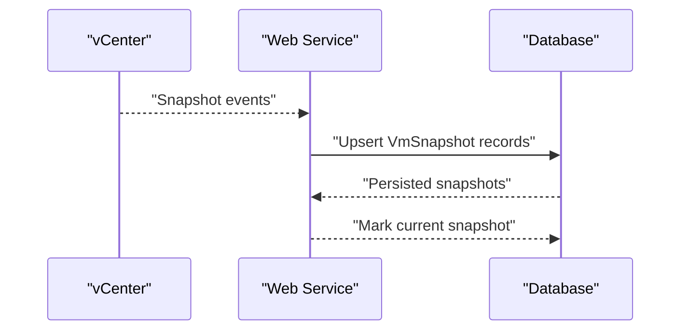
```mermaid
sequenceDiagram
participant VC as "vCenter"
participant WS as "Web Service"
participant DB as "Database"
VC-->>WS : "Snapshot events"
WS->>DB : "Upsert VmSnapshot records"
DB-->>WS : "Persisted snapshots"
WS-->>DB : "Mark current snapshot"
```

**Diagram sources**
- [schema.prisma:729-742](file://prisma/schema.prisma#L729-L742)
- [vmware.md:74-81](file://docs/20-modules/integrations/vmware.md#L74-L81)

**Section sources**
- [schema.prisma:729-742](file://prisma/schema.prisma#L729-L742)
- [vmware.md:74-81](file://docs/20-modules/integrations/vmware.md#L74-L81)

### Relationships (Topology and Dependencies)
- Relationship:
  - Edges between devices with typed relationships and confidence
  - Properties JSON supports carrying auxiliary data (e.g., VLAN IDs, policy IDs)
- Types include containment, physical connections, virtual runs-on, cluster membership, VLAN membership, firewall policy edges, service dependencies, HA pairs, uplinks, and spanning tree blocking

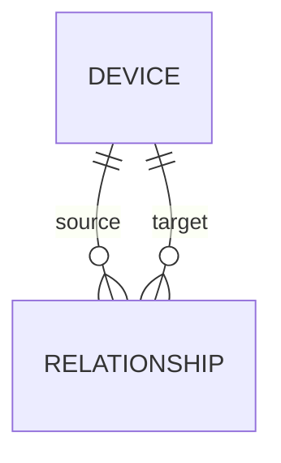
```mermaid
erDiagram
DEVICE ||--o{ RELATIONSHIP : "source"
DEVICE ||--o{ RELATIONSHIP : "target"
```

**Diagram sources**
- [schema.prisma:745-762](file://prisma/schema.prisma#L745-L762)
- [schema.prisma:896-907](file://prisma/schema.prisma#L896-L907)

**Section sources**
- [schema.prisma:745-762](file://prisma/schema.prisma#L745-L762)
- [schema.prisma:896-907](file://prisma/schema.prisma#L896-L907)

### Integration Configuration and Sync Logs
- IntegrationConfig:
  - Stores integration type, name, description, encrypted config, enabled flag, sync interval, and timestamps
  - Unique constraint on (type, name)
- IntegrationSyncLog:
  - Records sync outcomes, item counts, messages, and timing per IntegrationConfig
- Use cases:
  - Centralized management of external system credentials and schedules
  - Auditing and troubleshooting sync issues

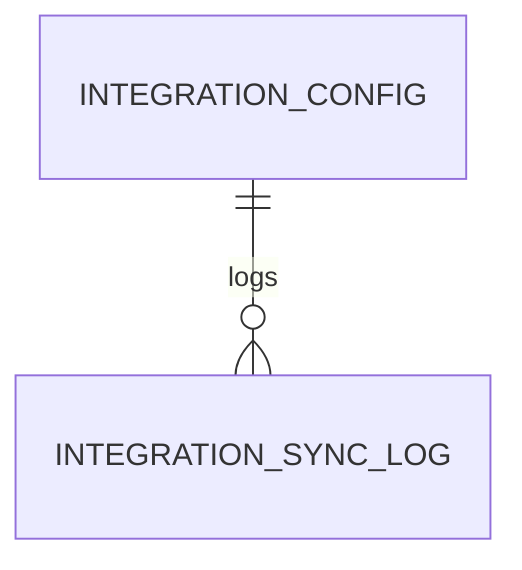
```mermaid
erDiagram
INTEGRATION_CONFIG ||--o{ INTEGRATION_SYNC_LOG : "logs"
```

**Diagram sources**
- [schema.prisma:765-801](file://prisma/schema.prisma#L765-L801)

**Section sources**
- [schema.prisma:765-801](file://prisma/schema.prisma#L765-L801)

## Enterprise Licensing System

### License Management Infrastructure
The enterprise licensing system provides comprehensive license management for on-premise deployments with three distinct tiers: TRIAL, STANDARD, and ENTERPRISE. The system includes complete infrastructure for license activation, validation, heartbeat monitoring, and administrative oversight.

**License Models:**
- **Customer**: Represents license holders with company information, contact details, tier assignment, and status tracking
- **License**: Contains license key, tier level, usage limits (devices/users), validity periods, activation limits, and status
- **LicenseActivation**: Tracks machine activations with hardware fingerprints, IP addresses, versions, and usage data
- **LicenseHeartbeat**: Monitors ongoing usage patterns and system health

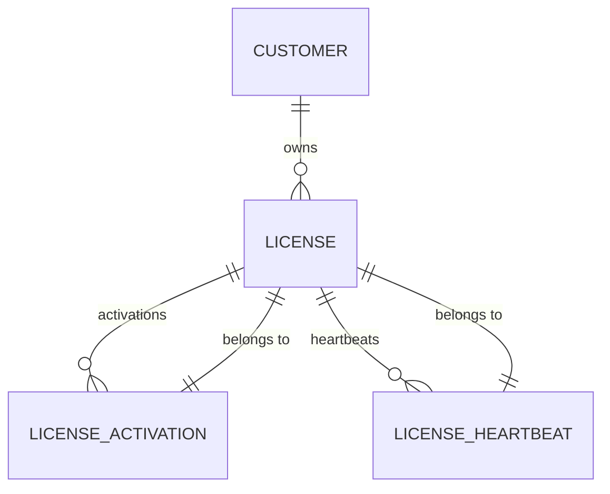
```mermaid
erDiagram
CUSTOMER ||--o{ LICENSE : "owns"
LICENSE ||--o{ LICENSE_ACTIVATION : "activations"
LICENSE ||--o{ LICENSE_HEARTBEAT : "heartbeats"
LICENSE_ACTIVATION ||--|| LICENSE : "belongs to"
LICENSE_HEARTBEAT ||--|| LICENSE : "belongs to"
```

**Diagram sources**
- [schema.prisma:1382-1487](file://prisma/schema.prisma#L1382-L1487)

**Section sources**
- [schema.prisma:1382-1487](file://prisma/schema.prisma#L1382-L1487)

### License Activation Process
The license activation process establishes secure bindings between license keys and on-premise installations using machine identification and JWT token validation.

**Activation Workflow:**
1. Client requests license activation with license key and machine ID
2. Server validates license key and customer status
3. Checks activation limits and existing activations
4. Creates/upserts license activation record
5. Issues signed JWT token with license details
6. Returns token and license state to client

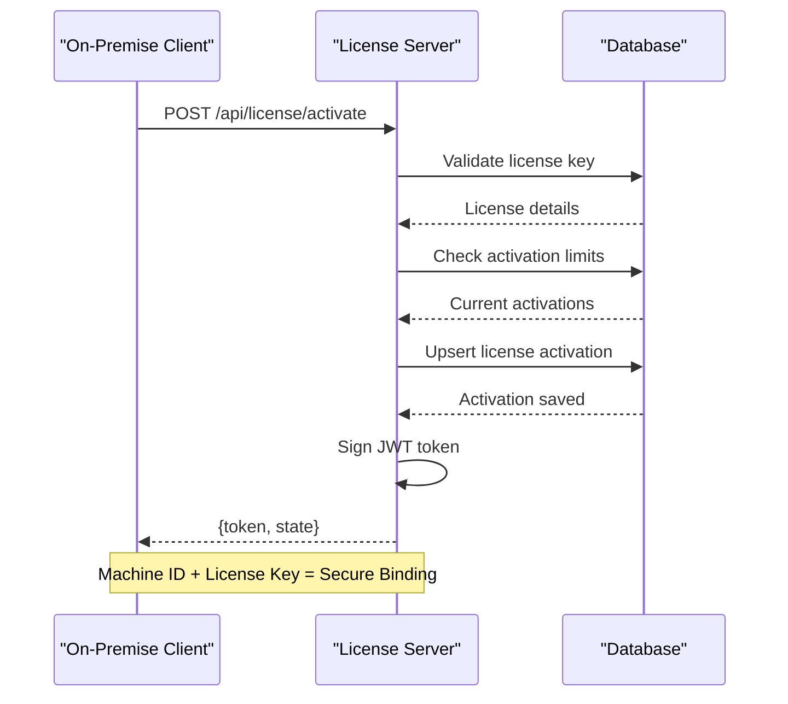
```mermaid
sequenceDiagram
participant Client as "On-Premise Client"
participant Server as "License Server"
participant DB as "Database"
Client->>Server : POST /api/license/activate
Server->>DB : Validate license key
DB-->>Server : License details
Server->>DB : Check activation limits
DB-->>Server : Current activations
Server->>DB : Upsert license activation
DB-->>Server : Activation saved
Server->>Server : Sign JWT token
Server-->>Client : {token, state}
Note over Client,Server : Machine ID + License Key = Secure Binding
```

**Diagram sources**
- [activate/route.ts:16-138](file://app/api/license/activate/route.ts#L16-L138)
- [client.ts:119-142](file://lib/license/client.ts#L119-L142)

**Section sources**
- [activate/route.ts:16-138](file://app/api/license/activate/route.ts#L16-L138)
- [client.ts:119-142](file://lib/license/client.ts#L119-L142)

### License Validation and Heartbeat
The validation system operates on a 24-hour cycle with intelligent caching and grace period handling for network outages.

**Validation Logic:**
- **Normal Operation**: Server validation with JWT token verification
- **Grace Period**: 7-day grace period using cached license state during outages
- **Restricted Mode**: Read-only operation after grace period expiration
- **Heartbeat Monitoring**: Periodic usage reporting (every 6-12 hours)

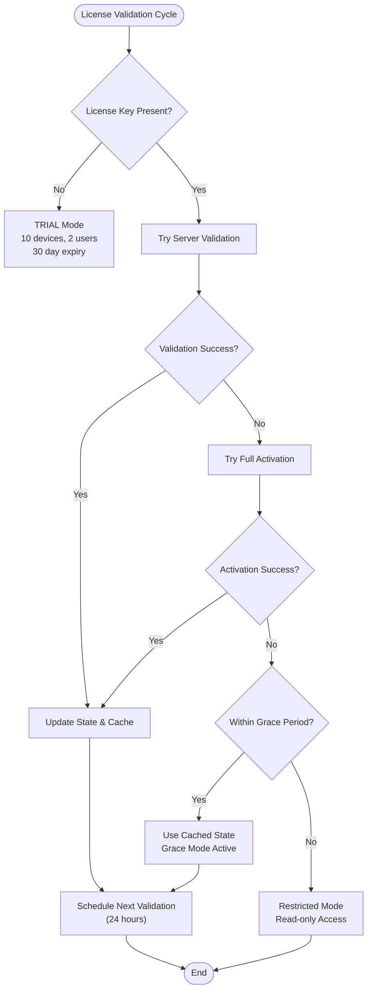
```mermaid
flowchart TD
Start(["License Validation Cycle"]) --> CheckKey{"License Key Present?"}
CheckKey --> |No| TrialMode["TRIAL Mode<br/>10 devices, 2 users<br/>30 day expiry"]
CheckKey --> |Yes| TryValidate["Try Server Validation"]
TryValidate --> ValidateSuccess{"Validation Success?"}
ValidateSuccess --> |Yes| UpdateState["Update State & Cache"]
ValidateSuccess --> |No| TryActivate["Try Full Activation"]
TryActivate --> ActivateSuccess{"Activation Success?"}
ActivateSuccess --> |Yes| UpdateState
ActivateSuccess --> |No| CheckGrace{"Within Grace Period?"}
CheckGrace --> |Yes| UseCache["Use Cached State<br/>Grace Mode Active"]
CheckGrace --> |No| Restricted["Restricted Mode<br/>Read-only Access"]
UpdateState --> ScheduleNext["Schedule Next Validation<br/>(24 hours)"]
UseCache --> ScheduleNext
Restricted --> End(["End"])
ScheduleNext --> End
```

**Diagram sources**
- [client.ts:180-265](file://lib/license/client.ts#L180-L265)
- [install-guide.html:641-669](file://deploy/install-guide.html#L641-L669)

**Section sources**
- [client.ts:180-265](file://lib/license/client.ts#L180-L265)
- [install-guide.html:641-669](file://deploy/install-guide.html#L641-L669)

### JWT Token Management
The system uses JWT tokens for secure license validation with automatic renewal and expiration handling.

**Token Features:**
- HS256 signing algorithm with configurable secret
- Payload includes license details, tier, limits, and machine ID
- Automatic expiration matching license validity
- Verification with proper error handling for expired tokens

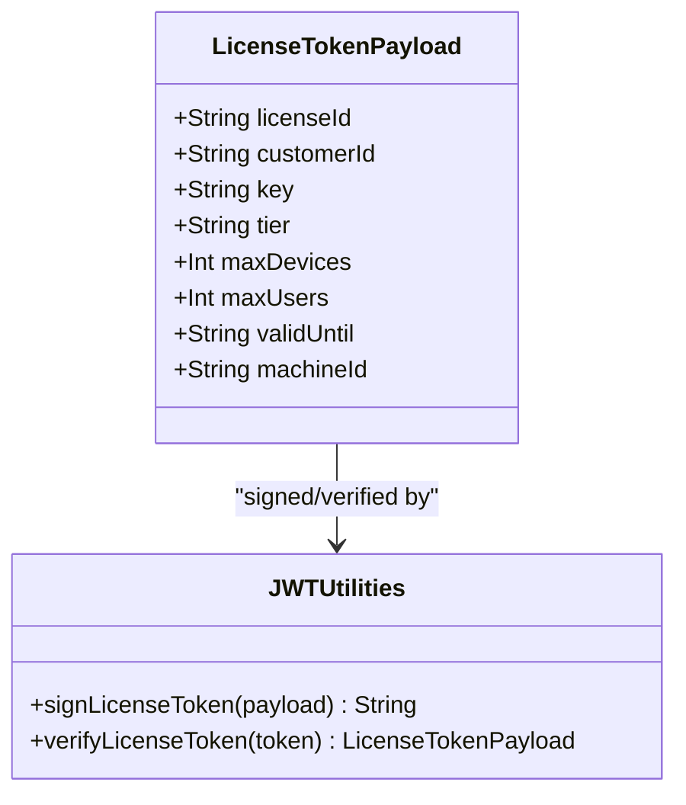
```mermaid
classDiagram
class LicenseTokenPayload {
+String licenseId
+String customerId
+String key
+String tier
+Int maxDevices
+Int maxUsers
+String validUntil
+String machineId
}
class JWTUtilities {
+signLicenseToken(payload) String
+verifyLicenseToken(token) LicenseTokenPayload
}
LicenseTokenPayload --> JWTUtilities : "signed/verified by"
```

**Diagram sources**
- [jwt.ts:13-57](file://lib/license/jwt.ts#L13-L57)

**Section sources**
- [jwt.ts:13-57](file://lib/license/jwt.ts#L13-L57)

### Machine Identification System
The machine identification system creates stable hardware fingerprints for secure license binding across different deployment environments.

**Identification Strategies:**
- **Docker**: Container hostname + volume UUID for persistent identification
- **Linux**: `/etc/machine-id` for system-wide unique identification
- **macOS**: IOPlatformSerialNumber via ioreg for hardware-bound identification
- **Fallback**: Random UUID persisted to `.machine-id` file for portability

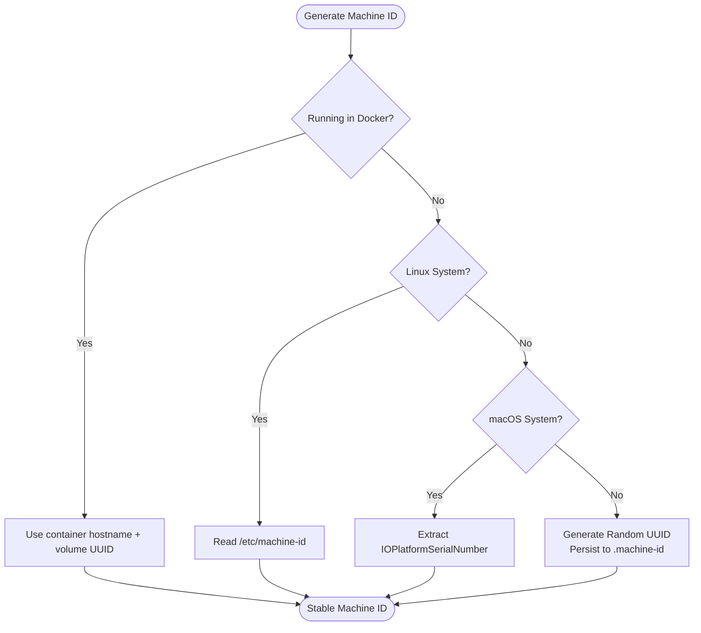
```mermaid
flowchart TD
Start(["Generate Machine ID"]) --> CheckDocker{"Running in Docker?"}
CheckDocker --> |Yes| DockerID["Use container hostname + volume UUID"]
CheckDocker --> |No| CheckLinux{"Linux System?"}
CheckLinux --> |Yes| LinuxID["Read /etc/machine-id"]
CheckLinux --> |No| CheckMac{"macOS System?"}
CheckMac --> |Yes| MacID["Extract IOPlatformSerialNumber"]
CheckMac --> |No| Fallback["Generate Random UUID<br/>Persist to .machine-id"]
DockerID --> End(["Stable Machine ID"])
LinuxID --> End
MacID --> End
Fallback --> End
```

**Diagram sources**
- [machine-id.ts:31-82](file://lib/license/machine-id.ts#L31-L82)

**Section sources**
- [machine-id.ts:31-82](file://lib/license/machine-id.ts#L31-L82)

## License Management APIs

### Activation API
The activation endpoint handles initial license key registration and machine binding.

**Endpoint**: `POST /api/license/activate`
**Purpose**: Register license key on a machine for the first time
**Request**: `{ licenseKey: string, machineId: string }`
**Response**: `{ token: string, state: LicenseState }`

**Section sources**
- [activate/route.ts:16-138](file://app/api/license/activate/route.ts#L16-L138)

### Validation API
The validation endpoint performs periodic license state verification and token renewal.

**Endpoint**: `POST /api/license/validate`
**Purpose**: Validate existing license activation and refresh tokens
**Request**: `{ licenseKey: string, machineId: string, token?: string }`
**Response**: `{ valid: boolean, state: LicenseState, token?: string }`

**Section sources**
- [validate/route.ts:16-156](file://app/api/license/validate/route.ts#L16-L156)

### Heartbeat API
The heartbeat endpoint tracks ongoing usage patterns and system health.

**Endpoint**: `POST /api/license/heartbeat`
**Purpose**: Report usage statistics and system health
**Request**: `{ licenseKey: string, machineId: string, deviceCount?: number, userCount?: number, appVersion?: string }`
**Response**: `{ success: boolean, warnings?: string[], daysRemaining: number }`

**Section sources**
- [heartbeat/route.ts:14-124](file://app/api/license/heartbeat/route.ts#L14-L124)

### Status API
The status endpoint provides administrative license information and usage statistics.

**Endpoint**: `GET /api/license/status`
**Purpose**: Retrieve current license status for administrative monitoring
**Response**: `{ license: AdminLicenseInfo, usage: { deviceCount: number, userCount: number } }`

**Section sources**
- [status/route.ts:12-37](file://app/api/license/status/route.ts#L12-L37)

## Feature Gating and Access Control

### License Tiers and Feature Matrix
The licensing system implements tier-based feature gating across TRIAL, STANDARD, and ENTERPRISE tiers with granular access control.

**Feature Availability Matrix:**
- **TRIAL**: Basic features with limitations (10 devices, 2 users, 30-day expiry)
- **STANDARD**: Core enterprise features plus integrations (VMware, Fortinet, Zabbix)
- **ENTERPRISE**: Advanced analytics, reporting, API access, and premium features

**Core Features** (Always Available):
- Dashboard, Devices, Locations, Racks, NMS, Alarms

**Standard Features**:
- Integrations: VMware, Fortinet, Zabbix
- Reports, Audit

**Enterprise Features**:
- Advanced Reports, External API, Analytics, Premium Audit

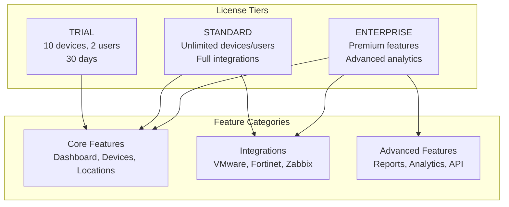
```mermaid
graph TB
subgraph "License Tiers"
TRIAL["TRIAL<br/>10 devices, 2 users<br/>30 days"]
STANDARD["STANDARD<br/>Unlimited devices/users<br/>Full integrations"]
ENTERPRISE["ENTERPRISE<br/>Premium features<br/>Advanced analytics"]
end
subgraph "Feature Categories"
CORE["Core Features<br/>Dashboard, Devices, Locations"]
INT["Integrations<br/>VMware, Fortinet, Zabbix"]
ADV["Advanced Features<br/>Reports, Analytics, API"]
end
TRIAL --> CORE
STANDARD --> CORE
STANDARD --> INT
ENTERPRISE --> CORE
ENTERPRISE --> INT
ENTERPRISE --> ADV
```

**Diagram sources**
- [features.ts:25-51](file://lib/license/features.ts#L25-L51)

**Section sources**
- [features.ts:25-51](file://lib/license/features.ts#L25-L51)

### Usage Limit Checking
The system enforces usage limits through device and user count validation with configurable thresholds.

**Limit Enforcement:**
- Device count checks against `maxDevices` limit (90% threshold for warnings)
- User count checks against `maxUsers` limit (90% threshold for warnings)
- Automatic warnings when approaching limits
- Graceful degradation when limits exceeded

**Section sources**
- [features.ts:78-90](file://lib/license/features.ts#L78-L90)
- [heartbeat/route.ts:84-96](file://app/api/license/heartbeat/route.ts#L84-L96)

### Administrative License Interface
The administrative interface provides comprehensive license management with status monitoring, usage statistics, and license administration.

**Administrative Features:**
- License status display with visual indicators (Active, Expiring Soon, Grace Period, Invalid)
- Technical details including license key and machine ID
- Usage statistics (device and user counts)
- License information formatting with color-coded status indicators

**Section sources**
- [page.tsx:176-394](file://app/settings/license/page.tsx#L176-L394)

## Dependency Analysis
- Foreign keys enforce referential integrity across models:
  - Vlan.organizationId -> Organization.id
  - Subnet.organizationId -> Organization.id; Subnet.vlanId -> Vlan.id
  - Device.vmwareClusterId -> VMwareCluster.id
  - NetworkInterface.vlanId -> Vlan.id
  - FirewallPolicy.deviceId -> Device.id; FirewallAddress.deviceId -> Device.id
  - VMwareDatastore.clusterId -> VMwareCluster.id
  - VmSnapshot.vmId -> Device.id
  - Relationship.sourceDeviceId/targetDeviceId -> Device.id
  - IntegrationSyncLog.configId -> IntegrationConfig.id
  - License.customerId -> Customer.id
  - LicenseActivation.licenseId -> License.id
  - LicenseHeartbeat.licenseId -> License.id
  - LicenseActivation.customerId -> Customer.id
  - LicenseActivation.machineId -> LicenseActivation.id

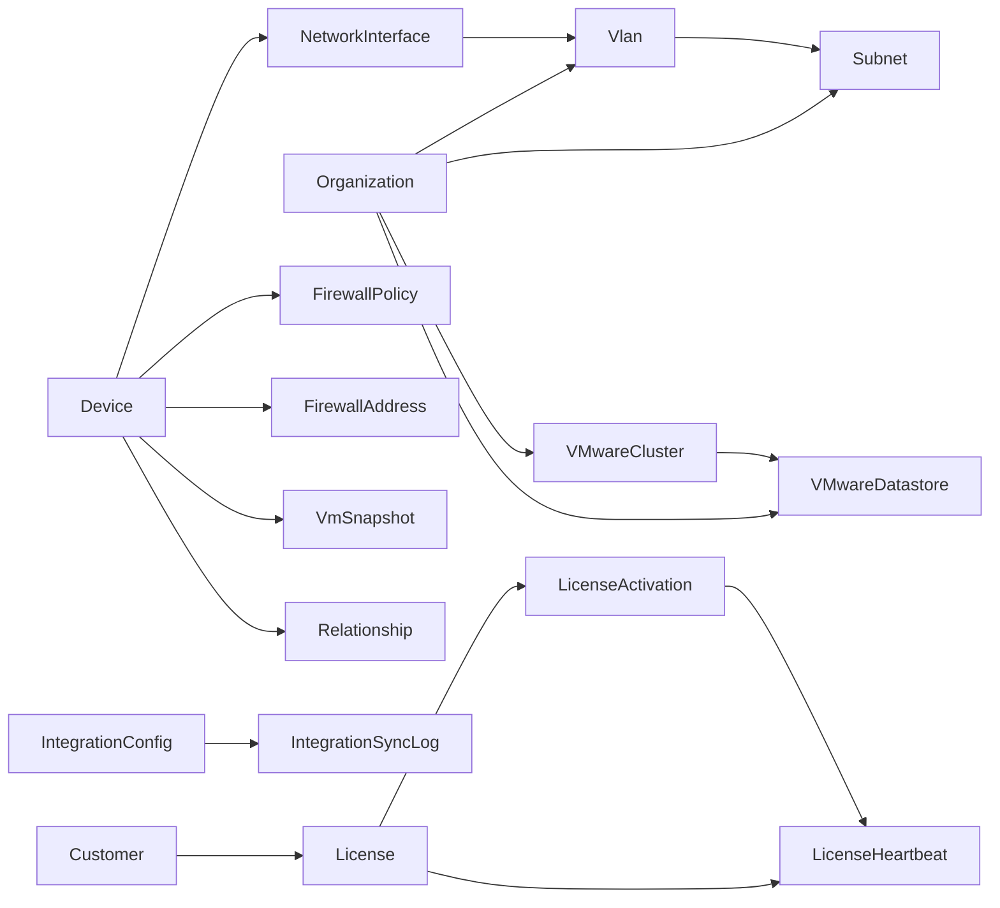
```mermaid
graph LR
ORG["Organization"] --> VLAN["Vlan"]
ORG --> SUB["Subnet"]
VLAN --> SUB
ORG --> CLU["VMwareCluster"]
ORG --> DS["VMwareDatastore"]
CLU --> DS
DEV["Device"] --> NI["NetworkInterface"]
NI --> VLAN
DEV --> FPOL["FirewallPolicy"]
DEV --> FADDR["FirewallAddress"]
DEV --> SNAP["VmSnapshot"]
DEV --> REL["Relationship"]
ICONF["IntegrationConfig"] --> ISLOG["IntegrationSyncLog"]
CUST["Customer"] --> LIC["License"]
LIC --> LACT["LicenseActivation"]
LIC --> LHB["LicenseHeartbeat"]
LACT --> LHB
```

**Diagram sources**
- [migration.sql:346-387](file://prisma/migrations/20260130053347_enterprise_extension/migration.sql#L346-L387)

**Section sources**
- [migration.sql:346-387](file://prisma/migrations/20260130053347_enterprise_extension/migration.sql#L346-L387)

## Performance Considerations
- Indexes on frequently queried fields (e.g., device IDs, timestamps, organization IDs, license keys) improve lookup performance for relationships, firewall policies, capacity metrics, and licensing operations.
- Time-series partitioning strategies can be considered for CapacityMetric and LicenseHeartbeat to manage long histories efficiently.
- Caching strategies (e.g., snapshot cache TTL, license state cache) reduce repeated API calls in integrations like VMware and licensing validation.
- JWT token caching reduces cryptographic overhead during frequent validation cycles.
- Grace period caching ensures minimal performance impact during network outages.

## Troubleshooting Guide
- **Licensing Issues**
  - Activation failures: Verify license key validity, customer status, and activation limits; check machine ID generation and JWT secret configuration.
  - Validation failures: Confirm network connectivity to license server, token expiration, and proper JWT secret environment variable.
  - Grace period problems: Check cache file permissions, disk space, and grace period configuration.
- **VMware Integration**
  - Authentication failures: Verify vCenter credentials and certificate handling; ensure session cookies are refreshed.
  - SOAP session expiration: Re-bootstrap via SDK login when sessions expire.
  - Event synchronization: Confirm EventHistoryCollector availability and filter logic; events are parsed from SOAP responses.
- **Firewall Integration**
  - Policy conflicts: Validate unique policy IDs per device; review source/destination addresses and services arrays.
- **Capacity Monitoring**
  - Missing metrics: Confirm collection intervals and resource tagging; check timestamp indexing.
- **Integration Logs**
  - Review IntegrationSyncLog for detailed error messages and item counts to diagnose sync issues.

**Section sources**
- [vmware.md:119-127](file://docs/20-modules/integrations/vmware.md#L119-L127)
- [vmware.ts:168-215](file://lib/integrations/vmware.ts#L168-L215)
- [vmware.ts:220-267](file://lib/integrations/vmware.ts#L220-L267)
- [schema.prisma:765-801](file://prisma/schema.prisma#L765-L801)
- [client.ts:230-265](file://lib/license/client.ts#L230-L265)

## Conclusion
The enterprise feature set, enhanced with comprehensive licensing capabilities, builds a robust foundation for network and virtualization visibility, policy enforcement, and operational observability. The new licensing system provides secure on-premise deployment management with tier-based access control, machine identification, JWT token validation, and administrative oversight. The data models emphasize strong referential integrity, extensibility, and auditability. Integrations with VMware and Fortinet are first-class citizens, enabling real-time insights and automated workflows while maintaining strict license compliance.

## Appendices

### Enterprise Feature Configuration Examples
- **VLAN/Subnet**
  - Create VLAN with optional subnet/gateway/VRF; assign to network interfaces and subnets.
- **Firewall Policies**
  - Define policies per FortiGate device with unique IDs; populate address and service arrays.
- **VMware**
  - Configure vCenter credentials and sync intervals; validate REST/SOAP connectivity and event history.
- **Capacity Planning Queries**
  - Aggregate CapacityMetric by resourceType/resourceId and metricType over time windows to identify growth trends and saturation points.
- **Security and Audit**
  - Enable audit logging for sensitive changes; maintain encrypted integration configs; apply whitelists for known automation events.
- **Licensing Setup**
  - Configure license key and server URL environment variables; initialize license system on application startup; monitor license status through administrative interface.
- **Feature Gating**
  - Implement tier-based feature access control; configure usage limits; handle grace period and restricted mode transitions.

### License Administration Interface
The administrative license interface provides comprehensive monitoring and management capabilities:

**Visual Status Indicators:**
- **Active**: Green badge with check icon for valid, active licenses
- **Expiring Soon**: Orange badge with clock icon for licenses with ≤30 days remaining
- **Grace Period**: Yellow badge with warning triangle for temporary grace period
- **Invalid**: Red badge with X circle for invalid or expired licenses

**Technical Information Display:**
- License key masking for security
- Machine ID display with shortened identifier
- Tier and validity period information
- Usage statistics and limit warnings

**Section sources**
- [page.tsx:176-394](file://app/settings/license/page.tsx#L176-L394)
- [install-guide.html:641-669](file://deploy/install-guide.html#L641-L669)