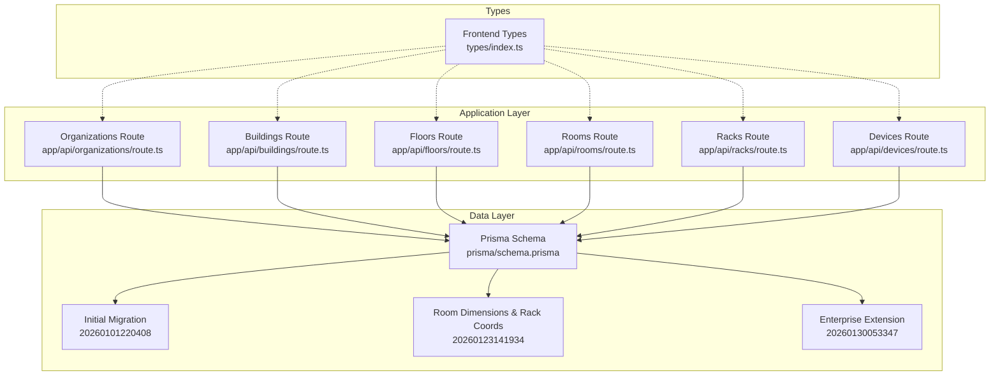
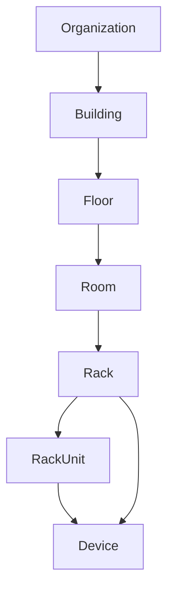
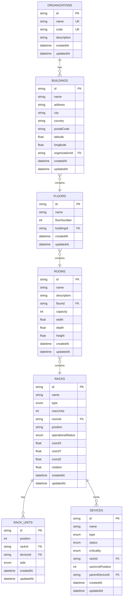
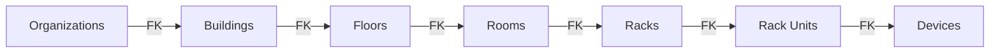

# Infrastructure Hierarchy

<cite>
**Referenced Files in This Document**
- [schema.prisma](file://prisma/schema.prisma)
- [initial_schema migration.sql](file://prisma/migrations/20260101220408_initial_schema/migration.sql)
- [room_dimensions_rack_coordinates migration.sql](file://prisma/migrations/20260123141934_add_room_dimensions_rack_coordinates/migration.sql)
- [enterprise_extension migration.sql](file://prisma/migrations/20260130053347_enterprise_extension/migration.sql)
- [prisma.ts](file://lib/prisma.ts)
- [organizations route.ts](file://app/api/organizations/route.ts)
- [buildings route.ts](file://app/api/buildings/route.ts)
- [floors route.ts](file://app/api/floors/route.ts)
- [rooms route.ts](file://app/api/rooms/route.ts)
- [racks route.ts](file://app/api/racks/route.ts)
- [devices route.ts](file://app/api/devices/route.ts)
- [types/index.ts](file://types/index.ts)
</cite>

## Table of Contents
1. [Introduction](#introduction)
2. [Project Structure](#project-structure)
3. [Core Components](#core-components)
4. [Architecture Overview](#architecture-overview)
5. [Detailed Component Analysis](#detailed-component-analysis)
6. [Dependency Analysis](#dependency-analysis)
7. [Performance Considerations](#performance-considerations)
8. [Troubleshooting Guide](#troubleshooting-guide)
9. [Conclusion](#conclusion)
10. [Appendices](#appendices)

## Introduction
This document provides comprehensive data model documentation for the hierarchical infrastructure management entities. It focuses on the top-down hierarchy from Organization down to RackUnit, detailing unique constraints, foreign key relationships, and cascade deletion behaviors. It also covers dimensional properties for Rooms and Rack coordinate systems, along with practical query patterns for location-based filtering and capacity planning.

## Project Structure
The data model is defined in the Prisma schema and enforced by PostgreSQL migrations. API routes demonstrate how the backend queries and caches hierarchical data efficiently. Frontend TypeScript types mirror the backend models for type safety.

**Diagram sources**
- [schema.prisma](file://prisma/schema.prisma)
- [initial_schema migration.sql](file://prisma/migrations/20260101220408_initial_schema/migration.sql)
- [room_dimensions_rack_coordinates migration.sql](file://prisma/migrations/20260123141934_add_room_dimensions_rack_coordinates/migration.sql)
- [enterprise_extension migration.sql](file://prisma/migrations/20260130053347_enterprise_extension/migration.sql)
- [organizations route.ts](file://app/api/organizations/route.ts)
- [buildings route.ts](file://app/api/buildings/route.ts)
- [floors route.ts](file://app/api/floors/route.ts)
- [rooms route.ts](file://app/api/rooms/route.ts)
- [racks route.ts](file://app/api/racks/route.ts)
- [devices route.ts](file://app/api/devices/route.ts)
- [types/index.ts](file://types/index.ts)

**Section sources**
- [prisma/schema.prisma](file://prisma/schema.prisma)
- [prisma/migrations/20260101220408_initial_schema/migration.sql](file://prisma/migrations/20260101220408_initial_schema/migration.sql)
- [prisma/migrations/20260123141934_add_room_dimensions_rack_coordinates/migration.sql](file://prisma/migrations/20260123141934_add_room_dimensions_rack_coordinates/migration.sql)
- [prisma/migrations/20260130053347_enterprise_extension/migration.sql](file://prisma/migrations/20260130053347_enterprise_extension/migration.sql)
- [lib/prisma.ts](file://lib/prisma.ts)

## Core Components
This section documents each entity in the infrastructure hierarchy, including primary keys, unique constraints, relationships, and cascade behaviors.

- Organization
  - Purpose: Top-level tenant entity.
  - Unique constraints: name, code.
  - Relationships: One-to-many with Building via organizationId.
  - Cascade behavior: Deletion handled by foreign key constraints in migrations.
  - Notes: Also includes enterprise extensions (VLANs, Subnets, VMware) not covered here.

- Building
  - Purpose: Physical site/property.
  - Unique constraint: (organizationId, name).
  - Geographic fields: latitude, longitude.
  - Relationships: Many-to-one to Organization; one-to-many to Floor.
  - Cascade behavior: Floors cascade on delete.

- Floor
  - Purpose: Level within a building.
  - Unique constraint: (buildingId, floorNumber).
  - Relationships: Many-to-one to Building; one-to-many to Room.

- Room
  - Purpose: Equipment room on a floor.
  - Unique constraint: (floorId, name).
  - Dimensional properties: width, depth, height.
  - Relationships: Many-to-one to Floor; one-to-many to Rack.

- Rack
  - Purpose: Equipment rack with capacity planning.
  - Unique constraint: (roomId, name).
  - Positioning: coordX, coordY, coordZ, rotation.
  - Capacity: type (enum), maxUnits (default 42).
  - Operational status: operationalStatus (enum).
  - Relationships: Many-to-one to Room; one-to-many to RackUnit and Device.

- RackUnit
  - Purpose: Individual U-height position with side assignment.
  - Unique constraint: (rackId, position, side).
  - Side: FRONT or REAR.
  - Relationships: Many-to-one to Rack; optional Device relation.

- Device
  - Purpose: Physical or virtual equipment.
  - Relationships: Optional many-to-one to Rack; optional many-to-one to parent Device; one-to-many to NetworkInterface, Service, SwitchPort, RackUnit.

**Section sources**
- [schema.prisma](file://prisma/schema.prisma)
- [initial_schema migration.sql](file://prisma/migrations/20260101220408_initial_schema/migration.sql)
- [room_dimensions_rack_coordinates migration.sql](file://prisma/migrations/20260123141934_add_room_dimensions_rack_coordinates/migration.sql)

## Architecture Overview
The system enforces referential integrity at the database level and exposes hierarchical queries via optimized API routes. The Prisma client singleton ensures consistent database access across the application.

**Diagram sources**
- [schema.prisma](file://prisma/schema.prisma)
- [initial_schema migration.sql](file://prisma/migrations/20260101220408_initial_schema/migration.sql)

**Section sources**
- [lib/prisma.ts](file://lib/prisma.ts)
- [prisma/schema.prisma](file://prisma/schema.prisma)

## Detailed Component Analysis

### Entity Relationship Model
This ER model captures primary keys, foreign keys, unique constraints, and cascade behaviors derived from the Prisma schema and migrations.

**Diagram sources**
- [schema.prisma](file://prisma/schema.prisma)
- [initial_schema migration.sql](file://prisma/migrations/20260101220408_initial_schema/migration.sql)
- [room_dimensions_rack_coordinates migration.sql](file://prisma/migrations/20260123141934_add_room_dimensions_rack_coordinates/migration.sql)

**Section sources**
- [schema.prisma](file://prisma/schema.prisma)
- [initial_schema migration.sql](file://prisma/migrations/20260101220408_initial_schema/migration.sql)
- [room_dimensions_rack_coordinates migration.sql](file://prisma/migrations/20260123141934_add_room_dimensions_rack_coordinates/migration.sql)

### Organization Model
- Unique constraints: name, code.
- Relationships: Buildings, VLANs, Subnets, VMware clusters/datastores.
- Cascade behavior: Organization deletion cascades to dependent entities per foreign key definitions.

Typical usage patterns:
- List organizations with building counts.
- Create organization with validated name/code.

**Section sources**
- [schema.prisma](file://prisma/schema.prisma)
- [initial_schema migration.sql](file://prisma/migrations/20260101220408_initial_schema/migration.sql)
- [organizations route.ts](file://app/api/organizations/route.ts)

### Building Model
- Unique constraint: (organizationId, name).
- Geographic fields: latitude, longitude.
- Relationships: Floors, Organization.
- Cascade behavior: Floors cascade on delete.

Location-based filtering examples:
- Filter buildings by organizationId.
- Filter by geographic proximity using latitude/longitude (client-side after retrieval).

**Section sources**
- [schema.prisma](file://prisma/schema.prisma)
- [initial_schema migration.sql](file://prisma/migrations/20260101220408_initial_schema/migration.sql)
- [buildings route.ts](file://app/api/buildings/route.ts)

### Floor Model
- Unique constraint: (buildingId, floorNumber).
- Relationships: Building, Rooms.

Common query patterns:
- List floors with building and room counts.
- Order by building name, then floor number.

**Section sources**
- [schema.prisma](file://prisma/schema.prisma)
- [initial_schema migration.sql](file://prisma/migrations/20260101220408_initial_schema/migration.sql)
- [floors route.ts](file://app/api/floors/route.ts)

### Room Model
- Unique constraint: (floorId, name).
- Dimensional properties: width, depth, height.
- Relationships: Floor, Racks.

Capacity planning:
- Combine room dimensions with rack maxUnits to estimate space utilization.

**Section sources**
- [schema.prisma](file://prisma/schema.prisma)
- [initial_schema migration.sql](file://prisma/migrations/20260101220408_initial_schema/migration.sql)
- [room_dimensions_rack_coordinates migration.sql](file://prisma/migrations/20260123141934_add_room_dimensions_rack_coordinates/migration.sql)
- [rooms route.ts](file://app/api/rooms/route.ts)

### Rack Model
- Unique constraint: (roomId, name).
- Positioning: coordX, coordY, coordZ, rotation.
- Capacity: type (enum), maxUnits (default 42), operationalStatus (enum).
- Relationships: Room, Devices, RackUnits.

Capacity planning:
- Compare devices count vs maxUnits.
- Use coordX/Y/Z for 3D visualization and spatial queries.

**Section sources**
- [schema.prisma](file://prisma/schema.prisma)
- [initial_schema migration.sql](file://prisma/migrations/20260101220408_initial_schema/migration.sql)
- [room_dimensions_rack_coordinates migration.sql](file://prisma/migrations/20260123141934_add_room_dimensions_rack_coordinates/migration.sql)
- [racks route.ts](file://app/api/racks/route.ts)

### RackUnit Model
- Unique constraint: (rackId, position, side).
- Side: FRONT or REAR.
- Relationships: Rack, Device.

Unit management:
- Enforce uniqueness of (position, side) per rack.
- Track device placement per side.

**Section sources**
- [schema.prisma](file://prisma/schema.prisma)
- [initial_schema migration.sql](file://prisma/migrations/20260101220408_initial_schema/migration.sql)
- [racks route.ts](file://app/api/racks/route.ts)

### Device Model
- Relationships: Rack, parentDeviceId, NetworkInterfaces, Services, SwitchPorts, RackUnits.
- Useful for inventory and rack mapping.

**Section sources**
- [schema.prisma](file://prisma/schema.prisma)
- [initial_schema migration.sql](file://prisma/migrations/20260101220408_initial_schema/migration.sql)
- [devices route.ts](file://app/api/devices/route.ts)

## Dependency Analysis
Foreign key relationships and cascade behaviors are defined in the initial migration. Enterprise extension tables (VLANs, Subnets, VMware) are introduced later and maintain their own constraints.

**Diagram sources**
- [initial_schema migration.sql](file://prisma/migrations/20260101220408_initial_schema/migration.sql)

**Section sources**
- [initial_schema migration.sql](file://prisma/migrations/20260101220408_initial_schema/migration.sql)
- [enterprise_extension migration.sql](file://prisma/migrations/20260130053347_enterprise_extension/migration.sql)

## Performance Considerations
- Caching: API routes implement short-lived caches to reduce database load for hierarchical reads.
- Selective projections: Routes use include/select to avoid loading unnecessary nested relations.
- Indexes: Unique and composite indexes exist on key constraints to optimize lookups.
- Prisma client: Singleton initialization minimizes overhead.

Recommendations:
- Use pagination for large datasets.
- Prefer minimal mode for dashboards; use full mode for detail views.
- Add database indexes for frequently filtered fields (e.g., organizationId, buildingId).

**Section sources**
- [organizations route.ts](file://app/api/organizations/route.ts)
- [buildings route.ts](file://app/api/buildings/route.ts)
- [floors route.ts](file://app/api/floors/route.ts)
- [rooms route.ts](file://app/api/rooms/route.ts)
- [racks route.ts](file://app/api/racks/route.ts)
- [devices route.ts](file://app/api/devices/route.ts)
- [prisma.ts](file://lib/prisma.ts)

## Troubleshooting Guide
Common issues and resolutions:
- Unique constraint violations:
  - Organization: Ensure name and code are unique.
  - Building: Ensure (organizationId, name) is unique.
  - Floor: Ensure (buildingId, floorNumber) is unique.
  - Room: Ensure (floorId, name) is unique.
  - Rack: Ensure (roomId, name) is unique.
  - RackUnit: Ensure (rackId, position, side) is unique.
- Cascade deletion:
  - Deleting an Organization deletes Buildings; deleting a Building deletes Floors; etc.
- Device placement:
  - RackUnit uniqueness prevents overlapping device placements in the same U position and side.

Validation tips:
- Use API routes for creation to validate required fields.
- For bulk operations, apply unique constraints at the application level before writes.

**Section sources**
- [initial_schema migration.sql](file://prisma/migrations/20260101220408_initial_schema/migration.sql)
- [room_dimensions_rack_coordinates migration.sql](file://prisma/migrations/20260123141934_add_room_dimensions_rack_coordinates/migration.sql)
- [organizations route.ts](file://app/api/organizations/route.ts)
- [buildings route.ts](file://app/api/buildings/route.ts)
- [floors route.ts](file://app/api/floors/route.ts)
- [rooms route.ts](file://app/api/rooms/route.ts)
- [racks route.ts](file://app/api/racks/route.ts)
- [devices route.ts](file://app/api/devices/route.ts)

## Conclusion
The infrastructure hierarchy is modeled with clear primary and foreign keys, robust unique constraints, and cascade behaviors that preserve referential integrity. The addition of room dimensions and rack coordinates enables spatial planning and 3D visualization. API routes demonstrate efficient querying patterns and caching strategies suitable for real-time dashboards and detailed views.

## Appendices

### Typical Data Structures
Representative structures for the hierarchy:

- Organization
  - Fields: id, name, code, description, createdAt, updatedAt
  - Relationships: buildings[], vlans[], subnets[], vmwareClusters[], vmwareDatastores[]

- Building
  - Fields: id, name, address, city, country, postalCode, latitude, longitude, organizationId, createdAt, updatedAt
  - Relationships: floors[], organization

- Floor
  - Fields: id, name, floorNumber, buildingId, createdAt, updatedAt
  - Relationships: building, rooms

- Room
  - Fields: id, name, description, floorId, capacity, width, depth, height, createdAt, updatedAt
  - Relationships: floor, racks

- Rack
  - Fields: id, name, type, maxUnits, roomId, position, operationalStatus, coordX, coordY, coordZ, rotation, createdAt, updatedAt
  - Relationships: room, devices[], units[]

- RackUnit
  - Fields: id, position, rackId, deviceId, side, createdAt, updatedAt
  - Relationships: rack, device?

- Device
  - Fields: id, name, type, status, criticality, rackId, rackUnitPosition, parentDeviceId, createdAt, updatedAt
  - Relationships: rack?, parentDevice?, childDevices[], networkInterfaces[], services[], switchPorts[], rackUnits[], dependencies[]

**Section sources**
- [types/index.ts](file://types/index.ts)
- [schema.prisma](file://prisma/schema.prisma)

### Common Query Patterns for Location-Based Filtering
- Organizations:
  - Fetch all organizations with nested buildings, floors, rooms, and rack summaries.
- Buildings:
  - Filter by organizationId; include organization metadata; order by name.
- Floors:
  - Order by building.name, floorNumber; include building and room counts.
- Rooms:
  - Filter by floorId; include floor.building metadata; include rack counts.
- Racks:
  - Include room.floor.building; include device summaries; order by name.
- Devices:
  - Filter by manual device types or specific type; search across name, serialNumber, vendor, model; paginate with limit/page.

**Section sources**
- [organizations route.ts](file://app/api/organizations/route.ts)
- [buildings route.ts](file://app/api/buildings/route.ts)
- [floors route.ts](file://app/api/floors/route.ts)
- [rooms route.ts](file://app/api/rooms/route.ts)
- [racks route.ts](file://app/api/racks/route.ts)
- [devices route.ts](file://app/api/devices/route.ts)