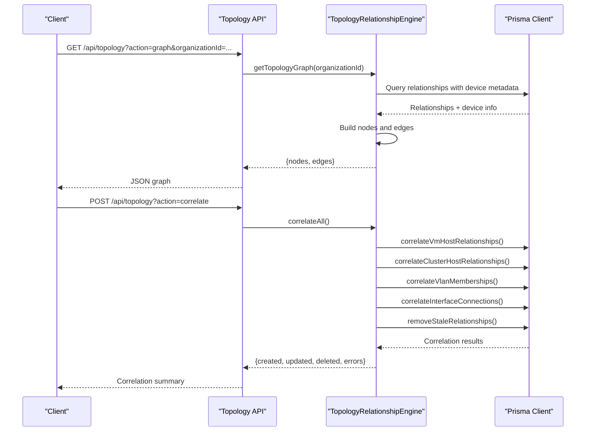
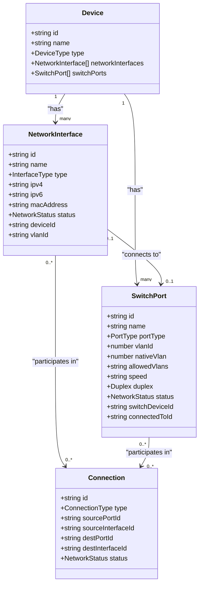
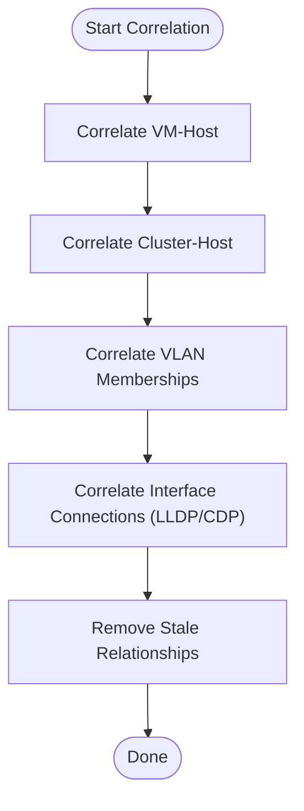
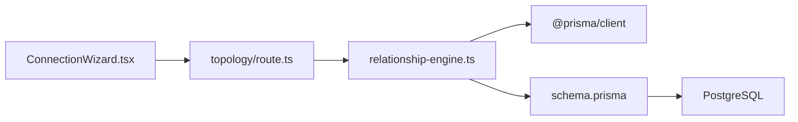

# Network Topology

<cite>
**Referenced Files in This Document**
- [schema.prisma](file://prisma/schema.prisma)
- [types/index.ts](file://types/index.ts)
- [app/api/topology/route.ts](file://app/api/topology/route.ts)
- [lib/topology/relationship-engine.ts](file://lib/topology/relationship-engine.ts)
- [lib/topology/index.ts](file://lib/topology/index.ts)
- [components/topology/ConnectionWizard.tsx](file://components/topology/ConnectionWizard.tsx)
- [docs/20-modules/topology/network-topology-guide.md](file://docs/20-modules/topology/network-topology-guide.md)
</cite>

## Table of Contents
1. [Introduction](#introduction)
2. [Project Structure](#project-structure)
3. [Core Components](#core-components)
4. [Architecture Overview](#architecture-overview)
5. [Detailed Component Analysis](#detailed-component-analysis)
6. [Dependency Analysis](#dependency-analysis)
7. [Performance Considerations](#performance-considerations)
8. [Troubleshooting Guide](#troubleshooting-guide)
9. [Conclusion](#conclusion)
10. [Appendices](#appendices)

## Introduction
This document provides comprehensive data model documentation for network topology entities in the project, focusing on NetworkInterface, SwitchPort, and Connection models. It explains attributes such as interface types, IP addressing, MAC addresses, VLAN associations; switch port management including port types, VLAN configuration, speed/duplex settings, and connection status; and Connection entities representing physical network links between devices. It also documents VLAN and Subnet models for network segmentation, including CIDR notation, gateway configuration, and VRF support. Finally, it describes how these models relate to form a network topology graph, outlines example network discovery workflows, topology mapping algorithms, and connection validation processes, and provides performance considerations for large-scale topology queries.

## Project Structure
The network topology data model is defined in the Prisma schema and mirrored in TypeScript types. The runtime topology graph is produced by a relationship engine that correlates discovered data (e.g., LLDP/CDP neighbors, VLAN memberships) into a unified topology graph consumed by the UI.

```mermaid
graph TB
subgraph "Data Model (Prisma)"
NI["NetworkInterface<br/>ipv4, ipv6, macAddress, status, vlanId"]
SP["SwitchPort<br/>portType, vlanId, nativeVlan, allowedVlans, speed, duplex, status"]
C["Connection<br/>type, sourcePortId, sourceInterfaceId,<br/>destPortId, destInterfaceId, status"]
VL["Vlan<br/>vlanId, name, subnet(CIDR), gateway, vrf"]
SN["Subnet<br/>cidr(CIDR), name, type, description, vlanId"]
D["Device<br/>networkInterfaces[], switchPorts[]"]
end
subgraph "Runtime Engine"
RE["TopologyRelationshipEngine<br/>correlateAll(), getTopologyGraph()"]
end
subgraph "API"
API["GET /api/topology<br/>action=graph|stats<br/>POST /api/topology<br/>action=correlate"]
end
subgraph "UI"
CW["ConnectionWizard<br/>create device-to-device connections"]
end
D --> NI
D --> SP
NI -- "belongs to" --> D
SP -- "belongs to" --> D
NI -- "connects via" --> C
SP -- "connects via" --> C
VL --> NI
VL --> SN
RE --> D
RE --> NI
RE --> SP
RE --> C
RE --> VL
RE --> SN
API --> RE
CW --> API
```

**Diagram sources**
- [schema.prisma](file://prisma/schema.prisma)
- [lib/topology/relationship-engine.ts](file://lib/topology/relationship-engine.ts)
- [app/api/topology/route.ts](file://app/api/topology/route.ts)
- [components/topology/ConnectionWizard.tsx](file://components/topology/ConnectionWizard.tsx)

**Section sources**
- [schema.prisma](file://prisma/schema.prisma)
- [types/index.ts](file://types/index.ts)
- [lib/topology/relationship-engine.ts](file://lib/topology/relationship-engine.ts)
- [app/api/topology/route.ts](file://app/api/topology/route.ts)
- [components/topology/ConnectionWizard.tsx](file://components/topology/ConnectionWizard.tsx)
- [docs/20-modules/topology/network-topology-guide.md](file://docs/20-modules/topology/network-topology-guide.md)

## Core Components
This section documents the primary data models and their attributes that define network topology.

- NetworkInterface
  - Purpose: Represents a logical or physical network interface on a device.
  - Key attributes:
    - Name and type (ETHERNET, FIBER, WIRELESS, SERIAL, MANAGEMENT, OTHER)
    - IPv4 and IPv6 addresses
    - MAC address
    - Status (UP, DOWN, DORMANT, UNKNOWN)
    - Associated VLAN via vlanId
    - Belongs to a Device
  - Relationships:
    - Connected to zero or one SwitchPort
    - Can participate in zero or more Connections

- SwitchPort
  - Purpose: Represents a switch port with configuration and state.
  - Key attributes:
    - Name and port type (ACCESS, TRUNK, HYBRID, MANAGEMENT, UPLINK)
    - VLAN identifiers: vlanId (current), nativeVlan, allowedVlans (comma-delimited or range)
    - Speed and duplex (FULL, HALF, AUTO)
    - Status (UP, DOWN, DORMANT, UNKNOWN)
    - Belongs to a Device (switch)
    - Optional connection to a NetworkInterface (when the port connects to a host interface)

- Connection
  - Purpose: Represents a physical or logical link between devices or interfaces.
  - Key attributes:
    - Type (ETHERNET, FIBER, SERIAL, MANAGEMENT, WAN)
    - Source: SwitchPort and optional NetworkInterface
    - Destination: SwitchPort and optional NetworkInterface
    - Status (UP, DOWN, DORMANT, UNKNOWN)
    - Optional name

- VLAN and Subnet
  - VLAN
    - Organization-scoped VLAN with numeric vlanId, name, optional subnet (CIDR), gateway, and VRF
    - Links to NetworkInterface and Subnet
  - Subnet
    - CIDR notation, optional name/type/description
    - Optionally linked to a VLAN

- Device
  - Contains collections of NetworkInterface and SwitchPort
  - Used as nodes in the topology graph

**Section sources**
- [schema.prisma](file://prisma/schema.prisma)
- [types/index.ts](file://types/index.ts)

## Architecture Overview
The topology graph is built by correlating discovered neighbor information and VLAN membership into Relationship records, then rendering a graph of Devices and Relationships. The UI supports creating device-to-device connections and visualizing the topology in multiple views.



**Diagram sources**
- [app/api/topology/route.ts](file://app/api/topology/route.ts)
- [lib/topology/relationship-engine.ts](file://lib/topology/relationship-engine.ts)

**Section sources**
- [app/api/topology/route.ts](file://app/api/topology/route.ts)
- [lib/topology/relationship-engine.ts](file://lib/topology/relationship-engine.ts)

## Detailed Component Analysis

### NetworkInterface Model
- Attributes and semantics:
  - Interface type supports ETHERNET, FIBER, WIRELESS, SERIAL, MANAGEMENT, OTHER
  - Supports IPv4 and IPv6 addressing
  - Optional MAC address
  - Status indicates operational state
  - Optional VLAN association via foreign key
- Relationships:
  - Belongs to a Device
  - Can connect to a SwitchPort (when the device is a host)
  - Participates in zero or more Connections



**Diagram sources**
- [schema.prisma](file://prisma/schema.prisma)

**Section sources**
- [schema.prisma](file://prisma/schema.prisma)
- [types/index.ts](file://types/index.ts)

### SwitchPort Model
- Port types:
  - ACCESS: Trunks untagged frames; typically connects to hosts
  - TRUNK: Carries multiple VLANs; tagged frames
  - HYBRID: Mix of access and trunk behavior
  - MANAGEMENT/UPLINK: Special-purpose ports
- VLAN configuration:
  - vlanId: current VLAN (access mode)
  - nativeVlan: default VLAN for untagged frames on trunk
  - allowedVlans: permitted VLAN list/ranges
- Operational attributes:
  - speed and duplex
  - status
- Relationships:
  - Belongs to a Device (switch)
  - Optional connection to a NetworkInterface (host)

**Section sources**
- [schema.prisma](file://prisma/schema.prisma)
- [types/index.ts](file://types/index.ts)

### Connection Model
- Connection types:
  - ETHERNET, FIBER, SERIAL, MANAGEMENT, WAN
- Directionality:
  - Source: SwitchPort and optional NetworkInterface
  - Destination: SwitchPort and optional NetworkInterface
- Status:
  - Tracks link operational state

**Section sources**
- [schema.prisma](file://prisma/schema.prisma)
- [types/index.ts](file://types/index.ts)

### VLAN and Subnet Models
- VLAN:
  - Organization-scoped
  - Numeric vlanId, name, optional subnet (CIDR), gateway, VRF
  - Links to NetworkInterface and Subnet
- Subnet:
  - CIDR notation, optional name/type/description
  - Optional VLAN linkage

**Section sources**
- [schema.prisma](file://prisma/schema.prisma)

### Topology Mapping and Discovery Workflow
- Correlation pipeline:
  - Virtual machine to host relationships
  - VMware cluster to host relationships
  - VLAN membership relationships
  - Interface neighbor relationships (from LLDP/CDP)
  - Cleanup stale auto-generated relationships
- Graph construction:
  - Nodes: Devices with derived positions
  - Edges: Relationships with labels and confidence
- API endpoints:
  - GET /api/topology?action=graph returns nodes and edges
  - GET /api/topology?action=stats returns relationship counts by type
  - POST /api/topology?action=correlate triggers correlation



**Diagram sources**
- [lib/topology/relationship-engine.ts](file://lib/topology/relationship-engine.ts)

**Section sources**
- [lib/topology/relationship-engine.ts](file://lib/topology/relationship-engine.ts)
- [app/api/topology/route.ts](file://app/api/topology/route.ts)

### Connection Validation Processes
- Manual creation:
  - UI wizard allows selecting source and target devices and creating a device-to-device connection
- Operational validation:
  - Status reflects UP/DOWN; can be updated after discovery or manual verification
- Integration:
  - Discovered neighbor information (LLDP/CDP) drives automatic relationship creation with confidence scores

**Section sources**
- [components/topology/ConnectionWizard.tsx](file://components/topology/ConnectionWizard.tsx)
- [lib/topology/relationship-engine.ts](file://lib/topology/relationship-engine.ts)

## Dependency Analysis
The topology engine depends on Prisma for data access and constructs a graph from relationships and device metadata. The UI components integrate with the API to present and manage connections.



**Diagram sources**
- [components/topology/ConnectionWizard.tsx](file://components/topology/ConnectionWizard.tsx)
- [app/api/topology/route.ts](file://app/api/topology/route.ts)
- [lib/topology/relationship-engine.ts](file://lib/topology/relationship-engine.ts)
- [schema.prisma](file://prisma/schema.prisma)

**Section sources**
- [lib/topology/index.ts](file://lib/topology/index.ts)
- [lib/topology/relationship-engine.ts](file://lib/topology/relationship-engine.ts)
- [app/api/topology/route.ts](file://app/api/topology/route.ts)

## Performance Considerations
- Indexing:
  - NetworkInterface: indexed by deviceId
  - SwitchPort: indexed by switchDeviceId
  - Connection: indexed by sourcePortId and sourceInterfaceId
  - Relationship: indexed by sourceDeviceId, targetDeviceId, relationshipType
- Queries:
  - Graph retrieval uses joins across relationships and devices; filtering by organizationId reduces dataset size
  - GroupBy statistics avoid heavy joins for counts
- Recommendations:
  - Add database indexes on frequently filtered fields (e.g., organizationId on devices, relationships)
  - Paginate or partition topology queries for very large environments
  - Cache computed graphs per organization with invalidation on major changes
  - Limit neighbor extraction to trusted metadata sources to reduce noise

**Section sources**
- [schema.prisma](file://prisma/schema.prisma)
- [lib/topology/relationship-engine.ts](file://lib/topology/relationship-engine.ts)

## Troubleshooting Guide
- API errors:
  - Topology API returns 400 for invalid actions and 500 for internal errors
- Correlation failures:
  - Errors are aggregated in the correlation result; review logs for specific steps (VM-Host, Cluster-Host, VLAN, Interface)
- Stale relationships:
  - Automatically removed if confidence falls below threshold and age exceeds retention window
- UI connection creation:
  - Ensure both source and target devices are selected; status defaults to UP upon creation

**Section sources**
- [app/api/topology/route.ts](file://app/api/topology/route.ts)
- [lib/topology/relationship-engine.ts](file://lib/topology/relationship-engine.ts)
- [components/topology/ConnectionWizard.tsx](file://components/topology/ConnectionWizard.tsx)

## Conclusion
The network topology model centers on NetworkInterface, SwitchPort, and Connection entities, enriched by VLAN and Subnet for segmentation. The TopologyRelationshipEngine correlates discovered data into a unified graph, exposing it via a simple API and a flexible UI. Proper indexing and query scoping enable scalable operation for large environments.

## Appendices

### Example Workflows
- Network discovery:
  - Collect LLDP/CDP neighbor metadata on devices
  - Run correlation to create relationships and update topology graph
- Topology mapping:
  - Retrieve graph via GET /api/topology?action=graph
  - Render nodes (devices) and edges (relationships) with confidence-based styling
- Connection validation:
  - Use Connection Wizard to create device-to-device connections
  - Verify link status and update as needed

**Section sources**
- [docs/20-modules/topology/network-topology-guide.md](file://docs/20-modules/topology/network-topology-guide.md)
- [lib/topology/relationship-engine.ts](file://lib/topology/relationship-engine.ts)
- [components/topology/ConnectionWizard.tsx](file://components/topology/ConnectionWizard.tsx)