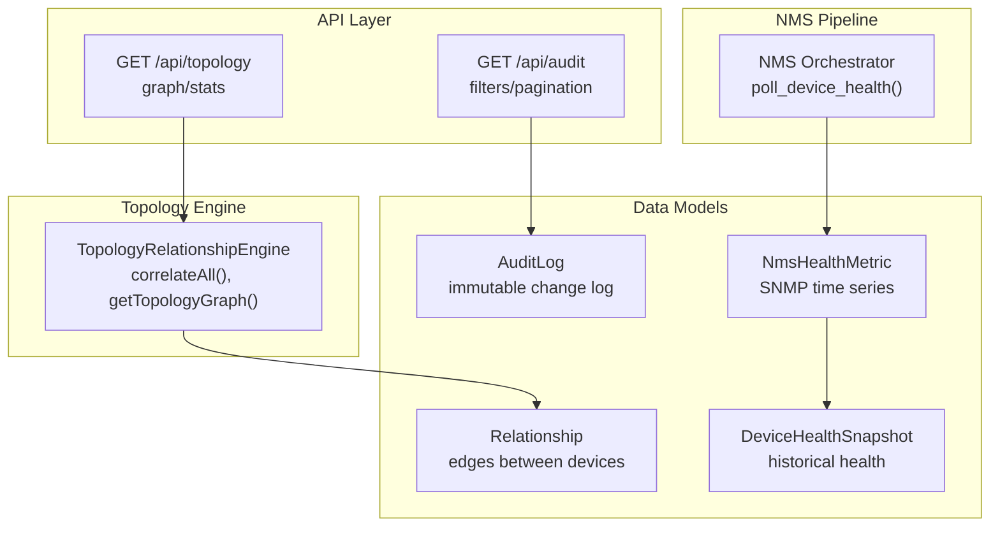
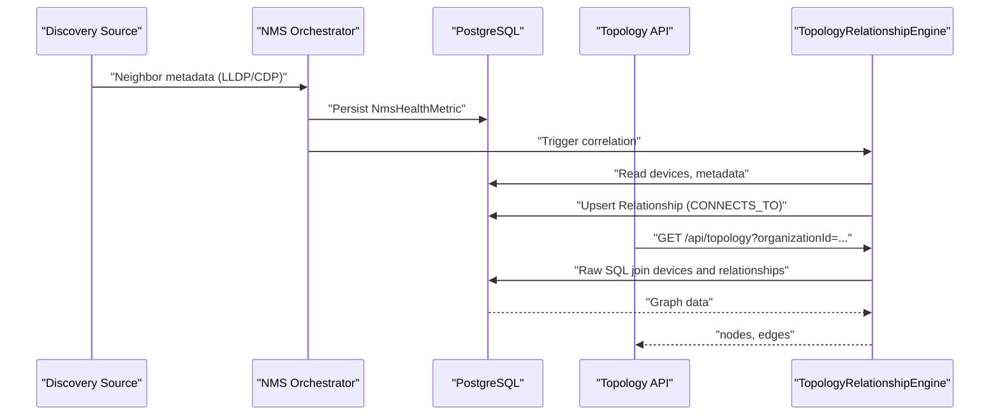
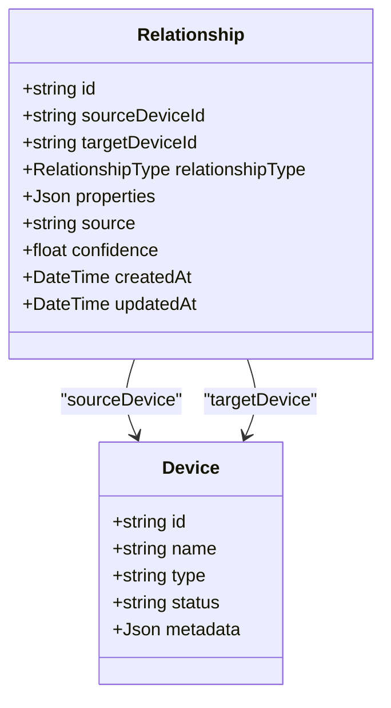
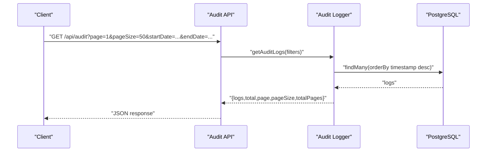
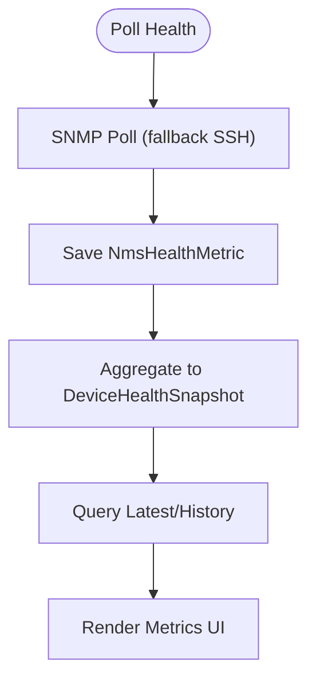
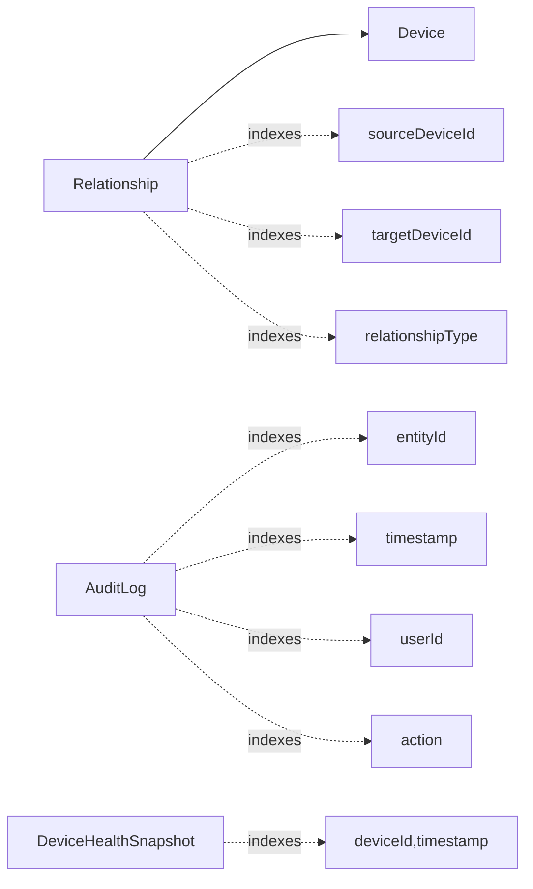

# Relationships & Audit

<cite>
**Referenced Files in This Document**
- [schema.prisma](file://prisma/schema.prisma)
- [relationship-engine.ts](file://lib/topology/relationship-engine.ts)
- [logger.ts](file://lib/audit/logger.ts)
- [route.ts](file://app/api/audit/route.ts)
- [route.ts](file://app/api/topology/route.ts)
- [route.ts](file://app/api/integrations/nms/devices/[id]/route.ts)
- [orchestrator.py](file://nms_service/orchestrator.py)
- [migration.sql](file://prisma/migrations/20260101220408_initial_schema/migration.sql)
</cite>

## Table of Contents
1. [Introduction](#introduction)
2. [Project Structure](#project-structure)
3. [Core Components](#core-components)
4. [Architecture Overview](#architecture-overview)
5. [Detailed Component Analysis](#detailed-component-analysis)
6. [Dependency Analysis](#dependency-analysis)
7. [Performance Considerations](#performance-considerations)
8. [Troubleshooting Guide](#troubleshooting-guide)
9. [Conclusion](#conclusion)
10. [Appendices](#appendices)

## Introduction
This document provides comprehensive data model documentation for relationship management and audit tracking entities. It explains:
- Relationship entities as the core topology edge representation with source/target device associations, relationship types, confidence scores, and property metadata.
- The relationship between devices and topology discovery sources (Zabbix, VMware, SNMP, manual).
- AuditLog entities for comprehensive change tracking including entity modifications, user actions, and timestamped changes.
- DeviceHealthSnapshot entities for historical health tracking including CPU/memory/disk usage and network latency metrics.
- Practical examples for relationship validation, audit trail queries, and health trend analysis.
- Indexing strategies for performance optimization and data retention/archival recommendations.

## Project Structure
The relationships and audit data models are defined in the Prisma schema and surfaced through backend APIs and correlation engines:
- Data models: Relationship, AuditLog, DeviceHealthSnapshot, and NMS-related metrics.
- Relationship correlation engine: correlates VM/host, VLAN membership, and LLDP/CDP neighbor relationships.
- Audit logging utilities: immutable audit log creation and retrieval with filtering.
- Health metrics ingestion pipeline: NMS orchestrator polls devices and persists health metrics.

**Diagram sources**
- [schema.prisma](file://prisma/schema.prisma)
- [relationship-engine.ts](file://lib/topology/relationship-engine.ts)
- [route.ts](file://app/api/topology/route.ts)
- [route.ts](file://app/api/audit/route.ts)
- [orchestrator.py](file://nms_service/orchestrator.py)

**Section sources**
- [schema.prisma](file://prisma/schema.prisma)
- [relationship-engine.ts](file://lib/topology/relationship-engine.ts)
- [route.ts](file://app/api/topology/route.ts)
- [route.ts](file://app/api/audit/route.ts)
- [orchestrator.py](file://nms_service/orchestrator.py)

## Core Components
- Relationship model
  - Edges between devices with typed relationshipType, optional properties JSON, discovery source, and confidence score.
  - Indexed for sourceDeviceId, targetDeviceId, and relationshipType.
- AuditLog model
  - Immutable audit records with entity, action, resource, timestamps, and optional user context.
  - Indexed for entityId, timestamp, userId, and action.
- DeviceHealthSnapshot model
  - Historical health snapshots with CPU/memory/disk/network latency metrics.
  - Indexed for deviceId and timestamp.
- NMS health metrics
  - NmsHealthMetric model stores time-series health metrics (CPU, memory, temperature, uptime) with indexes optimized for device and time.

**Section sources**
- [schema.prisma](file://prisma/schema.prisma)
- [migration.sql](file://prisma/migrations/20260101220408_initial_schema/migration.sql)

## Architecture Overview
The system integrates discovery sources (Zabbix, VMware, SNMP) with correlation logic to maintain accurate topology relationships. Audit logs capture all user/system actions immutably. Health metrics are polled and stored for trend analysis.

**Diagram sources**
- [relationship-engine.ts](file://lib/topology/relationship-engine.ts)
- [route.ts](file://app/api/topology/route.ts)
- [schema.prisma](file://prisma/schema.prisma)
- [orchestrator.py](file://nms_service/orchestrator.py)

## Detailed Component Analysis

### Relationship Model and Topology Engine
- Relationship fields
  - sourceDeviceId/targetDeviceId: foreign keys to Device.
  - relationshipType: enum covering containment, connectivity, virtualization, VLAN membership, firewall policy, service dependency, HA pairs, uplinks, spanning tree.
  - properties: JSON for extra metadata (e.g., VLAN IDs, policy identifiers).
  - source: indicates origin ('zabbix', 'vmware', 'snmp', 'manual').
  - confidence: numeric score indicating reliability of the relationship.
- Correlation logic
  - VM-to-host: creates VIRTUAL_RUNS_ON with high confidence from VMware.
  - Cluster-to-host: creates CLUSTER_CONTAINS with high confidence from VMware.
  - VLAN membership: creates VLAN_MEMBER from SNMP-derived VLAN membership.
  - Neighbor discovery: extracts CDP/LLDP neighbors and creates CONNECTS_TO with protocol-specific confidence.
  - Stale cleanup: removes low-confidence auto-generated relationships older than a threshold.
- Graph rendering
  - Joins relationships with device metadata to build nodes and edges for visualization.
  - Supports organization-scoped filtering and confidence-based edge animation.

**Diagram sources**
- [schema.prisma](file://prisma/schema.prisma)

**Section sources**
- [schema.prisma](file://prisma/schema.prisma)
- [relationship-engine.ts](file://lib/topology/relationship-engine.ts)
- [route.ts](file://app/api/topology/route.ts)

### AuditLog Entities and Queries
- AuditLog fields
  - entity, entityId, action, resource, resourceId, details, userId, ipAddress, userAgent, timestamp.
  - Immutable: API enforces no updates/deletes.
- Filtering and pagination
  - Filters by userId, action substring, resource, and date range on timestamp.
  - Returns paginated results with total counts and user details via include.
- Security and compliance
  - Timestamped audit trails enable compliance reporting and change management workflows.
  - User context (userId, IP, UA) supports forensic analysis.

**Diagram sources**
- [logger.ts](file://lib/audit/logger.ts)
- [route.ts](file://app/api/audit/route.ts)

**Section sources**
- [logger.ts](file://lib/audit/logger.ts)
- [route.ts](file://app/api/audit/route.ts)
- [schema.prisma](file://prisma/schema.prisma)

### DeviceHealthSnapshot and Health Metrics
- DeviceHealthSnapshot fields
  - deviceId, status, cpuUsage, memoryUsage, diskUsage, networkLatency, timestamp.
  - Indexed for efficient time-series queries.
- NMS health metrics
  - NmsHealthMetric stores uptimeSeconds, cpuUsage, memoryUsage, temperature, collectedAt.
  - Used to populate DeviceHealthSnapshot and power health trends.
- Trend analysis
  - Frontend pages render latest health and historical metrics for a device.
  - Backend routes fetch latest NMS health metrics and interface states.

**Diagram sources**
- [orchestrator.py](file://nms_service/orchestrator.py)
- [schema.prisma](file://prisma/schema.prisma)
- [route.ts](file://app/api/integrations/nms/devices/[id]/route.ts)

**Section sources**
- [schema.prisma](file://prisma/schema.prisma)
- [orchestrator.py](file://nms_service/orchestrator.py)
- [route.ts](file://app/api/integrations/nms/devices/[id]/route.ts)

## Dependency Analysis
- Relationship engine depends on Prisma client and raw SQL for graph construction.
- Audit logging utility depends on Prisma client and is consumed by API handlers.
- Health metrics pipeline depends on NMS orchestrator and Prisma models.
- Indexes support frequent queries on timestamps, device IDs, and relationship types.

**Diagram sources**
- [schema.prisma](file://prisma/schema.prisma)
- [migration.sql](file://prisma/migrations/20260101220408_initial_schema/migration.sql)

**Section sources**
- [schema.prisma](file://prisma/schema.prisma)
- [migration.sql](file://prisma/migrations/20260101220408_initial_schema/migration.sql)

## Performance Considerations
- Indexing strategies
  - Relationships: composite index on (sourceDeviceId, targetDeviceId, relationshipType) to accelerate graph traversal and filtering.
  - AuditLog: composite index on (entityId, timestamp) and separate indexes on userId and action to optimize filtering and sorting.
  - DeviceHealthSnapshot: composite index on (deviceId, timestamp) for efficient time-series queries.
  - NMS health metrics: composite index on (nmsDeviceId, collectedAt) and single index on collectedAt to support fast scans.
- Query patterns
  - Use raw SQL joins for topology graph construction to minimize ORM overhead.
  - Pagination and ordering by timestamp for audit logs.
  - Limit history windows for health metrics to control data volume.
- Cleanup and retention
  - Remove stale relationships with low confidence after a time window.
  - Archive or partition historical audit logs and health metrics by time to reduce active dataset size.

[No sources needed since this section provides general guidance]

## Troubleshooting Guide
- Relationship validation
  - Verify neighbor extraction from device metadata (CDP/LLDP) and ensure device name matching logic resolves remote devices.
  - Confirm correlation jobs are scheduled and executed; review correlation results for errors.
- Audit trail queries
  - Ensure filters align with expected casing and substring matching; confirm date range boundaries.
  - Check that immutable audit endpoints return appropriate error codes for unsupported methods.
- Health trends
  - Confirm NMS orchestrator polling succeeds and metrics are persisted; verify frontend routes fetch the latest metrics.

**Section sources**
- [relationship-engine.ts](file://lib/topology/relationship-engine.ts)
- [route.ts](file://app/api/audit/route.ts)
- [route.ts](file://app/api/topology/route.ts)
- [orchestrator.py](file://nms_service/orchestrator.py)

## Conclusion
The data models and supporting components provide a robust foundation for topology relationships, immutable audit tracking, and historical health monitoring. Proper indexing, correlation logic, and API design enable scalable operations and strong compliance capabilities.

[No sources needed since this section summarizes without analyzing specific files]

## Appendices

### Example Workflows and Queries

- Relationship validation
  - Trigger correlation: POST /api/topology?action=correlate
  - Retrieve topology graph: GET /api/topology?action=graph&organizationId=...
  - Retrieve statistics: GET /api/topology?action=stats

- Audit trail queries
  - Paginated audit logs: GET /api/audit?page=1&pageSize=50&startDate=YYYY-MM-DD&endDate=YYYY-MM-DD
  - Filter by user/action/resource: append userId, action, resource query parameters

- Health trend analysis
  - Fetch latest NMS health metrics for a device: GET /api/integrations/nms/devices/[id]?include=health
  - View historical metrics in device page UI

**Section sources**
- [route.ts](file://app/api/topology/route.ts)
- [route.ts](file://app/api/audit/route.ts)
- [route.ts](file://app/api/integrations/nms/devices/[id]/route.ts)

### Indexing Strategies for Large-Scale Data
- Relationships
  - Composite index on (sourceDeviceId, relationshipType) and (targetDeviceId, relationshipType) to accelerate edge lookups.
- AuditLog
  - Composite index on (entityId, timestamp) and separate indexes on userId and action for targeted filtering.
- DeviceHealthSnapshot
  - Composite index on (deviceId, timestamp) for time-series queries.
- NMS health metrics
  - Composite index on (nmsDeviceId, collectedAt) and single index on collectedAt.

**Section sources**
- [schema.prisma](file://prisma/schema.prisma)
- [migration.sql](file://prisma/migrations/20260101220408_initial_schema/migration.sql)

### Data Retention and Archival Recommendations
- Retention
  - Define retention periods for audit logs and health metrics (e.g., 90–365 days) based on compliance requirements.
- Archival
  - Archive historical data to cold storage or analytical data warehouse; keep active indexes on hot dataset only.
- Cleanup
  - Periodically remove stale relationships below a confidence threshold and old audit entries exceeding retention.

[No sources needed since this section provides general guidance]