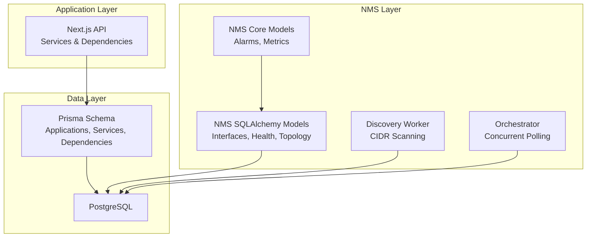
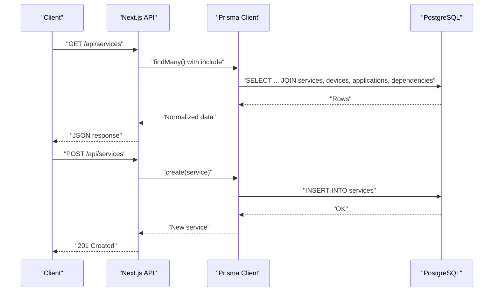
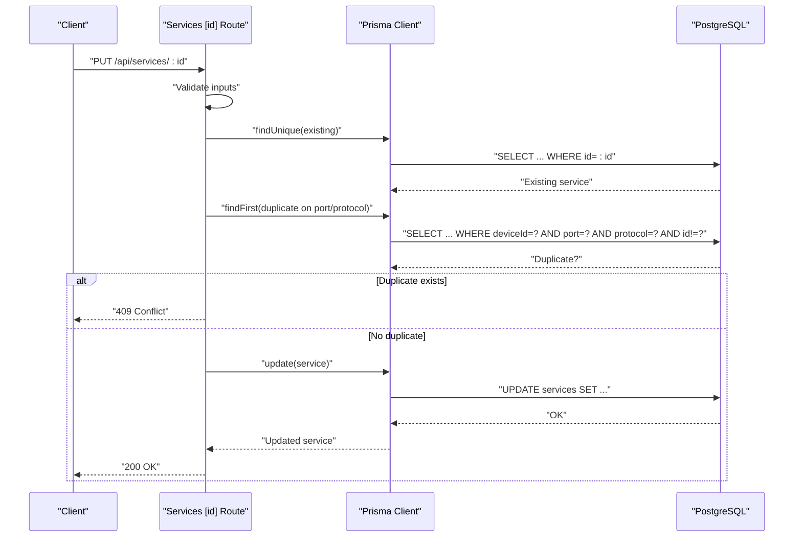
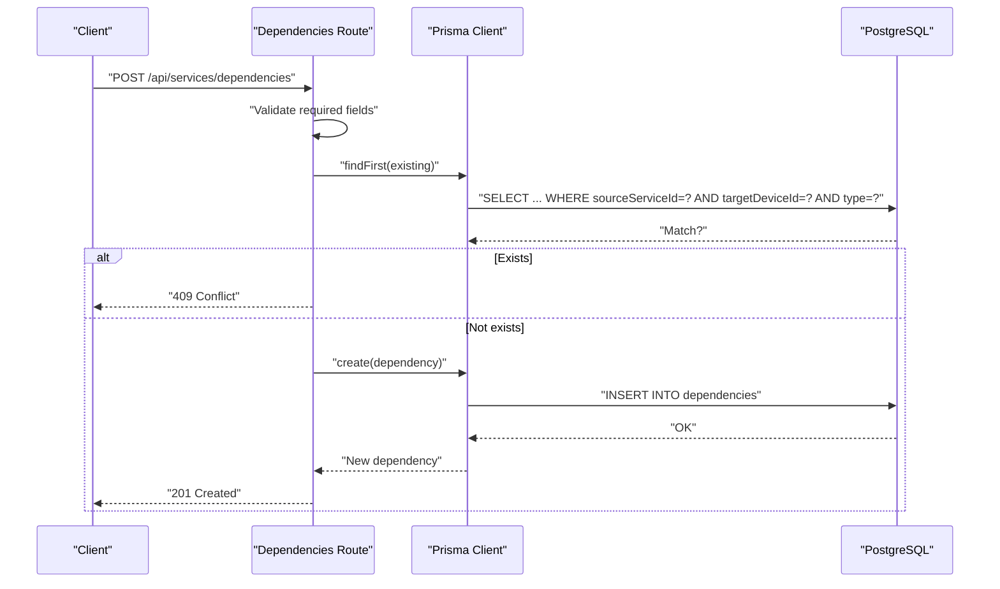
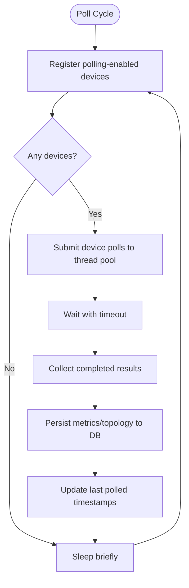
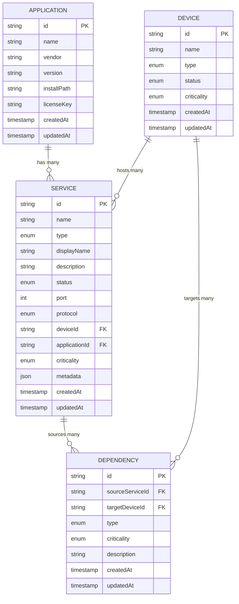
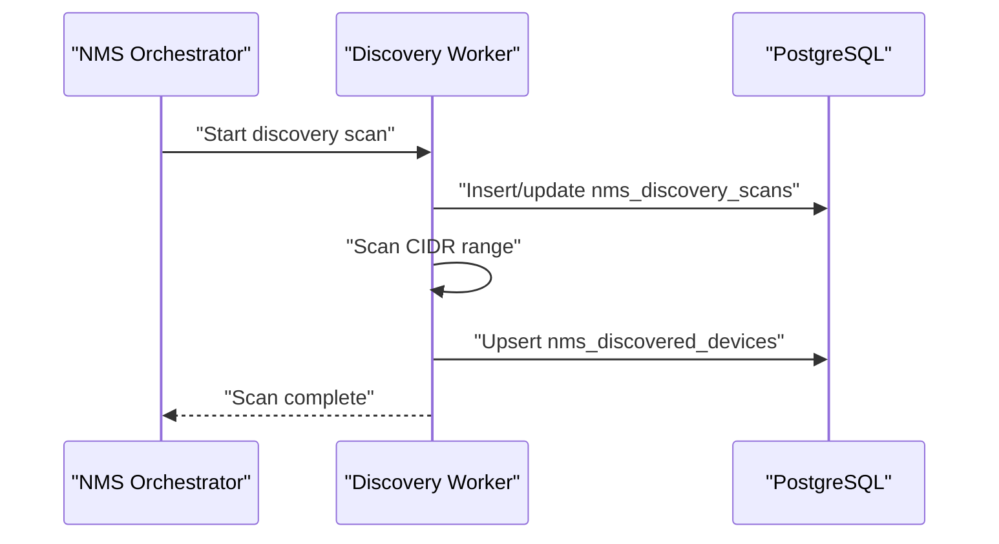

# Service Dependencies

<cite>
**Referenced Files in This Document**
- [schema.prisma](file://prisma/schema.prisma)
- [services.route.ts](file://app/api/services/route.ts)
- [services.[id].route.ts](file://app/api/services/[id]/route.ts)
- [dependencies.route.ts](file://app/api/services/dependencies/route.ts)
- [models.py](file://nms_service/core/models.py)
- [models.py](file://nms_service/database/models.py)
- [discovery_worker.py](file://nms_service/discovery_worker.py)
- [orchestrator.py](file://nms_service/orchestrator.py)
</cite>

## Table of Contents
1. [Introduction](#introduction)
2. [Project Structure](#project-structure)
3. [Core Components](#core-components)
4. [Architecture Overview](#architecture-overview)
5. [Detailed Component Analysis](#detailed-component-analysis)
6. [Dependency Analysis](#dependency-analysis)
7. [Performance Considerations](#performance-considerations)
8. [Troubleshooting Guide](#troubleshooting-guide)
9. [Conclusion](#conclusion)
10. [Appendices](#appendices)

## Introduction
This document provides detailed data model documentation for service management entities in the system, focusing on Applications, Services, and their Dependency relationships. It explains how Applications are linked to Services, how Services are bound to Devices, and how Dependencies connect Services to Devices. It also documents service metadata, status tracking, health monitoring, and lifecycle management, including creation, modification, and decommissioning with proper dependency cleanup.

## Project Structure
The service management data model is defined in the Prisma schema and exposed via Next.js API routes. Network monitoring and discovery are handled by a dedicated NMS service implemented in Python, which writes metrics and topology data into the same PostgreSQL database used by the main application.

**Diagram sources**
- [schema.prisma](file://prisma/schema.prisma)
- [services.route.ts](file://app/api/services/route.ts)
- [dependencies.route.ts](file://app/api/services/dependencies/route.ts)
- [models.py](file://nms_service/core/models.py)
- [models.py](file://nms_service/database/models.py)
- [discovery_worker.py](file://nms_service/discovery_worker.py)
- [orchestrator.py](file://nms_service/orchestrator.py)

**Section sources**
- [schema.prisma](file://prisma/schema.prisma)
- [services.route.ts](file://app/api/services/route.ts)
- [dependencies.route.ts](file://app/api/services/dependencies/route.ts)
- [models.py](file://nms_service/core/models.py)
- [models.py](file://nms_service/database/models.py)
- [discovery_worker.py](file://nms_service/discovery_worker.py)
- [orchestrator.py](file://nms_service/orchestrator.py)

## Core Components
- Application: Represents installed software packages on devices. Fields include name, vendor, version, installPath, and licenseKey. An Application can be associated with multiple Services.
- Service: Represents a running service on a Device, with type enumeration, status, port, protocol, criticality, optional metadata, and an optional association to an Application.
- Dependency: Represents relationships between a Service and a Device, with a typed relationship and criticality. It enables modeling service-to-device dependencies such as depends-on, requires, provides, supports, communicates-with, deployed-on, hosted-on, and connected-to.

These components are defined in the Prisma schema and surfaced through REST endpoints for listing, creating, updating, and deleting Services and Dependencies.

**Section sources**
- [schema.prisma](file://prisma/schema.prisma)
- [services.route.ts](file://app/api/services/route.ts)
- [services.[id].route.ts](file://app/api/services/[id]/route.ts)
- [dependencies.route.ts](file://app/api/services/dependencies/route.ts)

## Architecture Overview
The system separates concerns across layers:
- Application Layer: Next.js API routes expose CRUD operations for Services and Dependencies, including pagination, filtering, and inclusion of related entities.
- Data Layer: Prisma schema defines Entities and Enums; PostgreSQL persists all data.
- NMS Layer: Python-based monitoring and discovery write metrics and topology into the same database, enabling correlation between Services, Devices, and health signals.

**Diagram sources**
- [services.route.ts](file://app/api/services/route.ts)
- [schema.prisma](file://prisma/schema.prisma)

**Section sources**
- [services.route.ts](file://app/api/services/route.ts)
- [schema.prisma](file://prisma/schema.prisma)

## Detailed Component Analysis

### Application Model
- Purpose: Track installed software packages on devices.
- Key fields:
  - id, name, vendor, version, installPath, licenseKey, timestamps.
- Relationships:
  - One-to-many with Service via applicationId.
- Constraints:
  - Unique constraint on name+version.

Lifecycle considerations:
- Creation: POST to Services with applicationId optional.
- Modification: Update Services to change applicationId.
- Decommissioning: Remove applicationId from Services; Applications can be retained for historical tracking.

**Section sources**
- [schema.prisma](file://prisma/schema.prisma)

### Service Model
- Purpose: Represent a running service on a Device with type, status, port, protocol, criticality, and optional metadata.
- Key fields:
  - id, name, type (enumeration), displayName, description, status (enumeration), port, protocol (enumeration), deviceId, applicationId, criticality, metadata (JSON), timestamps.
- Relationships:
  - Belongs to Device (deviceId).
  - Optional belongs to Application (applicationId).
  - Has many Dependencies (serviceId).
- Constraints:
  - Unique constraint on deviceId+port+protocol.
  - Validation for port range and protocol/type enums in API.

Service metadata:
- JSON field allows flexible, service-specific attributes (e.g., SSL certificate info, backend pool members, proxy rules).

Service status tracking:
- Status is an enumeration with RUNNING, STOPPED, DEGRADED, FAILED, UNKNOWN. API enforces valid values.

**Section sources**
- [schema.prisma](file://prisma/schema.prisma)
- [services.route.ts](file://app/api/services/route.ts)
- [services.[id].route.ts](file://app/api/services/[id]/route.ts)

### Dependency Model
- Purpose: Define typed relationships between a Service and a Device.
- Key fields:
  - id, sourceServiceId, targetDeviceId, type (enumeration), criticality, description, timestamps.
- Relationships:
  - Belongs to Service (sourceServiceId).
  - Belongs to Device (targetDeviceId).
- Constraints:
  - Unique constraint on sourceServiceId+targetDeviceId+type.

Dependency types:
- DEPENDS_ON, REQUIRES, PROVIDES, SUPPORTS, COMMUNICATES_WITH, DEPLOYED_ON, HOSTED_ON, CONNECTED_TO.

Validation and cleanup:
- API prevents duplicate dependencies and enforces required fields.
- Deleting a Service checks for dependencies and blocks deletion until dependencies are removed.

**Section sources**
- [schema.prisma](file://prisma/schema.prisma)
- [dependencies.route.ts](file://app/api/services/dependencies/route.ts)

### API Workflows

#### Service CRUD Endpoints
- GET /api/services: Paginated listing with minimal/full modes; includes device, application, and dependencies.
- POST /api/services: Creates a new Service with validation for required fields and defaults for optional fields.
- GET /api/services/[id]: Retrieves a single Service with device, application, and dependency details.
- PUT /api/services/[id]: Updates a Service with strict validation and duplicate-port/protocol checks.
- DELETE /api/services/[id]: Deletes a Service only if no dependencies exist.

**Diagram sources**
- [services.[id].route.ts](file://app/api/services/[id]/route.ts)
- [schema.prisma](file://prisma/schema.prisma)

**Section sources**
- [services.route.ts](file://app/api/services/route.ts)
- [services.[id].route.ts](file://app/api/services/[id]/route.ts)

#### Dependency Management Endpoints
- GET /api/services/dependencies: Lists all dependencies or filters by serviceId; includes sourceService and targetDevice.
- POST /api/services/dependencies: Creates a dependency with de-duplication and validation.
- PUT /api/services/dependencies: Updates dependency type, criticality, and description.
- DELETE /api/services/dependencies?id: Removes a dependency by ID.

**Diagram sources**
- [dependencies.route.ts](file://app/api/services/dependencies/route.ts)
- [schema.prisma](file://prisma/schema.prisma)

**Section sources**
- [dependencies.route.ts](file://app/api/services/dependencies/route.ts)

### Health Monitoring and NMS Integration
While not part of the core service data model, the NMS service provides:
- Concurrent SNMP/SSH polling of devices, writing interface metrics, health metrics, and topology links into nms_* tables.
- Discovery scanning of CIDR ranges to populate discovered devices.
- Dynamic polling intervals and fallback strategies to maintain robustness.

**Diagram sources**
- [orchestrator.py](file://nms_service/orchestrator.py)
- [models.py](file://nms_service/database/models.py)

**Section sources**
- [models.py](file://nms_service/core/models.py)
- [models.py](file://nms_service/database/models.py)
- [discovery_worker.py](file://nms_service/discovery_worker.py)
- [orchestrator.py](file://nms_service/orchestrator.py)

## Dependency Analysis
The following diagram shows the core entity relationships and their cardinalities:

**Diagram sources**
- [schema.prisma](file://prisma/schema.prisma)

**Section sources**
- [schema.prisma](file://prisma/schema.prisma)

## Performance Considerations
- Pagination and mode selection: The Services listing endpoint supports a minimal mode to avoid heavy joins for dashboards and a full mode for detailed views.
- Unique constraints: Service uniqueness on (deviceId, port, protocol) prevents conflicts and ensures efficient indexing.
- Dependency uniqueness: Dependency uniqueness on (sourceServiceId, targetDeviceId, type) prevents redundant relationships.
- NMS concurrency: The Orchestrator uses a persistent ThreadPoolExecutor to poll devices concurrently while respecting per-device throttling and dynamic intervals.

[No sources needed since this section provides general guidance]

## Troubleshooting Guide
Common issues and resolutions:
- Service creation fails with duplicate port/protocol: Ensure the combination of port and protocol is unique per device.
- Updating a Service fails with conflict: Resolve duplicate port/protocol by changing either port or protocol.
- Deleting a Service fails with dependencies: Remove all dependencies for the Service before deletion.
- Dependency creation fails with conflict: Ensure the exact tuple (sourceServiceId, targetDeviceId, type) does not already exist.
- Health monitoring gaps: Verify NMS polling is enabled on the Device and that SNMP/SSH credentials are configured.

**Section sources**
- [services.[id].route.ts](file://app/api/services/[id]/route.ts)
- [dependencies.route.ts](file://app/api/services/dependencies/route.ts)
- [orchestrator.py](file://nms_service/orchestrator.py)

## Conclusion
The service management data model cleanly separates Applications, Services, and Dependencies, enabling precise modeling of service-to-device relationships. The API enforces data integrity and provides lifecycle operations with dependency-aware safeguards. Health monitoring via the NMS service complements the model by feeding real-time telemetry into the same database, supporting impact analysis and dependency validation.

[No sources needed since this section summarizes without analyzing specific files]

## Appendices

### Service Discovery Workflow
- Trigger discovery scan with a CIDR range and SNMP communities.
- The Discovery Worker probes hosts via SNMP and SSH, determines vendor, and persists discovered devices.
- Import discovered devices into the main application and associate Services accordingly.

**Diagram sources**
- [discovery_worker.py](file://nms_service/discovery_worker.py)
- [models.py](file://nms_service/database/models.py)

**Section sources**
- [discovery_worker.py](file://nms_service/discovery_worker.py)
- [models.py](file://nms_service/database/models.py)

### Dependency Resolution Algorithm
- Input: Service with dependencies.
- Steps:
  1. Collect all dependencies for the Service.
  2. For each dependency, resolve targetDevice to assess availability and criticality.
  3. Aggregate dependency types to identify upstream/downstream impacts.
  4. Apply criticality thresholds to flag high-risk dependency chains.
- Output: Dependency graph with risk assessment.

[No sources needed since this section provides general guidance]

### Impact Analysis Patterns
- Service-to-device impact: Use Dependency edges to trace affected Services when a Device becomes unavailable.
- Criticality propagation: Combine Service criticality with Dependency criticality to compute overall impact.
- Metadata-driven attributes: Use Service metadata to enrich impact analysis (e.g., SSL termination, backend pools).

[No sources needed since this section provides general guidance]

### Service Lifecycle Management
- Creation: POST /api/services with required fields; optional applicationId and metadata.
- Modification: PUT /api/services/[id] with validation; changing port/protocol enforces uniqueness.
- Decommissioning: DELETE /api/services/[id] only if no dependencies exist; otherwise remove dependencies first.

**Section sources**
- [services.route.ts](file://app/api/services/route.ts)
- [services.[id].route.ts](file://app/api/services/[id]/route.ts)
- [dependencies.route.ts](file://app/api/services/dependencies/route.ts)