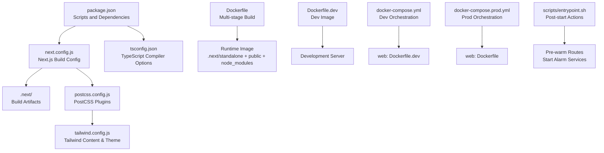
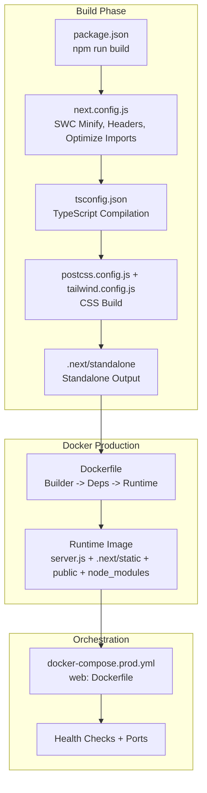
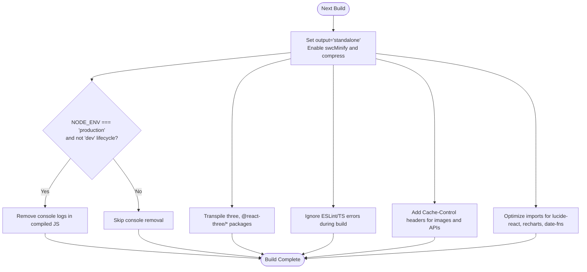
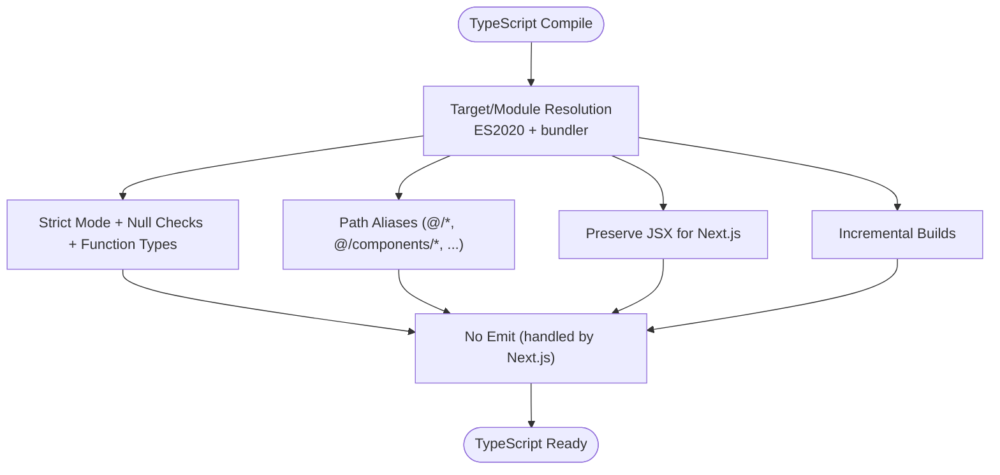
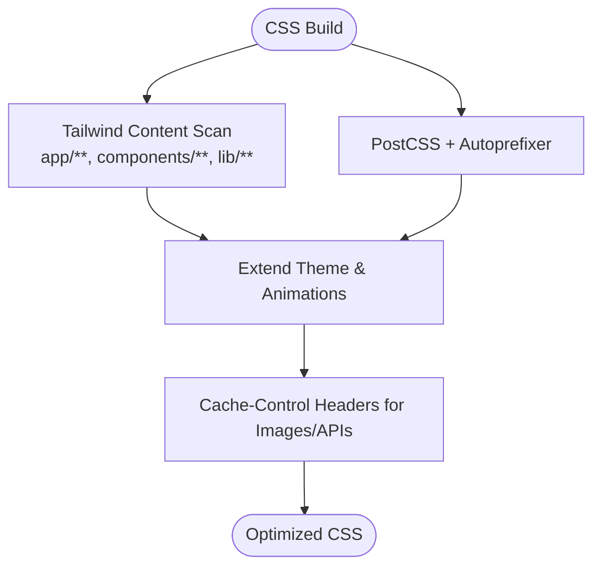
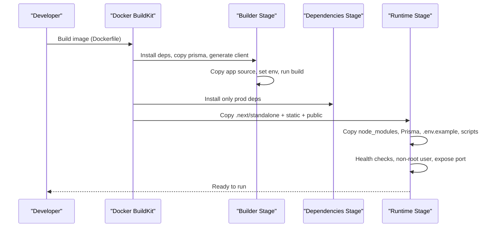
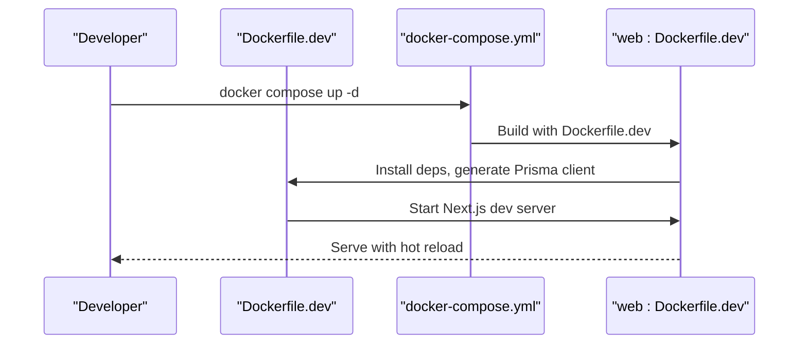
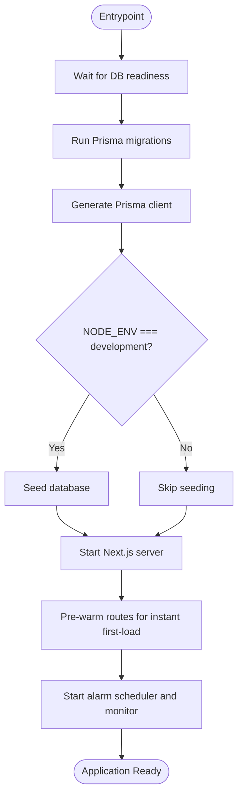
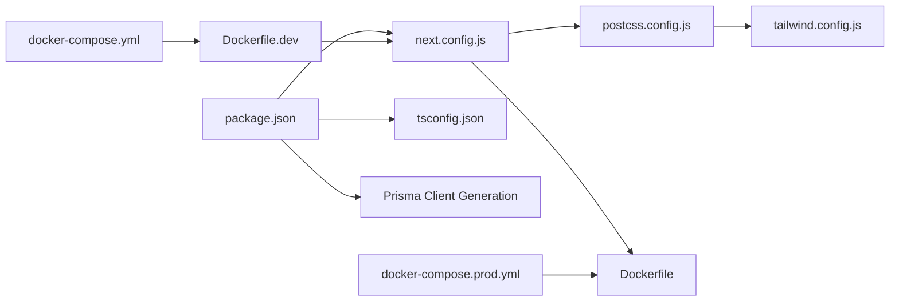

# Build Process

<cite>
**Referenced Files in This Document**
- [package.json](file://package.json)
- [next.config.js](file://next.config.js)
- [tsconfig.json](file://tsconfig.json)
- [Dockerfile](file://Dockerfile)
- [Dockerfile.dev](file://Dockerfile.dev)
- [docker-compose.yml](file://docker-compose.yml)
- [docker-compose.prod.yml](file://docker-compose.prod.yml)
- [postcss.config.js](file://postcss.config.js)
- [tailwind.config.js](file://tailwind.config.js)
- [next-env.d.ts](file://next-env.d.ts)
- [scripts/entrypoint.sh](file://scripts/entrypoint.sh)
- [.dockerignore](file://.dockerignore)
</cite>

## Table of Contents
1. [Introduction](#introduction)
2. [Project Structure](#project-structure)
3. [Core Components](#core-components)
4. [Architecture Overview](#architecture-overview)
5. [Detailed Component Analysis](#detailed-component-analysis)
6. [Dependency Analysis](#dependency-analysis)
7. [Performance Considerations](#performance-considerations)
8. [Troubleshooting Guide](#troubleshooting-guide)
9. [Conclusion](#conclusion)
10. [Appendices](#appendices)

## Introduction
This document explains the complete build process for the application, covering Next.js configuration, TypeScript compilation, asset optimization, production builds, Docker image creation, and deployment preparation. It also details optimization strategies, bundle analysis guidance, performance tuning, environment-specific builds, conditional compilation, and artifact management.

## Project Structure
The build pipeline spans several configuration and orchestration files:
- Scripts and tasks are defined in the package manager configuration.
- Next.js build behavior is configured via the framework’s configuration file.
- TypeScript compilation is governed by the TypeScript configuration.
- Asset optimization and bundling are influenced by PostCSS/Tailwind and Next.js settings.
- Docker multi-stage builds produce optimized production images.
- Docker Compose orchestrates development and production environments.

**Diagram sources**
- [package.json:1-71](file://package.json#L1-L71)
- [next.config.js:1-62](file://next.config.js#L1-L62)
- [tsconfig.json:1-74](file://tsconfig.json#L1-L74)
- [postcss.config.js:1-7](file://postcss.config.js#L1-L7)
- [tailwind.config.js:1-93](file://tailwind.config.js#L1-L93)
- [Dockerfile:1-115](file://Dockerfile#L1-L115)
- [Dockerfile.dev:1-51](file://Dockerfile.dev#L1-L51)
- [docker-compose.yml:1-153](file://docker-compose.yml#L1-L153)
- [docker-compose.prod.yml:1-135](file://docker-compose.prod.yml#L1-L135)
- [scripts/entrypoint.sh:1-88](file://scripts/entrypoint.sh#L1-L88)

**Section sources**
- [package.json:1-71](file://package.json#L1-L71)
- [next.config.js:1-62](file://next.config.js#L1-L62)
- [tsconfig.json:1-74](file://tsconfig.json#L1-L74)
- [postcss.config.js:1-7](file://postcss.config.js#L1-L7)
- [tailwind.config.js:1-93](file://tailwind.config.js#L1-L93)
- [Dockerfile:1-115](file://Dockerfile#L1-L115)
- [Dockerfile.dev:1-51](file://Dockerfile.dev#L1-L51)
- [docker-compose.yml:1-153](file://docker-compose.yml#L1-L153)
- [docker-compose.prod.yml:1-135](file://docker-compose.prod.yml#L1-L135)
- [scripts/entrypoint.sh:1-88](file://scripts/entrypoint.sh#L1-L88)

## Core Components
- Next.js build configuration controls output mode, minification, compression, console removal in production, transpilation of specific packages, ESLint/TypeScript build behavior, caching headers, and SWC optimizations.
- TypeScript configuration defines strictness, module resolution, JSX handling, path aliases, and incremental compilation.
- Docker multi-stage build produces a minimal runtime image with standalone Next.js output, static assets, and production dependencies.
- Docker Compose sets up development and production environments with environment variables, health checks, and optional reverse proxy integration.
- PostCSS and Tailwind configure CSS processing and content scanning for purging unused styles.

Key build commands and roles:
- Development: runs the Next.js dev server with TurboPack enabled and a startup script.
- Build: compiles the Next.js application for production.
- Start: serves the production build.
- Type check: validates TypeScript without emitting outputs.
- Lint: runs ESLint on the codebase.

**Section sources**
- [package.json:5-14](file://package.json#L5-L14)
- [next.config.js:2-59](file://next.config.js#L2-L59)
- [tsconfig.json:2-59](file://tsconfig.json#L2-L59)
- [postcss.config.js:1-7](file://postcss.config.js#L1-L7)
- [tailwind.config.js:4-92](file://tailwind.config.js#L4-L92)

## Architecture Overview
The build and deployment architecture integrates Next.js, TypeScript, PostCSS/Tailwind, and Docker multi-stage builds. The production image leverages Next.js standalone output for fast startup and reduced footprint.

**Diagram sources**
- [package.json:7](file://package.json#L7)
- [next.config.js:3-59](file://next.config.js#L3-L59)
- [tsconfig.json:2-59](file://tsconfig.json#L2-L59)
- [postcss.config.js:1-7](file://postcss.config.js#L1-L7)
- [tailwind.config.js:4-92](file://tailwind.config.js#L4-L92)
- [Dockerfile:39-85](file://Dockerfile#L39-L85)
- [docker-compose.prod.yml:37-75](file://docker-compose.prod.yml#L37-L75)

## Detailed Component Analysis

### Next.js Build Configuration
- Output mode: standalone for optimized runtime startup.
- Strict React mode and SWC minification enabled.
- Compression enabled for response payloads.
- Console removal applied only in production builds (not during dev).
- Transpilation of Three.js and related libraries to ensure compatibility.
- ESLint and TypeScript build behavior configured to ignore during build to speed up CI.
- Aggressive caching headers for images and selected API routes.
- Package import optimization for icon and chart libraries.
- SWC profiling disabled for faster builds.

**Diagram sources**
- [next.config.js:3-59](file://next.config.js#L3-L59)

**Section sources**
- [next.config.js:2-59](file://next.config.js#L2-L59)

### TypeScript Compilation
- Target and library set to ES2020 with DOM/Iterable support.
- Module resolution uses bundler; strict type checking enabled with null checks and function types.
- JSX preserved for Next.js; incremental compilation enabled.
- Path aliases configured for cleaner imports.
- TypeScript plugin integrated for Next.js support.
- No emit in normal operation; separate type-check script used.

**Diagram sources**
- [tsconfig.json:2-59](file://tsconfig.json#L2-L59)

**Section sources**
- [tsconfig.json:2-59](file://tsconfig.json#L2-L59)
- [next-env.d.ts:1-6](file://next-env.d.ts#L1-L6)

### Asset Optimization and Bundling
- PostCSS and Autoprefixer configured for CSS processing.
- Tailwind scans app and components directories; animations plugin enabled.
- Next.js headers add long-lived caching for images and selective API routes.
- SWC-based optimizations reduce bundle sizes and improve build times.

**Diagram sources**
- [postcss.config.js:1-7](file://postcss.config.js#L1-L7)
- [tailwind.config.js:4-92](file://tailwind.config.js#L4-L92)
- [next.config.js:19-47](file://next.config.js#L19-L47)

**Section sources**
- [postcss.config.js:1-7](file://postcss.config.js#L1-L7)
- [tailwind.config.js:4-92](file://tailwind.config.js#L4-L92)
- [next.config.js:19-59](file://next.config.js#L19-L59)

### Production Build and Docker Image Creation
- Multi-stage Docker build:
  - Builder stage installs dependencies, generates Prisma client, copies source, sets build-time variables, and runs the Next.js build.
  - Dependencies stage installs only production dependencies.
  - Runtime stage creates a non-root user, copies standalone Next.js output, static assets, public folder, production dependencies, Prisma schema, environment template, and startup scripts, exposes port, sets health checks, and starts the server via entrypoint.
- The runtime image uses Next.js standalone output for fast startup and minimal footprint.

**Diagram sources**
- [Dockerfile:9-115](file://Dockerfile#L9-L115)

**Section sources**
- [Dockerfile:9-115](file://Dockerfile#L9-L115)

### Development Build and Hot Reload
- Development Dockerfile installs dependencies, generates Prisma client, and starts the Next.js dev server with hot reload.
- Development Compose mounts source code and excludes build artifacts to avoid conflicts.
- Health checks and environment variables align with development needs.

**Diagram sources**
- [Dockerfile.dev:6-51](file://Dockerfile.dev#L6-L51)
- [docker-compose.yml:32-77](file://docker-compose.yml#L32-L77)

**Section sources**
- [Dockerfile.dev:6-51](file://Dockerfile.dev#L6-L51)
- [docker-compose.yml:32-77](file://docker-compose.yml#L32-L77)

### Deployment Preparation and Post-Start Actions
- The production entrypoint waits for the database, runs Prisma migrations, regenerates the Prisma client, seeds data in development, and pre-warms frequently used routes to minimize initial load latency.
- Alarm services are started after the server is healthy.

**Diagram sources**
- [scripts/entrypoint.sh:1-88](file://scripts/entrypoint.sh#L1-L88)

**Section sources**
- [scripts/entrypoint.sh:1-88](file://scripts/entrypoint.sh#L1-L88)

### Environment-Specific Builds and Conditional Compilation
- Production build applies console removal and other optimizations only when the lifecycle event is not dev.
- Development uses TurboPack and hot reload; production uses standalone output and minification.
- Environment variables are injected at build time for the production image and passed at runtime for development.

**Section sources**
- [next.config.js:8-11](file://next.config.js#L8-L11)
- [package.json:6](file://package.json#L6)
- [Dockerfile:35-40](file://Dockerfile#L35-L40)
- [docker-compose.yml:37-48](file://docker-compose.yml#L37-L48)
- [docker-compose.prod.yml:45-56](file://docker-compose.prod.yml#L45-L56)

### Build Artifact Management
- Build artifacts are excluded from version control via the Docker ignore file.
- Next.js standalone output and static assets are copied into the runtime image.
- Development Compose excludes .next to prevent conflicts with host builds.

**Section sources**
- [.dockerignore:29-34](file://.dockerignore#L29-L34)
- [Dockerfile:80-82](file://Dockerfile#L80-L82)
- [docker-compose.yml:58-64](file://docker-compose.yml#L58-L64)

## Dependency Analysis
The build pipeline depends on:
- Next.js for SSR, static generation, and runtime.
- SWC for fast compilation and minification.
- Prisma for client generation and database operations.
- Tailwind and PostCSS for CSS optimization.
- Docker for containerized builds and deployments.

**Diagram sources**
- [package.json:16-68](file://package.json#L16-L68)
- [next.config.js:1-62](file://next.config.js#L1-L62)
- [tsconfig.json:1-74](file://tsconfig.json#L1-L74)
- [postcss.config.js:1-7](file://postcss.config.js#L1-L7)
- [tailwind.config.js:1-93](file://tailwind.config.js#L1-L93)
- [Dockerfile:9-115](file://Dockerfile#L9-L115)
- [Dockerfile.dev:6-51](file://Dockerfile.dev#L6-L51)
- [docker-compose.yml:1-153](file://docker-compose.yml#L1-L153)
- [docker-compose.prod.yml:1-135](file://docker-compose.prod.yml#L1-L135)

**Section sources**
- [package.json:16-68](file://package.json#L16-L68)
- [next.config.js:1-62](file://next.config.js#L1-L62)
- [tsconfig.json:1-74](file://tsconfig.json#L1-L74)
- [postcss.config.js:1-7](file://postcss.config.js#L1-L7)
- [tailwind.config.js:1-93](file://tailwind.config.js#L1-L93)
- [Dockerfile:9-115](file://Dockerfile#L9-L115)
- [Dockerfile.dev:6-51](file://Dockerfile.dev#L6-L51)
- [docker-compose.yml:1-153](file://docker-compose.yml#L1-L153)
- [docker-compose.prod.yml:1-135](file://docker-compose.prod.yml#L1-L135)

## Performance Considerations
- Use standalone output to reduce cold start latency.
- Keep console removal enabled in production builds.
- Leverage SWC minification and optimized package imports.
- Apply long-term caching headers for static assets and frequently accessed API endpoints.
- Pre-warm critical routes at startup to eliminate first-request latency.
- Use production-only health checks and read-only root filesystem in containers for security and stability.

[No sources needed since this section provides general guidance]

## Troubleshooting Guide
- Build fails due to TypeScript errors:
  - Ignore during build is enabled; use the dedicated type-check script to validate types locally.
- Prisma client mismatch:
  - Ensure Prisma client is generated in both builder and runtime stages.
- Database readiness issues:
  - Use the provided entrypoint script to wait for the database before starting the application.
- Development hot reload not working:
  - Verify Compose mounts source code and excludes node_modules and .next.
- Production image size:
  - Confirm only production dependencies are installed in the dependencies stage and runtime image.

**Section sources**
- [next.config.js:16-18](file://next.config.js#L16-L18)
- [Dockerfile:29-30](file://Dockerfile#L29-L30)
- [scripts/entrypoint.sh:11-38](file://scripts/entrypoint.sh#L11-L38)
- [docker-compose.yml:58-64](file://docker-compose.yml#L58-L64)
- [Dockerfile:52-53](file://Dockerfile#L52-L53)

## Conclusion
The build process combines Next.js configuration, TypeScript compilation, and PostCSS/Tailwind optimization with a robust Docker multi-stage pipeline. Production builds leverage standalone output, SWC minification, and strategic caching headers, while development benefits from hot reload and simplified setup. The provided scripts and Compose configurations streamline deployment preparation and post-start actions.

[No sources needed since this section summarizes without analyzing specific files]

## Appendices

### Practical Build Commands
- Development: run the dev server with TurboPack and startup script.
- Build: compile the Next.js application for production.
- Start: serve the production build.
- Type check: validate TypeScript without emitting outputs.
- Lint: run ESLint on the codebase.

**Section sources**
- [package.json:5-14](file://package.json#L5-L14)

### Environment Variables Reference
- Production image build arguments and runtime environment variables are defined in the Dockerfiles and Compose files.

**Section sources**
- [Dockerfile:35-40](file://Dockerfile#L35-L40)
- [docker-compose.yml:37-48](file://docker-compose.yml#L37-L48)
- [docker-compose.prod.yml:45-56](file://docker-compose.prod.yml#L45-L56)