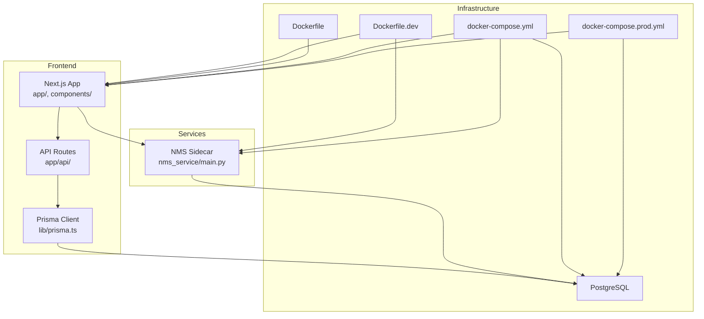
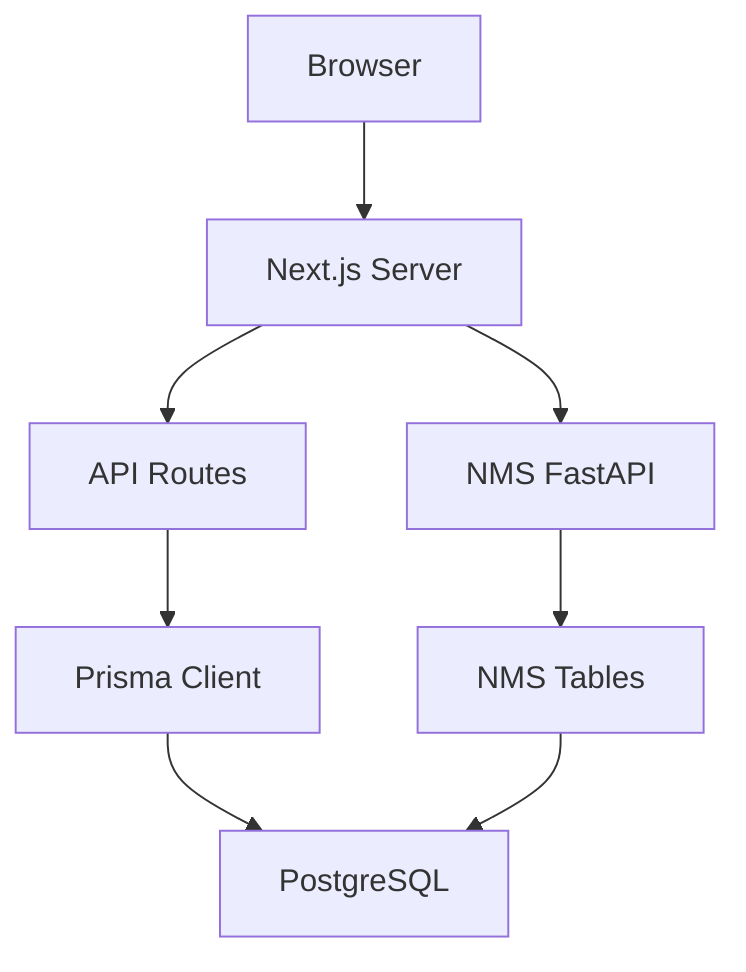
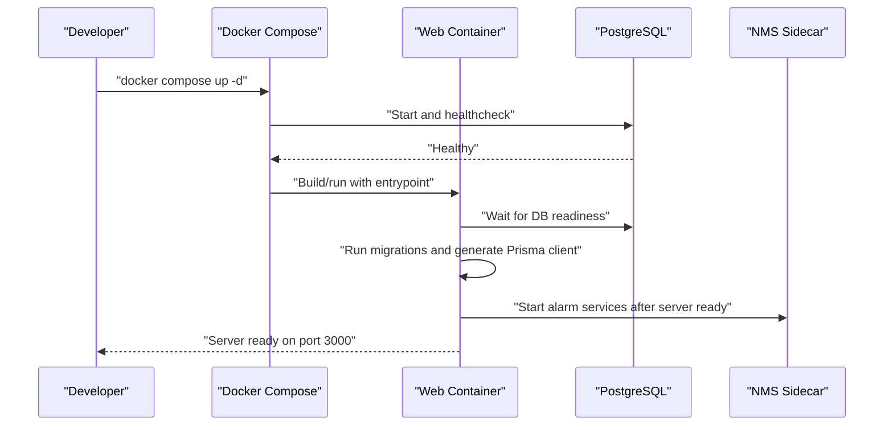
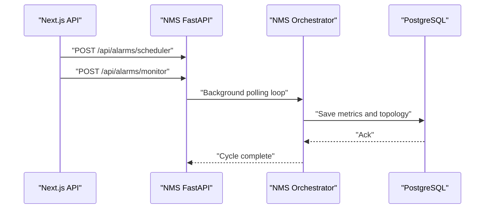
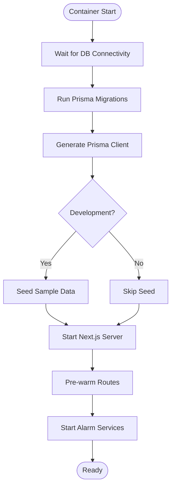
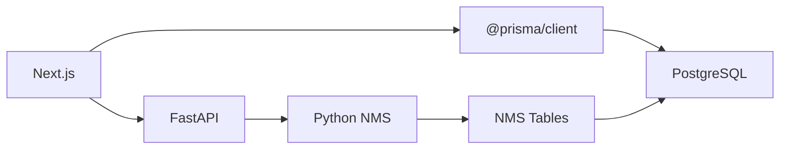

# Development & Deployment

<cite>
**Referenced Files in This Document**
- [README.md](file://README.md)
- [QUICK_START.md](file://QUICK_START.md)
- [DEV_WORKFLOW.md](file://DEV_WORKFLOW.md)
- [package.json](file://package.json)
- [Dockerfile](file://Dockerfile)
- [Dockerfile.dev](file://Dockerfile.dev)
- [docker-compose.yml](file://docker-compose.yml)
- [docker-compose.prod.yml](file://docker-compose.prod.yml)
- [scripts/entrypoint.sh](file://scripts/entrypoint.sh)
- [scripts/wait-for-db.sh](file://scripts/wait-for-db.sh)
- [scripts/dev-startup.sh](file://scripts/dev-startup.sh)
- [nms_service/Dockerfile](file://nms_service/Dockerfile)
- [nms_service/main.py](file://nms_service/main.py)
- [nms_service/orchestrator.py](file://nms_service/orchestrator.py)
- [nms_service/discovery_worker.py](file://nms_service/discovery_worker.py)
- [lib/prisma.ts](file://lib/prisma.ts)
</cite>

## Table of Contents
1. [Introduction](#introduction)
2. [Project Structure](#project-structure)
3. [Core Components](#core-components)
4. [Architecture Overview](#architecture-overview)
5. [Detailed Component Analysis](#detailed-component-analysis)
6. [Dependency Analysis](#dependency-analysis)
7. [Performance Considerations](#performance-considerations)
8. [Troubleshooting Guide](#troubleshooting-guide)
9. [Conclusion](#conclusion)
10. [Appendices](#appendices)

## Introduction
This document provides a comprehensive guide to developing, building, and deploying the InfraScope platform. It covers development environment setup, local database configuration, debugging workflows, the build process and optimization strategies, containerization and orchestration, production deployment configurations, scaling and high availability, monitoring and observability, and operational best practices. Practical examples and diagrams illustrate key processes such as container startup, database readiness checks, alarm service initialization, and multi-service orchestration.

## Project Structure
InfraScope is a Next.js 14 application with a PostgreSQL-backed Prisma ORM and an internal Python-based Network Monitoring Sidecar (NMS). The repository includes:
- Frontend application under app/ and components/
- Backend API routes under app/api/
- Database schema and migrations under prisma/
- Utilities and database client under lib/
- Scripts for container entrypoints and database waits under scripts/
- NMS service under nms_service/ with its own Dockerfile and FastAPI endpoints
- Dockerfiles and docker-compose configurations for development and production

**Diagram sources**
- [Dockerfile.dev:1-51](file://Dockerfile.dev#L1-L51)
- [Dockerfile:1-115](file://Dockerfile#L1-L115)
- [docker-compose.yml:1-153](file://docker-compose.yml#L1-L153)
- [docker-compose.prod.yml:1-135](file://docker-compose.prod.yml#L1-L135)
- [nms_service/Dockerfile:1-30](file://nms_service/Dockerfile#L1-L30)
- [nms_service/main.py:1-483](file://nms_service/main.py#L1-L483)
- [lib/prisma.ts:1-21](file://lib/prisma.ts#L1-L21)

**Section sources**
- [README.md:106-164](file://README.md#L106-L164)
- [docker-compose.yml:5-153](file://docker-compose.yml#L5-L153)
- [docker-compose.prod.yml:7-135](file://docker-compose.prod.yml#L7-L135)

## Core Components
- Next.js Application: Single-page application with API routes, TypeScript, and Tailwind CSS.
- Prisma ORM: Database client singleton with configurable query logging.
- NMS Sidecar: Python FastAPI service for SNMP/SSH polling, discovery, and topology collection.
- Containerization: Multi-stage Docker build for production and a lightweight development image with hot reload.
- Orchestration: Docker Compose for local development and production-grade orchestration.

Key capabilities:
- Local development with hot reload and persistent database.
- Production-ready container with health checks, non-root user, and pre-warmed routes.
- Internal NMS service exposing endpoints for device polling, discovery, backups, and topology.

**Section sources**
- [README.md:108-126](file://README.md#L108-L126)
- [lib/prisma.ts:1-21](file://lib/prisma.ts#L1-L21)
- [nms_service/main.py:1-483](file://nms_service/main.py#L1-L483)
- [Dockerfile.dev:1-51](file://Dockerfile.dev#L1-L51)
- [Dockerfile:1-115](file://Dockerfile#L1-L115)

## Architecture Overview
The system comprises:
- Web tier: Next.js serving pages and API routes.
- Database tier: PostgreSQL with Prisma managing schema and migrations.
- Sidecar tier: NMS service for network telemetry and discovery.
- Containerization: Separate images for development and production, orchestrated by Docker Compose.

**Diagram sources**
- [nms_service/main.py:39-51](file://nms_service/main.py#L39-L51)
- [lib/prisma.ts:10-20](file://lib/prisma.ts#L10-L20)
- [docker-compose.yml:78-115](file://docker-compose.yml#L78-L115)

**Section sources**
- [README.md:108-126](file://README.md#L108-L126)
- [docker-compose.yml:78-115](file://docker-compose.yml#L78-L115)

## Detailed Component Analysis

### Development Environment Setup
- Local prerequisites: Node.js 18+, PostgreSQL, and a package manager.
- Environment variables: DATABASE_URL, NEXT_PUBLIC_API_URL, NODE_ENV, LOG_LEVEL.
- Steps: Install dependencies, configure .env.local, generate Prisma client, initialize database, seed data, and start development server.
- Quick start commands and troubleshooting tips are documented for common issues.

Practical example:
- Start with the quick start steps and confirm the dashboard is reachable.

**Section sources**
- [README.md:66-98](file://README.md#L66-L98)
- [QUICK_START.md:10-48](file://QUICK_START.md#L10-L48)
- [README.md:332-341](file://README.md#L332-L341)

### Local Database Setup
- PostgreSQL 12+ is required.
- Configure DATABASE_URL in .env.local.
- Use Prisma to generate client and push schema to the database.
- Seed the database with sample data for immediate exploration.

Operational tip:
- If Prisma client generation fails, regenerate the client and reinstall dependencies if needed.

**Section sources**
- [README.md:343-348](file://README.md#L343-L348)
- [README.md:368-376](file://README.md#L368-L376)
- [QUICK_START.md:22-35](file://QUICK_START.md#L22-L35)

### Debugging Workflows
- Use logs from Docker Compose for real-time insight during development.
- Access the database directly via psql inside the container.
- Restart containers after rebuilding Dockerfile.dev if necessary.
- Use type checking and linting commands for faster feedback loops.

**Section sources**
- [DEV_WORKFLOW.md:54-106](file://DEV_WORKFLOW.md#L54-L106)
- [QUICK_START.md:152-178](file://QUICK_START.md#L152-L178)

### Build Process and Optimization Strategies
- Development build: Turbo mode enabled, hot reload, and automatic startup scripts.
- Production build: Multi-stage Docker build with optimized image size, non-root user, health checks, and pre-warmed routes.
- Optimization highlights:
  - Multi-stage build reduces final image size.
  - Health checks ensure readiness.
  - Pre-warming routes improves first-load performance.
  - Prisma client generation is performed at build time for production.

**Section sources**
- [package.json:5-14](file://package.json#L5-L14)
- [Dockerfile:6-115](file://Dockerfile#L6-L115)
- [scripts/entrypoint.sh:69-88](file://scripts/entrypoint.sh#L69-L88)
- [lib/prisma.ts:13-16](file://lib/prisma.ts#L13-L16)

### Containerization and Orchestration
- Development containerization:
  - Dockerfile.dev builds a lightweight image with hot reload and development dependencies.
  - docker-compose.yml defines services for web, db, and NMS sidecar with volume mounts for hot reload.
- Production containerization:
  - Dockerfile performs a multi-stage build, installs runtime dependencies, and sets a non-root user.
  - docker-compose.prod.yml defines production-grade settings including health checks, read-only root filesystem, and security options.

**Diagram sources**
- [docker-compose.yml:32-77](file://docker-compose.yml#L32-L77)
- [Dockerfile.dev:33-51](file://Dockerfile.dev#L33-L51)
- [scripts/entrypoint.sh:11-41](file://scripts/entrypoint.sh#L11-L41)
- [scripts/dev-startup.sh:12-28](file://scripts/dev-startup.sh#L12-L28)

**Section sources**
- [docker-compose.yml:32-115](file://docker-compose.yml#L32-L115)
- [Dockerfile.dev:1-51](file://Dockerfile.dev#L1-L51)
- [docker-compose.prod.yml:36-75](file://docker-compose.prod.yml#L36-L75)
- [Dockerfile:56-115](file://Dockerfile#L56-L115)

### NMS Sidecar: Polling, Discovery, and Topology
- FastAPI endpoints expose:
  - Device polling, backups, health metrics, interface states, discovery scans, and topology links.
- Orchestrator:
  - Concurrent polling via ThreadPoolExecutor with per-device throttling and dynamic intervals.
  - SNMP-first, SSH-fallback strategy with vendor detection.
  - Periodic topology polling and last-polled tracking.
- Discovery worker:
  - Async CIDR scanning with threaded SNMP/SSH probing and batched persistence.

**Diagram sources**
- [nms_service/main.py:91-98](file://nms_service/main.py#L91-L98)
- [nms_service/main.py:131-182](file://nms_service/main.py#L131-L182)
- [nms_service/main.py:328-374](file://nms_service/main.py#L328-L374)
- [nms_service/orchestrator.py:407-434](file://nms_service/orchestrator.py#L407-L434)

**Section sources**
- [nms_service/main.py:1-483](file://nms_service/main.py#L1-L483)
- [nms_service/orchestrator.py:1-461](file://nms_service/orchestrator.py#L1-L461)
- [nms_service/discovery_worker.py:1-262](file://nms_service/discovery_worker.py#L1-L262)

### Database Readiness and Startup Flow
- The container entrypoint waits for the database to be ready, runs Prisma migrations, generates the client, seeds data in development, and starts alarm services after the server is healthy.
- A dedicated wait script provides a reusable mechanism to check database connectivity.

**Diagram sources**
- [scripts/entrypoint.sh:11-41](file://scripts/entrypoint.sh#L11-L41)
- [scripts/wait-for-db.sh:8-28](file://scripts/wait-for-db.sh#L8-L28)
- [scripts/entrypoint.sh:44-84](file://scripts/entrypoint.sh#L44-L84)

**Section sources**
- [scripts/entrypoint.sh:1-88](file://scripts/entrypoint.sh#L1-L88)
- [scripts/wait-for-db.sh:1-29](file://scripts/wait-for-db.sh#L1-L29)

### Development Workflow Example
- Build and start development containers, watch logs, and iterate with hot reload.
- Use Docker Compose commands to manage services and perform common tasks like linting and type checking inside the container.

**Section sources**
- [DEV_WORKFLOW.md:1-106](file://DEV_WORKFLOW.md#L1-L106)

### Production Deployment Procedures
- Build the production image using the multi-stage Dockerfile.
- Use docker-compose.prod.yml to orchestrate services with health checks, security hardening, and read-only root filesystem.
- Expose the service on the desired port and ensure environment variables are configured for production.

**Section sources**
- [Dockerfile:1-115](file://Dockerfile#L1-L115)
- [docker-compose.prod.yml:36-75](file://docker-compose.prod.yml#L36-L75)

### Scaling and High Availability
- Horizontal scaling:
  - Run multiple instances behind a reverse proxy (e.g., Caddy) for load distribution.
  - Use a managed PostgreSQL instance or a clustered database for HA.
- Service isolation:
  - Keep the web application and NMS sidecar in separate containers for independent scaling.
- Health checks:
  - Leverage existing health endpoints for load balancer probes and orchestrator restart policies.

Note: The repository includes commented optional Caddy and Redis configurations for production-grade setups.

**Section sources**
- [docker-compose.prod.yml:76-92](file://docker-compose.prod.yml#L76-L92)

### Monitoring, Logging, and Observability
- Health endpoints:
  - Web application exposes a health endpoint for readiness checks.
  - NMS sidecar exposes a health endpoint indicating poller status and registered devices.
- Logging:
  - NMS logs are persisted to a dedicated volume for inspection.
  - Prisma client logging is configurable and disabled by default to reduce I/O overhead.
- Recommendations:
  - Integrate structured logging and metrics collection in production.
  - Use a centralized logging stack and APM for end-to-end observability.

**Section sources**
- [nms_service/main.py:91-98](file://nms_service/main.py#L91-L98)
- [docker-compose.yml:109-114](file://docker-compose.yml#L109-L114)
- [lib/prisma.ts:13-16](file://lib/prisma.ts#L13-L16)

### Security Considerations
- Production hardening:
  - Non-root user, read-only root filesystem, and health checks.
  - Restrict database exposure and use environment variables for secrets.
- Development caution:
  - NEXTAUTH_SECRET and TLS settings are highlighted for development; change them before production.
- Secrets management:
  - Store sensitive configuration in environment files and avoid committing secrets.

**Section sources**
- [Dockerfile:68-115](file://Dockerfile#L68-L115)
- [docker-compose.prod.yml:45-71](file://docker-compose.prod.yml#L45-L71)
- [docker-compose.yml:37-50](file://docker-compose.yml#L37-L50)

## Dependency Analysis
The application’s primary dependencies and their roles:
- Next.js 14: Frontend framework and API routing.
- Prisma: Database client and migrations.
- PostgreSQL: Relational database for application and NMS data.
- NMS Python service: SNMP/SSH polling and discovery.
- Docker: Containerization and orchestration.

**Diagram sources**
- [package.json:16-57](file://package.json#L16-L57)
- [nms_service/Dockerfile:1-30](file://nms_service/Dockerfile#L1-L30)
- [nms_service/main.py:20-34](file://nms_service/main.py#L20-L34)

**Section sources**
- [package.json:16-57](file://package.json#L16-L57)
- [docker-compose.yml:78-115](file://docker-compose.yml#L78-L115)

## Performance Considerations
- Build-time optimizations:
  - Multi-stage Docker build reduces image size and attack surface.
  - Prisma client generated at build time ensures runtime efficiency.
- Runtime optimizations:
  - Pre-warming routes at startup minimizes cold-start latency.
  - Prisma query logging disabled by default to reduce I/O overhead.
- Operational tips:
  - Use type checking and linting to catch regressions early.
  - Monitor database performance and adjust connection pooling and indexes as needed.

**Section sources**
- [Dockerfile:6-41](file://Dockerfile#L6-L41)
- [scripts/entrypoint.sh:66-77](file://scripts/entrypoint.sh#L66-L77)
- [lib/prisma.ts:13-16](file://lib/prisma.ts#L13-L16)

## Troubleshooting Guide
Common issues and resolutions:
- PostgreSQL connection failures:
  - Verify DATABASE_URL and ensure the database is healthy.
  - Use psql to connect and inspect database state.
- Prisma client issues:
  - Re-run Prisma client generation and reinstall dependencies if needed.
- Port conflicts:
  - Change the development port or stop conflicting services.
- TypeScript errors:
  - Run type checking and clear Next.js cache if necessary.
- Development container rebuilds:
  - Rebuild the development image if Dockerfile.dev changes.

**Section sources**
- [README.md:357-392](file://README.md#L357-L392)
- [DEV_WORKFLOW.md:54-106](file://DEV_WORKFLOW.md#L54-L106)

## Conclusion
InfraScope provides a robust foundation for enterprise infrastructure management with a modern frontend, a PostgreSQL-backed backend, and an internal NMS sidecar for network telemetry. The repository includes comprehensive development and production configurations, enabling rapid iteration and secure, scalable deployments. By following the documented workflows and leveraging the provided scripts and Docker configurations, teams can confidently develop, test, and operate InfraScope in diverse environments.

## Appendices

### Appendix A: Development Commands Reference
- Start development server: npm run dev
- Build for production: npm run build
- Start production server: npm run start
- Linting: npm run lint
- Type checking: npm run type-check
- Database operations: db:migrate, db:push, db:seed, db:studio

**Section sources**
- [README.md:194-209](file://README.md#L194-L209)
- [package.json:5-14](file://package.json#L5-L14)

### Appendix B: Production Environment Variables
- Required variables include database credentials, API URLs, and authentication settings.
- Ensure secrets are managed securely and not committed to source control.

**Section sources**
- [README.md:332-341](file://README.md#L332-L341)
- [docker-compose.prod.yml:45-53](file://docker-compose.prod.yml#L45-L53)