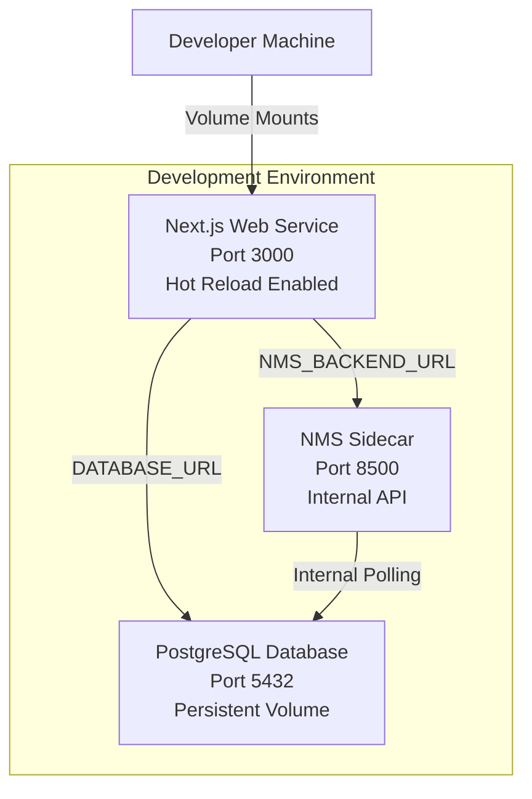
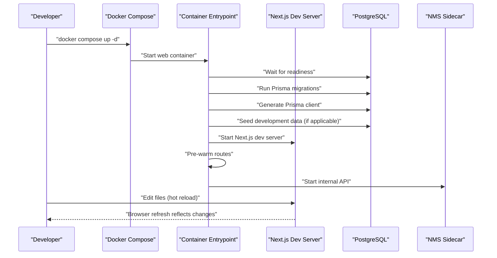
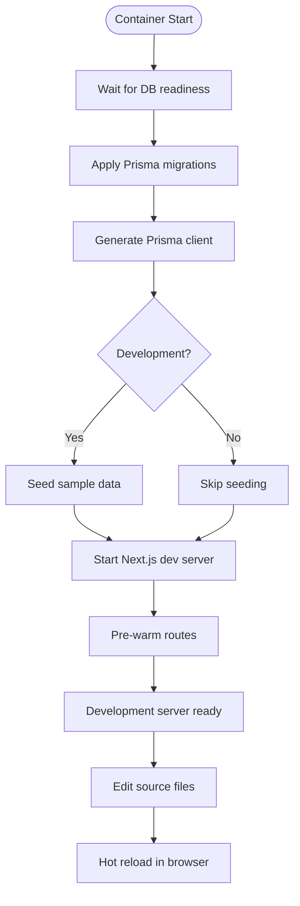
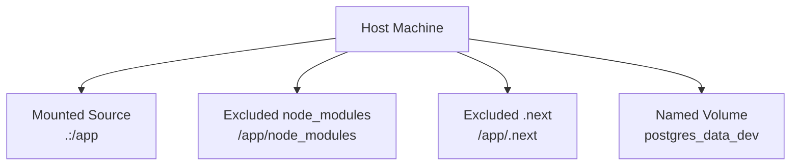
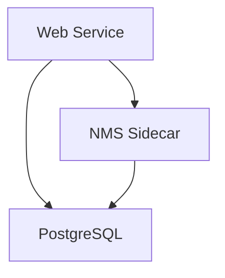

# Development Setup

<cite>
**Referenced Files in This Document**
- [README.md](file://README.md)
- [DEV_WORKFLOW.md](file://DEV_WORKFLOW.md)
- [DOCKER.md](file://DOCKER.md)
- [docker-compose.yml](file://docker-compose.yml)
- [Dockerfile.dev](file://Dockerfile.dev)
- [package.json](file://package.json)
- [scripts/dev-startup.sh](file://scripts/dev-startup.sh)
- [scripts/entrypoint.sh](file://scripts/entrypoint.sh)
- [next.config.js](file://next.config.js)
- [tsconfig.json](file://tsconfig.json)
- [prisma/schema.prisma](file://prisma/schema.prisma)
- [lib/prisma.ts](file://lib/prisma.ts)
- [nms_service/Dockerfile](file://nms_service/Dockerfile)
- [nms_service/main.py](file://nms_service/main.py)
- [nms_service/orchestrator.py](file://nms_service/orchestrator.py)
</cite>

## Table of Contents
1. [Introduction](#introduction)
2. [Project Structure](#project-structure)
3. [Core Components](#core-components)
4. [Architecture Overview](#architecture-overview)
5. [Detailed Component Analysis](#detailed-component-analysis)
6. [Dependency Analysis](#dependency-analysis)
7. [Performance Considerations](#performance-considerations)
8. [Troubleshooting Guide](#troubleshooting-guide)
9. [Conclusion](#conclusion)
10. [Appendices](#appendices)

## Introduction
This document provides a comprehensive guide to setting up and operating the development environment for InfraScope. It covers the hot reload and automatic reloading mechanisms, the Docker-based development stack, and the daily development workflow. You will learn how to configure the environment, mount volumes for live editing, leverage hot module replacement, and manage containers and databases during development. Practical commands for logs, debugging, and performance tuning are included, along with troubleshooting guidance for common issues.

## Project Structure
The development environment is orchestrated by Docker Compose and consists of:
- A Next.js frontend service configured for development with hot reload
- A PostgreSQL database service with persistent volumes
- An NMS (Network Monitoring System) sidecar service written in Python/FastAPI
- Shared volumes enabling live code synchronization and build isolation

**Diagram sources**
- [docker-compose.yml:5-153](file://docker-compose.yml#L5-L153)
- [Dockerfile.dev:1-51](file://Dockerfile.dev#L1-L51)
- [nms_service/Dockerfile:1-30](file://nms_service/Dockerfile#L1-L30)

**Section sources**
- [docker-compose.yml:1-153](file://docker-compose.yml#L1-L153)
- [Dockerfile.dev:1-51](file://Dockerfile.dev#L1-L51)
- [nms_service/Dockerfile:1-30](file://nms_service/Dockerfile#L1-L30)

## Core Components
- Docker Compose configuration defines three primary services: web, db, and nms. It sets environment variables, exposes ports, mounts volumes, and ensures health checks and restart policies.
- The development Dockerfile installs dependencies, generates the Prisma client, and starts the Next.js dev server with hot reload.
- The entrypoint script coordinates database readiness, applies migrations, seeds data in development, and pre-warms frequently used routes to accelerate initial page loads.
- The development startup script waits for the Next.js server to be healthy and then triggers alarm services to keep the environment fully functional during development.

Key development commands:
- Start/stop services and follow logs
- Execute commands inside containers (linting, type-checking, Prisma operations)
- Manage database migrations and seeding

**Section sources**
- [docker-compose.yml:32-77](file://docker-compose.yml#L32-L77)
- [Dockerfile.dev:23-50](file://Dockerfile.dev#L23-L50)
- [scripts/entrypoint.sh:11-41](file://scripts/entrypoint.sh#L11-L41)
- [scripts/dev-startup.sh:14-28](file://scripts/dev-startup.sh#L14-L28)
- [package.json:5-14](file://package.json#L5-L14)

## Architecture Overview
The development architecture centers on a containerized Next.js application that mounts the project directory for live editing, while a PostgreSQL database persists data across restarts. An NMS sidecar runs internal FastAPI endpoints for SNMP/SSH polling and integrates with the database.

**Diagram sources**
- [docker-compose.yml:32-77](file://docker-compose.yml#L32-L77)
- [scripts/entrypoint.sh:11-87](file://scripts/entrypoint.sh#L11-L87)
- [nms_service/main.py:62-73](file://nms_service/main.py#L62-L73)

**Section sources**
- [docker-compose.yml:32-77](file://docker-compose.yml#L32-L77)
- [scripts/entrypoint.sh:11-87](file://scripts/entrypoint.sh#L11-L87)
- [nms_service/main.py:62-73](file://nms_service/main.py#L62-L73)

## Detailed Component Analysis

### Hot Reload and Automatic Reloading
- The web service uses the development Dockerfile and runs the Next.js dev server with hot reload enabled. The container mounts the project directory and excludes node_modules and .next to avoid conflicts.
- The development startup script waits for the Next.js health endpoint to become responsive and then starts alarm services. This ensures the UI is ready before triggering backend-dependent features.
- The entrypoint script pre-warms core routes to minimize perceived latency on first visits.

**Diagram sources**
- [scripts/entrypoint.sh:11-87](file://scripts/entrypoint.sh#L11-L87)
- [scripts/dev-startup.sh:14-28](file://scripts/dev-startup.sh#L14-L28)
- [Dockerfile.dev:23-50](file://Dockerfile.dev#L23-L50)

**Section sources**
- [Dockerfile.dev:23-50](file://Dockerfile.dev#L23-L50)
- [scripts/entrypoint.sh:11-87](file://scripts/entrypoint.sh#L11-L87)
- [scripts/dev-startup.sh:14-28](file://scripts/dev-startup.sh#L14-L28)

### Docker-Based Development Environment
- The Compose configuration selects the development Dockerfile for the web service, sets NODE_ENV=development, and exposes ports for the web and NMS services.
- Volume mounts include the project directory for live editing, excluding node_modules and .next to prevent build conflicts. A named volume persists PostgreSQL data.
- Health checks and restart policies improve reliability during development.

**Diagram sources**
- [docker-compose.yml:58-64](file://docker-compose.yml#L58-L64)

**Section sources**
- [docker-compose.yml:32-77](file://docker-compose.yml#L32-L77)
- [docker-compose.yml:58-64](file://docker-compose.yml#L58-L64)

### Local Development Commands
Essential commands for development:
- Start/stop services and follow logs
- Execute commands inside containers (linting, type-checking, Prisma operations)
- Manage database migrations and seeding

Examples:
- Start services in detached mode
- Follow logs for the web service
- Execute lint/type-check inside the web container
- Run Prisma operations and open Studio
- Access the database CLI

**Section sources**
- [DOCKER.md:123-144](file://DOCKER.md#L123-L144)
- [DOCKER.md:146-163](file://DOCKER.md#L146-L163)
- [DOCKER.md:165-180](file://DOCKER.md#L165-L180)
- [DOCKER.md:182-196](file://DOCKER.md#L182-L196)
- [DEV_WORKFLOW.md:82-99](file://DEV_WORKFLOW.md#L82-L99)

### First-Time Setup and Daily Workflow
First-time setup:
- Build the development container
- Start all services with hot reload

Daily workflow:
- Start services if not running
- View logs in real-time
- Make code changes; they automatically reload

Stopping services:
- Stop all services
- Stop and remove volumes for a fresh start

**Section sources**
- [DEV_WORKFLOW.md:5-32](file://DEV_WORKFLOW.md#L5-L32)

### Volume Mounting Configuration
- The web service mounts the project directory into the container and excludes node_modules and .next to avoid conflicts with the host’s installed packages and Next.js build artifacts.
- A named volume persists PostgreSQL data across container restarts.

**Section sources**
- [docker-compose.yml:58-64](file://docker-compose.yml#L58-L64)
- [docker-compose.yml:14-18](file://docker-compose.yml#L14-L18)

### Hot Module Replacement and Automatic Reloading
- The development Dockerfile sets NODE_ENV=development and starts the Next.js dev server, enabling hot reload.
- The entrypoint script pre-warms routes to reduce initial load times after container restarts.

**Section sources**
- [Dockerfile.dev:23-50](file://Dockerfile.dev#L23-L50)
- [scripts/entrypoint.sh:66-77](file://scripts/entrypoint.sh#L66-L77)

### Database Connection and Prisma Integration
- The web service passes DATABASE_URL to the Next.js application, which connects to the PostgreSQL service.
- Prisma client generation and migrations are executed at container startup in development.
- The Prisma client is configured to disable query logging by default to reduce I/O overhead.

**Section sources**
- [docker-compose.yml:37-47](file://docker-compose.yml#L37-L47)
- [lib/prisma.ts:10-20](file://lib/prisma.ts#L10-L20)
- [prisma/schema.prisma:1-8](file://prisma/schema.prisma#L1-L8)

### NMS Sidecar Service
- The NMS service runs as a FastAPI application on port 8500 and is intended for internal use within the Docker network.
- It exposes endpoints for device polling, backups, and health checks, integrating with the database to store metrics and topology data.

**Section sources**
- [nms_service/Dockerfile:1-30](file://nms_service/Dockerfile#L1-L30)
- [nms_service/main.py:91-98](file://nms_service/main.py#L91-L98)
- [nms_service/main.py:103-129](file://nms_service/main.py#L103-L129)
- [nms_service/main.py:131-182](file://nms_service/main.py#L131-L182)
- [nms_service/main.py:186-200](file://nms_service/main.py#L186-L200)

## Dependency Analysis
The development stack comprises interdependent components:
- The web service depends on the database for Prisma operations and on the NMS service for internal API calls.
- The NMS service depends on the database for storing metrics and topology data.
- The entrypoint script coordinates startup order and ensures readiness before launching dependent services.

**Diagram sources**
- [docker-compose.yml:32-114](file://docker-compose.yml#L32-L114)
- [scripts/entrypoint.sh:11-41](file://scripts/entrypoint.sh#L11-L41)

**Section sources**
- [docker-compose.yml:32-114](file://docker-compose.yml#L32-L114)
- [scripts/entrypoint.sh:11-41](file://scripts/entrypoint.sh#L11-L41)

## Performance Considerations
- Initial container startup includes npm install and Prisma client generation; subsequent hot reloads are much faster.
- Pre-warming routes reduces first-load latency after container restarts.
- Prisma logging is disabled by default to minimize I/O overhead; enable selectively for debugging.
- Use health checks and restart policies to maintain service availability during development.

**Section sources**
- [DEV_WORKFLOW.md:101-106](file://DEV_WORKFLOW.md#L101-L106)
- [scripts/entrypoint.sh:66-77](file://scripts/entrypoint.sh#L66-L77)
- [lib/prisma.ts:10-20](file://lib/prisma.ts#L10-L20)

## Troubleshooting Guide
Common issues and resolutions:
- Changes not reflecting in the browser:
  - Verify services are running and check logs for errors
  - Hard refresh the browser to bypass cache
- Database connection issues:
  - Confirm database health and access via the database CLI
  - Check environment variables and network connectivity
- Port conflicts:
  - Adjust the port in environment variables and rebuild the web service
- Migration or seeding failures:
  - Inspect migration status and reset if necessary
  - Re-run seeding inside the container
- Container startup problems:
  - Review web service logs and restart the container
  - Clear Docker caches if images are large or outdated

**Section sources**
- [DEV_WORKFLOW.md:54-81](file://DEV_WORKFLOW.md#L54-L81)
- [DOCKER.md:345-420](file://DOCKER.md#L345-L420)

## Conclusion
The InfraScope development environment leverages Docker Compose to provide a robust, hot-reload-capable setup with persistent database storage and integrated NMS functionality. By following the documented workflow, using the provided commands, and understanding the volume and health-check configurations, developers can achieve a smooth and efficient development experience. For deeper customization, adjust environment variables, review Prisma configuration, and tune performance as needed.

## Appendices

### Essential Development Commands
- Start/stop services and follow logs
- Execute commands inside containers (linting, type-checking, Prisma operations)
- Manage database migrations and seeding

**Section sources**
- [DOCKER.md:123-196](file://DOCKER.md#L123-L196)
- [DEV_WORKFLOW.md:82-99](file://DEV_WORKFLOW.md#L82-L99)

### Environment Variables and Configuration
- Key variables include DATABASE_URL, NODE_ENV, NEXTAUTH_SECRET, PORT, DB_HOST, and agent-related tokens.
- The Next.js configuration enables standalone output, compression, and aggressive caching for static assets.

**Section sources**
- [docker-compose.yml:37-47](file://docker-compose.yml#L37-L47)
- [next.config.js:1-62](file://next.config.js#L1-L62)