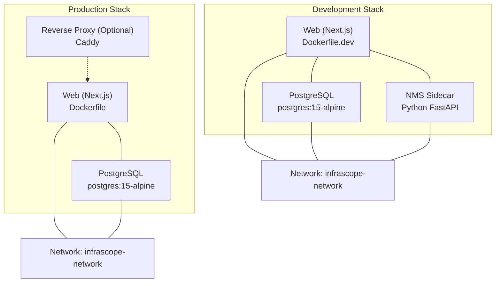
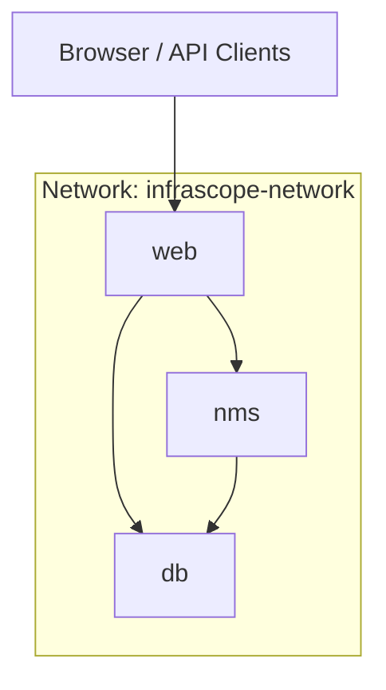
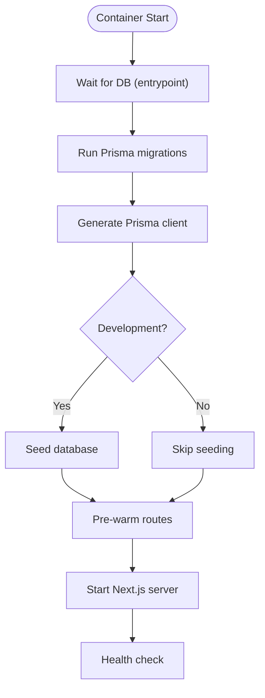
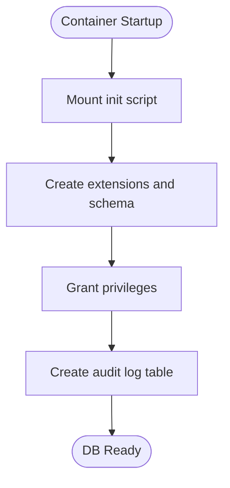
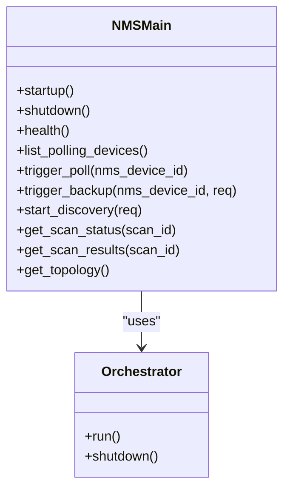
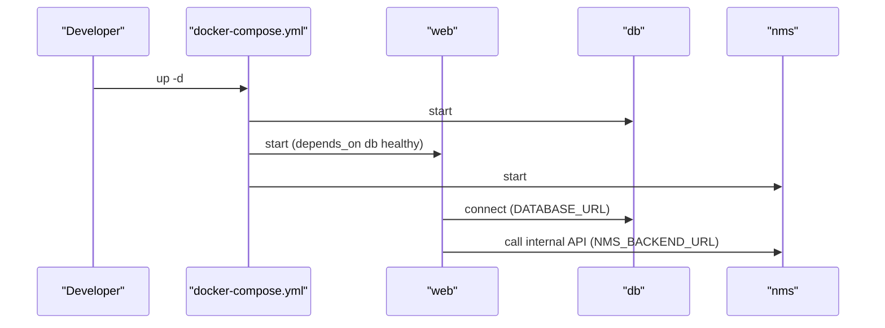
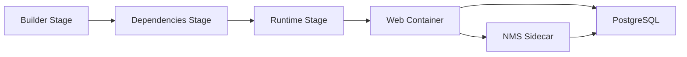
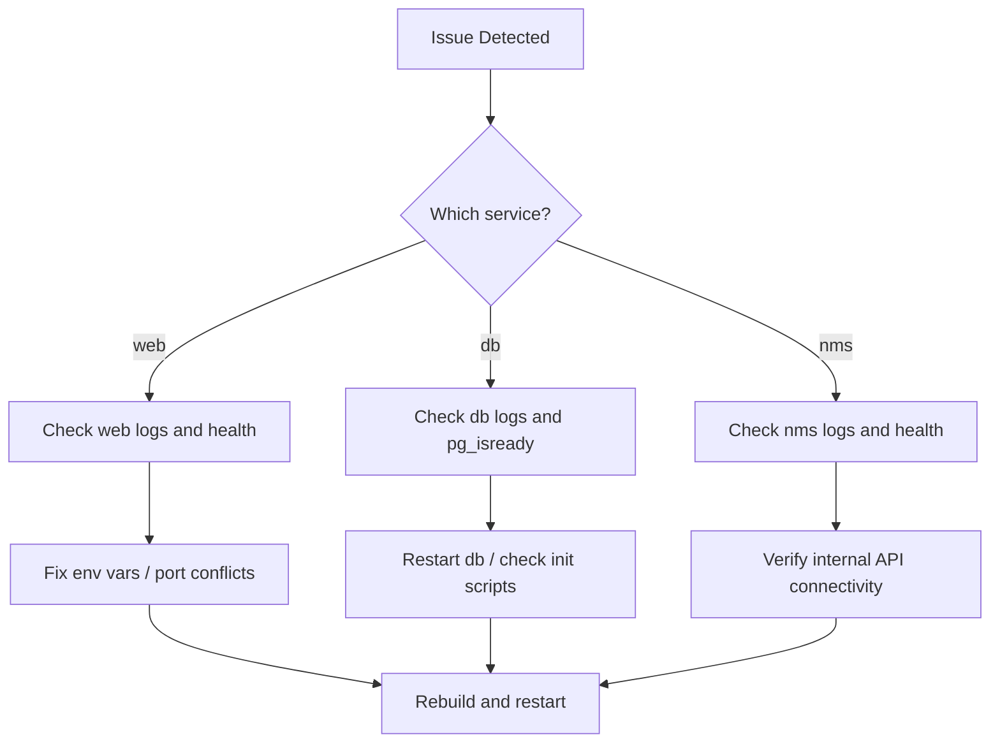

# Docker Configuration

<cite>
**Referenced Files in This Document**
- [DOCKER.md](file://DOCKER.md)
- [Dockerfile](file://Dockerfile)
- [Dockerfile.dev](file://Dockerfile.dev)
- [docker-compose.yml](file://docker-compose.yml)
- [docker-compose.prod.yml](file://docker-compose.prod.yml)
- [.dockerignore](file://.dockerignore)
- [scripts/entrypoint.sh](file://scripts/entrypoint.sh)
- [scripts/wait-for-db.sh](file://scripts/wait-for-db.sh)
- [docker/postgres-init.sql](file://docker/postgres-init.sql)
- [docker/postgres-backup.sh](file://docker/postgres-backup.sh)
- [nms_service/Dockerfile](file://nms_service/Dockerfile)
- [nms_service/main.py](file://nms_service/main.py)
- [nms_service/requirements.txt](file://nms_service/requirements.txt)
- [package.json](file://package.json)
</cite>

## Table of Contents
1. [Introduction](#introduction)
2. [Project Structure](#project-structure)
3. [Core Components](#core-components)
4. [Architecture Overview](#architecture-overview)
5. [Detailed Component Analysis](#detailed-component-analysis)
6. [Dependency Analysis](#dependency-analysis)
7. [Performance Considerations](#performance-considerations)
8. [Troubleshooting Guide](#troubleshooting-guide)
9. [Conclusion](#conclusion)
10. [Appendices](#appendices)

## Introduction
This document explains the Docker configuration for the InfraScope project, covering development and production setups, container networking, service dependencies, volume mounting, environment variable management, production deployment, scaling, resource allocation, security, health checks, and monitoring. It consolidates the official guide and the actual configuration files to provide a practical, code-backed reference for containerizing and orchestrating InfraScope’s stack.

## Project Structure
The Docker setup centers around:
- A multi-stage production Dockerfile for the Next.js web application
- A lightweight development Dockerfile enabling hot reload
- A Docker Compose configuration for development with three services: web, database, and an internal NMS sidecar
- A production Docker Compose configuration with security hardening and optional reverse proxy
- Scripts for container entrypoint, database readiness, and PostgreSQL initialization and backup
- An NMS service packaged as a Python FastAPI container

**Diagram sources**
- [docker-compose.yml:5-153](file://docker-compose.yml#L5-L153)
- [docker-compose.prod.yml:7-135](file://docker-compose.prod.yml#L7-L135)
- [Dockerfile.dev:1-51](file://Dockerfile.dev#L1-L51)
- [Dockerfile:1-115](file://Dockerfile#L1-L115)
- [nms_service/Dockerfile:1-30](file://nms_service/Dockerfile#L1-L30)

**Section sources**
- [DOCKER.md:51-116](file://DOCKER.md#L51-L116)
- [docker-compose.yml:1-153](file://docker-compose.yml#L1-L153)
- [docker-compose.prod.yml:1-135](file://docker-compose.prod.yml#L1-L135)

## Core Components
- Web application (Next.js)
  - Production image built with a multi-stage process and non-root user
  - Health checks and entrypoint-driven migrations and pre-warming
- Database (PostgreSQL)
  - Alpine-based image with initialization scripts and backup utility
  - Health checks and named volumes for persistence
- NMS sidecar (Python FastAPI)
  - Internal-only service exposing metrics and discovery endpoints
  - Runs background polling threads and integrates with the database
- Orchestration
  - Development compose defines three services and a shared network
  - Production compose focuses on security, isolation, and optional reverse proxy

**Section sources**
- [Dockerfile:56-115](file://Dockerfile#L56-L115)
- [Dockerfile.dev:6-51](file://Dockerfile.dev#L6-L51)
- [docker-compose.yml:6-115](file://docker-compose.yml#L6-L115)
- [docker-compose.prod.yml:8-105](file://docker-compose.prod.yml#L8-L105)
- [nms_service/Dockerfile:1-30](file://nms_service/Dockerfile#L1-L30)

## Architecture Overview
The system uses a bridge network for inter-service communication. Development exposes ports for local access; production isolates the database and optionally places a reverse proxy in front of the web service.

**Diagram sources**
- [docker-compose.yml:127-143](file://docker-compose.yml#L127-L143)
- [docker-compose.prod.yml:106-111](file://docker-compose.prod.yml#L106-L111)

**Section sources**
- [DOCKER.md:453-466](file://DOCKER.md#L453-L466)
- [docker-compose.yml:127-143](file://docker-compose.yml#L127-L143)
- [docker-compose.prod.yml:106-111](file://docker-compose.prod.yml#L106-L111)

## Detailed Component Analysis

### Web Application (Next.js)
- Multi-stage production build
  - Stage 1: builder installs dependencies, generates Prisma client, copies source, and builds the app
  - Stage 2: dependencies installs only production dependencies
  - Stage 3: runtime sets non-root user, copies assets and scripts, configures health checks and entrypoint
- Development build
  - Includes Python and PyVmomi for vSphere integration, enables hot reload
- Health checks and startup
  - Health check probes the internal health endpoint
  - Entrypoint waits for DB readiness, runs migrations, seeds in development, pre-warms routes, then starts the app

**Diagram sources**
- [scripts/entrypoint.sh:11-87](file://scripts/entrypoint.sh#L11-L87)
- [Dockerfile:106-115](file://Dockerfile#L106-L115)

**Section sources**
- [Dockerfile:6-115](file://Dockerfile#L6-L115)
- [Dockerfile.dev:6-51](file://Dockerfile.dev#L6-L51)
- [scripts/entrypoint.sh:1-88](file://scripts/entrypoint.sh#L1-L88)

### Database (PostgreSQL)
- Initialization
  - Extensions, schema, permissions, and audit log table created via an init script mounted at container startup
- Backups
  - Backup script supports automated compression and optional cleanup of old backups
- Health checks and persistence
  - Health probe configured; named volume ensures persistence across restarts

**Diagram sources**
- [docker/postgres-init.sql:6-37](file://docker/postgres-init.sql#L6-L37)

**Section sources**
- [docker-compose.yml:7-30](file://docker-compose.yml#L7-L30)
- [docker-compose.prod.yml:9-35](file://docker-compose.prod.yml#L9-L35)
- [docker/postgres-init.sql:1-38](file://docker/postgres-init.sql#L1-L38)
- [docker/postgres-backup.sh:1-37](file://docker/postgres-backup.sh#L1-L37)

### NMS Sidecar (Python FastAPI)
- Purpose
  - Internal-only service for SNMP polling, device discovery, and metrics retrieval
- Build and runtime
  - Python slim image with system dependencies for SNMP and paramiko
  - Exposes port 8500 inside the Docker network
- API surface
  - Health, device listing, on-demand polling, backups, discovery, and topology endpoints
- Dependencies
  - Managed via requirements.txt

**Diagram sources**
- [nms_service/main.py:37-483](file://nms_service/main.py#L37-L483)

**Section sources**
- [nms_service/Dockerfile:1-30](file://nms_service/Dockerfile#L1-L30)
- [nms_service/main.py:1-483](file://nms_service/main.py#L1-L483)
- [nms_service/requirements.txt:1-11](file://nms_service/requirements.txt#L1-L11)

### Orchestration and Networking
- Development compose
  - Services: web, db, nms
  - Shared network, named volumes, health checks, restart policies
  - Web depends on db being healthy
- Production compose
  - Services: web, db
  - Security hardening: no-new-privileges, read-only root filesystem, tmpfs for caches
  - Optional reverse proxy container (commented)
  - Database port exposed locally only (127.0.0.1)

**Diagram sources**
- [docker-compose.yml:32-77](file://docker-compose.yml#L32-L77)
- [docker-compose.yml:78-115](file://docker-compose.yml#L78-L115)

**Section sources**
- [docker-compose.yml:5-153](file://docker-compose.yml#L5-L153)
- [docker-compose.prod.yml:7-135](file://docker-compose.prod.yml#L7-L135)

## Dependency Analysis
- Build-time dependencies
  - Next.js app build requires Python and build tools in the builder stage
  - Prisma client generation is part of the build pipeline
- Runtime dependencies
  - Web container runs as non-root user and includes minimal runtime tools
  - NMS container installs system-level SNMP tools and Python packages
- Inter-service dependencies
  - Web depends on DB readiness and NMS availability for internal API calls
  - NMS writes metrics to the same database

**Diagram sources**
- [Dockerfile:6-115](file://Dockerfile#L6-L115)
- [nms_service/Dockerfile:1-30](file://nms_service/Dockerfile#L1-L30)

**Section sources**
- [Dockerfile:9-41](file://Dockerfile#L9-L41)
- [nms_service/Dockerfile:13-29](file://nms_service/Dockerfile#L13-L29)

## Performance Considerations
- Image size and build optimization
  - Multi-stage build reduces final image size and improves security
- Resource usage
  - Monitor with docker stats during development and production
- Caching and pre-warming
  - Web entrypoint pre-warms core routes to reduce first-request latency
- Scaling
  - The production compose does not define replicas; scale horizontally by deploying behind a load balancer and enabling reverse proxy

**Section sources**
- [DOCKER.md:447-452](file://DOCKER.md#L447-L452)
- [scripts/entrypoint.sh:66-78](file://scripts/entrypoint.sh#L66-L78)
- [DOCKER.md:262-280](file://DOCKER.md#L262-L280)

## Troubleshooting Guide
- Container fails to start
  - Check service logs for the failing component
  - Verify environment variables and port conflicts
- Database connection refused
  - Confirm DB health and readiness
  - Restart the database container if unhealthy
- Port conflicts
  - Adjust the exposed port in environment variables and rebuild
- Migration errors
  - Inspect migration status and reset if necessary (with caution)
- Large build images
  - Clear Docker builder cache and rebuild without cache
- Resource pressure
  - Use docker stats and prune unused images/volumes

**Diagram sources**
- [DOCKER.md:345-420](file://DOCKER.md#L345-L420)

**Section sources**
- [DOCKER.md:345-420](file://DOCKER.md#L345-L420)

## Conclusion
The InfraScope Docker configuration provides a robust, production-ready foundation for development and production environments. The multi-stage build optimizes image size and security, while Docker Compose orchestrates the web, database, and NMS services with health checks and persistence. Production hardening includes non-root execution, read-only filesystems, and isolated networks. Monitoring, backups, and operational scripts round out a complete containerized deployment story.

## Appendices

### Environment Variables
Key variables used across services:
- DATABASE_URL: PostgreSQL connection string
- NODE_ENV: development or production
- NEXTAUTH_SECRET: authentication secret
- PORT: application port
- DB_HOST: database hostname
- NEXTAUTH_URL, NEXT_PUBLIC_API_URL: API and auth URLs
- NMS_BACKEND_URL: internal URL for the NMS sidecar

**Section sources**
- [DOCKER.md:572-582](file://DOCKER.md#L572-L582)
- [docker-compose.yml:37-50](file://docker-compose.yml#L37-L50)
- [docker-compose.prod.yml:45-54](file://docker-compose.prod.yml#L45-L54)

### Volume Mounting and Persistence
- Development volumes
  - Named volume for PostgreSQL data
  - Source code mounted for hot reload; node_modules excluded
- Production volumes
  - Named volume for PostgreSQL data
  - No source code mounted (immutable image)

**Section sources**
- [docker-compose.yml:14-64](file://docker-compose.yml#L14-L64)
- [docker-compose.prod.yml:19-22](file://docker-compose.prod.yml#L19-L22)

### Health Checks
- Web: probes internal health endpoint
- DB: pg_isready checks
- NMS: internal health endpoint

**Section sources**
- [docker-compose.yml:23-28](file://docker-compose.yml#L23-L28)
- [docker-compose.yml:68-74](file://docker-compose.yml#L68-L74)
- [docker-compose.prod.yml:25-30](file://docker-compose.prod.yml#L25-L30)
- [docker-compose.prod.yml:63-69](file://docker-compose.prod.yml#L63-L69)

### Security Considerations
- Non-root user for web container
- Read-only root filesystem and no-new-privileges in production
- Network isolation via dedicated bridge network
- Optional reverse proxy and strict mode headers

**Section sources**
- [Dockerfile:68-71](file://Dockerfile#L68-L71)
- [docker-compose.prod.yml:69-75](file://docker-compose.prod.yml#L69-L75)
- [DOCKER.md:526-545](file://DOCKER.md#L526-L545)

### Monitoring and Logging
- View logs per service or follow mode
- Health checks via curl against health endpoints
- Performance monitoring with docker stats

**Section sources**
- [DOCKER.md:482-523](file://DOCKER.md#L482-L523)

### Practical Examples
- Start development stack
  - docker compose up -d
- Start production stack
  - docker compose -f docker-compose.prod.yml up -d
- Access database CLI
  - docker compose exec db psql -U <user> -d <db>
- Run migrations
  - docker compose exec web npx prisma migrate deploy
- Backup database
  - docker compose exec db /usr/local/bin/backup-db.sh

**Section sources**
- [DOCKER.md:25-47](file://DOCKER.md#L25-L47)
- [DOCKER.md:234-248](file://DOCKER.md#L234-L248)
- [docker/postgres-backup.sh:16-32](file://docker/postgres-backup.sh#L16-L32)