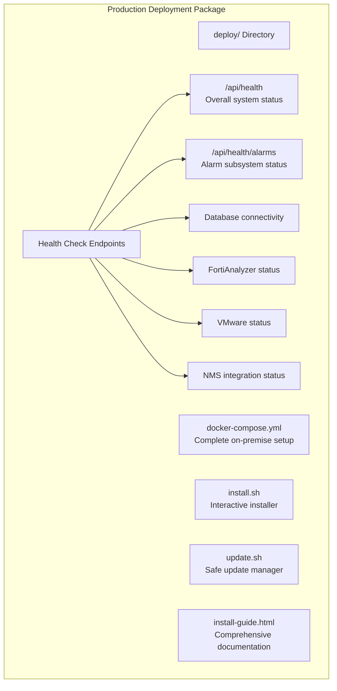
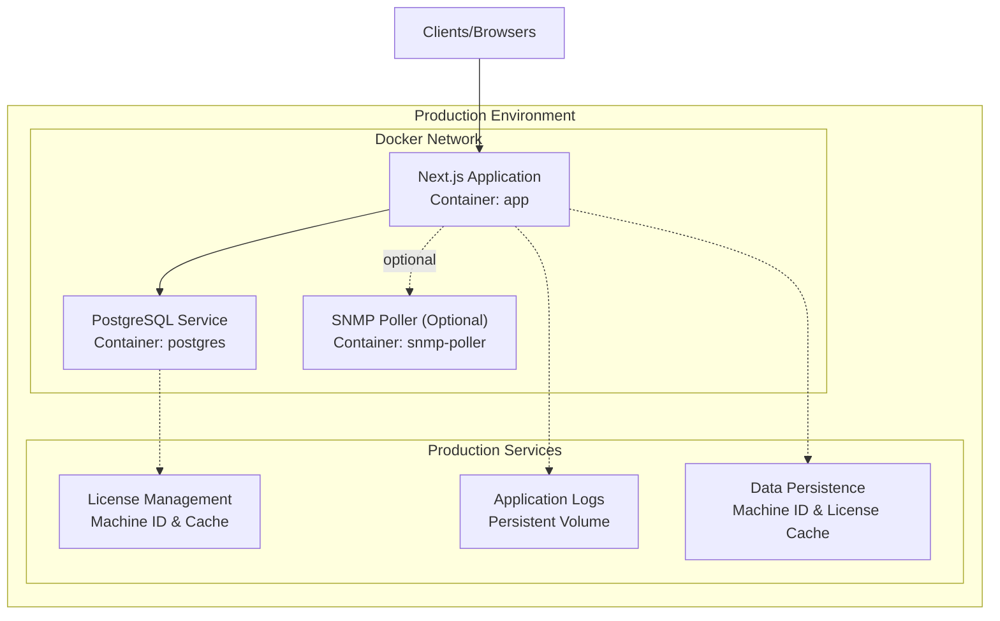
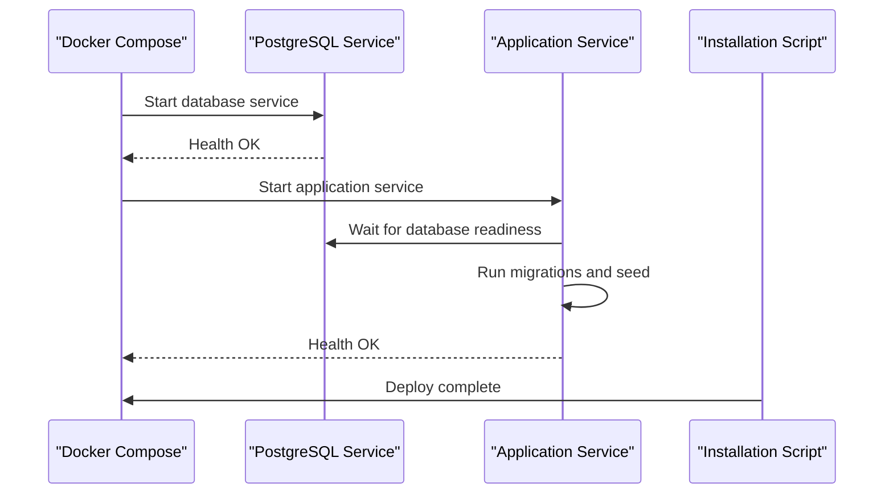

# Production Deployment

<cite>
**Referenced Files in This Document**
- [deploy/docker-compose.yml](file://deploy/docker-compose.yml)
- [deploy/install.sh](file://deploy/install.sh)
- [deploy/update.sh](file://deploy/update.sh)
- [deploy/install-guide.html](file://deploy/install-guide.html)
- [docker-compose.prod.yml](file://docker-compose.prod.yml)
- [Dockerfile](file://Dockerfile)
- [Dockerfile.dev](file://Dockerfile.dev)
- [scripts/entrypoint.sh](file://scripts/entrypoint.sh)
- [scripts/wait-for-db.sh](file://scripts/wait-for-db.sh)
- [docker/postgres-backup.sh](file://docker/postgres-backup.sh)
- [docker/postgres-init.sql](file://docker/postgres-init.sql)
- [app/api/health/route.ts](file://app/api/health/route.ts)
- [app/api/health/alarms/route.ts](file://app/api/health/alarms/route.ts)
- [lib/prisma.ts](file://lib/prisma.ts)
- [package.json](file://package.json)
- [docs/PRODUCTION_READINESS_AUDIT.md](file://docs/PRODUCTION_READINESS_AUDIT.md)
</cite>

## Update Summary
**Changes Made**
- Added comprehensive on-premise deployment artifacts including new Docker Compose configuration
- Integrated interactive installation and update scripts for streamlined production setup
- Enhanced production readiness documentation with detailed operational procedures
- Expanded deployment documentation to cover complete lifecycle management
- Added security hardening guidelines and production troubleshooting procedures

## Table of Contents
1. [Introduction](#introduction)
2. [Project Structure](#project-structure)
3. [Core Components](#core-components)
4. [Architecture Overview](#architecture-overview)
5. [Detailed Component Analysis](#detailed-component-analysis)
6. [Dependency Analysis](#dependency-analysis)
7. [Performance Considerations](#performance-considerations)
8. [Troubleshooting Guide](#troubleshooting-guide)
9. [Conclusion](#conclusion)
10. [Appendices](#appendices)

## Introduction
This document provides a comprehensive guide for deploying InfraScope in production environments. It covers the complete production deployment lifecycle including on-premise Docker Compose configuration, interactive installation and update procedures, database initialization and backup processes, deployment strategies, zero-downtime deployment practices, monitoring and observability, security hardening, SSL configuration, and scaling approaches. The guide includes practical commands, health checks, and maintenance procedures to ensure reliable operations.

## Project Structure
The production deployment utilizes a comprehensive on-premise deployment package that includes complete installation automation, update procedures, and operational documentation. The deployment package consists of three primary Docker Compose configurations and supporting scripts for seamless production setup.

**Diagram sources**
- [deploy/docker-compose.yml:1-105](file://deploy/docker-compose.yml#L1-L105)
- [deploy/install.sh:1-170](file://deploy/install.sh#L1-L170)
- [deploy/update.sh:1-169](file://deploy/update.sh#L1-L169)
- [deploy/install-guide.html:1-938](file://deploy/install-guide.html#L1-L938)

**Section sources**
- [deploy/docker-compose.yml:1-105](file://deploy/docker-compose.yml#L1-L105)
- [deploy/install.sh:1-170](file://deploy/install.sh#L1-L170)
- [deploy/update.sh:1-169](file://deploy/update.sh#L1-L169)
- [deploy/install-guide.html:1-938](file://deploy/install-guide.html#L1-L938)

## Core Components
The production deployment package includes several key components designed for enterprise-grade deployment and operations:

- **Complete On-Premise Docker Compose**: Production-ready configuration with PostgreSQL, Next.js application, and optional SNMP poller service
- **Interactive Installation Scripts**: Automated setup with prerequisite checking, environment configuration, and service deployment
- **Safe Update Procedures**: Comprehensive update process with automatic database backup, migration execution, and rollback support
- **Production Hardening**: Multi-stage Docker builds, non-root execution, health checks, and security optimizations
- **Comprehensive Documentation**: HTML-based installation guide with architecture diagrams and operational procedures
- **Health Monitoring**: Advanced health endpoints for system-wide and alarm-specific monitoring

**Section sources**
- [deploy/docker-compose.yml:11-105](file://deploy/docker-compose.yml#L11-L105)
- [deploy/install.sh:28-170](file://deploy/install.sh#L28-L170)
- [deploy/update.sh:42-169](file://deploy/update.sh#L42-L169)
- [Dockerfile:56-115](file://Dockerfile#L56-L115)
- [app/api/health/route.ts:1-440](file://app/api/health/route.ts#L1-L440)
- [app/api/health/alarms/route.ts:1-198](file://app/api/health/alarms/route.ts#L1-L198)

## Architecture Overview
The production architecture supports both single-host and orchestrated deployments with comprehensive security and monitoring capabilities. The system includes a centralized PostgreSQL database, Next.js web application, and optional services for enhanced functionality.

**Diagram sources**
- [deploy/docker-compose.yml:14-105](file://deploy/docker-compose.yml#L14-L105)

## Detailed Component Analysis

### Complete On-Premise Docker Compose Configuration
The deployment package provides a comprehensive Docker Compose configuration that includes all necessary services for production deployment:

**Database Service (PostgreSQL)**
- Multi-stage build with Alpine Linux base
- Configurable environment variables for credentials and database settings
- Health check using pg_isready command
- Persistent volume configuration for data durability
- Port exposure with configurable mapping

**Application Service (Next.js)**
- Production-ready image with multi-stage build
- Environment variable configuration for database connectivity, authentication, and licensing
- Health check against internal health API endpoint
- Persistent volumes for machine ID, license cache, and application logs
- Configurable port exposure

**Optional SNMP Poller Service**
- Separate container for network device monitoring
- Host networking mode for UDP protocol support
- Configurable polling intervals and community strings

**Section sources**
- [deploy/docker-compose.yml:14-105](file://deploy/docker-compose.yml#L14-L105)

### Interactive Installation Script
The installation script provides a guided setup experience with comprehensive validation and configuration:

**Prerequisite Validation**
- Docker and Docker Compose detection and verification
- Docker daemon status checking
- Error reporting and guidance for missing components

**Directory Structure Creation**
- Automatic creation of required directories (data/, logs/)
- Proper permission setting for persistent volumes

**Environment Configuration**
- Template-based .env file creation
- License key input with validation
- Random NEXTAUTH_SECRET generation for security
- Database credential configuration

**Service Deployment**
- Docker image pulling with registry access verification
- Service startup with progress reporting
- Installation completion with access instructions

**Section sources**
- [deploy/install.sh:28-170](file://deploy/install.sh#L28-L170)

### Safe Update Procedure
The update script ensures safe deployment of new versions with comprehensive backup and validation:

**Pre-Update Backup**
- Database backup creation with timestamped filenames
- Backup directory structure and permissions management
- Backup verification and cleanup of old backups

**Version Management**
- Target version specification and validation
- Registry access verification for new images
- Version tracking in .env configuration

**Migration Execution**
- Database migration execution with error handling
- Service restart with health verification
- Post-update validation and cleanup

**Rollback Support**
- Automatic rollback instructions for failed updates
- Backup restoration guidance
- Version downgrade procedures

**Section sources**
- [deploy/update.sh:42-169](file://deploy/update.sh#L42-L169)

### Production Hardening and Security
The production deployment includes comprehensive security measures and operational hardening:

**Container Security**
- Non-root user execution with dedicated group
- Read-only root filesystem for application container
- Security options including no-new-privileges
- Temporary filesystems for cache and temporary data

**Database Security**
- Local-only port binding (127.0.0.1)
- Environment-driven credential management
- Health check configuration for early failure detection
- Persistent volume configuration for data durability

**Application Security**
- Strict transport security headers
- Health check endpoints for monitoring
- Environment variable validation
- Service dependency management

**Section sources**
- [docker-compose.prod.yml:30-75](file://docker-compose.prod.yml#L30-L75)
- [Dockerfile:68-101](file://Dockerfile#L68-L101)

### Health Monitoring and Observability
The deployment includes comprehensive health monitoring and observability features:

**Application-Level Health Checks**
- Overall system health endpoint (/api/health) with component status aggregation
- Alarm subsystem health endpoint (/api/health/alarms) for monitoring critical components
- Database connectivity verification
- External integration health monitoring (FortiAnalyzer, VMware, NMS)

**Component Monitoring**
- Scheduler heartbeat monitoring with staleness detection
- Event cache synchronization status
- Detection engine performance metrics
- Email notification delivery status
- Circuit breaker state monitoring
- Dead letter queue (DLQ) backlog monitoring

**External Monitoring Integration**
- HTTP 200/503 status codes for health endpoint responses
- Structured JSON responses with detailed component information
- Integration with monitoring systems like Zabbix, Uptime Kuma, and cron-based monitors

**Section sources**
- [app/api/health/route.ts:386-440](file://app/api/health/route.ts#L386-L440)
- [app/api/health/alarms/route.ts:54-198](file://app/api/health/alarms/route.ts#L54-L198)

### Database Management and Backup
The deployment includes robust database management and backup capabilities:

**Database Initialization**
- Extension and schema creation during first boot
- Default timezone and audit logging table preparation
- Initialization script mounting for container persistence

**Backup Operations**
- Logical dump using pg_dump with gzip compression
- Automatic cleanup of backups older than seven days
- Timestamped backup file naming for easy identification
- Backup directory structure with proper permissions

**Backup Verification**
- Backup file size reporting
- Location verification and accessibility
- Cleanup operation confirmation

**Section sources**
- [docker/postgres-init.sql:1-38](file://docker/postgres-init.sql#L1-L38)
- [docker/postgres-backup.sh:1-37](file://docker/postgres-backup.sh#L1-L37)

### Production Readiness and Operational Procedures
The deployment package includes comprehensive production readiness documentation and operational procedures:

**Installation Guide**
- Step-by-step installation process with screenshots
- Architecture diagrams showing vendor and customer deployment
- License lifecycle management documentation
- Tier feature comparison matrix

**Deployment Lifecycle**
- Initial installation procedures
- Routine maintenance operations
- Update and rollback procedures
- Troubleshooting guides for common issues

**Security and Compliance**
- License management and activation procedures
- Machine ID and cache management
- Grace period and restricted mode operations
- Offline activation scenarios

**Section sources**
- [deploy/install-guide.html:1-938](file://deploy/install-guide.html#L1-L938)
- [docs/PRODUCTION_READINESS_AUDIT.md:1-543](file://docs/PRODUCTION_READINESS_AUDIT.md#L1-L543)

## Dependency Analysis
The production deployment follows a well-defined dependency hierarchy with clear startup ordering and service coordination:

**Startup Dependencies**
- Database service must be healthy before application startup
- Application service requires database connectivity for migrations
- Alarm services depend on application health endpoint readiness
- SNMP poller service requires network connectivity and configuration

**Service Coordination**
- Health check endpoints coordinate service startup and monitoring
- Environment variables manage inter-service communication
- Volume mounts ensure data persistence across deployments
- Network configuration enables service-to-service communication

**Diagram sources**
- [deploy/docker-compose.yml:40-42](file://deploy/docker-compose.yml#L40-L42)
- [scripts/entrypoint.sh:11-31](file://scripts/entrypoint.sh#L11-L31)

**Section sources**
- [deploy/docker-compose.yml:40-42](file://deploy/docker-compose.yml#L40-L42)
- [scripts/entrypoint.sh:11-31](file://scripts/entrypoint.sh#L11-L31)

## Performance Considerations
Production deployment considerations include optimization for enterprise environments:

**Container Optimization**
- Multi-stage Docker builds for reduced image size
- Non-root user execution for security compliance
- Health checks for early failure detection
- Temporary filesystems for improved performance

**Database Performance**
- Connection pooling configuration for concurrent access
- Index optimization for query performance
- Backup scheduling to minimize performance impact
- Monitoring for performance degradation

**Application Performance**
- Static asset optimization for faster delivery
- API endpoint caching for reduced database load
- Background job scheduling for maintenance tasks
- Resource monitoring for capacity planning

**Scalability Considerations**
- Horizontal scaling through multiple service instances
- Load balancing for high availability
- Database clustering for increased capacity
- Caching layers for improved response times

## Troubleshooting Guide
Comprehensive troubleshooting procedures for production environments:

**Common Production Issues**
- Database connectivity failures: Verify network configuration and credentials
- Migration failures: Check migration logs and database permissions
- Health endpoint failures: Review alarm subsystem status and component dependencies
- License activation issues: Verify machine ID persistence and cache validity
- Update failures: Check backup creation and rollback procedures

**Diagnostic Commands**
- Service status verification: `docker compose ps`
- Log inspection: `docker compose logs -f`
- Database connectivity testing: `docker compose exec db psql`
- Health endpoint testing: `curl http://localhost:3000/api/health`

**Recovery Procedures**
- Service restart: `docker compose restart`
- Database backup restoration: `docker compose exec db psql < backup.sql`
- License cache regeneration: Remove cache directory and restart service
- Configuration validation: Verify .env file syntax and values

**Monitoring and Alerting**
- Health endpoint integration with monitoring systems
- Log aggregation and analysis
- Performance metric collection and alerting
- Capacity planning and resource monitoring

**Section sources**
- [deploy/update.sh:118-169](file://deploy/update.sh#L118-L169)
- [deploy/install.sh:132-170](file://deploy/install.sh#L132-L170)

## Conclusion
The enhanced production deployment package provides a comprehensive solution for enterprise-grade InfraScope deployment. With interactive installation and update procedures, robust security hardening, comprehensive monitoring capabilities, and detailed operational documentation, teams can achieve reliable and maintainable production operations. The package addresses critical production concerns including license management, database backup, health monitoring, and disaster recovery procedures.

## Appendices

### A. Production Deployment Commands
**Installation Commands**
- Interactive installation: `./install.sh`
- Service startup: `docker compose up -d`
- Service shutdown: `docker compose down`
- Log monitoring: `docker compose logs -f`

**Database Operations**
- Database access: `docker compose exec db psql`
- Backup creation: `docker compose exec db /usr/local/bin/backup-db.sh`
- Backup restoration: `docker compose exec -i db psql < backup.sql`

**Application Management**
- Service restart: `docker compose restart`
- Health verification: `curl http://localhost:3000/api/health`
- Alarm health: `curl http://localhost:3000/api/health/alarms`

**Section sources**
- [deploy/install.sh:132-158](file://deploy/install.sh#L132-L158)
- [deploy/update.sh:100-116](file://deploy/update.sh#L100-L116)
- [docker/postgres-backup.sh:16-37](file://docker/postgres-backup.sh#L16-L37)

### B. Zero-Downtime Deployment and Rollback
**Zero-Downtime Strategy**
- Blue-Green deployment using separate service instances
- Load balancer traffic switching after health verification
- Database migration during maintenance window
- Rollback using previous service version

**Rollback Procedures**
- Version rollback using .env configuration
- Database backup restoration for failed updates
- Service restart with previous configuration
- Monitoring verification after rollback

**Section sources**
- [deploy/update.sh:145-169](file://deploy/update.sh#L145-L169)

### C. Scaling and High Availability
**Horizontal Scaling**
- Multiple application service instances behind load balancer
- Database clustering for high availability
- Redis caching layer for improved performance
- Load balancer configuration for traffic distribution

**High Availability Configuration**
- Database replication setup
- Application service redundancy
- Load balancer health checks
- Automatic failover procedures

**Capacity Planning**
- Resource utilization monitoring
- Performance baseline establishment
- Growth projection and capacity planning
- Cost optimization strategies

### D. Security Hardening Checklist
**Production Security**
- HTTPS termination with SSL certificates
- Database access restriction to internal network
- Regular security updates and patches
- Secret management and rotation procedures
- Network segmentation and firewall rules

**Compliance Requirements**
- Audit logging and monitoring
- Data retention and privacy compliance
- Access control and authentication
- Disaster recovery and business continuity

**Section sources**
- [docker-compose.prod.yml:30-75](file://docker-compose.prod.yml#L30-L75)
- [docs/PRODUCTION_READINESS_AUDIT.md:265-309](file://docs/PRODUCTION_READINESS_AUDIT.md#L265-L309)

### E. SSL Configuration
**Certificate Management**
- Certificate installation and renewal procedures
- TLS configuration for application and database
- Certificate validation and testing
- Automated certificate renewal setup

**Security Best Practices**
- Strong cipher suite configuration
- Certificate authority validation
- Private key protection and management
- Certificate monitoring and alerting

### F. Monitoring and Observability
**Health Monitoring**
- Integration with external monitoring systems
- Alerting configuration for critical failures
- Performance metrics collection and analysis
- Capacity planning and trend analysis

**Operational Metrics**
- Service uptime and availability
- Response time and throughput metrics
- Error rates and failure patterns
- Resource utilization and capacity trends

**Section sources**
- [app/api/health/route.ts:386-440](file://app/api/health/route.ts#L386-L440)
- [app/api/health/alarms/route.ts:54-198](file://app/api/health/alarms/route.ts#L54-L198)