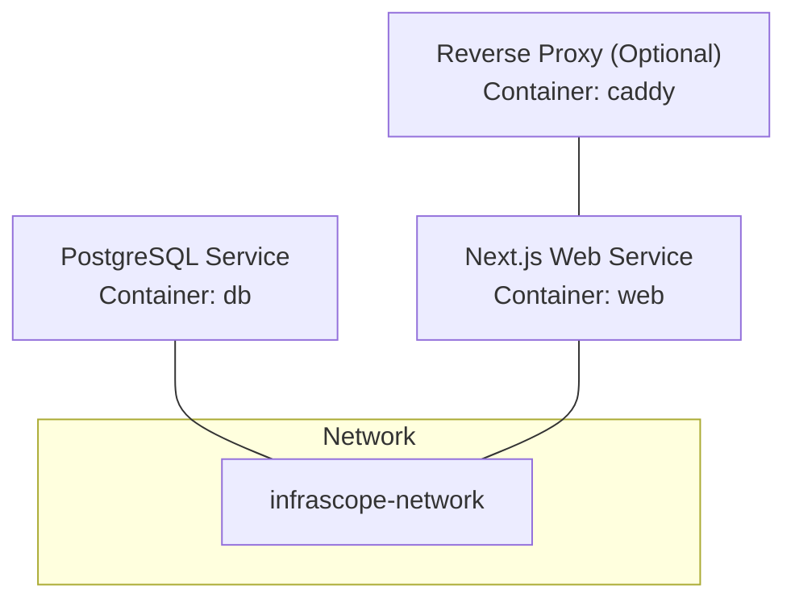
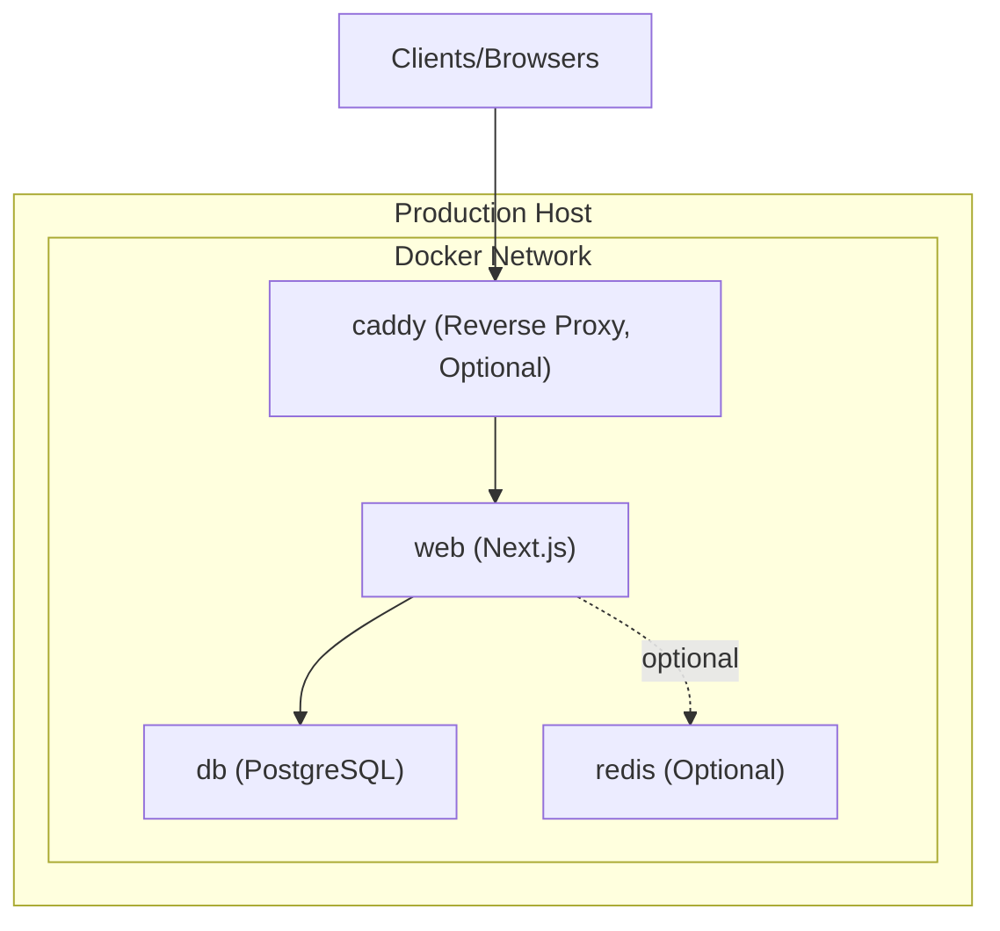
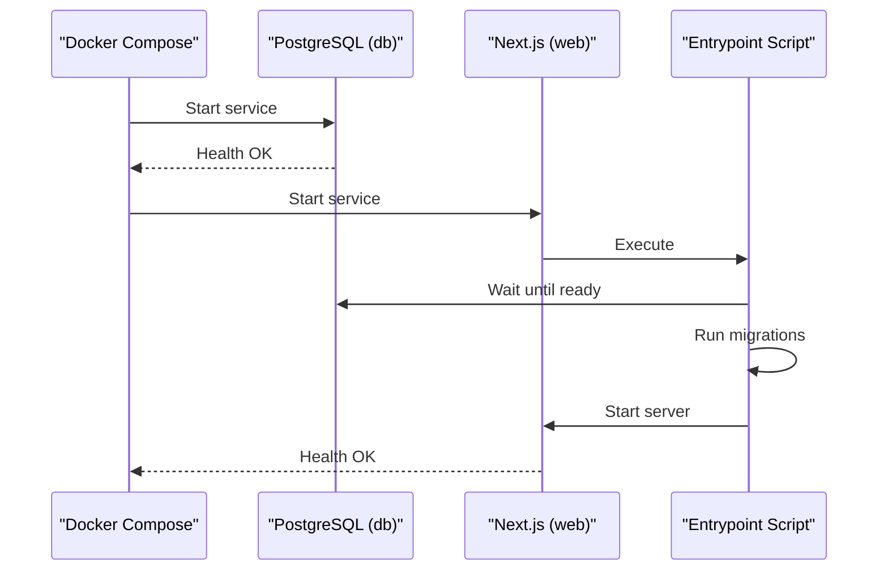

# Production Deployment

<cite>
**Referenced Files in This Document**
- [docker-compose.prod.yml](file://docker-compose.prod.yml)
- [Dockerfile](file://Dockerfile)
- [Dockerfile.dev](file://Dockerfile.dev)
- [scripts/entrypoint.sh](file://scripts/entrypoint.sh)
- [scripts/wait-for-db.sh](file://scripts/wait-for-db.sh)
- [docker/postgres-backup.sh](file://docker/postgres-backup.sh)
- [docker/postgres-init.sql](file://docker/postgres-init.sql)
- [app/api/health/route.ts](file://app/api/health/route.ts)
- [app/api/health/alarms/route.ts](file://app/api/health/alarms/route.ts)
- [lib/prisma.ts](file://lib/prisma.ts)
- [package.json](file://package.json)
</cite>

## Table of Contents
1. [Introduction](#introduction)
2. [Project Structure](#project-structure)
3. [Core Components](#core-components)
4. [Architecture Overview](#architecture-overview)
5. [Detailed Component Analysis](#detailed-component-analysis)
6. [Dependency Analysis](#dependency-analysis)
7. [Performance Considerations](#performance-considerations)
8. [Troubleshooting Guide](#troubleshooting-guide)
9. [Conclusion](#conclusion)
10. [Appendices](#appendices)

## Introduction
This document provides a comprehensive guide for deploying InfraScope in production. It covers the production Docker Compose configuration, database initialization and backup procedures, deployment strategies, zero-downtime deployment and rollback practices, monitoring and observability, security hardening, SSL configuration, and scaling approaches. Practical commands and health checks are included to streamline operational tasks.

## Project Structure
The production deployment relies on a multi-service Docker Compose stack with a PostgreSQL database, a Next.js web application, and optional services. The stack defines a dedicated network and named volumes for persistence. Health checks are integrated at both the container and application levels.

**Diagram sources**
- [docker-compose.prod.yml:7-135](file://docker-compose.prod.yml#L7-L135)

**Section sources**
- [docker-compose.prod.yml:5-135](file://docker-compose.prod.yml#L5-L135)

## Core Components
- Production Docker Compose: Defines services for PostgreSQL, Next.js, and optional reverse proxy and Redis. Includes health checks, security options, and persistent volumes.
- Next.js Production Image: Multi-stage build with non-root user, slim base image, health checks, and entrypoint script for migrations and warm-up.
- Database Initialization and Backup: Initialization script for extensions and schema; backup script for logical dumps with compression and retention.
- Health Checks: Application-level health endpoints for overall system and alarm subsystems, plus container-level health checks.

**Section sources**
- [docker-compose.prod.yml:7-135](file://docker-compose.prod.yml#L7-L135)
- [Dockerfile:56-115](file://Dockerfile#L56-L115)
- [docker/postgres-init.sql:1-38](file://docker/postgres-init.sql#L1-L38)
- [docker/postgres-backup.sh:1-37](file://docker/postgres-backup.sh#L1-L37)
- [app/api/health/route.ts:1-255](file://app/api/health/route.ts#L1-L255)
- [app/api/health/alarms/route.ts:1-198](file://app/api/health/alarms/route.ts#L1-L198)

## Architecture Overview
The production architecture centers around a single-host or orchestrated deployment using Docker Compose. The Next.js application connects to PostgreSQL via an internal network. Optional reverse proxy and Redis can be enabled for SSL termination and caching.

**Diagram sources**
- [docker-compose.prod.yml:7-135](file://docker-compose.prod.yml#L7-L135)

## Detailed Component Analysis

### Production Docker Compose Configuration
Key production settings:
- PostgreSQL service with environment-driven credentials, health checks, and persistent volume.
- Next.js service with production environment variables, health checks, read-only root filesystem, and temporary filesystems for cache and temp.
- Optional reverse proxy and Redis services included for production hardening and performance.

Operational commands:
- Start services: docker compose -f docker-compose.prod.yml up -d
- Stop services: docker compose -f docker-compose.prod.yml down
- View logs: docker compose -f docker-compose.prod.yml logs -f

Security and isolation:
- Health checks for early failure detection.
- Security options and read-only root filesystem for the web service.
- Internal-only exposure of the database with localhost binding.

**Section sources**
- [docker-compose.prod.yml:7-135](file://docker-compose.prod.yml#L7-L135)

### Next.js Production Image and Entrypoint
Build characteristics:
- Multi-stage build for minimal image size and secure runtime.
- Non-root user and slim base image.
- Health check embedded in the image definition.

Entrypoint responsibilities:
- Waits for the database to be ready.
- Runs Prisma migrations and regenerates the client.
- Seeds the database in development mode.
- Starts alarm scheduler and monitor after server readiness.
- Pre-warms frequently accessed routes to reduce cold-start latency.

**Section sources**
- [Dockerfile:56-115](file://Dockerfile#L56-L115)
- [scripts/entrypoint.sh:1-88](file://scripts/entrypoint.sh#L1-L88)

### Database Initialization and Backup
Initialization:
- Extensions and schema creation are handled by an initialization script mounted during first boot.
- Default timezone and audit logging table are prepared.

Backup:
- Logical dump using pg_dump with gzip compression.
- Automatic cleanup of backups older than seven days.
- Executed inside the database container via the mounted script.

**Section sources**
- [docker/postgres-init.sql:1-38](file://docker/postgres-init.sql#L1-L38)
- [docker/postgres-backup.sh:1-37](file://docker/postgres-backup.sh#L1-L37)

### Health Checks and Monitoring
Application-level health:
- Overall health endpoint aggregates database, FortiAnalyzer, VMware, alarm statistics, and DLQ metrics.
- Alarm subsystem health endpoint evaluates scheduler, event cache, detection, email, FA circuit breaker, and DLQ.

Container-level health:
- PostgreSQL health check using pg_isready.
- Next.js health check against the internal health API.

Observability:
- Health endpoints return structured JSON with status and component details.
- Use external monitors (e.g., Zabbix, Uptime Kuma) to poll the alarm health endpoint.

**Section sources**
- [app/api/health/route.ts:1-255](file://app/api/health/route.ts#L1-L255)
- [app/api/health/alarms/route.ts:1-198](file://app/api/health/alarms/route.ts#L1-L198)
- [docker-compose.prod.yml:25-68](file://docker-compose.prod.yml#L25-L68)

### Prisma Client Configuration
- Singleton client instance with configurable query logging.
- Query logging disabled by default to minimize I/O overhead.

**Section sources**
- [lib/prisma.ts:1-21](file://lib/prisma.ts#L1-L21)

### Development vs Production Images
- Development image supports hot reload and includes additional Python packages for VMware integration.
- Production image is optimized for size and security with non-root execution and health checks.

**Section sources**
- [Dockerfile.dev:1-51](file://Dockerfile.dev#L1-L51)
- [Dockerfile:56-115](file://Dockerfile#L56-L115)

## Dependency Analysis
Runtime dependencies and startup order:
- Next.js web service depends on PostgreSQL being healthy.
- Entrypoint ensures database readiness, applies migrations, and warms routes before starting the server.

**Diagram sources**
- [docker-compose.prod.yml:58-60](file://docker-compose.prod.yml#L58-L60)
- [scripts/entrypoint.sh:11-41](file://scripts/entrypoint.sh#L11-L41)

**Section sources**
- [docker-compose.prod.yml:58-60](file://docker-compose.prod.yml#L58-L60)
- [scripts/entrypoint.sh:11-41](file://scripts/entrypoint.sh#L11-L41)

## Performance Considerations
- Use the production Dockerfile for optimized builds and minimal runtime footprint.
- Enable reverse proxy (Caddy) for SSL/TLS termination and HTTP/2.
- Consider adding Redis for caching frequently accessed data and reducing database load.
- Keep query logging disabled in production to avoid I/O overhead.

[No sources needed since this section provides general guidance]

## Troubleshooting Guide
Common production issues and resolutions:
- Database not ready: Verify health check and ensure environment variables are set. Use the entrypoint wait mechanism and the wait-for-db script for manual verification.
- Migration failures: Review migration logs and confirm Prisma client generation. Re-run migrations after resolving schema conflicts.
- Health endpoint returns degraded/unhealthy: Inspect alarm subsystem health, DLQ backlog, and datasource connectivity.
- Backup failures: Confirm backup script execution permissions and disk space availability.

Operational commands:
- View logs: docker compose -f docker-compose.prod.yml logs -f
- Access database: docker compose -f docker-compose.prod.yml exec db psql
- Run backup: docker compose -f docker-compose.prod.yml exec db /usr/local/bin/backup-db.sh

**Section sources**
- [scripts/wait-for-db.sh:1-29](file://scripts/wait-for-db.sh#L1-L29)
- [docker/postgres-backup.sh:1-37](file://docker/postgres-backup.sh#L1-L37)
- [docker-compose.prod.yml:127-134](file://docker-compose.prod.yml#L127-L134)

## Conclusion
This production deployment guide outlines a secure, observable, and maintainable setup for InfraScope. By leveraging the provided Docker Compose configuration, health checks, and backup procedures, teams can achieve reliable operations with clear monitoring signals and straightforward maintenance workflows.

[No sources needed since this section summarizes without analyzing specific files]

## Appendices

### A. Production Deployment Commands
- Start production stack: docker compose -f docker-compose.prod.yml up -d
- Stop production stack: docker compose -f docker-compose.prod.yml down
- Tail logs: docker compose -f docker-compose.prod.yml logs -f
- Access database: docker compose -f docker-compose.prod.yml exec db psql
- Run backup: docker compose -f docker-compose.prod.yml exec db /usr/local/bin/backup-db.sh

**Section sources**
- [docker-compose.prod.yml:127-134](file://docker-compose.prod.yml#L127-L134)
- [docker/postgres-backup.sh:1-37](file://docker/postgres-backup.sh#L1-L37)

### B. Zero-Downtime Deployment and Rollback
- Strategy: Deploy a new web service version behind a reverse proxy or load balancer, verify health endpoints, then switch traffic and remove the old service.
- Rollback: Re-deploy the previous working image tag and repeat the verification steps.

[No sources needed since this section provides general guidance]

### C. Scaling and High Availability
- Horizontal scaling: Run multiple web service replicas behind a reverse proxy or platform-native load balancer.
- Database HA: Use managed PostgreSQL with replication or a high-availability cluster; ensure connection pooling and read replicas if needed.
- Caching: Add Redis for session storage and caching to reduce database pressure.

[No sources needed since this section provides general guidance]

### D. Security Hardening Checklist
- Use HTTPS via reverse proxy (Caddy) with TLS certificates.
- Restrict database exposure to internal network; avoid publishing ports externally.
- Enable health checks and failover mechanisms.
- Rotate secrets regularly and restrict filesystem permissions.

[No sources needed since this section provides general guidance]

### E. SSL Configuration
- Configure the reverse proxy (Caddy) with TLS certificates and domain names.
- Ensure NEXTAUTH_URL and related URLs use HTTPS in production.

[No sources needed since this section provides general guidance]

### F. Monitoring and Observability
- Use the alarm health endpoint for external monitoring.
- Integrate with platform-specific monitoring systems to track health endpoint responses and alert on degraded/unhealthy statuses.

**Section sources**
- [app/api/health/alarms/route.ts:54-197](file://app/api/health/alarms/route.ts#L54-L197)