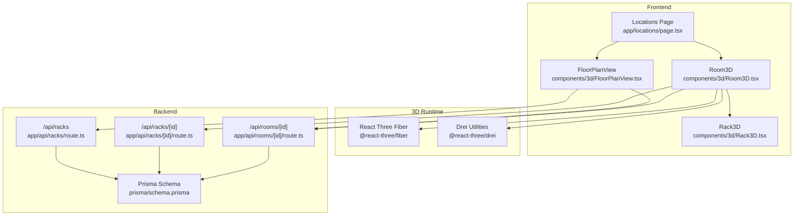
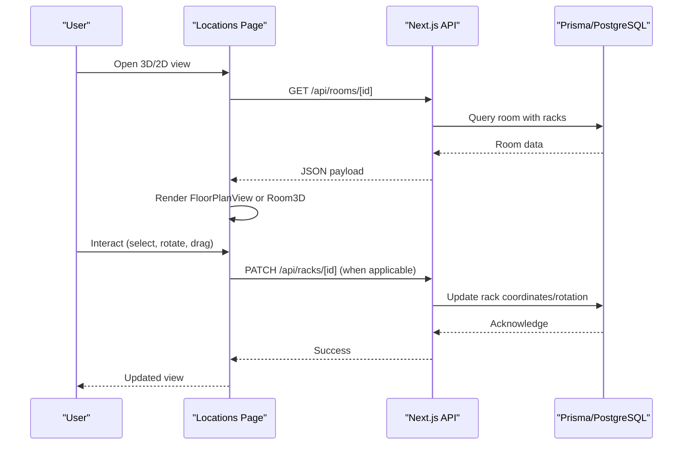
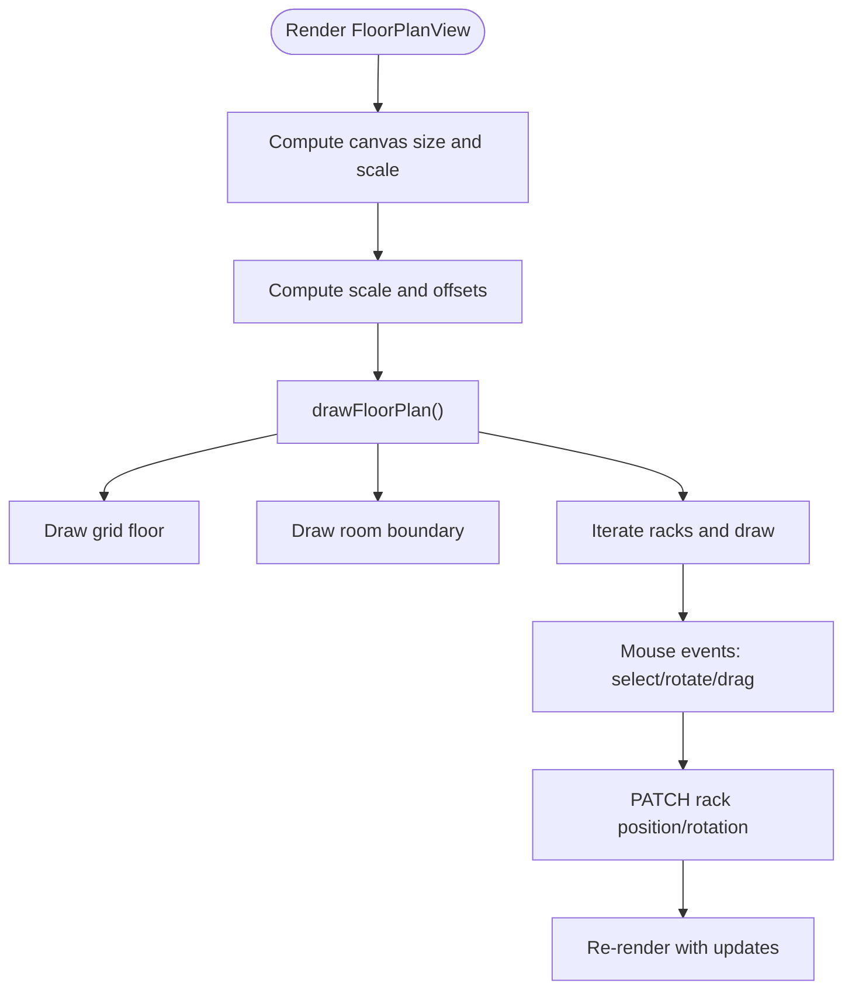
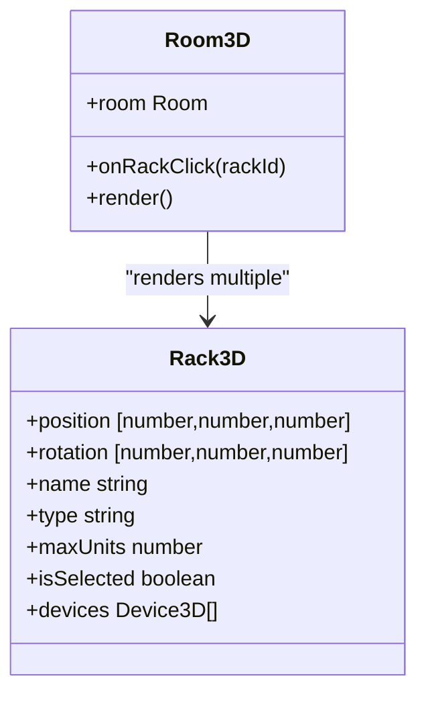
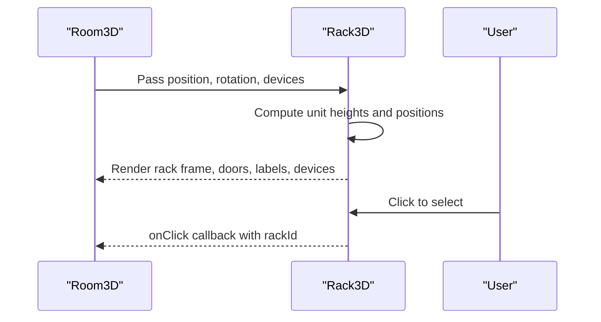
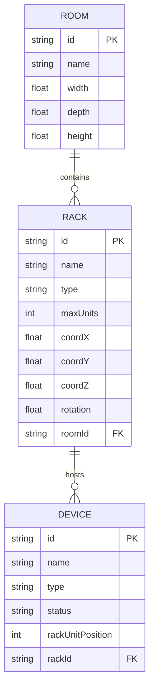
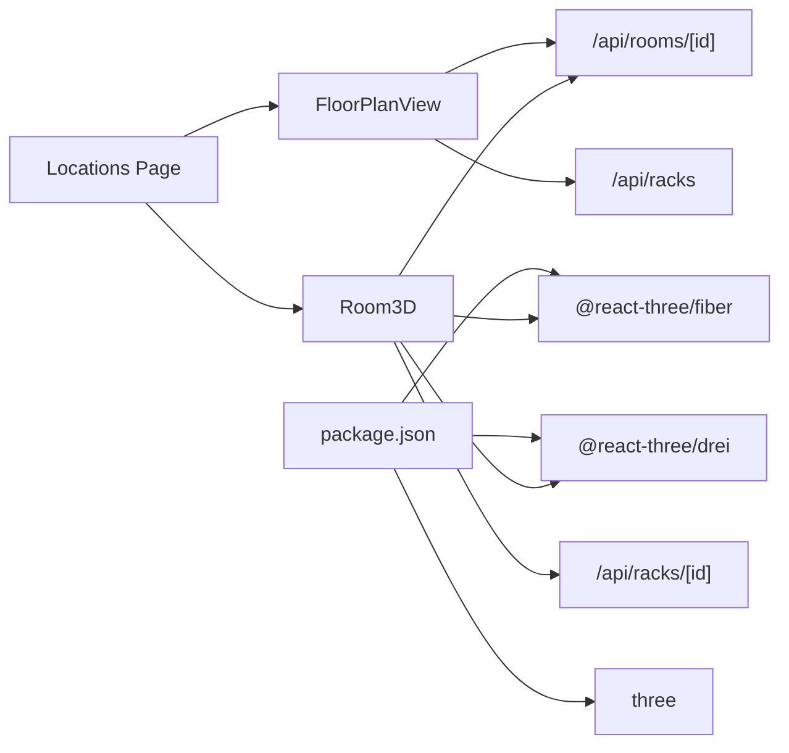

# 3D Visualization Components

<cite>
**Referenced Files in This Document**
- [package.json](file://package.json)
- [components/3d/FloorPlanView.tsx](file://components/3d/FloorPlanView.tsx)
- [components/3d/Room3D.tsx](file://components/3d/Room3D.tsx)
- [components/3d/Rack3D.tsx](file://components/3d/Rack3D.tsx)
- [app/locations/page.tsx](file://app/locations/page.tsx)
- [app/api/racks/[id]/route.ts](file://app/api/racks/[id]/route.ts)
- [app/api/racks/route.ts](file://app/api/racks/route.ts)
- [app/api/rooms/[id]/route.ts](file://app/api/rooms/[id]/route.ts)
- [lib/api.ts](file://lib/api.ts)
- [prisma/schema.prisma](file://prisma/schema.prisma)
</cite>

## Table of Contents
1. [Introduction](#introduction)
2. [Project Structure](#project-structure)
3. [Core Components](#core-components)
4. [Architecture Overview](#architecture-overview)
5. [Detailed Component Analysis](#detailed-component-analysis)
6. [Dependency Analysis](#dependency-analysis)
7. [Performance Considerations](#performance-considerations)
8. [Troubleshooting Guide](#troubleshooting-guide)
9. [Conclusion](#conclusion)
10. [Appendices](#appendices)

## Introduction
This document explains the InfraScope 3D visualization stack with a focus on Three.js integration and interactive 3D modeling. It covers the 3D scene setup, camera controls, rendering pipeline, rack modeling, equipment placement, room and floor plan visualization, coordinate systems and scaling, interactive controls (zoom, pan, rotate, selection), data binding between 3D models and backend entities, performance optimization, memory management, browser compatibility, and guidelines for extending the system with new equipment types and visualization modes.

## Project Structure
InfraScope integrates React Three Fiber (@react-three/fiber) and Drei (@react-three/drei) for declarative 3D scenes, while also providing a 2D floor plan canvas-based view. The frontend pages orchestrate 3D and 2D views, and Next.js API routes provide typed data binding to the Prisma-backed PostgreSQL database.

**Diagram sources**
- [app/locations/page.tsx:10-18](file://app/locations/page.tsx#L10-L18)
- [components/3d/Room3D.tsx:4-9](file://components/3d/Room3D.tsx#L4-L9)
- [components/3d/FloorPlanView.tsx:71-768](file://components/3d/FloorPlanView.tsx#L71-L768)
- [components/3d/Rack3D.tsx:25-160](file://components/3d/Rack3D.tsx#L25-L160)
- [app/api/racks/[id]/route.ts:18-115](file://app/api/racks/[id]/route.ts#L18-L115)
- [app/api/racks/route.ts:9-67](file://app/api/racks/route.ts#L9-L67)
- [app/api/rooms/[id]/route.ts:14-89](file://app/api/rooms/[id]/route.ts#L14-L89)
- [prisma/schema.prisma:94-133](file://prisma/schema.prisma#L94-L133)

**Section sources**
- [package.json:16-56](file://package.json#L16-L56)
- [app/locations/page.tsx:10-18](file://app/locations/page.tsx#L10-L18)
- [components/3d/Room3D.tsx:4-9](file://components/3d/Room3D.tsx#L4-L9)
- [components/3d/FloorPlanView.tsx:71-768](file://components/3d/FloorPlanView.tsx#L71-L768)
- [components/3d/Rack3D.tsx:25-160](file://components/3d/Rack3D.tsx#L25-L160)
- [app/api/racks/[id]/route.ts:18-115](file://app/api/racks/[id]/route.ts#L18-L115)
- [app/api/racks/route.ts:9-67](file://app/api/racks/route.ts#L9-L67)
- [app/api/rooms/[id]/route.ts:14-89](file://app/api/rooms/[id]/route.ts#L14-L89)
- [prisma/schema.prisma:94-133](file://prisma/schema.prisma#L94-L133)

## Core Components
- FloorPlanView: 2D SVG/canvas-based floor plan with rack placement, selection, rotation, and editing. Handles device lists per rack via API.
- Room3D: Full 3D scene with camera, lighting, room geometry, grid, and interactive rack instances.
- Rack3D: Reusable 3D rack component with materials, labels, internal devices, and selection indicators.

Key runtime dependencies:
- @react-three/fiber: declarative React renderer for Three.js
- @react-three/drei: helpers for camera, controls, lights, grid, text, etc.
- three: core 3D engine

**Section sources**
- [components/3d/FloorPlanView.tsx:71-768](file://components/3d/FloorPlanView.tsx#L71-L768)
- [components/3d/Room3D.tsx:46-222](file://components/3d/Room3D.tsx#L46-L222)
- [components/3d/Rack3D.tsx:25-160](file://components/3d/Rack3D.tsx#L25-L160)
- [package.json:27-54](file://package.json#L27-L54)

## Architecture Overview
The system combines a 2D floor plan and a 3D room view. Both views consume the same backend data via Next.js API routes. The 3D view uses React Three Fiber with Drei for camera controls, lighting, and helpers. The 2D view uses HTML5 Canvas for efficient rendering of a grid-based floor plan with rack visuals and interactivity.

**Diagram sources**
- [app/locations/page.tsx:189-204](file://app/locations/page.tsx#L189-L204)
- [app/api/rooms/[id]/route.ts:14-89](file://app/api/rooms/[id]/route.ts#L14-L89)
- [app/api/racks/[id]/route.ts:120-347](file://app/api/racks/[id]/route.ts#L120-L347)
- [prisma/schema.prisma:94-133](file://prisma/schema.prisma#L94-L133)

## Detailed Component Analysis

### FloorPlanView: 2D Floor Plan Canvas
- Scene setup: responsive canvas sizing, dynamic scale and offsets to fit room dimensions with padding.
- Coordinate system: meters-based world coordinates mapped to pixels via scale; offset centers the room.
- Equipment placement: computes grid positions for racks without explicit coordinates; supports manual dragging and saving.
- Interactive features:
  - Zoom via mouse wheel with non-passive listener.
  - Pan by dragging the background.
  - Select racks by clicking; hover highlights.
  - Rotate selected rack in-place with discrete angles.
- Data binding: fetches rack devices on selection; saves rack position/rotation via PATCH to backend.
- Visuals: grid floor pattern, room boundary with glow, 3D isometric-style rack boxes with slot indicators and labels.

**Diagram sources**
- [components/3d/FloorPlanView.tsx:102-123](file://components/3d/FloorPlanView.tsx#L102-L123)
- [components/3d/FloorPlanView.tsx:159-332](file://components/3d/FloorPlanView.tsx#L159-L332)
- [components/3d/FloorPlanView.tsx:338-481](file://components/3d/FloorPlanView.tsx#L338-L481)

**Section sources**
- [components/3d/FloorPlanView.tsx:71-768](file://components/3d/FloorPlanView.tsx#L71-L768)
- [app/api/racks/[id]/route.ts:120-347](file://app/api/racks/[id]/route.ts#L120-L347)

### Room3D: 3D Scene with Camera and Lighting
- Scene setup:
  - Canvas with shadows enabled.
  - Perspective camera positioned for a good overview of the room.
  - OrbitControls with damping and polar angle limits for ergonomic navigation.
  - Lighting: ambient, hemisphere, point, and directional lights with shadow maps.
  - Room geometry: floor plane and walls; grid helper aligned with room size.
- Rack auto-layout: centers a 2-column grid with spacing; calculates positions from either stored coordinates or computed grid.
- Data binding: loads room with racks and devices; passes device arrays to Rack3D instances.

**Diagram sources**
- [components/3d/Room3D.tsx:46-222](file://components/3d/Room3D.tsx#L46-L222)
- [components/3d/Rack3D.tsx:25-160](file://components/3d/Rack3D.tsx#L25-L160)

**Section sources**
- [components/3d/Room3D.tsx:88-206](file://components/3d/Room3D.tsx#L88-L206)
- [components/3d/Rack3D.tsx:25-160](file://components/3d/Rack3D.tsx#L25-L160)

### Rack3D: 3D Rack Model and Devices
- Dimensions: standard 1U height; rack width/depth derived from constants; inner dimensions for devices.
- Materials: meshStandardMaterial with metallic/roughness; wireframe edges; transparent front door.
- Labels: text nodes for rack name and unit count; device labels and status LEDs.
- Selection indicator: a small blue panel below the rack when selected.
- Device rendering: iterates devices with U-height metadata; places meshes accordingly.

**Diagram sources**
- [components/3d/Rack3D.tsx:25-160](file://components/3d/Rack3D.tsx#L25-L160)
- [components/3d/Room3D.tsx:156-169](file://components/3d/Room3D.tsx#L156-L169)

**Section sources**
- [components/3d/Rack3D.tsx:25-160](file://components/3d/Rack3D.tsx#L25-L160)

### Data Binding Between 3D Models and Backend Entities
- Room retrieval: GET /api/rooms/[id] returns room with included racks and devices.
- Rack retrieval: GET /api/racks/[id] and GET /api/racks for listing; PATCH updates coordinates and rotation.
- API utilities: centralized axios wrapper with consistent error handling.
- Prisma schema: Room, Rack, Device entities define relationships and optional 3D coordinates.

**Diagram sources**
- [prisma/schema.prisma:94-133](file://prisma/schema.prisma#L94-L133)
- [app/api/rooms/[id]/route.ts:33-56](file://app/api/rooms/[id]/route.ts#L33-L56)
- [app/api/racks/[id]/route.ts:37-82](file://app/api/racks/[id]/route.ts#L37-L82)

**Section sources**
- [app/locations/page.tsx:189-204](file://app/locations/page.tsx#L189-L204)
- [app/api/rooms/[id]/route.ts:14-89](file://app/api/rooms/[id]/route.ts#L14-L89)
- [app/api/racks/[id]/route.ts:18-115](file://app/api/racks/[id]/route.ts#L18-L115)
- [app/api/racks/route.ts:9-67](file://app/api/racks/route.ts#L9-L67)
- [lib/api.ts:10-56](file://lib/api.ts#L10-L56)
- [prisma/schema.prisma:94-133](file://prisma/schema.prisma#L94-L133)

## Dependency Analysis
- Runtime dependencies:
  - @react-three/fiber and @react-three/drei provide the 3D framework.
  - three is the core engine.
- Frontend orchestration:
  - Locations page dynamically imports 3D components to avoid SSR issues.
  - Uses a simple error boundary around 3D content.
- Backend:
  - Next.js API routes encapsulate Prisma queries and validations.
  - Caching applied to rack listing to reduce DB load.

**Diagram sources**
- [package.json:27-54](file://package.json#L27-L54)
- [app/locations/page.tsx:10-18](file://app/locations/page.tsx#L10-L18)
- [components/3d/Room3D.tsx:4-9](file://components/3d/Room3D.tsx#L4-L9)
- [app/api/rooms/[id]/route.ts:14-89](file://app/api/rooms/[id]/route.ts#L14-L89)
- [app/api/racks/route.ts:9-67](file://app/api/racks/route.ts#L9-L67)
- [app/api/racks/[id]/route.ts:120-347](file://app/api/racks/[id]/route.ts#L120-L347)

**Section sources**
- [package.json:27-54](file://package.json#L27-L54)
- [app/locations/page.tsx:10-18](file://app/locations/page.tsx#L10-L18)
- [components/3d/Room3D.tsx:4-9](file://components/3d/Room3D.tsx#L4-L9)
- [app/api/rooms/[id]/route.ts:14-89](file://app/api/rooms/[id]/route.ts#L14-L89)
- [app/api/racks/route.ts:9-67](file://app/api/racks/route.ts#L9-L67)
- [app/api/racks/[id]/route.ts:120-347](file://app/api/racks/[id]/route.ts#L120-L347)

## Performance Considerations
- 2D canvas rendering:
  - Efficient for large numbers of simple shapes; avoid excessive reflows by batching drawing operations.
  - Use requestAnimationFrame indirectly via useEffect dependencies to minimize redraws.
- 3D rendering:
  - Shadow maps and multiple lights increase GPU load; keep light count reasonable.
  - Use damping on orbit controls to reduce unnecessary renders.
  - Prefer instanced-like reuse of materials and geometries where possible.
- Data fetching:
  - API caching for rack listings reduces DB pressure.
  - Lazy-load 3D components to improve initial page load.
- Memory management:
  - Dispose of textures and geometries when unmounting (handled by React Three Fiber lifecycle).
  - Avoid creating new objects inside tight loops; reuse arrays/maps for rack positions.
- Browser compatibility:
  - Ensure WebGL support; provide fallback UI for unsupported environments.
  - Test across browsers for pointer events and wheel handling consistency.

[No sources needed since this section provides general guidance]

## Troubleshooting Guide
- 3D render errors:
  - Room3D catches global errors and displays a friendly message with the error text.
  - Locations page wraps 3D views in an error boundary to prevent app crashes.
- API failures:
  - API utilities wrap requests and return structured error payloads; frontend toast notifications surface issues.
- Canvas interactions:
  - Mouse wheel zoom uses a non-passive listener to prevent browser defaults; ensure no conflicting listeners.
  - Dragging and selection rely on computed positions; verify scale and offsets are recalculated on resize.

**Section sources**
- [components/3d/Room3D.tsx:60-67](file://components/3d/Room3D.tsx#L60-L67)
- [app/locations/page.tsx:26-53](file://app/locations/page.tsx#L26-L53)
- [lib/api.ts:10-56](file://lib/api.ts#L10-L56)
- [components/3d/FloorPlanView.tsx:466-481](file://components/3d/FloorPlanView.tsx#L466-L481)

## Conclusion
InfraScope’s 3D visualization combines a performant 2D canvas floor plan with a rich 3D environment powered by React Three Fiber and Drei. The system cleanly separates concerns between UI orchestration, 3D rendering, and backend data services. With robust data binding, interactive controls, and practical performance strategies, it offers a scalable foundation for equipment modeling, spatial planning, and real-time collaboration.

[No sources needed since this section summarizes without analyzing specific files]

## Appendices

### Interactive Controls Reference
- 2D FloorPlanView:
  - Zoom: mouse wheel
  - Pan: drag background
  - Select: click rack
  - Rotate: buttons or drag-and-drop
  - Save: automatic on drop/rotate
- 3D Room3D:
  - Rotate: left-click drag
  - Pan: right-click drag
  - Zoom: scroll
  - Select: click rack

**Section sources**
- [components/3d/FloorPlanView.tsx:519-554](file://components/3d/FloorPlanView.tsx#L519-L554)
- [components/3d/Room3D.tsx:208-218](file://components/3d/Room3D.tsx#L208-L218)

### Extending with New Equipment Types and Visualization Modes
- Add new device types:
  - Extend Prisma Device type enum and backend validation.
  - Update Rack3D device rendering logic to handle new types (colors, labels, icons).
- New visualization modes:
  - Add a new tab or toggle in the Locations page to switch between 2D and 3D views.
  - Implement a new component similar to FloorPlanView or Room3D with custom geometry and materials.
- Coordinate systems and scaling:
  - Maintain meters-based units; convert to pixels or world units consistently across components.
  - Ensure auto-layout algorithms (grid computation) remain flexible for new equipment sizes.

**Section sources**
- [prisma/schema.prisma:437-471](file://prisma/schema.prisma#L437-L471)
- [components/3d/Rack3D.tsx:96-136](file://components/3d/Rack3D.tsx#L96-L136)
- [app/locations/page.tsx:815-820](file://app/locations/page.tsx#L815-L820)