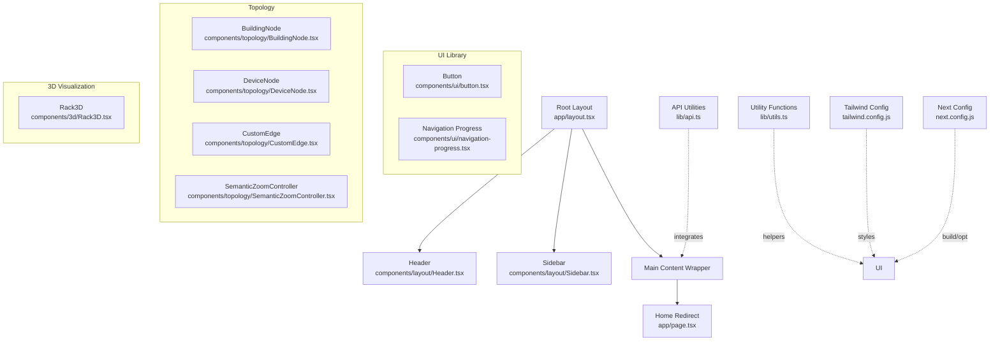
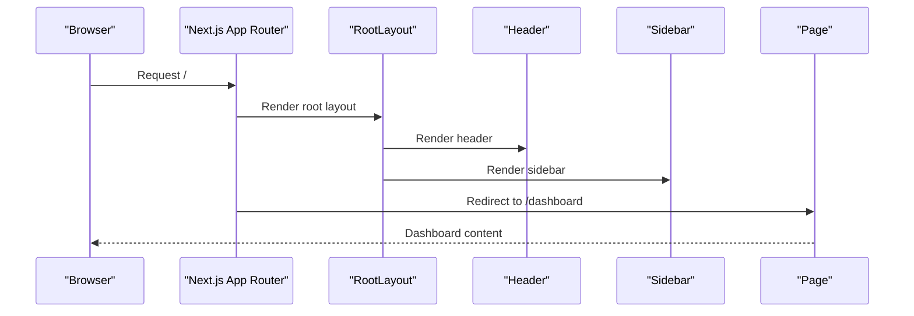
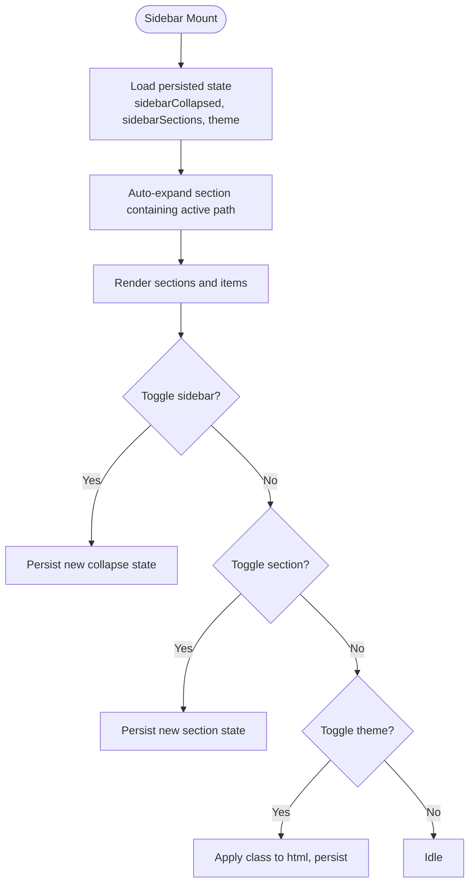
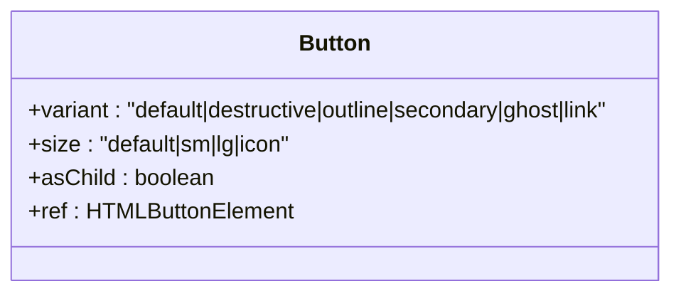
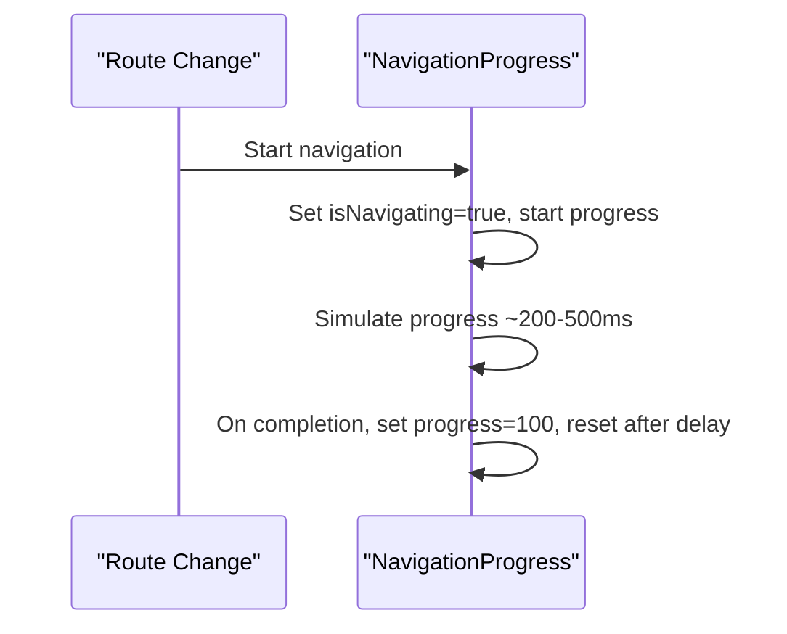
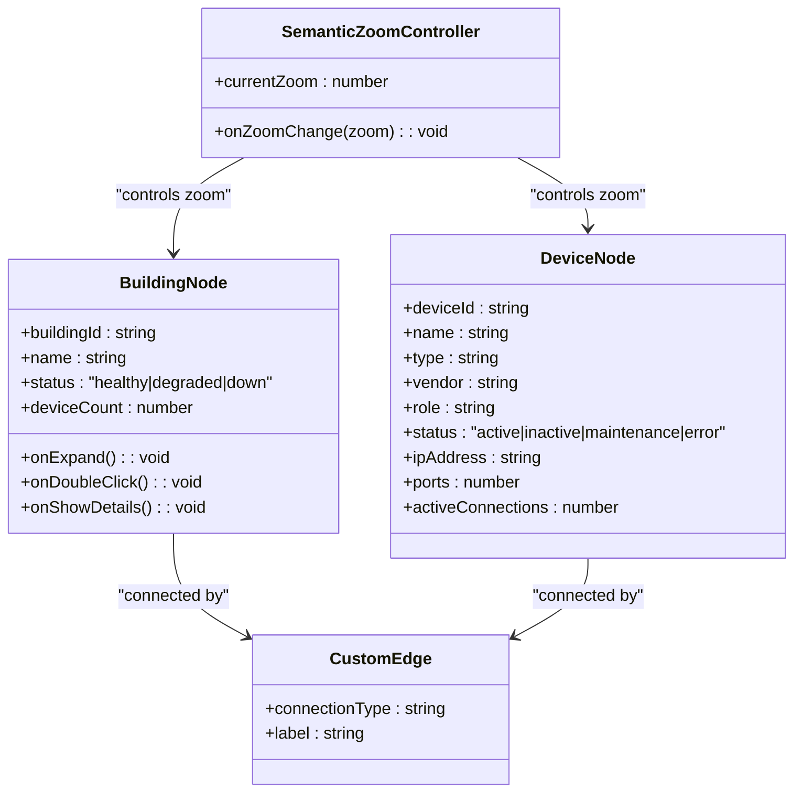
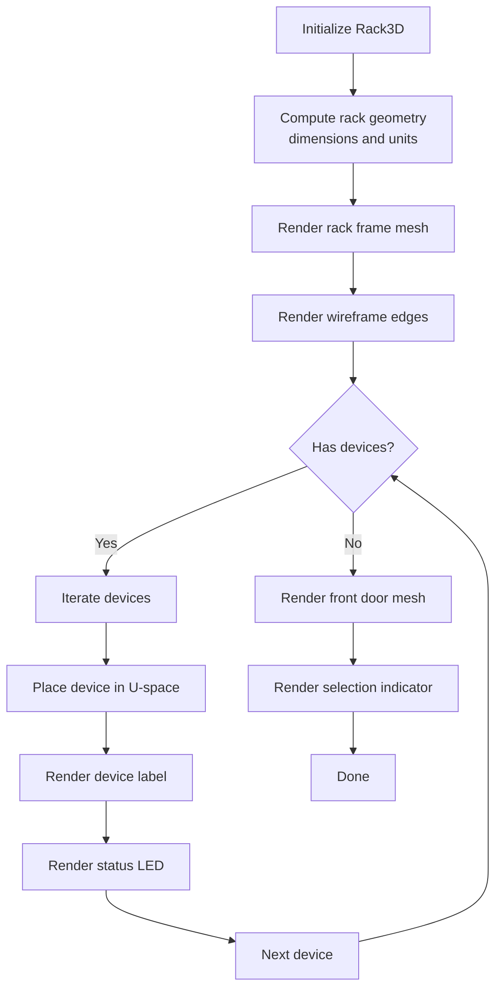
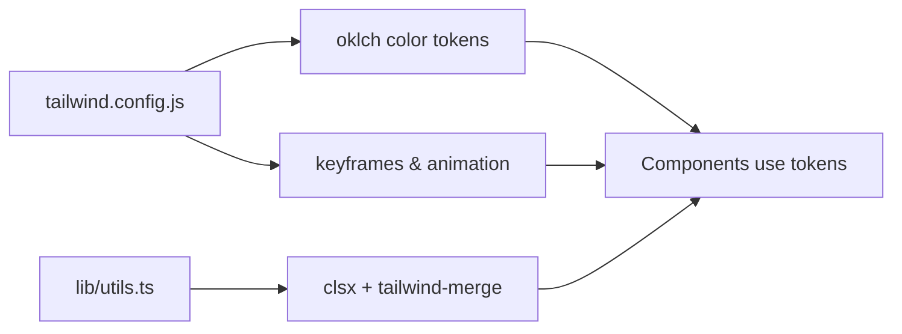
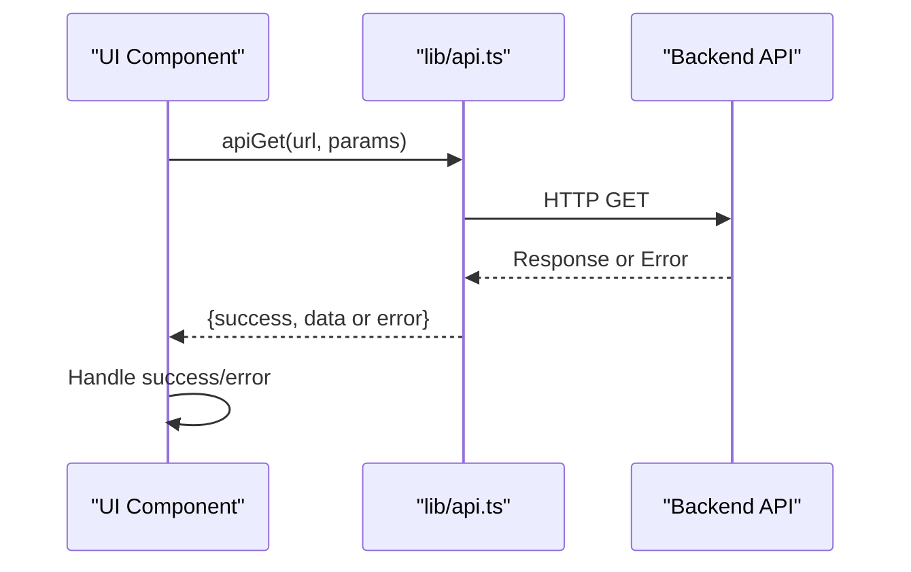
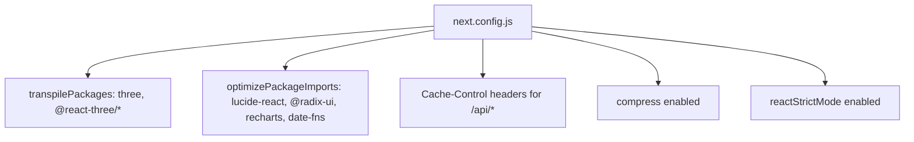

# Frontend Application

<cite>
**Referenced Files in This Document**
- [app/layout.tsx](file://app/layout.tsx)
- [app/page.tsx](file://app/page.tsx)
- [components/layout/Header.tsx](file://components/layout/Header.tsx)
- [components/layout/Sidebar.tsx](file://components/layout/Sidebar.tsx)
- [components/ui/button.tsx](file://components/ui/button.tsx)
- [components/ui/navigation-progress.tsx](file://components/ui/navigation-progress.tsx)
- [components/topology/BuildingNode.tsx](file://components/topology/BuildingNode.tsx)
- [components/topology/CustomEdge.tsx](file://components/topology/CustomEdge.tsx)
- [components/topology/DeviceNode.tsx](file://components/topology/DeviceNode.tsx)
- [components/topology/SemanticZoomController.tsx](file://components/topology/SemanticZoomController.tsx)
- [components/3d/Rack3D.tsx](file://components/3d/Rack3D.tsx)
- [lib/api.ts](file://lib/api.ts)
- [lib/utils.ts](file://lib/utils.ts)
- [tailwind.config.js](file://tailwind.config.js)
- [next.config.js](file://next.config.js)
</cite>

## Table of Contents
1. [Introduction](#introduction)
2. [Project Structure](#project-structure)
3. [Core Components](#core-components)
4. [Architecture Overview](#architecture-overview)
5. [Detailed Component Analysis](#detailed-component-analysis)
6. [Dependency Analysis](#dependency-analysis)
7. [Performance Considerations](#performance-considerations)
8. [Troubleshooting Guide](#troubleshooting-guide)
9. [Conclusion](#conclusion)

## Introduction
This document describes the InfraScope frontend built with Next.js 14 App Router and React. It explains the application layout, navigation, page organization, reusable UI components, and specialized components for 3D visualization and topology display. It also covers styling via Tailwind CSS, state management patterns, backend API integration, responsive design, accessibility, performance optimization, and common UI interaction flows.

## Project Structure
The frontend follows Next.js App Router conventions with a root layout, global styles, and modular pages organized by domain. Global navigation is composed of a header and a collapsible sidebar. Reusable UI primitives live under a dedicated component library, while specialized components implement 3D rack visualization and interactive topology rendering.

**Diagram sources**
- [app/layout.tsx:1-57](file://app/layout.tsx#L1-L57)
- [app/page.tsx:1-15](file://app/page.tsx#L1-L15)
- [components/layout/Header.tsx:1-80](file://components/layout/Header.tsx#L1-L80)
- [components/layout/Sidebar.tsx:1-409](file://components/layout/Sidebar.tsx#L1-L409)
- [components/ui/button.tsx:1-57](file://components/ui/button.tsx#L1-L57)
- [components/ui/navigation-progress.tsx:1-39](file://components/ui/navigation-progress.tsx#L1-L39)
- [components/topology/BuildingNode.tsx:1-176](file://components/topology/BuildingNode.tsx#L1-L176)
- [components/topology/DeviceNode.tsx:1-112](file://components/topology/DeviceNode.tsx#L1-L112)
- [components/topology/CustomEdge.tsx:1-156](file://components/topology/CustomEdge.tsx#L1-L156)
- [components/topology/SemanticZoomController.tsx:1-49](file://components/topology/SemanticZoomController.tsx#L1-L49)
- [components/3d/Rack3D.tsx:1-160](file://components/3d/Rack3D.tsx#L1-L160)
- [lib/api.ts:1-57](file://lib/api.ts#L1-L57)
- [lib/utils.ts:1-7](file://lib/utils.ts#L1-L7)
- [tailwind.config.js:1-93](file://tailwind.config.js#L1-L93)
- [next.config.js:1-62](file://next.config.js#L1-L62)

**Section sources**
- [app/layout.tsx:1-57](file://app/layout.tsx#L1-L57)
- [app/page.tsx:1-15](file://app/page.tsx#L1-L15)
- [next.config.js:1-62](file://next.config.js#L1-L62)

## Core Components
- Root layout initializes global metadata, fonts, theme hydration, progress indicator, and renders the sidebar and main content area.
- Home page redirects to the dashboard on client load.
- Header provides top-level navigation links and user info.
- Sidebar is a collapsible navigation drawer with persistent state, theme toggle, and nested sections.
- UI primitives include a versatile Button component with variant and size variants and a navigation progress indicator.
- API utilities encapsulate HTTP requests with unified error handling.
- Utility functions provide cross-cutting helpers like class merging.

Key responsibilities:
- Layout: centralizes global navigation and content area.
- Navigation: maintains active states and persistence across sessions.
- UX: smooth transitions, progress feedback, and theme switching.
- API: consistent request/response handling and error reporting.

**Section sources**
- [app/layout.tsx:1-57](file://app/layout.tsx#L1-L57)
- [app/page.tsx:1-15](file://app/page.tsx#L1-L15)
- [components/layout/Header.tsx:1-80](file://components/layout/Header.tsx#L1-L80)
- [components/layout/Sidebar.tsx:1-409](file://components/layout/Sidebar.tsx#L1-L409)
- [components/ui/button.tsx:1-57](file://components/ui/button.tsx#L1-L57)
- [components/ui/navigation-progress.tsx:1-39](file://components/ui/navigation-progress.tsx#L1-L39)
- [lib/api.ts:1-57](file://lib/api.ts#L1-L57)
- [lib/utils.ts:1-7](file://lib/utils.ts#L1-L7)

## Architecture Overview
The application uses Next.js App Router with a single root layout and per-route pages. Navigation is handled client-side with automatic hydration of theme preferences. The UI layer leverages a custom component library and Tailwind CSS for styling. Specialized domains (topology, 3D) use external libraries integrated via React components.

**Diagram sources**
- [app/layout.tsx:1-57](file://app/layout.tsx#L1-L57)
- [app/page.tsx:1-15](file://app/page.tsx#L1-L15)
- [components/layout/Header.tsx:1-80](file://components/layout/Header.tsx#L1-L80)
- [components/layout/Sidebar.tsx:1-409](file://components/layout/Sidebar.tsx#L1-L409)

## Detailed Component Analysis

### Layout and Navigation
- Root layout sets metadata, font, theme hydration script, progress indicator, and renders the sidebar and main content area.
- Header displays brand identity, top-level navigation items, and user profile controls. Active states reflect the current path.
- Sidebar implements a collapsible navigation drawer with:
  - Persistent collapse state and expanded sections stored in local storage.
  - Theme toggle that updates the document element class and persists preference.
  - Nested items and children support with parent activation highlighting.
  - Accessibility-friendly keyboard and screen reader attributes.

**Diagram sources**
- [components/layout/Sidebar.tsx:63-123](file://components/layout/Sidebar.tsx#L63-L123)
- [components/layout/Sidebar.tsx:125-213](file://components/layout/Sidebar.tsx#L125-L213)

**Section sources**
- [app/layout.tsx:1-57](file://app/layout.tsx#L1-L57)
- [components/layout/Header.tsx:1-80](file://components/layout/Header.tsx#L1-L80)
- [components/layout/Sidebar.tsx:1-409](file://components/layout/Sidebar.tsx#L1-L409)

### UI Primitive: Button
- Provides consistent styling and behavior across the application using variant and size tokens.
- Supports compound variants and slot composition for flexible rendering.

**Diagram sources**
- [components/ui/button.tsx:36-57](file://components/ui/button.tsx#L36-L57)

**Section sources**
- [components/ui/button.tsx:1-57](file://components/ui/button.tsx#L1-L57)

### Navigation Progress Indicator
- Displays a top-of-the-page progress bar during navigation and a subtle loading overlay with a spinner.
- Uses path tracking to simulate progress and reset after navigation completes.

**Diagram sources**
- [components/ui/navigation-progress.tsx:8-39](file://components/ui/navigation-progress.tsx#L8-L39)

**Section sources**
- [components/ui/navigation-progress.tsx:1-39](file://components/ui/navigation-progress.tsx#L1-L39)

### Topology Components
- BuildingNode: A scalable, interactive node representing a building with status indicators, handles for connections, and optional detail actions. Handles scaling and hover effects.
- DeviceNode: A detailed node for devices with role icons, vendor logos, status indicators, and metrics. Dynamically scales with zoom level.
- CustomEdge: Renders edges between nodes with connection-type-specific styles and labels. Includes a compact variant for building connections.
- SemanticZoomController: Controls viewport zoom using React Flow hooks with smooth transitions and callback propagation.

**Diagram sources**
- [components/topology/BuildingNode.tsx:7-22](file://components/topology/BuildingNode.tsx#L7-L22)
- [components/topology/DeviceNode.tsx:7-20](file://components/topology/DeviceNode.tsx#L7-L20)
- [components/topology/CustomEdge.tsx:6-69](file://components/topology/CustomEdge.tsx#L6-L69)
- [components/topology/SemanticZoomController.tsx:6-13](file://components/topology/SemanticZoomController.tsx#L6-L13)

**Section sources**
- [components/topology/BuildingNode.tsx:1-176](file://components/topology/BuildingNode.tsx#L1-L176)
- [components/topology/DeviceNode.tsx:1-112](file://components/topology/DeviceNode.tsx#L1-L112)
- [components/topology/CustomEdge.tsx:1-156](file://components/topology/CustomEdge.tsx#L1-L156)
- [components/topology/SemanticZoomController.tsx:1-49](file://components/topology/SemanticZoomController.tsx#L1-L49)

### 3D Visualization Component
- Rack3D: A Three.js-based component rendering a rack with devices, labels, wireframe edges, and selection indicators. Supports device metadata-driven rendering and hover/selection visuals.

**Diagram sources**
- [components/3d/Rack3D.tsx:25-159](file://components/3d/Rack3D.tsx#L25-L159)

**Section sources**
- [components/3d/Rack3D.tsx:1-160](file://components/3d/Rack3D.tsx#L1-L160)

### Styling Approach and Theme
- Tailwind CSS is configured with oklch-based color tokens, container sizing, spacing, border radius, and animations. Dark mode is controlled via a class applied to the root element.
- Utility functions merge and conditionally apply Tailwind classes safely.

**Diagram sources**
- [tailwind.config.js:17-89](file://tailwind.config.js#L17-L89)
- [lib/utils.ts:1-7](file://lib/utils.ts#L1-L7)

**Section sources**
- [tailwind.config.js:1-93](file://tailwind.config.js#L1-L93)
- [lib/utils.ts:1-7](file://lib/utils.ts#L1-L7)

### State Management Patterns and Backend Integration
- Local persistence: Sidebar collapse state, expanded sections, and theme preference are stored in local storage and restored on mount.
- Navigation progress: Tracks navigation lifecycle to provide user feedback.
- API utilities: Centralized HTTP client with unified error handling for GET, POST, PUT, DELETE operations.

**Diagram sources**
- [lib/api.ts:10-20](file://lib/api.ts#L10-L20)

**Section sources**
- [components/layout/Sidebar.tsx:63-123](file://components/layout/Sidebar.tsx#L63-L123)
- [components/ui/navigation-progress.tsx:8-39](file://components/ui/navigation-progress.tsx#L8-L39)
- [lib/api.ts:1-57](file://lib/api.ts#L1-L57)

## Dependency Analysis
- Build-time dependencies: Next.js App Router, React, Tailwind CSS, Radix UI slots, class variance authority, and optional packages for 3D and charts.
- Runtime dependencies: Axios for HTTP, Lucide icons, React Flow for topology, React Three Fiber/Drei for 3D.
- Configuration: Next.js configuration enables standalone output, SWC minification, console removal in production, transpilation of 3D packages, optimized package imports, and aggressive caching headers.

**Diagram sources**
- [next.config.js:12-58](file://next.config.js#L12-L58)

**Section sources**
- [next.config.js:1-62](file://next.config.js#L1-L62)

## Performance Considerations
- Bundle size and imports:
  - Transpile 3D-related packages to avoid SSR issues and improve compatibility.
  - Optimize imports for commonly used libraries to reduce bundle size.
- Runtime performance:
  - Memoized topology nodes prevent unnecessary re-renders.
  - Semantic zoom controller applies smooth transitions and throttles updates.
  - Navigation progress simulates perceived performance during navigation.
- Caching:
  - Static image caching with immutable TTL.
  - API endpoints configured with short-lived cache windows and stale-while-revalidate strategies.
- Build optimizations:
  - SWC minification and compression enabled.
  - Console logs removed in production builds.

**Section sources**
- [next.config.js:12-58](file://next.config.js#L12-L58)
- [components/topology/BuildingNode.tsx:24-176](file://components/topology/BuildingNode.tsx#L24-L176)
- [components/topology/DeviceNode.tsx:22-112](file://components/topology/DeviceNode.tsx#L22-L112)
- [components/topology/SemanticZoomController.tsx:11-49](file://components/topology/SemanticZoomController.tsx#L11-L49)
- [components/ui/navigation-progress.tsx:8-39](file://components/ui/navigation-progress.tsx#L8-L39)

## Troubleshooting Guide
- Hydration mismatch:
  - Theme hydration runs in a head script to align server-rendered HTML with client state. If mismatches occur, verify the script executes before hydration and that no conflicting styles override the class.
- Navigation progress not resetting:
  - Ensure the progress indicator is rendered in the root layout and that pathname changes trigger the internal state updates.
- Sidebar state not persisting:
  - Confirm local storage is available and accessible. Verify that collapse and section states are written and read on mount.
- API errors:
  - The API utilities return a standardized shape with success flag and error message. Inspect returned error payload to diagnose failures.

**Section sources**
- [app/layout.tsx:27-41](file://app/layout.tsx#L27-L41)
- [components/ui/navigation-progress.tsx:8-39](file://components/ui/navigation-progress.tsx#L8-L39)
- [components/layout/Sidebar.tsx:63-123](file://components/layout/Sidebar.tsx#L63-L123)
- [lib/api.ts:10-56](file://lib/api.ts#L10-L56)

## Conclusion
The InfraScope frontend leverages Next.js 14 App Router to deliver a structured, accessible, and performant user interface. The root layout coordinates global navigation and content areas, while reusable UI components and a custom component library ensure consistency. Specialized components for topology and 3D visualization provide rich, interactive experiences. Tailwind CSS and a cohesive configuration enable rapid iteration and maintainable styling. With thoughtful state management, caching strategies, and build optimizations, the application balances responsiveness, scalability, and developer productivity.