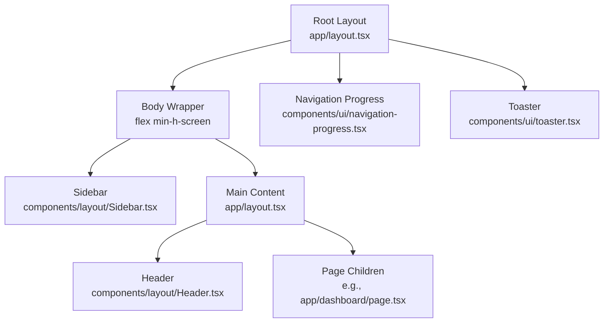
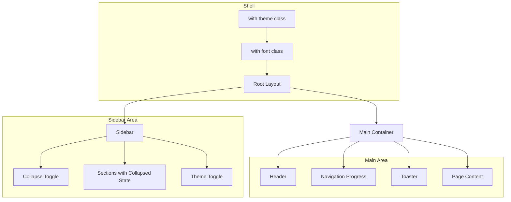
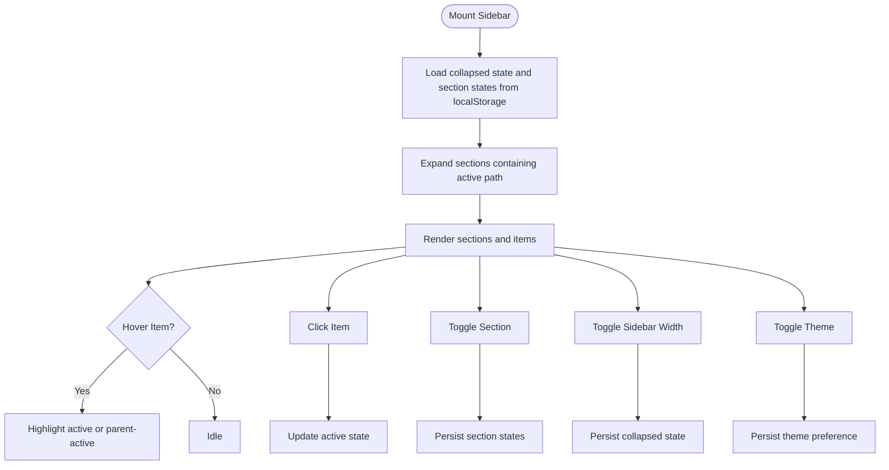
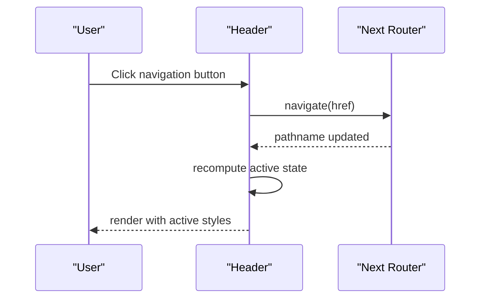
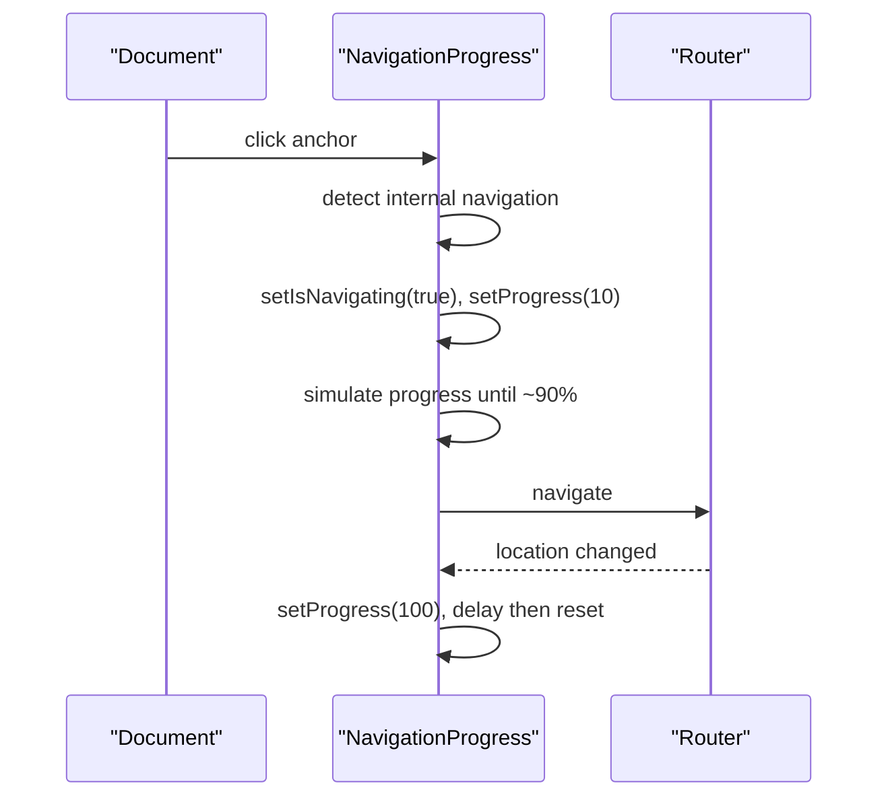
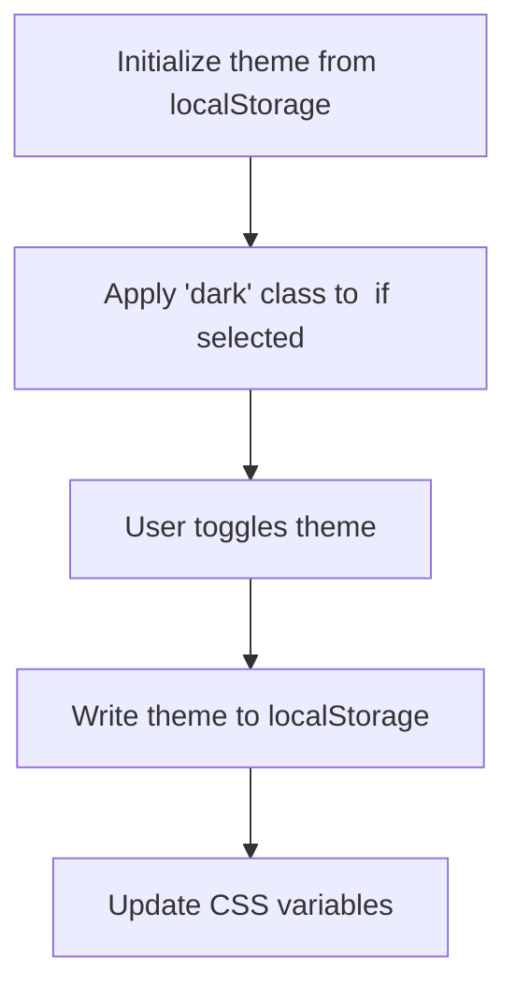
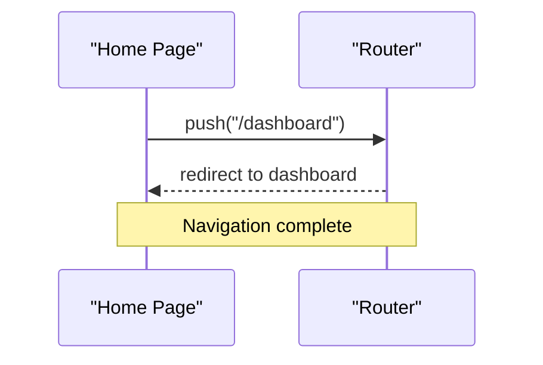
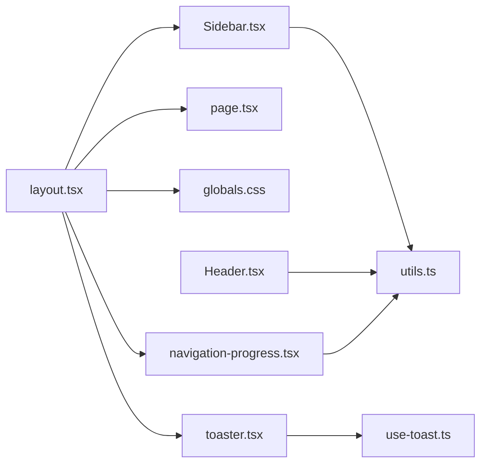

# Layout and Navigation

<cite>
**Referenced Files in This Document**
- [layout.tsx](file://app/layout.tsx)
- [Header.tsx](file://components/layout/Header.tsx)
- [Sidebar.tsx](file://components/layout/Sidebar.tsx)
- [navigation-progress.tsx](file://components/ui/navigation-progress.tsx)
- [toaster.tsx](file://components/ui/toaster.tsx)
- [button.tsx](file://components/ui/button.tsx)
- [globals.css](file://app/globals.css)
- [tailwind.config.js](file://tailwind.config.js)
- [utils.ts](file://lib/utils.ts)
- [page.tsx](file://app/page.tsx)
- [dashboard/page.tsx](file://app/dashboard/page.tsx)
- [devices/page.tsx](file://app/devices/page.tsx)
- [services/page.tsx](file://app/services/page.tsx)
- [use-toast.ts](file://components/ui/use-toast.ts)
</cite>

## Table of Contents
1. [Introduction](#introduction)
2. [Project Structure](#project-structure)
3. [Core Components](#core-components)
4. [Architecture Overview](#architecture-overview)
5. [Detailed Component Analysis](#detailed-component-analysis)
6. [Dependency Analysis](#dependency-analysis)
7. [Performance Considerations](#performance-considerations)
8. [Troubleshooting Guide](#troubleshooting-guide)
9. [Conclusion](#conclusion)
10. [Appendices](#appendices)

## Introduction
This document explains the InfraScope layout and navigation system with a focus on the global header, sidebar, and overall page structure. It covers responsive design, navigation patterns, UI hierarchy, sidebar organization, active state management, theme switching, localization, accessibility, and mobile responsiveness. It also provides practical guidance for extending navigation and customizing the layout.

## Project Structure
The layout system centers around a root layout that composes a persistent sidebar and a main content area, with a lightweight header inside the main content. Navigation progress and toast notifications are integrated globally. The design leverages Tailwind CSS with shadcn/ui components and a theming system based on CSS variables.

**Diagram sources**
- [layout.tsx:20-56](file://app/layout.tsx#L20-L56)
- [Sidebar.tsx:56-409](file://components/layout/Sidebar.tsx#L56-L409)
- [Header.tsx:18-79](file://components/layout/Header.tsx#L18-L79)
- [navigation-progress.tsx:13-87](file://components/ui/navigation-progress.tsx#L13-L87)
- [toaster.tsx:13-35](file://components/ui/toaster.tsx#L13-L35)

**Section sources**
- [layout.tsx:1-57](file://app/layout.tsx#L1-L57)
- [tailwind.config.js:1-93](file://tailwind.config.js#L1-L93)
- [globals.css:1-226](file://app/globals.css#L1-L226)

## Core Components
- Root layout sets up the HTML skeleton, theme initialization via local storage, and the flex container hosting sidebar and main content.
- Sidebar provides collapsible navigation sections, active state highlighting, theme toggle, and user info footer.
- Header contains branding, primary navigation buttons, and user controls.
- Navigation progress indicates navigation state and simulates progress for internal links.
- Toast system provides global notifications with a controlled queue.

**Section sources**
- [layout.tsx:20-56](file://app/layout.tsx#L20-L56)
- [Sidebar.tsx:56-409](file://components/layout/Sidebar.tsx#L56-L409)
- [Header.tsx:18-79](file://components/layout/Header.tsx#L18-L79)
- [navigation-progress.tsx:13-87](file://components/ui/navigation-progress.tsx#L13-L87)
- [toaster.tsx:13-35](file://components/ui/toaster.tsx#L13-L35)

## Architecture Overview
The layout architecture is a persistent sidebar with collapsible sections and a main content area that renders page-specific content. The header resides within the main content area and participates in the page’s visual hierarchy. Theming is applied via a CSS class on the root element and persisted in local storage. Navigation progress and toasts are rendered outside the main content flow to avoid layout shifts.

**Diagram sources**
- [layout.tsx:26-54](file://app/layout.tsx#L26-L54)
- [Sidebar.tsx:56-409](file://components/layout/Sidebar.tsx#L56-L409)
- [Header.tsx:18-79](file://components/layout/Header.tsx#L18-L79)
- [navigation-progress.tsx:13-87](file://components/ui/navigation-progress.tsx#L13-L87)
- [toaster.tsx:13-35](file://components/ui/toaster.tsx#L13-L35)

## Detailed Component Analysis

### Sidebar Organization and Navigation State Management
- Sections and items are defined as typed structures with optional nested children and arrows.
- Active state detection uses the current pathname against item href and parent prefixes.
- Auto-expand behavior ensures the containing section of the active page is expanded on mount.
- Collapsed state and per-section collapse state are persisted in local storage.
- Theme toggle reads and writes the theme class on the root element and persists the preference.

**Diagram sources**
- [Sidebar.tsx:56-409](file://components/layout/Sidebar.tsx#L56-L409)

**Section sources**
- [Sidebar.tsx:56-409](file://components/layout/Sidebar.tsx#L56-L409)

### Header Components and Navigation Patterns
- Branding: A compact logo and title link to the dashboard.
- Primary navigation: Buttons representing top-level sections, with active state styling.
- User controls: Avatar button and user info aligned to the right.
- Responsive behavior: On small screens, the header remains fixed and navigation buttons wrap or reduce in size.

**Diagram sources**
- [Header.tsx:18-79](file://components/layout/Header.tsx#L18-L79)

**Section sources**
- [Header.tsx:18-79](file://components/layout/Header.tsx#L18-L79)

### Navigation Progress and Loading States
- Intercepts internal link clicks and starts a simulated progress animation.
- Resets progress after navigation completes.
- Provides a subtle top bar and loading overlay for perceived performance.

**Diagram sources**
- [navigation-progress.tsx:13-87](file://components/ui/navigation-progress.tsx#L13-L87)

**Section sources**
- [navigation-progress.tsx:13-87](file://components/ui/navigation-progress.tsx#L13-L87)

### Dark/Light Theme Switching
- Theme preference is stored in local storage and applied to the root element class.
- CSS variables switch between light and dark palettes.
- Sidebar theme toggle updates the class and persists the choice.

**Diagram sources**
- [layout.tsx:26-42](file://app/layout.tsx#L26-L42)
- [Sidebar.tsx:110-123](file://components/layout/Sidebar.tsx#L110-L123)
- [globals.css:44-77](file://app/globals.css#L44-L77)

**Section sources**
- [layout.tsx:26-42](file://app/layout.tsx#L26-L42)
- [Sidebar.tsx:110-123](file://components/layout/Sidebar.tsx#L110-L123)
- [globals.css:44-77](file://app/globals.css#L44-L77)

### Localization Handling
- The root HTML declares a language attribute suitable for Turkish content.
- Date and number formatting in pages uses locale-appropriate methods.
- There is no explicit internationalization framework configured; locale is embedded in component logic.

**Section sources**
- [layout.tsx:26-26](file://app/layout.tsx#L26-L26)
- [devices/page.tsx:200-203](file://app/devices/page.tsx#L200-L203)

### Accessibility Features
- Focus management and keyboard navigation are supported by shadcn/ui primitives.
- Buttons use semantic roles and sizes appropriate for interactive elements.
- Progress indicators and toasts are non-blocking and dismissible.

**Section sources**
- [button.tsx:7-57](file://components/ui/button.tsx#L7-L57)
- [use-toast.ts:145-194](file://components/ui/use-toast.ts#L145-L194)

### Mobile Responsiveness and Cross-Device Compatibility
- Sidebar supports collapsing to an icon-only mode with a persistent toggle.
- Navigation buttons in the header adapt to smaller widths.
- Scrollbars and overlays are styled consistently across devices.
- Touch actions are handled to prevent unwanted passive scrolling in specialized contexts.

**Section sources**
- [Sidebar.tsx:216-255](file://components/layout/Sidebar.tsx#L216-L255)
- [Header.tsx:30-77](file://components/layout/Header.tsx#L30-L77)
- [globals.css:208-211](file://app/globals.css#L208-L211)

### Layout Composition, Spacing, and Visual Hierarchy
- The shell uses a flex column with sticky positioning for the sidebar and header.
- Cards, buttons, and typography leverage Tailwind utilities and CSS variables for consistent spacing and contrast.
- Active states emphasize hierarchy through color, weight, borders, and shadows.

**Section sources**
- [layout.tsx:45-51](file://app/layout.tsx#L45-L51)
- [globals.css:100-226](file://app/globals.css#L100-L226)

### Examples of Navigation Flows
- From the home page, the app redirects to the dashboard.
- Clicking a header navigation item updates the active state and navigates to the target route.
- Clicking a sidebar item expands parent sections if needed and highlights active or parent-active items.

**Diagram sources**
- [page.tsx:6-14](file://app/page.tsx#L6-L14)

**Section sources**
- [page.tsx:6-14](file://app/page.tsx#L6-L14)
- [Header.tsx:43-63](file://components/layout/Header.tsx#L43-L63)
- [Sidebar.tsx:277-357](file://components/layout/Sidebar.tsx#L277-L357)

### Breadcrumb Implementation
- The current implementation does not include explicit breadcrumbs.
- Active state management in the sidebar and header can guide users to their current location.

**Section sources**
- [Sidebar.tsx:277-357](file://components/layout/Sidebar.tsx#L277-L357)
- [Header.tsx:43-63](file://components/layout/Header.tsx#L43-L63)

### Active State Management
- Active state is computed by comparing the current pathname to item hrefs and parent prefixes.
- Parent-active states highlight containers when a child route is active.

**Section sources**
- [Sidebar.tsx:277-282](file://components/layout/Sidebar.tsx#L277-L282)
- [Header.tsx:44-55](file://components/layout/Header.tsx#L44-L55)

### Adding New Navigation Items and Customizing Layout Structure
- Add a new item to the desired section in the sidebar sections array.
- Define an icon and route; optionally include nested children for hierarchical menus.
- For top-level header items, extend the header navigation items array.
- Persist user preferences for collapsed state and section states automatically.
- Ensure routes exist or create new pages under the app directory.

Guidelines:
- Keep icon usage consistent and meaningful.
- Prefer concise labels and avoid truncation in compact modes.
- Test active state behavior across nested routes.
- Verify theme persistence and sidebar collapse behavior.

**Section sources**
- [Sidebar.tsx:125-213](file://components/layout/Sidebar.tsx#L125-L213)
- [Header.tsx:21-27](file://components/layout/Header.tsx#L21-L27)

## Dependency Analysis
The layout depends on:
- Tailwind CSS and shadcn/ui for styling and components.
- Local storage for persisting user preferences.
- Next.js routing for navigation and pathname-based active state.
- CSS variables for theme switching.

**Diagram sources**
- [layout.tsx:1-8](file://app/layout.tsx#L1-L8)
- [Sidebar.tsx:3-40](file://components/layout/Sidebar.tsx#L3-L40)
- [Header.tsx:1-16](file://components/layout/Header.tsx#L1-L16)
- [navigation-progress.tsx:1-7](file://components/ui/navigation-progress.tsx#L1-L7)
- [toaster.tsx:1-11](file://components/ui/toaster.tsx#L1-L11)
- [use-toast.ts:1-20](file://components/ui/use-toast.ts#L1-L20)

**Section sources**
- [layout.tsx:1-8](file://app/layout.tsx#L1-L8)
- [tailwind.config.js:1-93](file://tailwind.config.js#L1-L93)
- [utils.ts:1-7](file://lib/utils.ts#L1-L7)

## Performance Considerations
- Navigation progress uses minimal DOM and short animations to reduce layout thrash.
- Sidebar collapse and section toggles rely on CSS transitions and local storage reads/writes.
- Theme switching updates CSS variables without full reflows.
- Consider lazy-loading heavy page content to minimize initial paint.

## Troubleshooting Guide
- Active state not updating: Verify pathname comparisons and ensure routes match exactly.
- Sidebar not remembering collapse state: Check local storage availability and permissions.
- Theme toggle not applying: Confirm the root element class is present and CSS variables are defined.
- Navigation progress not visible: Ensure the component is rendered and click interception targets internal links.

**Section sources**
- [Sidebar.tsx:63-75](file://components/layout/Sidebar.tsx#L63-L75)
- [layout.tsx:26-42](file://app/layout.tsx#L26-L42)
- [navigation-progress.tsx:42-68](file://components/ui/navigation-progress.tsx#L42-L68)

## Conclusion
InfraScope’s layout and navigation system provides a robust, theme-aware, and responsive foundation. The sidebar offers deep hierarchical navigation with persistent state, while the header delivers quick access to primary sections. Navigation progress and toasts enhance UX without compromising performance. Extending navigation is straightforward through the defined structures and patterns.

## Appendices
- Example pages demonstrate content areas and interactions:
  - Dashboard page showcases cards, metrics, and links.
  - Devices page illustrates tables, filters, modals, and pagination.
  - Services page demonstrates lists, badges, and actions.

**Section sources**
- [dashboard/page.tsx:101-731](file://app/dashboard/page.tsx#L101-L731)
- [devices/page.tsx:31-606](file://app/devices/page.tsx#L31-L606)
- [services/page.tsx:16-230](file://app/services/page.tsx#L16-L230)