# Next.js Application Architecture

<cite>
**Referenced Files in This Document**
- [next.config.js](file://next.config.js)
- [package.json](file://package.json)
- [tsconfig.json](file://tsconfig.json)
- [next-env.d.ts](file://next-env.d.ts)
- [app/layout.tsx](file://app/layout.tsx)
- [app/page.tsx](file://app/page.tsx)
- [app/error.tsx](file://app/error.tsx)
- [app/globals.css](file://app/globals.css)
- [app/dashboard/loading.tsx](file://app/dashboard/loading.tsx)
- [app/api/buildings/route.ts](file://app/api/buildings/route.ts)
- [app/api/devices/[id]/route.ts](file://app/api/devices/[id]/route.ts)
- [app/api/services/[id]/dependencies/route.ts](file://app/api/services/[id]/dependencies/route.ts)
- [app/api/network-devices/[id]/ports/[portName]/route.ts](file://app/api/network-devices/[id]/ports/[portName]/route.ts)
- [app/api/integrations/nms/discovery/[scanId]/import/route.ts](file://app/api/integrations/nms/discovery/[scanId]/import/route.ts)
- [app/api/topology/route.ts](file://app/api/topology/route.ts)
- [app/api/users/route.ts](file://app/api/users/route.ts)
- [app/analytics/sprawl/page.tsx](file://app/analytics/sprawl/page.tsx)
- [app/services/apps/page.tsx](file://app/services/apps/page.tsx)
- [app/security/web-analytics/page.tsx](file://app/security/web-analytics/page.tsx)
- [lib/prisma.ts](file://lib/prisma.ts)
- [lib/api.ts](file://lib/api.ts)
- [components/layout/Header.tsx](file://components/layout/Header.tsx)
- [components/layout/Sidebar.tsx](file://components/layout/Sidebar.tsx)
- [components/ui/navigation-progress.tsx](file://components/ui/navigation-progress.tsx)
- [components/ui/toaster.tsx](file://components/ui/toaster.tsx)
</cite>

## Table of Contents
1. [Introduction](#introduction)
2. [Project Structure](#project-structure)
3. [Core Components](#core-components)
4. [Architecture Overview](#architecture-overview)
5. [Detailed Component Analysis](#detailed-component-analysis)
6. [Dependency Analysis](#dependency-analysis)
7. [Performance Considerations](#performance-considerations)
8. [Troubleshooting Guide](#troubleshooting-guide)
9. [Conclusion](#conclusion)

## Introduction
This document explains the Next.js application architecture with a focus on the App Router configuration and application structure. It covers the root layout implementation, metadata configuration, and internationalization setup. It documents page organization patterns, route handling, and navigation structure. It also details the build configuration, TypeScript integration, and environment variable management. Hydration handling, SEO optimization, and performance considerations are addressed alongside examples of page routing patterns, dynamic routes, and API route integration. Server-side rendering, static generation, and client-side navigation strategies are outlined, along with the application bootstrapping process and middleware integration.

## Project Structure
The application follows Next.js App Router conventions with a strict file-system-based routing model. The `app/` directory defines pages, layouts, metadata, and API routes. The root layout centralizes global styles, metadata, and shared UI elements. Pages are grouped by feature areas under nested directories, while API routes mirror resource hierarchies with support for dynamic segments.

```mermaid
graph TB
subgraph "App Router"
RootLayout["app/layout.tsx<br/>Root Layout"]
HomePage["app/page.tsx<br/>Home Redirect"]
ErrorPage["app/error.tsx<br/>Client Error Boundary"]
DashboardLoading["app/dashboard/loading.tsx<br/>Server Loading UI"]
GlobalsCSS["app/globals.css<br/>Global Styles"]
end
subgraph "Pages"
AnalyticsSprawl["app/analytics/sprawl/page.tsx"]
ServicesApps["app/services/apps/page.tsx"]
SecurityWebAnalytics["app/security/web-analytics/page.tsx"]
end
subgraph "API Routes"
BuildingsAPI["app/api/buildings/route.ts"]
DevicesAPI["app/api/devices/[id]/route.ts"]
ServicesDepsAPI["app/api/services/[id]/dependencies/route.ts"]
NetworkPortsAPI["app/api/network-devices/[id]/ports/[portName]/route.ts"]
IntegrationsDiscoveryAPI["app/api/integrations/nms/discovery/[scanId]/import/route.ts"]
TopologyAPI["app/api/topology/route.ts"]
UsersAPI["app/api/users/route.ts"]
end
subgraph "Shared Components"
Header["components/layout/Header.tsx"]
Sidebar["components/layout/Sidebar.tsx"]
NavProgress["components/ui/navigation-progress.tsx"]
Toaster["components/ui/toaster.tsx"]
end
RootLayout --> HomePage
RootLayout --> ErrorPage
RootLayout --> GlobalsCSS
RootLayout --> Sidebar
RootLayout --> NavProgress
RootLayout --> Toaster
RootLayout --> DashboardLoading
RootLayout --> AnalyticsSprawl
RootLayout --> ServicesApps
RootLayout --> SecurityWebAnalytics
RootLayout --> BuildingsAPI
RootLayout --> DevicesAPI
RootLayout --> ServicesDepsAPI
RootLayout --> NetworkPortsAPI
RootLayout --> IntegrationsDiscoveryAPI
RootLayout --> TopologyAPI
RootLayout --> UsersAPI
```

**Diagram sources**
- [app/layout.tsx:1-57](file://app/layout.tsx#L1-L57)
- [app/page.tsx:1-15](file://app/page.tsx#L1-L15)
- [app/error.tsx:1-51](file://app/error.tsx#L1-L51)
- [app/globals.css:1-226](file://app/globals.css#L1-L226)
- [app/dashboard/loading.tsx:1-113](file://app/dashboard/loading.tsx#L1-L113)
- [app/analytics/sprawl/page.tsx](file://app/analytics/sprawl/page.tsx)
- [app/services/apps/page.tsx](file://app/services/apps/page.tsx)
- [app/security/web-analytics/page.tsx](file://app/security/web-analytics/page.tsx)
- [app/api/buildings/route.ts](file://app/api/buildings/route.ts)
- [app/api/devices/[id]/route.ts](file://app/api/devices/[id]/route.ts)
- [app/api/services/[id]/dependencies/route.ts](file://app/api/services/[id]/dependencies/route.ts)
- [app/api/network-devices/[id]/ports/[portName]/route.ts](file://app/api/network-devices/[id]/ports/[portName]/route.ts)
- [app/api/integrations/nms/discovery/[scanId]/import/route.ts](file://app/api/integrations/nms/discovery/[scanId]/import/route.ts)
- [app/api/topology/route.ts](file://app/api/topology/route.ts)
- [app/api/users/route.ts](file://app/api/users/route.ts)
- [components/layout/Header.tsx](file://components/layout/Header.tsx)
- [components/layout/Sidebar.tsx](file://components/layout/Sidebar.tsx)
- [components/ui/navigation-progress.tsx](file://components/ui/navigation-progress.tsx)
- [components/ui/toaster.tsx](file://components/ui/toaster.tsx)

**Section sources**
- [app/layout.tsx:1-57](file://app/layout.tsx#L1-L57)
- [app/page.tsx:1-15](file://app/page.tsx#L1-L15)
- [app/error.tsx:1-51](file://app/error.tsx#L1-L51)
- [app/globals.css:1-226](file://app/globals.css#L1-L226)
- [app/dashboard/loading.tsx:1-113](file://app/dashboard/loading.tsx#L1-L113)

## Core Components
- Root Layout: Defines global metadata, fonts, theme initialization via hydration-safe script, sidebar, main content area, navigation progress indicator, and toast notifications.
- Home Page: Client component that redirects to the dashboard on mount.
- Error Boundary: Client-side error handler with reset and navigation controls.
- Global Styles: Tailwind-based theme variables, dark mode support, and component utilities.
- Dashboard Loading: Server-rendered skeleton UI ensuring instant feedback during SSR.
- Shared Components: Header, Sidebar, Navigation Progress, and Toaster provide consistent UX across pages.

Key implementation patterns:
- Root layout encapsulates HTML structure, metadata, and global providers.
- Client components use hooks for navigation and side effects.
- Server components render loading skeletons without client JS.
- Shared UI components integrate with theme and state management.

**Section sources**
- [app/layout.tsx:1-57](file://app/layout.tsx#L1-L57)
- [app/page.tsx:1-15](file://app/page.tsx#L1-L15)
- [app/error.tsx:1-51](file://app/error.tsx#L1-L51)
- [app/globals.css:1-226](file://app/globals.css#L1-L226)
- [app/dashboard/loading.tsx:1-113](file://app/dashboard/loading.tsx#L1-L113)

## Architecture Overview
The application leverages Next.js App Router with a layered architecture:
- Presentation Layer: Pages and layouts in `app/`, with client/server components.
- API Layer: Route handlers under `app/api/` implementing REST-like endpoints.
- Shared Layer: UI components and utilities in `components/`.
- Infrastructure Layer: Prisma client and API utilities in `lib/`.

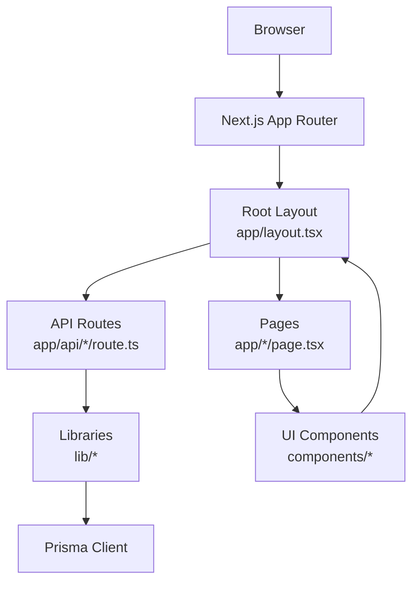

**Diagram sources**
- [app/layout.tsx:1-57](file://app/layout.tsx#L1-L57)
- [app/page.tsx:1-15](file://app/page.tsx#L1-L15)
- [app/api/buildings/route.ts](file://app/api/buildings/route.ts)
- [lib/prisma.ts](file://lib/prisma.ts)
- [lib/api.ts](file://lib/api.ts)
- [components/layout/Sidebar.tsx](file://components/layout/Sidebar.tsx)
- [components/ui/navigation-progress.tsx](file://components/ui/navigation-progress.tsx)
- [components/ui/toaster.tsx](file://components/ui/toaster.tsx)

## Detailed Component Analysis

### Root Layout Implementation
The root layout centralizes:
- Metadata: Title, description, keywords, and icons.
- Font loading: Inter font subset for Latin.
- Hydration handling: Script reads theme preference from localStorage safely.
- Navigation: Sidebar and main content container.
- UX enhancements: Navigation progress and toast notifications.

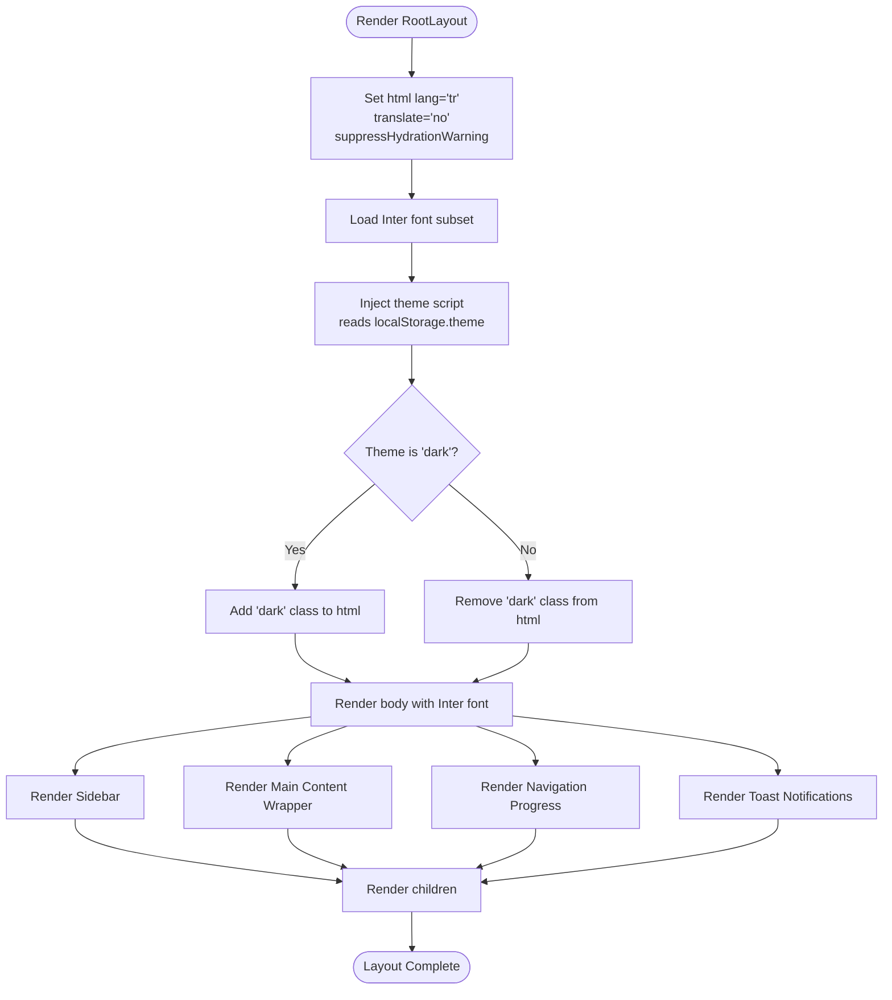

**Diagram sources**
- [app/layout.tsx:1-57](file://app/layout.tsx#L1-L57)

**Section sources**
- [app/layout.tsx:1-57](file://app/layout.tsx#L1-L57)

### Metadata Configuration
Metadata is configured at the root level with:
- Title and description for SEO.
- Keywords for discoverability.
- Icons for favicon and Apple touch icon.

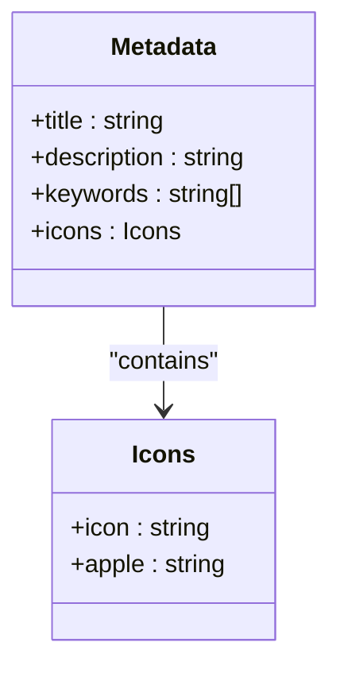

**Diagram sources**
- [app/layout.tsx:10-18](file://app/layout.tsx#L10-L18)

**Section sources**
- [app/layout.tsx:10-18](file://app/layout.tsx#L10-L18)

### Internationalization Setup
The application sets the HTML language to Turkish and disables translation for the root element. This establishes a locale-aware foundation suitable for i18n libraries or future extensions.

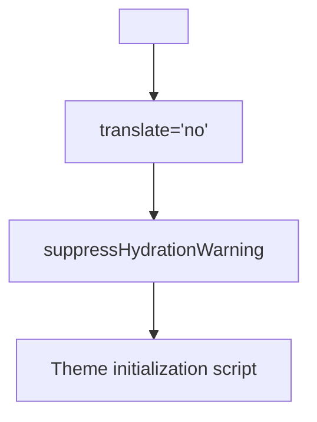

**Diagram sources**
- [app/layout.tsx:26-41](file://app/layout.tsx#L26-L41)

**Section sources**
- [app/layout.tsx:26-41](file://app/layout.tsx#L26-L41)

### Page Organization Patterns
Pages are organized by feature under the `app/` directory:
- Feature-based grouping: `/analytics`, `/services`, `/security`
- Nested pages: `/analytics/sprawl/page.tsx`, `/services/apps/page.tsx`
- Consistent page structure with optional loading UIs

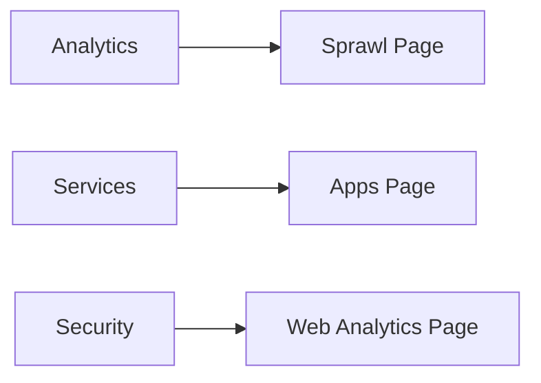

**Diagram sources**
- [app/analytics/sprawl/page.tsx](file://app/analytics/sprawl/page.tsx)
- [app/services/apps/page.tsx](file://app/services/apps/page.tsx)
- [app/security/web-analytics/page.tsx](file://app/security/web-analytics/page.tsx)

**Section sources**
- [app/analytics/sprawl/page.tsx](file://app/analytics/sprawl/page.tsx)
- [app/services/apps/page.tsx](file://app/services/apps/page.tsx)
- [app/security/web-analytics/page.tsx](file://app/security/web-analytics/page.tsx)

### Route Handling and Navigation Structure
Route handling follows Next.js App Router conventions:
- Static pages: `/page.tsx` under feature directories.
- Dynamic routes: `[id]`, `[portName]`, `[scanId]` segments.
- Nested dynamic routes: `/integrations/nms/discovery/[scanId]/import`.
- Client navigation: Home page redirects to `/dashboard`.

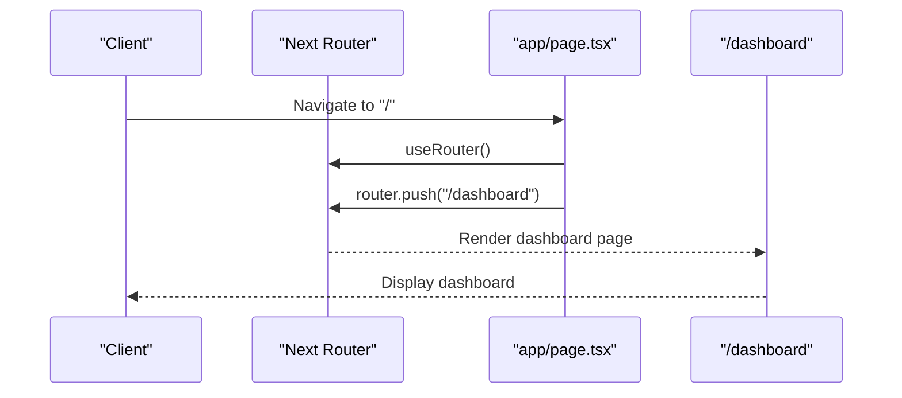

**Diagram sources**
- [app/page.tsx:1-15](file://app/page.tsx#L1-L15)

**Section sources**
- [app/page.tsx:1-15](file://app/page.tsx#L1-L15)

### API Route Integration
API routes are structured to mirror resource hierarchies:
- Resource endpoints: `/buildings`, `/devices/[id]`, `/services/[id]/dependencies`
- Deeply nested resources: `/network-devices/[id]/ports/[portName]`
- Discovery and import workflows: `/integrations/nms/discovery/[scanId]/import`
- Utility endpoints: `/topology`, `/users`

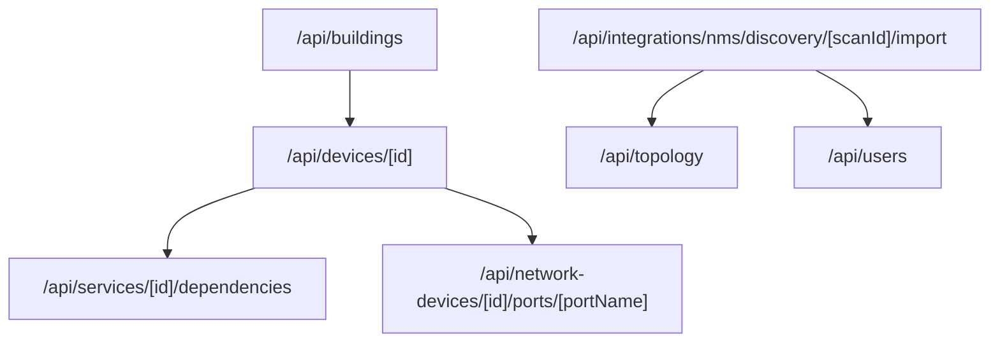

**Diagram sources**
- [app/api/buildings/route.ts](file://app/api/buildings/route.ts)
- [app/api/devices/[id]/route.ts](file://app/api/devices/[id]/route.ts)
- [app/api/services/[id]/dependencies/route.ts](file://app/api/services/[id]/dependencies/route.ts)
- [app/api/network-devices/[id]/ports/[portName]/route.ts](file://app/api/network-devices/[id]/ports/[portName]/route.ts)
- [app/api/integrations/nms/discovery/[scanId]/import/route.ts](file://app/api/integrations/nms/discovery/[scanId]/import/route.ts)
- [app/api/topology/route.ts](file://app/api/topology/route.ts)
- [app/api/users/route.ts](file://app/api/users/route.ts)

**Section sources**
- [app/api/buildings/route.ts](file://app/api/buildings/route.ts)
- [app/api/devices/[id]/route.ts](file://app/api/devices/[id]/route.ts)
- [app/api/services/[id]/dependencies/route.ts](file://app/api/services/[id]/dependencies/route.ts)
- [app/api/network-devices/[id]/ports/[portName]/route.ts](file://app/api/network-devices/[id]/ports/[portName]/route.ts)
- [app/api/integrations/nms/discovery/[scanId]/import/route.ts](file://app/api/integrations/nms/discovery/[scanId]/import/route.ts)
- [app/api/topology/route.ts](file://app/api/topology/route.ts)
- [app/api/users/route.ts](file://app/api/users/route.ts)

### Hydration Handling and SEO Optimization
- Hydration safety: Root layout uses `suppressHydrationWarning` and a controlled theme script to avoid mismatches.
- SEO metadata: Defined centrally for consistent meta tags across pages.
- Global styles: Tailwind utilities and theme variables applied globally.

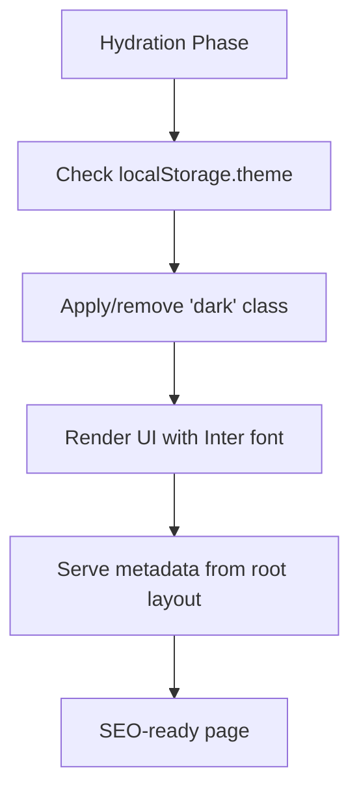

**Diagram sources**
- [app/layout.tsx:26-41](file://app/layout.tsx#L26-L41)
- [app/layout.tsx:10-18](file://app/layout.tsx#L10-L18)
- [app/globals.css:1-226](file://app/globals.css#L1-L226)

**Section sources**
- [app/layout.tsx:26-41](file://app/layout.tsx#L26-L41)
- [app/layout.tsx:10-18](file://app/layout.tsx#L10-L18)
- [app/globals.css:1-226](file://app/globals.css#L1-L226)

### Build Configuration and TypeScript Integration
- Next.js configuration: Standalone output, strict mode, compression, SWC minification, selective console removal in production, transpile Three.js packages, optimize package imports, and aggressive caching headers.
- TypeScript configuration: Bundler module resolution, strict options, path aliases, JSX preserve, and plugin integration.
- Environment types: Next.js ambient types included via declaration file.

```mermaid
classDiagram
class NextConfig {
+output : "standalone"
+reactStrictMode : true
+swcMinify : true
+compress : true
+transpilePackages : string[]
+experimental.optimizePackageImports : string[]
+headers() : Promise<Header[]>
}
class TSConfig {
+moduleResolution : "bundler"
+strict : true
+paths : Record<string,string[]>
+jsx : "preserve"
+plugins : [{ name : "next" }]
}
NextConfig --> TSConfig : "complements"
```

**Diagram sources**
- [next.config.js:1-62](file://next.config.js#L1-L62)
- [tsconfig.json:1-74](file://tsconfig.json#L1-L74)
- [next-env.d.ts:1-6](file://next-env.d.ts#L1-L6)

**Section sources**
- [next.config.js:1-62](file://next.config.js#L1-L62)
- [tsconfig.json:1-74](file://tsconfig.json#L1-L74)
- [next-env.d.ts:1-6](file://next-env.d.ts#L1-L6)

### Environment Variable Management
Environment variables are managed through:
- Package scripts for development, build, and type checking.
- Prisma commands for migrations and seeding.
- Turbopack enabled development for faster iteration.

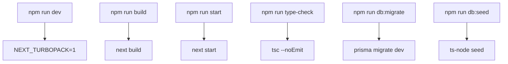

**Diagram sources**
- [package.json:5-14](file://package.json#L5-L14)

**Section sources**
- [package.json:5-14](file://package.json#L5-L14)

### Server-Side Rendering, Static Generation, and Client Navigation
- Server components: Dashboard loading skeleton renders on the server without client JS.
- Client components: Home page uses client navigation to redirect.
- Client-side navigation: Uses Next.js router for programmatic navigation.

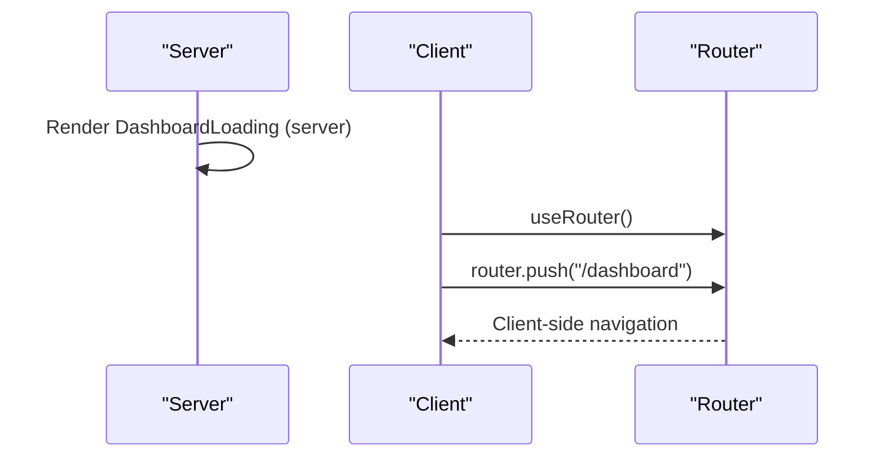

**Diagram sources**
- [app/dashboard/loading.tsx:1-113](file://app/dashboard/loading.tsx#L1-L113)
- [app/page.tsx:1-15](file://app/page.tsx#L1-L15)

**Section sources**
- [app/dashboard/loading.tsx:1-113](file://app/dashboard/loading.tsx#L1-L113)
- [app/page.tsx:1-15](file://app/page.tsx#L1-L15)

### Application Bootstrapping and Middleware Integration
- Bootstrapping: Root layout initializes theme, renders sidebar and main content, and provides global UI elements.
- Middleware: Not explicitly defined in the provided files; Next.js will use defaults if none is present.

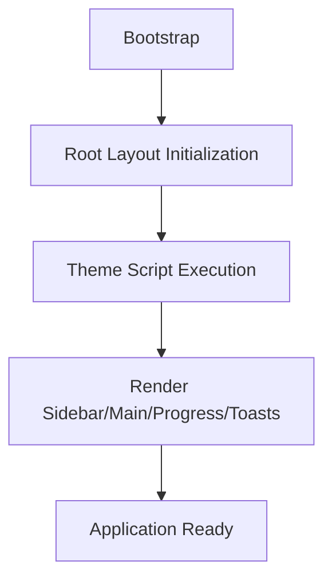

**Diagram sources**
- [app/layout.tsx:1-57](file://app/layout.tsx#L1-L57)

**Section sources**
- [app/layout.tsx:1-57](file://app/layout.tsx#L1-L57)

## Dependency Analysis
The application integrates several key dependencies:
- UI framework: Tailwind CSS with shadcn/ui-inspired theme variables.
- 3D visualization: Three.js ecosystem for interactive 3D views.
- State management: Zustand for lightweight state containers.
- Data fetching: Axios for HTTP requests.
- Charts and visualization: Recharts for data visualization.
- Date utilities: date-fns for date manipulation.
- Icons: lucide-react and @radix-ui/react-icons.

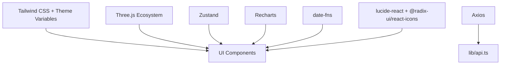

**Diagram sources**
- [package.json:16-56](file://package.json#L16-L56)
- [lib/api.ts](file://lib/api.ts)
- [app/globals.css:1-226](file://app/globals.css#L1-L226)

**Section sources**
- [package.json:16-56](file://package.json#L16-L56)
- [lib/api.ts](file://lib/api.ts)
- [app/globals.css:1-226](file://app/globals.css#L1-L226)

## Performance Considerations
- Build-time optimizations: SWC minification, standalone output, and selective console removal in production.
- Bundle size: Optimized package imports for lucide-react, @radix-ui/react-icons, recharts, and date-fns.
- Caching strategy: Aggressive cache headers for static assets and selected API endpoints.
- Rendering strategy: Server-rendered loading skeletons for improved perceived performance.
- Strict mode: Enabled to surface potential issues early.

Recommendations:
- Monitor bundle size and adjust optimized imports as needed.
- Use dynamic imports for heavy components to defer loading.
- Implement pagination or virtualization for large datasets.
- Leverage Next.js image optimization for static assets.

**Section sources**
- [next.config.js:1-62](file://next.config.js#L1-L62)
- [app/dashboard/loading.tsx:1-113](file://app/dashboard/loading.tsx#L1-L113)

## Troubleshooting Guide
- Client error boundary: Provides reset functionality and navigation back to the dashboard. In development, error details are shown for debugging.
- Hydration warnings: Controlled via suppressHydrationWarning and a deterministic theme script.
- Global styles: Ensure Tailwind directives are processed correctly to avoid missing styles.

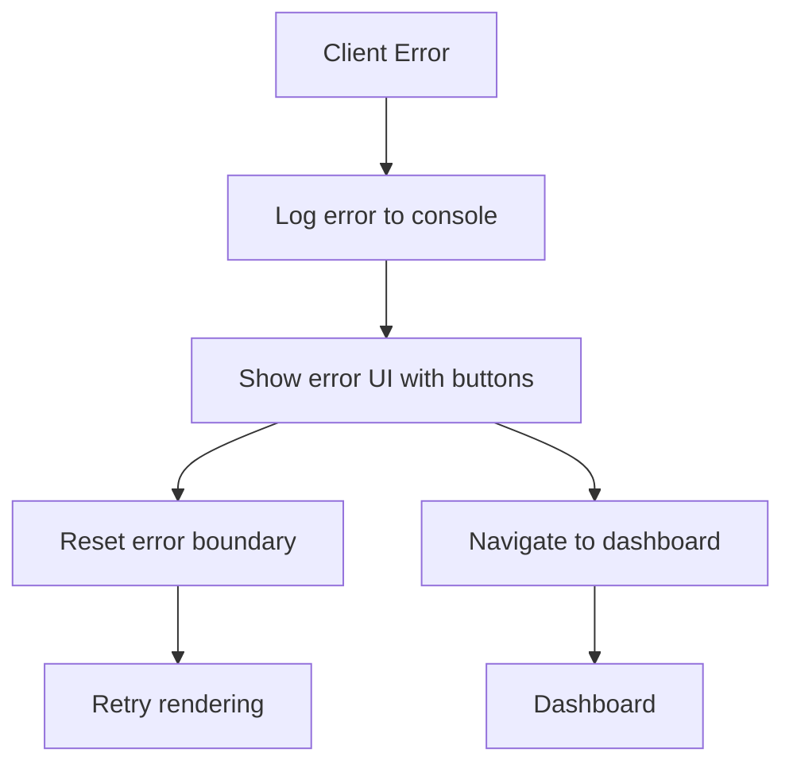

**Diagram sources**
- [app/error.tsx:1-51](file://app/error.tsx#L1-L51)

**Section sources**
- [app/error.tsx:1-51](file://app/error.tsx#L1-L51)
- [app/layout.tsx:26-41](file://app/layout.tsx#L26-L41)
- [app/globals.css:1-226](file://app/globals.css#L1-L226)

## Conclusion
The Next.js application employs a clean, feature-based App Router structure with a centralized root layout, robust metadata configuration, and strong performance optimizations. The combination of server-rendered loading skeletons, client-side navigation, and API routes enables a responsive and scalable user experience. With TypeScript integration and a well-defined build configuration, the application is maintainable and extensible. Future enhancements could include explicit middleware for advanced routing and i18n integration, along with deeper static generation strategies for content-heavy pages.