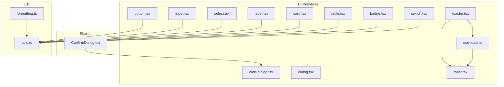
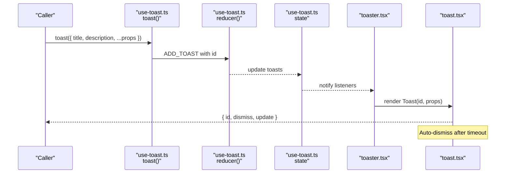
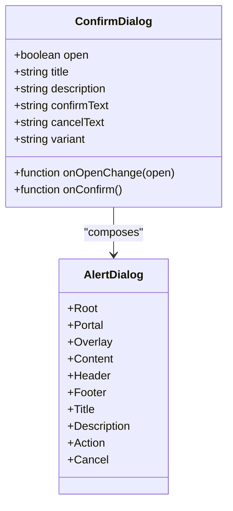
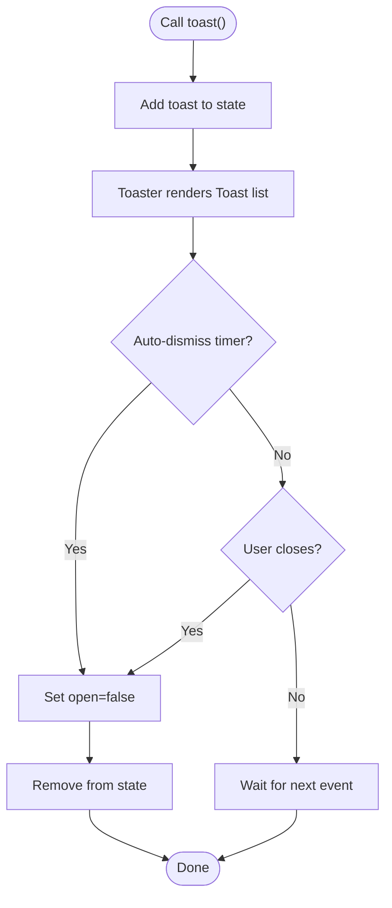
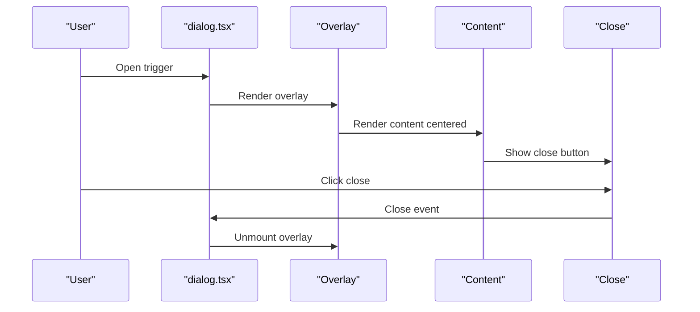
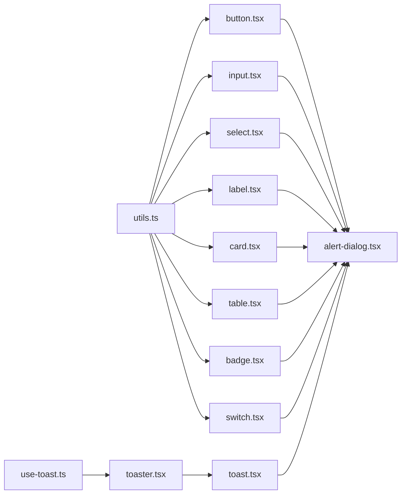

# Shared and Utility Components

<cite>
**Referenced Files in This Document**
- [ConfirmDialog.tsx](file://components/shared/ConfirmDialog.tsx)
- [alert-dialog.tsx](file://components/ui/alert-dialog.tsx)
- [dialog.tsx](file://components/ui/dialog.tsx)
- [toast.tsx](file://components/ui/toast.tsx)
- [toaster.tsx](file://components/ui/toaster.tsx)
- [use-toast.ts](file://components/ui/use-toast.ts)
- [button.tsx](file://components/ui/button.tsx)
- [input.tsx](file://components/ui/input.tsx)
- [select.tsx](file://components/ui/select.tsx)
- [label.tsx](file://components/ui/label.tsx)
- [card.tsx](file://components/ui/card.tsx)
- [table.tsx](file://components/ui/table.tsx)
- [badge.tsx](file://components/ui/badge.tsx)
- [switch.tsx](file://components/ui/switch.tsx)
- [utils.ts](file://lib/utils.ts)
- [formatting.ts](file://lib/formatting.ts)
</cite>

## Table of Contents
1. [Introduction](#introduction)
2. [Project Structure](#project-structure)
3. [Core Components](#core-components)
4. [Architecture Overview](#architecture-overview)
5. [Detailed Component Analysis](#detailed-component-analysis)
6. [Dependency Analysis](#dependency-analysis)
7. [Performance Considerations](#performance-considerations)
8. [Troubleshooting Guide](#troubleshooting-guide)
9. [Conclusion](#conclusion)
10. [Appendices](#appendices)

## Introduction
This document describes the shared and utility components that power reusable UI elements and helper utilities across the InfraScope application. It focuses on:
- Confirmation dialog system and confirmation workflows
- Alert management and notification handling via the toast system
- Message types and user feedback patterns
- Utility components for common UI patterns, form controls, and data display
- Component composition patterns, prop interfaces, and state management integration
- Accessibility features, keyboard navigation, and screen reader support
- Component lifecycle, cleanup procedures, and memory management
- Guidelines for creating new shared components and maintaining consistency

## Project Structure
The shared and utility components are organized under:
- components/shared: reusable higher-level UI patterns (e.g., confirmation dialogs)
- components/ui: low-level, composable primitives (e.g., buttons, inputs, dialogs, toasts)
- lib: cross-cutting utilities (e.g., class merging, formatting helpers)

**Diagram sources**
- [ConfirmDialog.tsx:1-58](file://components/shared/ConfirmDialog.tsx#L1-L58)
- [alert-dialog.tsx:1-142](file://components/ui/alert-dialog.tsx#L1-L142)
- [dialog.tsx:1-123](file://components/ui/dialog.tsx#L1-L123)
- [toast.tsx:1-130](file://components/ui/toast.tsx#L1-L130)
- [toaster.tsx:1-36](file://components/ui/toaster.tsx#L1-L36)
- [use-toast.ts:1-195](file://components/ui/use-toast.ts#L1-L195)
- [button.tsx:1-57](file://components/ui/button.tsx#L1-L57)
- [input.tsx:1-26](file://components/ui/input.tsx#L1-L26)
- [select.tsx:1-161](file://components/ui/select.tsx#L1-L161)
- [label.tsx:1-27](file://components/ui/label.tsx#L1-L27)
- [card.tsx:1-80](file://components/ui/card.tsx#L1-L80)
- [table.tsx:1-118](file://components/ui/table.tsx#L1-L118)
- [badge.tsx:1-41](file://components/ui/badge.tsx#L1-L41)
- [switch.tsx:1-28](file://components/ui/switch.tsx#L1-L28)
- [utils.ts:1-7](file://lib/utils.ts#L1-L7)
- [formatting.ts:1-176](file://lib/formatting.ts#L1-L176)

**Section sources**
- [ConfirmDialog.tsx:1-58](file://components/shared/ConfirmDialog.tsx#L1-L58)
- [alert-dialog.tsx:1-142](file://components/ui/alert-dialog.tsx#L1-L142)
- [dialog.tsx:1-123](file://components/ui/dialog.tsx#L1-L123)
- [toast.tsx:1-130](file://components/ui/toast.tsx#L1-L130)
- [toaster.tsx:1-36](file://components/ui/toaster.tsx#L1-L36)
- [use-toast.ts:1-195](file://components/ui/use-toast.ts#L1-L195)
- [button.tsx:1-57](file://components/ui/button.tsx#L1-L57)
- [input.tsx:1-26](file://components/ui/input.tsx#L1-L26)
- [select.tsx:1-161](file://components/ui/select.tsx#L1-L161)
- [label.tsx:1-27](file://components/ui/label.tsx#L1-L27)
- [card.tsx:1-80](file://components/ui/card.tsx#L1-L80)
- [table.tsx:1-118](file://components/ui/table.tsx#L1-L118)
- [badge.tsx:1-41](file://components/ui/badge.tsx#L1-L41)
- [switch.tsx:1-28](file://components/ui/switch.tsx#L1-L28)
- [utils.ts:1-7](file://lib/utils.ts#L1-L7)
- [formatting.ts:1-176](file://lib/formatting.ts#L1-L176)

## Core Components
This section summarizes the primary shared and utility components and their roles.

- Confirmation Dialog
  - Purpose: Standardized confirmation prompts with configurable title, description, actions, and destructive variant.
  - Composition: Built on alert dialog primitives; exposes props for open state, callbacks, and variant.
  - Example usage: Triggered by user actions (e.g., delete, reset) to require explicit confirmation.

- Alert Dialog Primitive Set
  - Purpose: Accessible overlay-based dialog with header, footer, title, and description slots.
  - Composition: Root, Portal, Overlay, Content, Header/Footer, Title/Description, Action/Cancel.
  - Variants: Action inherits button styles; Cancel uses outline variant.

- Toast System
  - Provider/Viewport: Manages toast queue and viewport positioning.
  - Toaster: Renders toasts from state and wires close/dismiss behavior.
  - use-toast: Global state machine managing add/update/dismiss/remove with a per-toast removal timer.

- UI Primitives
  - Buttons: Variants (default, destructive, outline, secondary, ghost, link) and sizes.
  - Inputs: Text inputs with focus-visible ring and disabled states.
  - Select: Multi-part select with scrollable viewport, icons, and item indicators.
  - Label: Accessible label primitive with consistent typography.
  - Cards, Tables, Badges, Switches: Layout, data display, status, and toggles.

- Utilities
  - Class merging: Tailwind-aware cn helper.
  - Formatting: Device names, statuses, criticality, vendor logos, dates, ports, bytes, percentages.

**Section sources**
- [ConfirmDialog.tsx:15-35](file://components/shared/ConfirmDialog.tsx#L15-L35)
- [alert-dialog.tsx:9-141](file://components/ui/alert-dialog.tsx#L9-L141)
- [dialog.tsx:9-122](file://components/ui/dialog.tsx#L9-L122)
- [toast.tsx:10-129](file://components/ui/toast.tsx#L10-L129)
- [toaster.tsx:13-35](file://components/ui/toaster.tsx#L13-L35)
- [use-toast.ts:12-194](file://components/ui/use-toast.ts#L12-L194)
- [button.tsx:7-56](file://components/ui/button.tsx#L7-L56)
- [input.tsx:5-25](file://components/ui/input.tsx#L5-L25)
- [select.tsx:9-160](file://components/ui/select.tsx#L9-L160)
- [label.tsx:9-26](file://components/ui/label.tsx#L9-L26)
- [card.tsx:5-79](file://components/ui/card.tsx#L5-L79)
- [table.tsx:5-117](file://components/ui/table.tsx#L5-L117)
- [badge.tsx:6-40](file://components/ui/badge.tsx#L6-L40)
- [switch.tsx:6-27](file://components/ui/switch.tsx#L6-L27)
- [utils.ts:4-6](file://lib/utils.ts#L4-L6)
- [formatting.ts:8-175](file://lib/formatting.ts#L8-L175)

## Architecture Overview
The toast system follows a unidirectional data flow with a global reducer and subscribers. The Toaster component renders the current state, while use-toast encapsulates state updates and timers.

**Diagram sources**
- [use-toast.ts:145-172](file://components/ui/use-toast.ts#L145-L172)
- [use-toast.ts:78-130](file://components/ui/use-toast.ts#L78-L130)
- [toaster.tsx:13-35](file://components/ui/toaster.tsx#L13-L35)
- [toast.tsx:43-56](file://components/ui/toast.tsx#L43-L56)

## Detailed Component Analysis

### Confirmation Dialog System
The confirmation dialog composes alert dialog primitives to present a concise prompt with explicit actions. It supports destructive action styling and customizable labels.

**Diagram sources**
- [ConfirmDialog.tsx:26-56](file://components/shared/ConfirmDialog.tsx#L26-L56)
- [alert-dialog.tsx:9-141](file://components/ui/alert-dialog.tsx#L9-L141)

Key props and behavior:
- open/onOpenChange: Control visibility and lifecycle.
- title/description: Present the confirmation message.
- onConfirm: Callback invoked when the user confirms.
- confirmText/cancelText: Localized labels.
- variant: Destructive styling for destructive actions.

Accessibility and UX:
- Uses AlertDialog primitives for focus trapping and overlay behavior.
- Cancel defaults to an outline button; confirm applies destructive styling when selected.

**Section sources**
- [ConfirmDialog.tsx:15-35](file://components/shared/ConfirmDialog.tsx#L15-L35)
- [alert-dialog.tsx:15-127](file://components/ui/alert-dialog.tsx#L15-L127)

### Alert Management and Notification Handling (Toast System)
The toast system provides a global notification mechanism with a provider, viewport, and a reducer-driven state machine.

**Diagram sources**
- [use-toast.ts:145-172](file://components/ui/use-toast.ts#L145-L172)
- [use-toast.ts:62-76](file://components/ui/use-toast.ts#L62-L76)
- [toaster.tsx:17-33](file://components/ui/toaster.tsx#L17-L33)
- [toast.tsx:12-25](file://components/ui/toast.tsx#L12-L25)

Message types and variants:
- Default vs destructive variants for neutral and error/error-adjacent messages.
- Action element support for quick actions (e.g., undo).

State management integration:
- use-toast maintains a single in-memory state and notifies subscribers.
- Per-toast timers are tracked in a Map to schedule removal.

Lifecycle and cleanup:
- Listeners are removed on hook unmount.
- Timers are cleared when toasts are dismissed programmatically.

**Section sources**
- [toast.tsx:27-41](file://components/ui/toast.tsx#L27-L41)
- [toast.tsx:119-129](file://components/ui/toast.tsx#L119-L129)
- [toaster.tsx:13-35](file://components/ui/toaster.tsx#L13-L35)
- [use-toast.ts:56-194](file://components/ui/use-toast.ts#L56-L194)

### Modal Dialogs and User Interaction Flows
Modal dialogs are built on Radix primitives and include a portal overlay, focus trapping, and optional close controls.

**Diagram sources**
- [dialog.tsx:17-53](file://components/ui/dialog.tsx#L17-L53)

Patterns:
- Portal ensures proper stacking and z-index isolation.
- Overlay animates in/out and traps focus.
- Close button includes a screen-reader-only label for accessibility.

**Section sources**
- [dialog.tsx:1-123](file://components/ui/dialog.tsx#L1-L123)

### Form Controls and Validation Patterns
Common form-related primitives enable consistent styling and behavior.

- Button
  - Variants and sizes standardized via class variants.
  - asChild support for semantic composition.

- Input
  - Focus-visible ring and disabled state handling.
  - Placeholder and type attributes supported.

- Select
  - Scrollable viewport, icons, item indicators, and label support.
  - Controlled via trigger/content/item hierarchy.

- Label
  - Accessible label primitive with consistent typography.

Validation patterns:
- Combine input/select with label and optional badges or status indicators.
- Use destructive variant for error states and success variant for positive feedback.

**Section sources**
- [button.tsx:7-56](file://components/ui/button.tsx#L7-L56)
- [input.tsx:5-25](file://components/ui/input.tsx#L5-L25)
- [select.tsx:15-160](file://components/ui/select.tsx#L15-L160)
- [label.tsx:9-26](file://components/ui/label.tsx#L9-L26)

### Data Display Components
Layout and data presentation primitives:

- Card
  - Header, title, description, content, and footer segments.
  - Consistent shadow and border styling.

- Table
  - Scrollable wrapper, header/body/footer, rows, cells, and captions.
  - Hover and selection states.

- Badge
  - Status-like indicators with multiple variants (default, secondary, destructive, outline, success, warning).

- Switch
  - Accessible toggle with focus-visible ring and checked/unchecked states.

**Section sources**
- [card.tsx:5-79](file://components/ui/card.tsx#L5-L79)
- [table.tsx:5-117](file://components/ui/table.tsx#L5-L117)
- [badge.tsx:6-40](file://components/ui/badge.tsx#L6-L40)
- [switch.tsx:6-27](file://components/ui/switch.tsx#L6-L27)

### Utility Components for Common UI Patterns
- Class merging: cn merges Tailwind classes safely.
- Formatting helpers: Device names, status badges, criticality labels, vendor logos, dates, ports, bytes, percentages.

Usage patterns:
- Apply formatting helpers to raw data before rendering.
- Use badges to represent status or criticality consistently.

**Section sources**
- [utils.ts:4-6](file://lib/utils.ts#L4-L6)
- [formatting.ts:8-175](file://lib/formatting.ts#L8-L175)

## Dependency Analysis
The components depend on:
- Radix UI primitives for accessible base behaviors (dialogs, selects, toasts, switches).
- Class variance authority (CVA) for consistent variants.
- Tailwind and cn for styling composition.
- use-toast for centralized toast state management.

**Diagram sources**
- [utils.ts:4-6](file://lib/utils.ts#L4-L6)
- [button.tsx:7-56](file://components/ui/button.tsx#L7-L56)
- [input.tsx:5-25](file://components/ui/input.tsx#L5-L25)
- [select.tsx:9-160](file://components/ui/select.tsx#L9-L160)
- [label.tsx:9-26](file://components/ui/label.tsx#L9-L26)
- [card.tsx:5-79](file://components/ui/card.tsx#L5-L79)
- [table.tsx:5-117](file://components/ui/table.tsx#L5-L117)
- [badge.tsx:6-40](file://components/ui/badge.tsx#L6-L40)
- [switch.tsx:6-27](file://components/ui/switch.tsx#L6-L27)
- [alert-dialog.tsx:9-141](file://components/ui/alert-dialog.tsx#L9-L141)
- [use-toast.ts:1-195](file://components/ui/use-toast.ts#L1-L195)
- [toaster.tsx:1-36](file://components/ui/toaster.tsx#L1-L36)
- [toast.tsx:1-130](file://components/ui/toast.tsx#L1-L130)

**Section sources**
- [utils.ts:4-6](file://lib/utils.ts#L4-L6)
- [alert-dialog.tsx:9-141](file://components/ui/alert-dialog.tsx#L9-L141)
- [use-toast.ts:1-195](file://components/ui/use-toast.ts#L1-L195)
- [toaster.tsx:1-36](file://components/ui/toaster.tsx#L1-L36)
- [toast.tsx:1-130](file://components/ui/toast.tsx#L1-L130)

## Performance Considerations
- Toast limits: The reducer slices the toast list to a fixed limit to prevent unbounded growth.
- Removal timers: Per-toast timeouts are stored in a Map to avoid redundant timers and enable targeted cleanup.
- Rendering: Toaster maps over the current state; keep toast payloads minimal to reduce re-renders.
- Class merging: cn efficiently merges classes; avoid excessive dynamic class generation in tight loops.

[No sources needed since this section provides general guidance]

## Troubleshooting Guide
Common issues and resolutions:
- Toasts not dismissing
  - Ensure onOpenChange is wired so that closing the toast triggers dismissal.
  - Verify that the global state listener is active and that listeners are cleaned up on unmount.
- Overlapping overlays
  - Confirm portal usage and z-index values; overlays should render above page content.
- Focus trapping issues
  - Ensure the dialog or alert content receives focus on open; avoid disabling focus trapping unintentionally.
- Accessibility labels
  - Provide visible labels for interactive elements; screen-reader-only text is included for close buttons.

**Section sources**
- [use-toast.ts:161-165](file://components/ui/use-toast.ts#L161-L165)
- [use-toast.ts:177-185](file://components/ui/use-toast.ts#L177-L185)
- [dialog.tsx:47-50](file://components/ui/dialog.tsx#L47-L50)
- [alert-dialog.tsx:15-27](file://components/ui/alert-dialog.tsx#L15-L27)

## Conclusion
InfraScope’s shared and utility components provide a cohesive, accessible, and maintainable foundation for UI interactions. The confirmation dialog system leverages alert dialog primitives for predictable behavior, while the toast system offers a scalable notification mechanism with robust state management. UI primitives standardize form controls and layout components, and utility functions ensure consistent formatting and styling. Following the composition patterns and guidelines outlined here will help maintain consistency and improve developer experience across the application.

[No sources needed since this section summarizes without analyzing specific files]

## Appendices

### Accessibility Features and Keyboard Navigation
- Focus trapping and escape-to-close are handled by Radix primitives.
- Screen reader support includes aria-live regions and labels for close controls.
- Keyboard navigation: Tab order is preserved; Escape dismisses dialogs and toasts.

**Section sources**
- [dialog.tsx:47-50](file://components/ui/dialog.tsx#L47-L50)
- [alert-dialog.tsx:15-27](file://components/ui/alert-dialog.tsx#L15-L27)
- [toast.tsx:77-87](file://components/ui/toast.tsx#L77-L87)

### Component Lifecycle, Cleanup, and Memory Management
- use-toast registers listeners on mount and removes them on unmount.
- Per-toast timers are stored in a Map keyed by toast id; timers are cleared on dismiss or remove.
- Reducer state is kept in memory and updated immutably; listeners receive the latest snapshot.

**Section sources**
- [use-toast.ts:174-192](file://components/ui/use-toast.ts#L174-L192)
- [use-toast.ts:60-76](file://components/ui/use-toast.ts#L60-L76)
- [use-toast.ts:78-130](file://components/ui/use-toast.ts#L78-L130)

### Guidelines for Creating New Shared Components
- Prefer composing existing primitives (button, input, select, label, card, table, badge, switch) to maintain consistency.
- Use CVA for variants and sizes; export both component and variant function for flexibility.
- Wrap complex behaviors (e.g., modals, dialogs) with a small, focused component that delegates to primitives.
- Provide clear prop interfaces and defaults; document optional vs required props.
- Include accessibility: labels, roles, focus management, and keyboard handlers where applicable.
- Keep state local when possible; centralize global state only when necessary (e.g., notifications).
- Use cn for class merging; avoid inline styles where primitives offer variants.

**Section sources**
- [button.tsx:7-56](file://components/ui/button.tsx#L7-L56)
- [input.tsx:5-25](file://components/ui/input.tsx#L5-L25)
- [select.tsx:9-160](file://components/ui/select.tsx#L9-L160)
- [label.tsx:9-26](file://components/ui/label.tsx#L9-L26)
- [card.tsx:5-79](file://components/ui/card.tsx#L5-L79)
- [table.tsx:5-117](file://components/ui/table.tsx#L5-L117)
- [badge.tsx:6-40](file://components/ui/badge.tsx#L6-L40)
- [switch.tsx:6-27](file://components/ui/switch.tsx#L6-L27)
- [utils.ts:4-6](file://lib/utils.ts#L4-L6)