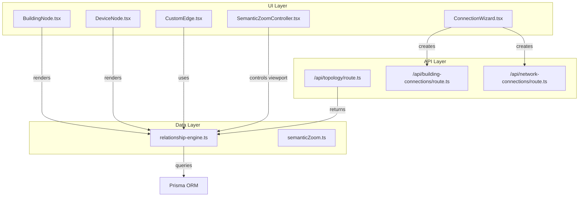
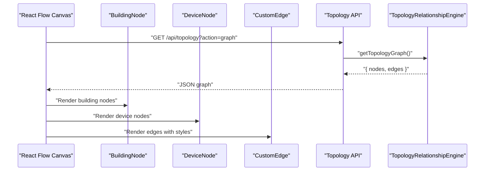
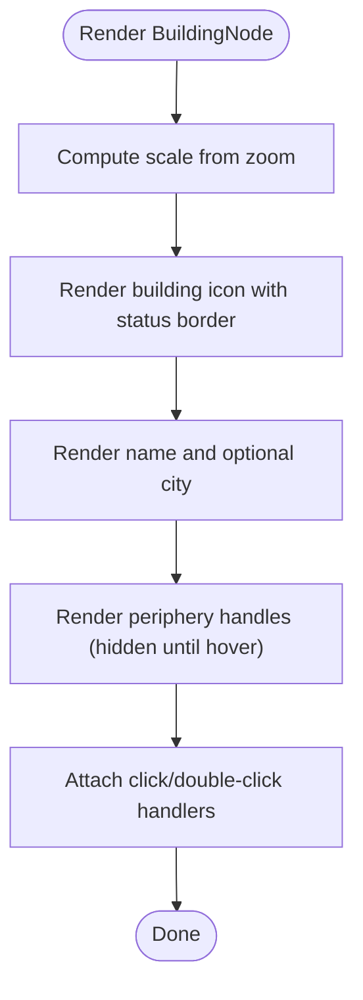
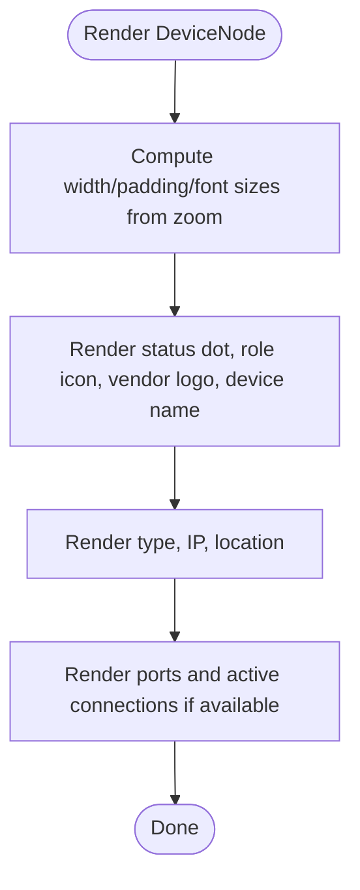
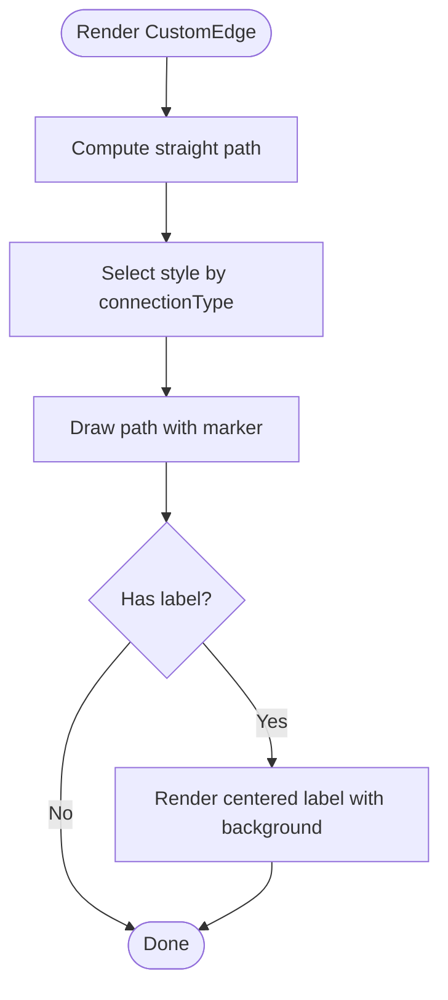
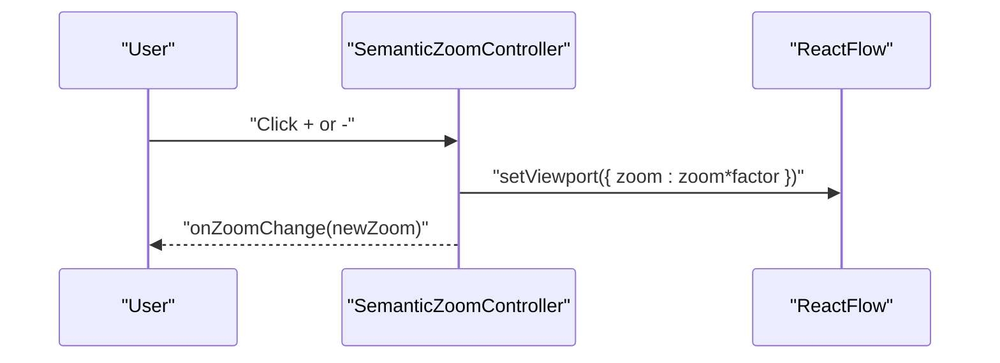
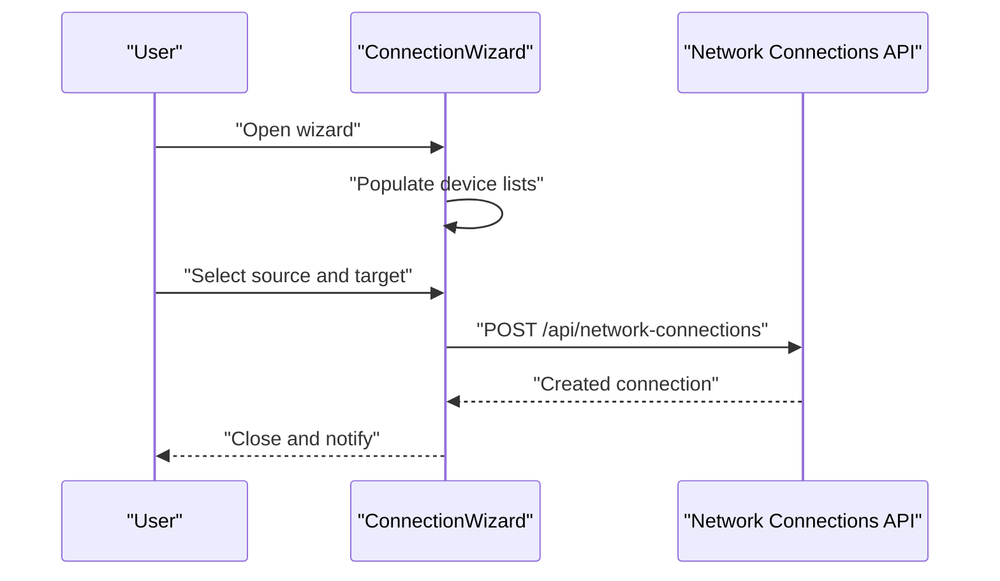
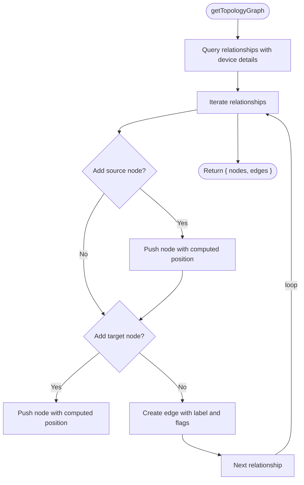
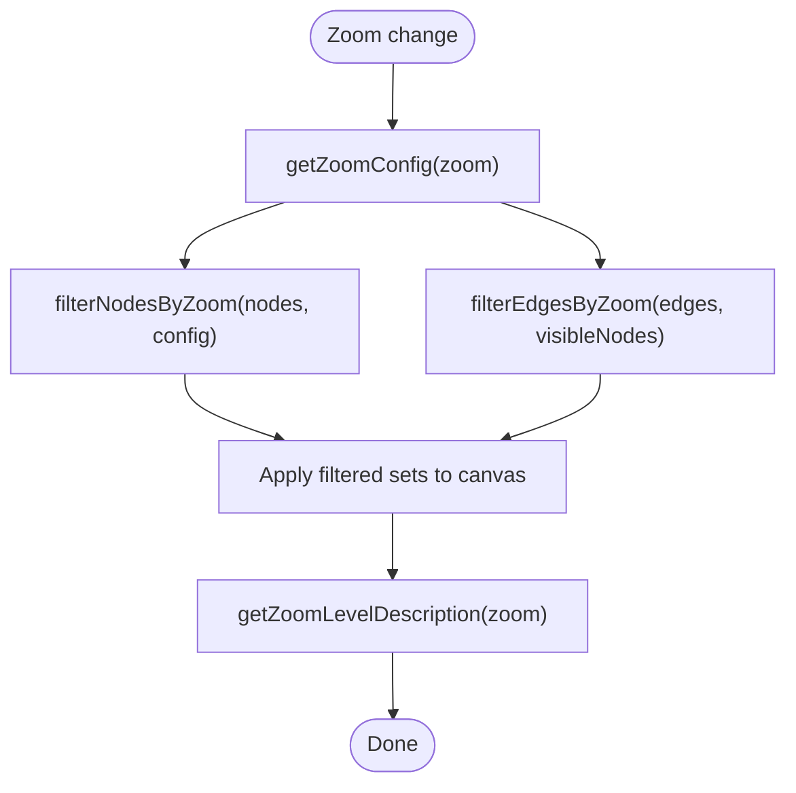
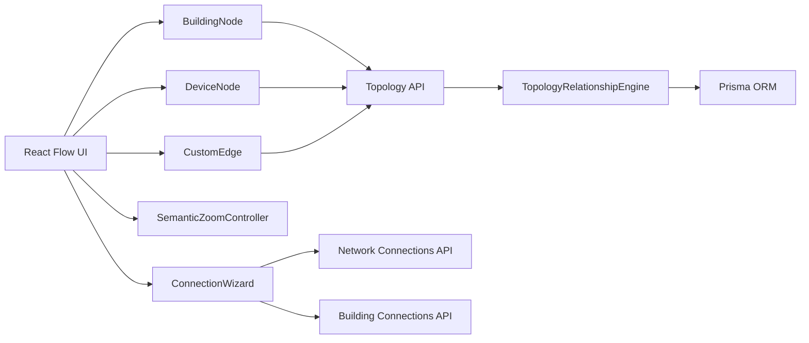

# Topology and Network Visualization

<cite>
**Referenced Files in This Document**
- [BuildingNode.tsx](file://components/topology/BuildingNode.tsx)
- [DeviceNode.tsx](file://components/topology/DeviceNode.tsx)
- [CustomEdge.tsx](file://components/topology/CustomEdge.tsx)
- [ConnectionWizard.tsx](file://components/topology/ConnectionWizard.tsx)
- [SemanticZoomController.tsx](file://components/topology/SemanticZoomController.tsx)
- [relationship-engine.ts](file://lib/topology/relationship-engine.ts)
- [semanticZoom.ts](file://lib/semanticZoom.ts)
- [route.ts](file://app/api/topology/route.ts)
- [route.ts](file://app/api/building-connections/route.ts)
- [route.ts](file://app/api/network-connections/route.ts)
</cite>

## Table of Contents
1. [Introduction](#introduction)
2. [Project Structure](#project-structure)
3. [Core Components](#core-components)
4. [Architecture Overview](#architecture-overview)
5. [Detailed Component Analysis](#detailed-component-analysis)
6. [Dependency Analysis](#dependency-analysis)
7. [Performance Considerations](#performance-considerations)
8. [Troubleshooting Guide](#troubleshooting-guide)
9. [Conclusion](#conclusion)
10. [Appendices](#appendices)

## Introduction
This document explains the InfraScope topology and network visualization subsystem with a focus on interactive graph representation and network mapping. It covers React Flow integration, node and edge rendering, layout strategies, building and device node components, custom edge rendering, connection wizards, topology editing capabilities, semantic zoom for large-scale visualization, user interaction patterns, and performance considerations. It also provides practical guidance for customizing node styles, adding new connection types, and extending visualization features.

## Project Structure
The topology visualization is implemented as a set of React components integrated with a React Flow canvas and backed by a topology relationship engine and API endpoints. The key parts are:
- UI components for nodes and edges
- A semantic zoom controller
- A wizard for creating connections
- A topology relationship engine that builds graph data from relationships
- API routes that expose topology graphs and manage connections

**Diagram sources**
- [BuildingNode.tsx:1-176](file://components/topology/BuildingNode.tsx#L1-L176)
- [DeviceNode.tsx:1-112](file://components/topology/DeviceNode.tsx#L1-L112)
- [CustomEdge.tsx:1-156](file://components/topology/CustomEdge.tsx#L1-L156)
- [SemanticZoomController.tsx:1-49](file://components/topology/SemanticZoomController.tsx#L1-L49)
- [ConnectionWizard.tsx:1-80](file://components/topology/ConnectionWizard.tsx#L1-L80)
- [relationship-engine.ts:1-516](file://lib/topology/relationship-engine.ts#L1-L516)
- [semanticZoom.ts:1-32](file://lib/semanticZoom.ts#L1-L32)
- [route.ts:1-51](file://app/api/topology/route.ts#L1-L51)
- [route.ts:1-76](file://app/api/building-connections/route.ts#L1-L76)
- [route.ts:1-78](file://app/api/network-connections/route.ts#L1-L78)

**Section sources**
- [BuildingNode.tsx:1-176](file://components/topology/BuildingNode.tsx#L1-L176)
- [DeviceNode.tsx:1-112](file://components/topology/DeviceNode.tsx#L1-L112)
- [CustomEdge.tsx:1-156](file://components/topology/CustomEdge.tsx#L1-L156)
- [SemanticZoomController.tsx:1-49](file://components/topology/SemanticZoomController.tsx#L1-L49)
- [ConnectionWizard.tsx:1-80](file://components/topology/ConnectionWizard.tsx#L1-L80)
- [relationship-engine.ts:1-516](file://lib/topology/relationship-engine.ts#L1-L516)
- [semanticZoom.ts:1-32](file://lib/semanticZoom.ts#L1-L32)
- [route.ts:1-51](file://app/api/topology/route.ts#L1-L51)
- [route.ts:1-76](file://app/api/building-connections/route.ts#L1-L76)
- [route.ts:1-78](file://app/api/network-connections/route.ts#L1-L78)

## Core Components
- BuildingNode: Renders a building node with status, optional expansion actions, and connection handles around the perimeter. Handles hover-triggered handles and scaling based on zoom.
- DeviceNode: Renders a device node with role, vendor, status, IP address, location, and port metrics. Includes top and bottom handles for connections.
- CustomEdge: Provides styled edges for device-to-device connections with connection-type-specific visuals and labels. Includes a specialized BuildingConnectionEdge for inter-building links.
- SemanticZoomController: Controls zoom level via React Flow’s viewport, emitting zoom changes for downstream consumers.
- ConnectionWizard: A modal wizard to create network connections between devices, validating selections and invoking creation callbacks.
- Topology Relationship Engine: Builds graph data (nodes and edges) from relationships, computes positions, and supports correlation of relationships from device metadata.
- Semantic Zoom Utilities: Provide zoom-driven visibility rules for nodes and edges and human-readable zoom descriptions.

**Section sources**
- [BuildingNode.tsx:1-176](file://components/topology/BuildingNode.tsx#L1-L176)
- [DeviceNode.tsx:1-112](file://components/topology/DeviceNode.tsx#L1-L112)
- [CustomEdge.tsx:1-156](file://components/topology/CustomEdge.tsx#L1-L156)
- [SemanticZoomController.tsx:1-49](file://components/topology/SemanticZoomController.tsx#L1-L49)
- [ConnectionWizard.tsx:1-80](file://components/topology/ConnectionWizard.tsx#L1-L80)
- [relationship-engine.ts:20-37](file://lib/topology/relationship-engine.ts#L20-L37)
- [semanticZoom.ts:1-32](file://lib/semanticZoom.ts#L1-L32)

## Architecture Overview
The visualization pipeline integrates frontend UI components with backend APIs and a topology engine:
- Frontend renders nodes and edges using React Flow.
- Nodes and edges are configured with data supplied by the topology engine via the topology API.
- The semantic zoom controller adjusts the viewport to reveal or hide hierarchical details.
- The connection wizard posts new connections to the appropriate API endpoints.

**Diagram sources**
- [route.ts:1-51](file://app/api/topology/route.ts#L1-L51)
- [relationship-engine.ts:390-474](file://lib/topology/relationship-engine.ts#L390-L474)
- [BuildingNode.tsx:1-176](file://components/topology/BuildingNode.tsx#L1-L176)
- [DeviceNode.tsx:1-112](file://components/topology/DeviceNode.tsx#L1-L112)
- [CustomEdge.tsx:1-156](file://components/topology/CustomEdge.tsx#L1-L156)

## Detailed Component Analysis

### BuildingNode Component
- Purpose: Visual representation of a building with status, city, device counts, and expandability.
- Rendering:
  - Uses Handle components around the perimeter for connections.
  - Hover reveals handles; otherwise they are transparent.
  - Scales icon and text based on zoom to maintain readability.
- Interaction:
  - Supports expand, double-click, and show-details actions via callbacks.
- Status and styling:
  - Status determines border and background colors.
  - Selected state increases scale and adds a ring effect.

**Diagram sources**
- [BuildingNode.tsx:24-176](file://components/topology/BuildingNode.tsx#L24-L176)

**Section sources**
- [BuildingNode.tsx:1-176](file://components/topology/BuildingNode.tsx#L1-L176)

### DeviceNode Component
- Purpose: Visual representation of a device with role, vendor, status, IP, location, and port metrics.
- Rendering:
  - Dynamic sizing and typography based on zoom.
  - Top and bottom handles for inbound/outbound connections.
  - Role icons and vendor logos for quick recognition.
- Interaction:
  - Selected state applies a blue border, glow, and slight scale-up.

**Diagram sources**
- [DeviceNode.tsx:22-112](file://components/topology/DeviceNode.tsx#L22-L112)

**Section sources**
- [DeviceNode.tsx:1-112](file://components/topology/DeviceNode.tsx#L1-L112)

### CustomEdge Component
- Purpose: Render network connections with connection-type-specific styles and labels.
- Rendering:
  - Straight path edges using React Flow’s path generator.
  - Styles keyed by connection type (fiber, copper, wireless, VPN, building).
  - Optional inline labels rendered with an EdgeLabelRenderer.
- Specialized edge:
  - BuildingConnectionEdge provides compact labels with icon and text styling for inter-building links.

**Diagram sources**
- [CustomEdge.tsx:7-69](file://components/topology/CustomEdge.tsx#L7-L69)

**Section sources**
- [CustomEdge.tsx:1-156](file://components/topology/CustomEdge.tsx#L1-L156)

### SemanticZoomController Component
- Purpose: Control zoom level and notify consumers of zoom changes.
- Behavior:
  - Zoom in/out by multiplying/dividing the current zoom by a factor.
  - Smooth viewport transitions with a short duration.
  - Emits new zoom level to parent components for coordinated updates.

**Diagram sources**
- [SemanticZoomController.tsx:11-49](file://components/topology/SemanticZoomController.tsx#L11-L49)

**Section sources**
- [SemanticZoomController.tsx:1-49](file://components/topology/SemanticZoomController.tsx#L1-L49)

### ConnectionWizard Component
- Purpose: Assist users in creating a new network connection between two devices.
- Behavior:
  - Modal overlay with device selection dropdowns.
  - Validates that both source and target are selected.
  - Submits a POST request to the network connections API with status defaults.

**Diagram sources**
- [ConnectionWizard.tsx:12-80](file://components/topology/ConnectionWizard.tsx#L12-L80)
- [route.ts:36-78](file://app/api/network-connections/route.ts#L36-L78)

**Section sources**
- [ConnectionWizard.tsx:1-80](file://components/topology/ConnectionWizard.tsx#L1-L80)
- [route.ts:1-78](file://app/api/network-connections/route.ts#L1-L78)

### Topology Relationship Engine
- Purpose: Build a graph model from relationships and device metadata.
- Graph construction:
  - Loads relationships and device details, deduplicates nodes, and creates edges.
  - Computes initial positions from device metadata or hashes device IDs.
  - Generates edge labels and animation flags based on relationship confidence.
- Correlation:
  - Correlates VM-host, cluster-host, VLAN memberships, and interface connections from device metadata.
  - Removes stale auto-generated relationships.
- Statistics:
  - Aggregates relationship counts by type.

**Diagram sources**
- [relationship-engine.ts:390-474](file://lib/topology/relationship-engine.ts#L390-L474)

**Section sources**
- [relationship-engine.ts:1-516](file://lib/topology/relationship-engine.ts#L1-L516)

### Semantic Zoom Utilities
- Purpose: Drive visibility and filtering of nodes and edges based on zoom level.
- Features:
  - Visibility thresholds for floors, rooms, racks, and devices.
  - Filtering functions to keep edges connected only to visible nodes.
  - Human-readable zoom descriptions.

**Diagram sources**
- [semanticZoom.ts:1-32](file://lib/semanticZoom.ts#L1-L32)

**Section sources**
- [semanticZoom.ts:1-32](file://lib/semanticZoom.ts#L1-L32)

## Dependency Analysis
- UI components depend on React Flow for rendering and interaction.
- BuildingNode and DeviceNode rely on data passed from the topology engine via the topology API.
- CustomEdge consumes connection type and label data to render styles and labels.
- SemanticZoomController coordinates with React Flow to adjust the viewport.
- ConnectionWizard posts to network and building connection APIs to create new relationships.
- The topology API delegates to the TopologyRelationshipEngine, which queries Prisma for relationships and device metadata.

**Diagram sources**
- [BuildingNode.tsx:1-176](file://components/topology/BuildingNode.tsx#L1-L176)
- [DeviceNode.tsx:1-112](file://components/topology/DeviceNode.tsx#L1-L112)
- [CustomEdge.tsx:1-156](file://components/topology/CustomEdge.tsx#L1-L156)
- [SemanticZoomController.tsx:1-49](file://components/topology/SemanticZoomController.tsx#L1-L49)
- [ConnectionWizard.tsx:1-80](file://components/topology/ConnectionWizard.tsx#L1-L80)
- [route.ts:1-51](file://app/api/topology/route.ts#L1-L51)
- [relationship-engine.ts:1-516](file://lib/topology/relationship-engine.ts#L1-L516)
- [route.ts:1-78](file://app/api/network-connections/route.ts#L1-L78)
- [route.ts:1-76](file://app/api/building-connections/route.ts#L1-L76)

**Section sources**
- [route.ts:1-51](file://app/api/topology/route.ts#L1-L51)
- [relationship-engine.ts:1-516](file://lib/topology/relationship-engine.ts#L1-L516)
- [route.ts:1-78](file://app/api/network-connections/route.ts#L1-L78)
- [route.ts:1-76](file://app/api/building-connections/route.ts#L1-L76)

## Performance Considerations
- Large graphs
  - Use semantic zoom to progressively reveal hierarchy and reduce clutter.
  - Filter nodes and edges at high zoom levels to minimize DOM and rendering cost.
- Rendering
  - Memoize node and edge components to avoid unnecessary re-renders.
  - Keep label rendering lightweight; defer heavy computations off the main thread.
- Data updates
  - Paginate or stream graph segments for very large organizations.
  - Debounce zoom and pan events to limit frequent re-computations.
- Backend
  - Cache frequently accessed relationship statistics.
  - Use indexed queries for device metadata and relationships.
- Real-time updates
  - Poll or subscribe to incremental topology deltas and apply selective updates.
  - Batch updates to the graph to reduce layout thrashing.

[No sources needed since this section provides general guidance]

## Troubleshooting Guide
- Nodes not appearing
  - Verify the topology API returns nodes and edges; check organization filters.
  - Ensure device metadata includes positions or that hashing produces valid coordinates.
- Edges missing
  - Confirm that both source and target nodes are present after filtering.
  - Check that edge labels and styles are applied conditionally on data presence.
- Zoom controls not working
  - Ensure React Flow context is available and the controller has access to viewport controls.
- Connection creation fails
  - Validate required fields in the wizard and API constraints.
  - Inspect API responses for constraint violations or missing fields.

**Section sources**
- [relationship-engine.ts:390-474](file://lib/topology/relationship-engine.ts#L390-L474)
- [semanticZoom.ts:20-23](file://lib/semanticZoom.ts#L20-L23)
- [route.ts:36-78](file://app/api/network-connections/route.ts#L36-L78)
- [route.ts:31-76](file://app/api/building-connections/route.ts#L31-L76)

## Conclusion
InfraScope’s topology and network visualization combine React Flow with a robust topology engine and semantic zoom to deliver an interactive, scalable view of infrastructure. Building and device nodes, custom edges, and a connection wizard enable efficient exploration and editing of network relationships. By leveraging zoom-driven filtering and optimized rendering, the system remains responsive even at large scales.

[No sources needed since this section summarizes without analyzing specific files]

## Appendices

### API Definitions
- Topology API
  - Method: GET
  - Path: /api/topology
  - Query parameters:
    - organizationId: optional
    - action: graph or stats
  - Returns: graph JSON with nodes and edges or relationship statistics

- Network Connections API
  - Method: GET
  - Path: /api/network-connections
  - Returns: array of connections with included device/port details

  - Method: POST
  - Path: /api/network-connections
  - Body fields:
    - name, type, sourcePortId, sourceInterfaceId, destPortId, destInterfaceId, status
  - Returns: created connection

- Building Connections API
  - Method: GET
  - Path: /api/building-connections
  - Returns: list of building connections with building details

  - Method: POST
  - Path: /api/building-connections
  - Body fields:
    - name, connectionType, sourceBuildingId, destBuildingId, status, bandwidth, distance, fiberType, notes
  - Returns: created building connection

**Section sources**
- [route.ts:1-51](file://app/api/topology/route.ts#L1-L51)
- [route.ts:1-78](file://app/api/network-connections/route.ts#L1-L78)
- [route.ts:1-76](file://app/api/building-connections/route.ts#L1-L76)

### Graph Data Structures
- TopologyNode
  - Fields: id, label, type, status, x, y
- TopologyEdge
  - Fields: id, source, target, relationshipType, label, confidence, animated

**Section sources**
- [relationship-engine.ts:20-37](file://lib/topology/relationship-engine.ts#L20-L37)

### Node Positioning Algorithms
- Metadata-based positioning: use device metadata position if present.
- Hash-based fallback: compute deterministic coordinates from device ID to spread nodes evenly.

**Section sources**
- [relationship-engine.ts:476-500](file://lib/topology/relationship-engine.ts#L476-L500)

### Dynamic Updates
- On zoom changes, recompute visibility and re-render filtered sets.
- On topology refresh, merge incremental changes to avoid full reloads.

**Section sources**
- [semanticZoom.ts:10-23](file://lib/semanticZoom.ts#L10-L23)
- [SemanticZoomController.tsx:11-49](file://components/topology/SemanticZoomController.tsx#L11-L49)

### User Interaction Patterns
- Drag-and-drop: leverage React Flow’s built-in node dragging; update backend on drop completion.
- Selection: use React Flow’s selection state; highlight connected edges and nodes.
- Context actions: expose expand/show-details actions from node components.

**Section sources**
- [BuildingNode.tsx:24-176](file://components/topology/BuildingNode.tsx#L24-L176)
- [DeviceNode.tsx:22-112](file://components/topology/DeviceNode.tsx#L22-L112)

### Customization Guidelines
- Node styles
  - Adjust status colors and role icons in node components.
  - Modify zoom-based scaling and typography to fit your brand.
- New connection types
  - Extend edge style mapping with new connectionType values.
  - Add new edge variants if needed (e.g., BuildingConnectionEdge).
- Advanced features
  - Integrate tooltips and contextual menus for nodes and edges.
  - Add grouping and collapsing for large clusters.
  - Implement panning and zoom inertia for smoother navigation.

[No sources needed since this section provides general guidance]