# UI Component Library

<cite>
**Referenced Files in This Document**
- [button.tsx](file://components/ui/button.tsx)
- [input.tsx](file://components/ui/input.tsx)
- [card.tsx](file://components/ui/card.tsx)
- [dialog.tsx](file://components/ui/dialog.tsx)
- [select.tsx](file://components/ui/select.tsx)
- [badge.tsx](file://components/ui/badge.tsx)
- [switch.tsx](file://components/ui/switch.tsx)
- [table.tsx](file://components/ui/table.tsx)
- [tabs.tsx](file://components/ui/tabs.tsx)
- [label.tsx](file://components/ui/label.tsx)
- [alert-dialog.tsx](file://components/ui/alert-dialog.tsx)
- [progress.tsx](file://components/ui/progress.tsx)
- [loading-bar.tsx](file://components/ui/loading-bar.tsx)
- [navigation-progress.tsx](file://components/ui/navigation-progress.tsx)
- [toast.tsx](file://components/ui/toast.tsx)
- [toaster.tsx](file://components/ui/toaster.tsx)
- [use-toast.ts](file://components/ui/use-toast.ts)
- [avatar.tsx](file://components/ui/avatar.tsx)
- [popover.tsx](file://components/ui/popover.tsx)
- [separator.tsx](file://components/ui/separator.tsx)
- [UserProfile.tsx](file://components/layout/UserProfile.tsx)
- [layout.tsx](file://app/layout.tsx)
- [globals.css](file://app/globals.css)
- [tailwind.config.js](file://tailwind.config.js)
- [components.json](file://components.json)
- [package.json](file://package.json)
</cite>

## Update Summary
**Changes Made**
- Updated Radix UI dependency versions for Avatar (1.1.11→1.1.12), Popover (1.1.15→1.1.16), and Separator (1.1.8→1.1.9)
- Enhanced component ecosystem documentation to reflect improved UI consistency and accessibility
- Added comprehensive coverage of Avatar, Popover, and Separator components and their integration patterns
- Updated component usage examples showing real-world implementations in UserProfile component

## Table of Contents
1. [Introduction](#introduction)
2. [Project Structure](#project-structure)
3. [Core Components](#core-components)
4. [Architecture Overview](#architecture-overview)
5. [Detailed Component Analysis](#detailed-component-analysis)
6. [Enhanced Component Ecosystem](#enhanced-component-ecosystem)
7. [Dependency Analysis](#dependency-analysis)
8. [Performance Considerations](#performance-considerations)
9. [Troubleshooting Guide](#troubleshooting-guide)
10. [Conclusion](#conclusion)
11. [Appendices](#appendices)

## Introduction
This document describes the InfraScope UI component library, a set of reusable React components built with Radix UI primitives and styled with Tailwind CSS. The library has been systematically enhanced with updated Radix UI component versions (Avatar 1.1.12, Popover 1.1.16, Separator 1.1.9) that improve overall UI consistency, accessibility, and component interoperability. It focuses on component composition patterns, prop interfaces, variants and sizes, state management integration, accessibility, styling approaches, responsive design, cross-browser compatibility, and extension guidelines.

## Project Structure
The UI components live under components/ui and are organized by function and primitive. They integrate with:
- Radix UI for accessible, unstyled base primitives
- Tailwind CSS for styling and theme tokens
- Utility helpers for class merging and theme-aware tokens

```mermaid
graph TB
subgraph "App Shell"
L["app/layout.tsx"]
G["app/globals.css"]
end
subgraph "Tailwind & Theme"
T["tailwind.config.js"]
C["components.json"]
end
subgraph "Enhanced UI Components"
BTN["button.tsx"]
INP["input.tsx"]
CARD["card.tsx"]
DLG["dialog.tsx"]
SEL["select.tsx"]
BADGE["badge.tsx"]
SW["switch.tsx"]
TABS["tabs.tsx"]
TBL["table.tsx"]
LAB["label.tsx"]
ADLG["alert-dialog.tsx"]
PROG["progress.tsx"]
LBAR["loading-bar.tsx"]
NP["navigation-progress.tsx"]
TS["toast.tsx"]
TSTR["toaster.tsx"]
UT["use-toast.ts"]
AV["avatar.tsx"]
POV["popover.tsx"]
SEP["separator.tsx"]
END
subgraph "Component Ecosystem"
UP["UserProfile.tsx"]
END
L --> G
G --> T
T --> BTN
T --> INP
T --> CARD
T --> DLG
T --> SEL
T --> BADGE
T --> SW
T --> TABS
T --> TBL
T --> LAB
T --> ADLG
T --> PROG
T --> LBAR
T --> NP
T --> TS
T --> TSTR
T --> UT
T --> AV
T --> POV
T --> SEP
AV --> UP
POV --> UP
SEP --> UP
```

**Diagram sources**
- [layout.tsx](file://app/layout.tsx)
- [globals.css](file://app/globals.css)
- [tailwind.config.js](file://tailwind.config.js)
- [components.json](file://components.json)
- [button.tsx](file://components/ui/button.tsx)
- [input.tsx](file://components/ui/input.tsx)
- [card.tsx](file://components/ui/card.tsx)
- [dialog.tsx](file://components/ui/dialog.tsx)
- [select.tsx](file://components/ui/select.tsx)
- [badge.tsx](file://components/ui/badge.tsx)
- [switch.tsx](file://components/ui/switch.tsx)
- [table.tsx](file://components/ui/table.tsx)
- [tabs.tsx](file://components/ui/tabs.tsx)
- [label.tsx](file://components/ui/label.tsx)
- [alert-dialog.tsx](file://components/ui/alert-dialog.tsx)
- [progress.tsx](file://components/ui/progress.tsx)
- [loading-bar.tsx](file://components/ui/loading-bar.tsx)
- [navigation-progress.tsx](file://components/ui/navigation-progress.tsx)
- [toast.tsx](file://components/ui/toast.tsx)
- [toaster.tsx](file://components/ui/toaster.tsx)
- [use-toast.ts](file://components/ui/use-toast.ts)
- [avatar.tsx](file://components/ui/avatar.tsx)
- [popover.tsx](file://components/ui/popover.tsx)
- [separator.tsx](file://components/ui/separator.tsx)
- [UserProfile.tsx](file://components/layout/UserProfile.tsx)

**Section sources**
- [layout.tsx](file://app/layout.tsx)
- [globals.css](file://app/globals.css)
- [tailwind.config.js](file://tailwind.config.js)
- [components.json](file://components.json)

## Core Components
This section summarizes the primary UI components, their purpose, and key props. Variants and sizes are defined per component and documented in later sections. The enhanced component ecosystem now includes three foundational components that significantly improve the user experience.

- **Button**: Base action with variants (default, destructive, outline, secondary, ghost, link) and sizes (default, sm, lg, icon). Supports asChild composition via Radix Slot.
- **Input**: Text input with focus-visible ring and disabled states.
- **Card**: Layout container with header, footer, title, description, and content slots.
- **Dialog**: Modal overlay and content with portal rendering, close button, and header/footer/title/description slots.
- **Select**: Composite dropdown with trigger, content, viewport, items, separators, and scroll buttons.
- **Badge**: Tag-like indicator with variants (default, secondary, destructive, outline, success, warning).
- **Switch**: Toggle control with Radix primitives and data-state classes.
- **Table**: Scrollable table wrapper and semantic parts (table, thead, tbody, tfoot, tr, th, td, caption).
- **Tabs**: Tab list, triggers, and content areas with active state styling.
- **Label**: Accessible label for form controls with disabled support.
- **Alert Dialog**: Confirmation dialog built on Radix primitives with action and cancel buttons.
- **Progress**: Determinate progress indicator using Radix primitives.
- **Loading Bar**: Global slim progress bar at the top during navigation.
- **Navigation Progress**: Top progress bar and optional overlay during navigation.
- **Toast**: Notification system with provider, viewport, toast, title, description, action, and close.
- **Toaster**: Toast consumer component.
- **use-toast**: Hook to enqueue toasts.
- **Avatar**: User profile image with fallback initials and accessibility support.
- **Popover**: Contextual overlay with trigger and content areas.
- **Separator**: Visual divider for organizing content sections.

**Section sources**
- [button.tsx](file://components/ui/button.tsx)
- [input.tsx](file://components/ui/input.tsx)
- [card.tsx](file://components/ui/card.tsx)
- [dialog.tsx](file://components/ui/dialog.tsx)
- [select.tsx](file://components/ui/select.tsx)
- [badge.tsx](file://components/ui/badge.tsx)
- [switch.tsx](file://components/ui/switch.tsx)
- [table.tsx](file://components/ui/table.tsx)
- [tabs.tsx](file://components/ui/tabs.tsx)
- [label.tsx](file://components/ui/label.tsx)
- [alert-dialog.tsx](file://components/ui/alert-dialog.tsx)
- [progress.tsx](file://components/ui/progress.tsx)
- [loading-bar.tsx](file://components/ui/loading-bar.tsx)
- [navigation-progress.tsx](file://components/ui/navigation-progress.tsx)
- [toast.tsx](file://components/ui/toast.tsx)
- [toaster.tsx](file://components/ui/toaster.tsx)
- [use-toast.ts](file://components/ui/use-toast.ts)
- [avatar.tsx](file://components/ui/avatar.tsx)
- [popover.tsx](file://components/ui/popover.tsx)
- [separator.tsx](file://components/ui/separator.tsx)

## Architecture Overview
The UI library follows a consistent pattern with enhanced component interoperability:
- Each component composes Radix UI primitives for accessibility and keyboard interaction.
- Tailwind utilities define base styles and responsive behavior.
- Variants and sizes are centralized via class-variance-authority (CVA) for predictable styling.
- Composition is achieved through forwardRef, className merging, and asChild patterns.
- Stateful components integrate with React hooks and Next.js router hooks for navigation indicators.
- **Enhanced**: Avatar, Popover, and Separator components form a cohesive foundation for user interface patterns.

```mermaid
graph LR
subgraph "Radix Primitives"
RP1["Dialog Root/Overlay/Content/Trigger/Close"]
RP2["Select Root/Trigger/Content/Item"]
RP3["Tabs Root/List/Trigger/Content"]
RP4["Toast Provider/Viewport/Root"]
RP5["Alert Dialog Root/Overlay/Content"]
RP6["Progress Root/Indicator"]
RP7["Switch Root/Thumb"]
RP8["Label Root"]
RP9["Avatar Root/Image/Fallback"]
RP10["Popover Root/Trigger/Content"]
RP11["Separator Root"]
end
subgraph "Theme & Utilities"
TW["Tailwind Classes"]
CN["cn() merge"]
CVA["CVA Variants"]
END
BTN["Button"] --> RP1
DLG["Dialog"] --> RP1
SEL["Select"] --> RP2
TABS["Tabs"] --> RP3
TS["Toast"] --> RP4
ADLG["Alert Dialog"] --> RP5
PROG["Progress"] --> RP6
SW["Switch"] --> RP7
LAB["Label"] --> RP8
AV["Avatar"] --> RP9
POV["Popover"] --> RP10
SEP["Separator"] --> RP11
BTN --- CVA
BTN --- TW
DLG --- TW
SEL --- TW
TABS --- TW
TS --- TW
ADLG --- TW
PROG --- TW
SW --- TW
LAB --- TW
AV --- TW
POV --- TW
SEP --- TW
CN --- TW
```

**Diagram sources**
- [button.tsx](file://components/ui/button.tsx)
- [dialog.tsx](file://components/ui/dialog.tsx)
- [select.tsx](file://components/ui/select.tsx)
- [tabs.tsx](file://components/ui/tabs.tsx)
- [toast.tsx](file://components/ui/toast.tsx)
- [alert-dialog.tsx](file://components/ui/alert-dialog.tsx)
- [progress.tsx](file://components/ui/progress.tsx)
- [switch.tsx](file://components/ui/switch.tsx)
- [label.tsx](file://components/ui/label.tsx)
- [avatar.tsx](file://components/ui/avatar.tsx)
- [popover.tsx](file://components/ui/popover.tsx)
- [separator.tsx](file://components/ui/separator.tsx)

## Detailed Component Analysis

### Button
- Purpose: Primary action with consistent focus, hover, and disabled states.
- Props:
  - Inherits standard button attributes.
  - variant: default | destructive | outline | secondary | ghost | link
  - size: default | sm | lg | icon
  - asChild: wrap children in a Radix Slot for composition
- Variants and sizes: Defined via CVA with Tailwind tokens.
- Accessibility: Focus-visible ring, disabled pointer-events and reduced opacity.
- Composition: asChild enables semantic wrappers (e.g., Link) while preserving styling.

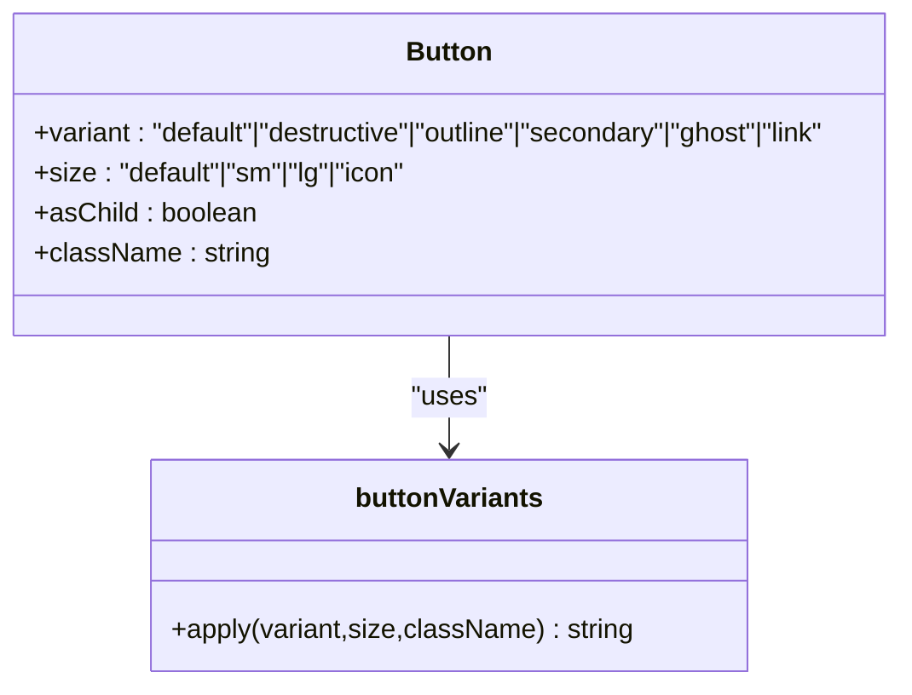

**Diagram sources**
- [button.tsx](file://components/ui/button.tsx)

**Section sources**
- [button.tsx](file://components/ui/button.tsx)

### Input
- Purpose: Text input with focus ring, disabled state, and placeholder styling.
- Props: Inherits standard input attributes.
- Accessibility: Focus-visible ring and disabled cursor.
- Styling: Tailwind utilities for padding, border, and ring tokens.

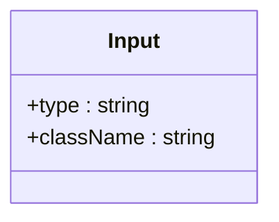

**Diagram sources**
- [input.tsx](file://components/ui/input.tsx)

**Section sources**
- [input.tsx](file://components/ui/input.tsx)

### Card
- Purpose: Container for content with header, title, description, content, and footer.
- Slots: Card, CardHeader, CardTitle, CardDescription, CardContent, CardFooter.
- Styling: Uses card and foreground tokens; spacing via padding and flex utilities.

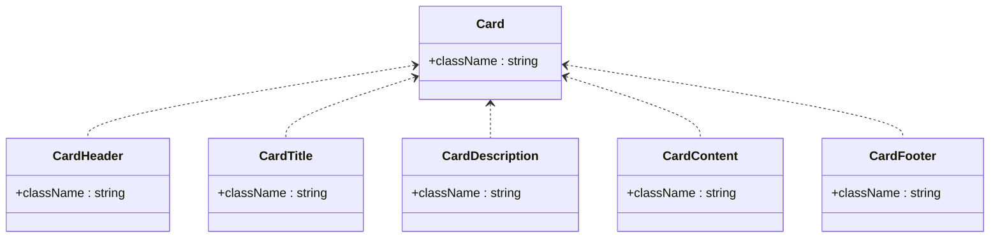

**Diagram sources**
- [card.tsx](file://components/ui/card.tsx)

**Section sources**
- [card.tsx](file://components/ui/card.tsx)

### Dialog
- Purpose: Modal overlay with animated entrance/exit and close button.
- Parts: Root, Trigger, Portal, Overlay, Content, Header, Footer, Title, Description.
- Behavior: Overlay animates in/out; Content centers with portal rendering.
- Accessibility: Focus trapping and escape handling via Radix.

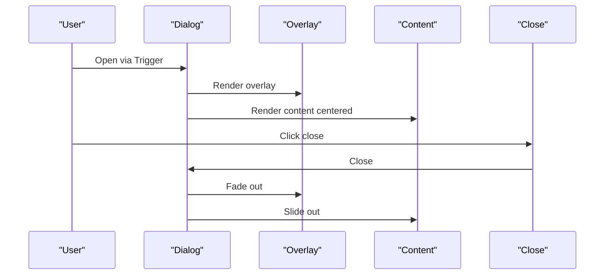

**Diagram sources**
- [dialog.tsx](file://components/ui/dialog.tsx)

**Section sources**
- [dialog.tsx](file://components/ui/dialog.tsx)

### Select
- Purpose: Dropdown selection with scrollable viewport and item indicators.
- Parts: Root, Group, Value, Trigger, Content, Label, Item, Separator, ScrollUp/Down buttons.
- Positioning: Popper offset classes applied conditionally.
- Accessibility: Keyboard navigation and focus management via Radix.

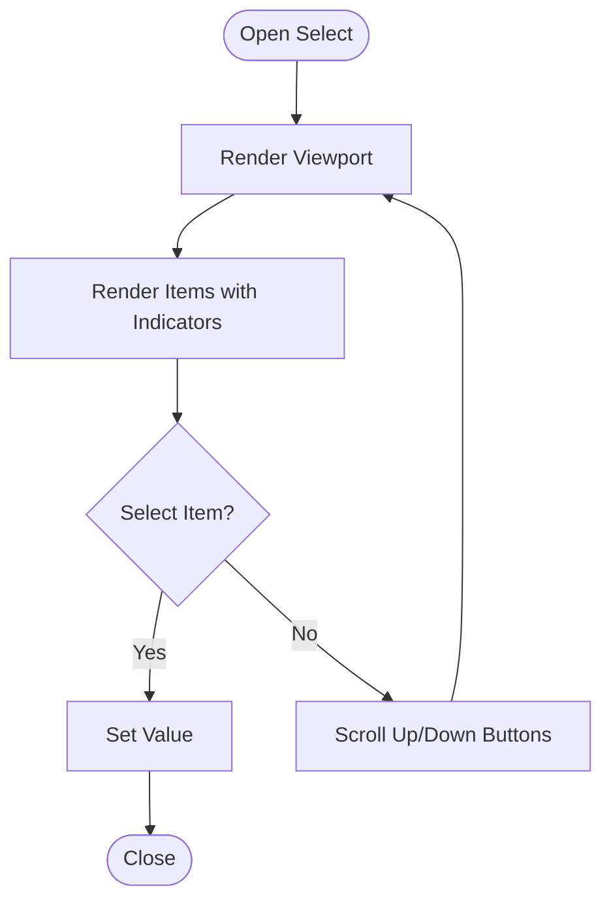

**Diagram sources**
- [select.tsx](file://components/ui/select.tsx)

**Section sources**
- [select.tsx](file://components/ui/select.tsx)

### Badge
- Purpose: Lightweight tag or status indicator.
- Props: variant: default | secondary | destructive | outline | success | warning
- Styling: CVA with border, color, and hover tokens.

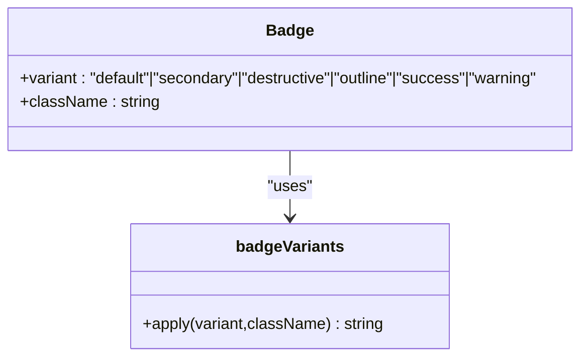

**Diagram sources**
- [badge.tsx](file://components/ui/badge.tsx)

**Section sources**
- [badge.tsx](file://components/ui/badge.tsx)

### Switch
- Purpose: Boolean toggle with thumb animation.
- Props: Inherits Switch root attributes; styled via data-state classes.
- Accessibility: Focus-visible ring and disabled state.

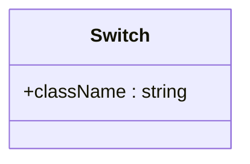

**Diagram sources**
- [switch.tsx](file://components/ui/switch.tsx)

**Section sources**
- [switch.tsx](file://components/ui/switch.tsx)

### Table
- Purpose: Scrollable table with semantic parts and hover/selected states.
- Parts: Table, TableHeader, TableBody, TableFooter, TableRow, TableHead, TableCell, TableCaption.
- Responsiveness: Wrapper ensures horizontal scrolling on small screens.

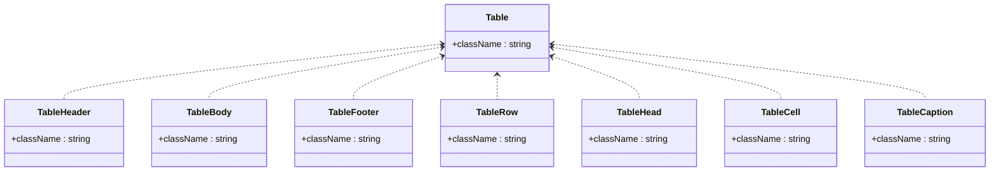

**Diagram sources**
- [table.tsx](file://components/ui/table.tsx)

**Section sources**
- [table.tsx](file://components/ui/table.tsx)

### Tabs
- Purpose: Tabbed interface with active state styling.
- Parts: Root, List, Trigger, Content.
- Accessibility: Active state via data-state attributes.

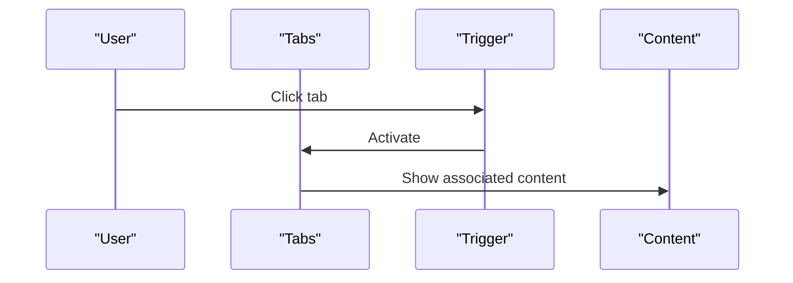

**Diagram sources**
- [tabs.tsx](file://components/ui/tabs.tsx)

**Section sources**
- [tabs.tsx](file://components/ui/tabs.tsx)

### Label
- Purpose: Accessible label for form controls.
- Props: Inherits Label root attributes; variant via CVA.
- Accessibility: Peer-disabled cursor and opacity.

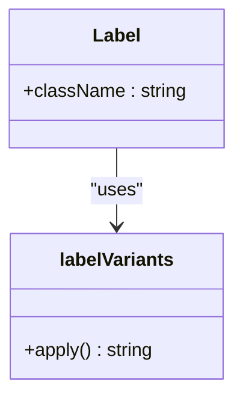

**Diagram sources**
- [label.tsx](file://components/ui/label.tsx)

**Section sources**
- [label.tsx](file://components/ui/label.tsx)

### Alert Dialog
- Purpose: Confirmation dialog with action and cancel buttons.
- Parts: Root, Portal, Overlay, Content, Header, Footer, Title, Description, Action, Cancel.
- Styling: Reuses Button variants for Action and Cancel.

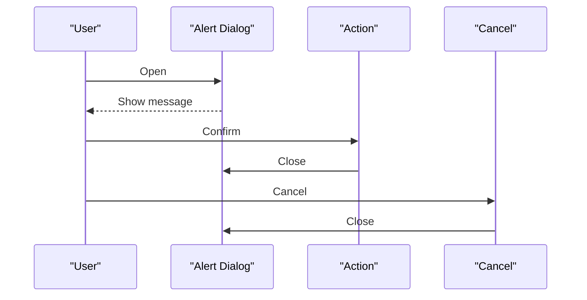

**Diagram sources**
- [alert-dialog.tsx](file://components/ui/alert-dialog.tsx)
- [button.tsx](file://components/ui/button.tsx)

**Section sources**
- [alert-dialog.tsx](file://components/ui/alert-dialog.tsx)
- [button.tsx](file://components/ui/button.tsx)

### Progress
- Purpose: Determinate progress indicator.
- Props: value number; indicator transforms based on percentage.
- Accessibility: No interactive state; relies on value semantics.

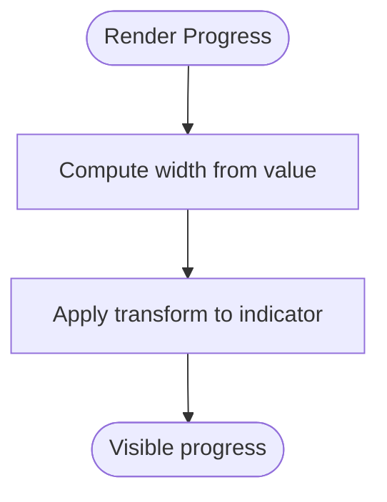

**Diagram sources**
- [progress.tsx](file://components/ui/progress.tsx)

**Section sources**
- [progress.tsx](file://components/ui/progress.tsx)

### Loading Bar
- Purpose: Global slim progress bar during navigation.
- State: Tracks loading and progress; resets on route change.
- Effects: Simulates progress with intervals; fades out after route completion.

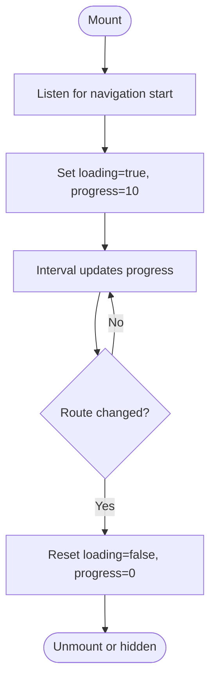

**Diagram sources**
- [loading-bar.tsx](file://components/ui/loading-bar.tsx)

**Section sources**
- [loading-bar.tsx](file://components/ui/loading-bar.tsx)

### Navigation Progress
- Purpose: Top progress bar and optional overlay during navigation.
- State: Manages navigating flag and progress; intercepts internal link clicks.
- Effects: Smooth width transitions; fades out after completion.

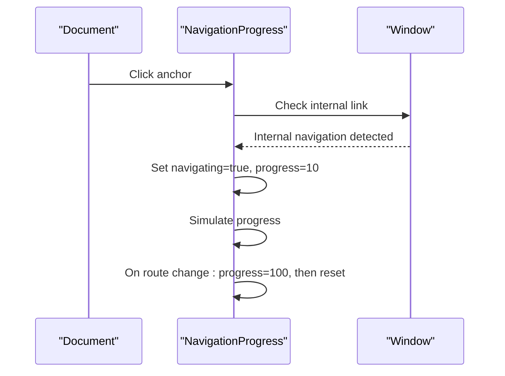

**Diagram sources**
- [navigation-progress.tsx](file://components/ui/navigation-progress.tsx)

**Section sources**
- [navigation-progress.tsx](file://components/ui/navigation-progress.tsx)

### Toast System
- Provider: Manages toast queue and viewport.
- Components: Toast, Title, Description, Action, Close.
- Variants: default | destructive.
- Interactions: Swipe-to-dismiss, hover opacity, close button.

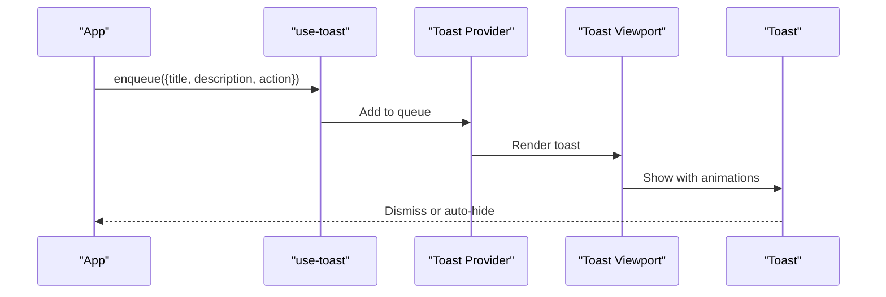

**Diagram sources**
- [toast.tsx](file://components/ui/toast.tsx)
- [use-toast.ts](file://components/ui/use-toast.ts)
- [toaster.tsx](file://components/ui/toaster.tsx)

**Section sources**
- [toast.tsx](file://components/ui/toast.tsx)
- [use-toast.ts](file://components/ui/use-toast.ts)
- [toaster.tsx](file://components/ui/toaster.tsx)

### Enhanced Component Ecosystem

#### Avatar
- Purpose: User profile image with fallback initials and accessibility support.
- Components: Avatar, AvatarImage, AvatarFallback.
- Props: Inherits AvatarPrimitive attributes; AvatarFallback supports custom styling.
- Accessibility: Proper alt text handling and fallback rendering.
- Styling: Circular container with aspect-square image and muted background fallback.

#### Popover
- Purpose: Contextual overlay with trigger and content areas.
- Components: Popover, PopoverTrigger, PopoverContent.
- Props: Align and sideOffset for positioning; Portal rendering for overlay isolation.
- Animation: Smooth fade and zoom transitions with data-state attributes.
- Accessibility: Focus management and keyboard navigation support.

#### Separator
- Purpose: Visual divider for organizing content sections.
- Props: orientation (horizontal/vertical), decorative flag, and accessibility support.
- Styling: Thin border with appropriate dimensions based on orientation.

**Section sources**
- [avatar.tsx](file://components/ui/avatar.tsx)
- [popover.tsx](file://components/ui/popover.tsx)
- [separator.tsx](file://components/ui/separator.tsx)

## Enhanced Component Ecosystem
The integration of Avatar, Popover, and Separator components creates a cohesive foundation for user interface patterns throughout the application. The most prominent example is the UserProfile component, which demonstrates how these three primitives work together to create sophisticated user interface patterns.

### UserProfile Component Integration
The UserProfile component showcases the enhanced component ecosystem in action:
- **Avatar Usage**: Displays user initials as fallback when images fail to load
- **Popover Integration**: Creates dropdown menus with contextual positioning
- **Separator Implementation**: Organizes menu items with visual dividers
- **Responsive Design**: Adapts avatar sizes and layout based on different UI contexts

```mermaid
graph TB
subgraph "UserProfile Ecosystem"
UP["UserProfile.tsx"]
AV["Avatar"]
POV["Popover"]
SEP["Separator"]
END
subgraph "Usage Patterns"
UP --> AV
UP --> POV
UP --> SEP
AV --> UP
POV --> UP
SEP --> UP
END
```

**Diagram sources**
- [UserProfile.tsx](file://components/layout/UserProfile.tsx)
- [avatar.tsx](file://components/ui/avatar.tsx)
- [popover.tsx](file://components/ui/popover.tsx)
- [separator.tsx](file://components/ui/separator.tsx)

**Section sources**
- [UserProfile.tsx](file://components/layout/UserProfile.tsx)
- [avatar.tsx](file://components/ui/avatar.tsx)
- [popover.tsx](file://components/ui/popover.tsx)
- [separator.tsx](file://components/ui/separator.tsx)

## Dependency Analysis
- **Radix UI**: Used across Dialog, Select, Tabs, Toast, Alert Dialog, Progress, Switch, Label, Avatar, Popover, and Separator to ensure accessible behavior.
- **Tailwind CSS**: Applied via cn() merges and CVA variants; theme tokens drive colors and spacing.
- **Next.js Navigation**: Loading bars use usePathname and useSearchParams for route-aware behavior.
- **Composition**: asChild enables wrapping components (e.g., Button inside Link) while preserving styles.
- **Enhanced Ecosystem**: Avatar, Popover, and Separator form foundational components that support complex UI patterns.

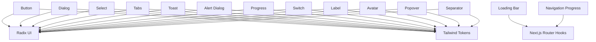

**Diagram sources**
- [button.tsx](file://components/ui/button.tsx)
- [dialog.tsx](file://components/ui/dialog.tsx)
- [select.tsx](file://components/ui/select.tsx)
- [tabs.tsx](file://components/ui/tabs.tsx)
- [toast.tsx](file://components/ui/toast.tsx)
- [alert-dialog.tsx](file://components/ui/alert-dialog.tsx)
- [progress.tsx](file://components/ui/progress.tsx)
- [switch.tsx](file://components/ui/switch.tsx)
- [label.tsx](file://components/ui/label.tsx)
- [avatar.tsx](file://components/ui/avatar.tsx)
- [popover.tsx](file://components/ui/popover.tsx)
- [separator.tsx](file://components/ui/separator.tsx)
- [loading-bar.tsx](file://components/ui/loading-bar.tsx)
- [navigation-progress.tsx](file://components/ui/navigation-progress.tsx)

**Section sources**
- [button.tsx](file://components/ui/button.tsx)
- [dialog.tsx](file://components/ui/dialog.tsx)
- [select.tsx](file://components/ui/select.tsx)
- [tabs.tsx](file://components/ui/tabs.tsx)
- [toast.tsx](file://components/ui/toast.tsx)
- [alert-dialog.tsx](file://components/ui/alert-dialog.tsx)
- [progress.tsx](file://components/ui/progress.tsx)
- [switch.tsx](file://components/ui/switch.tsx)
- [label.tsx](file://components/ui/label.tsx)
- [avatar.tsx](file://components/ui/avatar.tsx)
- [popover.tsx](file://components/ui/popover.tsx)
- [separator.tsx](file://components/ui/separator.tsx)
- [loading-bar.tsx](file://components/ui/loading-bar.tsx)
- [navigation-progress.tsx](file://components/ui/navigation-progress.tsx)

## Performance Considerations
- Prefer CVA variants for consistent, cache-friendly class generation.
- Use minimal re-renders by passing stable refs and avoiding unnecessary prop churn.
- For navigation indicators, throttle progress updates to reduce layout thrash.
- Keep portal-rendered overlays scoped to z-index ranges to avoid stacking conflicts.
- Avoid heavy inline styles; rely on Tailwind utilities and theme tokens.
- **Enhanced**: Avatar, Popover, and Separator components are lightweight primitives that minimize performance overhead while providing rich functionality.

## Troubleshooting Guide
- Dialog/Select/Alert Dialog not closing:
  - Ensure Close or Cancel triggers are present and reachable via keyboard.
  - Verify Portal rendering and overlay click handlers.
- Select items not selectable:
  - Confirm Item is within Viewport and not disabled.
  - Check data-state classes and item indicators.
- Button styles not applying:
  - Verify variant and size combinations match CVA definitions.
  - Ensure className merging does not override critical tokens.
- Toast not visible:
  - Confirm Provider wraps the app and Viewport is rendered.
  - Check z-index and viewport positioning.
- Navigation progress not appearing:
  - Ensure NavigationProgress is mounted and internal link detection conditions match.
  - Verify route change effects are firing.
- **Enhanced**: Avatar fallback not displaying:
  - Verify AvatarFallback component is properly wrapped and receives className props.
  - Check for image load errors and network connectivity issues.
- **Enhanced**: Popover content not positioned correctly:
  - Adjust align and sideOffset props based on available space.
  - Ensure PopoverTrigger is wrapped with asChild for proper event handling.
- **Enhanced**: Separator not visible:
  - Verify orientation prop matches the intended layout direction.
  - Check decorative flag and accessibility considerations.

**Section sources**
- [dialog.tsx](file://components/ui/dialog.tsx)
- [select.tsx](file://components/ui/select.tsx)
- [alert-dialog.tsx](file://components/ui/alert-dialog.tsx)
- [button.tsx](file://components/ui/button.tsx)
- [toast.tsx](file://components/ui/toast.tsx)
- [navigation-progress.tsx](file://components/ui/navigation-progress.tsx)
- [avatar.tsx](file://components/ui/avatar.tsx)
- [popover.tsx](file://components/ui/popover.tsx)
- [separator.tsx](file://components/ui/separator.tsx)

## Conclusion
InfraScope's UI component library emphasizes accessibility, composability, and consistent styling through Radix UI and Tailwind CSS. The enhanced component ecosystem, particularly the integration of Avatar, Popover, and Separator components, provides a solid foundation for building sophisticated user interfaces. The systematic updates to Radix UI component versions (Avatar 1.1.12, Popover 1.1.16, Separator 1.1.9) improve overall UI consistency and accessibility throughout the application. By leveraging CVA variants, portal rendering, and theme tokens, components remain flexible, maintainable, and easy to extend while providing robust user experience patterns.

## Appendices

### Styling Approach and Theme Tokens
- Tailwind configuration and component registry:
  - Tailwind configuration defines theme tokens and plugin behavior.
  - Components.json registers local component sets for tooling.
- Theme tokens:
  - Primary, secondary, muted, destructive, border, input, ring, and foreground tokens are used across components.
- Utility merging:
  - cn() consolidates default classes with overrides safely.

**Section sources**
- [tailwind.config.js](file://tailwind.config.js)
- [components.json](file://components.json)
- [globals.css](file://app/globals.css)

### Responsive Design Principles
- Mobile-first utilities: Use responsive prefixes to scale padding, margin, and typography.
- Scrollable containers: Wrap wide tables and modals to prevent overflow.
- Overlay placement: Centered content with translate and max-width constraints.
- **Enhanced**: Avatar components adapt sizing across different contexts (compact, collapsed, expanded modes).

**Section sources**
- [table.tsx](file://components/ui/table.tsx)
- [dialog.tsx](file://components/ui/dialog.tsx)
- [select.tsx](file://components/ui/select.tsx)
- [UserProfile.tsx](file://components/layout/UserProfile.tsx)

### Cross-Browser Compatibility
- Radix primitives provide cross-browser keyboard and focus behavior.
- Tailwind utilities are transpiled via PostCSS; ensure browserlist targets are configured.
- Avoid vendor-prefixed CSS; rely on Tailwind utilities and Radix animations.
- **Enhanced**: Updated Radix UI versions provide improved cross-browser compatibility and accessibility features.

**Section sources**
- [button.tsx](file://components/ui/button.tsx)
- [tabs.tsx](file://components/ui/tabs.tsx)
- [toast.tsx](file://components/ui/toast.tsx)
- [avatar.tsx](file://components/ui/avatar.tsx)
- [popover.tsx](file://components/ui/popover.tsx)
- [separator.tsx](file://components/ui/separator.tsx)

### Extending Components and Creating New Components
- Follow the CVA pattern for variants and sizes.
- Compose Radix primitives for accessibility and state.
- Use cn() to merge defaults with overrides.
- Export a forwardRef component with displayName for debugging.
- Add tests for interaction states and keyboard navigation.
- **Enhanced**: Leverage Avatar, Popover, and Separator as foundational components for new UI patterns.

**Section sources**
- [button.tsx](file://components/ui/button.tsx)
- [card.tsx](file://components/ui/card.tsx)
- [tabs.tsx](file://components/ui/tabs.tsx)
- [avatar.tsx](file://components/ui/avatar.tsx)
- [popover.tsx](file://components/ui/popover.tsx)
- [separator.tsx](file://components/ui/separator.tsx)

### Best Practices for Component Testing and Documentation
- Test accessibility: keyboard navigation, focus order, ARIA roles.
- Test variants and sizes: render each combination and assert class presence.
- Test interactions: open/close dialogs, select items, toggle switches, navigate tabs.
- Document props: include union types and default values.
- Document variants: list all options and describe visual differences.
- Document composition: explain asChild usage and Slot wrapping.
- **Enhanced**: Test Avatar fallback behavior, Popover positioning, and Separator orientation in different contexts.

**Section sources**
- [dialog.tsx](file://components/ui/dialog.tsx)
- [select.tsx](file://components/ui/select.tsx)
- [tabs.tsx](file://components/ui/tabs.tsx)
- [badge.tsx](file://components/ui/badge.tsx)
- [switch.tsx](file://components/ui/switch.tsx)
- [table.tsx](file://components/ui/table.tsx)
- [label.tsx](file://components/ui/label.tsx)
- [alert-dialog.tsx](file://components/ui/alert-dialog.tsx)
- [progress.tsx](file://components/ui/progress.tsx)
- [loading-bar.tsx](file://components/ui/loading-bar.tsx)
- [navigation-progress.tsx](file://components/ui/navigation-progress.tsx)
- [toast.tsx](file://components/ui/toast.tsx)
- [toaster.tsx](file://components/ui/toaster.tsx)
- [use-toast.ts](file://components/ui/use-toast.ts)
- [avatar.tsx](file://components/ui/avatar.tsx)
- [popover.tsx](file://components/ui/popover.tsx)
- [separator.tsx](file://components/ui/separator.tsx)

### Dependency Version Updates
**Updated Dependencies**:
- @radix-ui/react-avatar: 1.1.11 → 1.1.12
- @radix-ui/react-popover: 1.1.15 → 1.1.16
- @radix-ui/react-separator: 1.1.8 → 1.1.9

These updates provide improved accessibility, performance optimizations, and bug fixes that cascade through the entire component ecosystem, enhancing the overall user experience and developer productivity.

**Section sources**
- [package.json](file://package.json)