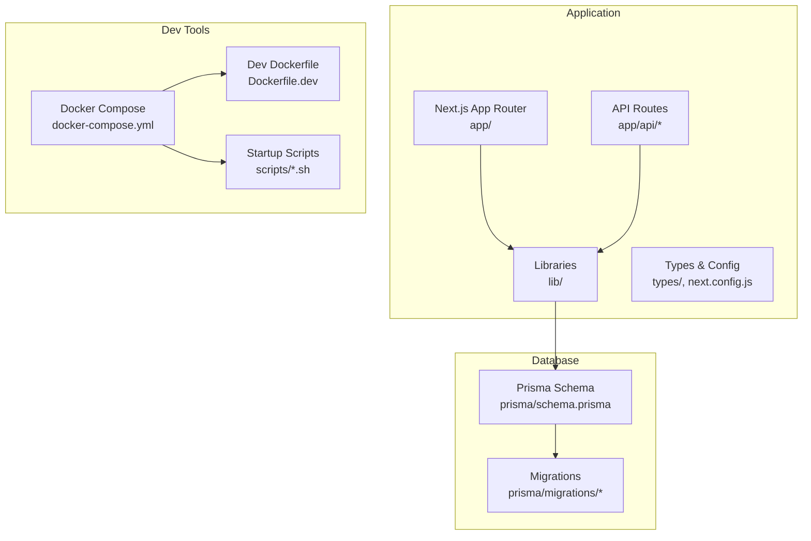
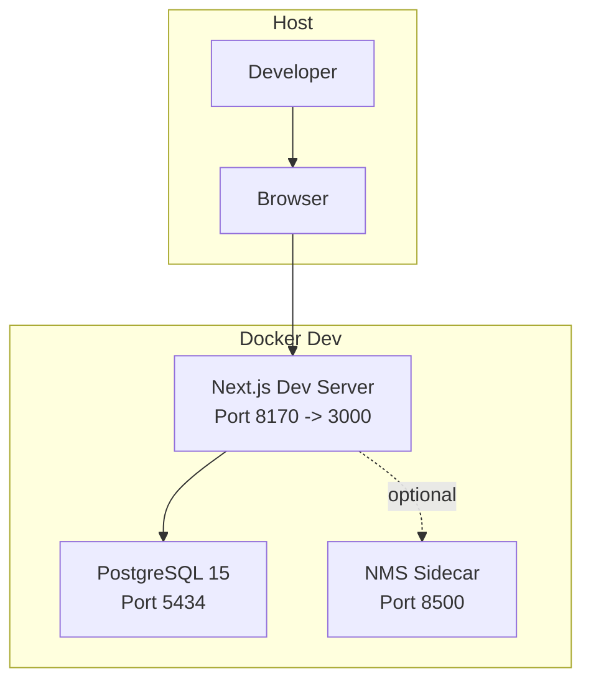
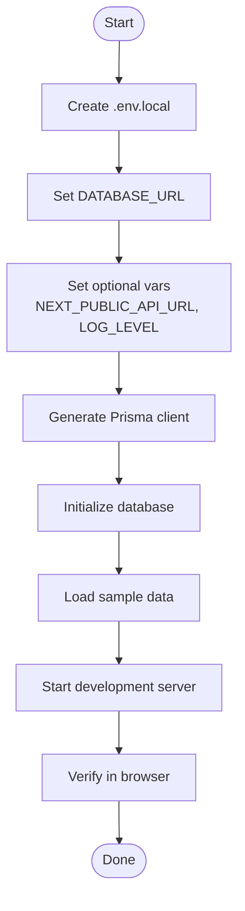
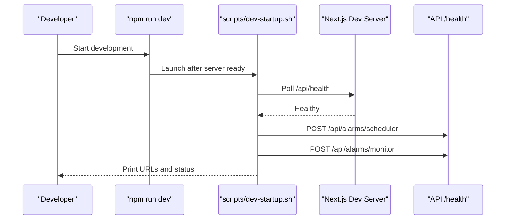
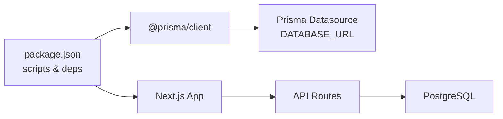

# Getting Started

<cite>
**Referenced Files in This Document**
- [README.md](file://README.md)
- [QUICK_START.md](file://QUICK_START.md)
- [package.json](file://package.json)
- [prisma/schema.prisma](file://prisma/schema.prisma)
- [lib/prisma.ts](file://lib/prisma.ts)
- [next.config.js](file://next.config.js)
- [docker-compose.yml](file://docker-compose.yml)
- [Dockerfile.dev](file://Dockerfile.dev)
- [scripts/entrypoint.sh](file://scripts/entrypoint.sh)
- [scripts/dev-startup.sh](file://scripts/dev-startup.sh)
- [scripts/wait-for-db.sh](file://scripts/wait-for-db.sh)
</cite>

## Table of Contents
1. [Introduction](#introduction)
2. [Project Structure](#project-structure)
3. [Core Components](#core-components)
4. [Architecture Overview](#architecture-overview)
5. [Detailed Component Analysis](#detailed-component-analysis)
6. [Dependency Analysis](#dependency-analysis)
7. [Performance Considerations](#performance-considerations)
8. [Troubleshooting Guide](#troubleshooting-guide)
9. [Conclusion](#conclusion)
10. [Appendices](#appendices)

## Introduction
This Getting Started guide accelerates your onboarding to InfraScope. It covers prerequisites, installation from cloning to database initialization and sample data loading, environment configuration, development server startup, and verification steps. It also documents essential commands for development workflow and provides troubleshooting advice for common setup issues.

## Project Structure
InfraScope is a Next.js 14 application with a PostgreSQL backend managed by Prisma. The repository includes:
- Frontend pages under app/ using Next.js App Router
- API routes under app/api/*
- Prisma schema and migrations under prisma/
- Shared utilities under lib/
- Docker configuration for development under docker-compose.yml and Dockerfile.dev
- Scripts for development startup and database readiness under scripts/

**Diagram sources**
- [docker-compose.yml:1-153](file://docker-compose.yml#L1-L153)
- [Dockerfile.dev:1-51](file://Dockerfile.dev#L1-L51)
- [prisma/schema.prisma:1-800](file://prisma/schema.prisma#L1-L800)

**Section sources**
- [README.md:127-164](file://README.md#L127-L164)
- [docker-compose.yml:1-153](file://docker-compose.yml#L1-L153)
- [Dockerfile.dev:1-51](file://Dockerfile.dev#L1-L51)
- [prisma/schema.prisma:1-800](file://prisma/schema.prisma#L1-L800)

## Core Components
- Prisma Client singleton ensures a single database client instance across the app and supports optional query logging toggles.
- Next.js configuration enables standalone output, compression, caching headers for API routes, and optimized package imports.
- Docker Compose orchestrates PostgreSQL, the Next.js web app, and an NMS sidecar with health checks and persistent volumes.

**Section sources**
- [lib/prisma.ts:1-21](file://lib/prisma.ts#L1-L21)
- [next.config.js:1-62](file://next.config.js#L1-L62)
- [docker-compose.yml:1-153](file://docker-compose.yml#L1-L153)

## Architecture Overview
The development stack centers on Next.js serving frontend pages and API routes, connecting to PostgreSQL via Prisma. Docker Compose provisions the database and web app with hot reload and optional NMS integration.

**Diagram sources**
- [docker-compose.yml:5-153](file://docker-compose.yml#L5-L153)
- [Dockerfile.dev:1-51](file://Dockerfile.dev#L1-L51)

## Detailed Component Analysis

### Prerequisites
- Node.js 18 or higher
- PostgreSQL 12 or higher
- npm or yarn package manager

These requirements are enforced by the project’s technology stack and database provider.

**Section sources**
- [README.md:66-69](file://README.md#L66-L69)

### Installation Steps
Follow these steps to install and run InfraScope locally:

1. Clone or navigate to the repository directory.
2. Install dependencies.
3. Configure environment variables in .env.local with DATABASE_URL pointing to your PostgreSQL instance.
4. Generate the Prisma client.
5. Initialize the database schema.
6. Load sample data.
7. Start the development server.

Verification: Open the dashboard in your browser.

**Section sources**
- [README.md:71-98](file://README.md#L71-L98)
- [QUICK_START.md:10-40](file://QUICK_START.md#L10-L40)

### Environment Configuration
- Create .env.local and set DATABASE_URL to your PostgreSQL connection string.
- Optional: NEXT_PUBLIC_API_URL, NODE_ENV, APP_NAME, LOG_LEVEL.
- For development with Docker, environment variables are provided in docker-compose.yml and Dockerfile.dev.

**Diagram sources**
- [README.md:332-341](file://README.md#L332-L341)
- [docker-compose.yml:37-48](file://docker-compose.yml#L37-L48)
- [Dockerfile.dev:23-26](file://Dockerfile.dev#L23-L26)

**Section sources**
- [README.md:332-341](file://README.md#L332-L341)
- [docker-compose.yml:37-48](file://docker-compose.yml#L37-L48)
- [Dockerfile.dev:23-26](file://Dockerfile.dev#L23-L26)

### Development Server Startup and Verification
- Local development: npm run dev starts the Next.js dev server with hot reload and triggers alarm services after the server is ready.
- Docker development: docker compose up -d launches PostgreSQL, the web app, and the NMS sidecar; the entrypoint script handles migrations, seeding, and pre-warming routes.
- Verification: Visit the dashboard URL printed by the startup scripts.

**Diagram sources**
- [package.json:5-7](file://package.json#L5-L7)
- [scripts/dev-startup.sh:12-57](file://scripts/dev-startup.sh#L12-L57)

**Section sources**
- [package.json:5-7](file://package.json#L5-L7)
- [scripts/dev-startup.sh:12-57](file://scripts/dev-startup.sh#L12-L57)
- [scripts/entrypoint.sh:43-87](file://scripts/entrypoint.sh#L43-L87)

### Essential Commands for Development Workflow
- Development: npm run dev, npm run build, npm run start, npm run lint, npm run type-check
- Database: npm run db:migrate, npm run db:push, npm run db:seed, npm run db:studio

These commands are defined in package.json and complement Prisma operations.

**Section sources**
- [package.json:5-14](file://package.json#L5-L14)
- [README.md:194-209](file://README.md#L194-L209)

### Database Initialization and Sample Data
- Prisma client generation: npx prisma generate
- Database schema push: npx prisma db push
- Sample data load: npm run db:seed

The Prisma schema defines the database model and relationships.

**Section sources**
- [README.md:84-91](file://README.md#L84-L91)
- [prisma/schema.prisma:1-800](file://prisma/schema.prisma#L1-L800)

### Docker-Based Development (Alternative)
- Build and start services: docker compose build, docker compose up -d
- View logs: docker compose logs -f web
- Execute commands inside containers: docker compose exec web npm run db:push
- Stop services: docker compose down

The Dockerfile.dev installs Python and Prisma, generates the client, and starts the dev server.

**Section sources**
- [DEV_WORKFLOW.md:5-32](file://DEV_WORKFLOW.md#L5-L32)
- [docker-compose.yml:1-153](file://docker-compose.yml#L1-L153)
- [Dockerfile.dev:1-51](file://Dockerfile.dev#L1-L51)

## Dependency Analysis
- Application dependencies include Next.js, Prisma Client, and UI libraries.
- Prisma datasource reads DATABASE_URL from environment variables.
- Next.js configuration controls caching headers for API routes and transpilation for 3D libraries.

**Diagram sources**
- [package.json:16-69](file://package.json#L16-L69)
- [prisma/schema.prisma:5-8](file://prisma/schema.prisma#L5-L8)
- [next.config.js:19-47](file://next.config.js#L19-L47)

**Section sources**
- [package.json:16-69](file://package.json#L16-L69)
- [prisma/schema.prisma:5-8](file://prisma/schema.prisma#L5-L8)
- [next.config.js:19-47](file://next.config.js#L19-L47)

## Performance Considerations
- Next.js caching headers are configured for API routes to improve performance.
- Standalone output and compression are enabled for production builds.
- Transpilation optimizations are applied for 3D-related packages.

**Section sources**
- [next.config.js:19-58](file://next.config.js#L19-L58)

## Troubleshooting Guide
Common setup issues and resolutions:

- PostgreSQL connection problems:
  - Create the database if it does not exist.
  - Test connectivity with psql.
- Prisma client not found:
  - Regenerate the client.
  - Reinstall dependencies if needed.
- Port already in use:
  - Change the port when starting the dev server.
- TypeScript errors:
  - Run type checking and rebuild after clearing caches.
- Docker-specific:
  - Ensure services are healthy and logs are checked.
  - Rebuild containers if Dockerfile.dev changes.
  - Execute commands inside the web container for database operations.

**Section sources**
- [README.md:357-392](file://README.md#L357-L392)
- [QUICK_START.md:152-178](file://QUICK_START.md#L152-L178)
- [DEV_WORKFLOW.md:54-106](file://DEV_WORKFLOW.md#L54-L106)

## Conclusion
You are now equipped to install InfraScope, configure the environment, initialize the database, load sample data, and start the development server. Use the documented commands and verification steps to ensure a smooth setup. Refer to the troubleshooting section for quick fixes and consult the linked documentation files for deeper insights.

## Appendices

### Verification Checklist
- Dependencies installed
- .env.local configured with DATABASE_URL
- Prisma client generated
- Database initialized and seeded
- Development server running and accessible
- Alarm services started (when applicable)

**Section sources**
- [README.md:71-98](file://README.md#L71-L98)
- [scripts/dev-startup.sh:30-57](file://scripts/dev-startup.sh#L30-L57)