# Capacity Planning & Utilization

<cite>
**Referenced Files in This Document**
- [app/infrastructure/capacity/page.tsx](file://app/infrastructure/capacity/page.tsx)
- [app/analytics/capacity/page.tsx](file://app/analytics/capacity/page.tsx)
- [app/analytics/forecast/page.tsx](file://app/analytics/forecast/page.tsx)
- [app/reports/page.tsx](file://app/reports/page.tsx)
- [lib/reports/reports-service.ts](file://lib/reports/reports-service.ts)
- [lib/prisma.ts](file://lib/prisma.ts)
- [prisma/schema.prisma](file://prisma/schema.prisma)
- [app/api/integrations/vmware/route.ts](file://app/api/integrations/vmware/route.ts)
- [lib/alarms/detection-engine.ts](file://lib/alarms/detection-engine.ts)
- [app/api/racks/[id]/route.ts](file://app/api/racks/[id]/route.ts)
- [app/api/devices/[id]/route.ts](file://app/api/devices/[id]/route.ts)
</cite>

## Table of Contents
1. [Introduction](#introduction)
2. [Project Structure](#project-structure)
3. [Core Components](#core-components)
4. [Architecture Overview](#architecture-overview)
5. [Detailed Component Analysis](#detailed-component-analysis)
6. [Dependency Analysis](#dependency-analysis)
7. [Performance Considerations](#performance-considerations)
8. [Troubleshooting Guide](#troubleshooting-guide)
9. [Conclusion](#conclusion)
10. [Appendices](#appendices)

## Introduction
This document explains how Infrascope implements capacity planning and infrastructure utilization monitoring. It covers capacity metrics computation (rack utilization, power, and cooling), real-time dashboards, forecasting workflows, integration with analytics modules, and alerting mechanisms. Practical examples demonstrate capacity forecasting, trend analysis, and optimization strategies grounded in the repository’s frontend pages, backend APIs, and data models.

## Project Structure
The capacity planning and monitoring functionality spans:
- Frontend dashboards for real-time capacity and analytics
- Backend API endpoints for VMware metrics and forecasting
- Reports service aggregating inventory, capacity, and VMware data
- Data models supporting capacity metrics and infrastructure entities
- Alarm detection engine for threshold-based alerts

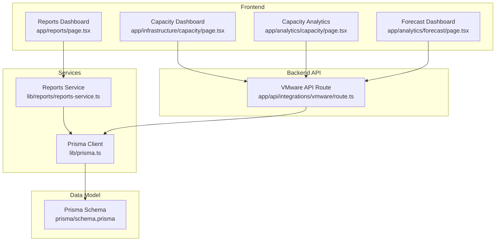

**Diagram sources**
- [app/infrastructure/capacity/page.tsx:1-273](file://app/infrastructure/capacity/page.tsx#L1-L273)
- [app/analytics/capacity/page.tsx:1-258](file://app/analytics/capacity/page.tsx#L1-L258)
- [app/analytics/forecast/page.tsx:1-264](file://app/analytics/forecast/page.tsx#L1-L264)
- [app/reports/page.tsx:1-522](file://app/reports/page.tsx#L1-L522)
- [app/api/integrations/vmware/route.ts:1-200](file://app/api/integrations/vmware/route.ts#L1-L200)
- [lib/reports/reports-service.ts:1-426](file://lib/reports/reports-service.ts#L1-L426)
- [lib/prisma.ts:1-21](file://lib/prisma.ts#L1-L21)
- [prisma/schema.prisma:1-800](file://prisma/schema.prisma#L1-L800)

**Section sources**
- [app/infrastructure/capacity/page.tsx:1-273](file://app/infrastructure/capacity/page.tsx#L1-L273)
- [app/analytics/capacity/page.tsx:1-258](file://app/analytics/capacity/page.tsx#L1-L258)
- [app/analytics/forecast/page.tsx:1-264](file://app/analytics/forecast/page.tsx#L1-L264)
- [app/reports/page.tsx:1-522](file://app/reports/page.tsx#L1-L522)
- [lib/reports/reports-service.ts:1-426](file://lib/reports/reports-service.ts#L1-L426)
- [lib/prisma.ts:1-21](file://lib/prisma.ts#L1-L21)
- [prisma/schema.prisma:1-800](file://prisma/schema.prisma#L1-L800)

## Core Components
- Capacity dashboards: Real-time visuals for power, cooling, compute, and storage utilization.
- Capacity analytics: Trend analysis and summary cards for CPU, memory, and disk usage.
- Forecasting: Linear regression-based projections for upcoming capacity needs.
- Reports service: Aggregates inventory, capacity, VMware, and alert data for dashboards.
- Data models: Define racks, rooms, devices, and capacity metrics for historical tracking.

**Section sources**
- [app/infrastructure/capacity/page.tsx:17-273](file://app/infrastructure/capacity/page.tsx#L17-L273)
- [app/analytics/capacity/page.tsx:28-258](file://app/analytics/capacity/page.tsx#L28-L258)
- [app/analytics/forecast/page.tsx:31-264](file://app/analytics/forecast/page.tsx#L31-L264)
- [lib/reports/reports-service.ts:65-225](file://lib/reports/reports-service.ts#L65-L225)
- [prisma/schema.prisma:714-727](file://prisma/schema.prisma#L714-L727)

## Architecture Overview
The system integrates frontend dashboards with backend APIs and a PostgreSQL data store via Prisma. Historical capacity metrics are stored and queried to compute utilization and forecasts. Alerts are evaluated against thresholds and integrated with external systems.

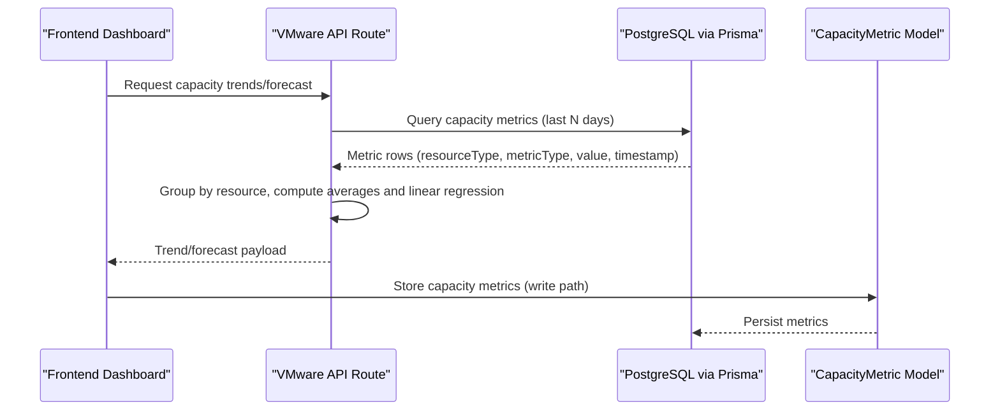

**Diagram sources**
- [app/analytics/capacity/page.tsx:34-58](file://app/analytics/capacity/page.tsx#L34-L58)
- [app/analytics/forecast/page.tsx:36-60](file://app/analytics/forecast/page.tsx#L36-L60)
- [app/api/integrations/vmware/route.ts:26-96](file://app/api/integrations/vmware/route.ts#L26-L96)
- [prisma/schema.prisma:714-727](file://prisma/schema.prisma#L714-L727)

## Detailed Component Analysis

### Capacity Dashboards
Real-time dashboards present power, cooling, compute, and storage utilization with color-coded status indicators and summary cards.

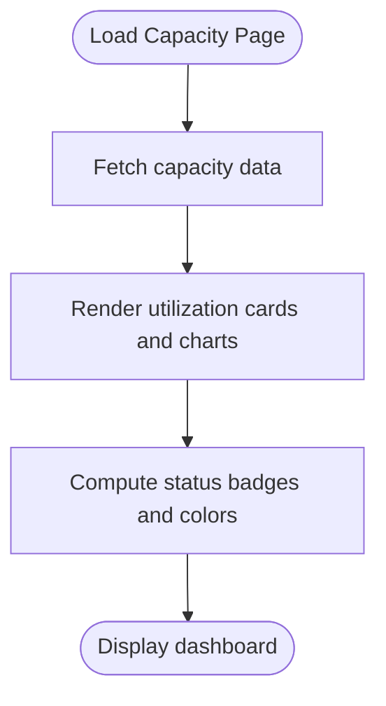

**Diagram sources**
- [app/infrastructure/capacity/page.tsx:17-273](file://app/infrastructure/capacity/page.tsx#L17-L273)

**Section sources**
- [app/infrastructure/capacity/page.tsx:17-273](file://app/infrastructure/capacity/page.tsx#L17-L273)

### Capacity Analytics
The analytics page aggregates VMware metrics, computes averages, and displays trends with status badges and icons.

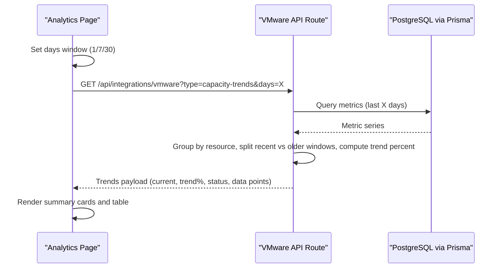

**Diagram sources**
- [app/analytics/capacity/page.tsx:28-116](file://app/analytics/capacity/page.tsx#L28-L116)
- [app/analytics/capacity/page.tsx:190-257](file://app/analytics/capacity/page.tsx#L190-L257)
- [app/api/integrations/vmware/route.ts:26-71](file://app/api/integrations/vmware/route.ts#L26-L71)

**Section sources**
- [app/analytics/capacity/page.tsx:28-258](file://app/analytics/capacity/page.tsx#L28-L258)
- [app/api/integrations/vmware/route.ts:26-71](file://app/api/integrations/vmware/route.ts#L26-L71)

### Capacity Forecasting
Forecasting uses linear regression on recent historical data to predict future utilization and flag potential capacity issues.

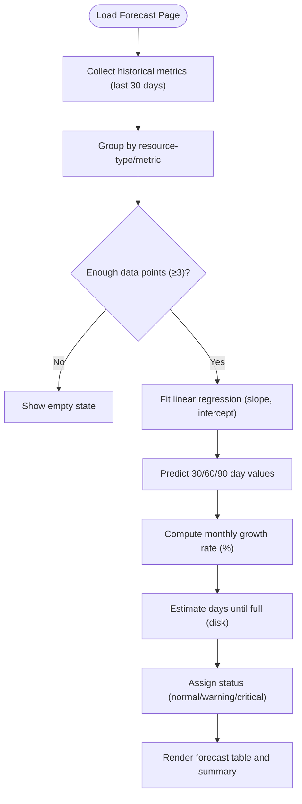

**Diagram sources**
- [app/analytics/forecast/page.tsx:31-264](file://app/analytics/forecast/page.tsx#L31-L264)
- [app/analytics/forecast/page.tsx:166-261](file://app/analytics/forecast/page.tsx#L166-L261)
- [app/api/integrations/vmware/route.ts:74-160](file://app/api/integrations/vmware/route.ts#L74-L160)

**Section sources**
- [app/analytics/forecast/page.tsx:31-264](file://app/analytics/forecast/page.tsx#L31-L264)
- [app/api/integrations/vmware/route.ts:74-160](file://app/api/integrations/vmware/route.ts#L74-L160)

### Reports Service and Capacity Metrics
The Reports Service computes rack utilization, power, and cooling estimates, and aggregates VMware metrics for summary dashboards.

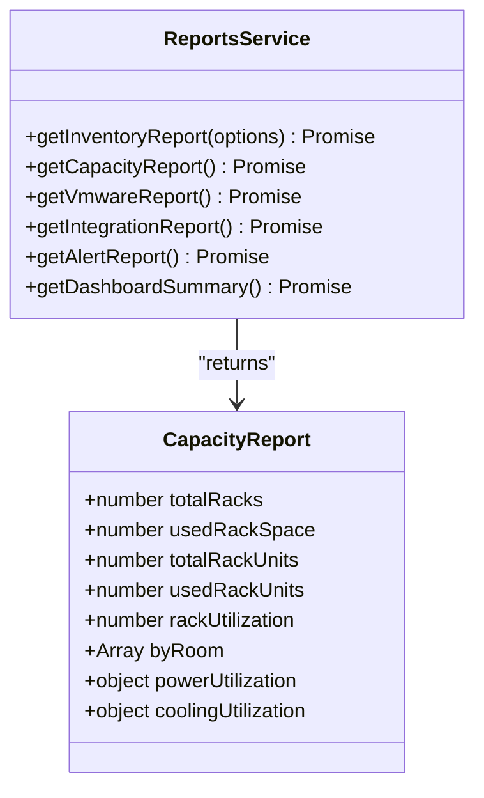

**Diagram sources**
- [lib/reports/reports-service.ts:65-225](file://lib/reports/reports-service.ts#L65-L225)
- [lib/reports/reports-service.ts:16-25](file://lib/reports/reports-service.ts#L16-L25)

**Section sources**
- [lib/reports/reports-service.ts:65-225](file://lib/reports/reports-service.ts#L65-L225)

### Data Model: Capacity Metrics
Historical capacity metrics are persisted to enable trend analysis and forecasting.

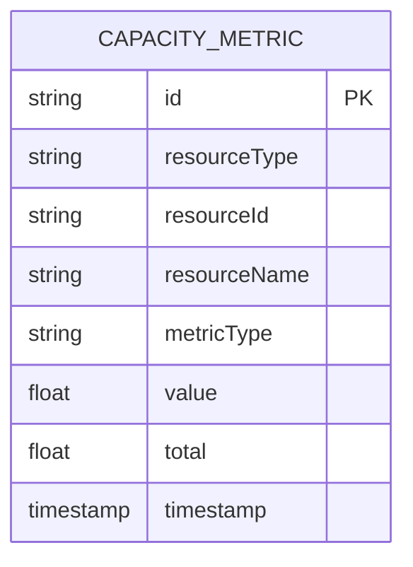

**Diagram sources**
- [prisma/schema.prisma:714-727](file://prisma/schema.prisma#L714-L727)

**Section sources**
- [prisma/schema.prisma:714-727](file://prisma/schema.prisma#L714-L727)

### Infrastructure Entities: Racks, Rooms, Devices
Capacity planning relies on rack and room dimensions, device placement, and device metadata.

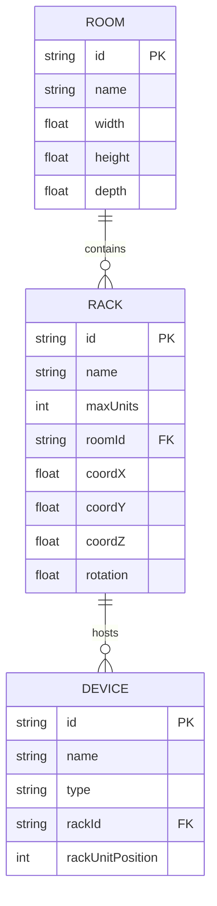

**Diagram sources**
- [prisma/schema.prisma:94-149](file://prisma/schema.prisma#L94-L149)
- [prisma/schema.prisma:112-129](file://prisma/schema.prisma#L112-L129)
- [prisma/schema.prisma:151-228](file://prisma/schema.prisma#L151-L228)

**Section sources**
- [prisma/schema.prisma:94-149](file://prisma/schema.prisma#L94-L149)
- [prisma/schema.prisma:112-129](file://prisma/schema.prisma#L112-L129)
- [prisma/schema.prisma:151-228](file://prisma/schema.prisma#L151-L228)

### API Endpoints for Capacity
Endpoints support retrieving rack details and device details, which feed capacity calculations and dashboards.

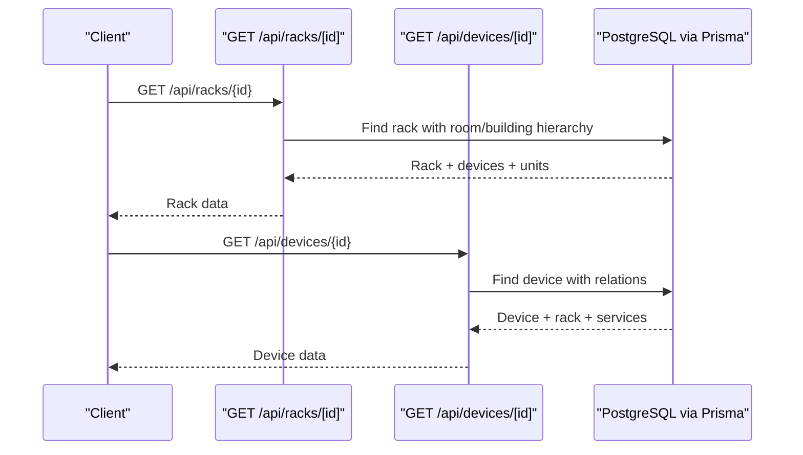

**Diagram sources**
- [app/api/racks/[id]/route.ts:18-115](file://app/api/racks/[id]/route.ts#L18-L115)
- [app/api/devices/[id]/route.ts:29-141](file://app/api/devices/[id]/route.ts#L29-L141)

**Section sources**
- [app/api/racks/[id]/route.ts:18-115](file://app/api/racks/[id]/route.ts#L18-L115)
- [app/api/devices/[id]/route.ts:29-141](file://app/api/devices/[id]/route.ts#L29-L141)

### Alerts and Threshold Monitoring
The alarm detection engine evaluates thresholds and generates alerts, integrating with external systems.

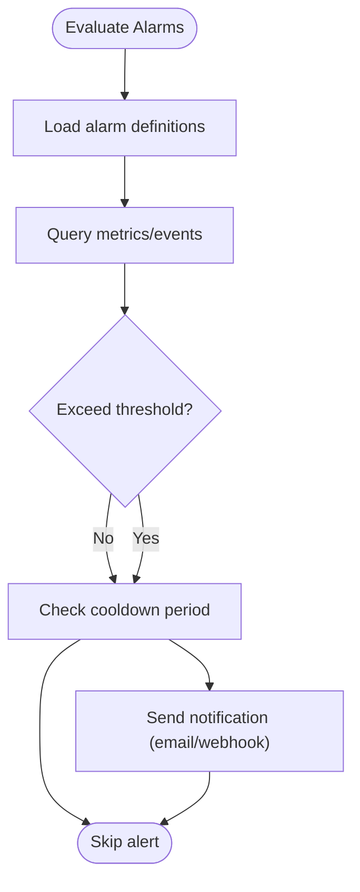

**Diagram sources**
- [lib/alarms/detection-engine.ts:3855-3880](file://lib/alarms/detection-engine.ts#L3855-L3880)

**Section sources**
- [lib/alarms/detection-engine.ts:3855-3880](file://lib/alarms/detection-engine.ts#L3855-L3880)

## Dependency Analysis
- Frontend dashboards depend on backend API routes for metrics and forecasts.
- Reports Service depends on Prisma for data aggregation and on the database schema for models.
- Capacity metrics are persisted via the CapacityMetric model and queried by API routes and Reports Service.
- Alarm detection engine integrates with external systems and uses Prisma for persistence.

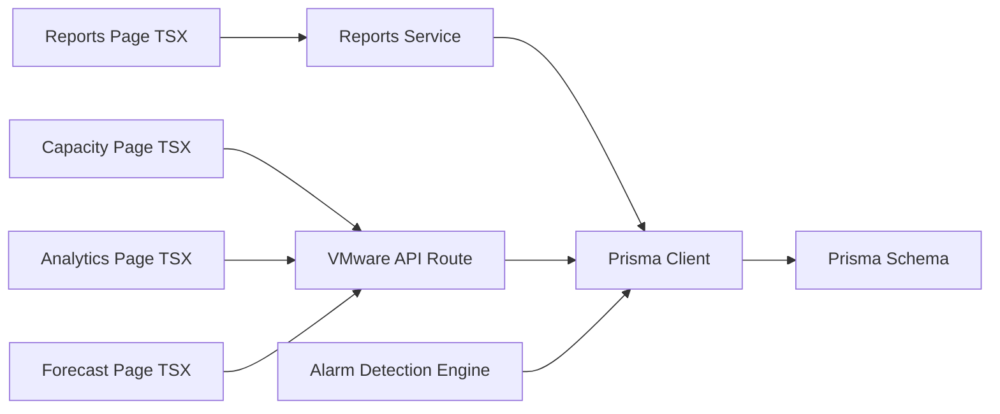

**Diagram sources**
- [app/infrastructure/capacity/page.tsx:1-273](file://app/infrastructure/capacity/page.tsx#L1-L273)
- [app/analytics/capacity/page.tsx:1-258](file://app/analytics/capacity/page.tsx#L1-L258)
- [app/analytics/forecast/page.tsx:1-264](file://app/analytics/forecast/page.tsx#L1-L264)
- [app/reports/page.tsx:1-522](file://app/reports/page.tsx#L1-L522)
- [lib/reports/reports-service.ts:1-426](file://lib/reports/reports-service.ts#L1-L426)
- [lib/prisma.ts:1-21](file://lib/prisma.ts#L1-L21)
- [prisma/schema.prisma:1-800](file://prisma/schema.prisma#L1-L800)
- [lib/alarms/detection-engine.ts:1-200](file://lib/alarms/detection-engine.ts#L1-L200)

**Section sources**
- [lib/reports/reports-service.ts:1-426](file://lib/reports/reports-service.ts#L1-L426)
- [lib/prisma.ts:1-21](file://lib/prisma.ts#L1-L21)
- [prisma/schema.prisma:1-800](file://prisma/schema.prisma#L1-L800)
- [lib/alarms/detection-engine.ts:1-200](file://lib/alarms/detection-engine.ts#L1-L200)

## Performance Considerations
- Trend computations split datasets into recent and older halves to detect shifts efficiently.
- Forecasting requires a minimum number of data points to fit a linear model reliably.
- Dashboard refresh intervals balance responsiveness with server load.
- Prisma client configuration controls query logging to minimize overhead.

[No sources needed since this section provides general guidance]

## Troubleshooting Guide
- Capacity trends not loading: Verify backend endpoint availability and metric collection pipeline.
- Forecast table empty: Ensure sufficient historical data points (minimum 3) and correct metric types.
- Reports dashboard missing data: Confirm Reports Service aggregation and database connectivity.
- Alerts not firing: Check alarm definition thresholds, cooldown periods, and external integration status.

**Section sources**
- [app/analytics/capacity/page.tsx:99-116](file://app/analytics/capacity/page.tsx#L99-L116)
- [app/analytics/forecast/page.tsx:90-107](file://app/analytics/forecast/page.tsx#L90-L107)
- [lib/reports/reports-service.ts:405-422](file://lib/reports/reports-service.ts#L405-L422)
- [lib/alarms/detection-engine.ts:3855-3880](file://lib/alarms/detection-engine.ts#L3855-L3880)

## Conclusion
Infrascope provides a comprehensive foundation for capacity planning and utilization monitoring through real-time dashboards, trend analysis, forecasting, and alerting. The system leverages historical capacity metrics, robust data models, and modular services to support informed decisions around expansion, optimization, and risk mitigation.

[No sources needed since this section summarizes without analyzing specific files]

## Appendices

### Practical Examples

- Capacity forecasting workflow
  - Collect historical metrics for resources (clusters/datastores).
  - Group by resource and metric type; require at least three data points.
  - Fit linear regression to estimate growth rate and predict 30/60/90-day values.
  - Compute days-to-full for disk resources and assign status thresholds.

  **Section sources**
  - [app/analytics/forecast/page.tsx:31-264](file://app/analytics/forecast/page.tsx#L31-L264)
  - [app/api/integrations/vmware/route.ts:74-160](file://app/api/integrations/vmware/route.ts#L74-L160)

- Trend analysis and visualization
  - Split recent vs older windows to compute trend percentage.
  - Aggregate by resource and metric type; derive status from recent average.
  - Render summary cards and detailed tables with icons and status badges.

  **Section sources**
  - [app/analytics/capacity/page.tsx:28-258](file://app/analytics/capacity/page.tsx#L28-L258)
  - [app/api/integrations/vmware/route.ts:26-71](file://app/api/integrations/vmware/route.ts#L26-L71)

- Capacity metrics calculation
  - Rack utilization: used units / total units across all racks.
  - Power and cooling: estimated totals and usage derived from rack counts and unit occupancy.
  - Room-wise utilization: count of used racks per room normalized by total racks.

  **Section sources**
  - [lib/reports/reports-service.ts:147-225](file://lib/reports/reports-service.ts#L147-L225)

- Integration with analytics modules
  - Historical capacity data stored in CapacityMetric model.
  - API routes expose trends and forecasts for frontend dashboards.
  - Reports Service aggregates inventory, capacity, VMware, and alert data.

  **Section sources**
  - [prisma/schema.prisma:714-727](file://prisma/schema.prisma#L714-L727)
  - [app/api/integrations/vmware/route.ts:26-160](file://app/api/integrations/vmware/route.ts#L26-L160)
  - [lib/reports/reports-service.ts:405-422](file://lib/reports/reports-service.ts#L405-L422)

- Capacity alerts and threshold monitoring
  - Threshold evaluation with cooldown to prevent noise.
  - Notification delivery via configured channels upon trigger.

  **Section sources**
  - [lib/alarms/detection-engine.ts:3855-3880](file://lib/alarms/detection-engine.ts#L3855-L3880)