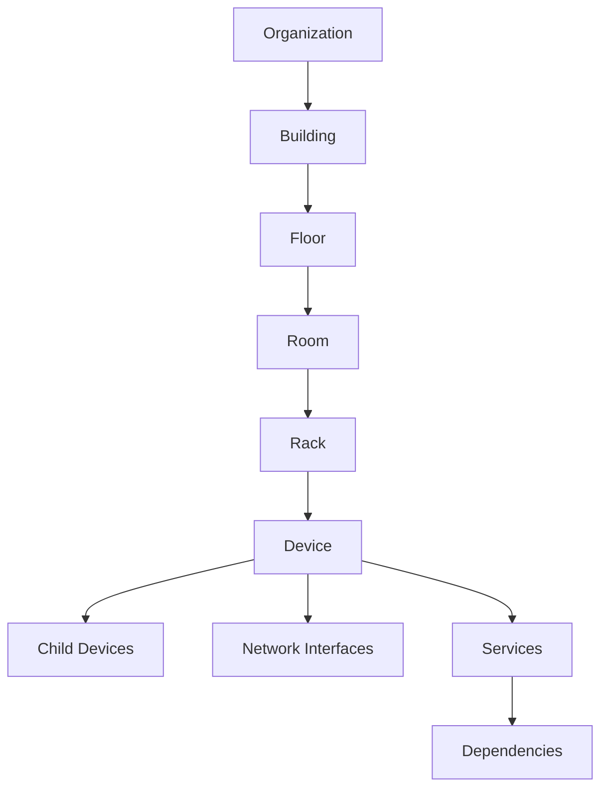
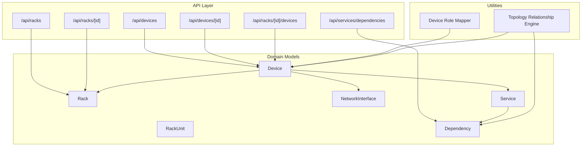
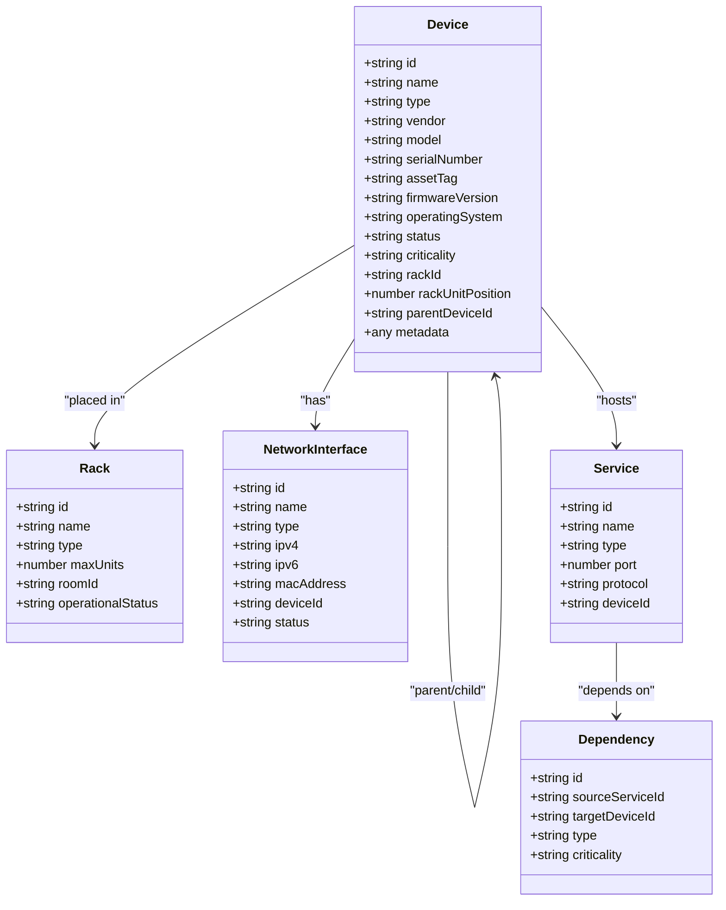
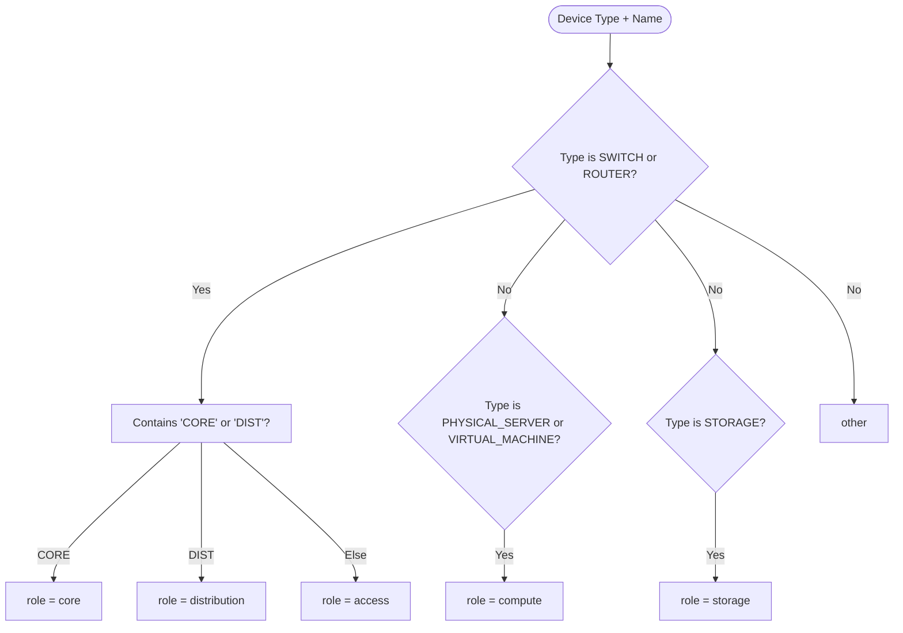
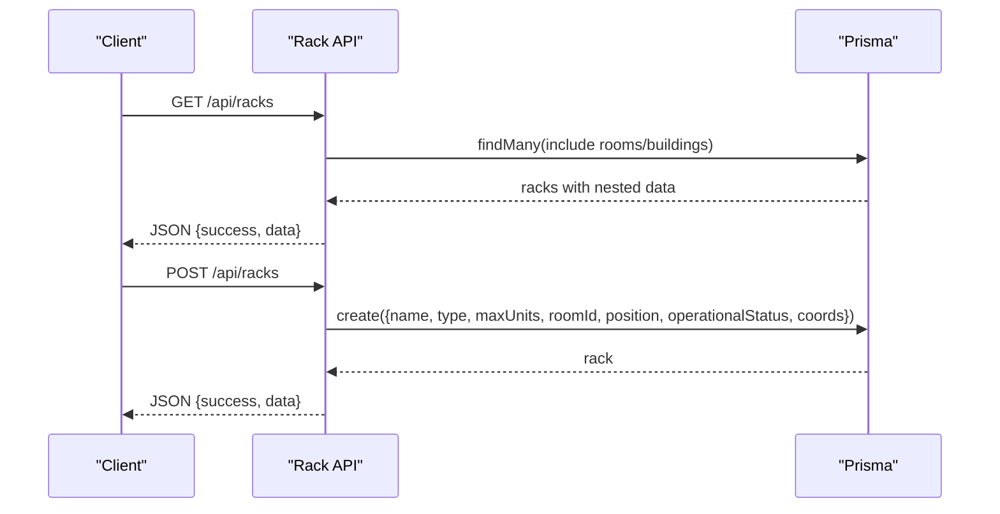
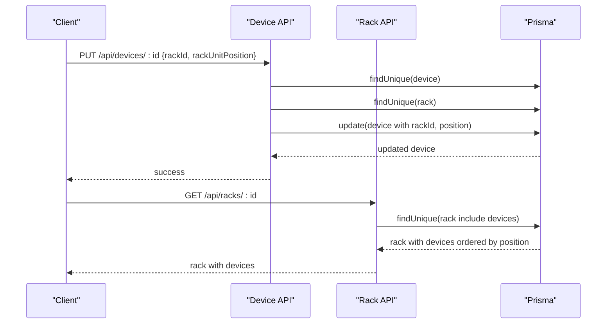
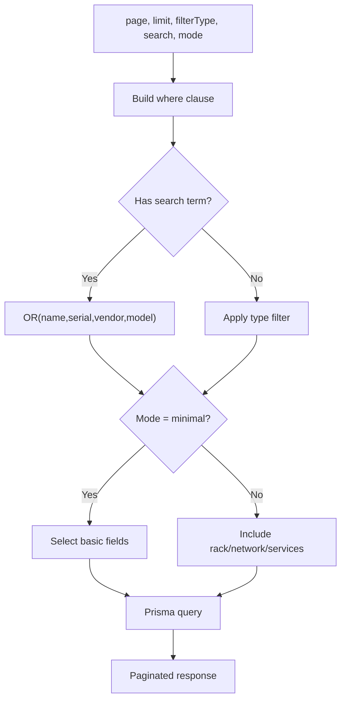
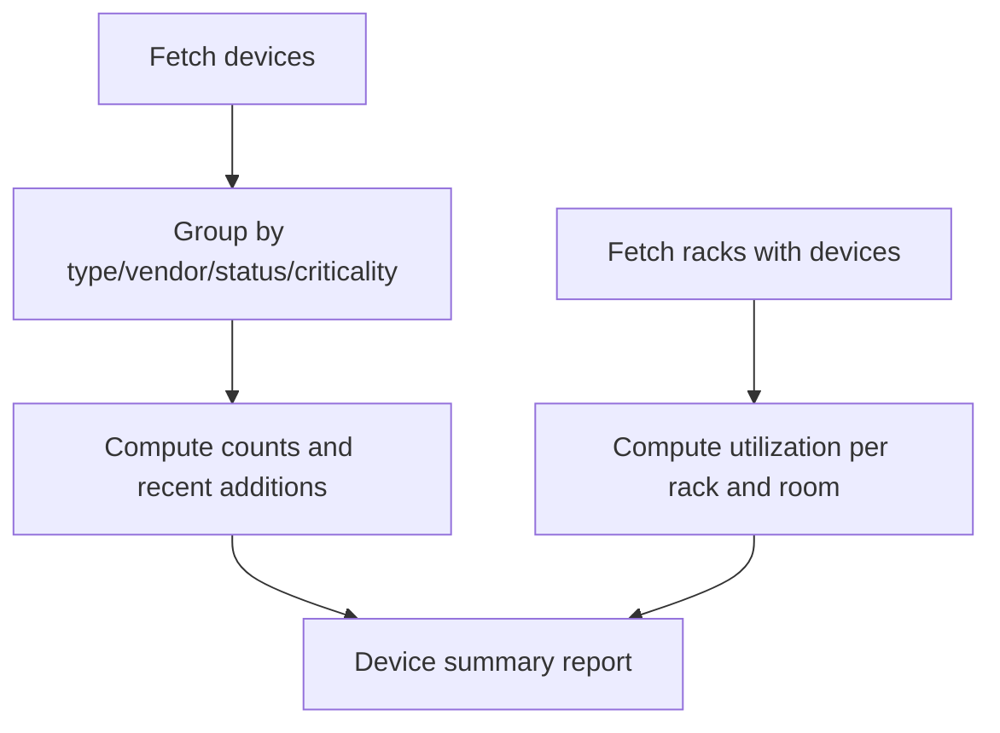
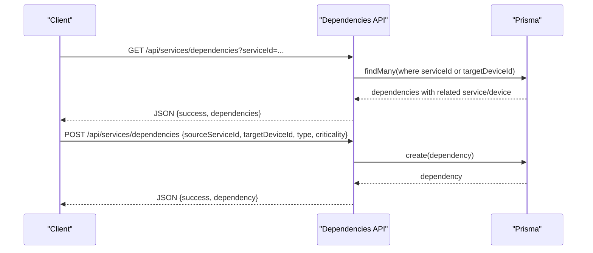
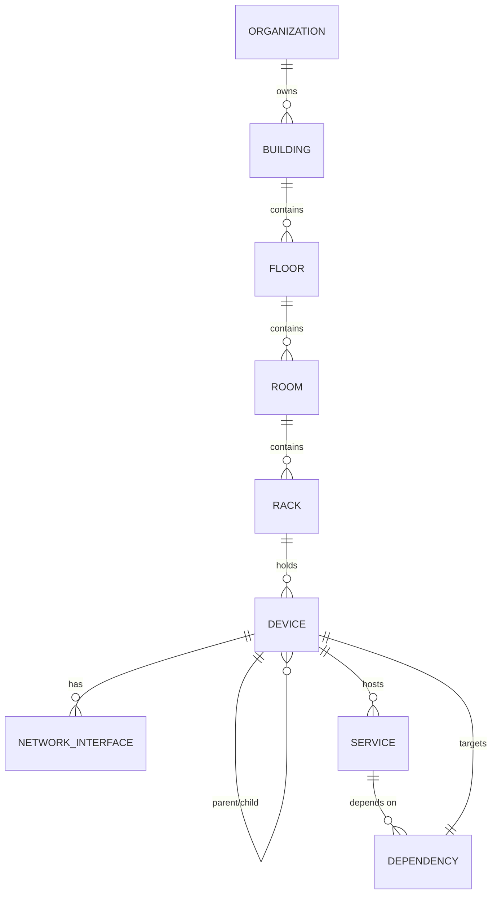

# Device Inventory & Placement

<cite>
**Referenced Files in This Document**
- [types/index.ts](file://types/index.ts)
- [prisma/schema.prisma](file://prisma/schema.prisma)
- [app/api/devices/route.ts](file://app/api/devices/route.ts)
- [app/api/devices/[id]/route.ts](file://app/api/devices/[id]/route.ts)
- [app/api/racks/route.ts](file://app/api/racks/route.ts)
- [app/api/racks/[id]/route.ts](file://app/api/racks/[id]/route.ts)
- [app/api/racks/[id]/devices/route.ts](file://app/api/racks/[id]/devices/route.ts)
- [lib/deviceRoleMapper.ts](file://lib/deviceRoleMapper.ts)
- [lib/topology/relationship-engine.ts](file://lib/topology/relationship-engine.ts)
- [app/api/services/dependencies/route.ts](file://app/api/services/dependencies/route.ts)
- [lib/reports/reports-service.ts](file://lib/reports/reports-service.ts)
</cite>

## Table of Contents
1. [Introduction](#introduction)
2. [Project Structure](#project-structure)
3. [Core Components](#core-components)
4. [Architecture Overview](#architecture-overview)
5. [Detailed Component Analysis](#detailed-component-analysis)
6. [Dependency Analysis](#dependency-analysis)
7. [Performance Considerations](#performance-considerations)
8. [Troubleshooting Guide](#troubleshooting-guide)
9. [Conclusion](#conclusion)
10. [Appendices](#appendices)

## Introduction
This document explains device inventory management and placement within the infrastructure hierarchy. It covers device types and metadata, rack unit assignment, device status and lifecycle, role mapping, search and filtering, and relationship management including parent-child relationships for virtual machines and service dependencies. Practical workflows demonstrate adding servers to racks, configuring network devices, and placing virtual machines on physical hosts.

## Project Structure
The system organizes infrastructure as hierarchical entities: Organization → Building → Floor → Room → Rack → Devices. Devices are typed and can be placed in rack units, tracked for status and criticality, and linked to services and dependencies. APIs expose CRUD operations for devices and racks, and relationship queries support topology and impact analysis.

**Diagram sources**
- [prisma/schema.prisma](file://prisma/schema.prisma)
- [types/index.ts](file://types/index.ts)

**Section sources**
- [prisma/schema.prisma](file://prisma/schema.prisma)
- [types/index.ts](file://types/index.ts)

## Core Components
- Device model: central inventory entity with type, status, criticality, rack association, parent/child relationships, and metadata.
- Rack model: physical container with units, operational status, and spatial coordinates.
- Device types and roles: categorization supports role-based layout and topology positioning.
- Services and dependencies: define device-to-service relationships and cross-device dependencies.
- APIs: server-side endpoints for device and rack management, filtering, and relationship queries.

**Section sources**
- [types/index.ts](file://types/index.ts)
- [prisma/schema.prisma](file://prisma/schema.prisma)
- [app/api/devices/route.ts](file://app/api/devices/route.ts)
- [app/api/racks/route.ts](file://app/api/racks/route.ts)

## Architecture Overview
The backend uses Prisma ORM against PostgreSQL. Frontend pages consume REST endpoints under app/api/* to manage devices, racks, and relationships. Role mapping and topology utilities assist with visual and logical grouping.

**Diagram sources**
- [app/api/devices/route.ts](file://app/api/devices/route.ts)
- [app/api/devices/[id]/route.ts](file://app/api/devices/[id]/route.ts)
- [app/api/racks/route.ts](file://app/api/racks/route.ts)
- [app/api/racks/[id]/route.ts](file://app/api/racks/[id]/route.ts)
- [app/api/racks/[id]/devices/route.ts](file://app/api/racks/[id]/devices/route.ts)
- [app/api/services/dependencies/route.ts](file://app/api/services/dependencies/route.ts)
- [lib/deviceRoleMapper.ts](file://lib/deviceRoleMapper.ts)
- [lib/topology/relationship-engine.ts](file://lib/topology/relationship-engine.ts)
- [prisma/schema.prisma](file://prisma/schema.prisma)

## Detailed Component Analysis

### Device Model and Metadata Management
- Device fields include identification, hardware/software attributes, lifecycle status, criticality, optional rack placement, parent/child hierarchy, and freeform metadata for extensibility.
- Device types enumerate physical and virtual assets, networking gear, and peripherals.
- Status and criticality support lifecycle and risk-aware operations.

**Diagram sources**
- [types/index.ts](file://types/index.ts)
- [prisma/schema.prisma](file://prisma/schema.prisma)

**Section sources**
- [types/index.ts](file://types/index.ts)
- [prisma/schema.prisma](file://prisma/schema.prisma)

### Device Types, Roles, and Categorization
- DeviceType enumerates categories such as physical servers, virtual hosts/machines, firewalls, switches, routers, storage, and peripherals.
- DeviceRoleMapper assigns logical roles (core, distribution, access, compute, storage, other) based on type and name heuristics, enabling topology positioning and grouping.

**Diagram sources**
- [lib/deviceRoleMapper.ts](file://lib/deviceRoleMapper.ts)
- [types/index.ts](file://types/index.ts)

**Section sources**
- [lib/deviceRoleMapper.ts](file://lib/deviceRoleMapper.ts)
- [types/index.ts](file://types/index.ts)

### Rack and Unit Management
- Rack defines capacity (maxUnits), operational status, and optional spatial coordinates and rotation.
- RackUnit represents individual U positions within a rack, linking to a device and side (front/rear).
- Rack endpoints support listing, creation, updates, and retrieval with contextual location data.

**Diagram sources**
- [app/api/racks/route.ts](file://app/api/racks/route.ts)
- [prisma/schema.prisma](file://prisma/schema.prisma)

**Section sources**
- [app/api/racks/route.ts](file://app/api/racks/route.ts)
- [app/api/racks/[id]/route.ts](file://app/api/racks/[id]/route.ts)
- [prisma/schema.prisma](file://prisma/schema.prisma)

### Device Placement Workflows
- Assigning devices to rack units:
  - Update device with rackId and rackUnitPosition; validation ensures position does not exceed rack capacity.
  - Retrieve rack details to see ordered devices by unit position.
- Managing device status and lifecycle:
  - Update device status and criticality via device endpoint; status values include ACTIVE, INACTIVE, MAINTENANCE, DECOMMISSIONED, UNKNOWN.
- Virtual machine placement:
  - Set parentDeviceId to a VIRTUAL_HOST or PHYSICAL_SERVER; validation enforces parent type for VIRTUAL_MACHINE.

**Diagram sources**
- [app/api/devices/[id]/route.ts](file://app/api/devices/[id]/route.ts)
- [app/api/racks/[id]/route.ts](file://app/api/racks/[id]/route.ts)

**Section sources**
- [app/api/devices/[id]/route.ts](file://app/api/devices/[id]/route.ts)
- [app/api/racks/[id]/route.ts](file://app/api/racks/[id]/route.ts)

### Device Search, Filtering, and Bulk Operations
- Device listing supports pagination, filtering by manual/auto-managed types, and text search across name, serial, vendor, and model.
- Minimal vs full response modes optimize performance for dashboards versus detailed views.
- Suggested bulk operations (conceptual):
  - Batch update status/criticality by applying filters and iterating pages.
  - Bulk import via CSV upload pipeline (not implemented here) followed by batch inserts.

**Diagram sources**
- [app/api/devices/route.ts](file://app/api/devices/route.ts)

**Section sources**
- [app/api/devices/route.ts](file://app/api/devices/route.ts)

### Device Import/Export and Reports
- Reports service aggregates device metrics (counts by type/vendor/status/criticality) and generates capacity insights per rack and room.
- Import/export (conceptual):
  - Export: query devices with selected fields and serialize to CSV/JSON.
  - Import: validate rows against Device schema and upsert records.

**Diagram sources**
- [lib/reports/reports-service.ts](file://lib/reports/reports-service.ts)
- [prisma/schema.prisma](file://prisma/schema.prisma)

**Section sources**
- [lib/reports/reports-service.ts](file://lib/reports/reports-service.ts)
- [prisma/schema.prisma](file://prisma/schema.prisma)

### Relationship Mapping and Service Dependencies
- Device-to-device relationships and service-device dependencies are modeled explicitly.
- Relationship engine retrieves and labels relationships for topology visualization, including containment, connectivity, and dependency types.
- Service dependencies endpoint supports listing, creating, updating, and deleting dependencies.

**Diagram sources**
- [app/api/services/dependencies/route.ts](file://app/api/services/dependencies/route.ts)
- [lib/topology/relationship-engine.ts](file://lib/topology/relationship-engine.ts)
- [prisma/schema.prisma](file://prisma/schema.prisma)

**Section sources**
- [app/api/services/dependencies/route.ts](file://app/api/services/dependencies/route.ts)
- [lib/topology/relationship-engine.ts](file://lib/topology/relationship-engine.ts)
- [prisma/schema.prisma](file://prisma/schema.prisma)

### Practical Workflows

#### Add a Physical Server to a Rack
- Create or update a Device with type PHYSICAL_SERVER and optional metadata.
- Update the device with rackId and a valid rackUnitPosition within the rack’s maxUnits.
- Verify via GET /api/racks/:id to see the device listed in unit order.

**Section sources**
- [app/api/devices/route.ts](file://app/api/devices/route.ts)
- [app/api/devices/[id]/route.ts](file://app/api/devices/[id]/route.ts)
- [app/api/racks/[id]/route.ts](file://app/api/racks/[id]/route.ts)

#### Configure a Network Device (Switch/Router)
- Create a Device with type SWITCH or ROUTER.
- Optionally set operational status and criticality.
- Use role mapper to infer logical role for topology grouping.

**Section sources**
- [lib/deviceRoleMapper.ts](file://lib/deviceRoleMapper.ts)
- [app/api/devices/route.ts](file://app/api/devices/route.ts)

#### Place a Virtual Machine on a Physical Host
- Create a Device with type VIRTUAL_MACHINE.
- Set parentDeviceId to an existing VIRTUAL_HOST or PHYSICAL_SERVER; validation ensures correct parent type.
- Optionally assign to a rack unit if the host is placed in a rack.

**Section sources**
- [app/api/devices/[id]/route.ts](file://app/api/devices/[id]/route.ts)

#### Track Device Lifecycle and Status
- Update status and criticality via device endpoint; supported values are validated.
- Use reports to track trends and capacity.

**Section sources**
- [app/api/devices/[id]/route.ts](file://app/api/devices/[id]/route.ts)
- [lib/reports/reports-service.ts](file://lib/reports/reports-service.ts)

## Dependency Analysis
- Device depends on Rack for placement and on NetworkInterface/Service for connectivity and hosting.
- Services depend on Device instances; Dependencies connect services to devices.
- Topology engine queries relationships for visualization and labeling.

**Diagram sources**
- [prisma/schema.prisma](file://prisma/schema.prisma)

**Section sources**
- [prisma/schema.prisma](file://prisma/schema.prisma)

## Performance Considerations
- Use minimal mode for device listings on dashboards to avoid heavy joins.
- Cache rack listings with TTL to reduce DB load.
- Prefer server-side filtering and pagination for large inventories.
- Indexes on frequently queried fields (e.g., device status, rackId) improve query performance.

[No sources needed since this section provides general guidance]

## Troubleshooting Guide
- Rack capacity exceeded: when updating a device’s rackUnitPosition, ensure it does not exceed rack.maxUnits.
- Parent-child validation: VIRTUAL_MACHINE requires a VIRTUAL_HOST or PHYSICAL_SERVER parent.
- Deletion constraints: cannot delete devices with child devices or services attached.
- Rack deletion safety: cannot delete racks that still contain devices.

**Section sources**
- [app/api/devices/[id]/route.ts](file://app/api/devices/[id]/route.ts)
- [app/api/racks/[id]/route.ts](file://app/api/racks/[id]/route.ts)

## Conclusion
The system provides a robust foundation for device inventory and placement across physical and virtual infrastructures. It supports precise rack unit assignment, lifecycle tracking, role-based topology, and explicit service-device dependencies. With server-side filtering, caching, and reporting, it scales to enterprise-grade environments while maintaining clear workflows for day-to-day operations.

## Appendices

### API Summary: Devices
- GET /api/devices: paginated listing with search and type filters; minimal/full modes.
- POST /api/devices: create device with required name and type.
- GET /api/devices/[id]: retrieve device with rack, parent/children, interfaces, and services.
- PUT /api/devices/[id]: update device fields with validations.
- DELETE /api/devices/[id]: delete device with cascade checks.

**Section sources**
- [app/api/devices/route.ts](file://app/api/devices/route.ts)
- [app/api/devices/[id]/route.ts](file://app/api/devices/[id]/route.ts)

### API Summary: Racks
- GET /api/racks: list racks with room/building context and device summaries.
- POST /api/racks: create rack with spatial and operational attributes.
- GET /api/racks/[id]: detailed rack with devices ordered by unit position.
- PUT /api/racks/[id]: update rack with validations and duplicate name checks.
- DELETE /api/racks/[id]: delete rack after ensuring no devices remain.

**Section sources**
- [app/api/racks/route.ts](file://app/api/racks/route.ts)
- [app/api/racks/[id]/route.ts](file://app/api/racks/[id]/route.ts)

### API Summary: Rack Devices
- GET /api/racks/[id]/devices: list devices in a rack with first IPv4 and basic attributes.

**Section sources**
- [app/api/racks/[id]/devices/route.ts](file://app/api/racks/[id]/devices/route.ts)

### API Summary: Dependencies
- GET /api/services/dependencies: list dependencies optionally filtered by serviceId.
- POST /api/services/dependencies: create a dependency with type and criticality.
- PUT /api/services/dependencies: update dependency fields.
- DELETE /api/services/dependencies?id: remove a dependency.

**Section sources**
- [app/api/services/dependencies/route.ts](file://app/api/services/dependencies/route.ts)