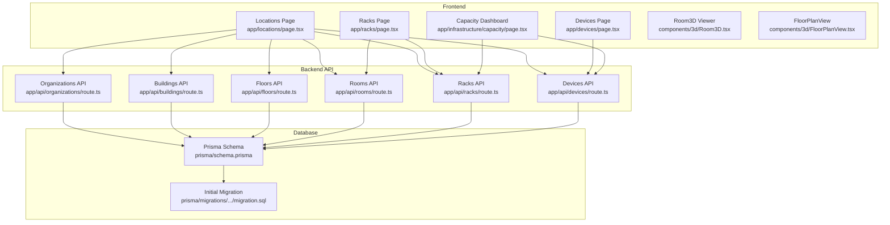
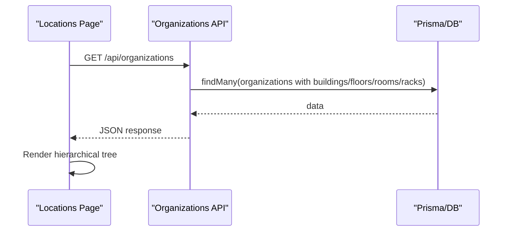
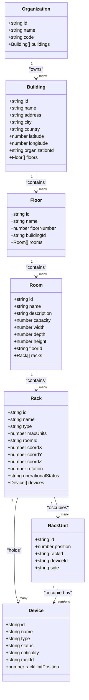
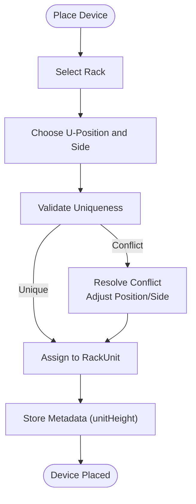
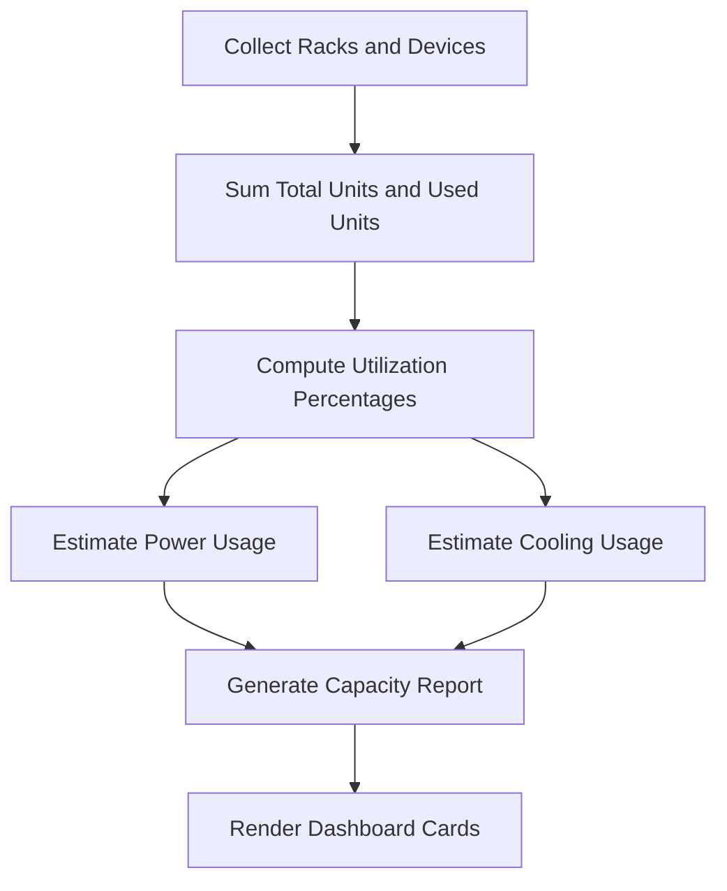
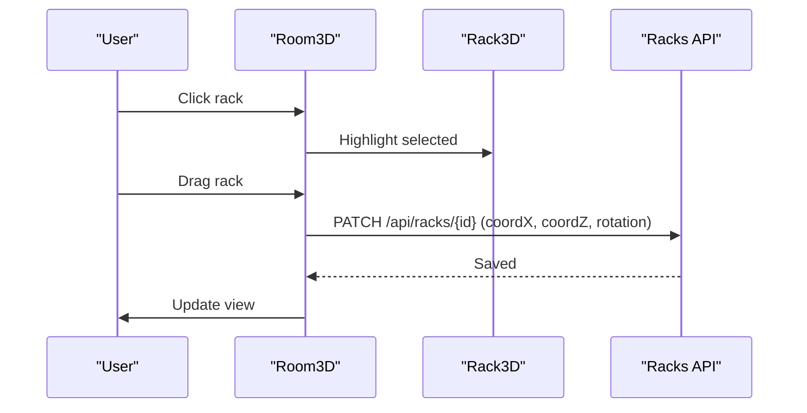
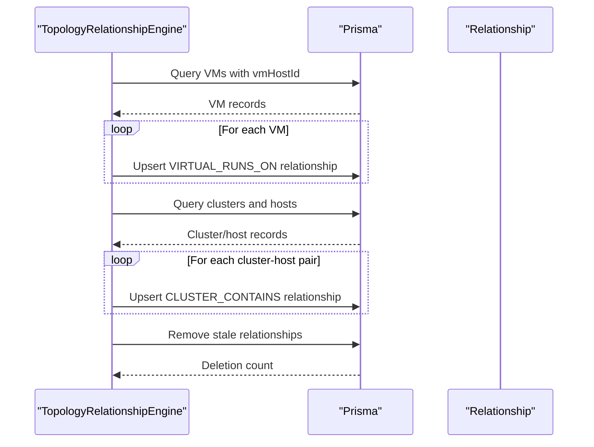
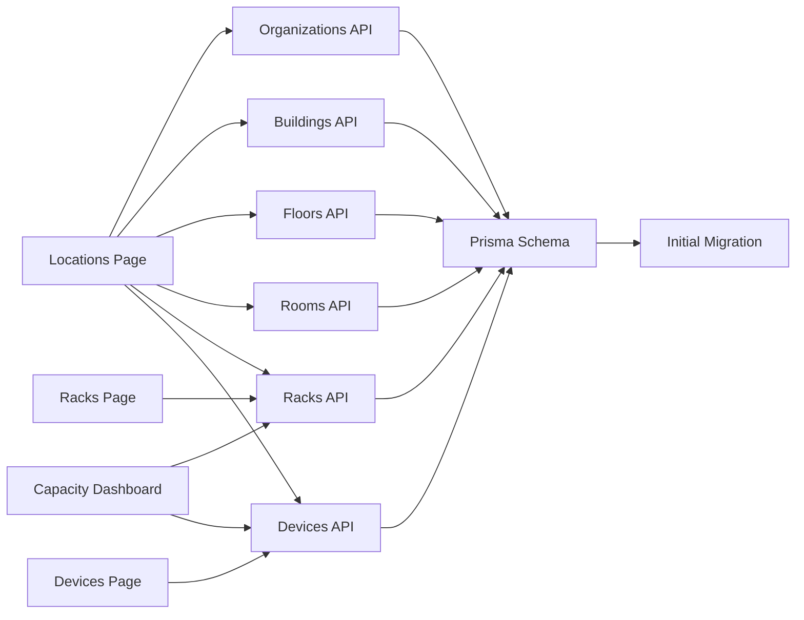

# Infrastructure Management

<cite>
**Referenced Files in This Document**
- [README.md](file://README.md)
- [ARCHITECTURE.md](file://ARCHITECTURE.md)
- [types/index.ts](file://types/index.ts)
- [prisma/schema.prisma](file://prisma/schema.prisma)
- [prisma/migrations/20260101220408_initial_schema/migration.sql](file://prisma/migrations/20260101220408_initial_schema/migration.sql)
- [app/api/organizations/route.ts](file://app/api/organizations/route.ts)
- [app/api/buildings/route.ts](file://app/api/buildings/route.ts)
- [app/api/floors/route.ts](file://app/api/floors/route.ts)
- [app/api/rooms/route.ts](file://app/api/rooms/route.ts)
- [app/api/racks/route.ts](file://app/api/racks/route.ts)
- [app/api/devices/route.ts](file://app/api/devices/route.ts)
- [app/locations/page.tsx](file://app/locations/page.tsx)
- [app/racks/page.tsx](file://app/racks/page.tsx)
- [app/devices/page.tsx](file://app/devices/page.tsx)
- [app/infrastructure/capacity/page.tsx](file://app/infrastructure/capacity/page.tsx)
- [components/3d/FloorPlanView.tsx](file://components/3d/FloorPlanView.tsx)
- [components/3d/Room3D.tsx](file://components/3d/Room3D.tsx)
- [components/3d/Rack3D.tsx](file://components/3d/Rack3D.tsx)
- [lib/topology/relationship-engine.ts](file://lib/topology/relationship-engine.ts)
- [lib/reports/reports-service.ts](file://lib/reports/reports-service.ts)
- [scripts/add-ny-devices-batch.js](file://scripts/add-ny-devices-batch.js)
</cite>

## Table of Contents
1. [Introduction](#introduction)
2. [Project Structure](#project-structure)
3. [Core Components](#core-components)
4. [Architecture Overview](#architecture-overview)
5. [Detailed Component Analysis](#detailed-component-analysis)
6. [Dependency Analysis](#dependency-analysis)
7. [Performance Considerations](#performance-considerations)
8. [Troubleshooting Guide](#troubleshooting-guide)
9. [Conclusion](#conclusion)
10. [Appendices](#appendices)

## Introduction
This document describes the Infrastructure Management capabilities of the platform, focusing on the hierarchical physical location structure and device inventory. It explains how Organizations, Buildings, Floors, Rooms, Racks, and Rack Units compose the physical hierarchy, how devices are placed and tracked, and how capacity planning and visualization integrate with the logical device inventory. Administrative workflows and permissions are also covered to guide safe operations.

## Project Structure
The infrastructure management system is implemented as a full-stack Next.js application with a PostgreSQL-backed Prisma ORM. The backend exposes REST-like API routes under app/api/*, while the frontend provides interactive views for locations, racks, devices, and capacity. Three-dimensional visualization is integrated via React Three Fiber for room and rack views.

**Diagram sources**
- [app/locations/page.tsx:118-770](file://app/locations/page.tsx#L118-L770)
- [app/racks/page.tsx:64-105](file://app/racks/page.tsx#L64-L105)
- [app/devices/page.tsx:31-65](file://app/devices/page.tsx#L31-L65)
- [app/infrastructure/capacity/page.tsx:17-31](file://app/infrastructure/capacity/page.tsx#L17-L31)
- [components/3d/Room3D.tsx:46-86](file://components/3d/Room3D.tsx#L46-L86)
- [components/3d/FloorPlanView.tsx:71-123](file://components/3d/FloorPlanView.tsx#L71-L123)
- [app/api/organizations/route.ts:9-88](file://app/api/organizations/route.ts#L9-L88)
- [app/api/buildings/route.ts:9-79](file://app/api/buildings/route.ts#L9-L79)
- [app/api/floors/route.ts:9-69](file://app/api/floors/route.ts#L9-L69)
- [app/api/rooms/route.ts:9-71](file://app/api/rooms/route.ts#L9-L71)
- [app/api/racks/route.ts:9-66](file://app/api/racks/route.ts#L9-L66)
- [app/api/devices/route.ts:10-94](file://app/api/devices/route.ts#L10-L94)
- [prisma/schema.prisma:131-149](file://prisma/schema.prisma#L131-L149)
- [prisma/migrations/20260101220408_initial_schema/migration.sql:84-126](file://prisma/migrations/20260101220408_initial_schema/migration.sql#L84-L126)

**Section sources**
- [README.md:1-40](file://README.md#L1-L40)
- [ARCHITECTURE.md:105-158](file://ARCHITECTURE.md#L105-L158)

## Core Components
- Hierarchical Location Model
  - Organization → Building → Floor → Room → Rack → Rack Unit
  - Device placement is anchored to Rack Units with U-position and optional side (front/rear)
- Device Inventory
  - Device types include physical servers, virtual machines, hosts, switches, routers, firewalls, storage, printers, cameras, PDUs, patch panels, and others
  - Device criticality and status are tracked; assets include vendor/model/serial/asset tag; support dates are recorded
- Rack Management
  - Rack types include standard 42U/45U and custom sizes; operational status supports operational, maintenance, decommissioned
  - Racks can store devices with unit height metadata and U-position
- 3D Visualization
  - Room3D renders racks in 3D with lighting, shadows, and orbit controls
  - FloorPlanView provides 2D editable floor plans with drag-to-reposition and rotation controls
- Capacity Planning
  - Reports service computes rack utilization, power, and cooling metrics
  - Dedicated capacity dashboard displays power, cooling, compute, and storage utilization

**Section sources**
- [types/index.ts:10-108](file://types/index.ts#L10-L108)
- [prisma/schema.prisma:131-149](file://prisma/schema.prisma#L131-L149)
- [prisma/schema.prisma:420-455](file://prisma/schema.prisma#L420-L455)
- [components/3d/Room3D.tsx:46-86](file://components/3d/Room3D.tsx#L46-L86)
- [components/3d/FloorPlanView.tsx:71-123](file://components/3d/FloorPlanView.tsx#L71-L123)
- [lib/reports/reports-service.ts:168-225](file://lib/reports/reports-service.ts#L168-L225)
- [app/infrastructure/capacity/page.tsx:17-50](file://app/infrastructure/capacity/page.tsx#L17-L50)

## Architecture Overview
The system follows a layered architecture:
- Presentation Layer: Next.js pages and 3D components
- API Layer: Route handlers under app/api/*
- Persistence Layer: Prisma ORM mapping to PostgreSQL
- Data Model: Strongly typed entities with referential integrity

**Diagram sources**
- [app/locations/page.tsx:143-159](file://app/locations/page.tsx#L143-L159)
- [app/api/organizations/route.ts:9-88](file://app/api/organizations/route.ts#L9-L88)

**Section sources**
- [app/api/organizations/route.ts:9-88](file://app/api/organizations/route.ts#L9-L88)
- [app/api/buildings/route.ts:9-79](file://app/api/buildings/route.ts#L9-L79)
- [app/api/floors/route.ts:9-69](file://app/api/floors/route.ts#L9-L69)
- [app/api/rooms/route.ts:9-71](file://app/api/rooms/route.ts#L9-L71)
- [app/api/racks/route.ts:9-66](file://app/api/racks/route.ts#L9-L66)
- [app/api/devices/route.ts:10-94](file://app/api/devices/route.ts#L10-L94)

## Detailed Component Analysis

### Hierarchical Location Structure
The physical hierarchy is modeled as:
- Organization: Top-level tenant
- Building: Physical address with coordinates
- Floor: Numbered level within a building
- Room: Server room with optional dimensions
- Rack: Equipment cabinet with type, max units, and position/orientation
- Rack Unit: Individual U position within a rack

**Diagram sources**
- [types/index.ts:10-108](file://types/index.ts#L10-L108)
- [prisma/schema.prisma:131-149](file://prisma/schema.prisma#L131-L149)
- [prisma/migrations/20260101220408_initial_schema/migration.sql:84-126](file://prisma/migrations/20260101220408_initial_schema/migration.sql#L84-L126)

**Section sources**
- [types/index.ts:10-108](file://types/index.ts#L10-L108)
- [prisma/schema.prisma:131-149](file://prisma/schema.prisma#L131-L149)
- [prisma/migrations/20260101220408_initial_schema/migration.sql:84-126](file://prisma/migrations/20260101220408_initial_schema/migration.sql#L84-L126)

### Device Placement and Rack Units
- Devices are associated with a rack and a U-position; metadata can include unit height for non-standard devices
- Rack units enforce uniqueness per rack position and side, preventing overlaps
- Front/rear sides can be specified for dual-density or mixed-density placements

**Diagram sources**
- [prisma/schema.prisma:131-149](file://prisma/schema.prisma#L131-L149)
- [app/api/devices/route.ts:96-141](file://app/api/devices/route.ts#L96-L141)
- [scripts/add-ny-devices-batch.js:70-99](file://scripts/add-ny-devices-batch.js#L70-L99)

**Section sources**
- [prisma/schema.prisma:131-149](file://prisma/schema.prisma#L131-L149)
- [app/api/devices/route.ts:96-141](file://app/api/devices/route.ts#L96-L141)
- [scripts/add-ny-devices-batch.js:70-99](file://scripts/add-ny-devices-batch.js#L70-L99)

### Capacity Planning and Utilization
- Rack utilization is computed from used rack units across all racks
- Power and cooling utilization are estimated from rack counts and unit occupancy
- The capacity dashboard presents power, cooling, compute, and storage metrics with thresholds

**Diagram sources**
- [lib/reports/reports-service.ts:168-225](file://lib/reports/reports-service.ts#L168-L225)
- [app/infrastructure/capacity/page.tsx:17-50](file://app/infrastructure/capacity/page.tsx#L17-L50)

**Section sources**
- [lib/reports/reports-service.ts:168-225](file://lib/reports/reports-service.ts#L168-L225)
- [app/infrastructure/capacity/page.tsx:17-50](file://app/infrastructure/capacity/page.tsx#L17-L50)

### Rack Visualization and Editing
- 3D visualization uses React Three Fiber to render racks with realistic materials, lighting, and shadows
- 2D floor plan view allows dragging racks to new positions, rotating, and saving coordinates
- Both views reflect current device occupancy and status

**Diagram sources**
- [components/3d/Room3D.tsx:155-170](file://components/3d/Room3D.tsx#L155-L170)
- [components/3d/FloorPlanView.tsx:436-456](file://components/3d/FloorPlanView.tsx#L436-L456)
- [app/api/racks/route.ts:9-66](file://app/api/racks/route.ts#L9-L66)

**Section sources**
- [components/3d/Room3D.tsx:46-86](file://components/3d/Room3D.tsx#L46-L86)
- [components/3d/FloorPlanView.tsx:71-123](file://components/3d/FloorPlanView.tsx#L71-L123)
- [app/api/racks/route.ts:9-66](file://app/api/racks/route.ts#L9-L66)

### Device Relationship Management (VMs on Hosts)
- The relationship engine correlates VMs to their ESXi hosts and VMware clusters
- It creates or updates relationships with high confidence and removes stale entries
- This ensures accurate logical device inventory reflecting runtime relationships

**Diagram sources**
- [lib/topology/relationship-engine.ts:85-140](file://lib/topology/relationship-engine.ts#L85-L140)
- [lib/topology/relationship-engine.ts:142-204](file://lib/topology/relationship-engine.ts#L142-L204)

**Section sources**
- [lib/topology/relationship-engine.ts:85-140](file://lib/topology/relationship-engine.ts#L85-L140)
- [lib/topology/relationship-engine.ts:142-204](file://lib/topology/relationship-engine.ts#L142-L204)

### Practical Workflows

#### Add a New Rack
- Navigate to the Racks page, open the add modal, select a room, choose type/max units, and submit
- The backend validates required fields and persists the rack with defaults for optional fields

**Section sources**
- [app/racks/page.tsx:107-161](file://app/racks/page.tsx#L107-L161)
- [app/api/racks/route.ts:69-121](file://app/api/racks/route.ts#L69-L121)

#### Place Devices in a Rack
- From the Devices page, select a rack and create devices with U-position and metadata
- Alternatively, batch import devices into a target rack

**Section sources**
- [app/devices/page.tsx:103-127](file://app/devices/page.tsx#L103-L127)
- [scripts/add-ny-devices-batch.js:70-99](file://scripts/add-ny-devices-batch.js#L70-L99)

#### Capacity Planning Scenario
- Review the Capacity dashboard for power/cooling/compute/storage utilization
- Use rack summaries to identify over-subscribed rooms and plan expansions or relocations

**Section sources**
- [app/infrastructure/capacity/page.tsx:17-50](file://app/infrastructure/capacity/page.tsx#L17-L50)
- [lib/reports/reports-service.ts:168-225](file://lib/reports/reports-service.ts#L168-L225)

### Administrative Functions and Permissions
- The platform exposes CRUD endpoints for organizations, buildings, floors, rooms, racks, and devices
- Access control is managed by the application’s authentication and authorization layer (outside the scope of this repository)
- Administrators should:
  - Ensure referential integrity when deleting nested entities (e.g., delete devices before racks)
  - Use the capacity dashboard to inform capacity decisions
  - Leverage 3D/2D views to optimize rack layouts and airflow

**Section sources**
- [app/api/organizations/route.ts:90-124](file://app/api/organizations/route.ts#L90-L124)
- [app/api/buildings/route.ts:81-117](file://app/api/buildings/route.ts#L81-L117)
- [app/api/floors/route.ts:72-106](file://app/api/floors/route.ts#L72-L106)
- [app/api/rooms/route.ts:74-112](file://app/api/rooms/route.ts#L74-L112)
- [app/api/racks/route.ts:69-121](file://app/api/racks/route.ts#L69-L121)
- [app/api/devices/route.ts:96-141](file://app/api/devices/route.ts#L96-L141)

## Dependency Analysis
The frontend pages depend on API routes and 3D components. The API routes depend on Prisma models defined in the schema and validated by migrations.

**Diagram sources**
- [app/locations/page.tsx:143-159](file://app/locations/page.tsx#L143-L159)
- [app/racks/page.tsx:80-105](file://app/racks/page.tsx#L80-L105)
- [app/devices/page.tsx:62-101](file://app/devices/page.tsx#L62-L101)
- [app/infrastructure/capacity/page.tsx:17-31](file://app/infrastructure/capacity/page.tsx#L17-L31)
- [app/api/organizations/route.ts:9-88](file://app/api/organizations/route.ts#L9-L88)
- [app/api/buildings/route.ts:9-79](file://app/api/buildings/route.ts#L9-L79)
- [app/api/floors/route.ts:9-69](file://app/api/floors/route.ts#L9-L69)
- [app/api/rooms/route.ts:9-71](file://app/api/rooms/route.ts#L9-L71)
- [app/api/racks/route.ts:9-66](file://app/api/racks/route.ts#L9-L66)
- [app/api/devices/route.ts:10-94](file://app/api/devices/route.ts#L10-L94)
- [prisma/schema.prisma:131-149](file://prisma/schema.prisma#L131-L149)
- [prisma/migrations/20260101220408_initial_schema/migration.sql:84-126](file://prisma/migrations/20260101220408_initial_schema/migration.sql#L84-L126)

**Section sources**
- [prisma/schema.prisma:131-149](file://prisma/schema.prisma#L131-L149)
- [prisma/migrations/20260101220408_initial_schema/migration.sql:84-126](file://prisma/migrations/20260101220408_initial_schema/migration.sql#L84-L126)

## Performance Considerations
- API caching: GET endpoints for organizations, buildings, floors, rooms, and racks implement short TTL caches to reduce database load
- Selective includes: API routes use include/select clauses to avoid loading unnecessary nested relations
- Pagination and filtering: Devices API supports pagination and server-side filtering to manage large inventories
- 3D rendering: Room3D uses efficient materials and lighting; FloorPlanView optimizes drawing and interaction

[No sources needed since this section provides general guidance]

## Troubleshooting Guide
- 3D Rendering Issues
  - Room3D catches WebGL errors and displays a user-friendly error message; refresh or check browser compatibility
- API Failures
  - Verify endpoint availability and required parameters; check error logs for detailed messages
- Capacity Dashboard
  - If values appear incorrect, refresh the dashboard or investigate underlying utilization calculations

**Section sources**
- [components/3d/Room3D.tsx:50-67](file://components/3d/Room3D.tsx#L50-L67)
- [app/api/organizations/route.ts:76-87](file://app/api/organizations/route.ts#L76-L87)
- [app/api/buildings/route.ts:71-78](file://app/api/buildings/route.ts#L71-L78)
- [app/api/floors/route.ts:62-69](file://app/api/floors/route.ts#L62-L69)
- [app/api/rooms/route.ts:64-71](file://app/api/rooms/route.ts#L64-L71)
- [app/api/racks/route.ts:60-66](file://app/api/racks/route.ts#L60-L66)
- [app/api/devices/route.ts:82-93](file://app/api/devices/route.ts#L82-L93)

## Conclusion
The Infrastructure Management module provides a robust, hierarchical representation of physical locations and device inventory, with strong modeling for rack units, flexible device types, and integrated visualization and capacity planning. The API layer ensures data integrity and performance, while the frontend enables efficient administration and planning.

[No sources needed since this section summarizes without analyzing specific files]

## Appendices

### API Endpoint Summary
- Organizations: GET, POST
- Buildings: GET, POST
- Floors: GET, POST
- Rooms: GET, POST
- Racks: GET, POST, PATCH, DELETE
- Devices: GET, POST, PUT, DELETE

**Section sources**
- [app/api/organizations/route.ts:9-124](file://app/api/organizations/route.ts#L9-L124)
- [app/api/buildings/route.ts:9-117](file://app/api/buildings/route.ts#L9-L117)
- [app/api/floors/route.ts:9-106](file://app/api/floors/route.ts#L9-L106)
- [app/api/rooms/route.ts:9-112](file://app/api/rooms/route.ts#L9-L112)
- [app/api/racks/route.ts:9-121](file://app/api/racks/route.ts#L9-L121)
- [app/api/devices/route.ts:10-141](file://app/api/devices/route.ts#L10-L141)