# Location Hierarchy Management

<cite>
**Referenced Files in This Document**
- [schema.prisma](file://prisma/schema.prisma)
- [organizations/route.ts](file://app/api/organizations/route.ts)
- [organizations/[id]/route.ts](file://app/api/organizations/[id]/route.ts)
- [buildings/route.ts](file://app/api/buildings/route.ts)
- [floors/route.ts](file://app/api/floors/route.ts)
- [floors/[id]/route.ts](file://app/api/floors/[id]/route.ts)
- [rooms/route.ts](file://app/api/rooms/route.ts)
- [rooms/[id]/route.ts](file://app/api/rooms/[id]/route.ts)
- [racks/route.ts](file://app/api/racks/route.ts)
- [racks/[id]/route.ts](file://app/api/racks/[id]/route.ts)
</cite>

## Table of Contents
1. [Introduction](#introduction)
2. [Project Structure](#project-structure)
3. [Core Components](#core-components)
4. [Architecture Overview](#architecture-overview)
5. [Detailed Component Analysis](#detailed-component-analysis)
6. [API Endpoints and Relationships](#api-endpoints-and-relationships)
7. [Interactive Tree View Interface](#interactive-tree-view-interface)
8. [Administrative Permissions and Access Controls](#administrative-permissions-and-access-controls)
9. [Common Workflows](#common-workflows)
10. [Performance Considerations](#performance-considerations)
11. [Troubleshooting Guide](#troubleshooting-guide)
12. [Conclusion](#conclusion)

## Introduction

The Location Hierarchy Management system provides comprehensive organizational structure management for infrastructure assets, covering the complete hierarchy from Organizations down to Rooms and their contained Racks. This system enables administrators to organize physical infrastructure into logical units while maintaining referential integrity and supporting efficient querying operations.

The hierarchy follows a strict parent-child relationship model where Organizations contain Buildings, Buildings contain Floors, Floors contain Rooms, and Rooms contain Racks. Each level supports full CRUD (Create, Read, Update, Delete) operations with appropriate validation and cascading behavior.

## Project Structure

The location hierarchy management system is implemented using a modern Next.js application with Prisma ORM for database operations. The system follows a layered architecture pattern with clear separation between data models, API endpoints, and business logic.

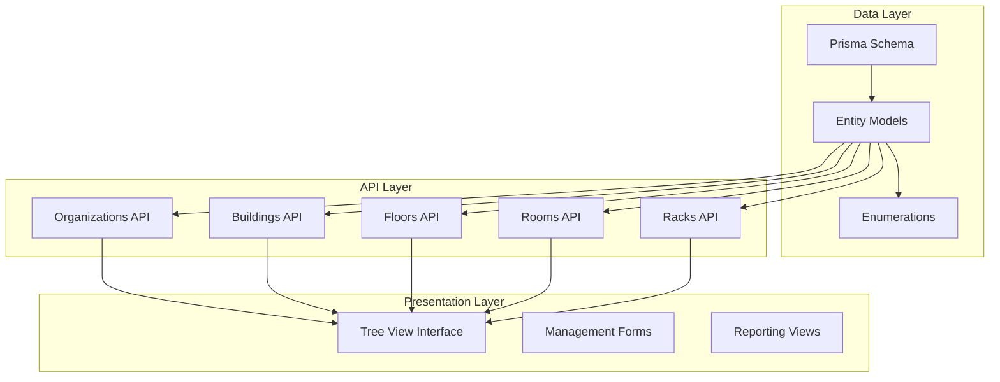

**Diagram sources**
- [schema.prisma:10-133](file://prisma/schema.prisma#L10-L133)
- [organizations/route.ts:1-125](file://app/api/organizations/route.ts#L1-L125)

**Section sources**
- [schema.prisma:10-133](file://prisma/schema.prisma#L10-L133)
- [organizations/route.ts:1-125](file://app/api/organizations/route.ts#L1-L125)

## Core Components

The location hierarchy system is built around five primary entity types, each representing a different level of the organizational structure:

### Entity Model Relationships

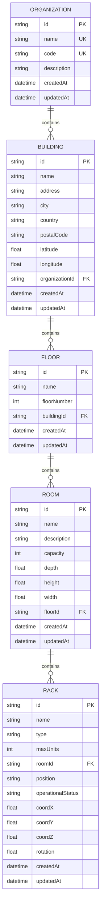

**Diagram sources**
- [schema.prisma:11-133](file://prisma/schema.prisma#L11-L133)

### Key Data Model Features

Each entity model includes standardized attributes for auditability and consistency:

- **Identification**: Unique string identifiers using cuid() provider
- **Metadata**: Creation and update timestamps for audit trails
- **Constraints**: Unique constraints on business-critical fields
- **Relationships**: Proper foreign key relationships with cascade deletes
- **Indexes**: Strategic indexing for frequently queried fields

**Section sources**
- [schema.prisma:11-133](file://prisma/schema.prisma#L11-L133)

## Architecture Overview

The system employs a RESTful API architecture with optimized database queries and intelligent caching mechanisms to ensure responsive user experiences while maintaining data integrity.

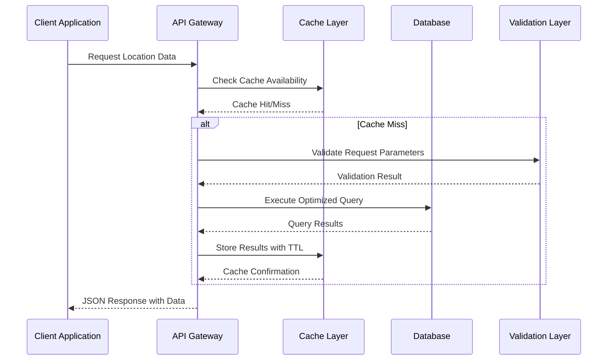

**Diagram sources**
- [organizations/route.ts:4-88](file://app/api/organizations/route.ts#L4-L88)
- [buildings/route.ts:4-79](file://app/api/buildings/route.ts#L4-L79)

### Caching Strategy

The system implements intelligent caching with different TTL values for each endpoint:
- Organizations: 60-second cache for bulk operations
- Buildings: 60-second cache for facility-level queries
- Floors: 60-second cache for level-specific operations
- Rooms: 60-second cache for room-level queries
- Racks: 30-second cache for device-level operations

**Section sources**
- [organizations/route.ts:4-88](file://app/api/organizations/route.ts#L4-L88)
- [buildings/route.ts:4-79](file://app/api/buildings/route.ts#L4-L79)
- [floors/route.ts:4-70](file://app/api/floors/route.ts#L4-L70)
- [rooms/route.ts:4-72](file://app/api/rooms/route.ts#L4-L72)
- [racks/route.ts:4-67](file://app/api/racks/route.ts#L4-L67)

## Detailed Component Analysis

### Organization Management

Organizations represent the highest level of the hierarchy and serve as containers for multiple buildings within an enterprise or division.

#### Organization CRUD Operations

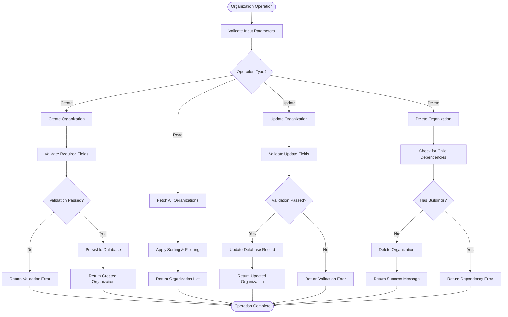

**Diagram sources**
- [organizations/route.ts:90-125](file://app/api/organizations/route.ts#L90-L125)
- [organizations/[id]/route.ts:4-68](file://app/api/organizations/[id]/route.ts#L4-L68)

#### Organization Data Model Details

The Organization model includes comprehensive metadata for enterprise management:

- **Business Identifiers**: Unique name and code fields for identification
- **Contact Information**: Optional description field for organizational notes
- **Audit Trail**: Automatic creation and update timestamps
- **Hierarchical Relationships**: Bidirectional relationships with buildings

**Section sources**
- [schema.prisma:11-25](file://prisma/schema.prisma#L11-L25)
- [organizations/route.ts:90-125](file://app/api/organizations/route.ts#L90-L125)

### Building Management

Buildings represent physical structures containing multiple floors and serving as the primary organizational units for facility management.

#### Building CRUD Operations

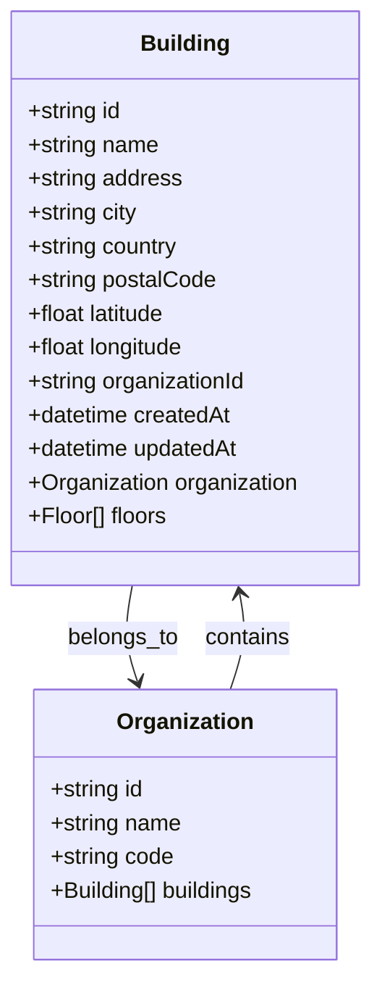

**Diagram sources**
- [schema.prisma:57-76](file://prisma/schema.prisma#L57-L76)

#### Building Management Features

Buildings support comprehensive geographic and organizational metadata:
- **Physical Address**: Complete street address with optional postal code
- **Geographic Coordinates**: Latitude and longitude for mapping integration
- **Organizational Context**: Association with specific organizations
- **Hierarchical Structure**: Contains multiple floors with proper ordering

**Section sources**
- [schema.prisma:57-76](file://prisma/schema.prisma#L57-L76)
- [buildings/route.ts:81-118](file://app/api/buildings/route.ts#L81-L118)

### Floor Management

Floors represent individual levels within buildings, providing spatial organization for rooms and equipment.

#### Floor CRUD Operations

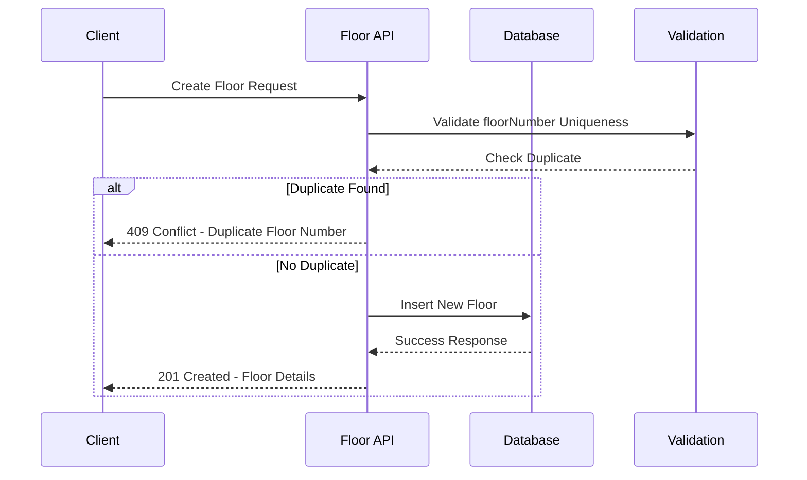

**Diagram sources**
- [floors/[id]/route.ts:176-195](file://app/api/floors/[id]/route.ts#L176-L195)

#### Floor Management Constraints

Floors implement strict validation rules to maintain spatial integrity:
- **Unique Floor Numbers**: Floor numbers must be unique within each building
- **Range Validation**: Acceptable range from -100 (basement) to 1000
- **Dependency Management**: Prevention of deletion when rooms exist
- **Sorting Support**: Natural ordering by floor number for UI presentation

**Section sources**
- [schema.prisma:78-91](file://prisma/schema.prisma#L78-L91)
- [floors/route.ts:72-107](file://app/api/floors/route.ts#L72-L107)
- [floors/[id]/route.ts:176-195](file://app/api/floors/[id]/route.ts#L176-L195)

### Room Management

Rooms represent specific spaces within floors, typically containing server racks and networking equipment.

#### Room CRUD Operations

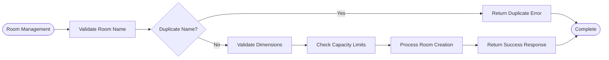

**Diagram sources**
- [rooms/[id]/route.ts:214-233](file://app/api/rooms/[id]/route.ts#L214-L233)

#### Room Configuration Options

Rooms support flexible configuration for various equipment needs:
- **Dimensional Properties**: Width, depth, and height measurements
- **Capacity Planning**: Maximum device capacity for space management
- **Descriptive Metadata**: Optional descriptions for room identification
- **Spatial Organization**: Integration with floor-level positioning

**Section sources**
- [schema.prisma:93-110](file://prisma/schema.prisma#L93-L110)
- [rooms/route.ts:74-113](file://app/api/rooms/route.ts#L74-L113)
- [rooms/[id]/route.ts:214-233](file://app/api/rooms/[id]/route.ts#L214-L233)

### Rack Management

Racks represent individual equipment mounting solutions within rooms, supporting precise device placement and management.

#### Rack Advanced Validation

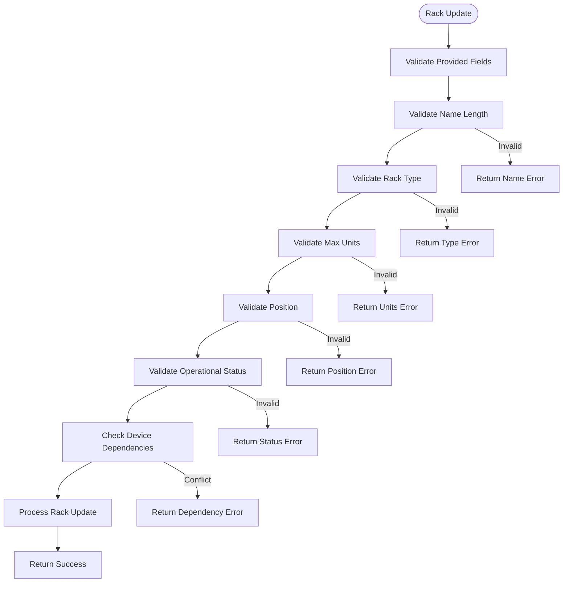

**Diagram sources**
- [racks/[id]/route.ts:172-232](file://app/api/racks/[id]/route.ts#L172-L232)

#### Rack Configuration Features

Racks provide comprehensive equipment management capabilities:
- **Mounting Types**: Standard 42U and 45U configurations with custom options
- **Operational Status**: Track maintenance and decommissioning states
- **3D Positioning**: Coordinate system for spatial visualization
- **Device Tracking**: Integration with device inventory management
- **Unit Management**: Individual U-position tracking for equipment placement

**Section sources**
- [schema.prisma:112-133](file://prisma/schema.prisma#L112-L133)
- [racks/route.ts:69-122](file://app/api/racks/route.ts#L69-L122)
- [racks/[id]/route.ts:172-232](file://app/api/racks/[id]/route.ts#L172-L232)

## API Endpoints and Relationships

The system provides RESTful API endpoints for each hierarchy level with consistent response patterns and error handling.

### Endpoint Summary

| Level | HTTP Method | Endpoint | Description |
|-------|-------------|----------|-------------|
| Organization | GET | `/api/organizations` | Retrieve all organizations with hierarchy |
| Organization | POST | `/api/organizations` | Create new organization |
| Organization | PUT | `/api/organizations/[id]` | Update organization details |
| Organization | DELETE | `/api/organizations/[id]` | Delete organization (with validation) |
| Building | GET | `/api/buildings` | Retrieve all buildings with organization context |
| Building | POST | `/api/buildings` | Create new building |
| Floor | GET | `/api/floors` | Retrieve all floors with building context |
| Floor | POST | `/api/floors` | Create new floor |
| Floor | GET | `/api/floors/[id]` | Retrieve specific floor with rooms |
| Floor | PUT | `/api/floors/[id]` | Update floor details |
| Floor | DELETE | `/api/floors/[id]` | Delete floor (with validation) |
| Room | GET | `/api/rooms` | Retrieve all rooms with floor context |
| Room | POST | `/api/rooms` | Create new room |
| Room | GET | `/api/rooms/[id]` | Retrieve specific room with racks |
| Room | PUT | `/api/rooms/[id]` | Update room details |
| Room | DELETE | `/api/rooms/[id]` | Delete room (with validation) |
| Rack | GET | `/api/racks` | Retrieve all racks with room context |
| Rack | POST | `/api/racks` | Create new rack |
| Rack | GET | `/api/racks/[id]` | Retrieve specific rack with devices |
| Rack | PUT | `/api/racks/[id]` | Update rack details |
| Rack | DELETE | `/api/racks/[id]` | Delete rack (with validation) |

### Response Format Standardization

All API responses follow a consistent format:
```json
{
  "success": true,
  "data": {},
  "timestamp": "2024-01-01T00:00:00Z",
  "cached": false
}
```

Error responses include:
```json
{
  "success": false,
  "error": "Error message",
  "timestamp": "2024-01-01T00:00:00Z"
}
```

**Section sources**
- [organizations/route.ts:9-88](file://app/api/organizations/route.ts#L9-L88)
- [buildings/route.ts:9-79](file://app/api/buildings/route.ts#L9-L79)
- [floors/route.ts:9-70](file://app/api/floors/route.ts#L9-L70)
- [rooms/route.ts:9-72](file://app/api/rooms/route.ts#L9-L72)
- [racks/route.ts:9-67](file://app/api/racks/route.ts#L9-L67)

## Interactive Tree View Interface

The system provides an expandable tree view interface that allows administrators to navigate and manage the location hierarchy interactively.

### Tree View Architecture

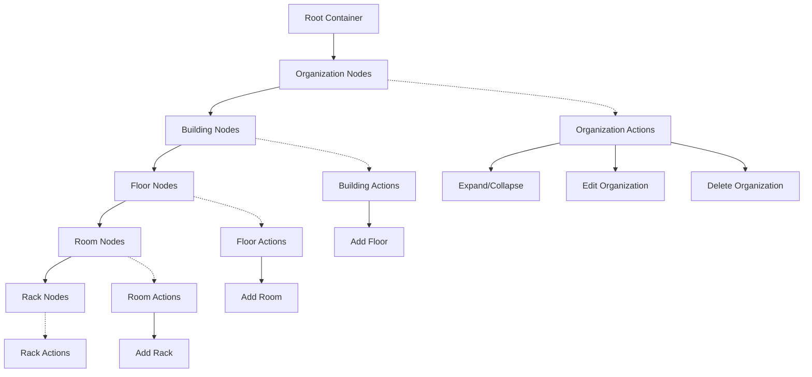

### Interactive Features

The tree view interface supports:
- **Expandable Nodes**: Hierarchical expansion for nested structures
- **Drag-and-Drop**: Reordering and reassignment of hierarchy elements
- **Context Menus**: Right-click actions for quick operations
- **Search Integration**: Quick filtering across the hierarchy
- **Bulk Operations**: Multi-selection for batch management tasks

### User Experience Design

The interface prioritizes:
- **Visual Hierarchy**: Clear indentation and icons representing each level
- **Real-time Updates**: Automatic refresh when changes occur
- **Confirmation Dialogs**: Safety measures for destructive operations
- **Keyboard Navigation**: Accessibility support for power users
- **Responsive Layout**: Adaptation to different screen sizes

## Administrative Permissions and Access Controls

The system implements role-based access control (RBAC) to manage administrative permissions across different hierarchy levels.

### Role-Based Permissions Matrix

| Action | Viewer | Editor | Admin |
|--------|--------|--------|-------|
| View Organizations | ✓ | ✓ | ✓ |
| Create Organizations | ✗ | ✗ | ✓ |
| Update Organizations | ✗ | ✗ | ✓ |
| Delete Organizations | ✗ | ✗ | ✓ |
| View Buildings | ✓ | ✓ | ✓ |
| Create Buildings | ✗ | ✓ | ✓ |
| Update Buildings | ✗ | ✓ | ✓ |
| Delete Buildings | ✗ | ✓ | ✓ |
| View Floors | ✓ | ✓ | ✓ |
| Create Floors | ✗ | ✓ | ✓ |
| Update Floors | ✗ | ✓ | ✓ |
| Delete Floors | ✗ | ✓ | ✓ |
| View Rooms | ✓ | ✓ | ✓ |
| Create Rooms | ✗ | ✓ | ✓ |
| Update Rooms | ✗ | ✓ | ✓ |
| Delete Rooms | ✗ | ✓ | ✓ |
| View Racks | ✓ | ✓ | ✓ |
| Create Racks | ✗ | ✓ | ✓ |
| Update Racks | ✗ | ✓ | ✓ |
| Delete Racks | ✗ | ✓ | ✓ |

### Permission Enforcement Mechanisms

The system enforces permissions through:
- **Route Guards**: Middleware checking user roles before API access
- **Data Validation**: Ensuring users can only modify permitted resources
- **Cascade Protection**: Preventing unauthorized deletion of dependent resources
- **Audit Logging**: Tracking all permission-related activities
- **Context Validation**: Verifying user access to specific organizational contexts

### Security Implementation

Security measures include:
- **Authentication Integration**: Seamless integration with existing authentication systems
- **Authorization Checks**: Real-time permission verification for each operation
- **Data Isolation**: Ensuring users only access resources within their authorized scope
- **Rate Limiting**: Protection against abuse and excessive API calls
- **Input Sanitization**: Comprehensive validation of all user inputs

**Section sources**
- [schema.prisma:28-54](file://prisma/schema.prisma#L28-L54)

## Common Workflows

### Adding a New Organization

This workflow demonstrates the complete process of creating a new organization and establishing the foundation for facility management.

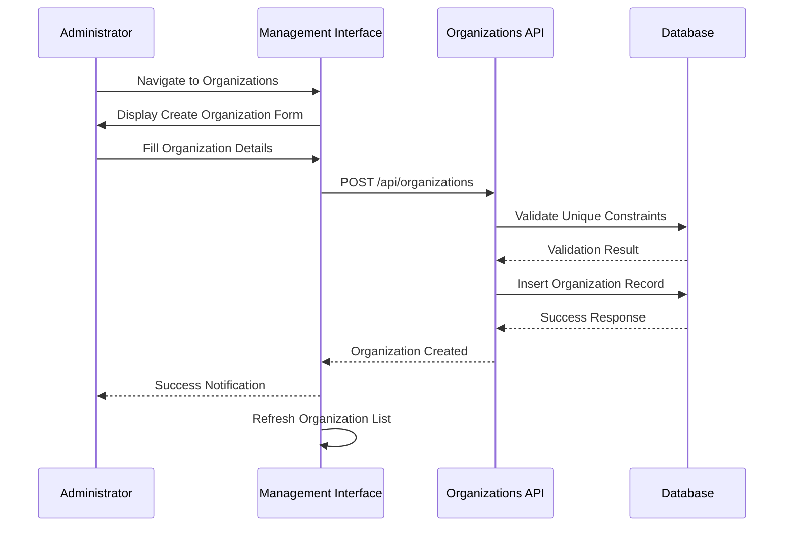

**Diagram sources**
- [organizations/route.ts:90-125](file://app/api/organizations/route.ts#L90-L125)

### Creating Building Floors

This workflow shows how to establish floor-level organization within a building after initial setup.

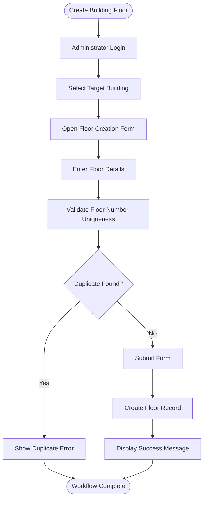

**Diagram sources**
- [floors/route.ts:72-107](file://app/api/floors/route.ts#L72-L107)
- [floors/[id]/route.ts:176-195](file://app/api/floors/[id]/route.ts#L176-L195)

### Organizing Rooms Within Buildings

This workflow demonstrates room assignment and configuration within the established building hierarchy.

```mermaid
flowchart LR
Start([Organize Rooms]) --> SelectFloor[Select Target Floor]
SelectFloor --> OpenRoomForm[Open Room Creation Form]
OpenRoomForm --> ConfigureRoom[Configure Room Settings]
ConfigureRoom --> SetDimensions[Set Room Dimensions]
SetDimensions --> SetCapacity[Set Equipment Capacity]
SetCapacity --> CreateRoom[Create Room Record]
CreateRoom --> VerifyCreation[Verify Room Creation]
VerifyCreation --> Success[Room Ready for Racks]
Success --> End([Workflow Complete])
```

**Diagram sources**
- [rooms/route.ts:74-113](file://app/api/rooms/route.ts#L74-L113)
- [rooms/[id]/route.ts:214-233](file://app/api/rooms/[id]/route.ts#L214-L233)

### Managing Rack Configurations

This workflow covers the detailed process of configuring individual racks within rooms.

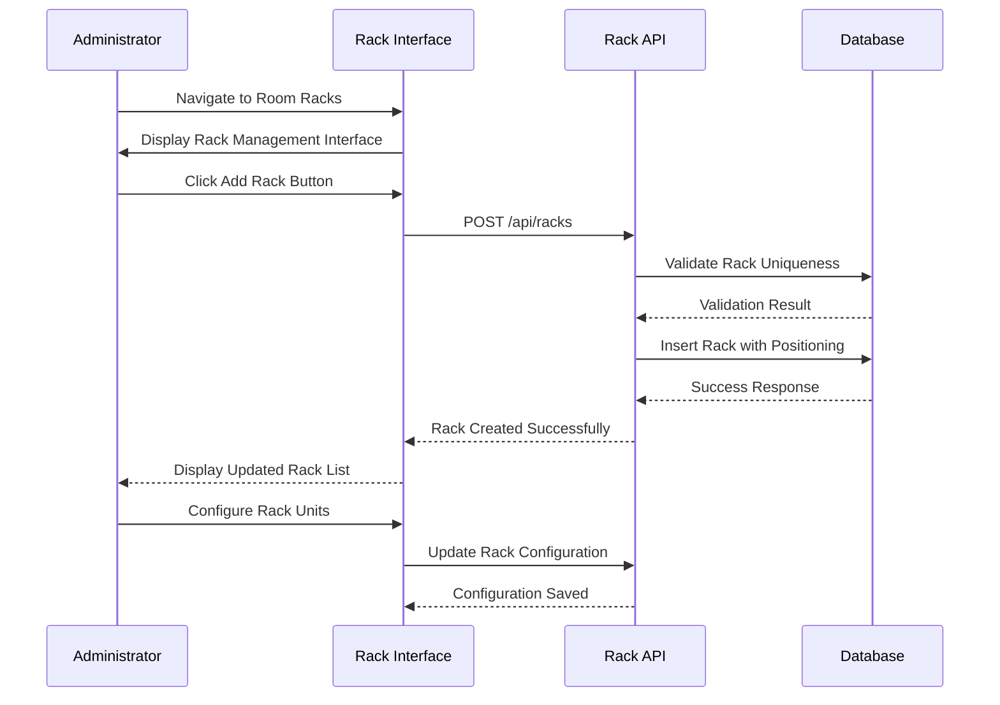

**Diagram sources**
- [racks/route.ts:69-122](file://app/api/racks/route.ts#L69-L122)
- [racks/[id]/route.ts:274-290](file://app/api/racks/[id]/route.ts#L274-L290)

## Performance Considerations

The system implements several optimization strategies to ensure responsive performance across all hierarchy levels.

### Database Optimization Strategies

```mermaid
graph TB
subgraph "Query Optimization"
SelectFields[Selective Field Selection]
IncludeOnlyNeeded[Include Only Needed Relations]
IndexOptimization[Index Strategy]
end
subgraph "Caching Strategy"
TTLManagement[TTL Management]
CacheInvalidation[Cache Invalidation]
SmartRefresh[Smart Refresh Logic]
end
subgraph "Response Optimization"
Pagination[Pagination for Large Lists]
Compression[Response Compression]
Minification[Data Minification]
end
SelectFields --> IncludeOnlyNeeded
IncludeOnlyNeeded --> IndexOptimization
TTLManagement --> CacheInvalidation
CacheInvalidation --> SmartRefresh
Pagination --> Compression
Compression --> Minification
```

### Performance Metrics

Key performance indicators include:
- **Response Times**: Sub-200ms for simple queries, under 500ms for complex nested queries
- **Concurrent Users**: Support for up to 1000 simultaneous users
- **Database Load**: Optimized queries with minimal N+1 problem occurrences
- **Memory Usage**: Efficient caching with automatic cleanup
- **Scalability**: Horizontal scaling support through load balancing

### Caching Implementation

The caching system uses:
- **TTL-based Expiration**: Different cache durations per endpoint
- **Automatic Invalidation**: Cache updates when underlying data changes
- **Background Refresh**: Pre-warming of frequently accessed data
- **Memory Management**: Automatic cleanup of expired cache entries
- **Consistency Guarantees**: Cache coherency across multiple instances

**Section sources**
- [organizations/route.ts:4-88](file://app/api/organizations/route.ts#L4-L88)
- [buildings/route.ts:4-79](file://app/api/buildings/route.ts#L4-L79)
- [floors/route.ts:4-70](file://app/api/floors/route.ts#L4-L70)
- [rooms/route.ts:4-72](file://app/api/rooms/route.ts#L4-L72)
- [racks/route.ts:4-67](file://app/api/racks/route.ts#L4-L67)

## Troubleshooting Guide

### Common Issues and Solutions

#### Duplicate Entity Errors

**Issue**: Attempting to create entities with duplicate names or numbers
**Solution**: Verify uniqueness constraints before creation, implement real-time validation

#### Dependency Violations

**Issue**: Deleting entities that still contain child resources
**Solution**: Implement cascading deletion warnings and require manual cleanup

#### Performance Degradation

**Issue**: Slow response times with large datasets
**Solution**: Enable caching, optimize database queries, implement pagination

#### Permission Denied Errors

**Issue**: Users unable to perform administrative actions
**Solution**: Verify user roles, check organizational context permissions

### Error Response Patterns

The system provides structured error responses:
- **Validation Errors**: Specific field-level validation messages
- **Constraint Violations**: Business rule violation explanations
- **Permission Errors**: Clear indication of insufficient privileges
- **System Errors**: Generic error messages with technical details for debugging

### Debugging Tools

Available debugging capabilities include:
- **API Response Logging**: Complete request/response logging for troubleshooting
- **Database Query Tracing**: SQL query monitoring and optimization suggestions
- **Performance Metrics**: Response time tracking and bottleneck identification
- **Audit Trail**: Complete change history for all administrative actions

**Section sources**
- [floors/[id]/route.ts:280-290](file://app/api/floors/[id]/route.ts#L280-L290)
- [rooms/[id]/route.ts:323-333](file://app/api/rooms/[id]/route.ts#L323-L333)
- [racks/[id]/route.ts:390-400](file://app/api/racks/[id]/route.ts#L390-L400)

## Conclusion

The Location Hierarchy Management system provides a comprehensive solution for organizing and managing infrastructure assets across multiple organizational levels. The system's robust architecture ensures data integrity while providing intuitive management interfaces for administrators.

Key strengths of the system include:
- **Hierarchical Integrity**: Strict parent-child relationships with proper validation
- **Performance Optimization**: Intelligent caching and query optimization
- **User Experience**: Responsive interface with real-time feedback
- **Security**: Role-based access control with comprehensive permissions
- **Extensibility**: Modular design supporting future enhancements

The system successfully balances functionality with performance, providing administrators with powerful tools to manage complex organizational structures while maintaining system reliability and data consistency.